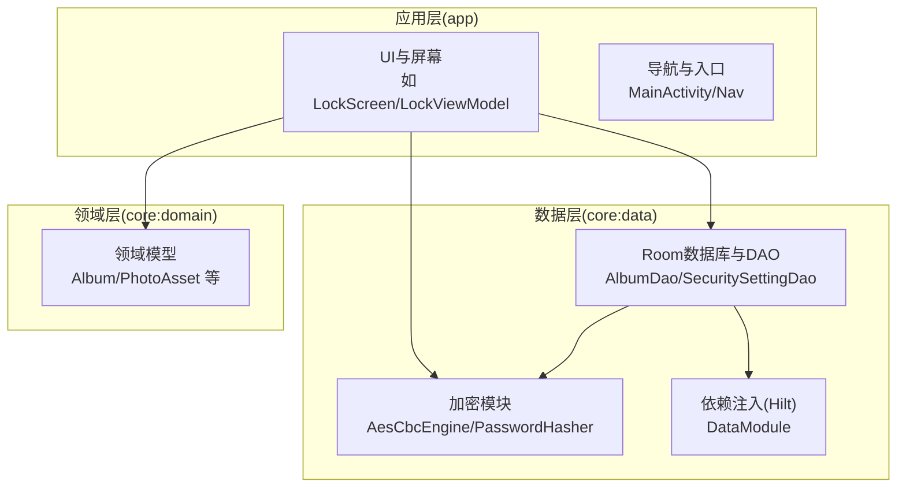
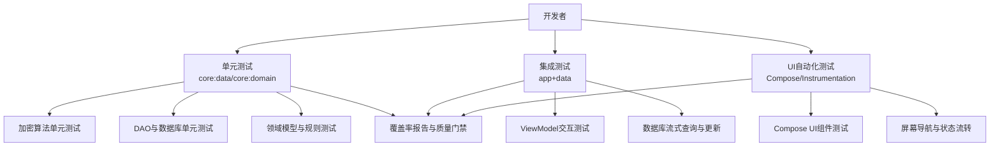
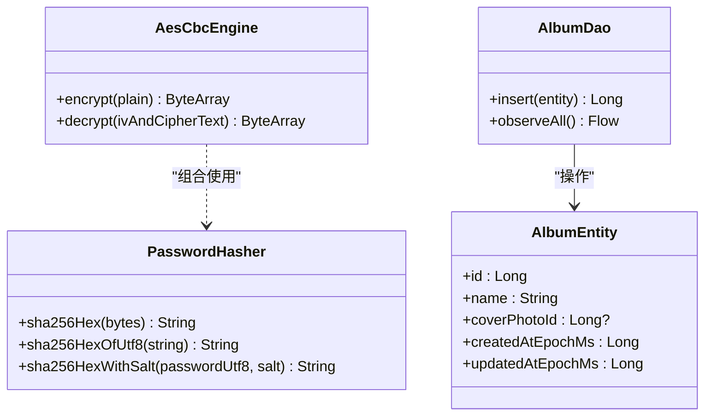
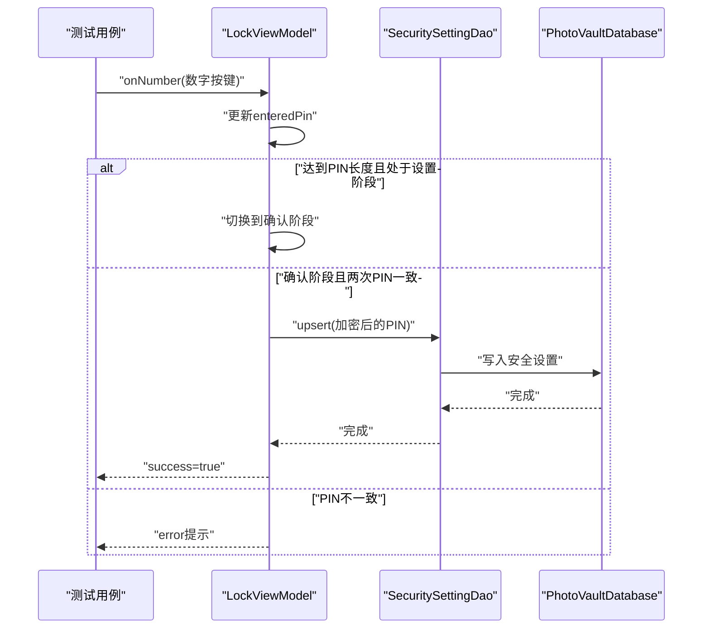
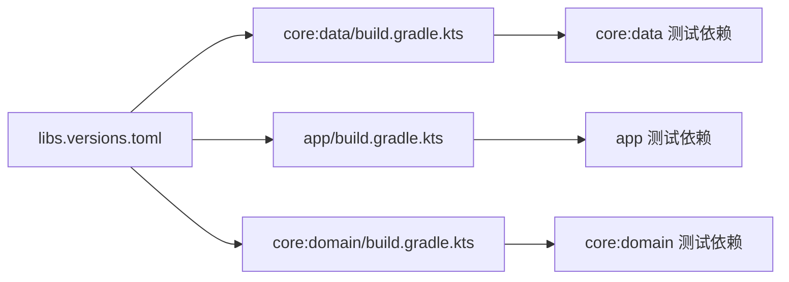

# 测试策略

<cite>
**本文引用的文件**
- [android/app/src/main/kotlin/com/photovault/app/ui/lock/LockViewModel.kt](file://android/app/src/main/kotlin/com/photovault/app/ui/lock/LockViewModel.kt)
- [android/core/data/src/test/kotlin/com/photovault/data/crypto/AesCbcEngineTest.kt](file://android/core/data/src/test/kotlin/com/photovault/data/crypto/AesCbcEngineTest.kt)
- [android/core/data/src/test/kotlin/com/photovault/data/crypto/PasswordHasherTest.kt](file://android/core/data/src/test/kotlin/com/photovault/data/crypto/PasswordHasherTest.kt)
- [android/core/data/src/test/kotlin/com/photovault/data/db/AlbumDaoRobolectricTest.kt](file://android/core/data/src/test/kotlin/com/photovault/data/db/AlbumDaoRobolectricTest.kt)
- [android/core/data/src/main/kotlin/com/photovault/data/crypto/AesCbcEngine.kt](file://android/core/data/src/main/kotlin/com/photovault/data/crypto/AesCbcEngine.kt)
- [android/core/data/src/main/kotlin/com/photovault/data/crypto/PasswordHasher.kt](file://android/core/data/src/main/kotlin/com/photovault/data/crypto/PasswordHasher.kt)
- [android/core/data/src/main/kotlin/com/photovault/data/db/dao/AlbumDao.kt](file://android/core/data/src/main/kotlin/com/photovault/data/db/dao/AlbumDao.kt)
- [android/core/data/src/main/kotlin/com/photovault/data/db/entity/AlbumEntity.kt](file://android/core/data/src/main/kotlin/com/photovault/data/db/entity/AlbumEntity.kt)
- [android/app/build.gradle.kts](file://android/app/build.gradle.kts)
- [android/core/data/build.gradle.kts](file://android/core/data/build.gradle.kts)
- [android/core/domain/build.gradle.kts](file://android/core/domain/build.gradle.kts)
- [android/gradle/libs.versions.toml](file://android/gradle/libs.versions.toml)
</cite>

## 目录
1. [引言](#引言)
2. [项目结构](#项目结构)
3. [核心组件](#核心组件)
4. [架构总览](#架构总览)
5. [详细组件分析](#详细组件分析)
6. [依赖分析](#依赖分析)
7. [性能考虑](#性能考虑)
8. [故障排查指南](#故障排查指南)
9. [结论](#结论)
10. [附录](#附录)

## 引言
本测试策略文档面向AI照片保险库项目的测试工程师与开发者，围绕单元测试、集成测试、UI测试、性能与压力测试、测试覆盖率与质量标准、以及持续集成与自动化测试流水线进行系统化设计与落地建议。文档基于当前仓库中的实际代码与构建配置，确保测试方案可执行、可度量、可持续改进。

## 项目结构
项目采用多模块结构，核心与应用层分离，便于独立测试与职责划分：
- 应用层（app）：包含UI、导航、主题与业务界面，负责用户交互与状态展示。
- 数据层（core:data）：包含数据库、加密、依赖注入与数据访问层，承担数据持久化与安全处理。
- 领域层（core:domain）：纯Kotlin逻辑层，承载业务模型与领域规则，便于跨平台复用与无框架测试。

图表来源
- [android/app/src/main/kotlin/com/photovault/app/ui/lock/LockViewModel.kt:1-222](file://android/app/src/main/kotlin/com/photovault/app/ui/lock/LockViewModel.kt#L1-L222)
- [android/core/data/src/main/kotlin/com/photovault/data/crypto/AesCbcEngine.kt:1-40](file://android/core/data/src/main/kotlin/com/photovault/data/crypto/AesCbcEngine.kt#L1-L40)
- [android/core/data/src/main/kotlin/com/photovault/data/crypto/PasswordHasher.kt:1-26](file://android/core/data/src/main/kotlin/com/photovault/data/crypto/PasswordHasher.kt#L1-L26)
- [android/core/data/src/main/kotlin/com/photovault/data/db/dao/AlbumDao.kt:1-18](file://android/core/data/src/main/kotlin/com/photovault/data/db/dao/AlbumDao.kt#L1-L18)

章节来源
- [android/app/build.gradle.kts:1-91](file://android/app/build.gradle.kts#L1-L91)
- [android/core/data/build.gradle.kts:1-48](file://android/core/data/build.gradle.kts#L1-L48)
- [android/core/domain/build.gradle.kts:1-13](file://android/core/domain/build.gradle.kts#L1-L13)

## 核心组件
- 加密模块：提供对称加密与口令哈希能力，保障PIN与敏感数据安全。
- 数据库与DAO：基于Room实现实体持久化与查询，支持协程与流式观察。
- ViewModel与UI：以状态驱动的方式管理界面行为，包含PIN设置、解锁与生物识别交互。
- 依赖注入：通过Hilt在各层解耦服务与数据源。

章节来源
- [android/core/data/src/main/kotlin/com/photovault/data/crypto/AesCbcEngine.kt:1-40](file://android/core/data/src/main/kotlin/com/photovault/data/crypto/AesCbcEngine.kt#L1-L40)
- [android/core/data/src/main/kotlin/com/photovault/data/crypto/PasswordHasher.kt:1-26](file://android/core/data/src/main/kotlin/com/photovault/data/crypto/PasswordHasher.kt#L1-L26)
- [android/core/data/src/main/kotlin/com/photovault/data/db/dao/AlbumDao.kt:1-18](file://android/core/data/src/main/kotlin/com/photovault/data/db/dao/AlbumDao.kt#L1-L18)
- [android/app/src/main/kotlin/com/photovault/app/ui/lock/LockViewModel.kt:1-222](file://android/app/src/main/kotlin/com/photovault/app/ui/lock/LockViewModel.kt#L1-L222)

## 架构总览
下图展示了测试策略在分层架构中的定位与交互：

## 详细组件分析

### 单元测试策略与最佳实践
- 测试框架与断言
  - 使用 JUnit 作为基础测试框架，Truth 提供更自然的断言风格。
  - 在数据层与领域层，优先使用 Truth 断言库进行结果校验。
- 加密模块测试
  - 目标：验证加解密往返一致性、输出长度与格式、口令哈希确定性与正确性。
  - 方法：构造固定密钥与明文，断言解密结果等于原始明文；使用已知向量验证哈希值。
  - 参考文件：[AesCbcEngineTest.kt:1-19](file://android/core/data/src/test/kotlin/com/photovault/data/crypto/AesCbcEngineTest.kt#L1-L19)、[PasswordHasherTest.kt:1-24](file://android/core/data/src/test/kotlin/com/photovault/data/crypto/PasswordHasherTest.kt#L1-L24)
- DAO与数据库测试
  - 目标：验证插入、查询、排序与流式观察的行为。
  - 方法：使用 Robolectric + Room 内存数据库，模拟真实SDK环境，避免真机依赖。
  - 参考文件：[AlbumDaoRobolectricTest.kt:1-50](file://android/core/data/src/test/kotlin/com/photovault/data/db/AlbumDaoRobolectricTest.kt#L1-L50)、[AlbumDao.kt:1-18](file://android/core/data/src/main/kotlin/com/photovault/data/db/dao/AlbumDao.kt#L1-L18)、[AlbumEntity.kt:1-19](file://android/core/data/src/main/kotlin/com/photovault/data/db/entity/AlbumEntity.kt#L1-L19)
- Mock对象使用
  - 建议：对依赖外部系统的组件（如Keystore、网络、系统服务）使用Mock或替换实现，确保测试稳定与可重复。
  - 适用场景：加密引擎的密钥提供者、数据库事务、网络请求等。

图表来源
- [android/core/data/src/main/kotlin/com/photovault/data/crypto/AesCbcEngine.kt:1-40](file://android/core/data/src/main/kotlin/com/photovault/data/crypto/AesCbcEngine.kt#L1-L40)
- [android/core/data/src/main/kotlin/com/photovault/data/crypto/PasswordHasher.kt:1-26](file://android/core/data/src/main/kotlin/com/photovault/data/crypto/PasswordHasher.kt#L1-L26)
- [android/core/data/src/main/kotlin/com/photovault/data/db/dao/AlbumDao.kt:1-18](file://android/core/data/src/main/kotlin/com/photovault/data/db/dao/AlbumDao.kt#L1-L18)
- [android/core/data/src/main/kotlin/com/photovault/data/db/entity/AlbumEntity.kt:1-19](file://android/core/data/src/main/kotlin/com/photovault/data/db/entity/AlbumEntity.kt#L1-L19)

章节来源
- [android/core/data/src/test/kotlin/com/photovault/data/crypto/AesCbcEngineTest.kt:1-19](file://android/core/data/src/test/kotlin/com/photovault/data/crypto/AesCbcEngineTest.kt#L1-L19)
- [android/core/data/src/test/kotlin/com/photovault/data/crypto/PasswordHasherTest.kt:1-24](file://android/core/data/src/test/kotlin/com/photovault/data/crypto/PasswordHasherTest.kt#L1-L24)
- [android/core/data/src/test/kotlin/com/photovault/data/db/AlbumDaoRobolectricTest.kt:1-50](file://android/core/data/src/test/kotlin/com/photovault/data/db/AlbumDaoRobolectricTest.kt#L1-L50)

### 集成测试设计与实现
- 目标：验证模块间协作、数据流与状态流转，确保端到端功能闭环。
- 关键点：
  - ViewModel与数据库：验证PIN设置、解锁、失败计数与生物识别状态更新。
  - DAO与数据库：验证插入后查询、排序与流式观察的一致性。
- 流程示例：PIN设置流程（设置→确认→保存→成功）

图表来源
- [android/app/src/main/kotlin/com/photovault/app/ui/lock/LockViewModel.kt:1-222](file://android/app/src/main/kotlin/com/photovault/app/ui/lock/LockViewModel.kt#L1-L222)

章节来源
- [android/app/src/main/kotlin/com/photovault/app/ui/lock/LockViewModel.kt:1-222](file://android/app/src/main/kotlin/com/photovault/app/ui/lock/LockViewModel.kt#L1-L222)

### UI测试自动化方法与工具选择
- 工具链：
  - Jetpack Compose Testing：针对可组合函数与UI组件进行单元级测试。
  - AndroidX Instrumentation Tests：针对屏幕、导航与交互进行端到端测试。
  - Robolectric：在JVM上运行Android框架代码，加速单元测试。
- 建议：
  - UI组件测试：使用Compose测试仪与断言，覆盖不同状态与交互分支。
  - 屏幕测试：验证导航链路、状态变更与动画时序。
  - 资源与主题：确保UI符合设计规范，避免视觉漂移。

章节来源
- [android/app/build.gradle.kts:1-91](file://android/app/build.gradle.kts#L1-L91)
- [android/gradle/libs.versions.toml:23-54](file://android/gradle/libs.versions.toml#L23-L54)

### 性能测试与压力测试
- 单元与集成性能：
  - 加密吞吐：测量加解密耗时与内存占用，确保在主线程外执行或异步调度。
  - 数据库批量写入：评估插入、更新与查询在大数据量下的延迟与稳定性。
- UI性能：
  - 动画与过渡：验证动画时长与帧率，避免阻塞主线程。
  - 大列表渲染：对相册与照片列表进行滚动性能测试。
- 压力测试建议：
  - 并发写入：模拟高并发场景下的数据库锁与事务冲突。
  - 资源竞争：在低端设备或受限内存环境下评估稳定性。

## 依赖分析
- 测试依赖版本与插件：
  - JUnit、Truth、Robolectric、AndroidX Test Core等在libs.versions.toml中集中管理。
  - 数据层与应用层分别配置测试编译依赖，确保隔离与可维护性。
- 依赖关系图：

图表来源
- [android/gradle/libs.versions.toml:1-64](file://android/gradle/libs.versions.toml#L1-L64)
- [android/core/data/build.gradle.kts:1-48](file://android/core/data/build.gradle.kts#L1-L48)
- [android/app/build.gradle.kts:1-91](file://android/app/build.gradle.kts#L1-L91)
- [android/core/domain/build.gradle.kts:1-13](file://android/core/domain/build.gradle.kts#L1-L13)

章节来源
- [android/gradle/libs.versions.toml:1-64](file://android/gradle/libs.versions.toml#L1-L64)
- [android/core/data/build.gradle.kts:1-48](file://android/core/data/build.gradle.kts#L1-L48)
- [android/app/build.gradle.kts:1-91](file://android/app/build.gradle.kts#L1-L91)
- [android/core/domain/build.gradle.kts:1-13](file://android/core/domain/build.gradle.kts#L1-L13)

## 性能考虑
- 加密与数据库操作应避免在主线程执行，使用协程或后台线程池。
- UI动画与渲染尽量使用轻量级可组合函数，减少重组开销。
- 测试中引入基准测试（Benchmark）以量化性能指标，建立回归阈值。

## 故障排查指南
- 常见问题与定位：
  - 加密失败：检查密钥长度、IV生成与填充模式是否一致。
  - 数据库异常：确认Room迁移脚本、索引与并发写入策略。
  - UI状态错乱：核对ViewModel状态更新与生命周期，避免竞态条件。
- 日志与监控：
  - 在测试中输出关键参数与中间结果，便于复现与定位。
  - 结合Firebase或日志平台收集崩溃与异常信息。

## 结论
通过分层测试策略与工具链的协同，AI照片保险库能够在功能正确性、性能稳定性与用户体验之间取得平衡。建议以单元测试为基础、集成测试为桥梁、UI测试为保障，并辅以性能与压力测试，形成完整质量闭环。

## 附录
- 测试覆盖率与质量标准（建议）
  - 单元测试：核心算法与关键DAO至少达到80%行覆盖率。
  - 集成测试：关键业务流程（如PIN设置/解锁）100%覆盖。
  - UI测试：关键屏幕与交互路径100%覆盖。
  - 质量门禁：未达标的PR禁止合并，覆盖率低于阈值触发告警。
- 持续集成与自动化测试流水线（建议）
  - 触发条件：PR与主干推送自动触发。
  - 步骤：依赖安装 → 编译 → 单元测试 → 集成测试 → UI测试 → 覆盖率统计 → 报告发布。
  - 缓存与加速：启用Gradle与依赖缓存，使用并行任务提升效率。
  - 报告：生成并上传覆盖率报告与测试结果，便于追溯与审计。