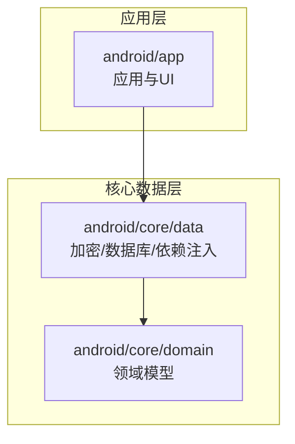
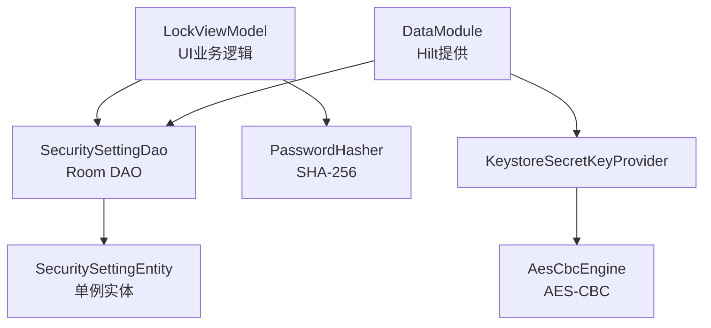
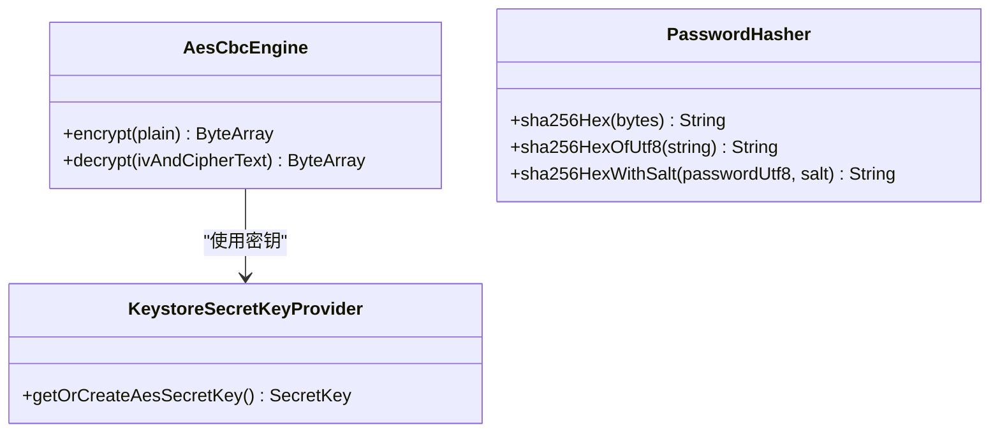
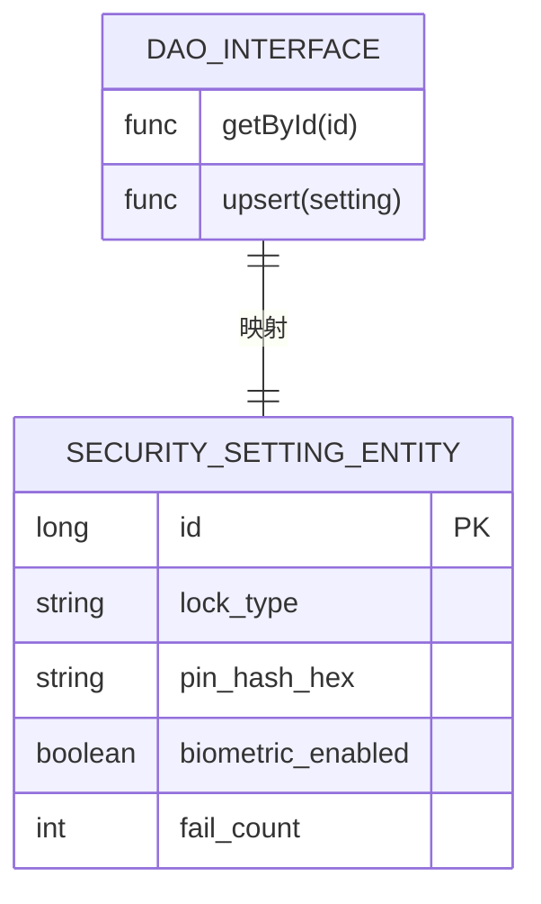
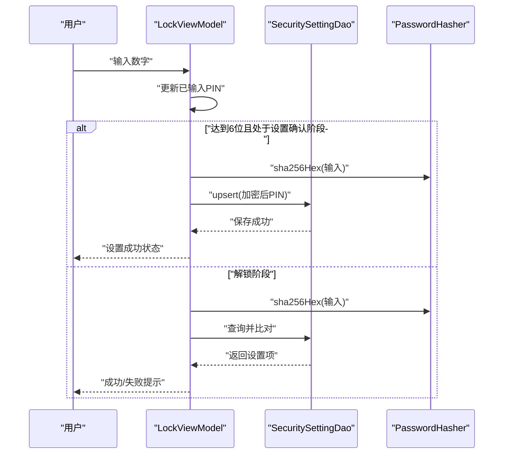
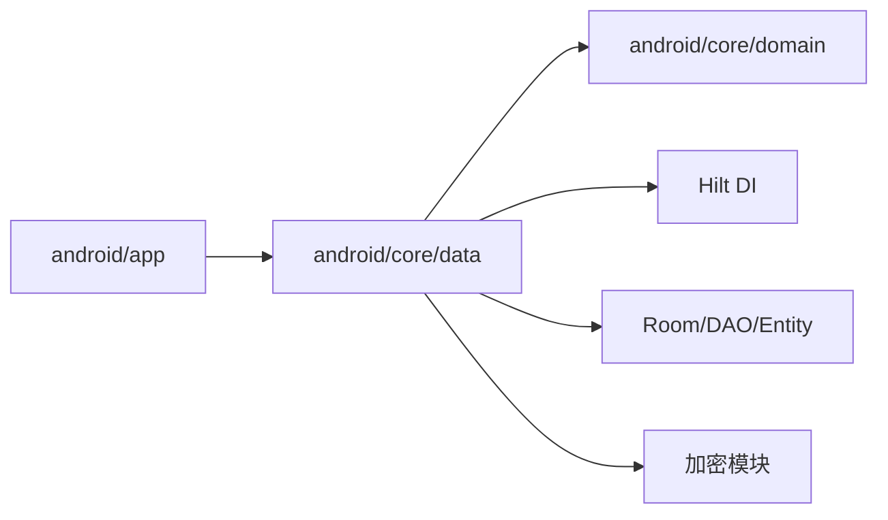

# 测试覆盖率

<cite>
**本文引用的文件**
- [android/app/build.gradle.kts](file://android/app/build.gradle.kts)
- [android/core/data/build.gradle.kts](file://android/core/data/build.gradle.kts)
- [android/gradle/libs.versions.toml](file://android/gradle/libs.versions.toml)
- [android/core/data/src/test/kotlin/com/photovault/data/crypto/AesCbcEngineTest.kt](file://android/core/data/src/test/kotlin/com/photovault/data/crypto/AesCbcEngineTest.kt)
- [android/core/data/src/test/kotlin/com/photovault/data/crypto/PasswordHasherTest.kt](file://android/core/data/src/test/kotlin/com/photovault/data/crypto/PasswordHasherTest.kt)
- [android/core/data/src/test/kotlin/com/photovault/data/db/AlbumDaoRobolectricTest.kt](file://android/core/data/src/test/kotlin/com/photovault/data/db/AlbumDaoRobolectricTest.kt)
- [android/core/data/src/main/kotlin/com/photovault/data/crypto/AesCbcEngine.kt](file://android/core/data/src/main/kotlin/com/photovault/data/crypto/AesCbcEngine.kt)
- [android/core/data/src/main/kotlin/com/photovault/data/crypto/PasswordHasher.kt](file://android/core/data/src/main/kotlin/com/photovault/data/crypto/PasswordHasher.kt)
- [android/core/data/src/main/kotlin/com/photovault/data/crypto/KeystoreSecretKeyProvider.kt](file://android/core/data/src/main/kotlin/com/photovault/data/crypto/KeystoreSecretKeyProvider.kt)
- [android/core/data/src/main/kotlin/com/photovault/data/db/dao/SecuritySettingDao.kt](file://android/core/data/src/main/kotlin/com/photovault/data/db/dao/SecuritySettingDao.kt)
- [android/core/data/src/main/kotlin/com/photovault/data/db/entity/SecuritySettingEntity.kt](file://android/core/data/src/main/kotlin/com/photovault/data/db/entity/SecuritySettingEntity.kt)
- [android/core/data/src/main/kotlin/com/photovault/data/di/DataModule.kt](file://android/core/data/src/main/kotlin/com/photovault/data/di/DataModule.kt)
- [android/app/src/main/kotlin/com/photovault/app/ui/lock/LockViewModel.kt](file://android/app/src/main/kotlin/com/photovault/app/ui/lock/LockViewModel.kt)
</cite>

## 目录
1. [简介](#简介)
2. [项目结构](#项目结构)
3. [核心组件](#核心组件)
4. [架构总览](#架构总览)
5. [详细组件分析](#详细组件分析)
6. [依赖关系分析](#依赖关系分析)
7. [性能考量](#性能考量)
8. [故障排查指南](#故障排查指南)
9. [结论](#结论)
10. [附录](#附录)

## 简介
本文件面向“AI照片保险库”项目的测试覆盖率文档，聚焦以下目标：
- 明确测试覆盖率的测量方法与工具配置现状
- 给出核心加密模块、数据层、UI层的覆盖率目标与要求
- 解释覆盖率报告的解读方法与改进策略
- 提供提升覆盖率的最佳实践，包括关键路径、边界条件与异常场景测试

当前仓库未包含 JaCoCo 插件或覆盖率任务配置，因此本文件在“工具配置”部分给出建议方案，并结合现有单元测试与 Robolectric 测试，评估当前覆盖率水平与缺口。

## 项目结构
项目采用多模块结构，核心与应用层分离：
- 应用层（android/app）：包含 UI、业务 ViewModel、应用入口与资源
- 数据层（android/core/data）：包含加密、数据库（Room）、依赖注入与 DAO/Entity
- 领域模型（android/core/domain）：纯 Kotlin 模型定义

图表来源
- [android/app/build.gradle.kts:63-90](file://android/app/build.gradle.kts#L63-L90)
- [android/core/data/build.gradle.kts:31-47](file://android/core/data/build.gradle.kts#L31-L47)

章节来源
- [android/app/build.gradle.kts:1-91](file://android/app/build.gradle.kts#L1-L91)
- [android/core/data/build.gradle.kts:1-48](file://android/core/data/build.gradle.kts#L1-L48)
- [android/gradle/libs.versions.toml:1-64](file://android/gradle/libs.versions.toml#L1-L64)

## 核心组件
本节从测试覆盖角度梳理关键模块与测试现状：

- 加密模块
  - AesCbcEngine：实现 AES-CBC 加解密，含 IV 生成与拼接逻辑
  - PasswordHasher：SHA-256 哈希与带盐哈希
  - KeystoreSecretKeyProvider：Android Keystore 密钥提供与生成
  - 测试：AesCbcEngineTest、PasswordHasherTest

- 数据层
  - Room 数据库与 DAO：SecuritySettingDao、SecuritySettingEntity
  - DataModule：Hilt 提供数据库、密钥提供器与加密引擎
  - 测试：AlbumDaoRobolectricTest（基于 Robolectric 的内存数据库）

- UI 层
  - LockViewModel：PIN 设置/校验、生物识别集成、状态流转
  - 测试：当前未见针对 LockViewModel 的单元测试

章节来源
- [android/core/data/src/main/kotlin/com/photovault/data/crypto/AesCbcEngine.kt:1-40](file://android/core/data/src/main/kotlin/com/photovault/data/crypto/AesCbcEngine.kt#L1-L40)
- [android/core/data/src/main/kotlin/com/photovault/data/crypto/PasswordHasher.kt:1-26](file://android/core/data/src/main/kotlin/com/photovault/data/crypto/PasswordHasher.kt#L1-L26)
- [android/core/data/src/main/kotlin/com/photovault/data/crypto/KeystoreSecretKeyProvider.kt:1-42](file://android/core/data/src/main/kotlin/com/photovault/data/crypto/KeystoreSecretKeyProvider.kt#L1-L42)
- [android/core/data/src/main/kotlin/com/photovault/data/db/dao/SecuritySettingDao.kt:1-17](file://android/core/data/src/main/kotlin/com/photovault/data/db/dao/SecuritySettingDao.kt#L1-L17)
- [android/core/data/src/main/kotlin/com/photovault/data/db/entity/SecuritySettingEntity.kt:1-19](file://android/core/data/src/main/kotlin/com/photovault/data/db/entity/SecuritySettingEntity.kt#L1-L19)
- [android/core/data/src/main/kotlin/com/photovault/data/di/DataModule.kt:1-40](file://android/core/data/src/main/kotlin/com/photovault/data/di/DataModule.kt#L1-L40)
- [android/app/src/main/kotlin/com/photovault/app/ui/lock/LockViewModel.kt:1-222](file://android/app/src/main/kotlin/com/photovault/app/ui/lock/LockViewModel.kt#L1-L222)

## 架构总览
下图展示加密、数据库与 UI 的交互关系，以及测试覆盖点位分布。

图表来源
- [android/app/src/main/kotlin/com/photovault/app/ui/lock/LockViewModel.kt:1-222](file://android/app/src/main/kotlin/com/photovault/app/ui/lock/LockViewModel.kt#L1-L222)
- [android/core/data/src/main/kotlin/com/photovault/data/db/dao/SecuritySettingDao.kt:1-17](file://android/core/data/src/main/kotlin/com/photovault/data/db/dao/SecuritySettingDao.kt#L1-L17)
- [android/core/data/src/main/kotlin/com/photovault/data/db/entity/SecuritySettingEntity.kt:1-19](file://android/core/data/src/main/kotlin/com/photovault/data/db/entity/SecuritySettingEntity.kt#L1-L19)
- [android/core/data/src/main/kotlin/com/photovault/data/di/DataModule.kt:1-40](file://android/core/data/src/main/kotlin/com/photovault/data/di/DataModule.kt#L1-L40)
- [android/core/data/src/main/kotlin/com/photovault/data/crypto/KeystoreSecretKeyProvider.kt:1-42](file://android/core/data/src/main/kotlin/com/photovault/data/crypto/KeystoreSecretKeyProvider.kt#L1-L42)
- [android/core/data/src/main/kotlin/com/photovault/data/crypto/AesCbcEngine.kt:1-40](file://android/core/data/src/main/kotlin/com/photovault/data/crypto/AesCbcEngine.kt#L1-L40)

## 详细组件分析

### 加密模块（AesCbcEngine、PasswordHasher、KeystoreSecretKeyProvider）
- 覆盖现状
  - AesCbcEngineTest：验证加解密往返一致性
  - PasswordHasherTest：验证确定性与已知向量
- 关键路径与边界
  - AesCbcEngine：IV 长度、非法载荷长度、填充处理
  - PasswordHasher：空字符串、UTF-8 编码、带盐组合
  - KeystoreSecretKeyProvider：密钥存在/不存在分支、算法参数
- 改进建议
  - 增加非法输入与异常场景测试（如 IV 长度不足）
  - 增加 Keystore 异常分支（如加载失败）模拟
  - 增加 AesCbcEngine 的错误输入断言与异常抛出验证

图表来源
- [android/core/data/src/main/kotlin/com/photovault/data/crypto/AesCbcEngine.kt:1-40](file://android/core/data/src/main/kotlin/com/photovault/data/crypto/AesCbcEngine.kt#L1-L40)
- [android/core/data/src/main/kotlin/com/photovault/data/crypto/PasswordHasher.kt:1-26](file://android/core/data/src/main/kotlin/com/photovault/data/crypto/PasswordHasher.kt#L1-L26)
- [android/core/data/src/main/kotlin/com/photovault/data/crypto/KeystoreSecretKeyProvider.kt:1-42](file://android/core/data/src/main/kotlin/com/photovault/data/crypto/KeystoreSecretKeyProvider.kt#L1-L42)

章节来源
- [android/core/data/src/test/kotlin/com/photovault/data/crypto/AesCbcEngineTest.kt:1-19](file://android/core/data/src/test/kotlin/com/photovault/data/crypto/AesCbcEngineTest.kt#L1-L19)
- [android/core/data/src/test/kotlin/com/photovault/data/crypto/PasswordHasherTest.kt:1-24](file://android/core/data/src/test/kotlin/com/photovault/data/crypto/PasswordHasherTest.kt#L1-L24)
- [android/core/data/src/main/kotlin/com/photovault/data/crypto/AesCbcEngine.kt:1-40](file://android/core/data/src/main/kotlin/com/photovault/data/crypto/AesCbcEngine.kt#L1-L40)
- [android/core/data/src/main/kotlin/com/photovault/data/crypto/PasswordHasher.kt:1-26](file://android/core/data/src/main/kotlin/com/photovault/data/crypto/PasswordHasher.kt#L1-L26)
- [android/core/data/src/main/kotlin/com/photovault/data/crypto/KeystoreSecretKeyProvider.kt:1-42](file://android/core/data/src/main/kotlin/com/photovault/data/crypto/KeystoreSecretKeyProvider.kt#L1-L42)

### 数据层（Room、DAO、Entity、DataModule）
- 覆盖现状
  - AlbumDaoRobolectricTest：插入相册返回主键 ID 的正向校验
- 关键路径与边界
  - DAO 查询/写入：单条查询、冲突替换、主键约束
  - Entity 单例约束：唯一 ID
  - DataModule：数据库构建、密钥提供器、加密引擎提供
- 改进建议
  - 补充 DAO 的负向与边界测试（如空结果、并发写入、异常回滚）
  - 补充 DataModule 的依赖注入与生命周期测试
  - 补充数据库迁移与版本变更场景

图表来源
- [android/core/data/src/main/kotlin/com/photovault/data/db/entity/SecuritySettingEntity.kt:1-19](file://android/core/data/src/main/kotlin/com/photovault/data/db/entity/SecuritySettingEntity.kt#L1-L19)
- [android/core/data/src/main/kotlin/com/photovault/data/db/dao/SecuritySettingDao.kt:1-17](file://android/core/data/src/main/kotlin/com/photovault/data/db/dao/SecuritySettingDao.kt#L1-L17)

章节来源
- [android/core/data/src/test/kotlin/com/photovault/data/db/AlbumDaoRobolectricTest.kt:1-50](file://android/core/data/src/test/kotlin/com/photovault/data/db/AlbumDaoRobolectricTest.kt#L1-L50)
- [android/core/data/src/main/kotlin/com/photovault/data/db/dao/SecuritySettingDao.kt:1-17](file://android/core/data/src/main/kotlin/com/photovault/data/db/dao/SecuritySettingDao.kt#L1-L17)
- [android/core/data/src/main/kotlin/com/photovault/data/db/entity/SecuritySettingEntity.kt:1-19](file://android/core/data/src/main/kotlin/com/photovault/data/db/entity/SecuritySettingEntity.kt#L1-L19)
- [android/core/data/src/main/kotlin/com/photovault/data/di/DataModule.kt:1-40](file://android/core/data/src/main/kotlin/com/photovault/data/di/DataModule.kt#L1-L40)

### UI 层（LockViewModel）
- 覆盖现状
  - 当前未发现针对 LockViewModel 的单元测试
- 关键路径与边界
  - PIN 输入长度（6 位）、确认阶段一致性、错误计数与提示
  - 生物识别成功/失败回调、状态切换
  - 初始化加载、无设置时的引导流程
- 改进建议
  - 使用 TestDispatcher 与 TestScope 进行协程测试
  - Mock 数据库与密码哈希，隔离外部依赖
  - 覆盖所有 LockStage 分支与用户交互事件

图表来源
- [android/app/src/main/kotlin/com/photovault/app/ui/lock/LockViewModel.kt:1-222](file://android/app/src/main/kotlin/com/photovault/app/ui/lock/LockViewModel.kt#L1-L222)
- [android/core/data/src/main/kotlin/com/photovault/data/db/dao/SecuritySettingDao.kt:1-17](file://android/core/data/src/main/kotlin/com/photovault/data/db/dao/SecuritySettingDao.kt#L1-L17)
- [android/core/data/src/main/kotlin/com/photovault/data/crypto/PasswordHasher.kt:1-26](file://android/core/data/src/main/kotlin/com/photovault/data/crypto/PasswordHasher.kt#L1-L26)

章节来源
- [android/app/src/main/kotlin/com/photovault/app/ui/lock/LockViewModel.kt:1-222](file://android/app/src/main/kotlin/com/photovault/app/ui/lock/LockViewModel.kt#L1-L222)

## 依赖关系分析
- 模块依赖
  - 应用层依赖数据层与领域层
  - 数据层通过 Hilt 注入数据库、密钥提供器与加密引擎
- 测试依赖
  - 数据层使用 Robolectric 运行 Room 测试
  - 使用 Truth 断言库进行结果验证

图表来源
- [android/app/build.gradle.kts:63-90](file://android/app/build.gradle.kts#L63-L90)
- [android/core/data/build.gradle.kts:31-47](file://android/core/data/build.gradle.kts#L31-L47)
- [android/core/data/src/main/kotlin/com/photovault/data/di/DataModule.kt:1-40](file://android/core/data/src/main/kotlin/com/photovault/data/di/DataModule.kt#L1-L40)

章节来源
- [android/app/build.gradle.kts:1-91](file://android/app/build.gradle.kts#L1-L91)
- [android/core/data/build.gradle.kts:1-48](file://android/core/data/build.gradle.kts#L1-L48)
- [android/gradle/libs.versions.toml:23-54](file://android/gradle/libs.versions.toml#L23-L54)

## 性能考量
- 测试执行性能
  - Robolectric 内存数据库避免了真机/模拟器 IO，提升测试速度
  - 单元测试应避免网络与耗时操作，必要时使用 Mock 或 Test Dispatcher
- 覆盖率收集成本
  - 当前仓库未启用 JaCoCo，无法直接获得覆盖率报告
  - 启用 JaCoCo 后，建议仅在 CI 中生成报告，避免本地开发引入额外开销

## 故障排查指南
- 常见问题
  - 测试未覆盖到的分支：检查 LockViewModel 的所有状态与事件分支
  - 数据库测试不稳定：确保在 @After 中关闭数据库连接
  - 加密测试失败：确认密钥提供器与 Keystore 状态
- 排查步骤
  - 逐个模块运行单元测试，定位失败用例
  - 对照覆盖率报告（待配置）查看缺失分支
  - 使用 Mock 与 Test Dispatcher 隔离外部依赖

## 结论
- 当前仓库具备基础的单元测试与 Robolectric 测试，但缺少覆盖率统计与报告
- 建议在数据层与应用层逐步完善测试覆盖，尤其是 UI 层 ViewModel
- 通过 JaCoCo 插件与 CI 集成，建立持续的覆盖率监控与改进机制

## 附录

### 测试覆盖率工具配置建议（JaCoCo）
- Gradle 插件与任务
  - 在数据层与应用层分别添加 JaCoCo 插件与任务
  - 配置 includes/excludes，仅对核心包进行覆盖率统计
- 报告生成
  - 在 CI 中生成 HTML/XML 报告，并作为制品保留
  - 将覆盖率阈值纳入 PR 校验（例如语句覆盖率不低于 80%）
- 与现有测试的衔接
  - 保持现有 JUnit 与 Robolectric 测试不变
  - 通过 JaCoCo 收集执行路径，指导新增测试用例

### 不同模块覆盖率目标与要求
- 核心加密模块（建议≥90%）
  - 关键：加解密往返、异常输入、Keystore 访问
  - 目标：分支覆盖率与行覆盖率双达标
- 数据层（建议≥85%）
  - 关键：DAO 查询/写入、事务与冲突处理、实体约束
  - 目标：重点覆盖单例实体与唯一键逻辑
- UI 层（建议≥80%）
  - 关键：状态机分支、用户交互事件、异步回调
  - 目标：覆盖所有 LockStage 分支与错误路径

### 覆盖率报告解读与改进策略
- 报告解读
  - 查看缺失行/分支，优先补齐关键路径与异常分支
  - 关注热点代码（高频调用函数）的覆盖率
- 改进策略
  - 关键路径测试：围绕主流程与异常流程设计用例
  - 边界条件测试：输入长度、数值范围、时间戳边界
  - 异常情况测试：空值、非法格式、权限拒绝、Keystore 异常

### 提升覆盖率最佳实践
- 关键路径测试
  - 为每个 ViewModel 的状态机设计独立用例
  - 对数据库写入/查询设计正反向用例
- 边界条件测试
  - PIN 长度、空字符串、超长字符串
  - 数据库主键/唯一约束触发
- 异常情况测试
  - Mock 外部依赖失败（如 Keystore、网络）
  - 使用 Test Dispatcher 控制协程调度