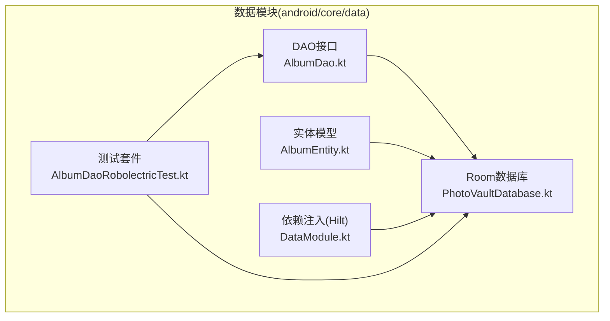
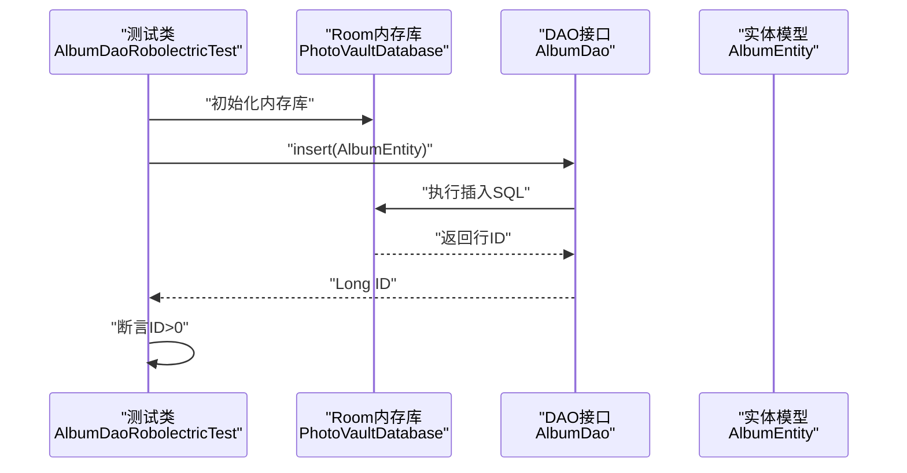
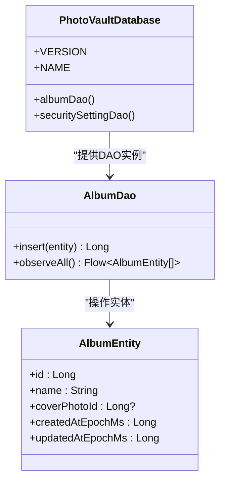
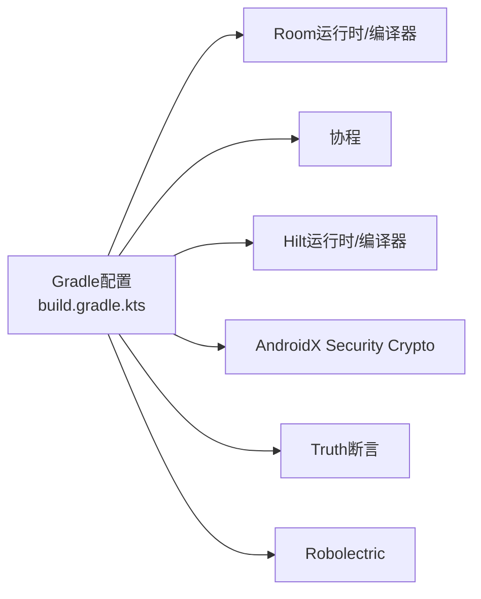

# 集成测试

<cite>
**本文引用的文件**
- [AlbumDaoRobolectricTest.kt](file://android/core/data/src/test/kotlin/com/photovault/data/db/AlbumDaoRobolectricTest.kt)
- [AlbumDao.kt](file://android/core/data/src/main/kotlin/com/photovault/data/db/dao/AlbumDao.kt)
- [PhotoVaultDatabase.kt](file://android/core/data/src/main/kotlin/com/photovault/data/db/PhotoVaultDatabase.kt)
- [DataModule.kt](file://android/core/data/src/main/kotlin/com/photovault/data/di/DataModule.kt)
- [AlbumEntity.kt](file://android/core/data/src/main/kotlin/com/photovault/data/db/entity/AlbumEntity.kt)
- [AesCbcEngine.kt](file://android/core/data/src/main/kotlin/com/photovault/data/crypto/AesCbcEngine.kt)
- [AesCbcEngineTest.kt](file://android/core/data/src/test/kotlin/com/photovault/data/crypto/AesCbcEngineTest.kt)
- [PasswordHasherTest.kt](file://android/core/data/src/test/kotlin/com/photovault/data/crypto/PasswordHasherTest.kt)
- [build.gradle.kts](file://android/core/data/build.gradle.kts)
</cite>

## 目录
1. [简介](#简介)
2. [项目结构](#项目结构)
3. [核心组件](#核心组件)
4. [架构总览](#架构总览)
5. [详细组件分析](#详细组件分析)
6. [依赖关系分析](#依赖关系分析)
7. [性能考量](#性能考量)
8. [故障排查指南](#故障排查指南)
9. [结论](#结论)
10. [附录](#附录)

## 简介
本文件面向AI照片保险库项目的集成测试，重点覆盖数据库集成测试的实现方法，包括Room数据库的测试配置与Robolectric框架的使用；DAO层测试的设计思路，涵盖AlbumDao的CRUD与观察查询测试；依赖注入在测试中的配置方法及外部依赖的模拟策略；以及集成测试的编写指南，包括测试数据准备、测试环境隔离与测试结果验证方法。目标是帮助开发者在不依赖设备或模拟器的前提下，快速搭建稳定可靠的数据库集成测试体系。

## 项目结构
本项目采用模块化组织，数据库与数据访问逻辑集中在android/core/data模块中，测试代码位于同模块的test目录下。数据库通过Room进行建模，依赖注入使用Hilt进行提供，单元测试与集成测试分别采用Truth断言与Robolectric运行时。

图表来源
- [AlbumDao.kt:1-18](file://android/core/data/src/main/kotlin/com/photovault/data/db/dao/AlbumDao.kt#L1-L18)
- [AlbumEntity.kt:1-19](file://android/core/data/src/main/kotlin/com/photovault/data/db/entity/AlbumEntity.kt#L1-L19)
- [PhotoVaultDatabase.kt:1-36](file://android/core/data/src/main/kotlin/com/photovault/data/db/PhotoVaultDatabase.kt#L1-L36)
- [DataModule.kt:1-40](file://android/core/data/src/main/kotlin/com/photovault/data/di/DataModule.kt#L1-L40)
- [AlbumDaoRobolectricTest.kt:1-50](file://android/core/data/src/test/kotlin/com/photovault/data/db/AlbumDaoRobolectricTest.kt#L1-L50)

章节来源
- [build.gradle.kts:1-48](file://android/core/data/build.gradle.kts#L1-L48)

## 核心组件
- 数据库与实体：PhotoVaultDatabase定义了数据库版本、名称与实体集合；AlbumEntity定义了相册表结构与索引。
- DAO接口：AlbumDao提供插入与基于Flow的观察查询能力。
- 依赖注入：DataModule通过Hilt提供Room数据库实例与加密组件。
- 测试框架：AlbumDaoRobolectricTest使用Robolectric与Room内存库进行集成测试，配合Truth断言。

章节来源
- [PhotoVaultDatabase.kt:14-36](file://android/core/data/src/main/kotlin/com/photovault/data/db/PhotoVaultDatabase.kt#L14-L36)
- [AlbumEntity.kt:8-18](file://android/core/data/src/main/kotlin/com/photovault/data/db/entity/AlbumEntity.kt#L8-L18)
- [AlbumDao.kt:10-17](file://android/core/data/src/main/kotlin/com/photovault/data/db/dao/AlbumDao.kt#L10-L17)
- [DataModule.kt:15-39](file://android/core/data/src/main/kotlin/com/photovault/data/di/DataModule.kt#L15-L39)
- [AlbumDaoRobolectricTest.kt:17-48](file://android/core/data/src/test/kotlin/com/photovault/data/db/AlbumDaoRobolectricTest.kt#L17-L48)

## 架构总览
下图展示了从测试到数据库的调用链路与依赖关系，强调测试通过Robolectric构建Room内存数据库，DAO通过协程执行插入操作，并返回主键ID用于断言。

图表来源
- [AlbumDaoRobolectricTest.kt:23-48](file://android/core/data/src/test/kotlin/com/photovault/data/db/AlbumDaoRobolectricTest.kt#L23-L48)
- [AlbumDao.kt:12-13](file://android/core/data/src/main/kotlin/com/photovault/data/db/dao/AlbumDao.kt#L12-L13)
- [PhotoVaultDatabase.kt:26-28](file://android/core/data/src/main/kotlin/com/photovault/data/db/PhotoVaultDatabase.kt#L26-L28)
- [AlbumEntity.kt:12-18](file://android/core/data/src/main/kotlin/com/photovault/data/db/entity/AlbumEntity.kt#L12-L18)

## 详细组件分析

### 数据库与实体设计
- 数据库版本与名称：数据库版本常量用于迁移管理，名称用于区分不同数据库实例。
- 实体索引：AlbumEntity对updated_at_ms列建立索引，优化排序查询性能。
- 表结构字段：包含自增主键、名称、封面照片ID、创建时间与更新时间等字段。

章节来源
- [PhotoVaultDatabase.kt:30-34](file://android/core/data/src/main/kotlin/com/photovault/data/db/PhotoVaultDatabase.kt#L30-L34)
- [AlbumEntity.kt:8-18](file://android/core/data/src/main/kotlin/com/photovault/data/db/entity/AlbumEntity.kt#L8-L18)

### DAO层设计与测试思路
- 插入操作：AlbumDao提供带冲突策略的插入方法，返回插入行ID，便于断言插入成功。
- 观察查询：通过Flow暴露按更新时间倒序的相册列表，适合UI订阅与响应式更新。
- 测试策略：
  - 使用Room内存库避免磁盘IO与设备依赖。
  - 在@Before中初始化数据库与DAO，在@After中关闭数据库。
  - 使用Truth断言插入ID大于0，确保插入成功且主键生成正常。

图表来源
- [PhotoVaultDatabase.kt:26-28](file://android/core/data/src/main/kotlin/com/photovault/data/db/PhotoVaultDatabase.kt#L26-L28)
- [AlbumDao.kt:10-17](file://android/core/data/src/main/kotlin/com/photovault/data/db/dao/AlbumDao.kt#L10-L17)
- [AlbumEntity.kt:12-18](file://android/core/data/src/main/kotlin/com/photovault/data/db/entity/AlbumEntity.kt#L12-L18)

章节来源
- [AlbumDao.kt:10-17](file://android/core/data/src/main/kotlin/com/photovault/data/db/dao/AlbumDao.kt#L10-L17)
- [AlbumDaoRobolectricTest.kt:23-48](file://android/core/data/src/test/kotlin/com/photovault/data/db/AlbumDaoRobolectricTest.kt#L23-L48)

### 依赖注入在测试中的配置
- 生产注入：DataModule通过Hilt提供Room数据库单例，使用应用上下文构建数据库。
- 测试注入：当前集成测试未显式替换DataModule，而是直接通过Room.inMemoryDatabaseBuilder在测试中构造数据库实例。该方式可避免引入Hilt运行时开销，同时保持测试隔离性。
- 外部依赖模拟：加密引擎AesCbcEngine在单元测试中被直接实例化，无需依赖注入；在集成测试中可通过替换DataModule或使用Hilt测试模块来模拟外部依赖（如KeystoreSecretKeyProvider）。

章节来源
- [DataModule.kt:18-38](file://android/core/data/src/main/kotlin/com/photovault/data/di/DataModule.kt#L18-L38)
- [AlbumDaoRobolectricTest.kt:23-35](file://android/core/data/src/test/kotlin/com/photovault/data/db/AlbumDaoRobolectricTest.kt#L23-L35)

### 加密组件测试策略
- 对称加密：AesCbcEngine提供加密与解密能力，测试用例验证加解密往返正确性与输出长度。
- 密码哈希：PasswordHasherTest验证SHA-256已知向量与盐值确定性，确保密码处理一致性。
- 集成测试建议：可在集成测试中结合数据库测试，验证加密后的数据写入与读取一致性。

章节来源
- [AesCbcEngine.kt:12-32](file://android/core/data/src/main/kotlin/com/photovault/data/crypto/AesCbcEngine.kt#L12-L32)
- [AesCbcEngineTest.kt:7-17](file://android/core/data/src/test/kotlin/com/photovault/data/crypto/AesCbcEngineTest.kt#L7-L17)
- [PasswordHasherTest.kt:6-23](file://android/core/data/src/test/kotlin/com/photovault/data/crypto/PasswordHasherTest.kt#L6-L23)

## 依赖关系分析
- 模块依赖：android/core/data模块依赖core:domain域模块，提供数据库与加密能力。
- 编译与测试依赖：Room运行时、协程、Hilt及其编译器、Robolectric与Truth等。
- 测试运行器：defaultConfig中配置了AndroidJUnitRunner，支持Android资源与Robolectric测试。

图表来源
- [build.gradle.kts:31-47](file://android/core/data/build.gradle.kts#L31-L47)

章节来源
- [build.gradle.kts:8-29](file://android/core/data/build.gradle.kts#L8-L29)

## 性能考量
- 内存数据库：使用Room.inMemoryDatabaseBuilder可显著降低I/O开销，提升测试执行速度。
- 主线程查询：测试中允许主线程查询，便于简化测试逻辑；但在复杂场景建议避免阻塞主线程。
- 索引优化：AlbumEntity对updated_at_ms建立索引，有利于排序查询性能；在大量数据场景下应关注索引维护成本。
- 断言粒度：使用Truth进行精确断言，减少冗余比较，提高测试可读性与维护性。

## 故障排查指南
- 测试失败定位：
  - 数据库未关闭：确保在@After中调用db.close()，避免资源泄漏导致后续测试失败。
  - 插入ID异常：检查AlbumEntity字段是否完整，确认插入策略与主键生成是否符合预期。
  - 观察查询无数据：确认插入后立即查询，或等待Flow发射；必要时使用协程测试工具。
- 依赖注入问题：
  - 若需模拟外部依赖，可在测试中提供替代DataModule或使用Hilt测试模块，避免生产依赖。
- 断言失败：
  - 使用Truth的详细断言消息，结合AlbumEntity关键字段进行比对，定位具体差异。

章节来源
- [AlbumDaoRobolectricTest.kt:32-35](file://android/core/data/src/test/kotlin/com/photovault/data/db/AlbumDaoRobolectricTest.kt#L32-L35)
- [AlbumDao.kt:15-16](file://android/core/data/src/main/kotlin/com/photovault/data/db/dao/AlbumDao.kt#L15-L16)

## 结论
本项目在android/core/data模块中已具备完善的数据库集成测试基础：通过Robolectric与Room内存库实现快速、稳定的集成测试；AlbumDao的CRUD与观察查询测试覆盖关键路径；依赖注入通过Hilt提供清晰的生产与测试配置。建议在现有基础上扩展更多DAO与实体的集成测试，完善事务与并发场景的验证，并考虑引入Hilt测试模块以更好地模拟外部依赖。

## 附录

### 数据库事务测试设计要点
- 事务边界：明确事务开始与提交/回滚点，确保测试覆盖成功与失败分支。
- 并发控制：在多线程环境下验证事务隔离级别与锁行为。
- 回滚验证：插入后回滚，断言数据不存在；提交后断言存在。
- 性能监控：记录事务耗时，识别潜在瓶颈。

### 测试数据准备与隔离
- 测试数据：使用最小必要数据集，避免跨测试污染；通过@After清理状态。
- 环境隔离：每个测试使用独立的Room内存库实例，避免共享状态。
- 资源释放：确保数据库连接与流订阅在测试结束时正确关闭。

### 测试结果验证方法
- 结果断言：使用Truth进行精确断言，包括数量、字段值与类型。
- 流式验证：对Flow输出进行收集与断言，确保响应式更新正确。
- 异常断言：对异常路径进行断言，确保错误传播与日志记录符合预期。