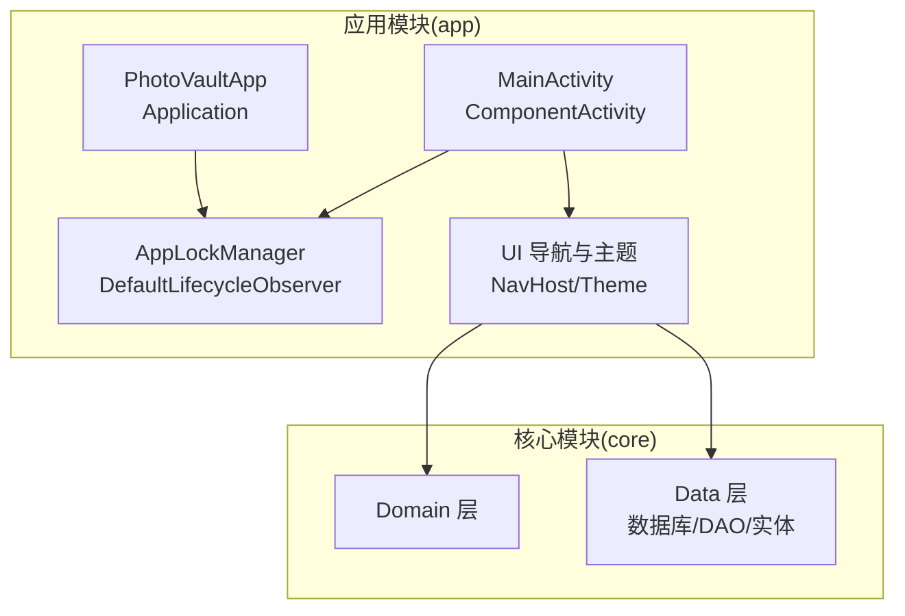
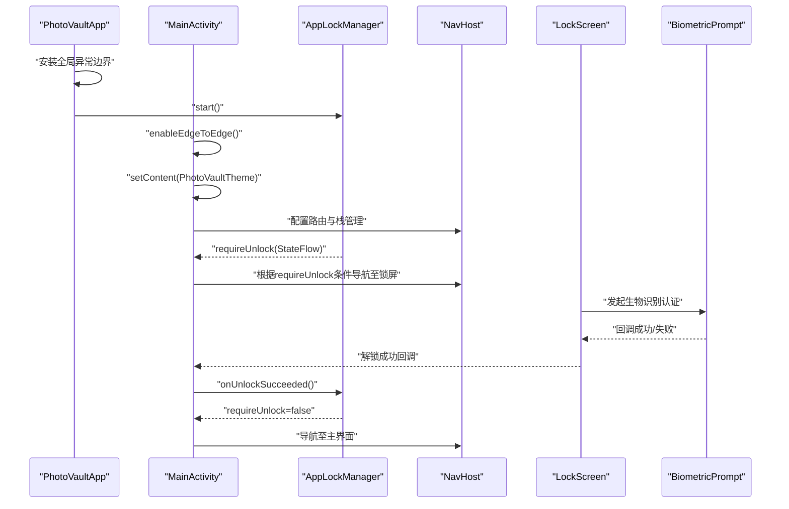
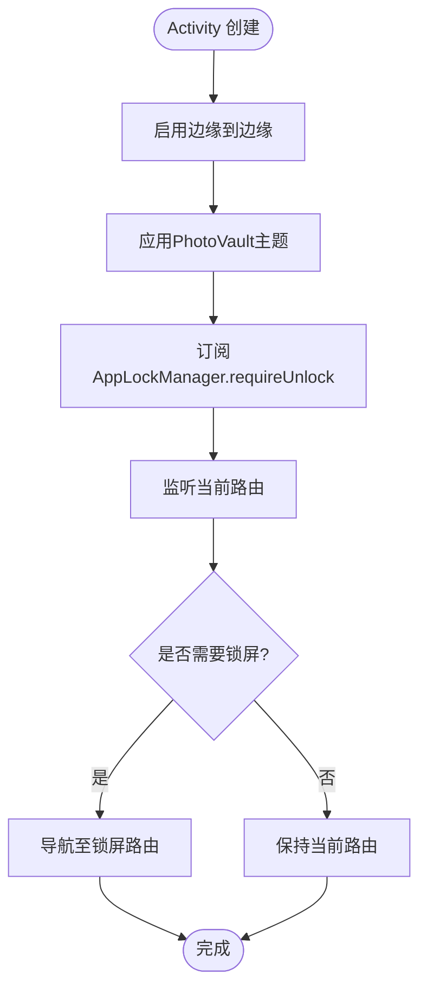
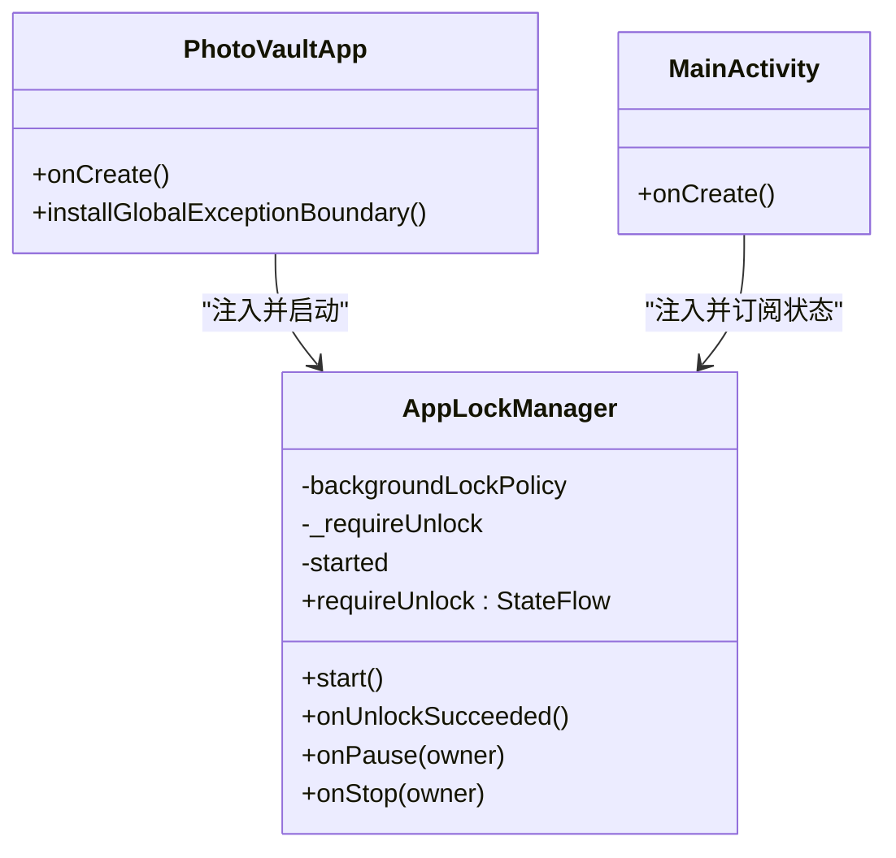
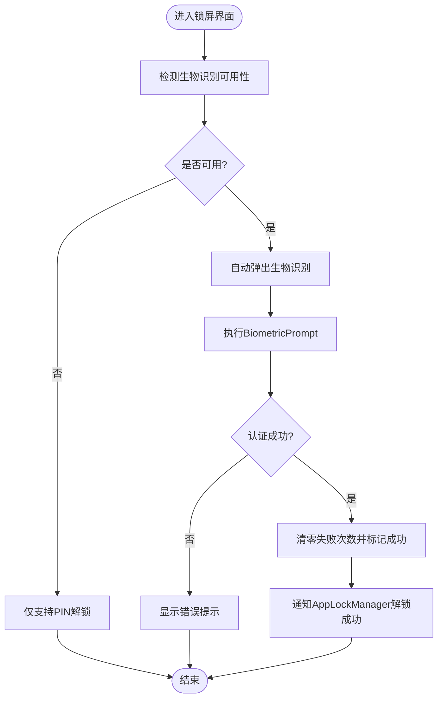
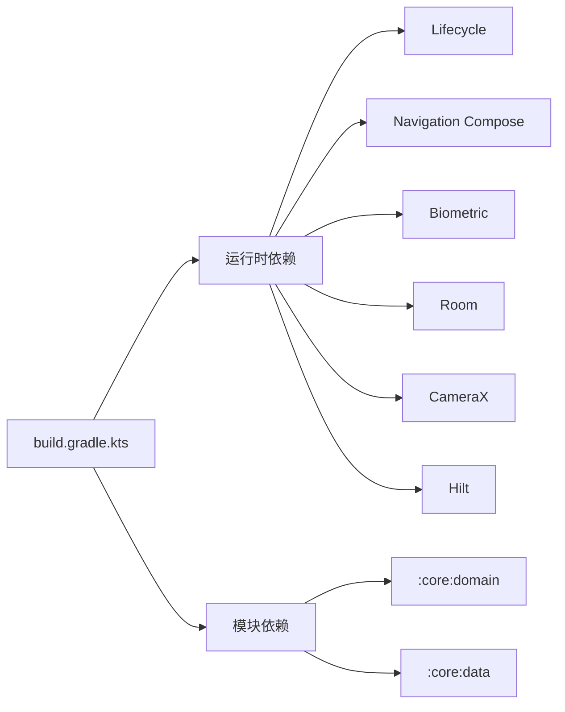

# Android系统服务集成

<cite>
**本文引用的文件**
- [MainActivity.kt](file://android/app/src/main/kotlin/com/photovault/app/MainActivity.kt)
- [AppLockManager.kt](file://android/app/src/main/kotlin/com/photovault/app/AppLockManager.kt)
- [PhotoVaultApp.kt](file://android/app/src/main/kotlin/com/photovault/app/PhotoVaultApp.kt)
- [LockScreen.kt](file://android/app/src/main/kotlin/com/photovault/app/ui/lock/LockScreen.kt)
- [LockViewModel.kt](file://android/app/src/main/kotlin/com/photovault/app/ui/lock/LockViewModel.kt)
- [Theme.kt](file://android/app/src/main/kotlin/com/photovault/app/ui/theme/Theme.kt)
- [themes.xml](file://android/app/src/main/res/values/themes.xml)
- [AndroidManifest.xml](file://android/app/src/main/AndroidManifest.xml)
- [build.gradle.kts](file://android/app/build.gradle.kts)
- [settings.gradle.kts](file://android/settings.gradle.kts)
</cite>

## 目录
1. [简介](#简介)
2. [项目结构](#项目结构)
3. [核心组件](#核心组件)
4. [架构总览](#架构总览)
5. [详细组件分析](#详细组件分析)
6. [依赖分析](#依赖分析)
7. [性能考虑](#性能考虑)
8. [故障排查指南](#故障排查指南)
9. [结论](#结论)
10. [附录](#附录)

## 简介
本文件面向AI照片保险库项目的Android系统服务集成功能，围绕以下目标展开：  
- 与Android系统核心服务的集成方式：Activity生命周期管理、Navigation组件配置、系统主题应用  
- 权限声明与管理、系统事件监听与响应机制  
- 应用锁管理器的实现原理与系统服务调用方式  
- 系统服务配置与初始化的最佳实践  
- 常见系统服务集成问题与解决方案  

文档以代码级分析为基础，辅以可视化图示，帮助开发者快速理解并正确集成。

## 项目结构
Android子项目采用按功能分层与模块化组织：  
- 应用入口与系统服务集成集中在app模块  
- 核心业务与数据访问位于core子模块  
- 构建脚本与版本管理位于根目录gradle文件  

图表来源
- [PhotoVaultApp.kt:12-17](file://android/app/src/main/kotlin/com/photovault/app/PhotoVaultApp.kt#L12-L17)
- [MainActivity.kt:46-243](file://android/app/src/main/kotlin/com/photovault/app/MainActivity.kt#L46-L243)
- [AppLockManager.kt:17-31](file://android/app/src/main/kotlin/com/photovault/app/AppLockManager.kt#L17-L31)

章节来源
- [build.gradle.kts:1-91](file://android/app/build.gradle.kts#L1-L91)
- [settings.gradle.kts:17-21](file://android/settings.gradle.kts#L17-L21)

## 核心组件
- 应用入口与全局异常边界：在Application中安装全局未捕获异常处理器与AppLockManager启动  
- 主Activity与导航：基于Compose Navigation的路由编排与条件跳转  
- 应用锁管理器：基于ProcessLifecycleOwner的后台策略与状态流控制  
- 生物识别解锁：基于BiometricPrompt的认证流程与可用性检测  
- 主题系统：Material3动态色与系统深浅模式适配  

章节来源
- [PhotoVaultApp.kt:12-29](file://android/app/src/main/kotlin/com/photovault/app/PhotoVaultApp.kt#L12-L29)
- [MainActivity.kt:46-243](file://android/app/src/main/kotlin/com/photovault/app/MainActivity.kt#L46-L243)
- [AppLockManager.kt:17-48](file://android/app/src/main/kotlin/com/photovault/app/AppLockManager.kt#L17-L48)
- [LockScreen.kt:52-127](file://android/app/src/main/kotlin/com/photovault/app/ui/lock/LockScreen.kt#L52-L127)
- [Theme.kt:9-18](file://android/app/src/main/kotlin/com/photovault/app/ui/theme/Theme.kt#L9-L18)

## 架构总览
系统服务集成的关键路径如下：  
- Application启动时注册全局异常边界并启动AppLockManager  
- MainActivity在Compose环境中启用边缘到边缘与系统主题，配置NavHost路由  
- AppLockManager监听进程生命周期，在后台可见性变化时触发“需要解锁”状态  
- LockScreen通过BiometricPrompt进行生物识别认证，结合PIN解锁与数据库持久化逻辑  

图表来源
- [PhotoVaultApp.kt:12-17](file://android/app/src/main/kotlin/com/photovault/app/PhotoVaultApp.kt#L12-L17)
- [MainActivity.kt:46-74](file://android/app/src/main/kotlin/com/photovault/app/MainActivity.kt#L46-L74)
- [AppLockManager.kt:27-35](file://android/app/src/main/kotlin/com/photovault/app/AppLockManager.kt#L27-L35)
- [LockScreen.kt:71-106](file://android/app/src/main/kotlin/com/photovault/app/ui/lock/LockScreen.kt#L71-L106)

## 详细组件分析

### Activity生命周期管理与导航集成
- 生命周期观察：AppLockManager实现DefaultLifecycleObserver，通过ProcessLifecycleOwner订阅onPause/onStop  
- 导航控制：MainActivity在LaunchedEffect中监听requireUnlock与当前路由，非锁屏且非相机占位时自动跳转锁屏  
- 栈管理：使用NavHost与popUpTo/launchSingleTop/restoreState参数确保锁屏前后栈状态可控  
- 边缘到边缘与主题：enableEdgeToEdge与PhotoVaultTheme统一背景与系统栏颜色  

图表来源
- [MainActivity.kt:46-74](file://android/app/src/main/kotlin/com/photovault/app/MainActivity.kt#L46-L74)
- [Theme.kt:9-18](file://android/app/src/main/kotlin/com/photovault/app/ui/theme/Theme.kt#L9-L18)
- [themes.xml:3-8](file://android/app/src/main/res/values/themes.xml#L3-L8)

章节来源
- [MainActivity.kt:46-243](file://android/app/src/main/kotlin/com/photovault/app/MainActivity.kt#L46-L243)
- [AppLockManager.kt:17-48](file://android/app/src/main/kotlin/com/photovault/app/AppLockManager.kt#L17-L48)
- [Theme.kt:9-18](file://android/app/src/main/kotlin/com/photovault/app/ui/theme/Theme.kt#L9-L18)
- [themes.xml:3-8](file://android/app/src/main/res/values/themes.xml#L3-L8)

### 应用锁管理器实现原理
- 单例注入：@Singleton，通过Hilt在Application与Activity中注入  
- 后台策略：默认ON_STOP策略，仅当应用完全不可见时才要求解锁  
- 状态流：MutableStateFlow对外暴露requireUnlock，支持UI侧响应式订阅  
- 启动时机：Application.onCreate中调用start，注册ProcessLifecycleObserver  

图表来源
- [AppLockManager.kt:17-48](file://android/app/src/main/kotlin/com/photovault/app/AppLockManager.kt#L17-L48)
- [PhotoVaultApp.kt:12-17](file://android/app/src/main/kotlin/com/photovault/app/PhotoVaultApp.kt#L12-L17)
- [MainActivity.kt:42-44](file://android/app/src/main/kotlin/com/photovault/app/MainActivity.kt#L42-L44)

章节来源
- [AppLockManager.kt:17-48](file://android/app/src/main/kotlin/com/photovault/app/AppLockManager.kt#L17-L48)
- [PhotoVaultApp.kt:12-17](file://android/app/src/main/kotlin/com/photovault/app/PhotoVaultApp.kt#L12-L17)

### 系统主题与系统栏颜色应用
- 主题定义：Theme.PhotoVault继承无ActionBar主题，设置窗口背景与系统栏颜色  
- 动态色：PhotoVaultTheme根据系统深浅模式选择Material3颜色方案  
- 实践建议：避免在运行时频繁切换主题；如需暗色模式，优先依赖系统主题  

章节来源
- [themes.xml:3-8](file://android/app/src/main/res/values/themes.xml#L3-L8)
- [Theme.kt:9-18](file://android/app/src/main/kotlin/com/photovault/app/ui/theme/Theme.kt#L9-L18)

### 权限声明与管理
- 当前声明：CAMERA、READ_EXTERNAL_STORAGE（<=32）、READ_MEDIA_IMAGES、READ_MEDIA_VIDEO  
- 建议：  
  - 针对Android 13+使用READ_MEDIA_*权限  
  - 对于历史版本兼容，保留READ_EXTERNAL_STORAGE但限制maxSdkVersion  
  - 在UI中处理权限被拒绝与永久拒绝场景，引导用户前往设置页  
- 注意：本仓库未包含运行时权限请求与设置页跳转的具体实现代码片段

章节来源
- [AndroidManifest.xml:3-6](file://android/app/src/main/AndroidManifest.xml#L3-L6)

### 系统事件监听与响应机制
- 生命周期事件：通过DefaultLifecycleObserver监听onPause/onStop，触发后台上锁  
- 导航事件：LaunchedEffect监听requireUnlock与路由变化，驱动条件导航  
- 生物识别事件：BiometricPrompt回调区分成功/失败/取消，驱动UI状态与后续流程  
- 异常事件：全局未捕获异常处理器记录日志并交由前序处理器处理  

章节来源
- [AppLockManager.kt:37-47](file://android/app/src/main/kotlin/com/photovault/app/AppLockManager.kt#L37-L47)
- [MainActivity.kt:60-74](file://android/app/src/main/kotlin/com/photovault/app/MainActivity.kt#L60-L74)
- [LockScreen.kt:81-98](file://android/app/src/main/kotlin/com/photovault/app/ui/lock/LockScreen.kt#L81-L98)
- [PhotoVaultApp.kt:19-29](file://android/app/src/main/kotlin/com/photovault/app/PhotoVaultApp.kt#L19-L29)

### 生物识别解锁与PIN解锁流程
- 可用性检测：resolveBiometricAvailability根据BiometricManager结果返回可用性与提示信息  
- 认证流程：构建BiometricPrompt，设置标题/副标题与允许的认证类型，执行authenticate  
- 失败处理：区分用户取消、负按钮、取消与错误，分别给出不同提示  
- 成功处理：清空错误计数并标记解锁成功，随后通知AppLockManager关闭锁屏需求  

图表来源
- [LockScreen.kt:65-106](file://android/app/src/main/kotlin/com/photovault/app/ui/lock/LockScreen.kt#L65-L106)
- [LockScreen.kt:365-382](file://android/app/src/main/kotlin/com/photovault/app/ui/lock/LockScreen.kt#L365-L382)
- [LockViewModel.kt:117-127](file://android/app/src/main/kotlin/com/photovault/app/ui/lock/LockViewModel.kt#L117-L127)

章节来源
- [LockScreen.kt:52-127](file://android/app/src/main/kotlin/com/photovault/app/ui/lock/LockScreen.kt#L52-L127)
- [LockScreen.kt:365-382](file://android/app/src/main/kotlin/com/photovault/app/ui/lock/LockScreen.kt#L365-L382)
- [LockViewModel.kt:117-127](file://android/app/src/main/kotlin/com/photovault/app/ui/lock/LockViewModel.kt#L117-L127)

### 导航组件配置与路由管理
- 路由定义：在MainActivity中集中定义所有路由字符串常量  
- 路由编排：NavHost中使用composable声明各页面，支持参数化路由（相册/图片查看器）  
- 栈控制：通过popUpTo/launchSingleTop/restoreState保证锁屏前后栈行为一致  
- 参数编码：对含特殊字符的路径进行Uri.encode/decode处理  

章节来源
- [MainActivity.kt:245-260](file://android/app/src/main/kotlin/com/photovault/app/MainActivity.kt#L245-L260)
- [MainActivity.kt:76-239](file://android/app/src/main/kotlin/com/photovault/app/MainActivity.kt#L76-L239)

## 依赖分析
- 构建与插件：应用模块启用Android/Kotlin/Compose/Hilt/KSP插件，启用Compose与BuildConfig  
- 运行时依赖：Lifecycle Runtime Compose、Navigation Compose、Biometric、Room、Camera等  
- 模块依赖：app依赖core:domain与core:data，形成清晰的分层  

图表来源
- [build.gradle.kts:63-90](file://android/app/build.gradle.kts#L63-L90)
- [settings.gradle.kts:17-21](file://android/settings.gradle.kts#L17-L21)

章节来源
- [build.gradle.kts:63-90](file://android/app/build.gradle.kts#L63-L90)
- [settings.gradle.kts:17-21](file://android/settings.gradle.kts#L17-L21)

## 性能考虑
- 生命周期监听成本低：DefaultLifecycleObserver仅在进程可见性变化时触发，避免频繁UI刷新  
- 状态流订阅：requireUnlock为StateFlow，UI侧使用collectAsState按需渲染，减少重组开销  
- 导航栈管理：合理使用popUpTo/launchSingleTop降低回退栈深度与重建成本  
- 图像与媒体：READ_MEDIA_*权限更精准，避免一次性读取全盘带来的IO压力  
- 主题与布局：Material3动态色与Compose组合使用，建议避免在热路径频繁切换主题

## 故障排查指南
- 锁屏无法自动出现  
  - 检查AppLockManager是否在Application.onCreate中启动  
  - 确认ProcessLifecycleOwner生命周期回调是否正常  
  - 排查当前路由是否为锁屏或相机占位，避免不必要的导航  
  - 参考：[AppLockManager.kt:27-31](file://android/app/src/main/kotlin/com/photovault/app/AppLockManager.kt#L27-L31)，[MainActivity.kt:60-74](file://android/app/src/main/kotlin/com/photovault/app/MainActivity.kt#L60-L74)  
- 生物识别不可用或报错  
  - 检查设备是否录入指纹/面部，硬件是否可用  
  - 查看resolveBiometricAvailability返回的不可用原因  
  - 区分用户取消、负按钮与错误，分别处理UI提示  
  - 参考：[LockScreen.kt:365-382](file://android/app/src/main/kotlin/com/photovault/app/ui/lock/LockScreen.kt#L365-L382)，[LockScreen.kt:81-98](file://android/app/src/main/kotlin/com/photovault/app/ui/lock/LockScreen.kt#L81-L98)  
- 权限被拒绝或永久拒绝  
  - 在UI中判断shouldShowRequestPermissionRationale与PERMANENTLY_DENIED  
  - 提示用户前往设置页手动授权  
  - 参考：[AndroidManifest.xml:3-6](file://android/app/src/main/AndroidManifest.xml#L3-L6)  
- 全局异常未被捕获  
  - 确认Thread.setDefaultUncaughtExceptionHandler已设置  
  - 检查previous处理器是否为空或已被覆盖  
  - 参考：[PhotoVaultApp.kt:19-29](file://android/app/src/main/kotlin/com/photovault/app/PhotoVaultApp.kt#L19-L29)  
- 导航栈混乱  
  - 使用popUpTo/launchSingleTop/restoreState明确栈行为  
  - 对参数化路由进行Uri.encode/Uri.decode  
  - 参考：[MainActivity.kt:76-239](file://android/app/src/main/kotlin/com/photovault/app/MainActivity.kt#L76-L239)

## 结论
本项目通过Application全局初始化、Lifecycle观察与Compose Navigation的组合，实现了稳定的应用锁屏与主题系统集成。配合BiometricPrompt的可用性检测与错误分支处理，提供了良好的用户体验。建议在后续迭代中补充运行时权限请求与设置页跳转的完整实现，并持续优化导航栈与状态流的订阅策略。

## 附录
- 最佳实践清单  
  - 在Application.onCreate中启动系统服务与全局边界  
  - 使用ProcessLifecycleOwner监听后台可见性变化  
  - 在UI中使用StateFlow与LaunchedEffect响应系统事件  
  - 通过NavOptions精确控制导航栈行为  
  - 使用READ_MEDIA_*权限替代宽泛存储权限  
  - 为生物识别提供明确的错误提示与降级方案（PIN）