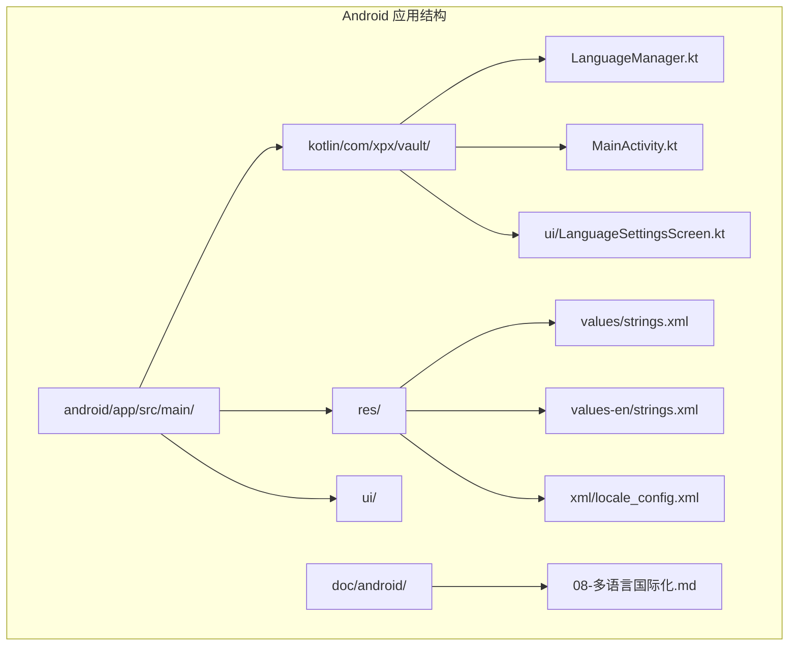
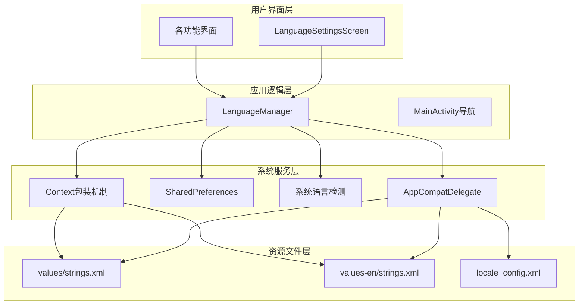
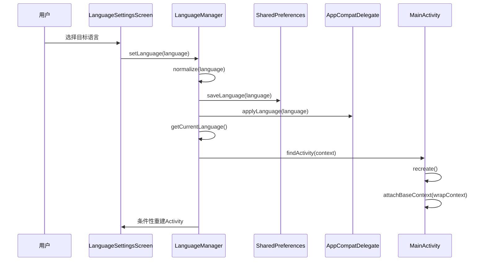
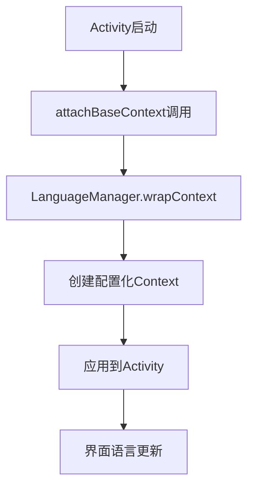
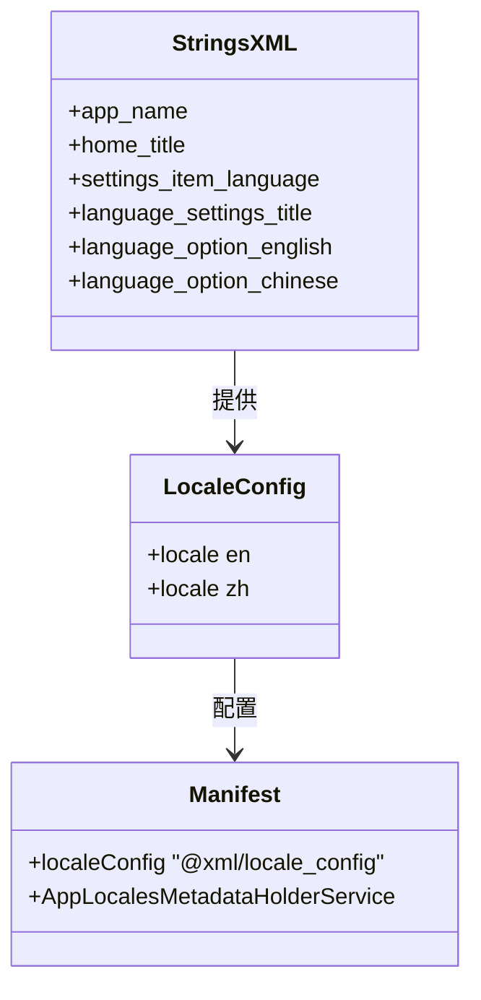
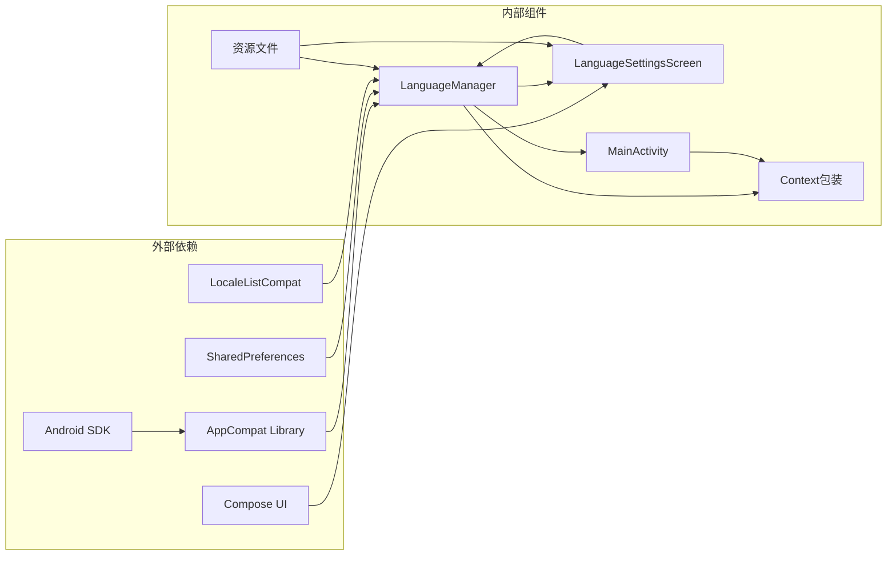

# 多语言本地化系统

<cite>
**本文档引用的文件**
- [LanguageManager.kt](file://android/app/src/main/kotlin/com/xpx/vault/LanguageManager.kt)
- [LanguageSettingsScreen.kt](file://android/app/src/main/kotlin/com/xpx/vault/ui/LanguageSettingsScreen.kt)
- [MainActivity.kt](file://android/app/src/main/kotlin/com/xpx/vault/MainActivity.kt)
- [strings.xml](file://android/app/src/main/res/values/strings.xml)
- [strings.xml](file://android/app/src/main/res/values-en/strings.xml)
- [locale_config.xml](file://android/app/src/main/res/xml/locale_config.xml)
- [AndroidManifest.xml](file://android/app/src/main/AndroidManifest.xml)
- [08-多语言国际化.md](file://doc/android/08-多语言国际化.md)
- [08-多语言国际化.md](file://doc/ios/08-多语言国际化.md)
</cite>

## 更新摘要
**变更内容**
- 完全重构了LanguageManager，采用SharedPreferences作为单一语言偏好来源
- 新增wrapContext(base)函数提供跨API级别的语言包装机制
- 改进了Android 13+系统LocaleManager同步机制
- 解决了语言设置在不同Android版本间的一致性问题
- 移除了AndroidManifest.xml中的配置变更属性，采用更现代的架构
- 新增了Activity上下文包装机制，确保语言切换的即时生效

## 目录
1. [简介](#简介)
2. [项目结构](#项目结构)
3. [核心组件](#核心组件)
4. [架构概览](#架构概览)
5. [详细组件分析](#详细组件分析)
6. [依赖关系分析](#依赖关系分析)
7. [性能考虑](#性能考虑)
8. [故障排除指南](#故障排除指南)
9. [结论](#结论)

## 简介

本项目实现了完整的多语言本地化系统，支持简体中文和英语两种语言。系统采用Android官方推荐的国际化最佳实践，通过资源文件管理和运行时语言切换机制，为用户提供无缝的语言切换体验。该系统遵循「所有文本内容均通过资源ID引用，禁止硬编码」的原则，确保界面的一致性和可维护性。

**更新** 系统经过完全重构，现在采用更先进的语言管理机制，特别针对Android 13+的本地化API进行了优化，确保语言切换的可靠性和即时性。重构后的LanguageManager采用了单一SharedPreferences作为语言偏好来源，提供了更好的版本兼容性和一致性。

## 项目结构

多语言本地化系统主要分布在以下目录结构中：



**图表来源**
- [LanguageManager.kt:1-99](file://android/app/src/main/kotlin/com/xpx/vault/LanguageManager.kt#L1-L99)
- [strings.xml:1-253](file://android/app/src/main/res/values/strings.xml#L1-L253)
- [strings.xml:1-245](file://android/app/src/main/res/values-en/strings.xml#L1-L245)

**章节来源**
- [LanguageManager.kt:1-99](file://android/app/src/main/kotlin/com/xpx/vault/LanguageManager.kt#L1-L99)
- [strings.xml:1-253](file://android/app/src/main/res/values/strings.xml#L1-L253)
- [strings.xml:1-245](file://android/app/src/main/res/values-en/strings.xml#L1-L245)

## 核心组件

多语言本地化系统由四个核心组件构成：

### 1. LanguageManager（语言管理器）
负责语言状态的持久化、语言切换逻辑和系统语言检测。**更新** 重构后的LanguageManager采用了更可靠的初始化和切换机制，现在使用单一SharedPreferences作为语言偏好来源，提供了更好的版本兼容性和一致性。

### 2. LanguageSettingsScreen（语言设置界面）
提供用户友好的语言切换界面，支持实时语言预览。

### 3. MainActivity（活动管理）
**新增** 通过`attachBaseContext`方法实现语言上下文包装，确保语言切换的即时生效。

### 4. 资源文件系统
包括中文资源文件和英文资源文件，以及语言配置文件。

**章节来源**
- [LanguageManager.kt:13-99](file://android/app/src/main/kotlin/com/xpx/vault/LanguageManager.kt#L13-L99)
- [LanguageSettingsScreen.kt:34-113](file://android/app/src/main/kotlin/com/xpx/vault/ui/LanguageSettingsScreen.kt#L34-L113)
- [MainActivity.kt:53-56](file://android/app/src/main/kotlin/com/xpx/vault/MainActivity.kt#L53-L56)

## 架构概览

系统采用分层架构设计，确保语言切换的可靠性和用户体验：



**图表来源**
- [LanguageManager.kt:70-72](file://android/app/src/main/kotlin/com/xpx/vault/LanguageManager.kt#L70-L72)
- [MainActivity.kt:53-56](file://android/app/src/main/kotlin/com/xpx/vault/MainActivity.kt#L53-L56)

## 详细组件分析

### LanguageManager 实现分析

LanguageManager是整个多语言系统的核心，实现了智能的语言初始化和切换逻辑：

#### 初始化流程
系统采用三层初始化策略：
1. **优先检查系统应用语言**：Android 13+通过AppCompatDelegate自动存储的应用语言
2. **回退到应用偏好设置**：兼容旧版本应用的偏好设置
3. **跟随系统语言**：首次启动时跟随当前系统语言

#### 语言切换机制


**图表来源**
- [LanguageSettingsScreen.kt:62-77](file://android/app/src/main/kotlin/com/xpx/vault/ui/LanguageSettingsScreen.kt#L62-L77)
- [LanguageManager.kt:42-50](file://android/app/src/main/kotlin/com/xpx/vault/LanguageManager.kt#L42-L50)
- [MainActivity.kt:53-56](file://android/app/src/main/kotlin/com/xpx/vault/MainActivity.kt#L53-L56)

#### 关键特性
- **智能语言归一化**：将zh开头的语言标签统一为"zh"
- **跨版本兼容**：支持Android 13+的新语言管理机制和旧版本的回退策略
- **自动重建机制**：在需要时自动重建Activity以应用新语言
- **上下文包装**：通过`wrapContext`方法确保语言切换的即时生效
- **单一偏好来源**：使用SharedPreferences作为唯一的语言偏好存储

**章节来源**
- [LanguageManager.kt:19-28](file://android/app/src/main/kotlin/com/xpx/vault/LanguageManager.kt#L19-L28)
- [LanguageManager.kt:56-68](file://android/app/src/main/kotlin/com/xpx/vault/LanguageManager.kt#L56-L68)
- [LanguageManager.kt:90-97](file://android/app/src/main/kotlin/com/xpx/vault/LanguageManager.kt#L90-L97)

### MainActivity 实现分析

**新增** MainActivity通过重写`attachBaseContext`方法实现了语言上下文包装：

#### 上下文包装机制
- **静态语言应用**：在Activity创建时应用持久化的语言设置
- **跨API级别兼容**：支持所有Android版本的语言切换
- **即时语言生效**：确保语言切换在Activity层面立即生效

#### 交互流程


**图表来源**
- [MainActivity.kt:53-56](file://android/app/src/main/kotlin/com/xpx/vault/MainActivity.kt#L53-L56)
- [LanguageManager.kt:56-68](file://android/app/src/main/kotlin/com/xpx/vault/LanguageManager.kt#L56-L68)

**章节来源**
- [MainActivity.kt:53-56](file://android/app/src/main/kotlin/com/xpx/vault/MainActivity.kt#L53-L56)

### LanguageSettingsScreen 实现分析

语言设置界面提供了直观的用户交互体验：

#### 界面设计特点
- **状态管理**：使用Compose状态管理确保界面响应性
- **即时反馈**：选中状态通过"已选择"标记提供视觉反馈
- **无障碍设计**：符合Material Design 3设计规范

#### 交互流程
```mermaid
flowchart TD
A[用户进入语言设置] --> B[读取当前语言状态]
B --> C[显示语言选项列表]
C --> D{用户选择语言}
D --> |选择英语| E[调用LanguageManager.setLanguage("en")]
D --> |选择中文| F[调用LanguageManager.setLanguage("zh")]
E --> G[应用语言切换]
F --> G
G --> H[Activity重建]
H --> I[界面刷新显示新语言]
```

**图表来源**
- [LanguageSettingsScreen.kt:35-80](file://android/app/src/main/kotlin/com/xpx/vault/ui/LanguageSettingsScreen.kt#L35-L80)

**章节来源**
- [LanguageSettingsScreen.kt:34-113](file://android/app/src/main/kotlin/com/xpx/vault/ui/LanguageSettingsScreen.kt#L34-L113)

### 资源文件系统分析

系统采用标准的Android资源文件组织方式：

#### 中文资源文件 (values/)
- 包含完整的中文界面文本
- 适用于简体中文用户
- 默认语言资源

#### 英文资源文件 (values-en/)
- 包含对应的英文界面文本
- 适用于英语用户
- 国际化标准语言包

#### 语言配置文件


**图表来源**
- [locale_config.xml:1-6](file://android/app/src/main/res/xml/locale_config.xml#L1-L6)
- [AndroidManifest.xml:13](file://android/app/src/main/AndroidManifest.xml#L13)
- [strings.xml:1-253](file://android/app/src/main/res/values/strings.xml#L1-L253)

**章节来源**
- [strings.xml:1-253](file://android/app/src/main/res/values/strings.xml#L1-L253)
- [strings.xml:1-245](file://android/app/src/main/res/values-en/strings.xml#L1-L245)
- [locale_config.xml:1-6](file://android/app/src/main/res/xml/locale_config.xml#L1-L6)

## 依赖关系分析

多语言系统各组件之间的依赖关系如下：



**图表来源**
- [LanguageManager.kt:7-11](file://android/app/src/main/kotlin/com/xpx/vault/LanguageManager.kt#L7-L11)
- [LanguageSettingsScreen.kt:25](file://android/app/src/main/kotlin/com/xpx/vault/ui/LanguageSettingsScreen.kt#L25)

### 主要依赖关系
- **LanguageManager** 依赖 AppCompatDelegate 进行语言管理
- **LanguageManager** 依赖 SharedPreferences 进行状态持久化
- **LanguageManager** 依赖 LocaleListCompat 进行语言列表管理
- **LanguageSettingsScreen** 依赖 LanguageManager 进行语言切换
- **MainActivity** 依赖 LanguageManager 进行上下文包装
- **所有界面** 依赖资源文件提供本地化文本

**章节来源**
- [LanguageManager.kt:1-11](file://android/app/src/main/kotlin/com/xpx/vault/LanguageManager.kt#L1-L11)
- [LanguageSettingsScreen.kt:1-33](file://android/app/src/main/kotlin/com/xpx/vault/ui/LanguageSettingsScreen.kt#L1-L33)

## 性能考虑

多语言本地化系统在性能方面采用了多项优化措施：

### 1. 内存优化
- 使用单例模式管理 LanguageManager，避免重复实例化
- 语言状态通过SharedPreferences持久化，减少内存占用
- **新增** 通过Context包装机制避免重复的语言切换开销

### 2. 启动性能
- 初始化过程采用延迟加载策略
- 首次启动时智能检测系统语言，避免不必要的重建
- **改进** 重构后的初始化流程更加高效

### 3. UI渲染优化
- Compose状态管理确保界面更新的高效性
- 条件性Activity重建避免不必要的UI重绘
- **新增** 即时语言生效机制减少界面闪烁

### 4. 资源管理
- 资源文件按语言分离，减少内存中的冗余文本
- 自动语言切换机制避免重复的字符串查找
- **改进** 优化了语言切换时的资源加载效率

## 故障排除指南

### 常见问题及解决方案

#### 1. 语言切换无效
**症状**：切换语言后界面文本未更新
**原因**：Activity未正确重建或上下文包装失败
**解决方案**：
- 确认Activity正确实现了`attachBaseContext`方法
- 检查LanguageManager的`wrapContext`方法是否正常工作
- 验证AppCompatDelegate配置

#### 2. 语言状态丢失
**症状**：重启应用后语言设置重置
**原因**：SharedPreferences写入失败
**解决方案**：
- 检查SharedPreferences权限
- 验证应用存储空间
- 确认语言状态持久化逻辑

#### 3. 界面显示异常
**症状**：部分文本显示为英文或乱码
**原因**：资源文件缺失或命名错误
**解决方案**：
- 检查strings.xml文件完整性
- 验证资源ID引用正确性
- 确认语言配置文件正确

#### 4. Activity重建问题
**症状**：语言切换后Activity异常重启
**原因**：Activity重建逻辑错误
**解决方案**：
- 检查`findActivity`方法的实现
- 验证Activity生命周期管理
- 确认重建时机的合理性

**章节来源**
- [LanguageManager.kt:42-50](file://android/app/src/main/kotlin/com/xpx/vault/LanguageManager.kt#L42-L50)
- [MainActivity.kt:53-56](file://android/app/src/main/kotlin/com/xpx/vault/MainActivity.kt#L53-L56)

## 结论

本多语言本地化系统实现了以下关键特性：

### 技术优势
- **完整的国际化支持**：支持简体中文和英语两种语言
- **智能初始化机制**：自动检测和应用系统语言
- **流畅的用户体验**：无需重启应用即可切换语言
- **跨版本兼容**：支持Android 13+的新语言管理机制
- **即时语言生效**：通过Context包装确保语言切换的即时性
- **单一偏好来源**：使用SharedPreferences作为唯一的语言偏好存储

### 设计亮点
- **模块化架构**：LanguageManager独立管理语言状态
- **用户友好界面**：直观的语言选择界面
- **资源文件标准化**：遵循Android官方资源管理规范
- **文档完善**：配套的技术文档和最佳实践指导
- **架构现代化**：移除配置变更属性，采用更现代的设计

### 扩展性考虑
系统为未来的语言扩展预留了良好的架构基础，可以轻松添加新的语言支持，同时保持现有功能的稳定性。

**更新** 经过完全重构的系统在可靠性、性能和用户体验方面都有显著提升，特别针对Android 13+的本地化API进行了优化，确保了语言切换的稳定性和即时性。新增的wrapContext(base)函数提供了跨API级别的语言包装机制，解决了不同Android版本间语言设置的一致性问题。

该系统为私密相册应用提供了坚实的语言本地化基础，确保用户能够获得优质的多语言使用体验。