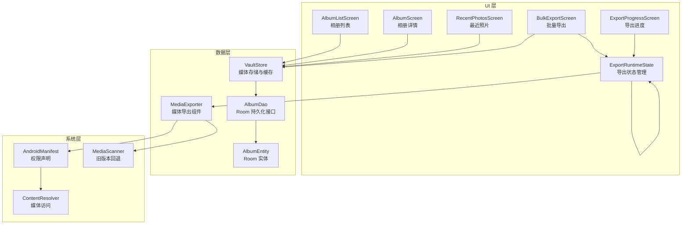
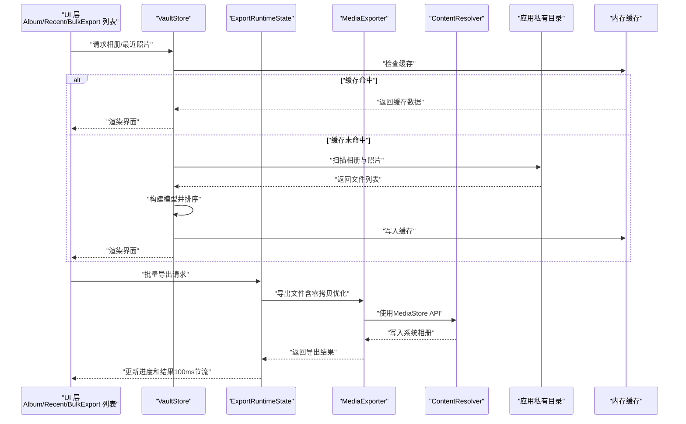
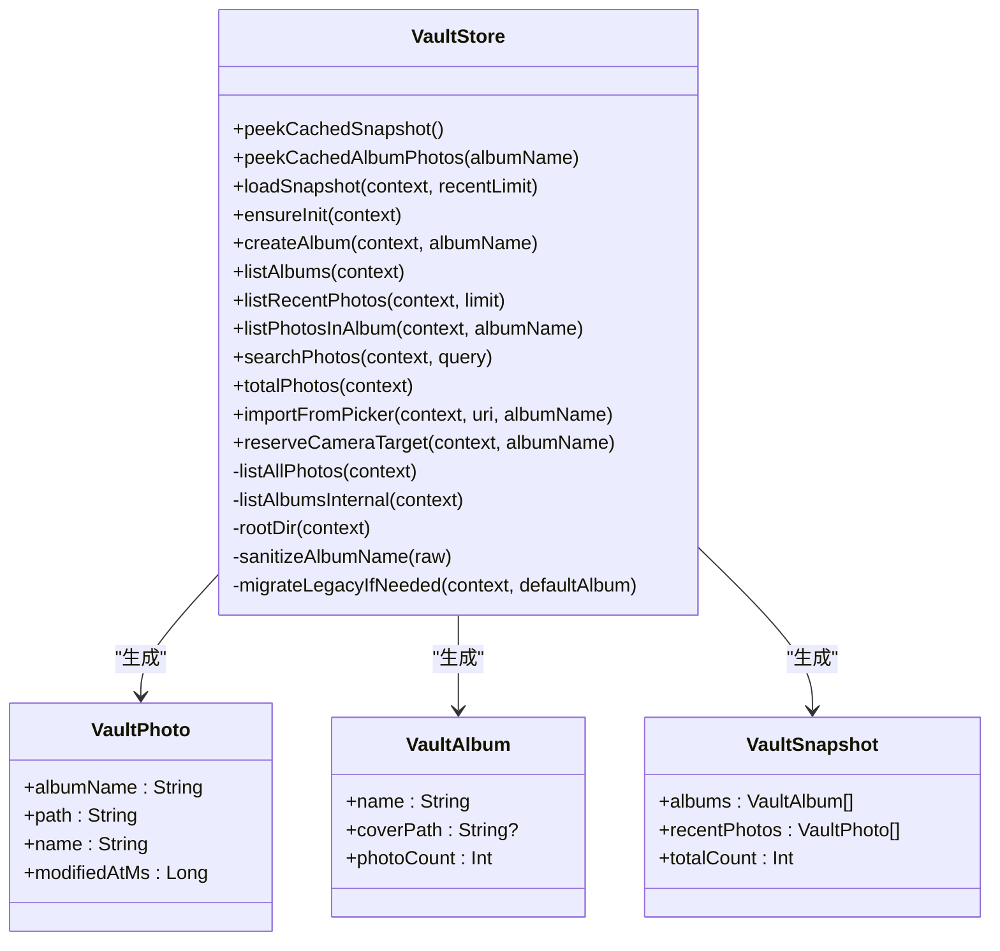
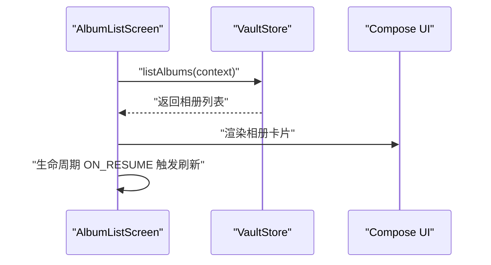
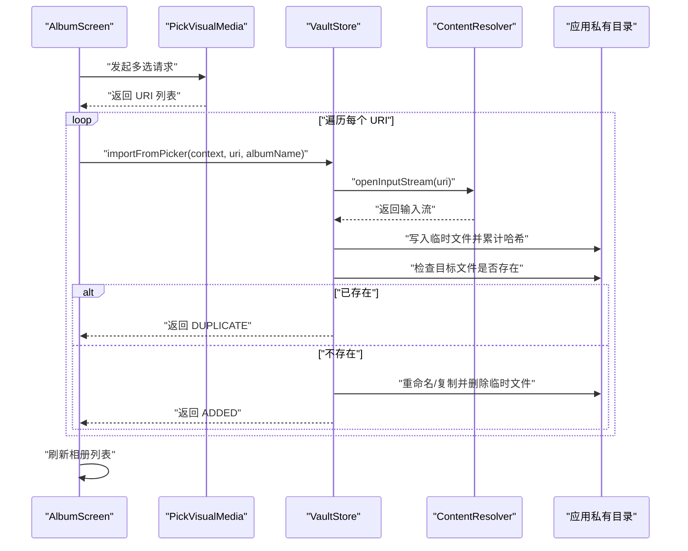
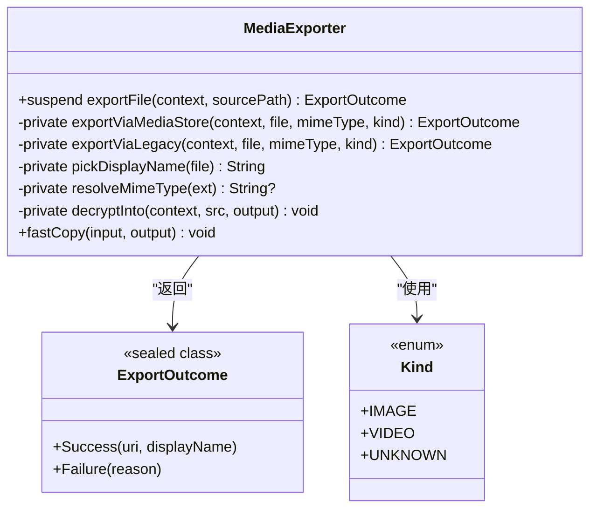
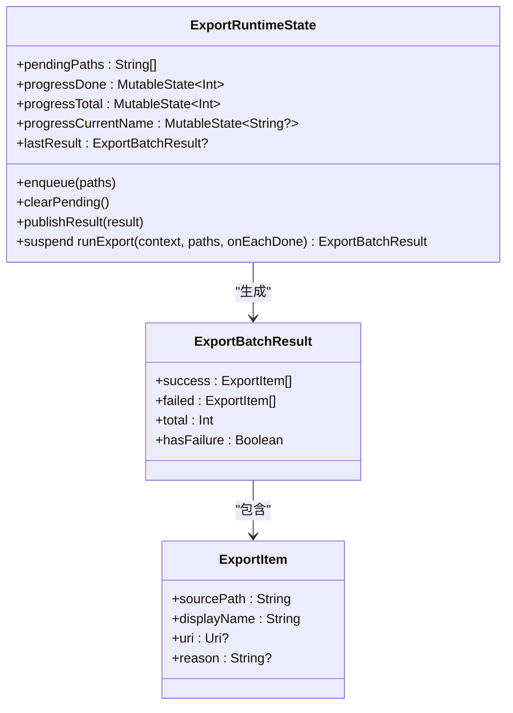
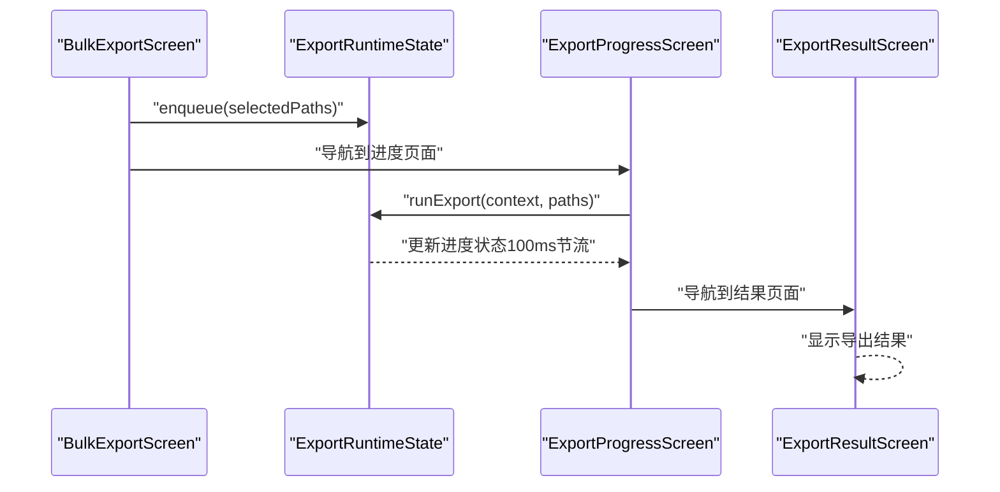
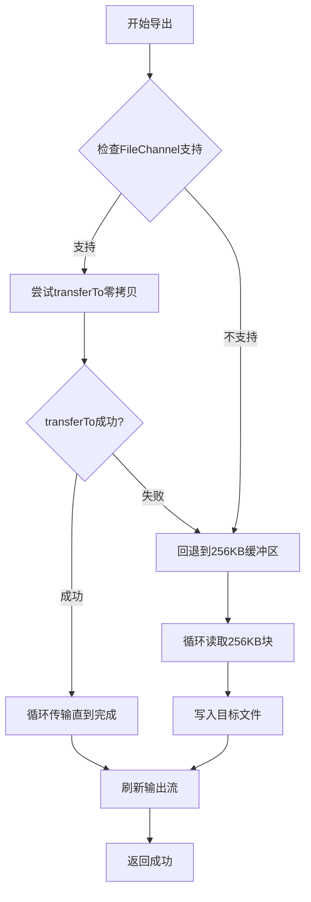
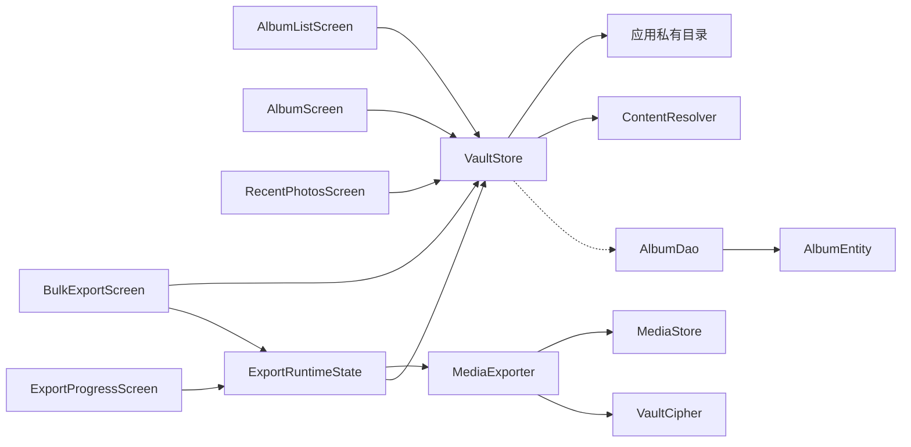

# 媒体存储系统集成

<cite>
**本文档引用的文件**
- [android/app/src/main/kotlin/com/xpx/vault/ui/vault/VaultStore.kt](file://android/app/src/main/kotlin/com/xpx/vault/ui/vault/VaultStore.kt)
- [android/app/src/main/kotlin/com/xpx/vault/ui/AlbumListScreen.kt](file://android/app/src/main/kotlin/com/xpx/vault/ui/AlbumListScreen.kt)
- [android/app/src/main/kotlin/com/xpx/vault/ui/AlbumScreen.kt](file://android/app/src/main/kotlin/com/xpx/vault/ui/AlbumScreen.kt)
- [android/app/src/main/kotlin/com/xpx/vault/ui/RecentPhotosScreen.kt](file://android/app/src/main/kotlin/com/xpx/vault/ui/RecentPhotosScreen.kt)
- [android/app/src/main/AndroidManifest.xml](file://android/app/src/main/AndroidManifest.xml)
- [android/app/src/main/kotlin/com/xpx/vault/ui/MainActivity.kt](file://android/app/src/main/kotlin/com/xpx/vault/ui/MainActivity.kt)
- [android/core/data/src/main/kotlin/com/xpx/vault/data/db/dao/AlbumDao.kt](file://android/core/data/src/main/kotlin/com/xpx/vault/data/db/dao/AlbumDao.kt)
- [android/core/data/src/main/kotlin/com/xpx/vault/data/db/entity/AlbumEntity.kt](file://android/core/data/src/main/kotlin/com/xpx/vault/data/db/entity/AlbumEntity.kt)
- [android/app/src/main/kotlin/com/xpx/vault/ui/export/MediaExporter.kt](file://android/app/src/main/kotlin/com/xpx/vault/ui/export/MediaExporter.kt)
- [android/app/src/main/kotlin/com/xpx/vault/ui/export/ExportRuntimeState.kt](file://android/app/src/main/kotlin/com/xpx/vault/ui/export/ExportRuntimeState.kt)
- [android/app/src/main/kotlin/com/xpx/vault/ui/BulkExportScreen.kt](file://android/app/src/main/kotlin/com/xpx/vault/ui/BulkExportScreen.kt)
- [android/app/src/main/kotlin/com/xpx/vault/ui/ExportProgressScreen.kt](file://android/app/src/main/kotlin/com/xpx/vault/ui/ExportProgressScreen.kt)
- [android/app/src/main/kotlin/com/xpx/vault/ui/ExportResultScreen.kt](file://android/app/src/main/kotlin/com/xpx/vault/ui/ExportResultScreen.kt)
- [android/core/data/src/main/kotlin/com/xpx/vault/data/crypto/VaultCipher.kt](file://android/core/data/src/main/kotlin/com/xpx/vault/data/crypto/VaultCipher.kt)
</cite>

## 更新摘要
**变更内容**
- 新增MediaExporter组件实现Android平台特定的媒体导出功能
- 新增ExportRuntimeState用于管理导出状态和批量导出流程
- 新增批量导出UI组件：BulkExportScreen、ExportProgressScreen、ExportResultScreen
- 实现Android 10+的MediaStore API和旧版本的MediaScanner回退机制
- 支持系统相册的批量导出功能，包括并发处理和进度跟踪
- **新增**：媒体导出系统性能优化，包括新的零拷贝传输机制和改进的进度报告系统
- **新增**：MediaExporter.fastCopy方法实现FileChannel.transferTo零拷贝优化
- **新增**：ExportRuntimeState采用100ms进度节流机制，避免频繁触发UI重组

## 目录
1. [简介](#简介)
2. [项目结构](#项目结构)
3. [核心组件](#核心组件)
4. [架构总览](#架构总览)
5. [详细组件分析](#详细组件分析)
6. [媒体导出系统](#媒体导出系统)
7. [性能优化详解](#性能优化详解)
8. [依赖关系分析](#依赖关系分析)
9. [性能考虑](#性能考虑)
10. [故障排查指南](#故障排查指南)
11. [结论](#结论)
12. [附录](#附录)

## 简介
本文件面向开发者，系统性阐述 AI 照片保险库项目在 Android 平台上的媒体存储系统集成方案。重点覆盖以下方面：
- 与 Android 媒体访问权限体系的对接（READ_MEDIA_IMAGES、READ_MEDIA_VIDEO、READ_EXTERNAL_STORAGE）
- 相册读取、照片导入、批量选择与导入流程
- 媒体内容的查询、过滤与排序机制
- 相册权限管理、存储空间检测与媒体文件处理策略
- 媒体数据同步与缓存策略
- **新增**：媒体导出系统，支持批量导出到系统相册
- **新增**：MediaExporter组件实现Android 10+ MediaStore API和旧版本MediaScanner回退机制
- **新增**：媒体导出系统性能优化，包括零拷贝传输机制和进度节流
- 错误处理与异常情况应对
- 面向开发者的最佳实践与集成指导

需要特别说明：当前仓库中的媒体存储实现采用应用私有目录作为"保险库"存储，而非直接读写系统相册或 MediaStore；因此本文档聚焦于该实现路径下的设计与使用方式。

## 项目结构
围绕媒体存储功能的关键文件组织如下：
- UI 层：相册列表、相册详情、最近照片等界面通过 VaultStore 提供的数据进行展示与交互
- **新增**：批量导出UI组件：BulkExportScreen、ExportProgressScreen、ExportResultScreen
- 数据层：VaultStore 负责媒体数据的读取、导入、缓存与持久化辅助
- **新增**：ExportRuntimeState管理导出状态和批量导出流程
- **新增**：MediaExporter组件实现媒体导出功能，包含高性能零拷贝传输
- 权限声明：AndroidManifest 中声明了必要的媒体读取权限
- 导航与路由：MainActivity 统一管理页面跳转与参数传递

**图表来源**
- [android/app/src/main/kotlin/com/xpx/vault/ui/BulkExportScreen.kt:1-341](file://android/app/src/main/kotlin/com/xpx/vault/ui/BulkExportScreen.kt#L1-L341)
- [android/app/src/main/kotlin/com/xpx/vault/ui/ExportProgressScreen.kt:1-159](file://android/app/src/main/kotlin/com/xpx/vault/ui/ExportProgressScreen.kt#L1-L159)
- [android/app/src/main/kotlin/com/xpx/vault/ui/ExportResultScreen.kt:1-134](file://android/app/src/main/kotlin/com/xpx/vault/ui/ExportResultScreen.kt#L1-L134)
- [android/app/src/main/kotlin/com/xpx/vault/ui/export/MediaExporter.kt:1-232](file://android/app/src/main/kotlin/com/xpx/vault/ui/export/MediaExporter.kt#L1-L232)
- [android/app/src/main/kotlin/com/xpx/vault/ui/export/ExportRuntimeState.kt:1-180](file://android/app/src/main/kotlin/com/xpx/vault/ui/export/ExportRuntimeState.kt#L1-L180)

**章节来源**
- [android/app/src/main/kotlin/com/xpx/vault/ui/AlbumListScreen.kt:1-185](file://android/app/src/main/kotlin/com/xpx/vault/ui/AlbumListScreen.kt#L1-L185)
- [android/app/src/main/kotlin/com/xpx/vault/ui/AlbumScreen.kt:1-212](file://android/app/src/main/kotlin/com/xpx/vault/ui/AlbumScreen.kt#L1-L212)
- [android/app/src/main/kotlin/com/xpx/vault/ui/RecentPhotosScreen.kt:1-169](file://android/app/src/main/kotlin/com/xpx/vault/ui/RecentPhotosScreen.kt#L1-L169)
- [android/app/src/main/kotlin/com/xpx/vault/ui/vault/VaultStore.kt:1-226](file://android/app/src/main/kotlin/com/xpx/vault/ui/vault/VaultStore.kt#L1-L226)
- [android/app/src/main/AndroidManifest.xml:1-38](file://android/app/src/main/AndroidManifest.xml#L1-L38)
- [android/app/src/main/kotlin/com/xpx/vault/ui/MainActivity.kt:1-262](file://android/app/src/main/kotlin/com/xpx/vault/ui/MainActivity.kt#L1-L262)
- [android/core/data/src/main/kotlin/com/xpx/vault/data/db/dao/AlbumDao.kt:1-18](file://android/core/data/src/main/kotlin/com/xpx/vault/data/db/dao/AlbumDao.kt#L1-L18)
- [android/core/data/src/main/kotlin/com/xpx/vault/data/db/entity/AlbumEntity.kt:1-19](file://android/core/data/src/main/kotlin/com/xpx/vault/data/db/entity/AlbumEntity.kt#L1-L19)

## 核心组件
- VaultStore：应用私有目录的媒体存储中心，负责相册创建、照片列举、导入、搜索、统计与缓存
- **新增**：MediaExporter：Android平台特定的媒体导出组件，支持批量导出到系统相册，包含零拷贝传输优化
- **新增**：ExportRuntimeState：导出状态管理器，负责批量导出流程的状态跟踪，采用100ms进度节流机制
- UI 层组件：AlbumListScreen、AlbumScreen、RecentPhotosScreen 通过 VaultStore 获取数据并驱动界面更新
- **新增**：批量导出UI组件：BulkExportScreen、ExportProgressScreen、ExportResultScreen
- Room 持久化：AlbumDao、AlbumEntity 用于与数据库交互（当前媒体数据以文件为主，Room 用于相册元信息）
- 权限声明：AndroidManifest 中声明 READ_MEDIA_IMAGES、READ_MEDIA_VIDEO、READ_EXTERNAL_STORAGE（兼容旧版）

**章节来源**
- [android/app/src/main/kotlin/com/xpx/vault/ui/vault/VaultStore.kt:1-226](file://android/app/src/main/kotlin/com/xpx/vault/ui/vault/VaultStore.kt#L1-L226)
- [android/app/src/main/kotlin/com/xpx/vault/ui/export/MediaExporter.kt:1-232](file://android/app/src/main/kotlin/com/xpx/vault/ui/export/MediaExporter.kt#L1-L232)
- [android/app/src/main/kotlin/com/xpx/vault/ui/export/ExportRuntimeState.kt:1-180](file://android/app/src/main/kotlin/com/xpx/vault/ui/export/ExportRuntimeState.kt#L1-L180)
- [android/core/data/src/main/kotlin/com/xpx/vault/data/db/dao/AlbumDao.kt:1-18](file://android/core/data/src/main/kotlin/com/xpx/vault/data/db/dao/AlbumDao.kt#L1-L18)
- [android/core/data/src/main/kotlin/com/xpx/vault/data/db/entity/AlbumEntity.kt:1-19](file://android/core/data/src/main/kotlin/com/xpx/vault/data/db/entity/AlbumEntity.kt#L1-L19)
- [android/app/src/main/AndroidManifest.xml:1-38](file://android/app/src/main/AndroidManifest.xml#L1-L38)

## 架构总览
媒体存储系统采用"UI 层调用 VaultStore → VaultStore 访问应用私有目录/ContentResolver → 缓存与 Room 协同"的分层架构。UI 层通过协程在 IO 线程执行耗时操作，避免阻塞主线程；VaultStore 内置内存缓存提升读取性能；导入流程通过 ContentResolver 读取外部 URI 并落盘到应用私有目录，同时进行去重校验。

**新增**：媒体导出系统采用"UI 层调用 ExportRuntimeState → ExportRuntimeState 调用 MediaExporter → MediaExporter 使用零拷贝传输和 MediaStore API 或 MediaScanner 回退机制 → 系统相册"的架构。

**图表来源**
- [android/app/src/main/kotlin/com/xpx/vault/ui/vault/VaultStore.kt:47-154](file://android/app/src/main/kotlin/com/xpx/vault/ui/vault/VaultStore.kt#L47-L154)
- [android/app/src/main/kotlin/com/xpx/vault/ui/AlbumListScreen.kt:58-73](file://android/app/src/main/kotlin/com/xpx/vault/ui/AlbumListScreen.kt#L58-L73)
- [android/app/src/main/kotlin/com/xpx/vault/ui/AlbumScreen.kt:82-93](file://android/app/src/main/kotlin/com/xpx/vault/ui/AlbumScreen.kt#L82-L93)
- [android/app/src/main/kotlin/com/xpx/vault/ui/export/ExportRuntimeState.kt:68-128](file://android/app/src/main/kotlin/com/xpx/vault/ui/export/ExportRuntimeState.kt#L68-L128)
- [android/app/src/main/kotlin/com/xpx/vault/ui/export/MediaExporter.kt:38-52](file://android/app/src/main/kotlin/com/xpx/vault/ui/export/MediaExporter.kt#L38-L52)

## 详细组件分析

### VaultStore：媒体存储与缓存中心
- 功能职责
  - 初始化与迁移：确保根目录与默认相册存在，必要时迁移旧版本数据
  - 相册管理：创建相册、列举相册、统计照片总数
  - 照片管理：列举相册内照片、最近照片、按名称搜索
  - 导入流程：从 PickVisualMedia 返回的 URI 导入，支持去重与失败处理
  - 缓存策略：内存缓存快照与相册级缓存，减少重复扫描
- 关键数据结构
  - VaultPhoto/VaultAlbum/VaultSnapshot：用于 UI 渲染的数据模型
  - 导入结果枚举：ADDED/DUPLICATE/FAILED
- 处理逻辑要点
  - 列举与排序：按修改时间降序排列
  - 去重策略：基于 SHA-256 哈希命名，若目标文件已存在则视为重复
  - 容错处理：输入流为空、重命名失败时回退复制并清理临时文件

**图表来源**
- [android/app/src/main/kotlin/com/xpx/vault/ui/vault/VaultStore.kt:14-37](file://android/app/src/main/kotlin/com/xpx/vault/ui/vault/VaultStore.kt#L14-L37)
- [android/app/src/main/kotlin/com/xpx/vault/ui/vault/VaultStore.kt:39-224](file://android/app/src/main/kotlin/com/xpx/vault/ui/vault/VaultStore.kt#L39-L224)

**章节来源**
- [android/app/src/main/kotlin/com/xpx/vault/ui/vault/VaultStore.kt:1-226](file://android/app/src/main/kotlin/com/xpx/vault/ui/vault/VaultStore.kt#L1-L226)

### 相册读取与展示
- AlbumListScreen：首次进入与 onResume 时触发刷新；支持按时间/名称筛选标签（UI 层逻辑）
- AlbumScreen：展示指定相册的照片网格，支持从图库批量选择并导入
- RecentPhotosScreen：展示最近照片，支持按日期/相册筛选标签

**图表来源**
- [android/app/src/main/kotlin/com/xpx/vault/ui/AlbumListScreen.kt:58-73](file://android/app/src/main/kotlin/com/xpx/vault/ui/AlbumListScreen.kt#L58-L73)

**章节来源**
- [android/app/src/main/kotlin/com/xpx/vault/ui/AlbumListScreen.kt:1-185](file://android/app/src/main/kotlin/com/xpx/vault/ui/AlbumListScreen.kt#L1-L185)
- [android/app/src/main/kotlin/com/xpx/vault/ui/AlbumScreen.kt:1-212](file://android/app/src/main/kotlin/com/xpx/vault/ui/AlbumScreen.kt#L1-L212)
- [android/app/src/main/kotlin/com/xpx/vault/ui/RecentPhotosScreen.kt:1-169](file://android/app/src/main/kotlin/com/xpx/vault/ui/RecentPhotosScreen.kt#L1-L169)

### 照片导入流程（PickVisualMedia）
- 用户通过图库选择图片，系统回调返回多个 URI
- VaultStore 逐个打开 ContentResolver 输入流，写入临时文件并计算哈希
- 若目标文件已存在则视为重复；否则重命名或回退复制后删除临时文件
- 导入完成后刷新缓存并重新加载相册内容

**图表来源**
- [android/app/src/main/kotlin/com/xpx/vault/ui/AlbumScreen.kt:82-93](file://android/app/src/main/kotlin/com/xpx/vault/ui/AlbumScreen.kt#L82-L93)
- [android/app/src/main/kotlin/com/xpx/vault/ui/vault/VaultStore.kt:120-154](file://android/app/src/main/kotlin/com/xpx/vault/ui/vault/VaultStore.kt#L120-L154)

**章节来源**
- [android/app/src/main/kotlin/com/xpx/vault/ui/AlbumScreen.kt:1-212](file://android/app/src/main/kotlin/com/xpx/vault/ui/AlbumScreen.kt#L1-L212)
- [android/app/src/main/kotlin/com/xpx/vault/ui/vault/VaultStore.kt:120-154](file://android/app/src/main/kotlin/com/xpx/vault/ui/vault/VaultStore.kt#L120-L154)

### 查询、过滤与排序机制
- 相册列表：按名称排序，优先显示"默认相册"
- 相册内照片：按最后修改时间降序排列
- 最近照片：按修改时间降序并限制数量
- 搜索：按文件名包含匹配，再按修改时间降序

**章节来源**
- [android/app/src/main/kotlin/com/xpx/vault/ui/vault/VaultStore.kt:186-203](file://android/app/src/main/kotlin/com/xpx/vault/ui/vault/VaultStore.kt#L186-L203)
- [android/app/src/main/kotlin/com/xpx/vault/ui/vault/VaultStore.kt:86-107](file://android/app/src/main/kotlin/com/xpx/vault/ui/vault/VaultStore.kt#L86-L107)
- [android/app/src/main/kotlin/com/xpx/vault/ui/vault/VaultStore.kt:81-84](file://android/app/src/main/kotlin/com/xpx/vault/ui/vault/VaultStore.kt#L81-L84)
- [android/app/src/main/kotlin/com/xpx/vault/ui/vault/VaultStore.kt:109-113](file://android/app/src/main/kotlin/com/xpx/vault/ui/vault/VaultStore.kt#L109-L113)

### 权限管理与存储空间检测
- 权限声明：在清单中声明 CAMERA、READ_MEDIA_IMAGES、READ_MEDIA_VIDEO、READ_EXTERNAL_STORAGE（兼容旧版）
- 运行时权限：UI 层在 HomeScreen 中根据系统版本组合申请 READ_MEDIA_IMAGES、READ_MEDIA_VIDEO 或 READ_EXTERNAL_STORAGE
- 存储空间检测：VaultStore 提供 totalPhotos 与根目录扫描，可用于估算占用；建议结合系统存储 API 进一步完善

**章节来源**
- [android/app/src/main/AndroidManifest.xml:3-6](file://android/app/src/main/AndroidManifest.xml#L3-L6)
- [android/app/src/main/kotlin/com/xpx/vault/app/ui/AlbumListScreen.kt:1-185](file://android/app/src/main/kotlin/com/xpx/vault/app/ui/AlbumListScreen.kt#L1-L185)
- [android/app/src/main/kotlin/com/xpx/vault/app/ui/AlbumScreen.kt:1-212](file://android/app/src/main/kotlin/com/xpx/vault/app/ui/AlbumScreen.kt#L1-L212)
- [android/app/src/main/kotlin/com/xpx/vault/app/ui/RecentPhotosScreen.kt:1-169](file://android/app/src/main/kotlin/com/xpx/vault/app/ui/RecentPhotosScreen.kt#L1-L169)
- [android/app/src/main/kotlin/com/xpx/vault/ui/vault/VaultStore.kt:115-118](file://android/app/src/main/kotlin/com/xpx/vault/ui/vault/VaultStore.kt#L115-L118)

### 媒体数据同步与缓存策略
- 内存缓存：VaultStore 维护快照与相册级缓存，避免重复扫描
- 刷新时机：UI 生命周期 ON_RESUME 时触发刷新，保证数据一致性
- 同步策略：导入完成后主动刷新相关相册缓存，确保 UI 即时更新

**章节来源**
- [android/app/src/main/kotlin/com/xpx/vault/ui/vault/VaultStore.kt:40-45](file://android/app/src/main/kotlin/com/xpx/vault/ui/vault/VaultStore.kt#L40-L45)
- [android/app/src/main/kotlin/com/xpx/vault/ui/AlbumListScreen.kt:65-73](file://android/app/src/main/kotlin/com/xpx/vault/ui/AlbumListScreen.kt#L65-L73)
- [android/app/src/main/kotlin/com/xpx/vault/ui/AlbumScreen.kt:72-80](file://android/app/src/main/kotlin/com/xpx/vault/ui/AlbumScreen.kt#L72-L80)

### 错误处理与异常情况
- 导入失败：当无法打开输入流或写入失败时返回 FAILED
- 重复导入：目标文件已存在时返回 DUPLICATE
- 目录不存在：列举相册内照片时若相册目录不存在，返回空列表并缓存空结果
- 文件重命名失败：回退复制并删除临时文件，保证数据完整性

**章节来源**
- [android/app/src/main/kotlin/com/xpx/vault/ui/vault/VaultStore.kt:129-154](file://android/app/src/main/kotlin/com/xpx/vault/ui/vault/VaultStore.kt#L129-L154)
- [android/app/src/main/kotlin/com/xpx/vault/ui/vault/VaultStore.kt:89-92](file://android/app/src/main/kotlin/com/xpx/vault/ui/vault/VaultStore.kt#L89-L92)

## 媒体导出系统

### MediaExporter：Android平台媒体导出组件
- 功能职责
  - 支持Android 10+的MediaStore API批量导出到系统相册
  - 兼容Android 9及以下版本的MediaScanner回退机制
  - 自动检测文件类型（图片/视频）并选择相应的MediaStore集合
  - 使用IS_PENDING事务确保原子性写入，避免部分可见文件
  - **新增**：实现高性能文件拷贝，支持零拷贝和缓冲区回退
  - 生成友好的显示名称，便于用户识别导出的文件
- 关键特性
  - 并发导出：支持最多3个并发任务，平衡性能和资源使用
  - **新增**：进度节流：避免频繁触发UI重组，最后一项必定更新
  - 失败回滚：导出失败时自动清理临时URI，保持系统一致性
  - 类型检测：自动解析MIME类型，支持多种图片和视频格式
  - **新增**：零拷贝优化：优先使用FileChannel.transferTo实现内核级拷贝
- 处理逻辑要点
  - Android 10+：使用MediaStore.Images.Media或MediaStore.Video.Media
  - Android 9及以下：直接写入公共目录并通过MediaScanner扫描
  - 文件命名：保留原扩展名，生成易于识别的显示名称
  - 错误处理：详细的失败原因分类和日志记录

**图表来源**
- [android/app/src/main/kotlin/com/xpx/vault/ui/export/MediaExporter.kt:27-52](file://android/app/src/main/kotlin/com/xpx/vault/ui/export/MediaExporter.kt#L27-L52)
- [android/app/src/main/kotlin/com/xpx/vault/ui/export/MediaExporter.kt:31-36](file://android/app/src/main/kotlin/com/xpx/vault/ui/export/MediaExporter.kt#L31-L36)

### ExportRuntimeState：导出状态管理器
- 功能职责
  - 管理批量导出的待处理路径集合
  - 跟踪导出进度和当前处理的文件名
  - 存储最近一次导出结果供结果页面展示
  - 控制并发导出的线程池和信号量
  - **新增**：实现进度节流，避免过度UI重组
- 关键参数
  - MAX_CONCURRENCY = 3：平衡性能和资源使用
  - **新增**：PROGRESS_THROTTLE_MS = 100：节流间隔，避免频繁更新
  - 进度状态：done/total/currentName
- 处理逻辑要点
  - 并发控制：使用Semaphore限制最大并发数
  - **新增**：进度更新：节流更新UI，确保最终状态一致性
  - 结果聚合：收集成功和失败的导出项
  - 异常处理：捕获并记录导出过程中的异常

**图表来源**
- [android/app/src/main/kotlin/com/xpx/vault/ui/export/ExportRuntimeState.kt:24-128](file://android/app/src/main/kotlin/com/xpx/vault/ui/export/ExportRuntimeState.kt#L24-L128)
- [android/app/src/main/kotlin/com/xpx/vault/ui/export/ExportRuntimeState.kt:131-144](file://android/app/src/main/kotlin/com/xpx/vault/ui/export/ExportRuntimeState.kt#L131-L144)

### 批量导出UI组件
- BulkExportScreen：批量导出入口，支持图片/视频筛选和批量选择
- ExportProgressScreen：导出进度显示，实时更新进度和当前处理文件
- ExportResultScreen：导出结果展示，支持打开系统相册和完成操作

**图表来源**
- [android/app/src/main/kotlin/com/xpx/vault/ui/BulkExportScreen.kt:169-177](file://android/app/src/main/kotlin/com/xpx/vault/ui/BulkExportScreen.kt#L169-L177)
- [android/app/src/main/kotlin/com/xpx/vault/ui/ExportProgressScreen.kt:47-64](file://android/app/src/main/kotlin/com/xpx/vault/ui/ExportProgressScreen.kt#L47-L64)
- [android/app/src/main/kotlin/com/xpx/vault/ui/ExportResultScreen.kt:38-112](file://android/app/src/main/kotlin/com/xpx/vault/ui/ExportResultScreen.kt#L38-L112)

### 导出流程详解
- 用户在BulkExportScreen中选择要导出的媒体文件
- ExportRuntimeState.enqueue设置待导出路径并启动进度页面
- ExportProgressScreen调用ExportRuntimeState.runExport开始批量导出
- MediaExporter根据Android版本选择合适的导出策略
- 导出完成后ExportResultScreen显示结果并提供打开相册选项

**章节来源**
- [android/app/src/main/kotlin/com/xpx/vault/ui/export/MediaExporter.kt:19-26](file://android/app/src/main/kotlin/com/xpx/vault/ui/export/MediaExporter.kt#L19-L26)
- [android/app/src/main/kotlin/com/xpx/vault/ui/export/MediaExporter.kt:38-52](file://android/app/src/main/kotlin/com/xpx/vault/ui/export/MediaExporter.kt#L38-L52)
- [android/app/src/main/kotlin/com/xpx/vault/ui/export/ExportRuntimeState.kt:57-63](file://android/app/src/main/kotlin/com/xpx/vault/ui/export/ExportRuntimeState.kt#L57-L63)
- [android/app/src/main/kotlin/com/xpx/vault/ui/export/ExportRuntimeState.kt:68-128](file://android/app/src/main/kotlin/com/xpx/vault/ui/export/ExportRuntimeState.kt#L68-L128)
- [android/app/src/main/kotlin/com/xpx/vault/ui/BulkExportScreen.kt:58-179](file://android/app/src/main/kotlin/com/xpx/vault/ui/BulkExportScreen.kt#L58-L179)
- [android/app/src/main/kotlin/com/xpx/vault/ui/ExportProgressScreen.kt:36-159](file://android/app/src/main/kotlin/com/xpx/vault/ui/ExportProgressScreen.kt#L36-L159)
- [android/app/src/main/kotlin/com/xpx/vault/ui/ExportResultScreen.kt:38-134](file://android/app/src/main/kotlin/com/xpx/vault/ui/ExportResultScreen.kt#L38-L134)

## 性能优化详解

### 零拷贝传输机制
MediaExporter实现了先进的零拷贝传输机制，显著提升大文件导出性能：

- **FileChannel.transferTo优先策略**：在支持的环境下使用内核级零拷贝，避免用户态-内核态双向拷贝
- **智能回退机制**：当transferTo返回0或抛出异常时，自动回退到256KB缓冲区循环拷贝
- **分段传输优化**：针对部分内核transferTo一次只能拷贝不到2GB的情况，实现循环传输
- **性能对比**：相比传统缓冲区拷贝，零拷贝可减少CPU使用率和内存带宽占用

**图表来源**
- [android/app/src/main/kotlin/com/xpx/vault/ui/export/MediaExporter.kt:204-230](file://android/app/src/main/kotlin/com/xpx/vault/ui/export/MediaExporter.kt#L204-L230)

### 进度节流优化
ExportRuntimeState采用了智能的进度节流机制，避免频繁触发UI重组：

- **固定节流间隔**：100ms的节流间隔，平衡UI响应性和性能开销
- **最终一致性保证**：无论节流如何，最后一项导出会立即更新UI
- **智能更新策略**：只有在进度发生变化或达到节流间隔时才更新UI状态
- **内存优化**：避免大量中间状态对象的创建和销毁

**章节来源**
- [android/app/src/main/kotlin/com/xpx/vault/ui/export/MediaExporter.kt:204-230](file://android/app/src/main/kotlin/com/xpx/vault/ui/export/MediaExporter.kt#L204-L230)
- [android/app/src/main/kotlin/com/xpx/vault/ui/export/ExportRuntimeState.kt:66-67](file://android/app/src/main/kotlin/com/xpx/vault/ui/export/ExportRuntimeState.kt#L66-L67)
- [android/app/src/main/kotlin/com/xpx/vault/ui/export/ExportRuntimeState.kt:134-144](file://android/app/src/main/kotlin/com/xpx/vault/ui/export/ExportRuntimeState.kt#L134-L144)

### 并发导出优化
系统采用多线程并发导出策略，最大化利用系统资源：

- **并发度控制**：最多3个并发任务，避免过度消耗系统资源
- **信号量管理**：使用Semaphore确保并发安全和资源控制
- **异常隔离**：每个导出任务独立执行，失败不影响其他任务
- **进度聚合**：统一收集和更新所有任务的进度状态

**章节来源**
- [android/app/src/main/kotlin/com/xpx/vault/ui/export/ExportRuntimeState.kt:66-67](file://android/app/src/main/kotlin/com/xpx/vault/ui/export/ExportRuntimeState.kt#L66-L67)
- [android/app/src/main/kotlin/com/xpx/vault/ui/export/ExportRuntimeState.kt:101-148](file://android/app/src/main/kotlin/com/xpx/vault/ui/export/ExportRuntimeState.kt#L101-L148)

## 依赖关系分析
- UI 层依赖 VaultStore 提供的数据与能力
- **新增**：批量导出UI组件依赖 ExportRuntimeState 和 MediaExporter
- VaultStore 依赖应用私有目录与 ContentResolver
- **新增**：MediaExporter 依赖 MediaStore API 和系统存储服务
- **新增**：MediaExporter依赖VaultCipher进行流式解密
- Room 的 AlbumDao/AlbumEntity 用于相册元信息持久化（当前媒体数据以文件为主）

**图表来源**
- [android/app/src/main/kotlin/com/xpx/vault/ui/AlbumListScreen.kt:1-185](file://android/app/src/main/kotlin/com/xpx/vault/ui/AlbumListScreen.kt#L1-L185)
- [android/app/src/main/kotlin/com/xpx/vault/ui/AlbumScreen.kt:1-212](file://android/app/src/main/kotlin/com/xpx/vault/ui/AlbumScreen.kt#L1-L212)
- [android/app/src/main/kotlin/com/xpx/vault/ui/RecentPhotosScreen.kt:1-169](file://android/app/src/main/kotlin/com/xpx/vault/ui/RecentPhotosScreen.kt#L1-L169)
- [android/app/src/main/kotlin/com/xpx/vault/ui/BulkExportScreen.kt:1-341](file://android/app/src/main/kotlin/com/xpx/vault/ui/BulkExportScreen.kt#L1-L341)
- [android/app/src/main/kotlin/com/xpx/vault/ui/ExportProgressScreen.kt:1-159](file://android/app/src/main/kotlin/com/xpx/vault/ui/ExportProgressScreen.kt#L1-L159)
- [android/app/src/main/kotlin/com/xpx/vault/ui/ExportResultScreen.kt:1-134](file://android/app/src/main/kotlin/com/xpx/vault/ui/ExportResultScreen.kt#L1-L134)
- [android/app/src/main/kotlin/com/xpx/vault/ui/vault/VaultStore.kt:1-226](file://android/app/src/main/kotlin/com/xpx/vault/ui/vault/VaultStore.kt#L1-L226)
- [android/app/src/main/kotlin/com/xpx/vault/ui/export/ExportRuntimeState.kt:1-180](file://android/app/src/main/kotlin/com/xpx/vault/ui/export/ExportRuntimeState.kt#L1-L180)
- [android/app/src/main/kotlin/com/xpx/vault/ui/export/MediaExporter.kt:1-232](file://android/app/src/main/kotlin/com/xpx/vault/ui/export/MediaExporter.kt#L1-L232)
- [android/core/data/src/main/kotlin/com/xpx/vault/data/crypto/VaultCipher.kt:1-303](file://android/core/data/src/main/kotlin/com/xpx/vault/data/crypto/VaultCipher.kt#L1-L303)
- [android/core/data/src/main/kotlin/com/xpx/vault/data/db/dao/AlbumDao.kt:1-18](file://android/core/data/src/main/kotlin/com/xpx/vault/data/db/dao/AlbumDao.kt#L1-L18)
- [android/core/data/src/main/kotlin/com/xpx/vault/data/db/entity/AlbumEntity.kt:1-19](file://android/core/data/src/main/kotlin/com/xpx/vault/data/db/entity/AlbumEntity.kt#L1-L19)

**章节来源**
- [android/app/src/main/kotlin/com/xpx/vault/ui/vault/VaultStore.kt:1-226](file://android/app/src/main/kotlin/com/xpx/vault/ui/vault/VaultStore.kt#L1-L226)
- [android/core/data/src/main/kotlin/com/xpx/vault/data/db/dao/AlbumDao.kt:1-18](file://android/core/data/src/main/kotlin/com/xpx/vault/data/db/dao/AlbumDao.kt#L1-L18)
- [android/core/data/src/main/kotlin/com/xpx/vault/data/db/entity/AlbumEntity.kt:1-19](file://android/core/data/src/main/kotlin/com/xpx/vault/data/db/entity/AlbumEntity.kt#L1-L19)

## 性能考虑
- I/O 线程：所有磁盘与网络操作在 Dispatchers.IO 执行，避免阻塞 UI
- 内存缓存：快照与相册缓存显著降低重复扫描成本
- 排序与截断：对大量数据进行降序排序与限制数量，控制渲染开销
- 导入优化：边读边哈希，避免一次性加载大文件至内存
- **新增**：导出性能优化
  - 并发控制：最多3个并发任务，平衡性能和资源使用
  - **新增**：零拷贝优化：优先使用FileChannel.transferTo实现内核级拷贝
  - **新增**：缓冲区回退：在不支持零拷贝时使用256KB缓冲区
  - **新增**：进度节流：避免频繁触发UI重组，最后一项必定更新
  - **新增**：智能空间检测：导出前检查可用空间，避免磁盘满导致的失败
- 建议：对超大相册可引入分页加载与懒加载策略

## 故障排查指南
- 无法导入：检查 ContentResolver 是否能打开输入流；确认目标文件是否已存在导致重复
- 列表为空：确认相册目录是否存在；检查生命周期刷新逻辑是否触发
- 权限问题：确认运行时权限已授予；必要时引导用户在设置中开启媒体权限
- 存储异常：检查应用私有目录可用空间；关注重命名失败回退逻辑
- **新增**：导出问题排查
  - 导出失败：检查MediaStore API是否可用，确认文件类型支持
  - 并发问题：监控并发任务数量，避免过多并发导致系统压力
  - **新增**：进度异常：检查100ms进度节流机制，确认UI状态更新正常
  - **新增**：零拷贝失败：检查FileChannel支持情况，确认缓冲区回退逻辑正常
  - 文件命名冲突：确认显示名称生成逻辑，避免重复文件名

**章节来源**
- [android/app/src/main/kotlin/com/xpx/vault/ui/vault/VaultStore.kt:129-154](file://android/app/src/main/kotlin/com/xpx/vault/ui/vault/VaultStore.kt#L129-L154)
- [android/app/src/main/kotlin/com/xpx/vault/ui/vault/VaultStore.kt:89-92](file://android/app/src/main/kotlin/com/xpx/vault/ui/vault/VaultStore.kt#L89-L92)
- [android/app/src/main/AndroidManifest.xml:3-6](file://android/app/src/main/AndroidManifest.xml#L3-L6)
- [android/app/src/main/kotlin/com/xpx/vault/ui/export/MediaExporter.kt:40-46](file://android/app/src/main/kotlin/com/xpx/vault/ui/export/MediaExporter.kt#L40-L46)
- [android/app/src/main/kotlin/com/xpx/vault/ui/export/ExportRuntimeState.kt:78-123](file://android/app/src/main/kotlin/com/xpx/vault/ui/export/ExportRuntimeState.kt#L78-L123)

## 结论
本项目采用"应用私有目录 + VaultStore + Compose UI"的媒体存储集成方案，具备清晰的分层与良好的缓存策略。通过 PickVisualMedia 与 ContentResolver 实现安全、可控的媒体导入；通过内存缓存与生命周期刷新保障性能与一致性。

**新增**：媒体导出系统提供了完整的批量导出解决方案，支持Android 10+的MediaStore API和旧版本的MediaScanner回退机制。通过ExportRuntimeState和MediaExporter组件实现了高效的并发导出、进度跟踪和错误处理。该系统采用零拷贝优化和缓冲区回退策略，确保在不同Android版本上都能提供流畅的用户体验。新增的100ms进度节流机制有效避免了UI重组开销，提升了整体性能表现。

建议后续结合系统存储 API 完善空间检测与更细粒度的权限管理，并针对超大相册引入分页与懒加载以进一步优化体验。

## 附录
- 最佳实践
  - 在 UI 层统一通过 VaultStore 获取数据，避免直接访问文件系统
  - 导入流程必须在 IO 线程执行，导入完成后刷新缓存
  - 对相册名称进行清洗与长度限制，防止非法字符与过长名称
  - 在 ON_RESUME 时刷新数据，确保与外部变化保持一致
  - 对导入失败与重复导入进行明确反馈与日志记录
  - **新增**：导出流程遵循并发控制原则，避免过度消耗系统资源
  - **新增**：利用零拷贝优化提高大文件导出性能
  - **新增**：实现100ms进度节流机制，避免频繁触发UI重组
  - **新增**：在导出前进行空间检测，提升用户体验