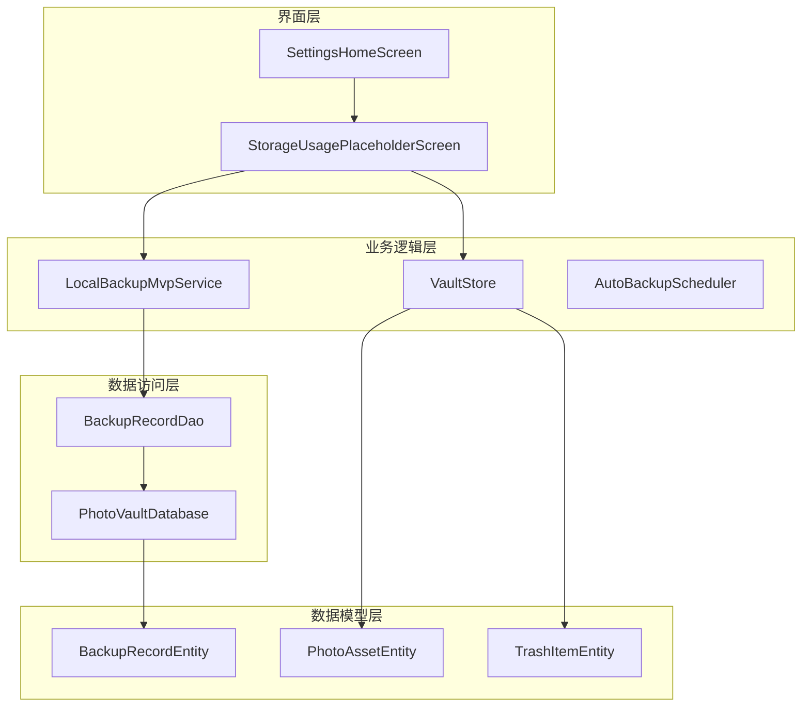
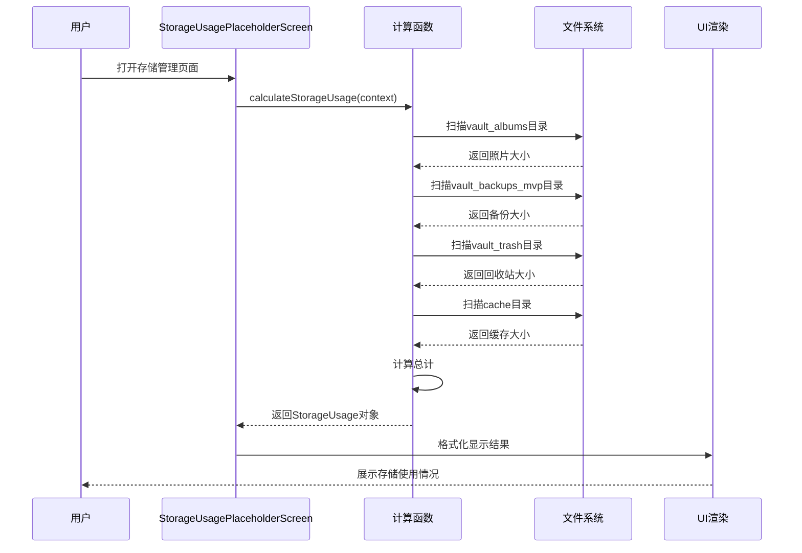
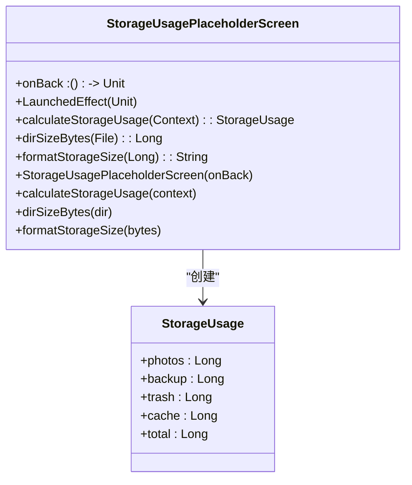
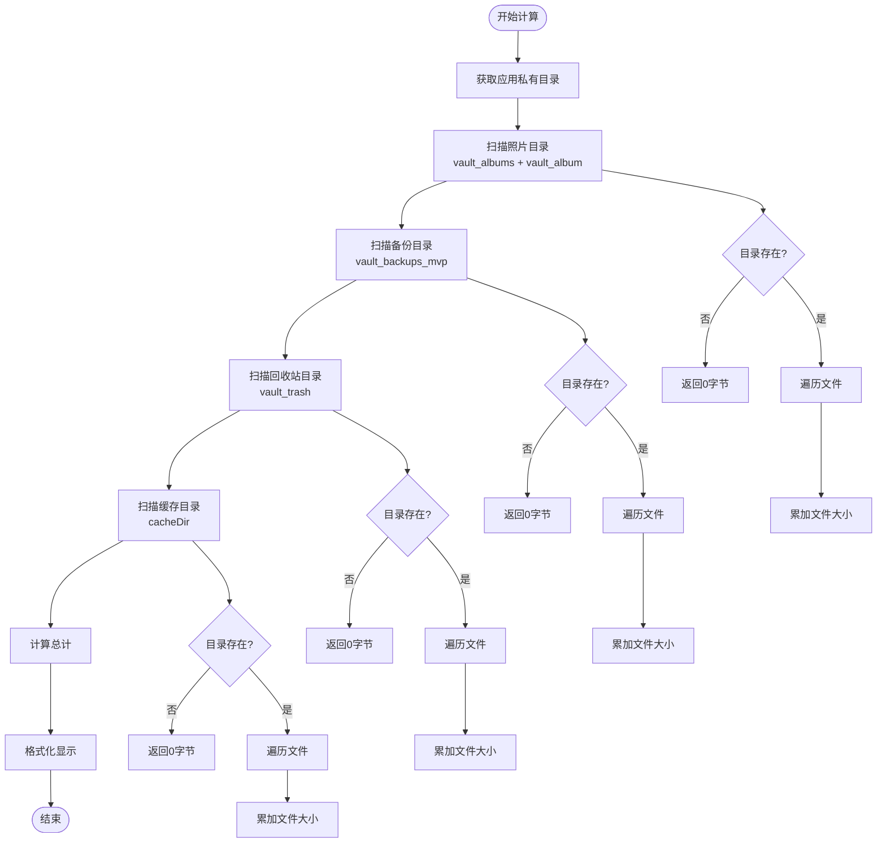
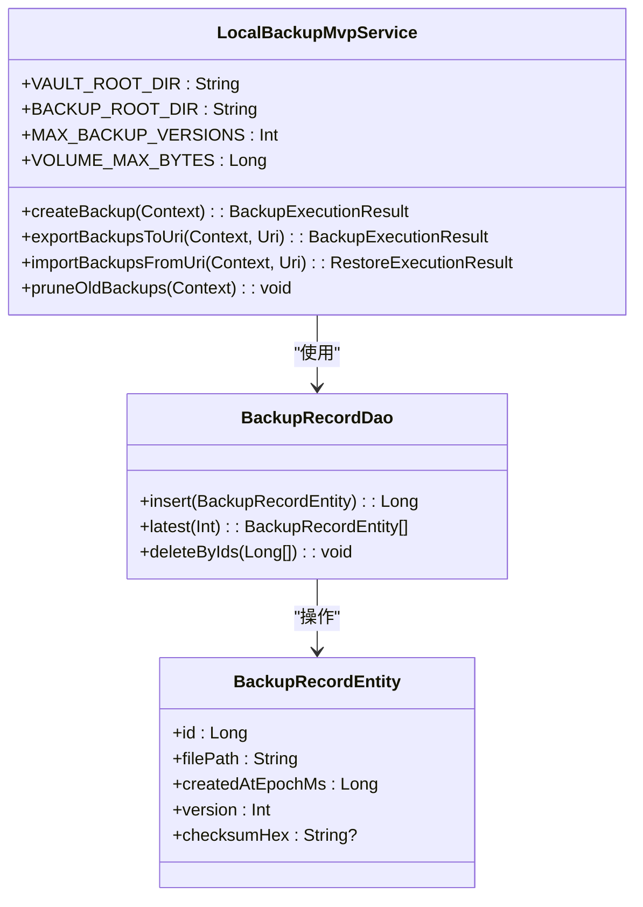
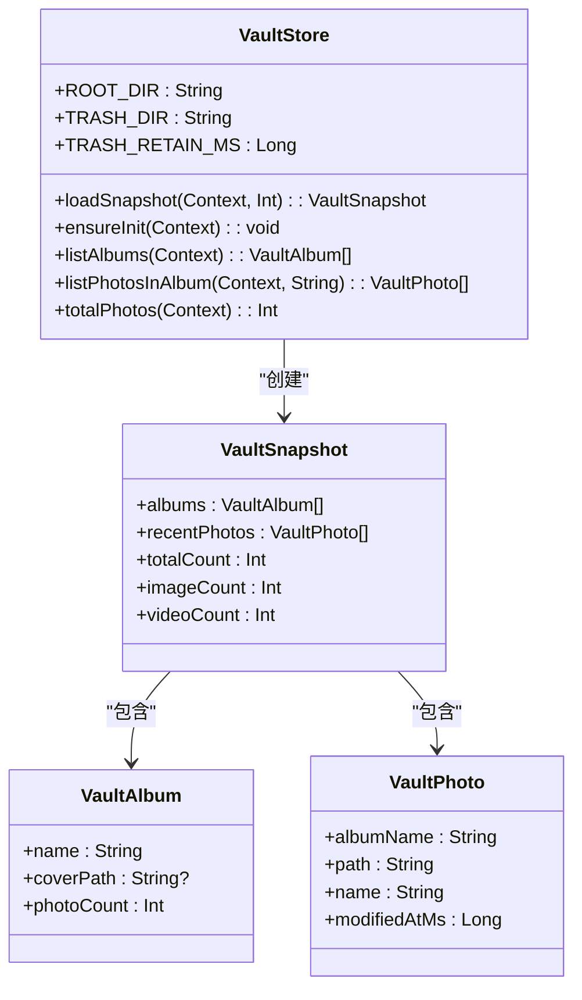
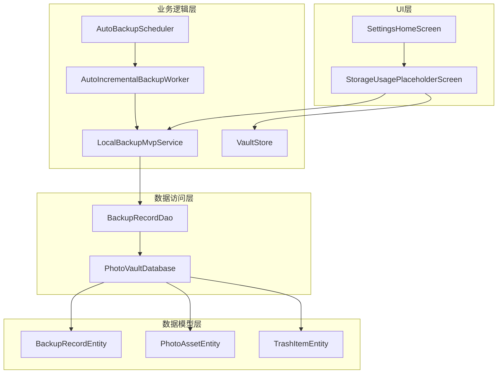

# 存储空间使用计算

<cite>
**本文档引用的文件**
- [StorageUsagePlaceholderScreen.kt](file://android/app/src/main/kotlin/com/xpx/vault/ui/StorageUsagePlaceholderScreen.kt)
- [strings.xml](file://android/app/src/main/res/values/strings.xml)
- [strings.xml（英文）](file://android/app/src/main/res/values-en/strings.xml)
- [SettingsHomeScreen.kt](file://android/app/src/main/kotlin/com/xpx/vault/ui/SettingsHomeScreen.kt)
- [VaultStore.kt](file://android/app/src/main/kotlin/com/xpx/vault/ui/vault/VaultStore.kt)
- [LocalBackupMvpService.kt](file://android/app/src/main/kotlin/com/xpx/vault/ui/backup/LocalBackupMvpService.kt)
- [BackupRecordDao.kt](file://android/core/data/src/main/kotlin/com/xpx/vault/data/db/dao/BackupRecordDao.kt)
- [BackupRecordEntity.kt](file://android/core/data/src/main/kotlin/com/xpx/vault/data/db/entity/BackupRecordEntity.kt)
- [PhotoVaultDatabase.kt](file://android/core/data/src/main/kotlin/com/xpx/vault/data/db/PhotoVaultDatabase.kt)
- [AutoBackupScheduler.kt](file://android/app/src/main/kotlin/com/xpx/vault/ui/backup/AutoBackupScheduler.kt)
- [AutoIncrementalBackupWorker.kt](file://android/app/src/main/kotlin/com/xpx/vault/ui/backup/AutoIncrementalBackupWorker.kt)
</cite>

## 目录
1. [简介](#简介)
2. [项目结构](#项目结构)
3. [核心组件](#核心组件)
4. [架构概览](#架构概览)
5. [详细组件分析](#详细组件分析)
6. [依赖关系分析](#依赖关系分析)
7. [性能考虑](#性能考虑)
8. [故障排除指南](#故障排除指南)
9. [结论](#结论)

## 简介

本文档详细分析了AI照片保险库项目中的存储空间使用计算功能。该项目实现了完整的本地存储空间监控系统，能够实时计算应用私有目录中各个组件的磁盘占用情况，包括加密照片、备份文件、回收站内容和应用缓存。

该系统采用分层架构设计，通过组合式UI组件、数据访问对象和加密服务，提供了准确且用户友好的存储空间统计功能。系统支持多种存储组件的独立计算和汇总显示，为用户提供了全面的存储使用情况概览。

## 项目结构

存储空间计算功能分布在应用的多个层次中，形成了清晰的分层架构：

**图表来源**
- [StorageUsagePlaceholderScreen.kt:1-149](file://android/app/src/main/kotlin/com/xpx/vault/ui/StorageUsagePlaceholderScreen.kt#L1-L149)
- [SettingsHomeScreen.kt:1-200](file://android/app/src/main/kotlin/com/xpx/vault/ui/SettingsHomeScreen.kt#L1-L200)

**章节来源**
- [StorageUsagePlaceholderScreen.kt:1-149](file://android/app/src/main/kotlin/com/xpx/vault/ui/StorageUsagePlaceholderScreen.kt#L1-L149)
- [SettingsHomeScreen.kt:1-200](file://android/app/src/main/kotlin/com/xpx/vault/ui/SettingsHomeScreen.kt#L1-L200)

## 核心组件

存储空间计算系统由以下核心组件构成：

### 1. 存储使用计算组件
- **StorageUsagePlaceholderScreen**: 主要的UI组件，负责展示存储空间使用情况
- **StorageUsage数据类**: 定义存储使用统计的数据结构
- **calculateStorageUsage函数**: 核心计算逻辑，扫描指定目录并计算总大小

### 2. 存储组件扫描器
- **VaultStore**: 照片保险库存储管理，包含照片和相册数据
- **LocalBackupMvpService**: 备份服务，管理加密备份文件
- **TrashItemEntity**: 回收站项目管理
- **Cache目录**: 应用缓存数据

### 3. 数据持久化组件
- **BackupRecordDao**: 备份记录数据访问对象
- **BackupRecordEntity**: 备份记录数据模型
- **PhotoVaultDatabase**: 数据库管理

**章节来源**
- [StorageUsagePlaceholderScreen.kt:109-148](file://android/app/src/main/kotlin/com/xpx/vault/ui/StorageUsagePlaceholderScreen.kt#L109-L148)
- [VaultStore.kt:64-322](file://android/app/src/main/kotlin/com/xpx/vault/ui/vault/VaultStore.kt#L64-L322)
- [LocalBackupMvpService.kt:25-33](file://android/app/src/main/kotlin/com/xpx/vault/ui/backup/LocalBackupMvpService.kt#L25-L33)

## 架构概览

存储空间计算系统采用MVVM架构模式，实现了清晰的关注点分离：

**图表来源**
- [StorageUsagePlaceholderScreen.kt:36-107](file://android/app/src/main/kotlin/com/xpx/vault/ui/StorageUsagePlaceholderScreen.kt#L36-L107)
- [StorageUsagePlaceholderScreen.kt:118-126](file://android/app/src/main/kotlin/com/xpx/vault/ui/StorageUsagePlaceholderScreen.kt#L118-L126)

## 详细组件分析

### 存储使用计算组件

#### StorageUsagePlaceholderScreen 分析

该组件是存储空间计算的核心UI组件，实现了完整的存储使用情况展示功能：

**图表来源**
- [StorageUsagePlaceholderScreen.kt:36-148](file://android/app/src/main/kotlin/com/xpx/vault/ui/StorageUsagePlaceholderScreen.kt#L36-L148)

#### 计算逻辑分析

存储使用计算采用深度优先遍历算法，对指定目录进行递归扫描：

**图表来源**
- [StorageUsagePlaceholderScreen.kt:118-135](file://android/app/src/main/kotlin/com/xpx/vault/ui/StorageUsagePlaceholderScreen.kt#L118-L135)

**章节来源**
- [StorageUsagePlaceholderScreen.kt:36-148](file://android/app/src/main/kotlin/com/xpx/vault/ui/StorageUsagePlaceholderScreen.kt#L36-L148)

### 备份存储管理

#### LocalBackupMvpService 分析

备份服务负责管理加密备份文件的存储使用情况：

**图表来源**
- [LocalBackupMvpService.kt:25-33](file://android/app/src/main/kotlin/com/xpx/vault/ui/backup/LocalBackupMvpService.kt#L25-L33)
- [BackupRecordDao.kt:1-20](file://android/core/data/src/main/kotlin/com/xpx/vault/data/db/dao/BackupRecordDao.kt#L1-L20)
- [BackupRecordEntity.kt:1-19](file://android/core/data/src/main/kotlin/com/xpx/vault/data/db/entity/BackupRecordEntity.kt#L1-L19)

#### 备份体积管理

备份系统采用分卷存储机制，每个卷最大32MB：

**章节来源**
- [LocalBackupMvpService.kt:30-31](file://android/app/src/main/kotlin/com/xpx/vault/ui/backup/LocalBackupMvpService.kt#L30-L31)
- [LocalBackupMvpService.kt:316-361](file://android/app/src/main/kotlin/com/xpx/vault/ui/backup/LocalBackupMvpService.kt#L316-L361)

### 照片存储管理

#### VaultStore 分析

照片存储管理系统负责管理加密照片和相册数据：

**图表来源**
- [VaultStore.kt:64-44](file://android/app/src/main/kotlin/com/xpx/vault/ui/vault/VaultStore.kt#L64-L44)

**章节来源**
- [VaultStore.kt:64-322](file://android/app/src/main/kotlin/com/xpx/vault/ui/vault/VaultStore.kt#L64-L322)

### 设置界面集成

#### SettingsHomeScreen 集成

设置界面提供了存储管理功能的入口点：

**章节来源**
- [SettingsHomeScreen.kt:120-125](file://android/app/src/main/kotlin/com/xpx/vault/ui/SettingsHomeScreen.kt#L120-L125)

## 依赖关系分析

存储空间计算系统的依赖关系呈现清晰的分层结构：

**图表来源**
- [PhotoVaultDatabase.kt:15-37](file://android/core/data/src/main/kotlin/com/xpx/vault/data/db/PhotoVaultDatabase.kt#L15-L37)
- [AutoBackupScheduler.kt:16-84](file://android/app/src/main/kotlin/com/xpx/vault/ui/backup/AutoBackupScheduler.kt#L16-L84)

**章节来源**
- [PhotoVaultDatabase.kt:15-37](file://android/core/data/src/main/kotlin/com/xpx/vault/data/db/PhotoVaultDatabase.kt#L15-L37)
- [AutoBackupScheduler.kt:16-84](file://android/app/src/main/kotlin/com/xpx/vault/ui/backup/AutoBackupScheduler.kt#L16-L84)

## 性能考虑

存储空间计算系统在性能方面采用了多项优化措施：

### 1. 异步计算
- 使用协程在IO线程池中执行文件扫描
- 避免阻塞主线程，保持UI响应性

### 2. 缓存策略
- 计算结果在内存中缓存
- 减少重复计算的开销

### 3. 文件系统优化
- 采用深度优先遍历算法
- 只统计文件大小，忽略目录元数据

### 4. 内存管理
- 流式处理大文件
- 避免一次性加载所有文件到内存

## 故障排除指南

### 常见问题及解决方案

#### 1. 存储计算结果异常
**症状**: 存储使用数据显示为0或异常值
**可能原因**:
- 应用权限不足
- 目录不存在或被删除
- 文件系统访问错误

**解决方法**:
- 检查应用存储权限
- 验证目标目录存在性
- 重启应用重新计算

#### 2. 计算速度慢
**症状**: 存储使用页面加载缓慢
**可能原因**:
- 照片数量过多
- 文件系统响应慢
- 设备存储空间不足

**解决方法**:
- 清理不必要的照片
- 关闭其他占用存储的应用
- 释放设备存储空间

#### 3. 备份文件大小显示异常
**症状**: 备份文件大小与预期不符
**可能原因**:
- 备份文件损坏
- 加密密钥问题
- 备份版本过多

**解决方法**:
- 删除损坏的备份文件
- 重新生成加密密钥
- 清理旧的备份版本

**章节来源**
- [StorageUsagePlaceholderScreen.kt:137-148](file://android/app/src/main/kotlin/com/xpx/vault/ui/StorageUsagePlaceholderScreen.kt#L137-L148)
- [LocalBackupMvpService.kt:446-475](file://android/app/src/main/kotlin/com/xpx/vault/ui/backup/LocalBackupMvpService.kt#L446-L475)

## 结论

AI照片保险库项目的存储空间使用计算系统展现了优秀的软件架构设计。系统通过分层架构实现了清晰的关注点分离，每个组件都有明确的职责和边界。

### 主要优势

1. **模块化设计**: 各个组件职责明确，便于维护和扩展
2. **异步处理**: 采用协程实现非阻塞的存储计算
3. **用户友好**: 提供直观的存储使用情况展示
4. **性能优化**: 通过缓存和流式处理提升计算效率
5. **安全性**: 所有数据都存储在应用私有目录中

### 技术亮点

- 实现了完整的存储空间监控闭环
- 支持多种存储组件的独立和综合计算
- 提供了用户友好的界面展示
- 具备良好的错误处理和恢复机制

该系统为用户提供了全面的存储使用情况概览，帮助用户更好地管理和优化应用的存储空间使用。