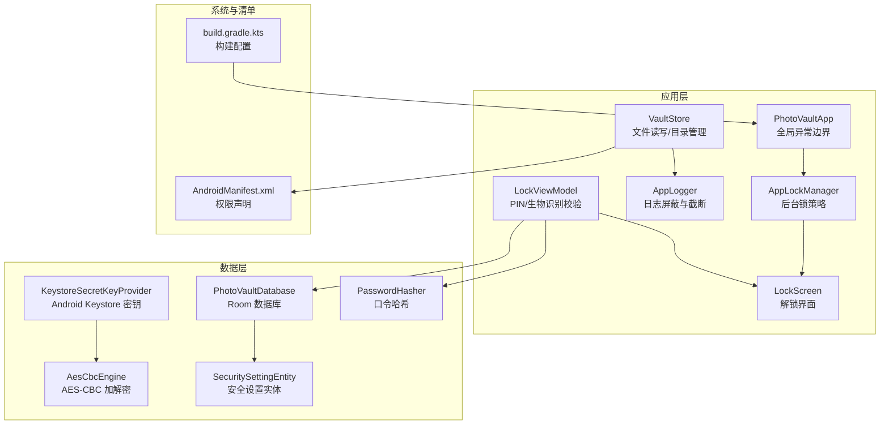
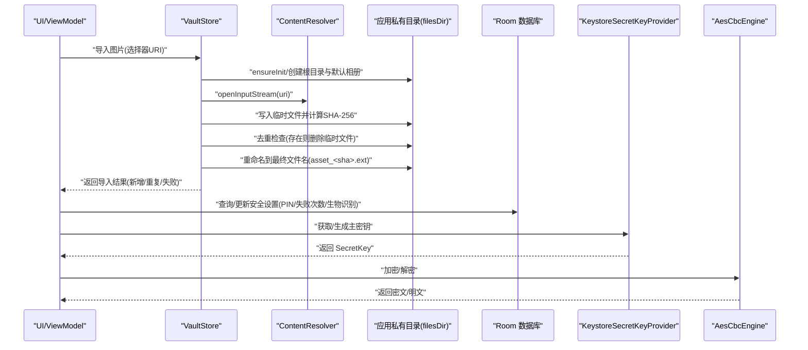
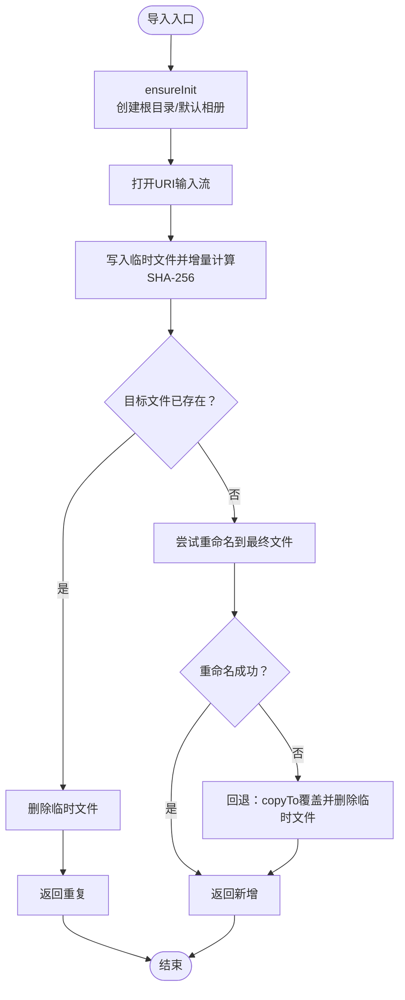
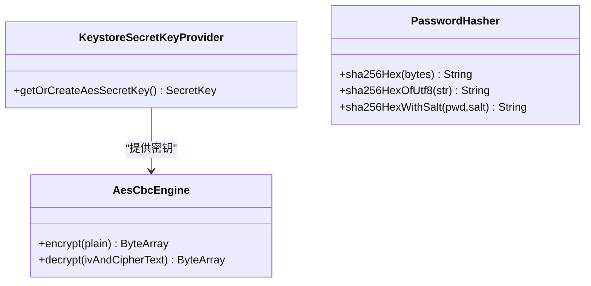
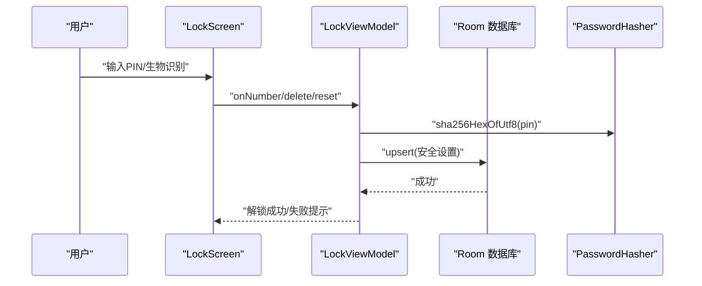
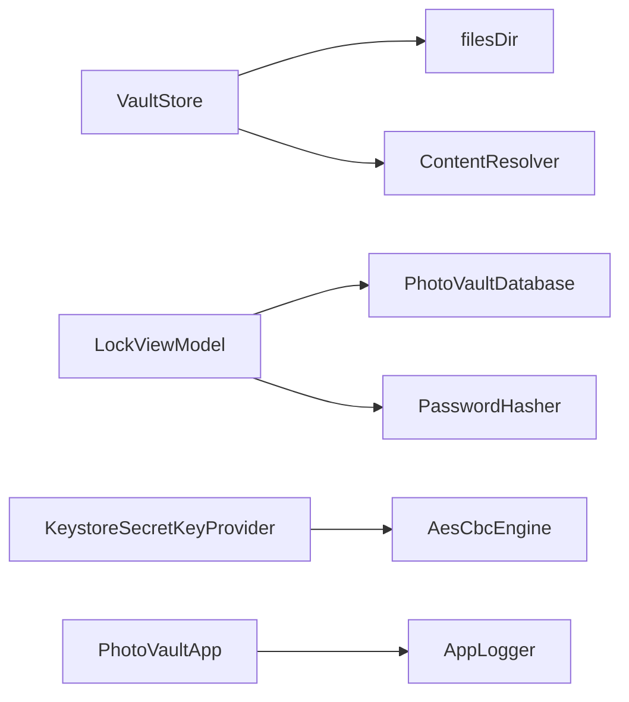

# 文件系统访问

<cite>
**本文引用的文件**
- [VaultStore.kt](file://android/app/src/main/kotlin/com/photovault/app/ui/vault/VaultStore.kt)
- [AesCbcEngine.kt](file://android/core/data/src/main/kotlin/com/photovault/data/crypto/AesCbcEngine.kt)
- [KeystoreSecretKeyProvider.kt](file://android/core/data/src/main/kotlin/com/photovault/data/crypto/KeystoreSecretKeyProvider.kt)
- [PasswordHasher.kt](file://android/core/data/src/main/kotlin/com/photovault/data/crypto/PasswordHasher.kt)
- [PhotoVaultDatabase.kt](file://android/core/data/src/main/kotlin/com/photovault/data/db/PhotoVaultDatabase.kt)
- [SecuritySettingEntity.kt](file://android/core/data/src/main/kotlin/com/photovault/data/db/entity/SecuritySettingEntity.kt)
- [LockViewModel.kt](file://android/app/src/main/kotlin/com/photovault/app/ui/lock/LockViewModel.kt)
- [LockScreen.kt](file://android/app/src/main/kotlin/com/photovault/app/ui/lock/LockScreen.kt)
- [AppLockManager.kt](file://android/app/src/main/kotlin/com/photovault/app/AppLockManager.kt)
- [PhotoVaultApp.kt](file://android/app/src/main/kotlin/com/photovault/app/PhotoVaultApp.kt)
- [AndroidManifest.xml](file://android/app/src/main/AndroidManifest.xml)
- [BackupRestoreScreen.kt](file://android/app/src/main/kotlin/com/photovault/app/ui/BackupRestoreScreen.kt)
- [BackupResultScreen.kt](file://android/app/src/main/kotlin/com/photovault/app/ui/BackupResultScreen.kt)
- [RestoreResultScreen.kt](file://android/app/src/main/kotlin/com/photovault/app/ui/RestoreResultScreen.kt)
- [AppLogger.kt](file://android/app/src/main/kotlin/com/photovault/app/AppLogger.kt)
- [build.gradle.kts](file://android/app/build.gradle.kts)
</cite>

## 目录
1. [简介](#简介)
2. [项目结构](#项目结构)
3. [核心组件](#核心组件)
4. [架构总览](#架构总览)
5. [详细组件分析](#详细组件分析)
6. [依赖关系分析](#依赖关系分析)
7. [性能考量](#性能考量)
8. [故障排查指南](#故障排查指南)
9. [结论](#结论)
10. [附录](#附录)

## 简介
本文件系统访问文档聚焦于 AI 照片保险库（PhotoVault）在 Android 应用中的私有目录文件操作与安全策略，涵盖以下主题：
- Android 应用私有目录的文件读写、目录创建与权限管理
- 加密文件的存储策略、文件完整性验证与安全访问控制
- 文件路径管理、文件锁定机制与并发访问处理
- 文件系统性能优化与错误处理最佳实践
- 文件备份、迁移与清理策略
- 开发者完整指导与安全注意事项

## 项目结构
围绕文件系统访问的关键代码分布在应用层与数据层：
- 应用层（UI 层）：负责导入、浏览、快照缓存与 UI 交互
- 数据层（加密与数据库）：负责密钥托管、加解密与安全设置持久化
- 安全与生命周期：负责上锁策略、异常边界与日志

图表来源
- [VaultStore.kt:1-226](file://android/app/src/main/kotlin/com/photovault/app/ui/vault/VaultStore.kt#L1-L226)
- [LockViewModel.kt:1-222](file://android/app/src/main/kotlin/com/photovault/app/ui/lock/LockViewModel.kt#L1-L222)
- [LockScreen.kt:1-414](file://android/app/src/main/kotlin/com/photovault/app/ui/lock/LockScreen.kt#L1-L414)
- [AppLockManager.kt:1-49](file://android/app/src/main/kotlin/com/photovault/app/AppLockManager.kt#L1-L49)
- [PhotoVaultApp.kt:1-31](file://android/app/src/main/kotlin/com/photovault/app/PhotoVaultApp.kt#L1-L31)
- [AppLogger.kt:1-43](file://android/app/src/main/kotlin/com/photovault/app/AppLogger.kt#L1-L43)
- [KeystoreSecretKeyProvider.kt:1-42](file://android/core/data/src/main/kotlin/com/photovault/data/crypto/KeystoreSecretKeyProvider.kt#L1-L42)
- [AesCbcEngine.kt:1-40](file://android/core/data/src/main/kotlin/com/photovault/data/crypto/AesCbcEngine.kt#L1-L40)
- [PasswordHasher.kt:1-26](file://android/core/data/src/main/kotlin/com/photovault/data/crypto/PasswordHasher.kt#L1-L26)
- [PhotoVaultDatabase.kt:1-36](file://android/core/data/src/main/kotlin/com/photovault/data/db/PhotoVaultDatabase.kt#L1-L36)
- [SecuritySettingEntity.kt:1-19](file://android/core/data/src/main/kotlin/com/photovault/data/db/entity/SecuritySettingEntity.kt#L1-L19)
- [AndroidManifest.xml:1-27](file://android/app/src/main/AndroidManifest.xml#L1-L27)
- [build.gradle.kts:1-91](file://android/app/build.gradle.kts#L1-L91)

章节来源
- [VaultStore.kt:1-226](file://android/app/src/main/kotlin/com/photovault/app/ui/vault/VaultStore.kt#L1-L226)
- [AndroidManifest.xml:1-27](file://android/app/src/main/AndroidManifest.xml#L1-L27)
- [build.gradle.kts:1-91](file://android/app/build.gradle.kts#L1-L91)

## 核心组件
- VaultStore：负责私有目录初始化、相册与照片列表、导入与去重、路径规范化与历史迁移
- 加密组件：KeystoreSecretKeyProvider 提供主密钥，AesCbcEngine 实现 AES-CBC 加解密，PasswordHasher 负责口令哈希
- 安全与访问控制：LockViewModel/Screen 管理 PIN 设置与解锁，AppLockManager 控制后台锁策略，PhotoVaultApp 安装全局异常边界
- 数据持久化：PhotoVaultDatabase 与 SecuritySettingEntity 存储安全设置
- 备份与恢复 UI：BackupRestoreScreen、BackupResultScreen、RestoreResultScreen 提供备份/恢复流程入口与结果展示

章节来源
- [VaultStore.kt:1-226](file://android/app/src/main/kotlin/com/photovault/app/ui/vault/VaultStore.kt#L1-L226)
- [KeystoreSecretKeyProvider.kt:1-42](file://android/core/data/src/main/kotlin/com/photovault/data/crypto/KeystoreSecretKeyProvider.kt#L1-L42)
- [AesCbcEngine.kt:1-40](file://android/core/data/src/main/kotlin/com/photovault/data/crypto/AesCbcEngine.kt#L1-L40)
- [PasswordHasher.kt:1-26](file://android/core/data/src/main/kotlin/com/photovault/data/crypto/PasswordHasher.kt#L1-L26)
- [LockViewModel.kt:1-222](file://android/app/src/main/kotlin/com/photovault/app/ui/lock/LockViewModel.kt#L1-L222)
- [LockScreen.kt:1-414](file://android/app/src/main/kotlin/com/photovault/app/ui/lock/LockScreen.kt#L1-L414)
- [AppLockManager.kt:1-49](file://android/app/src/main/kotlin/com/photovault/app/AppLockManager.kt#L1-L49)
- [PhotoVaultDatabase.kt:1-36](file://android/core/data/src/main/kotlin/com/photovault/data/db/PhotoVaultDatabase.kt#L1-L36)
- [SecuritySettingEntity.kt:1-19](file://android/core/data/src/main/kotlin/com/photovault/data/db/entity/SecuritySettingEntity.kt#L1-L19)
- [BackupRestoreScreen.kt:1-117](file://android/app/src/main/kotlin/com/photovault/app/ui/BackupRestoreScreen.kt#L1-L117)
- [BackupResultScreen.kt:1-125](file://android/app/src/main/kotlin/com/photovault/app/ui/BackupResultScreen.kt#L1-L125)
- [RestoreResultScreen.kt:1-122](file://android/app/src/main/kotlin/com/photovault/app/ui/RestoreResultScreen.kt#L1-L122)

## 架构总览
下图展示了文件系统访问在应用中的整体交互：VaultStore 通过 Context 访问应用私有目录，导入时进行去重与完整性校验；安全访问通过 PIN/生物识别与数据库安全设置共同保障；加密策略由 Keystore 托管密钥与 AES-CBC 实现。

图表来源
- [VaultStore.kt:120-154](file://android/app/src/main/kotlin/com/photovault/app/ui/vault/VaultStore.kt#L120-L154)
- [LockViewModel.kt:168-184](file://android/app/src/main/kotlin/com/photovault/app/ui/lock/LockViewModel.kt#L168-L184)
- [KeystoreSecretKeyProvider.kt:18-35](file://android/core/data/src/main/kotlin/com/photovault/data/crypto/KeystoreSecretKeyProvider.kt#L18-L35)
- [AesCbcEngine.kt:17-32](file://android/core/data/src/main/kotlin/com/photovault/data/crypto/AesCbcEngine.kt#L17-L32)

## 详细组件分析

### VaultStore：私有目录文件操作与路径管理
- 私有目录与根路径
  - 使用 Context.filesDir 下的子目录作为根目录，避免外部共享与备份影响
  - 默认相册名称规范化，防止非法字符与长度限制
- 目录初始化与迁移
  - 首次使用确保根目录与默认相册存在
  - 历史目录迁移：将旧目录下的文件复制到新默认相册后删除旧目录
- 列表与快照
  - 支持列出所有相册与相册内照片，按修改时间排序
  - 缓存最近快照与相册内照片列表，减少重复扫描
- 导入与去重
  - 从内容提供者读取输入流，分块写入临时文件并实时计算 SHA-256
  - 基于哈希值生成最终文件名，若目标已存在则视为重复
  - 采用 renameTo 优先，失败回退到 copyTo 并删除临时文件
- 路径管理与安全
  - 对相册名进行清洗，去除非法字符并限制长度
  - 所有文件路径基于 filesDir，避免暴露外部存储路径

图表来源
- [VaultStore.kt:120-154](file://android/app/src/main/kotlin/com/photovault/app/ui/vault/VaultStore.kt#L120-L154)

章节来源
- [VaultStore.kt:1-226](file://android/app/src/main/kotlin/com/photovault/app/ui/vault/VaultStore.kt#L1-L226)

### 加密与安全：密钥托管与加解密
- 主密钥托管
  - KeystoreSecretKeyProvider 在 Android Keystore 中生成/读取 AES-256 密钥，密钥材料不可导出
- 加解密实现
  - AesCbcEngine 使用 AES/CBC/PKCS5Padding，IV 前置 16 字节，与既有协议兼容
- 口令哈希
  - PasswordHasher 提供 SHA-256 哈希与带盐哈希，PIN 存储为哈希值，不保存明文

图表来源
- [KeystoreSecretKeyProvider.kt:1-42](file://android/core/data/src/main/kotlin/com/photovault/data/crypto/KeystoreSecretKeyProvider.kt#L1-L42)
- [AesCbcEngine.kt:1-40](file://android/core/data/src/main/kotlin/com/photovault/data/crypto/AesCbcEngine.kt#L1-L40)
- [PasswordHasher.kt:1-26](file://android/core/data/src/main/kotlin/com/photovault/data/crypto/PasswordHasher.kt#L1-L26)

章节来源
- [KeystoreSecretKeyProvider.kt:1-42](file://android/core/data/src/main/kotlin/com/photovault/data/crypto/KeystoreSecretKeyProvider.kt#L1-L42)
- [AesCbcEngine.kt:1-40](file://android/core/data/src/main/kotlin/com/photovault/data/crypto/AesCbcEngine.kt#L1-L40)
- [PasswordHasher.kt:1-26](file://android/core/data/src/main/kotlin/com/photovault/data/crypto/PasswordHasher.kt#L1-L26)

### 安全访问控制：PIN/生物识别与后台锁策略
- PIN 设置与校验
  - LockViewModel 将用户输入的 6 位 PIN 通过 PasswordHasher 哈希后持久化到数据库
  - 解锁时比对哈希值，并维护失败次数
- 生物识别与设备凭证
  - LockScreen 通过 BiometricPrompt 支持指纹/面部/设备密码，自动提示与失败反馈
- 后台锁策略
  - AppLockManager 在应用不可见时触发上锁状态，避免后台误用
- 全局异常边界
  - PhotoVaultApp 安装默认未捕获异常处理器，统一记录日志

图表来源
- [LockViewModel.kt:168-184](file://android/app/src/main/kotlin/com/photovault/app/ui/lock/LockViewModel.kt#L168-L184)
- [LockScreen.kt:71-106](file://android/app/src/main/kotlin/com/photovault/app/ui/lock/LockScreen.kt#L71-L106)
- [AppLockManager.kt:37-47](file://android/app/src/main/kotlin/com/photovault/app/AppLockManager.kt#L37-L47)
- [PhotoVaultApp.kt:19-29](file://android/app/src/main/kotlin/com/photovault/app/PhotoVaultApp.kt#L19-L29)

章节来源
- [LockViewModel.kt:1-222](file://android/app/src/main/kotlin/com/photovault/app/ui/lock/LockViewModel.kt#L1-L222)
- [LockScreen.kt:1-414](file://android/app/src/main/kotlin/com/photovault/app/ui/lock/LockScreen.kt#L1-L414)
- [AppLockManager.kt:1-49](file://android/app/src/main/kotlin/com/photovault/app/AppLockManager.kt#L1-L49)
- [PhotoVaultApp.kt:1-31](file://android/app/src/main/kotlin/com/photovault/app/PhotoVaultApp.kt#L1-L31)

### 权限管理与系统集成
- 权限声明
  - 申请 CAMERA、READ_MEDIA_IMAGES、READ_MEDIA_VIDEO；对旧版 SDK 的读取权限做了上限限制
- 备份与恢复 UI
  - 提供“备份”“恢复”入口卡片与结果页，便于用户进行数据迁移与恢复

章节来源
- [AndroidManifest.xml:1-27](file://android/app/src/main/AndroidManifest.xml#L1-L27)
- [BackupRestoreScreen.kt:1-117](file://android/app/src/main/kotlin/com/photovault/app/ui/BackupRestoreScreen.kt#L1-L117)
- [BackupResultScreen.kt:1-125](file://android/app/src/main/kotlin/com/photovault/app/ui/BackupResultScreen.kt#L1-L125)
- [RestoreResultScreen.kt:1-122](file://android/app/src/main/kotlin/com/photovault/app/ui/RestoreResultScreen.kt#L1-L122)

## 依赖关系分析
- VaultStore 依赖 Context/filesDir 进行私有目录操作，依赖 ContentResolver 读取外部 URI
- 加密链路：KeystoreSecretKeyProvider → AesCbcEngine，用于可能的文件加密场景
- 安全设置：LockViewModel 通过 Room 持久化 PIN 哈希与失败次数
- 日志与异常：AppLogger 统一日志格式与截断，PhotoVaultApp 安装全局异常边界

图表来源
- [VaultStore.kt:1-226](file://android/app/src/main/kotlin/com/photovault/app/ui/vault/VaultStore.kt#L1-L226)
- [LockViewModel.kt:1-222](file://android/app/src/main/kotlin/com/photovault/app/ui/lock/LockViewModel.kt#L1-L222)
- [KeystoreSecretKeyProvider.kt:1-42](file://android/core/data/src/main/kotlin/com/photovault/data/crypto/KeystoreSecretKeyProvider.kt#L1-L42)
- [AesCbcEngine.kt:1-40](file://android/core/data/src/main/kotlin/com/photovault/data/crypto/AesCbcEngine.kt#L1-L40)
- [PhotoVaultDatabase.kt:1-36](file://android/core/data/src/main/kotlin/com/photovault/data/db/PhotoVaultDatabase.kt#L1-L36)
- [PhotoVaultApp.kt:1-31](file://android/app/src/main/kotlin/com/photovault/app/PhotoVaultApp.kt#L1-L31)
- [AppLogger.kt:1-43](file://android/app/src/main/kotlin/com/photovault/app/AppLogger.kt#L1-L43)

章节来源
- [PhotoVaultDatabase.kt:1-36](file://android/core/data/src/main/kotlin/com/photovault/data/db/PhotoVaultDatabase.kt#L1-L36)
- [SecuritySettingEntity.kt:1-19](file://android/core/data/src/main/kotlin/com/photovault/data/db/entity/SecuritySettingEntity.kt#L1-L19)

## 性能考量
- IO 与缓冲
  - 导入时使用固定缓冲区分块读写，降低内存峰值占用
- 目录遍历与排序
  - 列表与快照缓存近期结果，避免频繁遍历与重复排序
- 去重策略
  - 基于 SHA-256 哈希判断重复，避免重复写入与冗余存储
- 线程模型
  - 所有文件操作运行在 Dispatchers.IO，避免阻塞主线程
- 数据库访问
  - Room DAO 操作在协程中执行，避免主线程阻塞

章节来源
- [VaultStore.kt:120-154](file://android/app/src/main/kotlin/com/photovault/app/ui/vault/VaultStore.kt#L120-L154)
- [VaultStore.kt:47-58](file://android/app/src/main/kotlin/com/photovault/app/ui/vault/VaultStore.kt#L47-L58)

## 故障排查指南
- 导入失败
  - 检查 URI 是否有效、输入流是否可打开
  - 若重命名失败，系统会回退到 copyTo 并删除临时文件，确认磁盘空间与权限
- 重复导入
  - 若目标文件已存在，返回重复；可检查哈希文件名是否正确
- 解锁失败
  - PIN 不匹配时失败次数递增；连续多次失败可导致临时锁定
  - 生物识别失败时查看提示信息并确认设备支持情况
- 异常与日志
  - 全局异常边界会记录未捕获异常；日志内容会被截断，避免敏感信息泄露

章节来源
- [VaultStore.kt:120-154](file://android/app/src/main/kotlin/com/photovault/app/ui/vault/VaultStore.kt#L120-L154)
- [LockViewModel.kt:168-184](file://android/app/src/main/kotlin/com/photovault/app/ui/lock/LockViewModel.kt#L168-L184)
- [LockScreen.kt:71-106](file://android/app/src/main/kotlin/com/photovault/app/ui/lock/LockScreen.kt#L71-L106)
- [PhotoVaultApp.kt:19-29](file://android/app/src/main/kotlin/com/photovault/app/PhotoVaultApp.kt#L19-L29)
- [AppLogger.kt:16-29](file://android/app/src/main/kotlin/com/photovault/app/AppLogger.kt#L16-L29)

## 结论
本项目在 Android 私有目录上实现了安全、可控且高性能的文件系统访问：
- 通过 VaultStore 统一管理私有目录、导入与去重、路径清洗与历史迁移
- 通过 Keystore+AES-CBC 与 PIN 哈希实现强健的加密与访问控制
- 通过 LockViewModel/LockScreen 与 AppLockManager 提供多层安全保护
- 通过 Room 持久化安全设置，结合日志与异常边界提升可观测性
- 备份/恢复 UI 为用户提供数据迁移与恢复能力

建议在后续迭代中：
- 明确文件加密策略与密钥轮换机制
- 增强并发访问与文件锁定的健壮性
- 补充文件完整性校验与损坏修复流程
- 规范备份/恢复的数据格式与版本兼容

## 附录
- 构建与依赖
  - 应用层依赖核心模块与 Compose、Hilt、Room、相机与生物识别库
  - 清单声明必要的权限，避免对外部存储的过度依赖

章节来源
- [build.gradle.kts:63-90](file://android/app/build.gradle.kts#L63-L90)
- [AndroidManifest.xml:1-27](file://android/app/src/main/AndroidManifest.xml#L1-L27)