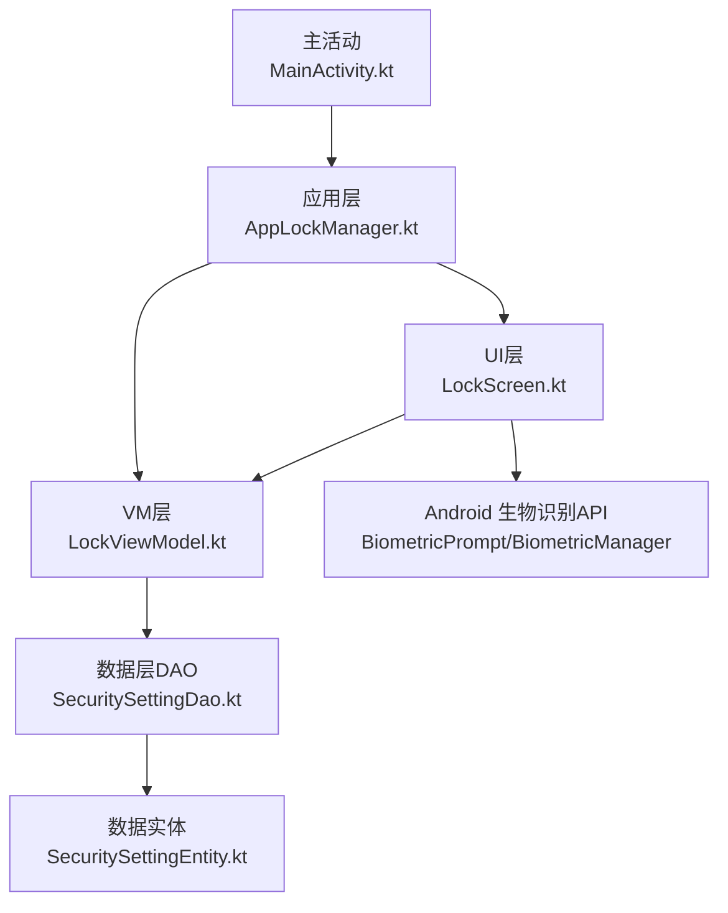
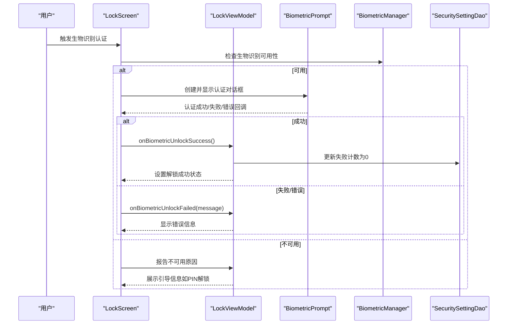
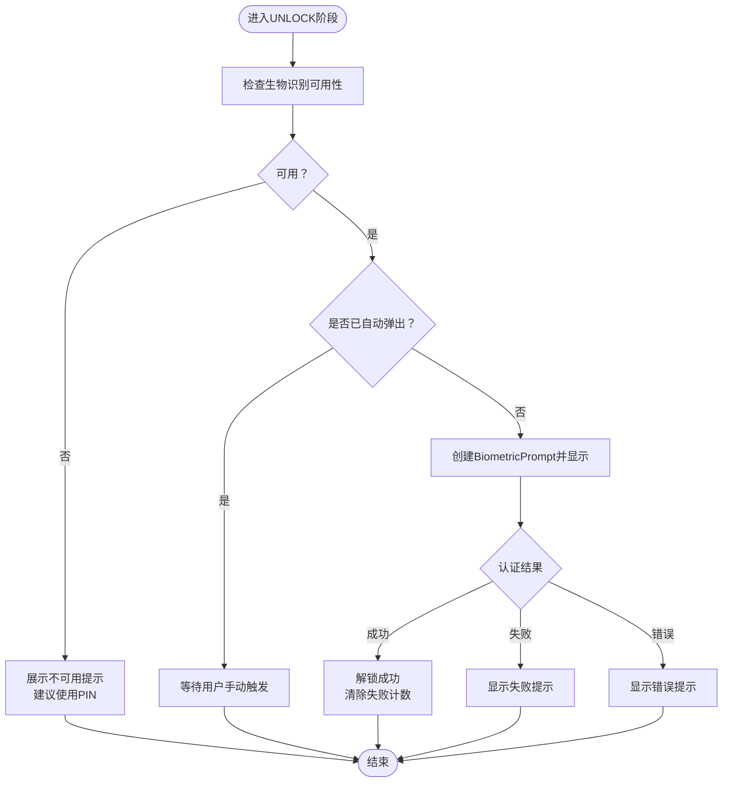
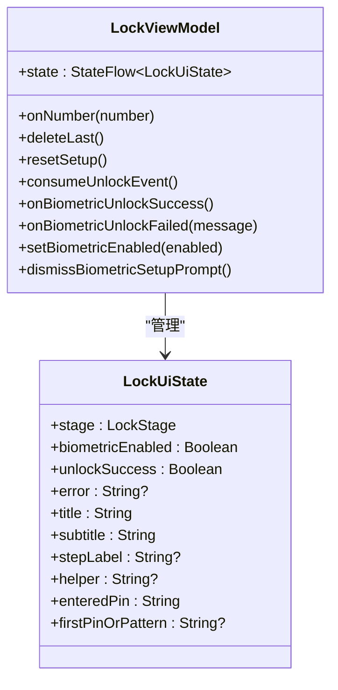
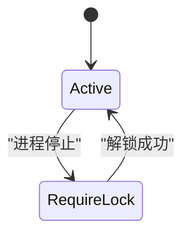
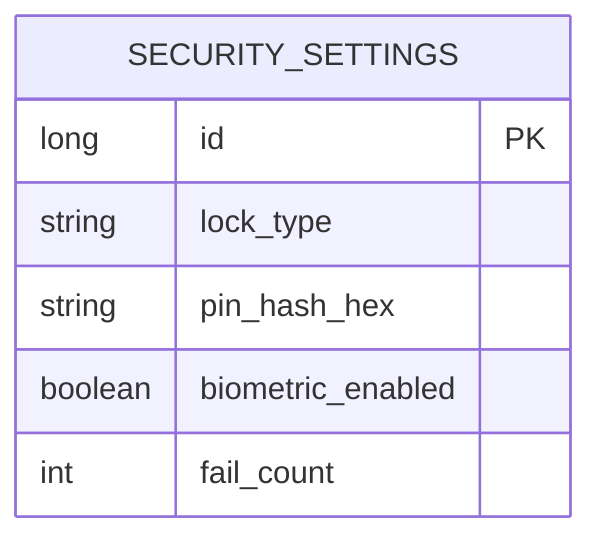
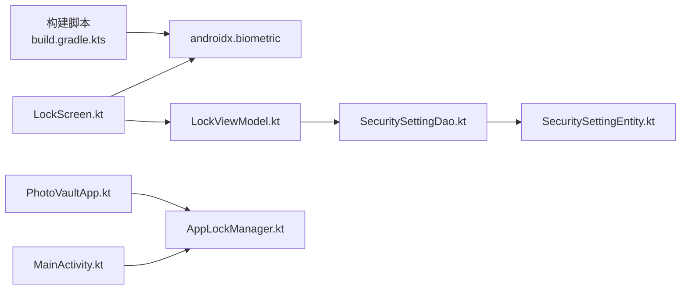

# 生物识别认证集成

<cite>
**本文档引用的文件**
- [LockScreen.kt](file://android/app/src/main/kotlin/com/photovault/app/ui/lock/LockScreen.kt)
- [LockViewModel.kt](file://android/app/src/main/kotlin/com/photovault/app/ui/lock/LockViewModel.kt)
- [AppLockManager.kt](file://android/app/src/main/kotlin/com/photovault/app/AppLockManager.kt)
- [MainActivity.kt](file://android/app/src/main/kotlin/com/photovault/app/MainActivity.kt)
- [PhotoVaultApp.kt](file://android/app/src/main/kotlin/com/photovault/app/PhotoVaultApp.kt)
- [SecuritySettingEntity.kt](file://android/core/data/src/main/kotlin/com/photovault/data/db/entity/SecuritySettingEntity.kt)
- [SecuritySettingDao.kt](file://android/core/data/src/main/kotlin/com/photovault/data/db/dao/SecuritySettingDao.kt)
- [SecuritySetting.kt](file://android/core/domain/src/main/kotlin/com/photovault/domain/model/SecuritySetting.kt)
- [AppButton.kt](file://android/app/src/main/kotlin/com/photovault/app/ui/components/AppButton.kt)
- [AppDialog.kt](file://android/app/src/main/kotlin/com/photovault/app/ui/components/AppDialog.kt)
- [strings.xml](file://android/app/src/main/res/values/strings.xml)
- [build.gradle.kts](file://android/app/build.gradle.kts)
</cite>

## 目录
1. [简介](#简介)
2. [项目结构](#项目结构)
3. [核心组件](#核心组件)
4. [架构总览](#架构总览)
5. [详细组件分析](#详细组件分析)
6. [依赖关系分析](#依赖关系分析)
7. [性能考量](#性能考量)
8. [故障排除指南](#故障排除指南)
9. [结论](#结论)
10. [附录](#附录)

## 简介
本文件面向开发者，系统性阐述AI照片保险库项目中与Android BiometricPrompt API的生物识别认证集成方案。文档覆盖指纹识别、面部识别等生物特征认证的实现细节，包括认证流程控制、安全策略配置、用户体验优化、结果处理与失败重试机制、安全状态管理、设备兼容性与降级策略，以及相关的安全考虑与最佳实践。目标是帮助开发者快速、安全地完成生物识别功能的集成与维护。

## 项目结构
生物识别认证功能主要分布在以下层次：
- UI层：锁屏界面与交互逻辑，负责展示生物识别提示、处理用户输入与反馈
- VM层：锁屏视图模型，负责状态管理、认证结果处理、数据库持久化
- 应用层：全局锁管理器，负责应用生命周期与自动锁定策略
- 数据层：安全设置实体与DAO，负责生物识别开关、失败次数等状态的持久化
- 基础设施：Android BiometricPrompt API调用与兼容性检测

图表来源
- [LockScreen.kt:1-414](file://android/app/src/main/kotlin/com/photovault/app/ui/lock/LockScreen.kt#L1-L414)
- [LockViewModel.kt:1-222](file://android/app/src/main/kotlin/com/photovault/app/ui/lock/LockViewModel.kt#L1-L222)
- [AppLockManager.kt:1-49](file://android/app/src/main/kotlin/com/photovault/app/AppLockManager.kt#L1-L49)
- [MainActivity.kt:1-265](file://android/app/src/main/kotlin/com/photovault/app/MainActivity.kt#L1-L265)
- [SecuritySettingEntity.kt:1-19](file://android/core/data/src/main/kotlin/com/photovault/data/db/entity/SecuritySettingEntity.kt#L1-L19)
- [SecuritySettingDao.kt:1-16](file://android/core/data/src/main/kotlin/com/photovault/data/db/dao/SecuritySettingDao.kt#L1-L16)

章节来源
- [LockScreen.kt:1-414](file://android/app/src/main/kotlin/com/photovault/app/ui/lock/LockScreen.kt#L1-L414)
- [LockViewModel.kt:1-222](file://android/app/src/main/kotlin/com/photovault/app/ui/lock/LockViewModel.kt#L1-L222)
- [AppLockManager.kt:1-49](file://android/app/src/main/kotlin/com/photovault/app/AppLockManager.kt#L1-L49)
- [MainActivity.kt:1-265](file://android/app/src/main/kotlin/com/photovault/app/MainActivity.kt#L1-L265)
- [SecuritySettingEntity.kt:1-19](file://android/core/data/src/main/kotlin/com/photovault/data/db/entity/SecuritySettingEntity.kt#L1-L19)
- [SecuritySettingDao.kt:1-16](file://android/core/data/src/main/kotlin/com/photovault/data/db/dao/SecuritySettingDao.kt#L1-L16)

## 核心组件
- 锁屏界面（LockScreen）：负责渲染锁屏UI、触发BiometricPrompt认证、处理认证回调、向用户展示错误信息与成功提示
- 锁屏视图模型（LockViewModel）：管理UI状态、处理PIN码校验、记录失败次数、持久化安全设置（含生物识别开关）、响应生物识别结果
- 全局锁管理器（AppLockManager）：基于应用生命周期控制是否需要显示锁屏，决定何时自动弹出锁屏界面
- 安全设置实体与DAO：持久化生物识别开关、PIN哈希、失败计数等安全相关状态
- 主活动（MainActivity）：导航与路由控制，配合AppLockManager实现自动锁屏

章节来源
- [LockScreen.kt:52-123](file://android/app/src/main/kotlin/com/photovault/app/ui/lock/LockScreen.kt#L52-L123)
- [LockViewModel.kt:117-151](file://android/app/src/main/kotlin/com/photovault/app/ui/lock/LockViewModel.kt#L117-L151)
- [AppLockManager.kt:17-48](file://android/app/src/main/kotlin/com/photovault/app/AppLockManager.kt#L17-L48)
- [SecuritySettingEntity.kt:7-18](file://android/core/data/src/main/kotlin/com/photovault/data/db/entity/SecuritySettingEntity.kt#L7-L18)
- [SecuritySettingDao.kt:9-16](file://android/core/data/src/main/kotlin/com/photovault/data/db/dao/SecuritySettingDao.kt#L9-L16)
- [MainActivity.kt:42-74](file://android/app/src/main/kotlin/com/photovault/app/MainActivity.kt#L42-L74)

## 架构总览
生物识别认证采用MVVM架构，UI层通过Compose渲染，VM层负责业务逻辑与状态管理，数据层通过Room持久化安全设置。认证流程由BiometricPrompt驱动，结合系统生物识别硬件能力检测与降级策略，确保在不同设备上的可用性与一致性。

图表来源
- [LockScreen.kt:71-106](file://android/app/src/main/kotlin/com/photovault/app/ui/lock/LockScreen.kt#L71-L106)
- [LockScreen.kt:365-382](file://android/app/src/main/kotlin/com/photovault/app/ui/lock/LockScreen.kt#L365-L382)
- [LockViewModel.kt:117-132](file://android/app/src/main/kotlin/com/photovault/app/ui/lock/LockViewModel.kt#L117-L132)
- [SecuritySettingDao.kt:10-16](file://android/core/data/src/main/kotlin/com/photovault/data/db/dao/SecuritySettingDao.kt#L10-L16)

## 详细组件分析

### 锁屏界面（LockScreen）
- 生物识别可用性检测：通过BiometricManager.canAuthenticate检查设备生物识别能力，支持强/弱生物识别与设备凭证组合
- 自动弹出策略：当处于解锁阶段且生物识别可用时，首次进入阶段自动触发认证，避免重复触发
- 手动触发：数字键盘区域提供“使用生物识别重试”按钮，便于用户主动选择生物识别
- 回调处理：认证成功时清除失败计数并标记解锁成功；认证错误与失败分别处理，避免干扰用户取消操作
- 降级提示：当生物识别不可用时，向用户展示明确的不可用原因与PIN解锁建议

图表来源
- [LockScreen.kt:61-123](file://android/app/src/main/kotlin/com/photovault/app/ui/lock/LockScreen.kt#L61-L123)
- [LockScreen.kt:81-98](file://android/app/src/main/kotlin/com/photovault/app/ui/lock/LockScreen.kt#L81-L98)
- [LockScreen.kt:365-382](file://android/app/src/main/kotlin/com/photovault/app/ui/lock/LockScreen.kt#L365-L382)

章节来源
- [LockScreen.kt:52-123](file://android/app/src/main/kotlin/com/photovault/app/ui/lock/LockScreen.kt#L52-L123)
- [LockScreen.kt:81-98](file://android/app/src/main/kotlin/com/photovault/app/ui/lock/LockScreen.kt#L81-L98)
- [LockScreen.kt:365-382](file://android/app/src/main/kotlin/com/photovault/app/ui/lock/LockScreen.kt#L365-L382)

### 锁屏视图模型（LockViewModel）
- 状态管理：封装UI状态（阶段、标题、副标题、错误信息、PIN输入、生物识别开关等），通过StateFlow对外暴露
- 认证结果处理：认证成功时重置失败计数并标记解锁成功；认证失败时保留错误信息供UI展示
- 生物识别开关：支持开启/关闭生物识别功能，并持久化到数据库
- PIN校验：与生物识别并行存在，作为降级路径；连续错误会增加失败计数
- 初始化：根据数据库中的安全设置决定初始UI状态（设置PIN或解锁）

图表来源
- [LockViewModel.kt:18-197](file://android/app/src/main/kotlin/com/photovault/app/ui/lock/LockViewModel.kt#L18-L197)
- [LockViewModel.kt:206-222](file://android/app/src/main/kotlin/com/photovault/app/ui/lock/LockViewModel.kt#L206-L222)

章节来源
- [LockViewModel.kt:18-197](file://android/app/src/main/kotlin/com/photovault/app/ui/lock/LockViewModel.kt#L18-L197)
- [LockViewModel.kt:206-222](file://android/app/src/main/kotlin/com/photovault/app/ui/lock/LockViewModel.kt#L206-L222)

### 全局锁管理器（AppLockManager）
- 生命周期监听：通过DefaultLifecycleObserver监听应用前台/后台状态变化
- 自动锁定策略：当前实现为在进程停止时要求锁屏，避免页面切换导致的误触发
- 状态传播：通过StateFlow向UI层传递是否需要显示锁屏的信号

图表来源
- [AppLockManager.kt:17-48](file://android/app/src/main/kotlin/com/photovault/app/AppLockManager.kt#L17-L48)
- [MainActivity.kt:42-74](file://android/app/src/main/kotlin/com/photovault/app/MainActivity.kt#L42-L74)

章节来源
- [AppLockManager.kt:17-48](file://android/app/src/main/kotlin/com/photovault/app/AppLockManager.kt#L17-L48)
- [MainActivity.kt:42-74](file://android/app/src/main/kotlin/com/photovault/app/MainActivity.kt#L42-L74)

### 安全设置持久化
- 实体定义：包含锁类型、PIN哈希、生物识别开关、失败计数等字段
- DAO接口：提供按ID查询与替换式插入（Upsert）能力
- VM写入：在设置PIN、开启生物识别、解锁成功等场景更新数据库

图表来源
- [SecuritySettingEntity.kt:7-18](file://android/core/data/src/main/kotlin/com/photovault/data/db/entity/SecuritySettingEntity.kt#L7-L18)
- [SecuritySettingDao.kt:9-16](file://android/core/data/src/main/kotlin/com/photovault/data/db/dao/SecuritySettingDao.kt#L9-L16)
- [LockViewModel.kt:153-166](file://android/app/src/main/kotlin/com/photovault/app/ui/lock/LockViewModel.kt#L153-L166)

章节来源
- [SecuritySettingEntity.kt:7-18](file://android/core/data/src/main/kotlin/com/photovault/data/db/entity/SecuritySettingEntity.kt#L7-L18)
- [SecuritySettingDao.kt:9-16](file://android/core/data/src/main/kotlin/com/photovault/data/db/dao/SecuritySettingDao.kt#L9-L16)
- [LockViewModel.kt:153-166](file://android/app/src/main/kotlin/com/photovault/app/ui/lock/LockViewModel.kt#L153-L166)

### UI组件与交互
- 数字键盘：支持数字输入、删除、生物识别重试按钮
- 对话框：用于设置生物识别开关后的确认提示
- 按钮组件：提供节流点击、禁用态与加载态支持

章节来源
- [LockScreen.kt:312-352](file://android/app/src/main/kotlin/com/photovault/app/ui/lock/LockScreen.kt#L312-L352)
- [AppDialog.kt:22-84](file://android/app/src/main/kotlin/com/photovault/app/ui/components/AppDialog.kt#L22-L84)
- [AppButton.kt:26-67](file://android/app/src/main/kotlin/com/photovault/app/ui/components/AppButton.kt#L26-L67)

## 依赖关系分析
- UI层依赖BiometricPrompt与BiometricManager进行认证，依赖Compose进行声明式UI
- VM层依赖数据库DAO进行安全设置持久化，依赖密码哈希工具进行PIN存储
- 应用层通过Hilt注入全局锁管理器，主活动监听其状态并导航到锁屏
- 构建脚本引入androidx.biometric库以支持生物识别API

图表来源
- [build.gradle.kts:79](file://android/app/build.gradle.kts#L79)
- [LockScreen.kt:49-50](file://android/app/src/main/kotlin/com/photovault/app/ui/lock/LockScreen.kt#L49-L50)
- [LockViewModel.kt:19-22](file://android/app/src/main/kotlin/com/photovault/app/ui/lock/LockViewModel.kt#L19-L22)
- [SecuritySettingDao.kt:9-16](file://android/core/data/src/main/kotlin/com/photovault/data/db/dao/SecuritySettingDao.kt#L9-L16)
- [SecuritySettingEntity.kt:7-18](file://android/core/data/src/main/kotlin/com/photovault/data/db/entity/SecuritySettingEntity.kt#L7-L18)
- [PhotoVaultApp.kt:8-17](file://android/app/src/main/kotlin/com/photovault/app/PhotoVaultApp.kt#L8-L17)
- [MainActivity.kt:42-44](file://android/app/src/main/kotlin/com/photovault/app/MainActivity.kt#L42-L44)

章节来源
- [build.gradle.kts:79](file://android/app/build.gradle.kts#L79)
- [LockScreen.kt:49-50](file://android/app/src/main/kotlin/com/photovault/app/ui/lock/LockScreen.kt#L49-L50)
- [LockViewModel.kt:19-22](file://android/app/src/main/kotlin/com/photovault/app/ui/lock/LockViewModel.kt#L19-L22)
- [SecuritySettingDao.kt:9-16](file://android/core/data/src/main/kotlin/com/photovault/data/db/dao/SecuritySettingDao.kt#L9-L16)
- [SecuritySettingEntity.kt:7-18](file://android/core/data/src/main/kotlin/com/photovault/data/db/entity/SecuritySettingEntity.kt#L7-L18)
- [PhotoVaultApp.kt:8-17](file://android/app/src/main/kotlin/com/photovault/app/PhotoVaultApp.kt#L8-L17)
- [MainActivity.kt:42-44](file://android/app/src/main/kotlin/com/photovault/app/MainActivity.kt#L42-L44)

## 性能考量
- 认证回调执行器：使用主线程执行器，确保UI更新及时性
- 自动弹出防抖：通过状态标志避免重复触发BiometricPrompt
- 数据库写入：仅在必要时更新失败计数与生物识别开关，减少IO压力
- UI渲染：Compose声明式渲染，避免不必要的重组

[本节为一般性指导，无需特定文件来源]

## 故障排除指南
- 生物识别不可用
  - 现象：无法启动生物识别认证，提示不可用
  - 排查：检查系统设置中是否已录入生物识别；确认设备硬件支持；查看不可用消息
  - 处理：引导用户使用PIN解锁，并在设置中开启生物识别
- 认证失败
  - 现象：生物识别未通过，提示重试
  - 排查：确认指纹/面部是否正确放置；检查设备传感器清洁度
  - 处理：提示用户重试或切换到PIN解锁
- 认证错误
  - 现象：出现系统错误提示
  - 排查：区分用户取消与系统错误；仅对非取消错误进行处理
  - 处理：记录错误日志并提示用户重试或使用PIN解锁
- 失败次数限制
  - 现象：多次错误后提示锁定
  - 排查：检查数据库中失败计数
  - 处理：引导用户重置PIN或等待锁定解除

章节来源
- [LockScreen.kt:86-97](file://android/app/src/main/kotlin/com/photovault/app/ui/lock/LockScreen.kt#L86-L97)
- [LockViewModel.kt:168-184](file://android/app/src/main/kotlin/com/photovault/app/ui/lock/LockViewModel.kt#L168-L184)
- [LockViewModel.kt:129-132](file://android/app/src/main/kotlin/com/photovault/app/ui/lock/LockViewModel.kt#L129-L132)

## 结论
本项目通过BiometricPrompt与BiometricManager实现了对指纹与面部识别的支持，并提供了完善的降级策略（PIN解锁）。认证流程清晰、状态管理完善、错误处理合理，同时具备良好的设备兼容性与用户体验。建议在生产环境中持续关注系统版本差异与设备适配问题，确保认证体验的一致性与安全性。

[本节为总结性内容，无需特定文件来源]

## 附录

### 设备兼容性与降级策略
- 兼容性检测：使用BiometricManager.canAuthenticate判断硬件与系统支持情况
- 降级策略：当生物识别不可用时，优先引导用户使用PIN解锁，并提供明确的不可用原因
- 设备差异：不同厂商的指纹/面部识别实现可能存在差异，需在测试中覆盖主流机型

章节来源
- [LockScreen.kt:365-382](file://android/app/src/main/kotlin/com/photovault/app/ui/lock/LockScreen.kt#L365-L382)

### 安全考虑与最佳实践
- 密钥存储：PIN仅以哈希形式存储于本地数据库，避免明文泄露
- 失败计数：连续错误会增加失败计数，作为基础的防暴力破解手段
- 认证回调：严格区分用户取消与系统错误，避免误报
- 权限与隐私：生物识别数据由系统安全模块管理，应用侧仅接收结果

章节来源
- [LockViewModel.kt:153-166](file://android/app/src/main/kotlin/com/photovault/app/ui/lock/LockViewModel.kt#L153-L166)
- [LockViewModel.kt:168-184](file://android/app/src/main/kotlin/com/photovault/app/ui/lock/LockViewModel.kt#L168-L184)

### 开发者集成要点
- 引入依赖：确保构建脚本中包含androidx.biometric库
- 权限声明：遵循系统要求，确保生物识别功能正常工作
- UI设计：提供明确的生物识别提示与错误反馈
- 测试覆盖：在多设备、多系统版本上进行充分测试

章节来源
- [build.gradle.kts:79](file://android/app/build.gradle.kts#L79)
- [strings.xml:85-86](file://android/app/src/main/res/values/strings.xml#L85-L86)