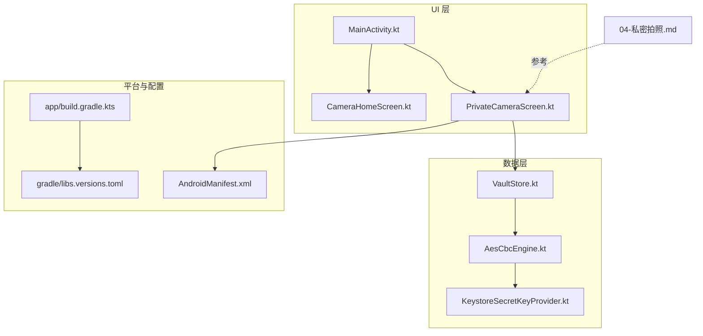
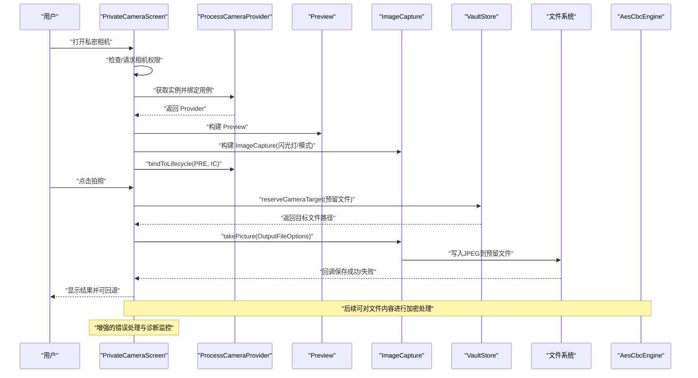
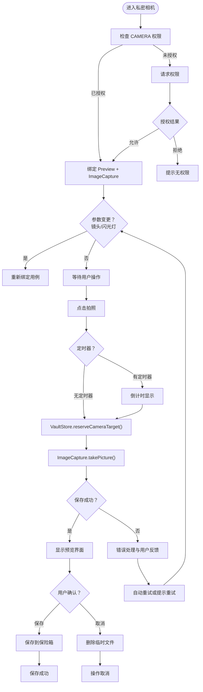
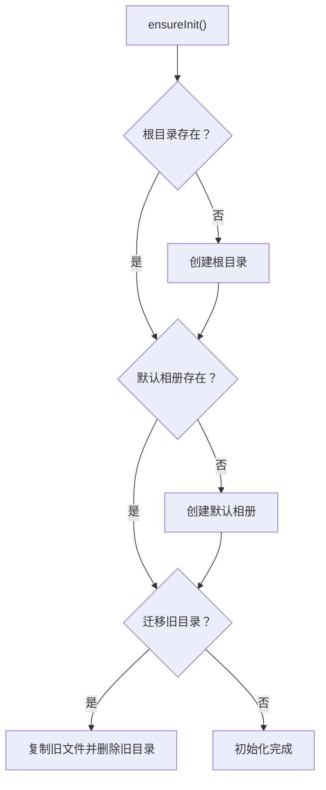
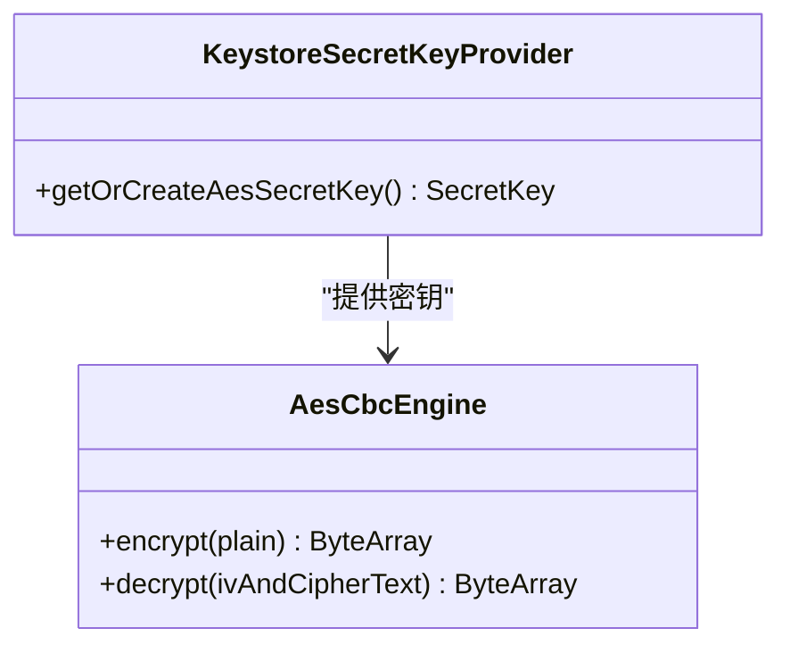
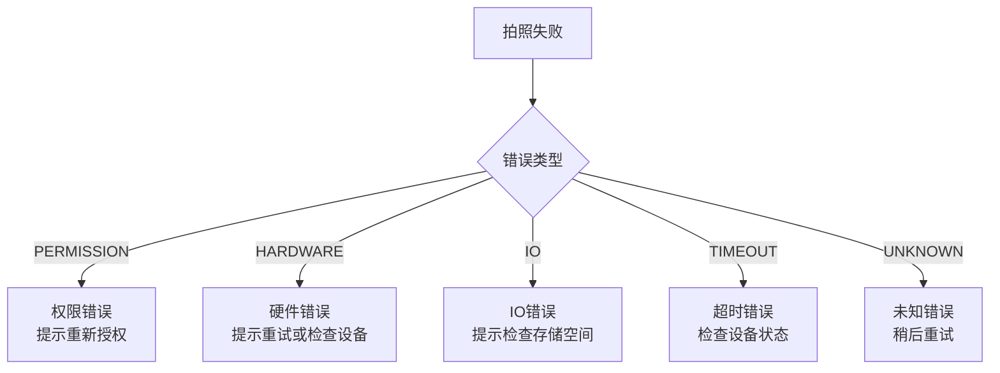
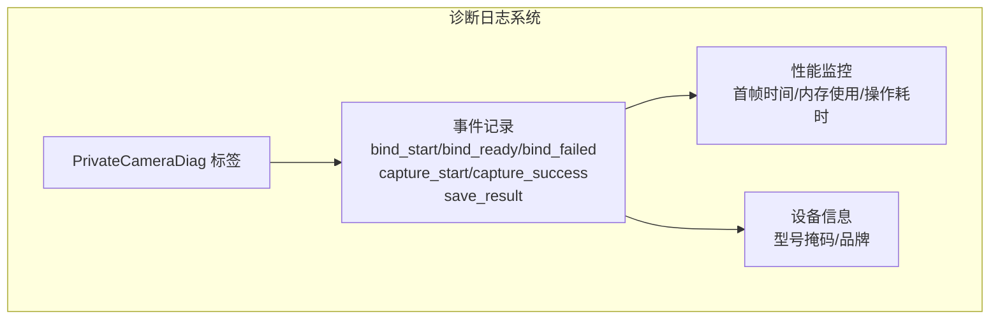
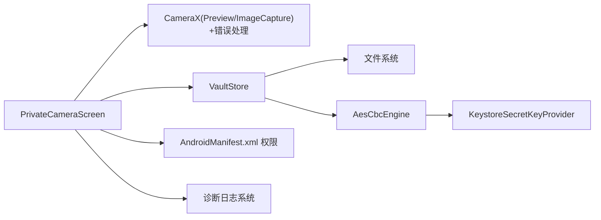

# 相机系统集成

<cite>
**本文引用的文件**
- [PrivateCameraScreen.kt](file://android/app/src/main/kotlin/com/photovault/app/ui/PrivateCameraScreen.kt)
- [CameraHomeScreen.kt](file://android/app/src/main/kotlin/com/photovault/app/ui/CameraHomeScreen.kt)
- [VaultStore.kt](file://android/app/src/main/kotlin/com/photovault/app/ui/vault/VaultStore.kt)
- [MainActivity.kt](file://android/app/src/main/kotlin/com/photovault/app/MainActivity.kt)
- [AesCbcEngine.kt](file://android/core/data/src/main/kotlin/com/photovault/data/crypto/AesCbcEngine.kt)
- [KeystoreSecretKeyProvider.kt](file://android/core/data/src/main/kotlin/com/photovault/data/crypto/KeystoreSecretKeyProvider.kt)
- [AndroidManifest.xml](file://android/app/src/main/AndroidManifest.xml)
- [build.gradle.kts](file://android/app/build.gradle.kts)
- [libs.versions.toml](file://android/gradle/libs.versions.toml)
- [04-私密拍照.md](file://doc/android/04-私密拍照.md)
</cite>

## 更新摘要
**变更内容**
- 新增增强的错误处理和恢复机制
- 添加全面的诊断日志系统
- 改进相机绑定和恢复策略
- 增强拍照失败的错误分类和用户反馈
- 优化内存管理和性能监控

## 目录
1. [简介](#简介)
2. [项目结构](#项目结构)
3. [核心组件](#核心组件)
4. [架构总览](#架构总览)
5. [详细组件分析](#详细组件分析)
6. [增强的错误处理与恢复机制](#增强的错误处理与恢复机制)
7. [诊断与监控系统](#诊断与监控系统)
8. [依赖关系分析](#依赖关系分析)
9. [性能考虑](#性能考虑)
10. [故障排除指南](#故障排除指南)
11. [结论](#结论)
12. [附录](#附录)

## 简介
本文件面向开发者，系统化阐述 AI 照片保险库项目的相机系统集成方案，重点覆盖：
- 与 Android CameraX 的集成方式：相机预览、拍照、权限管理与实时处理
- 相机参数配置、图像捕获流程与存储策略
- 私密拍照的安全机制与数据保护
- **新增**：增强的错误处理、自动恢复机制和诊断监控系统
- 权限申请、设备兼容性与性能优化建议
- 常见问题与故障排除方法

该实现采用 CameraX 的 Preview 与 ImageCapture 组合，闪光灯与镜头切换通过 CameraX API 控制；拍照结果直接写入应用内部目录，不经过系统媒体库，配合 AES 加密引擎完成端到端的数据保护。**最新版本包含了全面的错误处理、自动恢复和诊断监控功能**。

## 项目结构
围绕相机功能的关键文件分布如下：
- UI 层：私密相机界面与主页相机入口
- 数据层：私密相册存储与加密组件
- 平台层：Android CameraX 依赖与清单权限声明
- 文档：私密拍照的技术方案与分层定位



**图表来源**
- [MainActivity.kt:191-195](file://android/app/src/main/kotlin/com/photovault/app/MainActivity.kt#L191-L195)
- [PrivateCameraScreen.kt:56-216](file://android/app/src/main/kotlin/com/photovault/app/ui/PrivateCameraScreen.kt#L56-L216)
- [VaultStore.kt:156-164](file://android/app/src/main/kotlin/com/photovault/app/ui/vault/VaultStore.kt#L156-L164)
- [AesCbcEngine.kt:12-32](file://android/core/data/src/main/kotlin/com/photovault/data/crypto/AesCbcEngine.kt#L12-L32)
- [KeystoreSecretKeyProvider.kt:12-35](file://android/core/data/src/main/kotlin/com/photovault/data/crypto/KeystoreSecretKeyProvider.kt#L12-L35)
- [AndroidManifest.xml:3-6](file://android/app/src/main/AndroidManifest.xml#L3-L6)
- [build.gradle.kts:80-83](file://android/app/build.gradle.kts#L80-L83)
- [libs.versions.toml:39-42](file://android/gradle/libs.versions.toml#L39-L42)
- [04-私密拍照.md:11-17](file://doc/android/04-私密拍照.md#L11-L17)

**章节来源**
- [MainActivity.kt:191-195](file://android/app/src/main/kotlin/com/photovault/app/MainActivity.kt#L191-L195)
- [PrivateCameraScreen.kt:56-216](file://android/app/src/main/kotlin/com/photovault/app/ui/PrivateCameraScreen.kt#L56-L216)
- [VaultStore.kt:156-164](file://android/app/src/main/kotlin/com/photovault/app/ui/vault/VaultStore.kt#L156-L164)
- [AesCbcEngine.kt:12-32](file://android/core/data/src/main/kotlin/com/photovault/data/crypto/AesCbcEngine.kt#L12-L32)
- [KeystoreSecretKeyProvider.kt:12-35](file://android/core/data/src/main/kotlin/com/photovault/data/crypto/KeystoreSecretKeyProvider.kt#L12-L35)
- [AndroidManifest.xml:3-6](file://android/app/src/main/AndroidManifest.xml#L3-L6)
- [build.gradle.kts:80-83](file://android/app/build.gradle.kts#L80-L83)
- [libs.versions.toml:39-42](file://android/gradle/libs.versions.toml#L39-L42)
- [04-私密拍照.md:11-17](file://doc/android/04-私密拍照.md#L11-L17)

## 核心组件
- **私密相机界面与交互**：在私密相机界面中完成权限检查、预览绑定、闪光灯与镜头切换、拍照触发与回退逻辑
- **增强的相机用例绑定**：通过 CameraX 的 ProcessCameraProvider 绑定 Preview 与 ImageCapture，并根据用户设置动态调整闪光灯与镜头方向，具备自动恢复机制
- **智能错误分类**：支持权限、硬件、IO、超时和未知错误类型的分类处理
- **私密存储与落盘**：拍照完成后，先在应用内部目录预留目标文件，再调用 CameraX 的 ImageCapture 将 JPEG 写入该文件
- **加密与密钥管理**：使用 Android Keystore 托管 AES 密钥，采用 AES-256-CBC-PKCS7 对落盘的 JPEG 进行加密
- **诊断监控系统**：内置全面的日志记录和性能监控，支持事件追踪和错误诊断
- **权限与清单**：声明 CAMERA 权限；按需声明媒体读取权限；不在系统媒体库注册拍摄结果

**章节来源**
- [PrivateCameraScreen.kt:56-216](file://android/app/src/main/kotlin/com/photovault/app/ui/PrivateCameraScreen.kt#L56-L216)
- [PrivateCameraScreen.kt:218-248](file://android/app/src/main/kotlin/com/photovault/app/ui/PrivateCameraScreen.kt#L218-L248)
- [VaultStore.kt:156-164](file://android/app/src/main/kotlin/com/photovault/app/ui/vault/VaultStore.kt#L156-L164)
- [AesCbcEngine.kt:12-32](file://android/core/data/src/main/kotlin/com/photovault/data/crypto/AesCbcEngine.kt#L12-L32)
- [KeystoreSecretKeyProvider.kt:12-35](file://android/core/data/src/main/kotlin/com/photovault/data/crypto/KeystoreSecretKeyProvider.kt#L12-L35)
- [AndroidManifest.xml:3-6](file://android/app/src/main/AndroidManifest.xml#L3-L6)
- [04-私密拍照.md:11-17](file://doc/android/04-私密拍照.md#L11-L17)

## 架构总览
下图展示从 UI 到平台与数据层的调用链路，以及与加密组件的衔接，**包含增强的错误处理和诊断监控**。



**图表来源**
- [PrivateCameraScreen.kt:83-98](file://android/app/src/main/kotlin/com/photovault/app/ui/PrivateCameraScreen.kt#L83-L98)
- [PrivateCameraScreen.kt:218-248](file://android/app/src/main/kotlin/com/photovault/app/ui/PrivateCameraScreen.kt#L218-L248)
- [PrivateCameraScreen.kt:250-277](file://android/app/src/main/kotlin/com/photovault/app/ui/PrivateCameraScreen.kt#L250-L277)
- [VaultStore.kt:156-164](file://android/app/src/main/kotlin/com/photovault/app/ui/vault/VaultStore.kt#L156-L164)

## 详细组件分析

### 私密相机界面与交互（PrivateCameraScreen）
- **权限管理**：首次进入时通过 ActivityResultContracts.RequestPermission 请求 CAMERA 权限；若未授予，界面提示并阻止拍照
- **预览渲染**：通过 AndroidView 创建 PreviewView，并设置 ScaleType 与 ImplementationMode；将 surfaceProvider 交给 Preview 用例
- **参数控制**：支持切换闪光灯（OFF/ON/AUTO）与前后摄像头（LENS_FACING_BACK/FRONT）
- **拍照流程**：点击"拍照并保存到保险箱"后，先预留目标文件，再调用 ImageCapture.takePicture 异步保存；使用协程与主线程执行器处理回调
- **生命周期绑定**：在 hasCameraPermission、previewViewRef、lensFacing、flashMode、lifecycleOwner 任一变化时重新绑定用例
- **增强的错误处理**：内置完整的错误分类和用户反馈机制



**图表来源**
- [PrivateCameraScreen.kt:56-216](file://android/app/src/main/kotlin/com/photovault/app/ui/PrivateCameraScreen.kt#L56-L216)
- [PrivateCameraScreen.kt:218-248](file://android/app/src/main/kotlin/com/photovault/app/ui/PrivateCameraScreen.kt#L218-L248)
- [PrivateCameraScreen.kt:250-277](file://android/app/src/main/kotlin/com/photovault/app/ui/PrivateCameraScreen.kt#L250-L277)

**章节来源**
- [PrivateCameraScreen.kt:56-216](file://android/app/src/main/kotlin/com/photovault/app/ui/PrivateCameraScreen.kt#L56-L216)
- [PrivateCameraScreen.kt:218-248](file://android/app/src/main/kotlin/com/photovault/app/ui/PrivateCameraScreen.kt#L218-L248)
- [PrivateCameraScreen.kt:250-277](file://android/app/src/main/kotlin/com/photovault/app/ui/PrivateCameraScreen.kt#L250-L277)

### 增强的相机用例绑定与参数配置
- 使用 ProcessCameraProvider 获取实例并在生命周期内绑定 Preview 与 ImageCapture
- **自动镜头回退**：当指定镜头不可用时自动切换到另一个可用镜头
- **增强的绑定失败处理**：支持最多3次自动重试和详细的错误日志记录
- Preview 通过 PreviewView 的 surfaceProvider 提供渲染表面
- ImageCapture 采用 CAPTURE_MODE_MINIMIZE_LATENCY 降低延迟；根据开关设置 FLASH_MODE_ON/OFF
- CameraSelector 根据当前选择绑定 LENS_FACING_BACK 或 FRONT

```mermaid
classDiagram
class PrivateCameraScreen {
+bindCameraUseCases(context, lifecycleOwner, previewView, lensFacing, flashMode, onReady, onFallbackLens, onBindFailed)
+bindRetryCount : Int
+rebindTick : Int
+bindStartMs : Long
}
class ProcessCameraProvider
class Preview
class ImageCapture
class CameraSelector
PrivateCameraScreen --> ProcessCameraProvider : "获取实例"
ProcessCameraProvider --> Preview : "构建并绑定"
ProcessCameraProvider --> ImageCapture : "构建并绑定"
PrivateCameraScreen --> CameraSelector : "选择镜头方向"
note for PrivateCameraScreen : "支持自动镜头回退和错误恢复"
```

**图表来源**
- [PrivateCameraScreen.kt:218-248](file://android/app/src/main/kotlin/com/photovault/app/ui/PrivateCameraScreen.kt#L218-L248)

**章节来源**
- [PrivateCameraScreen.kt:218-248](file://android/app/src/main/kotlin/com/photovault/app/ui/PrivateCameraScreen.kt#L218-L248)

### 私密存储与落盘策略（VaultStore）
- 初始化：确保根目录与默认相册目录存在，必要时迁移旧目录
- 预留目标文件：在指定相册下生成带时间戳的临时文件名，用于 ImageCapture 输出
- 列表与搜索：提供相册列表、最近照片、按名称查询等能力
- 名称清洗：对相册名进行清理，避免非法字符



**图表来源**
- [VaultStore.kt:60-66](file://android/app/src/main/kotlin/com/photovault/app/ui/vault/VaultStore.kt#L60-L66)
- [VaultStore.kt:212-223](file://android/app/src/main/kotlin/com/photovault/app/ui/vault/VaultStore.kt#L212-L223)

**章节来源**
- [VaultStore.kt:60-66](file://android/app/src/main/kotlin/com/photovault/app/ui/vault/VaultStore.kt#L60-L66)
- [VaultStore.kt:156-164](file://android/app/src/main/kotlin/com/photovault/app/ui/vault/VaultStore.kt#L156-L164)
- [VaultStore.kt:212-223](file://android/app/src/main/kotlin/com/photovault/app/ui/vault/VaultStore.kt#L212-L223)

### 加密与密钥管理（AesCbcEngine 与 KeystoreSecretKeyProvider）
- 密钥托管：KeystoreSecretKeyProvider 在 Android Keystore 中生成或读取 AES-256 密钥，要求 CBC 模式与 PKCS7 填充
- 加解密：AesCbcEngine 实现 PKCS7 填充（与 JVM/Android 兼容），IV 前置 16 字节，便于解密时提取
- 使用建议：拍照落盘后，可基于 VaultStore 返回的文件路径进行读取并加密，再写回同一路径或新路径



**图表来源**
- [KeystoreSecretKeyProvider.kt:12-35](file://android/core/data/src/main/kotlin/com/photovault/data/crypto/KeystoreSecretKeyProvider.kt#L12-L35)
- [AesCbcEngine.kt:12-32](file://android/core/data/src/main/kotlin/com/photovault/data/crypto/AesCbcEngine.kt#L12-L32)

**章节来源**
- [KeystoreSecretKeyProvider.kt:12-35](file://android/core/data/src/main/kotlin/com/photovault/data/crypto/KeystoreSecretKeyProvider.kt#L12-L35)
- [AesCbcEngine.kt:12-32](file://android/core/data/src/main/kotlin/com/photovault/data/crypto/AesCbcEngine.kt#L12-L32)

### 权限与清单
- 清单权限：声明 CAMERA；按需声明 READ_EXTERNAL_STORAGE（<=32）与 READ_MEDIA_IMAGES/READ_MEDIA_VIDEO
- 运行时权限：相机页在进入时请求 CAMERA 权限；未授权时禁止拍照并提示
- 与导航集成：主页面在未解锁状态下会跳转至锁屏页，避免未授权访问相机页

**章节来源**
- [AndroidManifest.xml:3-6](file://android/app/src/main/AndroidManifest.xml#L3-L6)
- [PrivateCameraScreen.kt:76-85](file://android/app/src/main/kotlin/com/photovault/app/ui/PrivateCameraScreen.kt#L76-L85)
- [MainActivity.kt:60-74](file://android/app/src/main/kotlin/com/photovault/app/MainActivity.kt#L60-L74)

### 设备兼容性与依赖版本
- CameraX 版本：通过 libs.versions.toml 指定 cameraX = 1.4.1
- 依赖声明：在 app/build.gradle.kts 中引入 camera-core/camera-camera2/camera-lifecycle/camera-view
- 最低 SDK：minSdk = 26，满足 CameraX 与 Keystore 要求

**章节来源**
- [libs.versions.toml:14](file://android/gradle/libs.versions.toml#L14)
- [libs.versions.toml:39-42](file://android/gradle/libs.versions.toml#L39-L42)
- [build.gradle.kts:80-83](file://android/app/build.gradle.kts#L80-L83)
- [build.gradle.kts:15](file://android/app/build.gradle.kts#L15)

## 增强的错误处理与恢复机制

### 错误分类体系
系统实现了完整的错误分类机制，支持以下错误类型：

- **权限错误**：缺少相机权限
- **硬件错误**：相机忙或被占用
- **IO错误**：存储异常或文件写入失败
- **超时错误**：拍照操作超过10秒超时
- **未知错误**：其他未分类的异常情况



**图表来源**
- [PrivateCameraScreen.kt:95-101](file://android/app/src/main/kotlin/com/photovault/app/ui/PrivateCameraScreen.kt#L95-L101)
- [PrivateCameraScreen.kt:951-957](file://android/app/src/main/kotlin/com/photovault/app/ui/PrivateCameraScreen.kt#L951-L957)

### 自动恢复机制
系统具备智能的自动恢复能力：

- **相机绑定重试**：最多3次自动重试绑定失败的相机用例
- **镜头回退**：当指定镜头不可用时自动切换到另一个可用镜头
- **生命周期感知**：在应用恢复时自动重新绑定相机用例
- **状态监控**：实时监控相机状态，出现错误时自动触发恢复流程

### 用户反馈与提示
- **实时消息显示**：根据错误类型显示相应的用户提示信息
- **视觉反馈**：通过界面元素（如网格、计时器）提供直观的状态反馈
- **渐进式提示**：从轻微提示到严重警告的渐进式错误处理

**章节来源**
- [PrivateCameraScreen.kt:95-101](file://android/app/src/main/kotlin/com/photovault/app/ui/PrivateCameraScreen.kt#L95-L101)
- [PrivateCameraScreen.kt:200-215](file://android/app/src/main/kotlin/com/photovault/app/ui/PrivateCameraScreen.kt#L200-L215)
- [PrivateCameraScreen.kt:254-260](file://android/app/src/main/kotlin/com/photovault/app/ui/PrivateCameraScreen.kt#L254-L260)
- [PrivateCameraScreen.kt:951-957](file://android/app/src/main/kotlin/com/photovault/app/ui/PrivateCameraScreen.kt#L951-L957)

## 诊断与监控系统

### 日志记录体系
系统内置了全面的诊断日志记录：

- **诊断标签**：使用 `PrivateCameraDiag` 作为统一的日志标签
- **事件追踪**：记录相机绑定、预览、拍照、保存等关键事件
- **性能监控**：记录首帧显示时间、内存使用峰值等性能指标
- **设备信息**：记录设备型号掩码等信息用于问题排查

### 关键诊断事件
系统记录以下关键诊断事件：

- **绑定开始**：记录相机绑定的开始时间和设备信息
- **绑定完成**：记录相机绑定成功的时间和配置信息
- **绑定失败**：记录绑定失败的原因和重试次数
- **镜头回退**：记录镜头切换的事件和原因
- **拍照开始/结束**：记录拍照操作的开始和结束时间
- **保存结果**：记录保存操作的成功与否和耗时

### 性能监控
- **内存使用**：实时监控峰值内存使用量
- **首帧时间**：记录从绑定到首帧显示的时间
- **操作耗时**：记录拍照和保存操作的耗时统计
- **失败率统计**：计算拍照失败率并提供百分比显示



**图表来源**
- [PrivateCameraScreen.kt:188-191](file://android/app/src/main/kotlin/com/photovault/app/ui/PrivateCameraScreen.kt#L188-L191)
- [PrivateCameraScreen.kt:244-247](file://android/app/src/main/kotlin/com/photovault/app/ui/PrivateCameraScreen.kt#L244-247)
- [PrivateCameraScreen.kt:311-314](file://android/app/src/main/kotlin/com/photovault/app/ui/PrivateCameraScreen.kt#L311-L314)
- [PrivateCameraScreen.kt:585-598](file://android/app/src/main/kotlin/com/photovault/app/ui/PrivateCameraScreen.kt#L585-L598)

**章节来源**
- [PrivateCameraScreen.kt:188-191](file://android/app/src/main/kotlin/com/photovault/app/ui/PrivateCameraScreen.kt#L188-L191)
- [PrivateCameraScreen.kt:244-247](file://android/app/src/main/kotlin/com/photovault/app/ui/PrivateCameraScreen.kt#L244-247)
- [PrivateCameraScreen.kt:311-314](file://android/app/src/main/kotlin/com/photovault/app/ui/PrivateCameraScreen.kt#L311-L314)
- [PrivateCameraScreen.kt:585-598](file://android/app/src/main/kotlin/com/photovault/app/ui/PrivateCameraScreen.kt#L585-L598)
- [PrivateCameraScreen.kt:974-975](file://android/app/src/main/kotlin/com/photovault/app/ui/PrivateCameraScreen.kt#L974-L975)

## 依赖关系分析
- UI 依赖 CameraX：通过 PreviewView 与 ProcessCameraProvider 完成预览与绑定，具备增强的错误处理能力
- 存储依赖：VaultStore 负责目录与文件管理，输出路径交由 ImageCapture 写入
- 加密依赖：AesCbcEngine 依赖 KeystoreSecretKeyProvider 提供的密钥
- 清单与权限：AndroidManifest.xml 声明 CAMERA 与媒体读取权限



**图表来源**
- [PrivateCameraScreen.kt:218-248](file://android/app/src/main/kotlin/com/photovault/app/ui/PrivateCameraScreen.kt#L218-L248)
- [VaultStore.kt:156-164](file://android/app/src/main/kotlin/com/photovault/app/ui/vault/VaultStore.kt#L156-L164)
- [AesCbcEngine.kt:12-32](file://android/core/data/src/main/kotlin/com/photovault/data/crypto/AesCbcEngine.kt#L12-L32)
- [KeystoreSecretKeyProvider.kt:12-35](file://android/core/data/src/main/kotlin/com/photovault/data/crypto/KeystoreSecretKeyProvider.kt#L12-L35)
- [AndroidManifest.xml:3-6](file://android/app/src/main/AndroidManifest.xml#L3-L6)

**章节来源**
- [PrivateCameraScreen.kt:218-248](file://android/app/src/main/kotlin/com/photovault/app/ui/PrivateCameraScreen.kt#L218-L248)
- [VaultStore.kt:156-164](file://android/app/src/main/kotlin/com/photovault/app/ui/vault/VaultStore.kt#L156-L164)
- [AesCbcEngine.kt:12-32](file://android/core/data/src/main/kotlin/com/photovault/data/crypto/AesCbcEngine.kt#L12-L32)
- [KeystoreSecretKeyProvider.kt:12-35](file://android/core/data/src/main/kotlin/com/photovault/data/crypto/KeystoreSecretKeyProvider.kt#L12-L35)
- [AndroidManifest.xml:3-6](file://android/app/src/main/AndroidManifest.xml#L3-L6)

## 性能考虑
- 捕获模式：使用 CAPTURE_MODE_MINIMIZE_LATENCY 降低拍照延迟，适合即时预览与快速落盘场景
- 线程模型：拍照回调使用主线程执行器，避免跨线程 UI 更新；IO 线程用于文件预留与后续加密处理
- 预览质量：通过 PreviewView 的 ScaleType 与 ImplementationMode 保证兼容性与渲染稳定性
- 生命周期：仅在拥有相机权限且生命周期处于活跃阶段时绑定用例，避免资源泄漏
- **内存监控**：实时监控内存使用情况，记录峰值内存用于性能分析
- **超时控制**：拍照操作设置10秒超时，防止长时间阻塞

**章节来源**
- [PrivateCameraScreen.kt:231-236](file://android/app/src/main/kotlin/com/photovault/app/ui/PrivateCameraScreen.kt#L231-L236)
- [PrivateCameraScreen.kt:263-277](file://android/app/src/main/kotlin/com/photovault/app/ui/PrivateCameraScreen.kt#L263-L277)
- [PrivateCameraScreen.kt:675-677](file://android/app/src/main/kotlin/com/photovault/app/ui/PrivateCameraScreen.kt#L675-L677)

## 故障排除指南
- **无相机权限**
  - 现象：界面提示"未授予相机权限，无法拍照"
  - 处理：引导用户授权；若被永久拒绝，建议跳转系统设置开启
  - 参考
    - [PrivateCameraScreen.kt:76-85](file://android/app/src/main/kotlin/com/photovault/app/ui/PrivateCameraScreen.kt#L76-L85)
    - [AndroidManifest.xml:3-6](file://android/app/src/main/AndroidManifest.xml#L3-L6)
- **拍照失败**
  - 现象：点击拍照后提示失败
  - 排查：检查 ImageCapture 回调中的异常类型；确认预留文件可写；确认设备存储空间充足
  - **新增**：查看诊断日志中的错误代码和重试次数
  - 参考
    - [PrivateCameraScreen.kt:263-277](file://android/app/src/main/kotlin/com/photovault/app/ui/PrivateCameraScreen.kt#L263-L277)
    - [PrivateCameraScreen.kt:951-957](file://android/app/src/main/kotlin/com/photovault/app/ui/PrivateCameraScreen.kt#L951-L957)
    - [VaultStore.kt:156-164](file://android/app/src/main/kotlin/com/photovault/app/ui/vault/VaultStore.kt#L156-L164)
- **预览黑屏或不显示**
  - 现象：预览区域为空白
  - 排查：确认已授权 CAMERA；确认 PreviewView 已正确设置 surfaceProvider；确认绑定用例成功
  - **新增**：检查诊断日志中的首帧显示时间和绑定状态
  - 参考
    - [PrivateCameraScreen.kt:123-132](file://android/app/src/main/kotlin/com/photovault/app/ui/PrivateCameraScreen.kt#L123-L132)
    - [PrivateCameraScreen.kt:230](file://android/app/src/main/kotlin/com/photovault/app/ui/PrivateCameraScreen.kt#L230)
- **设备兼容性问题**
  - 现象：部分机型 CameraX 用例绑定失败
  - 处理：确认 minSdk=26；检查 libs.versions.toml 中 CameraX 版本；在生命周期变化时及时解绑并重建
  - **新增**：利用自动恢复机制和镜头回退功能
  - 参考
    - [build.gradle.kts:15](file://android/app/build.gradle.kts#L15)
    - [libs.versions.toml:14](file://android/gradle/libs.versions.toml#L14)
    - [PrivateCameraScreen.kt:237-244](file://android/app/src/main/kotlin/com/photovault/app/ui/PrivateCameraScreen.kt#L237-L244)
- **相机绑定失败**
  - 现象：相机启动失败，出现"相机启动失败，正在尝试恢复..."提示
  - 处理：系统会自动重试最多3次；检查设备相机状态和权限
  - **新增**：查看诊断日志中的绑定失败事件和重试次数
  - 参考
    - [PrivateCameraScreen.kt:254-260](file://android/app/src/main/kotlin/com/photovault/app/ui/PrivateCameraScreen.kt#L254-L260)
- **拍照超时**
  - 现象：拍照操作超过10秒仍未完成
  - 处理：检查设备性能和存储状态；稍后重试
  - **新增**：查看诊断日志中的超时事件和操作耗时
  - 参考
    - [PrivateCameraScreen.kt:675-677](file://android/app/src/main/kotlin/com/photovault/app/ui/PrivateCameraScreen.kt#L675-L677)

## 结论
本相机系统集成以 CameraX 为核心，结合应用内私密存储与 AES 加密，实现了"直拍直存、不入系统相册"的安全拍照体验。**最新版本包含了全面的错误处理、自动恢复机制和诊断监控系统**，显著提升了系统的稳定性和用户体验。通过清晰的权限管理、生命周期绑定与参数配置，以及增强的错误分类和用户反馈机制，兼顾了易用性与安全性。后续可在加密流程中对接 VaultStore 的文件路径，完善端到端的数据保护闭环。

## 附录
- 技术方案要点（来自文档）
  - 相机：CameraX（Preview + ImageCapture），闪光灯与镜头切换使用 CameraX API
  - 存储：JPEG 字节直接进入加密管线，不执行 MediaStore 插入
  - 预览：拍摄后内存中预览，确认保存后再落密文；取消则丢弃内存数据
  - 分层落位：Platform（CameraX）、Domain（直拍直存流程）、Data（加密与索引）

**章节来源**
- [04-私密拍照.md:11-22](file://doc/android/04-私密拍照.md#L11-L22)
- [04-私密拍照.md:25-27](file://doc/android/04-私密拍照.md#L25-L27)