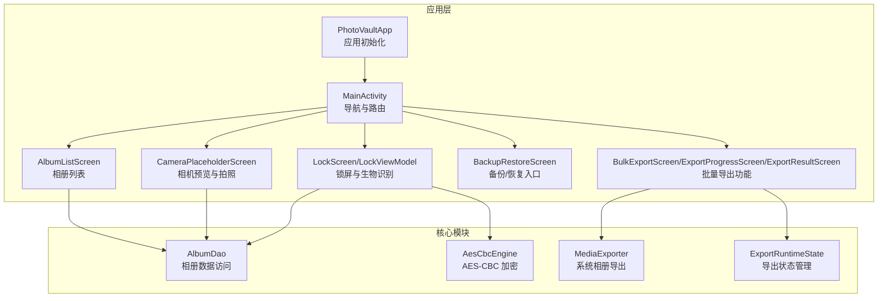
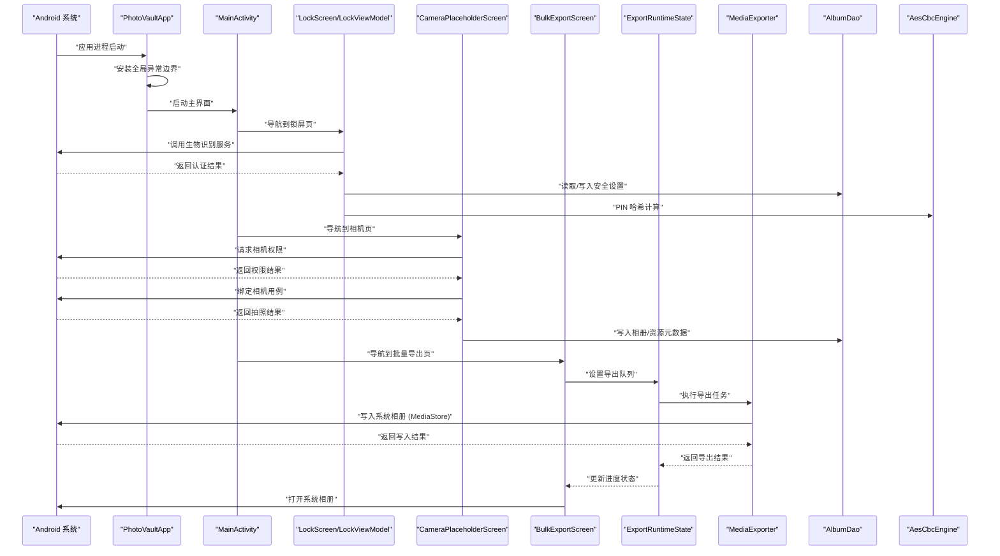
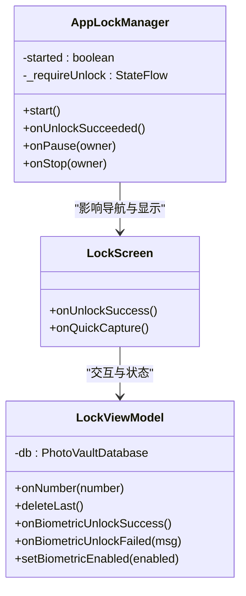
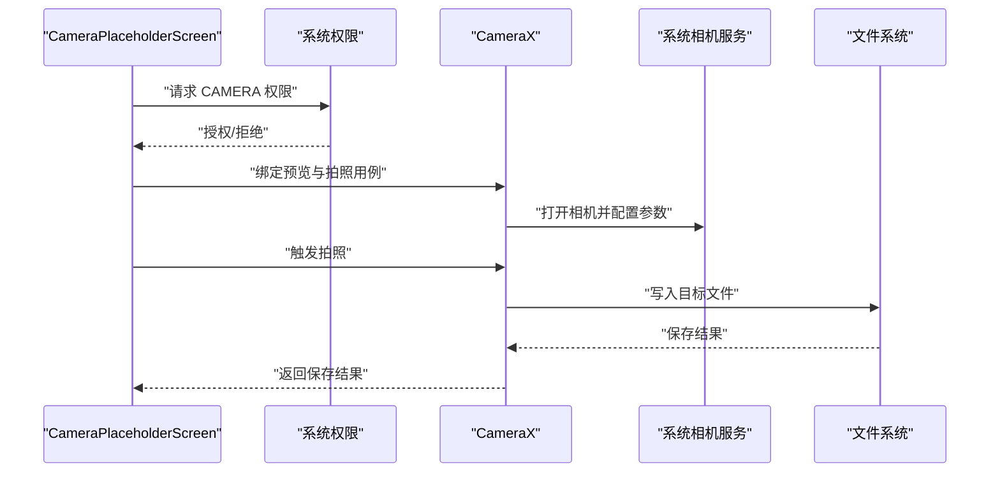
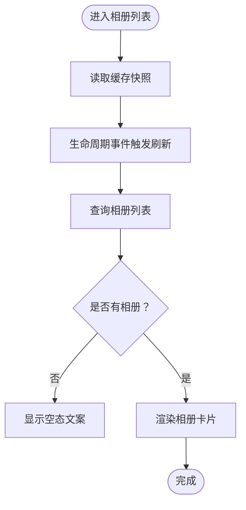
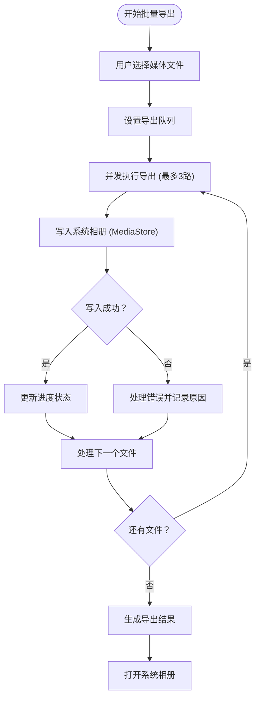
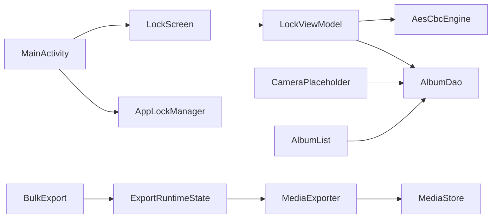

# 系统集成

<cite>
**本文引用的文件**
- [android/app/src/main/kotlin/com/xpx/vault/MainActivity.kt](file://android/app/src/main/kotlin/com/xpx/vault/MainActivity.kt)
- [android/app/src/main/kotlin/com/xpx/vault/PhotoVaultApp.kt](file://android/app/src/main/kotlin/com/xpx/vault/PhotoVaultApp.kt)
- [android/app/src/main/AndroidManifest.xml](file://android/app/src/main/AndroidManifest.xml)
- [android/app/src/main/kotlin/com/xpx/vault/AppLockManager.kt](file://android/app/src/main/kotlin/com/xpx/vault/AppLockManager.kt)
- [android/app/src/main/kotlin/com/xpx/vault/ui/lock/LockScreen.kt](file://android/app/src/main/kotlin/com/xpx/vault/ui/lock/LockScreen.kt)
- [android/app/src/main/kotlin/com/xpx/vault/ui/lock/LockViewModel.kt](file://android/app/src/main/kotlin/com/xpx/vault/ui/lock/LockViewModel.kt)
- [android/app/src/main/kotlin/com/xpx/vault/AppLogger.kt](file://android/app/src/main/kotlin/com/xpx/vault/AppLogger.kt)
- [android/app/src/main/kotlin/com/xpx/vault/ui/CameraPlaceholderScreen.kt](file://android/app/src/main/kotlin/com/xpx/vault/ui/CameraPlaceholderScreen.kt)
- [android/app/src/main/kotlin/com/xpx/vault/ui/AlbumListScreen.kt](file://android/app/src/main/kotlin/com/xpx/vault/ui/AlbumListScreen.kt)
- [android/app/src/main/kotlin/com/xpx/vault/ui/BackupRestoreScreen.kt](file://android/app/src/main/kotlin/com/xpx/vault/ui/BackupRestoreScreen.kt)
- [android/core/data/src/main/kotlin/com/xpx/vault/data/db/dao/AlbumDao.kt](file://android/core/data/src/main/kotlin/com/xpx/vault/data/db/dao/AlbumDao.kt)
- [android/core/data/src/main/kotlin/com/xpx/vault/data/crypto/AesCbcEngine.kt](file://android/core/data/src/main/kotlin/com/xpx/vault/data/crypto/AesCbcEngine.kt)
- [android/app/src/main/kotlin/com/xpx/vault/ui/export/MediaExporter.kt](file://android/app/src/main/kotlin/com/xpx/vault/ui/export/MediaExporter.kt)
- [android/app/src/main/kotlin/com/xpx/vault/ui/export/ExportRuntimeState.kt](file://android/app/src/main/kotlin/com/xpx/vault/ui/export/ExportRuntimeState.kt)
- [android/app/src/main/kotlin/com/xpx/vault/ui/BulkExportScreen.kt](file://android/app/src/main/kotlin/com/xpx/vault/ui/BulkExportScreen.kt)
- [android/app/src/main/kotlin/com/xpx/vault/ui/ExportProgressScreen.kt](file://android/app/src/main/kotlin/com/xpx/vault/ui/ExportProgressScreen.kt)
- [android/app/src/main/kotlin/com/xpx/vault/ui/ExportResultScreen.kt](file://android/app/src/main/kotlin/com/xpx/vault/ui/ExportResultScreen.kt)
</cite>

## 更新摘要
**变更内容**
- 新增批量导出功能的系统集成功能
- 添加新的导航路由和权限处理
- 集成Android平台特定的媒体导出API
- 实现完整的导出工作流程

## 目录
1. [简介](#简介)
2. [项目结构](#项目结构)
3. [核心组件](#核心组件)
4. [架构总览](#架构总览)
5. [详细组件分析](#详细组件分析)
6. [依赖关系分析](#依赖关系分析)
7. [性能考量](#性能考量)
8. [故障排查指南](#故障排查指南)
9. [结论](#结论)
10. [附录](#附录)

## 简介
本文件面向系统集成开发者，系统性梳理 AI 照片保险库在 Android 平台上的系统集成功能，覆盖以下方面：
- 与系统服务的集成：系统相册读取、相机、生物识别、文件系统、进程生命周期与前台/后台状态
- **新增**：批量导出功能与系统相册的深度集成，包括MediaStore API、文件权限管理和Android平台特定的媒体导出
- 权限管理与安全策略：权限声明、运行时请求、敏感信息保护与日志策略
- 应用生命周期管理、后台任务处理与系统事件响应
- 系统服务配置与初始化流程
- 错误处理机制与异常情况应对
- 与其他应用的交互与数据共享边界
- 实现指导与最佳实践

## 项目结构
本项目采用 Android 应用层与核心模块分层组织，系统集成相关的关键位置如下：
- 应用入口与生命周期：Application、Activity、导航与路由
- 安全与锁屏：应用锁管理器、生物识别解锁、PIN 码校验与持久化
- 相机与相册：相机预览与拍照、相册列表展示与刷新
- **新增**：批量导出功能：导出状态管理、MediaStore集成、文件系统权限处理
- 数据与加密：Room DAO、加密引擎（Android Keystore 支持）
- 日志与异常：全局未捕获异常处理器

**图表来源**
- [android/app/src/main/kotlin/com/xpx/vault/PhotoVaultApp.kt:12-17](file://android/app/src/main/kotlin/com/xpx/vault/PhotoVaultApp.kt#L12-L17)
- [android/app/src/main/kotlin/com/xpx/vault/MainActivity.kt:76-242](file://android/app/src/main/kotlin/com/xpx/vault/MainActivity.kt#L76-L242)
- [android/app/src/main/kotlin/com/xpx/vault/ui/lock/LockScreen.kt:52-228](file://android/app/src/main/kotlin/com/xpx/vault/ui/lock/LockScreen.kt#L52-L228)
- [android/app/src/main/kotlin/com/xpx/vault/ui/CameraPlaceholderScreen.kt:56-216](file://android/app/src/main/kotlin/com/xpx/vault/ui/CameraPlaceholderScreen.kt#L56-L216)
- [android/app/src/main/kotlin/com/xpx/vault/ui/AlbumListScreen.kt:48-165](file://android/app/src/main/kotlin/com/xpx/vault/ui/AlbumListScreen.kt#L48-L165)
- [android/app/src/main/kotlin/com/xpx/vault/ui/BackupRestoreScreen.kt:33-83](file://android/app/src/main/kotlin/com/xpx/vault/ui/BackupRestoreScreen.kt#L33-L83)
- [android/app/src/main/kotlin/com/xpx/vault/ui/export/MediaExporter.kt:27-52](file://android/app/src/main/kotlin/com/xpx/vault/ui/export/MediaExporter.kt#L27-L52)
- [android/app/src/main/kotlin/com/xpx/vault/ui/export/ExportRuntimeState.kt:24-56](file://android/app/src/main/kotlin/com/xpx/vault/ui/export/ExportRuntimeState.kt#L24-L56)

**章节来源**
- [android/app/src/main/kotlin/com/xpx/vault/PhotoVaultApp.kt:12-17](file://android/app/src/main/kotlin/com/xpx/vault/PhotoVaultApp.kt#L12-L17)
- [android/app/src/main/kotlin/com/xpx/vault/MainActivity.kt:76-242](file://android/app/src/main/kotlin/com/xpx/vault/MainActivity.kt#L76-L242)

## 核心组件
- 应用入口与生命周期
  - Application 初始化：安装全局异常边界、启动应用锁管理器
  - Activity 导航：基于 Compose Navigation 的路由与栈管理，结合锁屏拦截逻辑
- 安全与锁屏
  - 应用锁管理器：监听进程生命周期，在前台可见性变化时触发上锁/解锁
  - 生物识别解锁：BiometricPrompt 集成，兼容弱/强生物特征与设备凭证
  - PIN 码设置与校验：SHA-256 哈希持久化、连续错误计数与提示
- 相机与相册
  - 相机预览与拍照：CameraX 集成，权限请求与用例绑定，拍照结果写入保险库
  - 相册列表：基于 Room 观察相册变更，生命周期事件驱动刷新
- **新增**：批量导出功能
  - 导出状态管理：ExportRuntimeState 负责导出队列、进度跟踪和结果汇总
  - MediaStore 集成：MediaExporter 实现跨Android版本的系统相册导出
  - 并发处理：支持最多3路并发导出，优化大文件传输性能
- 数据与加密
  - Room DAO：相册查询与观察
  - AES-CBC 加密：IV 前置，密钥托管于 Android Keystore
- 日志与异常
  - 全局未捕获异常处理器：统一记录与透传
  - 日志策略：限制长度、避免敏感信息输出

**章节来源**
- [android/app/src/main/kotlin/com/xpx/vault/PhotoVaultApp.kt:12-29](file://android/app/src/main/kotlin/com/xpx/vault/PhotoVaultApp.kt#L12-L29)
- [android/app/src/main/kotlin/com/xpx/vault/AppLockManager.kt:17-48](file://android/app/src/main/kotlin/com/xpx/vault/AppLockManager.kt#L17-L48)
- [android/app/src/main/kotlin/com/xpx/vault/ui/lock/LockScreen.kt:52-228](file://android/app/src/main/kotlin/com/xpx/vault/ui/lock/LockScreen.kt#L52-L228)
- [android/app/src/main/kotlin/com/xpx/vault/ui/lock/LockViewModel.kt:18-197](file://android/app/src/main/kotlin/com/xpx/vault/ui/lock/LockViewModel.kt#L18-L197)
- [android/app/src/main/kotlin/com/xpx/vault/ui/CameraPlaceholderScreen.kt:56-216](file://android/app/src/main/kotlin/com/xpx/vault/ui/CameraPlaceholderScreen.kt#L56-L216)
- [android/app/src/main/kotlin/com/xpx/vault/ui/AlbumListScreen.kt:48-165](file://android/app/src/main/kotlin/com/xpx/vault/ui/AlbumListScreen.kt#L48-L165)
- [android/core/data/src/main/kotlin/com/xpx/vault/data/db/dao/AlbumDao.kt:10-17](file://android/core/data/src/main/kotlin/com/xpx/vault/data/db/dao/AlbumDao.kt#L10-L17)
- [android/core/data/src/main/kotlin/com/xpx/vault/data/crypto/AesCbcEngine.kt:12-38](file://android/core/data/src/main/kotlin/com/xpx/vault/data/crypto/AesCbcEngine.kt#L12-L38)
- [android/app/src/main/kotlin/com/xpx/vault/AppLogger.kt:16-29](file://android/app/src/main/kotlin/com/xpx/vault/AppLogger.kt#L16-L29)
- [android/app/src/main/kotlin/com/xpx/vault/ui/export/MediaExporter.kt:27-52](file://android/app/src/main/kotlin/com/xpx/vault/ui/export/MediaExporter.kt#L27-L52)
- [android/app/src/main/kotlin/com/xpx/vault/ui/export/ExportRuntimeState.kt:24-56](file://android/app/src/main/kotlin/com/xpx/vault/ui/export/ExportRuntimeState.kt#L24-L56)

## 架构总览
系统集成围绕"应用层 UI + 核心模块数据/加密"展开，**新增**批量导出功能的完整工作流程如下：
- MainActivity 负责路由与锁屏拦截；AppLockManager 通过 ProcessLifecycleOwner 监听前台/后台切换
- LockScreen 通过 BiometricPrompt 与系统生物识别服务交互；PIN 码通过 LockViewModel 写入数据库
- CameraPlaceholderScreen 使用 CameraX 与系统相机服务交互；拍照结果写入保险库并持久化
- AlbumListScreen 通过 AlbumDao 观察相册数据变化，结合生命周期事件刷新
- **新增**：BulkExportScreen 允许用户选择多个媒体文件，ExportRuntimeState 管理导出队列，MediaExporter 通过 MediaStore API 将文件导出到系统相册
- PhotoVaultApp 在应用启动时安装全局异常边界，确保崩溃可追踪

**图表来源**
- [android/app/src/main/kotlin/com/xpx/vault/PhotoVaultApp.kt:12-29](file://android/app/src/main/kotlin/com/xpx/vault/PhotoVaultApp.kt#L12-L29)
- [android/app/src/main/kotlin/com/xpx/vault/MainActivity.kt:76-242](file://android/app/src/main/kotlin/com/xpx/vault/MainActivity.kt#L76-L242)
- [android/app/src/main/kotlin/com/xpx/vault/ui/lock/LockScreen.kt:52-228](file://android/app/src/main/kotlin/com/xpx/vault/ui/lock/LockScreen.kt#L52-L228)
- [android/app/src/main/kotlin/com/xpx/vault/ui/CameraPlaceholderScreen.kt:56-216](file://android/app/src/main/kotlin/com/xpx/vault/ui/CameraPlaceholderScreen.kt#L56-L216)
- [android/app/src/main/kotlin/com/xpx/vault/ui/export/MediaExporter.kt:27-52](file://android/app/src/main/kotlin/com/xpx/vault/ui/export/MediaExporter.kt#L27-L52)
- [android/app/src/main/kotlin/com/xpx/vault/ui/export/ExportRuntimeState.kt:24-56](file://android/app/src/main/kotlin/com/xpx/vault/ui/export/ExportRuntimeState.kt#L24-L56)
- [android/core/data/src/main/kotlin/com/xpx/vault/data/db/dao/AlbumDao.kt:10-17](file://android/core/data/src/main/kotlin/com/xpx/vault/data/db/dao/AlbumDao.kt#L10-L17)
- [android/core/data/src/main/kotlin/com/xpx/vault/data/crypto/AesCbcEngine.kt:12-38](file://android/core/data/src/main/kotlin/com/xpx/vault/data/crypto/AesCbcEngine.kt#L12-L38)

## 详细组件分析

### 应用生命周期与锁屏集成
- 生命周期监听
  - AppLockManager 注册为 DefaultLifecycleObserver，依据前台可见性决定是否要求解锁
  - 支持在 onPause/onStop 两个策略点触发上锁，避免页面切换误触发
- 锁屏 UI 与生物识别
  - LockScreen 使用 BiometricPrompt，支持弱/强生物特征与设备凭证组合
  - 自动弹出生物识别提示（在满足条件时），失败时回退到 PIN 输入
- PIN 管理
  - LockViewModel 负责 PIN 设置、确认、校验与失败计数；使用 SHA-256 哈希持久化
  - 连续错误次数更新，解锁成功清零

**图表来源**
- [android/app/src/main/kotlin/com/xpx/vault/AppLockManager.kt:17-48](file://android/app/src/main/kotlin/com/xpx/vault/AppLockManager.kt#L17-L48)
- [android/app/src/main/kotlin/com/xpx/vault/ui/lock/LockScreen.kt:52-228](file://android/app/src/main/kotlin/com/xpx/vault/ui/lock/LockScreen.kt#L52-L228)
- [android/app/src/main/kotlin/com/xpx/vault/ui/lock/LockViewModel.kt:18-197](file://android/app/src/main/kotlin/com/xpx/vault/ui/lock/LockViewModel.kt#L18-L197)

**章节来源**
- [android/app/src/main/kotlin/com/xpx/vault/AppLockManager.kt:17-48](file://android/app/src/main/kotlin/com/xpx/vault/AppLockManager.kt#L17-L48)
- [android/app/src/main/kotlin/com/xpx/vault/ui/lock/LockScreen.kt:52-228](file://android/app/src/main/kotlin/com/xpx/vault/ui/lock/LockScreen.kt#L52-L228)
- [android/app/src/main/kotlin/com/xpx/vault/ui/lock/LockViewModel.kt:18-197](file://android/app/src/main/kotlin/com/xpx/vault/ui/lock/LockViewModel.kt#L18-L197)

### 相机与系统相机服务集成
- 权限与用例绑定
  - 运行时请求 CAMERA 权限；绑定 Preview 与 ImageCapture 用例
  - 用例参数：闪光灯、前后摄像头选择、最小延迟捕获模式
- 拍照流程
  - 生成目标文件（保险库目录），异步拍照并回调结果
  - 失败时返回错误消息，成功则关闭相机页并返回保险库
- 生命周期与资源释放
  - 通过 CameraX 的 bindToLifecycle 与 Compose 生命周期绑定，自动解绑

**图表来源**
- [android/app/src/main/kotlin/com/xpx/vault/ui/CameraPlaceholderScreen.kt:56-216](file://android/app/src/main/kotlin/com/xpx/vault/ui/CameraPlaceholderScreen.kt#L56-L216)

**章节来源**
- [android/app/src/main/kotlin/com/xpx/vault/ui/CameraPlaceholderScreen.kt:56-216](file://android/app/src/main/kotlin/com/xpx/vault/ui/CameraPlaceholderScreen.kt#L56-L216)

### 系统相册读取与相册管理
- 相册列表刷新
  - 初始加载缓存快照；在生命周期 onResume 时刷新最新相册列表
  - 使用 LazyColumn 展示封面图、名称与数量
- 数据来源与持久化
  - AlbumDao 提供相册观察流；相册元数据写入数据库
- 与系统相册的关系
  - 当前实现聚焦于应用内部"保险库相册"的管理与展示，未直接展示系统相册内容

**图表来源**
- [android/app/src/main/kotlin/com/xpx/vault/ui/AlbumListScreen.kt:48-165](file://android/app/src/main/kotlin/com/xpx/vault/ui/AlbumListScreen.kt#L48-L165)
- [android/core/data/src/main/kotlin/com/xpx/vault/data/db/dao/AlbumDao.kt:10-17](file://android/core/data/src/main/kotlin/com/xpx/vault/data/db/dao/AlbumDao.kt#L10-L17)

**章节来源**
- [android/app/src/main/kotlin/com/xpx/vault/ui/AlbumListScreen.kt:48-165](file://android/app/src/main/kotlin/com/xpx/vault/ui/AlbumListScreen.kt#L48-L165)
- [android/core/data/src/main/kotlin/com/xpx/vault/data/db/dao/AlbumDao.kt:10-17](file://android/core/data/src/main/kotlin/com/xpx/vault/data/db/dao/AlbumDao.kt#L10-L17)

### 备份/恢复入口与系统交互
- 备份/恢复卡片入口：提供上传与下载操作按钮
- 与系统交互：该界面为入口级 UI，具体备份/恢复流程在后续页面实现

**章节来源**
- [android/app/src/main/kotlin/com/xpx/vault/ui/BackupRestoreScreen.kt:33-83](file://android/app/src/main/kotlin/com/xpx/vault/ui/BackupRestoreScreen.kt#L33-L83)

### **新增**：批量导出功能与系统相册深度集成

#### 导出状态管理
- ExportRuntimeState 负责管理导出队列、进度跟踪和结果汇总
- 支持最多3路并发导出，优化大文件传输性能
- 进度回调以100ms节流，避免频繁触发Compose重组
- 提供最后导出结果的持久化存储

#### MediaStore API 集成
- **Android 10+**：使用 MediaStore 的 RELATIVE_PATH 和 IS_PENDING 事务写入
- **Android 9 及以下**：直接写入 PICTURES/MOVIES 目录，然后通过 MediaScannerConnection 触发扫描
- 支持图片和视频格式，自动解析 MIME 类型
- 零拷贝优化：优先使用 FileChannel.transferTo，失败时回退到256KB缓冲区

#### 权限处理
- 运行时请求 READ_MEDIA_IMAGES 和 READ_MEDIA_VIDEO 权限
- 兼容不同Android版本的权限模型
- 导出过程中动态获取必要的存储权限

**图表来源**
- [android/app/src/main/kotlin/com/xpx/vault/ui/export/ExportRuntimeState.kt:68-128](file://android/app/src/main/kotlin/com/xpx/vault/ui/export/ExportRuntimeState.kt#L68-L128)
- [android/app/src/main/kotlin/com/xpx/vault/ui/export/MediaExporter.kt:38-52](file://android/app/src/main/kotlin/com/xpx/vault/ui/export/MediaExporter.kt#L38-L52)

**章节来源**
- [android/app/src/main/kotlin/com/xpx/vault/ui/export/ExportRuntimeState.kt:24-56](file://android/app/src/main/kotlin/com/xpx/vault/ui/export/ExportRuntimeState.kt#L24-L56)
- [android/app/src/main/kotlin/com/xpx/vault/ui/export/MediaExporter.kt:27-52](file://android/app/src/main/kotlin/com/xpx/vault/ui/export/MediaExporter.kt#L27-L52)
- [android/app/src/main/kotlin/com/xpx/vault/ui/BulkExportScreen.kt:57-179](file://android/app/src/main/kotlin/com/xpx/vault/ui/BulkExportScreen.kt#L57-L179)
- [android/app/src/main/kotlin/com/xpx/vault/ui/ExportProgressScreen.kt:35-64](file://android/app/src/main/kotlin/com/xpx/vault/ui/ExportProgressScreen.kt#L35-L64)
- [android/app/src/main/kotlin/com/xpx/vault/ui/ExportResultScreen.kt:37-112](file://android/app/src/main/kotlin/com/xpx/vault/ui/ExportResultScreen.kt#L37-L112)

### 权限管理与安全策略
- 权限声明
  - Manifest 中声明 CAMERA、READ_EXTERNAL_STORAGE（<=32）、READ_MEDIA_IMAGES、READ_MEDIA_VIDEO
- 运行时权限
  - 相机页在首次进入时请求 CAMERA 权限；无权限时提示并阻塞拍照
  - **新增**：批量导出功能在导出前请求 READ_MEDIA_IMAGES 和 READ_MEDIA_VIDEO 权限
- 安全策略
  - PIN 码以 SHA-256 哈希形式存储；失败计数用于防暴力破解
  - 生物识别解锁作为辅助手段，失败时回退到 PIN
  - 日志策略限制长度，避免敏感信息泄露

**章节来源**
- [android/app/src/main/AndroidManifest.xml:3-6](file://android/app/src/main/AndroidManifest.xml#L3-L6)
- [android/app/src/main/kotlin/com/xpx/vault/ui/CameraPlaceholderScreen.kt:64-85](file://android/app/src/main/kotlin/com/xpx/vault/ui/CameraPlaceholderScreen.kt#L64-L85)
- [android/app/src/main/kotlin/com/xpx/vault/ui/lock/LockViewModel.kt:153-166](file://android/app/src/main/kotlin/com/xpx/vault/ui/lock/LockViewModel.kt#L153-L166)
- [android/app/src/main/kotlin/com/xpx/vault/AppLogger.kt:16-29](file://android/app/src/main/kotlin/com/xpx/vault/AppLogger.kt#L16-L29)

### 系统服务配置与初始化
- 应用初始化
  - PhotoVaultApp 在 onCreate 中安装全局异常边界、启动应用锁管理器
- Activity 导航
  - MainActivity 使用 Compose Navigation 构建路由表，配合锁屏拦截逻辑
  - **新增**：定义批量导出相关路由常量（ROUTE_BULK_EXPORT、ROUTE_EXPORT_PROGRESS、ROUTE_EXPORT_RESULT）
- 生命周期初始化
  - AppLockManager 通过 ProcessLifecycleOwner 注册观察者，按策略触发上锁

**章节来源**
- [android/app/src/main/kotlin/com/xpx/vault/PhotoVaultApp.kt:12-29](file://android/app/src/main/kotlin/com/xpx/vault/PhotoVaultApp.kt#L12-L29)
- [android/app/src/main/kotlin/com/xpx/vault/MainActivity.kt:76-242](file://android/app/src/main/kotlin/com/xpx/vault/MainActivity.kt#L76-L242)
- [android/app/src/main/kotlin/com/xpx/vault/AppLockManager.kt:27-31](file://android/app/src/main/kotlin/com/xpx/vault/AppLockManager.kt#L27-L31)

### 错误处理机制与异常情况应对
- 全局异常处理
  - 设置默认未捕获异常处理器，记录标签与堆栈，再透传给旧处理器
- 相机错误
  - 拍照异常时返回失败状态并提示重试
- 生物识别错误
  - 区分取消、错误与失败，分别给出不同提示
- PIN 错误
  - 连续错误计数并在 UI 中提示剩余机会
- **新增**：导出错误处理
  - 导出失败时记录具体原因（文件不存在、未知MIME类型、不支持的类型等）
  - 导出过程中出现IO错误时自动清理临时文件
  - 支持部分导出成功的情况，允许用户查看成功和失败的详细列表

**章节来源**
- [android/app/src/main/kotlin/com/xpx/vault/PhotoVaultApp.kt:19-29](file://android/app/src/main/kotlin/com/xpx/vault/PhotoVaultApp.kt#L19-L29)
- [android/app/src/main/kotlin/com/xpx/vault/ui/CameraPlaceholderScreen.kt:259-277](file://android/app/src/main/kotlin/com/xpx/vault/ui/CameraPlaceholderScreen.kt#L259-L277)
- [android/app/src/main/kotlin/com/xpx/vault/ui/lock/LockScreen.kt:81-98](file://android/app/src/main/kotlin/com/xpx/vault/ui/lock/LockScreen.kt#L81-L98)
- [android/app/src/main/kotlin/com/xpx/vault/ui/lock/LockViewModel.kt:168-184](file://android/app/src/main/kotlin/com/xpx/vault/ui/lock/LockViewModel.kt#L168-L184)
- [android/app/src/main/kotlin/com/xpx/vault/ui/export/MediaExporter.kt:38-52](file://android/app/src/main/kotlin/com/xpx/vault/ui/export/MediaExporter.kt#L38-L52)

### 与其他应用的交互与数据共享
- 交互边界
  - 本项目聚焦应用内"保险库"能力，未见与系统相册或其他应用进行直接数据共享的实现
  - 相册列表与相机功能均在应用内部完成，不涉及跨应用内容提供者
  - **新增**：批量导出功能通过系统相册API与系统相册应用进行数据交换
- 数据存储
  - 相册元数据通过 Room 持久化；加密算法与密钥托管遵循 Android Keystore 最佳实践
  - **新增**：导出的媒体文件存储在系统相册中，遵循Android媒体存储标准

**章节来源**
- [android/app/src/main/kotlin/com/xpx/vault/ui/AlbumListScreen.kt:48-165](file://android/app/src/main/kotlin/com/xpx/vault/ui/AlbumListScreen.kt#L48-L165)
- [android/core/data/src/main/kotlin/com/xpx/vault/data/crypto/AesCbcEngine.kt:12-38](file://android/core/data/src/main/kotlin/com/xpx/vault/data/crypto/AesCbcEngine.kt#L12-L38)

## 依赖关系分析
- 组件耦合
  - MainActivity 与 AppLockManager 通过状态流联动；LockScreen 与 LockViewModel 通过状态与命令交互
  - 相机页与数据库通过 VaultStore/AlbumDao 间接耦合
  - **新增**：导出功能通过 ExportRuntimeState 与 MediaExporter 解耦，支持独立测试和扩展
- 外部依赖
  - AndroidX CameraX、Biometric、Compose、Room、Hilt
  - **新增**：Android MediaStore API、ContentResolver
- 循环依赖
  - 未发现循环依赖；各模块职责清晰

**图表来源**
- [android/app/src/main/kotlin/com/xpx/vault/MainActivity.kt:76-242](file://android/app/src/main/kotlin/com/xpx/vault/MainActivity.kt#L76-L242)
- [android/app/src/main/kotlin/com/xpx/vault/AppLockManager.kt:17-48](file://android/app/src/main/kotlin/com/xpx/vault/AppLockManager.kt#L17-L48)
- [android/app/src/main/kotlin/com/xpx/vault/ui/lock/LockScreen.kt:52-228](file://android/app/src/main/kotlin/com/xpx/vault/ui/lock/LockScreen.kt#L52-L228)
- [android/app/src/main/kotlin/com/xpx/vault/ui/lock/LockViewModel.kt:18-197](file://android/app/src/main/kotlin/com/xpx/vault/ui/lock/LockViewModel.kt#L18-L197)
- [android/app/src/main/kotlin/com/xpx/vault/ui/CameraPlaceholderScreen.kt:56-216](file://android/app/src/main/kotlin/com/xpx/vault/ui/CameraPlaceholderScreen.kt#L56-L216)
- [android/app/src/main/kotlin/com/xpx/vault/ui/AlbumListScreen.kt:48-165](file://android/app/src/main/kotlin/com/xpx/vault/ui/AlbumListScreen.kt#L48-L165)
- [android/core/data/src/main/kotlin/com/xpx/vault/data/db/dao/AlbumDao.kt:10-17](file://android/core/data/src/main/kotlin/com/xpx/vault/data/db/dao/AlbumDao.kt#L10-L17)
- [android/core/data/src/main/kotlin/com/xpx/vault/data/crypto/AesCbcEngine.kt:12-38](file://android/core/data/src/main/kotlin/com/xpx/vault/data/crypto/AesCbcEngine.kt#L12-L38)
- [android/app/src/main/kotlin/com/xpx/vault/ui/export/ExportRuntimeState.kt:24-56](file://android/app/src/main/kotlin/com/xpx/vault/ui/export/ExportRuntimeState.kt#L24-L56)
- [android/app/src/main/kotlin/com/xpx/vault/ui/export/MediaExporter.kt:27-52](file://android/app/src/main/kotlin/com/xpx/vault/ui/export/MediaExporter.kt#L27-L52)

## 性能考量
- 相机用例
  - 采用最小延迟捕获模式，提升拍照响应速度
  - 异步拍照与 IO 线程分离，避免阻塞主线程
- UI 刷新
  - 相册列表使用懒加载与缓存快照，减少不必要的重绘
  - 仅在 onResume 时刷新，降低频繁查询带来的开销
- 生命周期绑定
  - CameraX 与 Compose 生命周期绑定，自动解绑避免资源泄漏
- **新增**：导出性能优化
  - 并发导出：最多3路并发，充分利用IO带宽
  - 零拷贝传输：优先使用transferTo，减少内存复制开销
  - 进度节流：100ms节流避免频繁重组
  - 缓冲区优化：256KB缓冲区平衡内存使用和传输效率

**章节来源**
- [android/app/src/main/kotlin/com/xpx/vault/ui/CameraPlaceholderScreen.kt:218-248](file://android/app/src/main/kotlin/com/xpx/vault/ui/CameraPlaceholderScreen.kt#L218-L248)
- [android/app/src/main/kotlin/com/xpx/vault/ui/AlbumListScreen.kt:66-75](file://android/app/src/main/kotlin/com/xpx/vault/ui/AlbumListScreen.kt#L66-L75)
- [android/app/src/main/kotlin/com/xpx/vault/ui/export/ExportRuntimeState.kt:62-63](file://android/app/src/main/kotlin/com/xpx/vault/ui/export/ExportRuntimeState.kt#L62-L63)
- [android/app/src/main/kotlin/com/xpx/vault/ui/export/MediaExporter.kt:184-216](file://android/app/src/main/kotlin/com/xpx/vault/ui/export/MediaExporter.kt#L184-L216)

## 故障排查指南
- 无法启动相机
  - 检查 CAMERA 权限是否被授予；查看错误提示并引导用户授权
  - 确认 CameraX 用例绑定成功且未被其他页面抢占
- 生物识别失败
  - 检查设备是否录入生物特征、硬件是否可用
  - 区分取消、错误与失败场景，分别提示用户
- PIN 解锁失败
  - 查看失败计数与提示；建议引导用户重置 PIN 或使用生物识别
- 全局崩溃
  - 检查日志标签与堆栈；确认异常处理器已安装并记录
- **新增**：导出功能问题排查
  - 检查 READ_MEDIA_IMAGES 和 READ_MEDIA_VIDEO 权限是否被授予
  - 确认目标文件是否存在且可读
  - 查看导出失败的具体原因（文件不存在、MIME类型未知、类型不受支持等）
  - 检查系统相册空间是否充足
  - 确认MediaStore API调用是否成功

**章节来源**
- [android/app/src/main/kotlin/com/xpx/vault/ui/CameraPlaceholderScreen.kt:64-85](file://android/app/src/main/kotlin/com/xpx/vault/ui/CameraPlaceholderScreen.kt#L64-L85)
- [android/app/src/main/kotlin/com/xpx/vault/ui/lock/LockScreen.kt:81-98](file://android/app/src/main/kotlin/com/xpx/vault/ui/lock/LockScreen.kt#L81-L98)
- [android/app/src/main/kotlin/com/xpx/vault/ui/lock/LockViewModel.kt:168-184](file://android/app/src/main/kotlin/com/xpx/vault/ui/lock/LockViewModel.kt#L168-L184)
- [android/app/src/main/kotlin/com/xpx/vault/PhotoVaultApp.kt:19-29](file://android/app/src/main/kotlin/com/xpx/vault/PhotoVaultApp.kt#L19-L29)

## 结论
本系统集成方案以应用锁管理器为核心，结合生物识别与 PIN 管理保障隐私安全；通过 CameraX 与系统相机服务完成私密拍照；借助 Room 与加密引擎实现数据持久化与安全存储。**新增的批量导出功能**通过MediaStore API与系统相册深度集成，支持跨Android版本的媒体导出，采用并发优化和零拷贝技术提升性能。整体设计遵循 Android 生命周期与权限最佳实践，具备良好的可维护性与扩展性。

## 附录
- 最佳实践
  - 权限请求与用例绑定需与生命周期同步，避免资源泄漏
  - 生物识别失败应有明确回退路径（PIN）
  - 日志输出严格控制长度与范围，避免敏感信息外泄
  - 相册列表刷新策略应结合业务场景，避免过度查询
  - **新增**：导出功能应合理设置并发度，避免过度占用系统资源
  - **新增**：导出过程中应提供清晰的进度反馈和错误提示
  - **新增**：导出失败时应提供详细的错误原因和解决方案