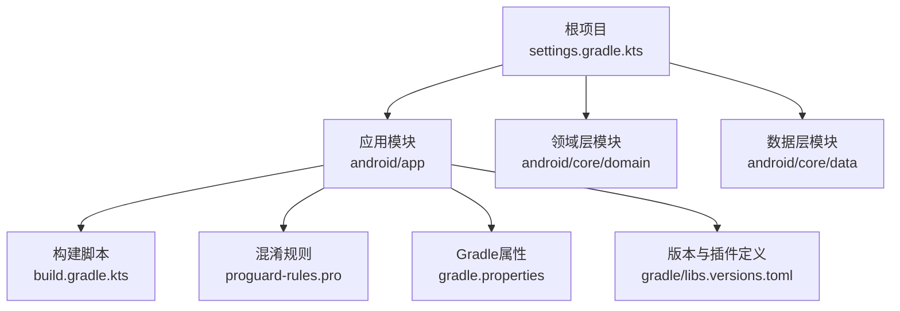
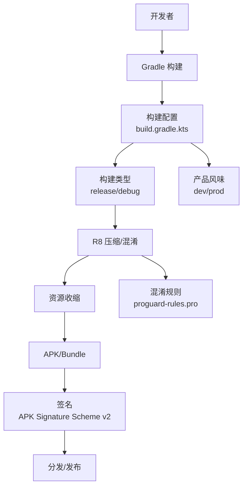
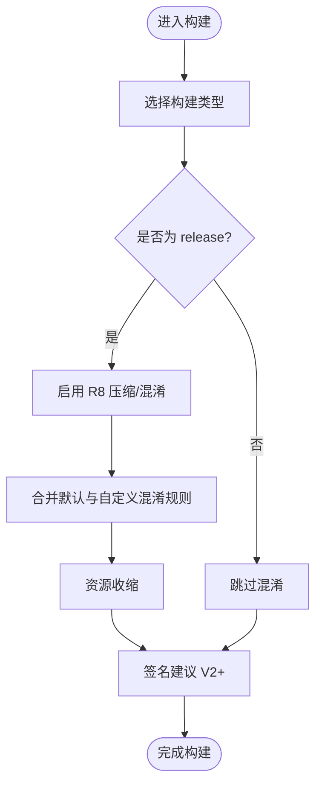
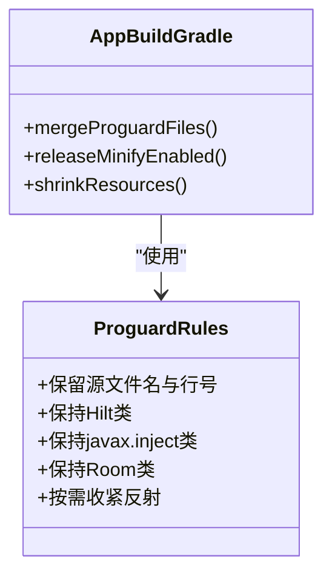
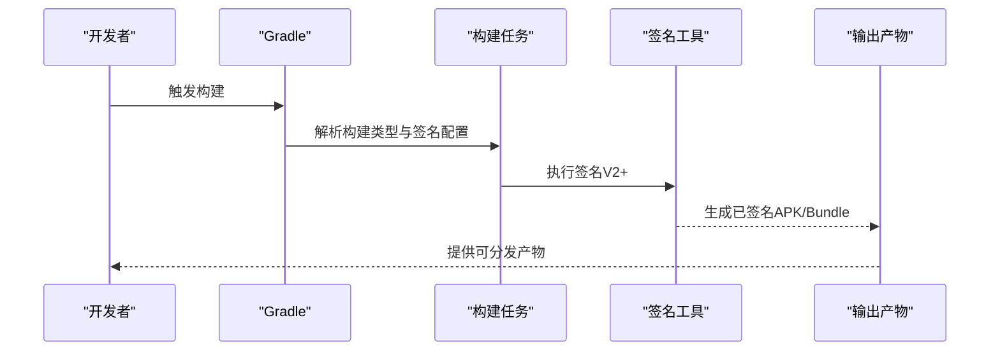
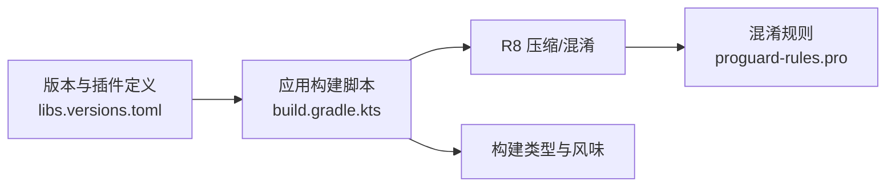

# 代码签名与混淆

<cite>
**本文引用的文件**
- [android/app/build.gradle.kts](file://android/app/build.gradle.kts)
- [android/app/proguard-rules.pro](file://android/app/proguard-rules.pro)
- [android/gradle.properties](file://android/gradle.properties)
- [android/build.gradle.kts](file://android/build.gradle.kts)
- [android/settings.gradle.kts](file://android/settings.gradle.kts)
- [android/gradle/libs.versions.toml](file://android/gradle/libs.versions.toml)
- [android/app/build/intermediates/signing_config_versions/devDebug/writeDevDebugSigningConfigVersions/signing-config-versions.json](file://android/app/build/intermediates/signing_config_versions/devDebug/writeDevDebugSigningConfigVersions/signing-config-versions.json)
- [android/app/build/intermediates/signing_config_versions/prodDebug/writeProdDebugSigningConfigVersions/signing-config-versions.json](file://android/app/build/intermediates/signing_config_versions/prodDebug/writeProdDebugSigningConfigVersions/signing-config-versions.json)
</cite>

## 目录
1. [引言](#引言)
2. [项目结构](#项目结构)
3. [核心组件](#核心组件)
4. [架构总览](#架构总览)
5. [详细组件分析](#详细组件分析)
6. [依赖分析](#依赖分析)
7. [性能考量](#性能考量)
8. [故障排查指南](#故障排查指南)
9. [结论](#结论)
10. [附录](#附录)

## 引言
本指南面向AI照片保险库项目的Android应用，聚焦于“代码签名与混淆”两大主题，帮助团队建立规范的签名证书生成、管理与更新流程，并提供基于R8（Gradle默认混淆器）的混淆规则配置方法、优化策略与最佳实践。文档同时覆盖不同构建类型（如release/debug）的签名配置差异、混淆对性能的影响与权衡、反射调用与重命名兼容性处理、签名验证与混淆效果检查方法，以及常见问题排查路径。

## 项目结构
Android子工程采用多模块结构，应用模块位于android/app，核心业务模块位于android/core下。签名与混淆配置主要集中在应用模块的构建脚本与混淆规则文件中，版本与插件由libs.versions.toml统一管理。

图表来源
- [android/settings.gradle.kts:17-21](file://android/settings.gradle.kts#L17-L21)
- [android/app/build.gradle.kts:1-61](file://android/app/build.gradle.kts#L1-L61)
- [android/app/proguard-rules.pro:1-10](file://android/app/proguard-rules.pro#L1-L10)
- [android/gradle.properties:1-5](file://android/gradle.properties#L1-L5)
- [android/gradle/libs.versions.toml:1-64](file://android/gradle/libs.versions.toml#L1-L64)

章节来源
- [android/settings.gradle.kts:17-21](file://android/settings.gradle.kts#L17-L21)
- [android/app/build.gradle.kts:1-61](file://android/app/build.gradle.kts#L1-L61)
- [android/gradle/libs.versions.toml:1-64](file://android/gradle/libs.versions.toml#L1-L64)

## 核心组件
- 构建脚本与构建类型
  - 应用模块通过build.gradle.kts配置编译SDK、目标SDK、最小SDK、版本号与版本名等基础信息。
  - 定义了release与debug两种构建类型，其中release启用R8压缩与资源收缩，debug关闭混淆以提升调试效率。
  - 使用productFlavors（dev/prod）区分环境变量（如API Key），便于在不同环境进行差异化配置。
- 混淆规则
  - 默认使用Android官方优化规则文件，并合并自定义规则文件proguard-rules.pro。
  - 当前规则保留源文件名与行号信息，用于符号化；并对Hilt、javax.inject及Room相关类进行保留，确保运行时反射与依赖注入正常工作。
- Gradle与版本管理
  - 版本与插件通过libs.versions.toml集中管理，避免版本漂移。
  - gradle.properties开启AndroidX、非传递R类等现代Gradle特性，有助于减少包体与构建时间。
- 签名配置现状
  - 中间产物显示当前构建启用了V2签名（APK Signature Scheme v2），未启用V1签名，V3/V4签名处于关闭状态。
  - 该状态来自构建中间产物，实际签名配置应以仓库中的签名密钥与gradle配置为准；若无显式配置，则可能使用默认或空签名（不建议发布）。

章节来源
- [android/app/build.gradle.kts:9-61](file://android/app/build.gradle.kts#L9-L61)
- [android/app/proguard-rules.pro:1-10](file://android/app/proguard-rules.pro#L1-L10)
- [android/gradle.properties:1-5](file://android/gradle.properties#L1-L5)
- [android/gradle/libs.versions.toml:1-64](file://android/gradle/libs.versions.toml#L1-L64)
- [android/app/build/intermediates/signing_config_versions/devDebug/writeDevDebugSigningConfigVersions/signing-config-versions.json:1-1](file://android/app/build/intermediates/signing_config_versions/devDebug/writeDevDebugSigningConfigVersions/signing-config-versions.json#L1-L1)
- [android/app/build/intermediates/signing_config_versions/prodDebug/writeProdDebugSigningConfigVersions/signing-config-versions.json:1-1](file://android/app/build/intermediates/signing_config_versions/prodDebug/writeProdDebugSigningConfigVersions/signing-config-versions.json#L1-L1)

## 架构总览
下图展示了签名与混淆在构建流程中的位置与影响范围：

图表来源
- [android/app/build.gradle.kts:36-48](file://android/app/build.gradle.kts#L36-L48)
- [android/app/proguard-rules.pro:1-10](file://android/app/proguard-rules.pro#L1-L10)
- [android/app/build/intermediates/signing_config_versions/devDebug/writeDevDebugSigningConfigVersions/signing-config-versions.json:1-1](file://android/app/build/intermediates/signing_config_versions/devDebug/writeDevDebugSigningConfigVersions/signing-config-versions.json#L1-L1)
- [android/app/build/intermediates/signing_config_versions/prodDebug/writeProdDebugSigningConfigVersions/signing-config-versions.json:1-1](file://android/app/build/intermediates/signing_config_versions/prodDebug/writeProdDebugSigningConfigVersions/signing-config-versions.json#L1-L1)

## 详细组件分析

### 组件A：构建类型与混淆配置
- release构建类型
  - 启用R8压缩与资源收缩，使用默认优化规则与自定义规则文件合并。
  - 适用于发布版本，建议配合V2+签名与Play符号化流程。
- debug构建类型
  - 关闭混淆，保留完整类名与行号，便于调试与日志定位。
- 产品风味
  - dev/prod分别注入不同的BuildConfig字段，便于在代码中区分环境。

图表来源
- [android/app/build.gradle.kts:36-48](file://android/app/build.gradle.kts#L36-L48)
- [android/app/proguard-rules.pro:1-10](file://android/app/proguard-rules.pro#L1-L10)

章节来源
- [android/app/build.gradle.kts:36-48](file://android/app/build.gradle.kts#L36-L48)
- [android/app/proguard-rules.pro:1-10](file://android/app/proguard-rules.pro#L1-L10)

### 组件B：混淆规则与反射/依赖注入兼容
- 保留源文件名与行号
  - 用于崩溃符号化与日志定位，建议在release中保留。
- 保留Hilt与javax.inject相关类
  - 确保编译期注解处理与运行时依赖注入正常工作。
- 保留Room相关类
  - 避免数据库迁移与实体访问异常。
- 兼容性建议
  - 对外暴露的API、反射调用处使用保持规则。
  - 第三方库若需要反射，请查阅其文档并添加相应保持规则。

图表来源
- [android/app/proguard-rules.pro:1-10](file://android/app/proguard-rules.pro#L1-L10)
- [android/app/build.gradle.kts:36-48](file://android/app/build.gradle.kts#L36-L48)

章节来源
- [android/app/proguard-rules.pro:1-10](file://android/app/proguard-rules.pro#L1-L10)
- [android/app/build.gradle.kts:36-48](file://android/app/build.gradle.kts#L36-L48)

### 组件C：签名配置现状与建议
- 现状
  - 中间产物显示当前构建启用了V2签名，未启用V1签名，V3/V4签名关闭。
- 建议
  - 发布渠道（如Google Play）建议启用V2+签名，以提升安装安全性与完整性校验能力。
  - 若需兼容旧设备或特定分发场景，可评估同时启用V1与V2签名（但需谨慎权衡）。
  - 密钥库与签名参数应在CI/CD或本地gradle配置中安全存储与引用，避免硬编码。

图表来源
- [android/app/build/intermediates/signing_config_versions/devDebug/writeDevDebugSigningConfigVersions/signing-config-versions.json:1-1](file://android/app/build/intermediates/signing_config_versions/devDebug/writeDevDebugSigningConfigVersions/signing-config-versions.json#L1-L1)
- [android/app/build/intermediates/signing_config_versions/prodDebug/writeProdDebugSigningConfigVersions/signing-config-versions.json:1-1](file://android/app/build/intermediates/signing_config_versions/prodDebug/writeProdDebugSigningConfigVersions/signing-config-versions.json#L1-L1)

章节来源
- [android/app/build/intermediates/signing_config_versions/devDebug/writeDevDebugSigningConfigVersions/signing-config-versions.json:1-1](file://android/app/build/intermediates/signing_config_versions/devDebug/writeDevDebugSigningConfigVersions/signing-config-versions.json#L1-L1)
- [android/app/build/intermediates/signing_config_versions/prodDebug/writeProdDebugSigningConfigVersions/signing-config-versions.json:1-1](file://android/app/build/intermediates/signing_config_versions/prodDebug/writeProdDebugSigningConfigVersions/signing-config-versions.json#L1-L1)

## 依赖分析
- 插件与版本
  - 应用模块使用Android Application、Kotlin Android、Compose、KSP、Hilt等插件，版本由libs.versions.toml统一管理。
- 构建脚本耦合
  - 应用模块构建脚本与混淆规则文件存在直接耦合（通过merge规则文件）。
  - 构建类型与产品风味影响最终产物的签名与混淆策略。

图表来源
- [android/gradle/libs.versions.toml:1-64](file://android/gradle/libs.versions.toml#L1-L64)
- [android/app/build.gradle.kts:1-61](file://android/app/build.gradle.kts#L1-L61)
- [android/app/proguard-rules.pro:1-10](file://android/app/proguard-rules.pro#L1-L10)

章节来源
- [android/gradle/libs.versions.toml:1-64](file://android/gradle/libs.versions.toml#L1-L64)
- [android/app/build.gradle.kts:1-61](file://android/app/build.gradle.kts#L1-L61)
- [android/app/proguard-rules.pro:1-10](file://android/app/proguard-rules.pro#L1-L10)

## 性能考量
- 混淆收益
  - 减少APK体积、增加逆向难度、降低启动时类加载开销。
- 潜在成本
  - 构建时间增加、调试困难度上升、反射与动态调用失败风险。
- 权衡建议
  - 在release中启用混淆与资源收缩；debug保持关闭以便快速迭代。
  - 通过精确的保持规则减少不必要的保留，平衡体积与稳定性。

## 故障排查指南
- 混淆导致的反射/动态调用失败
  - 症状：运行时找不到类、方法或字段，崩溃日志指向重命名后的名称。
  - 处理：在混淆规则中添加对应保持规则，确保反射调用对象不被重命名。
- Hilt/依赖注入异常
  - 症状：编译期或运行时无法解析依赖。
  - 处理：确认Hilt相关保持规则生效，清理并重新构建。
- 符号化与崩溃定位
  - 症状：崩溃日志难以还原原始堆栈。
  - 处理：保留SourceFile与LineNumberTable属性，结合映射文件进行符号化。
- 签名验证
  - 症状：安装失败或提示签名不匹配。
  - 处理：检查签名方案（建议V2+）、密钥库路径与别名配置，使用验证工具确认签名状态。

章节来源
- [android/app/proguard-rules.pro:1-10](file://android/app/proguard-rules.pro#L1-L10)
- [android/app/build.gradle.kts:36-48](file://android/app/build.gradle.kts#L36-L48)

## 结论
本指南明确了AI照片保险库Android应用在签名与混淆方面的现状与改进建议：在release中启用R8与资源收缩，在debug中关闭混淆以提升调试效率；通过精确的混淆规则保障反射与依赖注入的兼容性；在发布渠道启用V2+签名以增强安全性与完整性。建议将密钥与签名参数纳入安全配置管理，并在CI/CD中自动化执行签名与混淆流程，确保一致性与可追溯性。

## 附录
- 不同构建类型的签名配置示例思路
  - debug：关闭混淆，使用默认或测试签名（仅用于本地调试）。
  - release：启用R8与资源收缩，使用正式签名（建议V2+），并生成映射文件用于崩溃符号化。
- 代码混淆对性能的影响与权衡
  - 正面：减小体积、提升逆向难度。
  - 负面：构建耗时增加、调试复杂度上升、反射调用失败风险。
- 处理混淆后的方法重命名与反射调用
  - 在混淆规则中对反射调用的目标类与成员添加保持规则，避免重命名破坏反射。
- 签名验证与混淆效果检查
  - 使用签名验证工具检查APK签名方案与有效性。
  - 使用混淆映射文件进行崩溃日志符号化，核对是否正确还原原始类名与方法名。