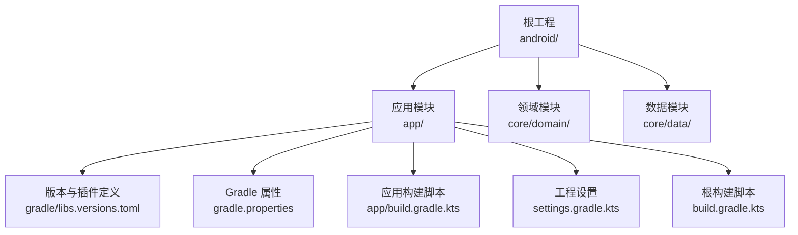
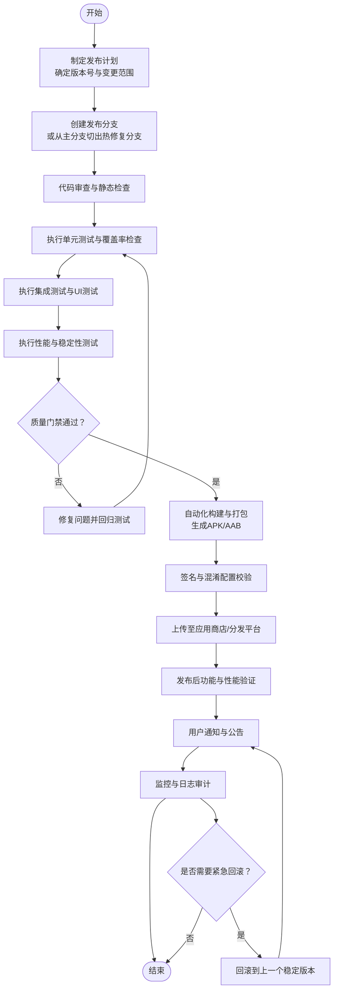
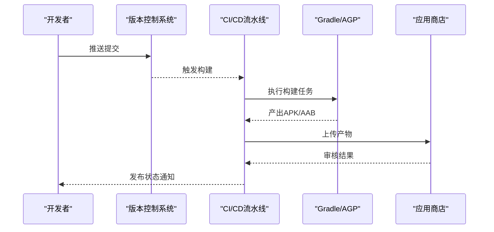
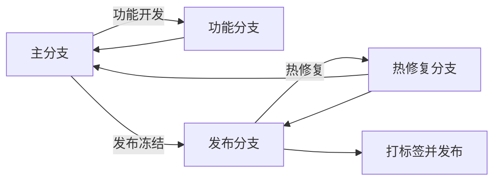
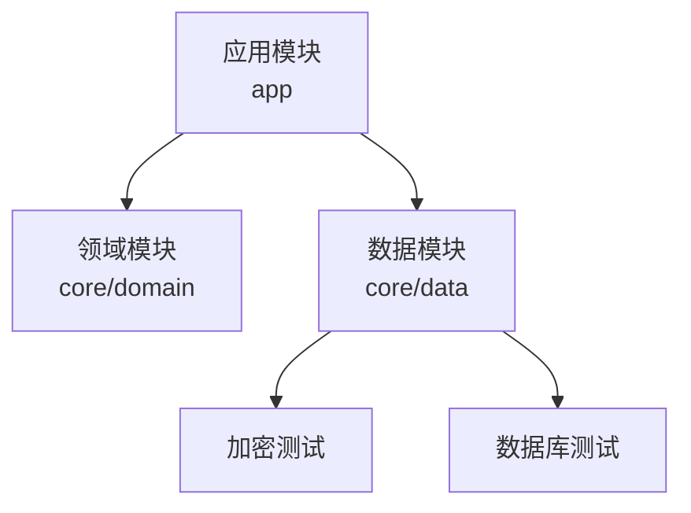

# 发布流程

<cite>
**本文引用的文件**
- [android/build.gradle.kts](file://android/build.gradle.kts)
- [android/gradle/libs.versions.toml](file://android/gradle/libs.versions.toml)
- [android/gradle.properties](file://android/gradle.properties)
- [android/settings.gradle.kts](file://android/settings.gradle.kts)
- [android/app/build.gradle.kts](file://android/app/build.gradle.kts)
- [android/core/data/src/test/kotlin/com/photovault/data/crypto/AesCbcEngineTest.kt](file://android/core/data/src/test/kotlin/com/photovault/data/crypto/AesCbcEngineTest.kt)
- [android/core/data/src/test/kotlin/com/photovault/data/crypto/PasswordHasherTest.kt](file://android/core/data/src/test/kotlin/com/photovault/data/crypto/PasswordHasherTest.kt)
- [android/core/data/src/test/kotlin/com/photovault/data/db/AlbumDaoRobolectricTest.kt](file://android/core/data/src/test/kotlin/com/photovault/data/db/AlbumDaoRobolectricTest.kt)
- [android/.gitignore](file://android/.gitignore)
</cite>

## 目录
1. [简介](#简介)
2. [项目结构](#项目结构)
3. [核心组件](#核心组件)
4. [架构总览](#架构总览)
5. [详细组件分析](#详细组件分析)
6. [依赖分析](#依赖分析)
7. [性能考虑](#性能考虑)
8. [故障排查指南](#故障排查指南)
9. [结论](#结论)
10. [附录](#附录)

## 简介
本文件为 AI 照片保险库项目的标准化发布流程文档，覆盖从代码提交到应用商店发布的完整流程规范。内容包括版本号管理策略（语义化版本控制）、发布前质量检查清单（代码审查、单元测试、集成测试、性能测试）、自动化构建与打包配置、发布分支管理与热修复流程、发布后验证与用户通知机制，以及紧急回滚预案与发布失败应急处理方案。

## 项目结构
本项目采用多模块 Gradle 架构，根工程包含应用模块与核心数据/领域模块；应用模块通过产品风味区分开发与生产环境，并启用 Compose、Hilt、KSP 等插件以支持现代 Android 开发栈。

图表来源
- [android/app/build.gradle.kts:1-91](file://android/app/build.gradle.kts#L1-L91)
- [android/settings.gradle.kts:1-21](file://android/settings.gradle.kts#L1-L21)
- [android/build.gradle.kts:1-10](file://android/build.gradle.kts#L1-L10)
- [android/gradle/libs.versions.toml:1-64](file://android/gradle/libs.versions.toml#L1-L64)
- [android/gradle.properties:1-5](file://android/gradle.properties#L1-L5)

章节来源
- [android/settings.gradle.kts:17-21](file://android/settings.gradle.kts#L17-L21)
- [android/app/build.gradle.kts:1-91](file://android/app/build.gradle.kts#L1-L91)

## 核心组件
- 版本与依赖管理：通过集中化的版本与依赖定义文件统一管理 Android Gradle Plugin、Kotlin、Compose、Room、Hilt、CameraX 等版本，确保跨模块一致性。
- 构建与产物：应用模块定义了产品风味（dev/prod）与构建类型（release/debug），并启用了资源压缩与代码混淆；同时声明了 Compose 与 BuildConfig 支持。
- 测试体系：在数据模块中提供了加密算法、密码哈希与数据库访问层的单元测试，使用 JUnit、Truth 与 Robolectric 进行断言与模拟运行时。
- 构建缓存与产物排除：根目录的忽略规则明确排除了构建产物与本地配置，避免污染仓库。

章节来源
- [android/gradle/libs.versions.toml:1-64](file://android/gradle/libs.versions.toml#L1-L64)
- [android/app/build.gradle.kts:9-61](file://android/app/build.gradle.kts#L9-L61)
- [android/core/data/src/test/kotlin/com/photovault/data/crypto/AesCbcEngineTest.kt:1-19](file://android/core/data/src/test/kotlin/com/photovault/data/crypto/AesCbcEngineTest.kt#L1-L19)
- [android/core/data/src/test/kotlin/com/photovault/data/crypto/PasswordHasherTest.kt:1-24](file://android/core/data/src/test/kotlin/com/photovault/data/crypto/PasswordHasherTest.kt#L1-L24)
- [android/core/data/src/test/kotlin/com/photovault/data/db/AlbumDaoRobolectricTest.kt:1-50](file://android/core/data/src/test/kotlin/com/photovault/data/db/AlbumDaoRobolectricTest.kt#L1-L50)
- [android/.gitignore:1-12](file://android/.gitignore#L1-L12)

## 架构总览
下图展示了发布流程的关键阶段与参与要素：版本号策略、质量门禁、自动化构建与打包、发布分支与热修复、发布后验证与回滚。

## 详细组件分析

### 版本号管理与语义化版本控制
- 当前应用模块的版本字段位于应用构建脚本中，包含版本代码与版本名称。
- 建议采用语义化版本控制（MAJOR.MINOR.PATCH），并结合工作区标记（如 -w1）用于内部迭代标识。
- 版本号更新应遵循以下策略：
  - 主版本（MAJOR）：破坏性变更或重大架构调整
  - 次版本（MINOR）：新增功能且向后兼容
  - 修订版本（PATCH）：修复缺陷且向后兼容
  - 工作区标记（-wN）：内部预览或快速迭代标识，不进入正式发布

章节来源
- [android/app/build.gradle.kts:17-18](file://android/app/build.gradle.kts#L17-L18)

### 发布前质量检查清单
- 代码审查：所有变更必须通过 Pull Request 审查，确保设计一致性和安全性。
- 单元测试：数据模块已包含加密与数据库相关测试，建议在 CI 中强制覆盖率阈值。
- 集成测试：针对关键业务流程（如相册管理、备份恢复）进行端到端测试。
- 性能测试：对启动时间、内存占用、CPU 使用率与电池消耗进行基线测量。
- 安全扫描：对第三方依赖进行漏洞扫描与许可证合规检查。
- 兼容性测试：覆盖目标 SDK 与最低 SDK 的设备与系统版本。

章节来源
- [android/core/data/src/test/kotlin/com/photovault/data/crypto/AesCbcEngineTest.kt:1-19](file://android/core/data/src/test/kotlin/com/photovault/data/crypto/AesCbcEngineTest.kt#L1-L19)
- [android/core/data/src/test/kotlin/com/photovault/data/crypto/PasswordHasherTest.kt:1-24](file://android/core/data/src/test/kotlin/com/photovault/data/crypto/PasswordHasherTest.kt#L1-L24)
- [android/core/data/src/test/kotlin/com/photovault/data/db/AlbumDaoRobolectricTest.kt:1-50](file://android/core/data/src/test/kotlin/com/photovault/data/db/AlbumDaoRobolectricTest.kt#L1-L50)

### 自动化构建与打包配置
- 构建工具链：根构建脚本统一声明插件别名，应用模块启用 Android 应用、Kotlin、Compose、KSP、Hilt 插件。
- 依赖与版本：通过版本目录集中管理各模块依赖版本，保证一致性与可维护性。
- 构建类型：release 启用代码压缩与资源收缩；debug 关闭压缩以便调试。
- 产品风味：dev 与 prod 两套风味，分别注入不同的构建常量（如开发者工具开关与支付网关密钥占位符）。
- 产物与缓存：构建产物与本地配置被忽略，避免污染仓库。

图表来源
- [android/app/build.gradle.kts:1-91](file://android/app/build.gradle.kts#L1-L91)
- [android/build.gradle.kts:1-10](file://android/build.gradle.kts#L1-L10)
- [android/gradle/libs.versions.toml:1-64](file://android/gradle/libs.versions.toml#L1-L64)
- [android/gradle.properties:1-5](file://android/gradle.properties#L1-L5)

章节来源
- [android/app/build.gradle.kts:1-91](file://android/app/build.gradle.kts#L1-L91)
- [android/build.gradle.kts:1-10](file://android/build.gradle.kts#L1-L10)
- [android/gradle/libs.versions.toml:1-64](file://android/gradle/libs.versions.toml#L1-L64)
- [android/gradle.properties:1-5](file://android/gradle.properties#L1-L5)
- [android/.gitignore:1-12](file://android/.gitignore#L1-L12)

### 发布分支管理与热修复流程
- 主分支策略：仅合并通过完整质量门禁的变更。
- 发布分支：从主分支切出短期发布分支，锁定发布版本号与变更范围，避免其他开发干扰。
- 热修复分支：从发布分支（或必要时从上一稳定标签）切出热修复分支，修复严重问题后合并回主分支与发布分支。
- 合并策略：使用快进或变基策略保持历史清晰；合并后同步更新版本号与变更日志。

### 发布后验证与用户通知
- 功能验证：关键路径（登录、相册、备份/恢复、隐私设置）抽样回归。
- 性能验证：对比基准指标，确认无显著退化。
- 用户通知：通过应用内公告、推送或邮件通知用户新版本特性与注意事项。
- 监控与日志：收集崩溃、ANR、启动时延等关键指标，建立告警阈值。

### 紧急回滚预案与发布失败应急处理
- 回滚条件：发布后出现严重崩溃、数据异常或重大功能缺陷。
- 回滚步骤：回滚到上一个稳定版本，同步撤销商店上架版本并重新发布修复版本。
- 失败应急：若构建失败，检查依赖冲突、签名配置与资源命名；若测试失败，定位失败用例并修复后重试。

## 依赖分析
应用模块对领域与数据模块存在编译期依赖，数据模块包含加密与数据库相关测试，构成发布前质量门禁的重要组成部分。

图表来源
- [android/app/build.gradle.kts:63-90](file://android/app/build.gradle.kts#L63-L90)
- [android/core/data/src/test/kotlin/com/photovault/data/crypto/AesCbcEngineTest.kt:1-19](file://android/core/data/src/test/kotlin/com/photovault/data/crypto/AesCbcEngineTest.kt#L1-L19)
- [android/core/data/src/test/kotlin/com/photovault/data/crypto/PasswordHasherTest.kt:1-24](file://android/core/data/src/test/kotlin/com/photovault/data/crypto/PasswordHasherTest.kt#L1-L24)
- [android/core/data/src/test/kotlin/com/photovault/data/db/AlbumDaoRobolectricTest.kt:1-50](file://android/core/data/src/test/kotlin/com/photovault/data/db/AlbumDaoRobolectricTest.kt#L1-L50)

章节来源
- [android/app/build.gradle.kts:63-90](file://android/app/build.gradle.kts#L63-L90)

## 性能考虑
- 构建性能：启用 Gradle 缓存与并行构建，合理设置 JVM 参数；避免不必要的资源与代码膨胀。
- 运行时性能：release 构建启用压缩与资源收缩；避免在主线程执行耗时操作；使用合适的内存模型与生命周期管理。
- 测试性能：优先使用本地测试框架（如 Robolectric）减少设备依赖，提高回归效率。

## 故障排查指南
- 构建失败
  - 检查版本与插件版本是否匹配，确认仓库可用性。
  - 清理构建缓存并重试。
- 测试失败
  - 查看测试报告与日志，定位失败用例与断言点。
  - 确认测试依赖（如 Truth、Robolectric）版本兼容。
- 产物问题
  - 确认签名配置与混淆规则未引入冲突。
  - 校验资源命名与多渠道配置。

章节来源
- [android/gradle/libs.versions.toml:1-64](file://android/gradle/libs.versions.toml#L1-L64)
- [android/core/data/src/test/kotlin/com/photovault/data/crypto/AesCbcEngineTest.kt:1-19](file://android/core/data/src/test/kotlin/com/photovault/data/crypto/AesCbcEngineTest.kt#L1-L19)
- [android/core/data/src/test/kotlin/com/photovault/data/crypto/PasswordHasherTest.kt:1-24](file://android/core/data/src/test/kotlin/com/photovault/data/crypto/PasswordHasherTest.kt#L1-L24)
- [android/core/data/src/test/kotlin/com/photovault/data/db/AlbumDaoRobolectricTest.kt:1-50](file://android/core/data/src/test/kotlin/com/photovault/data/db/AlbumDaoRobolectricTest.kt#L1-L50)

## 结论
本发布流程文档基于现有构建与测试配置，提出了从版本号管理、质量门禁、自动化构建到发布后验证与回滚的完整规范。建议在 CI/CD 中固化上述流程，并持续优化测试覆盖率与性能基线，确保每次发布稳定可靠。

## 附录
- 版本号策略示例
  - 正式版：1.2.3
  - 内测版：1.2.3-w4
  - 紧急热修复：1.2.4-hotfix1
- 质量门禁清单
  - 代码审查通过
  - 单元测试与覆盖率达标
  - 集成测试通过
  - 性能测试通过
  - 安全扫描无高危风险
  - 构建产物签名与混淆配置正确