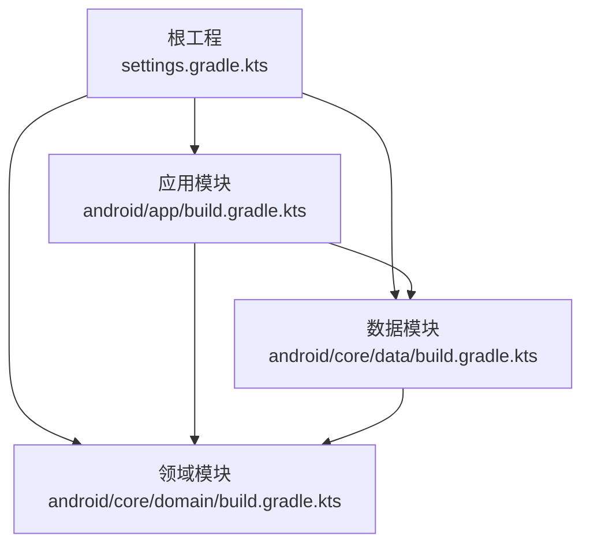
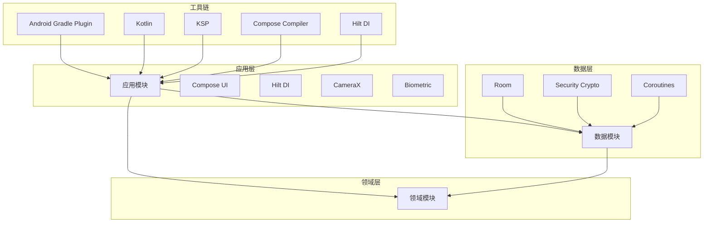
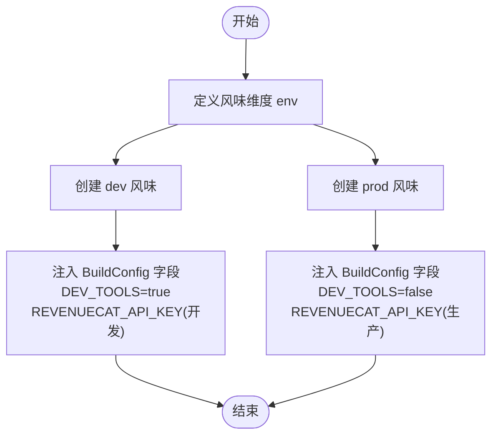
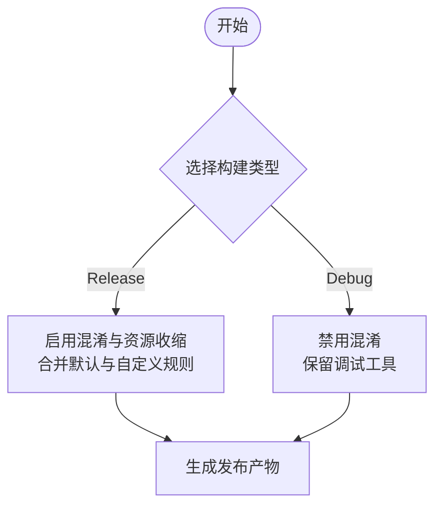
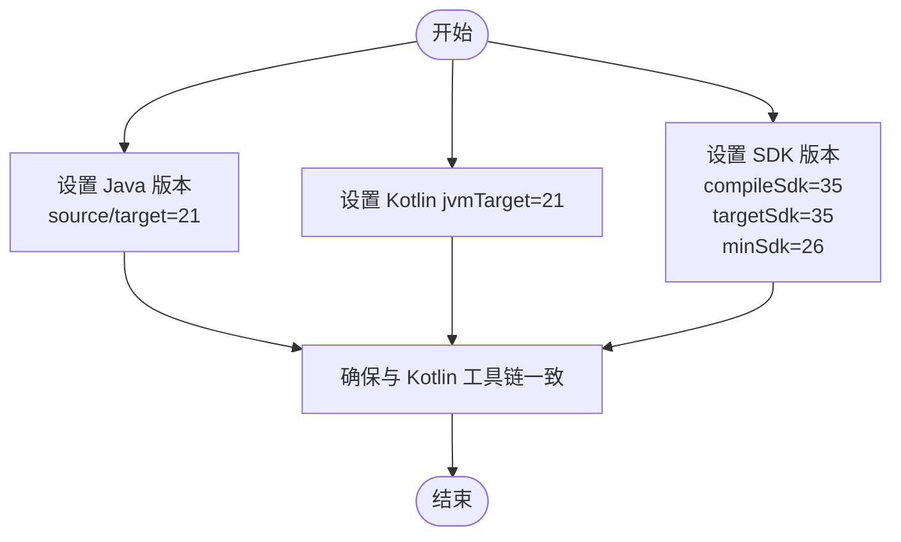
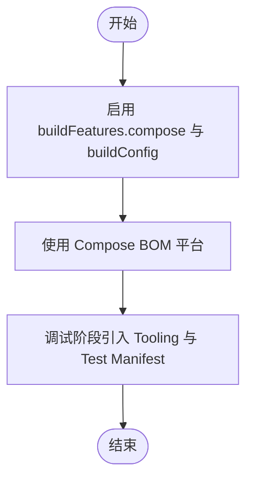
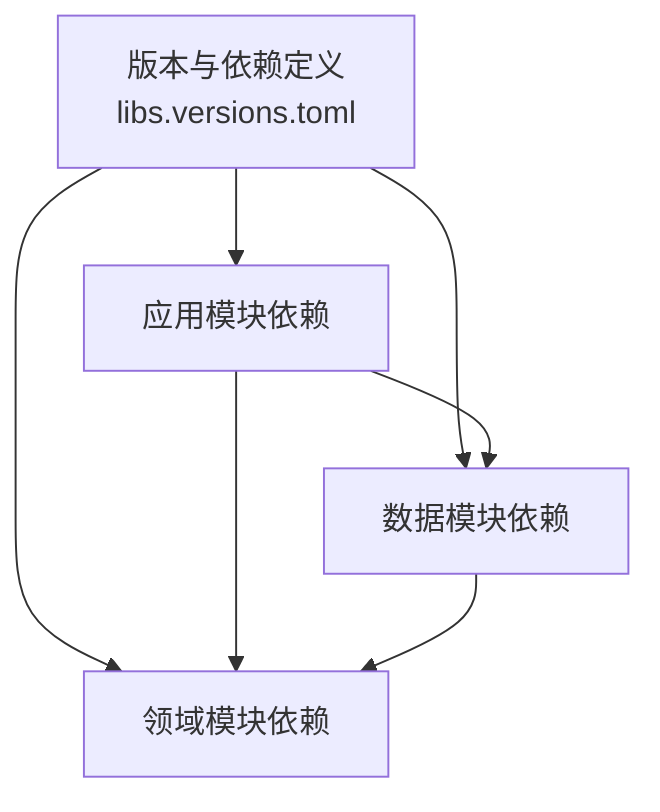
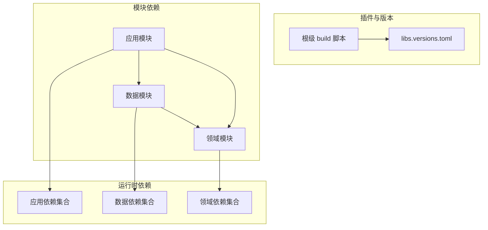

# 构建配置管理

<cite>
**本文档引用的文件**
- [android/build.gradle.kts](file://android/build.gradle.kts)
- [android/app/build.gradle.kts](file://android/app/build.gradle.kts)
- [android/settings.gradle.kts](file://android/settings.gradle.kts)
- [android/gradle/libs.versions.toml](file://android/gradle/libs.versions.toml)
- [android/gradle.properties](file://android/gradle.properties)
- [android/core/domain/build.gradle.kts](file://android/core/domain/build.gradle.kts)
- [android/core/data/build.gradle.kts](file://android/core/data/build.gradle.kts)
- [android/app/proguard-rules.pro](file://android/app/proguard-rules.pro)
</cite>

## 目录
1. [简介](#简介)
2. [项目结构](#项目结构)
3. [核心组件](#核心组件)
4. [架构总览](#架构总览)
5. [详细组件分析](#详细组件分析)
6. [依赖分析](#依赖分析)
7. [性能考虑](#性能考虑)
8. [故障排除指南](#故障排除指南)
9. [结论](#结论)

## 简介
本文件面向AI照片保险库项目的构建配置管理，系统性梳理Gradle构建脚本的配置结构与参数设置，重点阐述产品风味（productFlavors）与构建类型（buildTypes）的配置方法及差异，说明编译选项、Java版本兼容性以及Compose UI配置，并提供依赖管理最佳实践与版本统一策略，最后给出构建性能优化建议与常见配置问题的解决方案。

## 项目结构
本项目采用多模块结构，根工程通过settings脚本声明模块包含关系，应用模块位于android/app，数据与领域模块分别位于android/core/data与android/core/domain。版本与插件统一在libs.versions.toml中集中管理，构建脚本遵循“插件集中声明、版本统一管理”的原则。

图表来源
- [android/settings.gradle.kts:17-21](file://android/settings.gradle.kts#L17-L21)
- [android/app/build.gradle.kts:63-66](file://android/app/build.gradle.kts#L63-L66)
- [android/core/data/build.gradle.kts:32](file://android/core/data/build.gradle.kts#L32)

章节来源
- [android/settings.gradle.kts:1-21](file://android/settings.gradle.kts#L1-L21)
- [android/app/build.gradle.kts:1-91](file://android/app/build.gradle.kts#L1-L91)
- [android/core/domain/build.gradle.kts:1-13](file://android/core/domain/build.gradle.kts#L1-L13)
- [android/core/data/build.gradle.kts:1-48](file://android/core/data/build.gradle.kts#L1-L48)

## 核心组件
- 插件与版本管理：根级build脚本使用版本目录中的别名插件，避免重复声明；libs.versions.toml集中定义AGP、Kotlin、KSP、Compose、Hilt等版本与依赖坐标。
- 应用模块配置：定义命名空间、SDK版本、默认配置、产品风味、构建类型、编译选项、Compose与BuildConfig启用、依赖声明。
- 数据模块配置：定义Room、KSP、Hilt、协程、测试框架等依赖，统一JVM目标版本。
- 领域模块配置：纯Kotlin JVM模块，仅含单元测试依赖。
- 全局属性：gradle.properties统一JVM内存、AndroidX开关、代码风格与R类行为。

章节来源
- [android/build.gradle.kts:1-10](file://android/build.gradle.kts#L1-L10)
- [android/gradle/libs.versions.toml:1-64](file://android/gradle/libs.versions.toml#L1-L64)
- [android/app/build.gradle.kts:9-61](file://android/app/build.gradle.kts#L9-L61)
- [android/core/data/build.gradle.kts:8-29](file://android/core/data/build.gradle.kts#L8-L29)
- [android/core/domain/build.gradle.kts:5-7](file://android/core/domain/build.gradle.kts#L5-L7)
- [android/gradle.properties:1-5](file://android/gradle.properties#L1-L5)

## 架构总览
构建配置围绕“版本统一 + 模块解耦 + 工具链一致”展开，应用层负责运行时特性（Compose、Hilt、Camera、Biometric），数据层负责持久化与加密，领域层提供业务模型与接口。

图表来源
- [android/app/build.gradle.kts:63-90](file://android/app/build.gradle.kts#L63-L90)
- [android/core/data/build.gradle.kts:31-47](file://android/core/data/build.gradle.kts#L31-L47)
- [android/core/domain/build.gradle.kts:9-12](file://android/core/domain/build.gradle.kts#L9-L12)

## 详细组件分析

### 产品风味（Product Flavors）配置
- 维度定义：通过flavorDimensions声明env维度，确保风味组合唯一。
- 开发风味（dev）：启用开发者工具标志位，注入RevenueCat API密钥占位符，便于调试与功能验证。
- 生产风味（prod）：关闭开发者工具标志位，注入生产API密钥占位符，用于发布构建。
- BuildConfig字段：通过buildConfigField注入布尔值与字符串常量，可在源码中条件编译或运行时判断。

图表来源
- [android/app/build.gradle.kts:22-34](file://android/app/build.gradle.kts#L22-L34)

章节来源
- [android/app/build.gradle.kts:22-34](file://android/app/build.gradle.kts#L22-L34)

### 构建类型（Build Types）配置
- Release：开启代码混淆与资源收缩，合并默认优化规则与自定义混淆规则文件，提升包体与安全性。
- Debug：不进行混淆，便于调试与快速迭代。
- ProGuard/R8：通过自定义规则文件保留Hilt、Room、反射相关类，减少符号化与混淆风险。

图表来源
- [android/app/build.gradle.kts:36-48](file://android/app/build.gradle.kts#L36-L48)
- [android/app/proguard-rules.pro:1-10](file://android/app/proguard-rules.pro#L1-L10)

章节来源
- [android/app/build.gradle.kts:36-48](file://android/app/build.gradle.kts#L36-L48)
- [android/app/proguard-rules.pro:1-10](file://android/app/proguard-rules.pro#L1-L10)

### 编译选项与Java/Kotlin版本兼容性
- Java版本：统一设置sourceCompatibility与targetCompatibility为21，Kotlin jvmTarget也为21，保证JVM字节码与编译目标一致。
- Kotlin JVM工具链：领域模块显式声明jvmToolchain(21)，确保纯JVM模块与应用模块保持一致。
- Android SDK：compileSdk为35，targetSdk为35，minSdk为26，满足现代Android生态要求。

图表来源
- [android/app/build.gradle.kts:50-56](file://android/app/build.gradle.kts#L50-L56)
- [android/core/data/build.gradle.kts:18-24](file://android/core/data/build.gradle.kts#L18-L24)
- [android/core/domain/build.gradle.kts:6](file://android/core/domain/build.gradle.kts#L6)

章节来源
- [android/app/build.gradle.kts:50-56](file://android/app/build.gradle.kts#L50-L56)
- [android/core/data/build.gradle.kts:18-24](file://android/core/data/build.gradle.kts#L18-L24)
- [android/core/domain/build.gradle.kts:6](file://android/core/domain/build.gradle.kts#L6)

### Compose UI配置
- 启用Compose：buildFeatures.compose=true，buildFeatures.buildConfig=true，确保Compose编译器与BuildConfig可用。
- Compose BOM：通过platform引入Compose BOM，统一Material3、UI、Activity Compose等版本，避免版本冲突。
- 调试工具：debugImplementation引入Compose Tooling与测试清单，便于UI调试与预览。

图表来源
- [android/app/build.gradle.kts:57-60](file://android/app/build.gradle.kts#L57-L60)
- [android/app/build.gradle.kts:72](file://android/app/build.gradle.kts#L72)
- [android/app/build.gradle.kts:88-89](file://android/app/build.gradle.kts#L88-L89)

章节来源
- [android/app/build.gradle.kts:57-60](file://android/app/build.gradle.kts#L57-L60)
- [android/app/build.gradle.kts:72](file://android/app/build.gradle.kts#L72)
- [android/app/build.gradle.kts:88-89](file://android/app/build.gradle.kts#L88-L89)

### 依赖管理最佳实践与版本统一策略
- 版本集中管理：libs.versions.toml集中定义各子系统的版本号与依赖坐标，避免分散配置导致的版本漂移。
- 插件版本统一：根级build脚本通过alias(libs.plugins.xxx)统一引用插件版本，减少手动升级成本。
- 平台化依赖：Compose通过BOM平台统一版本，Room、Hilt、KSP等均在版本表中统一管理。
- 模块间依赖：应用模块依赖数据与领域模块；数据模块依赖领域模块，形成清晰的单向依赖链。

图表来源
- [android/gradle/libs.versions.toml:1-64](file://android/gradle/libs.versions.toml#L1-L64)
- [android/app/build.gradle.kts:63-66](file://android/app/build.gradle.kts#L63-L66)
- [android/core/data/build.gradle.kts:32](file://android/core/data/build.gradle.kts#L32)

章节来源
- [android/gradle/libs.versions.toml:1-64](file://android/gradle/libs.versions.toml#L1-L64)
- [android/app/build.gradle.kts:63-66](file://android/app/build.gradle.kts#L63-L66)
- [android/core/data/build.gradle.kts:32](file://android/core/data/build.gradle.kts#L32)

## 依赖分析
- 插件与版本：根级build脚本统一声明插件别名，libs.versions.toml集中管理版本与依赖，确保一致性。
- 模块依赖：应用模块依赖数据与领域模块；数据模块依赖领域模块，形成清晰的单向依赖链。
- 运行时依赖：应用模块引入Compose UI、Lifecycle、Navigation、Room、Hilt、CameraX、Biometric等；数据模块引入Room、KSP、Hilt、协程与安全加密库；领域模块仅含测试依赖。

图表来源
- [android/build.gradle.kts:1-10](file://android/build.gradle.kts#L1-L10)
- [android/gradle/libs.versions.toml:56-64](file://android/gradle/libs.versions.toml#L56-L64)
- [android/app/build.gradle.kts:63-90](file://android/app/build.gradle.kts#L63-L90)
- [android/core/data/build.gradle.kts:31-47](file://android/core/data/build.gradle.kts#L31-L47)
- [android/core/domain/build.gradle.kts:9-12](file://android/core/domain/build.gradle.kts#L9-L12)

章节来源
- [android/build.gradle.kts:1-10](file://android/build.gradle.kts#L1-L10)
- [android/gradle/libs.versions.toml:56-64](file://android/gradle/libs.versions.toml#L56-L64)
- [android/app/build.gradle.kts:63-90](file://android/app/build.gradle.kts#L63-L90)
- [android/core/data/build.gradle.kts:31-47](file://android/core/data/build.gradle.kts#L31-L47)
- [android/core/domain/build.gradle.kts:9-12](file://android/core/domain/build.gradle.kts#L9-L12)

## 性能考虑
- 构建缓存与并行：合理设置org.gradle.jvmargs，确保Gradle有足够的堆内存；启用并行构建与增量编译。
- 依赖解析：使用BOM统一Compose版本，减少传递依赖冲突带来的解析开销。
- ProGuard/R8：在Release构建中启用混淆与资源收缩，减小包体并提升运行时性能。
- KSP与Kotlin编译：保持KSP与Kotlin版本一致，避免编译器与注解处理器版本不匹配导致的额外编译时间。
- 模块化：通过模块拆分降低单模块编译压力，利用Gradle的增量编译与任务图优化。

## 故障排除指南
- 版本不匹配：若出现KSP或Kotlin编译错误，检查libs.versions.toml中的KSP与Kotlin版本是否一致，确保应用模块与数据模块的JVM目标一致。
- Compose预览失败：确认buildFeatures.compose与buildFeatures.buildConfig已启用，且Compose BOM正确引入。
- ProGuard/R8规则不足：当运行时出现反射或Hilt注入异常，检查proguard-rules.pro中是否缺少必要的保留规则。
- 依赖冲突：若出现运行时崩溃或编译期报错，优先检查libs.versions.toml中版本是否统一，尤其是Compose、Room、Hilt等平台化依赖。
- 构建缓慢：调整gradle.properties中的JVM参数，适当增加-Xmx；确保未启用不必要的调试工具链；在CI中启用Gradle构建缓存。

章节来源
- [android/gradle/libs.versions.toml:1-64](file://android/gradle/libs.versions.toml#L1-L64)
- [android/app/build.gradle.kts:57-60](file://android/app/build.gradle.kts#L57-L60)
- [android/app/proguard-rules.pro:1-10](file://android/app/proguard-rules.pro#L1-L10)
- [android/gradle.properties:1](file://android/gradle.properties#L1)

## 结论
本项目的构建配置通过版本与插件集中管理、模块化依赖与统一编译目标，实现了可维护、可扩展与高性能的构建体系。产品风味与构建类型提供了灵活的环境区分与发布策略；Compose与Hilt等现代化工具链的集成提升了开发效率与运行时表现。建议持续关注版本更新与工具链兼容性，结合CI/CD实践进一步优化构建性能与稳定性。