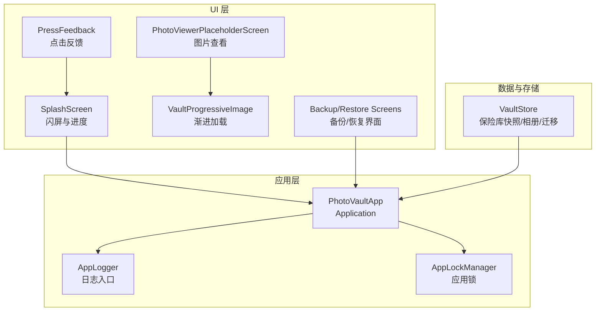
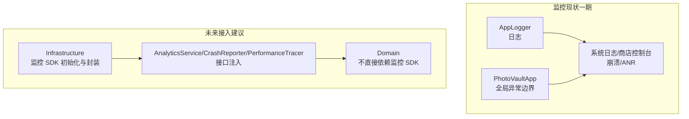
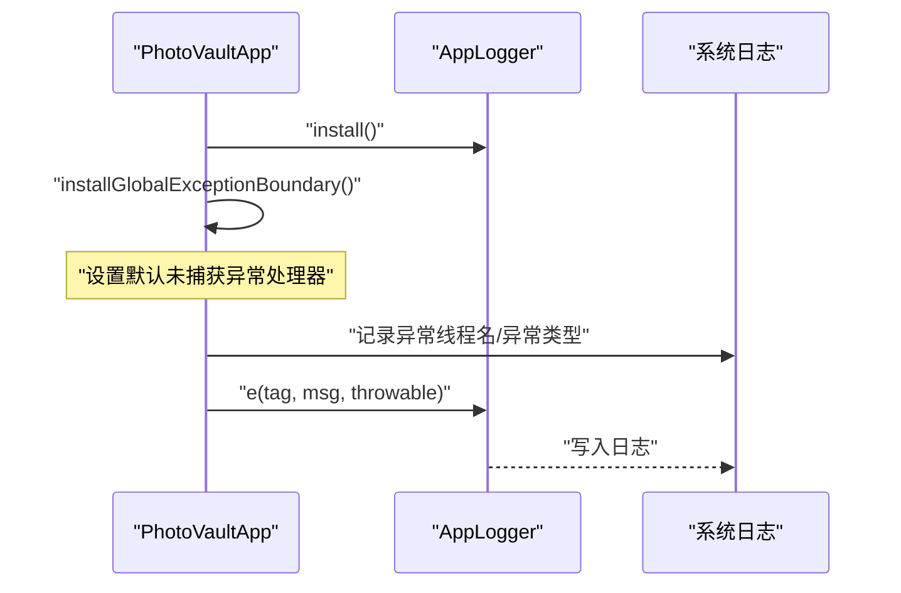
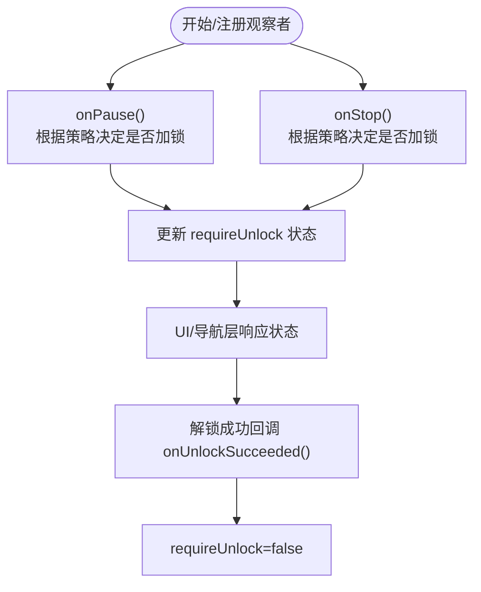
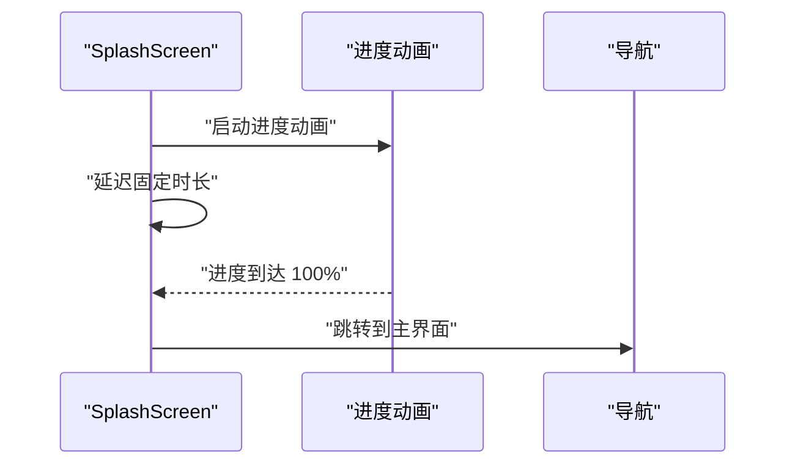
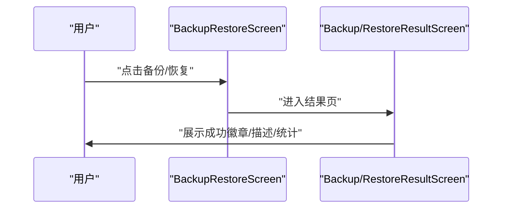
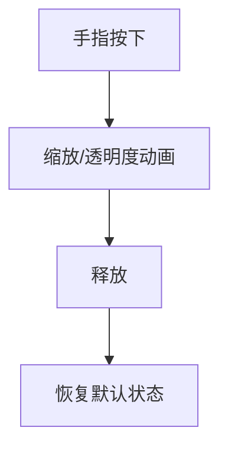
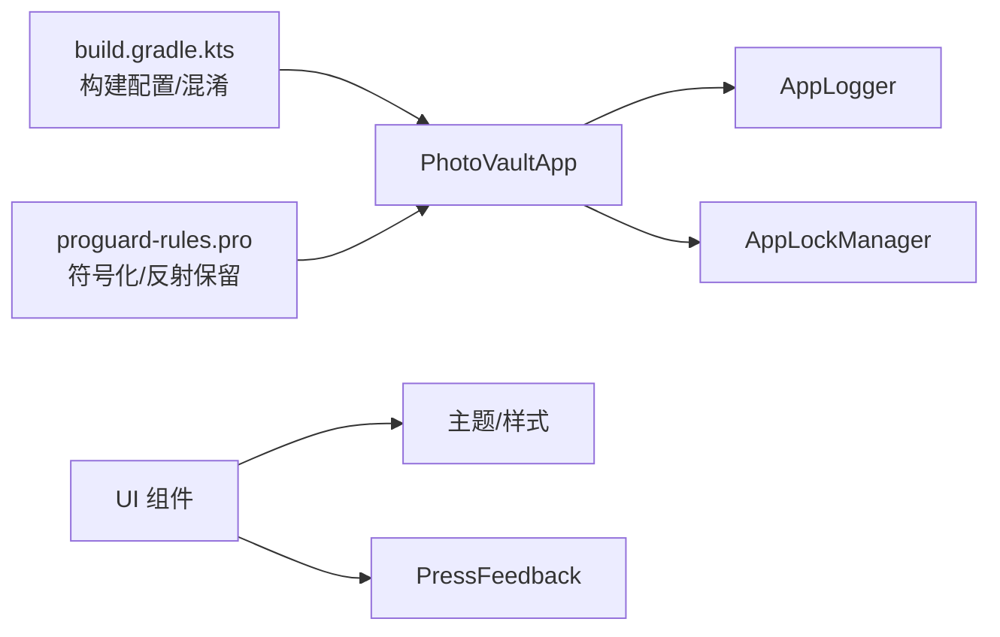

# 监控与回滚

<cite>
**本文引用的文件**
- [android/app/src/main/kotlin/com/photovault/app/AppLogger.kt](file://android/app/src/main/kotlin/com/photovault/app/AppLogger.kt)
- [android/app/src/main/kotlin/com/photovault/app/PhotoVaultApp.kt](file://android/app/src/main/kotlin/com/photovault/app/PhotoVaultApp.kt)
- [android/app/src/main/kotlin/com/photovault/app/AppLockManager.kt](file://android/app/src/main/kotlin/com/photovault/app/AppLockManager.kt)
- [android/app/src/main/kotlin/com/photovault/app/ui/SplashScreen.kt](file://android/app/src/main/kotlin/com/photovault/app/ui/SplashScreen.kt)
- [android/app/src/main/kotlin/com/photovault/app/ui/feedback/PressFeedback.kt](file://android/app/src/main/kotlin/com/photovault/app/ui/feedback/PressFeedback.kt)
- [android/app/src/main/kotlin/com/photovault/app/ui/vault/VaultStore.kt](file://android/app/src/main/kotlin/com/photovault/app/ui/vault/VaultStore.kt)
- [android/app/src/main/kotlin/com/photovault/app/ui/BackupRestoreScreen.kt](file://android/app/src/main/kotlin/com/photovault/app/ui/BackupRestoreScreen.kt)
- [android/app/src/main/kotlin/com/photovault/app/ui/BackupResultScreen.kt](file://android/app/src/main/kotlin/com/photovault/app/ui/BackupResultScreen.kt)
- [android/app/src/main/kotlin/com/photovault/app/ui/RestoreResultScreen.kt](file://android/app/src/main/kotlin/com/photovault/app/ui/RestoreResultScreen.kt)
- [android/app/src/main/kotlin/com/photovault/app/ui/PhotoViewerPlaceholderScreen.kt](file://android/app/src/main/kotlin/com/photovault/app/ui/PhotoViewerPlaceholderScreen.kt)
- [android/app/src/main/kotlin/com/photovault/app/ui/components/VaultProgressiveImage.kt](file://android/app/src/main/kotlin/com/photovault/app/ui/components/VaultProgressiveImage.kt)
- [android/app/build.gradle.kts](file://android/app/build.gradle.kts)
- [android/app/proguard-rules.pro](file://android/app/proguard-rules.pro)
- [doc/android/11-Firebase监控.md](file://doc/android/11-Firebase监控.md)
- [doc/ios/11-Firebase监控.md](file://doc/ios/11-Firebase监控.md)
- [doc/私密相册 App（一期）原生双端架构设计方案.md](file://doc/私密相册 App（一期）原生双端架构设计方案.md)
- [doc/成熟三方库推荐（Android-iOS）.md](file://doc/成熟三方库推荐（Android-iOS）.md)
</cite>

## 目录
1. [简介](#简介)
2. [项目结构](#项目结构)
3. [核心组件](#核心组件)
4. [架构概览](#架构概览)
5. [详细组件分析](#详细组件分析)
6. [依赖分析](#依赖分析)
7. [性能考虑](#性能考虑)
8. [故障排查指南](#故障排查指南)
9. [结论](#结论)
10. [附录](#附录)

## 简介
本文件面向“AI照片保险库”项目，围绕应用监控与回滚策略进行系统化设计与落地说明。当前项目处于一期阶段，明确不接入 Firebase 等第三方监控 SDK，转而采用系统日志与商店控制台作为主要观测手段，并为未来接入监控工具预留分层与接口边界。同时，文档给出发布后质量验证流程、异常检测机制、自动化健康检查与告警配置思路、快速回滚策略与版本降级流程，以及用户反馈收集与问题定位方法，帮助团队建立可持续的可观测性与韧性工程能力。

## 项目结构
- 应用层位于 android/app，包含 Application 启动、全局异常边界、日志入口、UI 层与业务功能入口。
- 架构总览与监控策略在 doc/私密相册 App（一期）原生双端架构设计方案.md 中给出，明确“分层架构”“领域层独立”“平台与基础设施层可选监控封装”等原则。
- 监控专项文档在 doc/android/11-Firebase监控.md 与 doc/ios/11-Firebase监控.md，当前状态为“一期暂不实施”，并给出后续接入的分层落位与接口注入建议。
- 成熟三方库推荐在 doc/成熟三方库推荐（Android-iOS）.md，其中“可观测性”条目给出 Android/Timber、iOS/OSLog 的替代方案。

**图表来源**
- [android/app/src/main/kotlin/com/photovault/app/PhotoVaultApp.kt:1-31](file://android/app/src/main/kotlin/com/photovault/app/PhotoVaultApp.kt#L1-L31)
- [android/app/src/main/kotlin/com/photovault/app/AppLogger.kt:1-43](file://android/app/src/main/kotlin/com/photovault/app/AppLogger.kt#L1-L43)
- [android/app/src/main/kotlin/com/photovault/app/AppLockManager.kt:1-49](file://android/app/src/main/kotlin/com/photovault/app/AppLockManager.kt#L1-L49)
- [android/app/src/main/kotlin/com/photovault/app/ui/SplashScreen.kt:43-177](file://android/app/src/main/kotlin/com/photovault/app/ui/SplashScreen.kt#L43-L177)
- [android/app/src/main/kotlin/com/photovault/app/ui/feedback/PressFeedback.kt:1-38](file://android/app/src/main/kotlin/com/photovault/app/ui/feedback/PressFeedback.kt#L1-L38)
- [android/app/src/main/kotlin/com/photovault/app/ui/PhotoViewerPlaceholderScreen.kt:30-74](file://android/app/src/main/kotlin/com/photovault/app/ui/PhotoViewerPlaceholderScreen.kt#L30-L74)
- [android/app/src/main/kotlin/com/photovault/app/ui/components/VaultProgressiveImage.kt:1-34](file://android/app/src/main/kotlin/com/photovault/app/ui/components/VaultProgressiveImage.kt#L1-L34)
- [android/app/src/main/kotlin/com/photovault/app/ui/vault/VaultStore.kt:47-224](file://android/app/src/main/kotlin/com/photovault/app/ui/vault/VaultStore.kt#L47-L224)

**章节来源**
- [doc/私密相册 App（一期）原生双端架构设计方案.md:137-147](file://doc/私密相册 App（一期）原生双端架构设计方案.md#L137-L147)
- [doc/android/11-Firebase监控.md:1-28](file://doc/android/11-Firebase监控.md#L1-L28)
- [doc/ios/11-Firebase监控.md:1-27](file://doc/ios/11-Firebase监控.md#L1-L27)
- [doc/成熟三方库推荐（Android-iOS）.md:109-115](file://doc/成熟三方库推荐（Android-iOS）.md#L109-L115)

## 核心组件
- 全局日志入口与异常边界
  - AppLogger：统一日志入口，限制消息长度，避免输出敏感信息；Debug 环境下输出。
  - PhotoVaultApp：安装全局未捕获异常边界，将异常交由 AppLogger 记录。
- 应用锁与生命周期
  - AppLockManager：基于进程生命周期的状态机，控制是否需要解锁，避免频繁加锁带来的交互负担。
- UI 与性能相关组件
  - SplashScreen：包含闪屏时长与进度动画，体现启动体验。
  - PressFeedback：点击反馈动画，改善交互感知。
  - VaultProgressiveImage：渐进式图片加载，降低首帧阻塞感。
  - PhotoViewerPlaceholderScreen：图片浏览与滑动切换，结合 VaultStore 近期照片列表。
- 备份/恢复 UI 与流程
  - BackupRestoreScreen、BackupResultScreen、RestoreResultScreen：覆盖备份/恢复全流程的用户可见界面。
- 构建与混淆
  - build.gradle.kts：版本号、构建类型、混淆规则启用与字段注入。
  - proguard-rules.pro：保留 R8 符号化所需映射与 Hilt/Room/反射相关 keep 规则。

**章节来源**
- [android/app/src/main/kotlin/com/photovault/app/AppLogger.kt:1-43](file://android/app/src/main/kotlin/com/photovault/app/AppLogger.kt#L1-L43)
- [android/app/src/main/kotlin/com/photovault/app/PhotoVaultApp.kt:1-31](file://android/app/src/main/kotlin/com/photovault/app/PhotoVaultApp.kt#L1-L31)
- [android/app/src/main/kotlin/com/photovault/app/AppLockManager.kt:1-49](file://android/app/src/main/kotlin/com/photovault/app/AppLockManager.kt#L1-L49)
- [android/app/src/main/kotlin/com/photovault/app/ui/SplashScreen.kt:43-177](file://android/app/src/main/kotlin/com/photovault/app/ui/SplashScreen.kt#L43-L177)
- [android/app/src/main/kotlin/com/photovault/app/ui/feedback/PressFeedback.kt:1-38](file://android/app/src/main/kotlin/com/photovault/app/ui/feedback/PressFeedback.kt#L1-L38)
- [android/app/src/main/kotlin/com/photovault/app/ui/components/VaultProgressiveImage.kt:1-34](file://android/app/src/main/kotlin/com/photovault/app/ui/components/VaultProgressiveImage.kt#L1-L34)
- [android/app/src/main/kotlin/com/photovault/app/ui/PhotoViewerPlaceholderScreen.kt:30-74](file://android/app/src/main/kotlin/com/photovault/app/ui/PhotoViewerPlaceholderScreen.kt#L30-L74)
- [android/app/src/main/kotlin/com/photovault/app/ui/BackupRestoreScreen.kt:85-127](file://android/app/src/main/kotlin/com/photovault/app/ui/BackupRestoreScreen.kt#L85-L127)
- [android/app/src/main/kotlin/com/photovault/app/ui/BackupResultScreen.kt:32-64](file://android/app/src/main/kotlin/com/photovault/app/ui/BackupResultScreen.kt#L32-L64)
- [android/app/src/main/kotlin/com/photovault/app/ui/RestoreResultScreen.kt:32-106](file://android/app/src/main/kotlin/com/photovault/app/ui/RestoreResultScreen.kt#L32-L106)
- [android/app/build.gradle.kts:1-91](file://android/app/build.gradle.kts#L1-L91)
- [android/app/proguard-rules.pro:1-10](file://android/app/proguard-rules.pro#L1-L10)

## 架构概览
- 当前监控策略为“系统日志 + 商店控制台 + 轻量本地日志（若需要）”。应用启动阶段安装日志与异常边界，UI 层通过渐进式加载与反馈动画提升用户体验。
- 若后续接入监控工具，建议遵循“基础设施层封装 + 接口注入 + Domain 不直接依赖”的原则，确保监控能力可插拔、可开关、可降级。

**图表来源**
- [android/app/src/main/kotlin/com/photovault/app/AppLogger.kt:1-43](file://android/app/src/main/kotlin/com/photovault/app/AppLogger.kt#L1-L43)
- [android/app/src/main/kotlin/com/photovault/app/PhotoVaultApp.kt:19-29](file://android/app/src/main/kotlin/com/photovault/app/PhotoVaultApp.kt#L19-L29)
- [doc/android/11-Firebase监控.md:10-27](file://doc/android/11-Firebase监控.md#L10-L27)
- [doc/私密相册 App（一期）原生双端架构设计方案.md:137-147](file://doc/私密相册 App（一期）原生双端架构设计方案.md#L137-L147)

## 详细组件分析

### 日志与异常边界
- 设计要点
  - 统一日志入口，限制消息长度，避免敏感信息泄露。
  - 全局未捕获异常边界，记录线程名与异常类型，交由日志系统留存。
- 关键流程

**图表来源**
- [android/app/src/main/kotlin/com/photovault/app/PhotoVaultApp.kt:19-29](file://android/app/src/main/kotlin/com/photovault/app/PhotoVaultApp.kt#L19-L29)
- [android/app/src/main/kotlin/com/photovault/app/AppLogger.kt:16-29](file://android/app/src/main/kotlin/com/photovault/app/AppLogger.kt#L16-L29)

**章节来源**
- [android/app/src/main/kotlin/com/photovault/app/PhotoVaultApp.kt:1-31](file://android/app/src/main/kotlin/com/photovault/app/PhotoVaultApp.kt#L1-L31)
- [android/app/src/main/kotlin/com/photovault/app/AppLogger.kt:1-43](file://android/app/src/main/kotlin/com/photovault/app/AppLogger.kt#L1-L43)

### 应用锁与后台策略
- 设计要点
  - 基于进程生命周期观察者，仅在应用不可见时触发加锁，避免页面切换导致的误加锁。
  - 通过状态流对外暴露“是否需要解锁”，便于 UI 与导航层协同。
- 关键流程

**图表来源**
- [android/app/src/main/kotlin/com/photovault/app/AppLockManager.kt:18-47](file://android/app/src/main/kotlin/com/photovault/app/AppLockManager.kt#L18-L47)

**章节来源**
- [android/app/src/main/kotlin/com/photovault/app/AppLockManager.kt:1-49](file://android/app/src/main/kotlin/com/photovault/app/AppLockManager.kt#L1-L49)

### 启动与首帧体验
- 设计要点
  - 闪屏包含进度条与版本信息，保障用户感知。
  - 渐进式图片加载减少首帧阻塞，提升感知速度。
- 关键流程

**图表来源**
- [android/app/src/main/kotlin/com/photovault/app/ui/SplashScreen.kt:43-177](file://android/app/src/main/kotlin/com/photovault/app/ui/SplashScreen.kt#L43-L177)
- [android/app/src/main/kotlin/com/photovault/app/ui/components/VaultProgressiveImage.kt:24-34](file://android/app/src/main/kotlin/com/photovault/app/ui/components/VaultProgressiveImage.kt#L24-L34)

**章节来源**
- [android/app/src/main/kotlin/com/photovault/app/ui/SplashScreen.kt:43-177](file://android/app/src/main/kotlin/com/photovault/app/ui/SplashScreen.kt#L43-L177)
- [android/app/src/main/kotlin/com/photovault/app/ui/components/VaultProgressiveImage.kt:1-34](file://android/app/src/main/kotlin/com/photovault/app/ui/components/VaultProgressiveImage.kt#L1-L34)

### 备份/恢复流程与结果展示
- 设计要点
  - 备份/恢复卡片与结果页提供清晰的步骤提示与统计信息。
  - 结果页包含成功徽章、描述与统计行，便于用户确认。
- 关键流程

**图表来源**
- [android/app/src/main/kotlin/com/photovault/app/ui/BackupRestoreScreen.kt:85-127](file://android/app/src/main/kotlin/com/photovault/app/ui/BackupRestoreScreen.kt#L85-L127)
- [android/app/src/main/kotlin/com/photovault/app/ui/BackupResultScreen.kt:32-64](file://android/app/src/main/kotlin/com/photovault/app/ui/BackupResultScreen.kt#L32-L64)
- [android/app/src/main/kotlin/com/photovault/app/ui/RestoreResultScreen.kt:32-106](file://android/app/src/main/kotlin/com/photovault/app/ui/RestoreResultScreen.kt#L32-L106)

**章节来源**
- [android/app/src/main/kotlin/com/photovault/app/ui/BackupRestoreScreen.kt:85-127](file://android/app/src/main/kotlin/com/photovault/app/ui/BackupRestoreScreen.kt#L85-L127)
- [android/app/src/main/kotlin/com/photovault/app/ui/BackupResultScreen.kt:32-64](file://android/app/src/main/kotlin/com/photovault/app/ui/BackupResultScreen.kt#L32-L64)
- [android/app/src/main/kotlin/com/photovault/app/ui/RestoreResultScreen.kt:32-106](file://android/app/src/main/kotlin/com/photovault/app/ui/RestoreResultScreen.kt#L32-L106)

### 用户反馈与交互感知
- 设计要点
  - 点击反馈通过缩放与透明度动画增强触觉反馈。
  - 图片查看器支持滑动切换与最近照片列表，提升浏览效率。
- 关键流程

**图表来源**
- [android/app/src/main/kotlin/com/photovault/app/ui/feedback/PressFeedback.kt:22-36](file://android/app/src/main/kotlin/com/photovault/app/ui/feedback/PressFeedback.kt#L22-L36)
- [android/app/src/main/kotlin/com/photovault/app/ui/PhotoViewerPlaceholderScreen.kt:58-74](file://android/app/src/main/kotlin/com/photovault/app/ui/PhotoViewerPlaceholderScreen.kt#L58-L74)

**章节来源**
- [android/app/src/main/kotlin/com/photovault/app/ui/feedback/PressFeedback.kt:1-38](file://android/app/src/main/kotlin/com/photovault/app/ui/feedback/PressFeedback.kt#L1-L38)
- [android/app/src/main/kotlin/com/photovault/app/ui/PhotoViewerPlaceholderScreen.kt:30-74](file://android/app/src/main/kotlin/com/photovault/app/ui/PhotoViewerPlaceholderScreen.kt#L30-L74)

## 依赖分析
- 构建与混淆
  - 启用 release 混淆与资源收缩，保留 R8 符号化映射与 Hilt/Room/反射相关 keep 规则，确保崩溃符号化与运行时反射需求。
- 依赖耦合
  - 应用层通过依赖注入装配 AppLockManager；日志入口在 Application 初始化时安装；UI 组件依赖主题与交互反馈模块。

**图表来源**
- [android/app/build.gradle.kts:36-48](file://android/app/build.gradle.kts#L36-L48)
- [android/app/proguard-rules.pro:1-10](file://android/app/proguard-rules.pro#L1-L10)
- [android/app/src/main/kotlin/com/photovault/app/PhotoVaultApp.kt:1-31](file://android/app/src/main/kotlin/com/photovault/app/PhotoVaultApp.kt#L1-L31)

**章节来源**
- [android/app/build.gradle.kts:1-91](file://android/app/build.gradle.kts#L1-L91)
- [android/app/proguard-rules.pro:1-10](file://android/app/proguard-rules.pro#L1-L10)

## 性能考虑
- 启动时间与内存使用
  - 闪屏与进度动画有助于感知启动过程；渐进式图片加载降低首帧阻塞。
  - 后台执行器与协程调度避免主线程阻塞，结合 UI 层反馈动画提升交互感知。
- 混淆与符号化
  - 启用 release 混淆与资源收缩，保留 R8 符号化映射，便于商店控制台与日志系统还原堆栈。
- 代码级优化建议
  - 图片解码按目标尺寸处理，避免大图内存峰值。
  - 大批量导入/备份采用分批提交与流式读写，降低内存占用。
  - 本地 AI 推理尽量复用缓冲区，控制并发与委托选择（如 NNAPI/GPU）。

[本节为通用指导，无需特定文件引用]

## 故障排查指南
- 崩溃与 ANR
  - 依赖 Google Play 控制台提供的崩溃/ANR 报告；若不可用，可在 Debug 环境下通过 Logcat 与 Android Studio Profiler 进行定位。
- 日志与异常
  - 使用 AppLogger 记录异常与关键路径；全局异常边界确保未捕获异常被记录。
- 本地诊断
  - 必要时可自建轻量日志文件（注意不落敏感数据），并与商店报告联动分析。
- 回归与验证
  - 严格真机回归，覆盖关键路径（启动、备份/恢复、图片浏览、解锁）。

**章节来源**
- [doc/android/11-Firebase监控.md:10-13](file://doc/android/11-Firebase监控.md#L10-L13)
- [android/app/src/main/kotlin/com/photovault/app/AppLogger.kt:1-43](file://android/app/src/main/kotlin/com/photovault/app/AppLogger.kt#L1-L43)
- [android/app/src/main/kotlin/com/photovault/app/PhotoVaultApp.kt:19-29](file://android/app/src/main/kotlin/com/photovault/app/PhotoVaultApp.kt#L19-L29)

## 结论
- 一期阶段以系统日志与商店控制台为核心观测手段，应用层提供统一日志入口与全局异常边界，UI 层通过渐进式加载与交互反馈优化用户体验。
- 为未来接入监控工具预留了清晰的分层与接口边界，确保监控能力可插拔、可开关、可降级。
- 建议在发布后建立自动化健康检查与告警机制，完善回滚与降级流程，持续收集用户反馈并驱动改进。

[本节为总结，无需特定文件引用]

## 附录

### 发布后质量验证与异常检测
- 质量验证清单
  - 启动时间与内存使用：对比基线版本，关注首帧阻塞与峰值内存。
  - 崩溃与 ANR：核对商店控制台报告，建立阈值告警。
  - 备份/恢复：验证成功率、完整性与失败重试。
  - 图片浏览：验证渐进式加载与滑动切换流畅度。
- 异常检测机制
  - 基于日志与商店报告的异常聚合，设定阈值与窗口期告警。
  - 对高频异常建立自动降级（如禁用新功能、回退到稳定版本）。

[本节为通用指导，无需特定文件引用]

### 自动化健康检查与告警
- 健康检查
  - 启动链路：记录闪屏结束到主界面可交互的时间。
  - 关键功能：备份/恢复、图片加载、解锁流程。
- 告警配置
  - 崩溃率、ANR、启动超时、备份失败率等指标阈值告警。
  - 与商店控制台联动，自动抓取符号化堆栈并通知。

[本节为通用指导，无需特定文件引用]

### 快速回滚与版本降级
- 回滚策略
  - 保留上一个稳定版本的安装包与符号表；一旦异常检测触发，自动引导用户回滚。
  - 对于线上紧急问题，优先通过商店渠道下架/回滚，再推送修复版本。
- 版本降级流程
  - 通过商店控制台或内网发布通道回滚到上一个稳定版本。
  - 回滚后持续监控关键指标，确认问题修复后再推进新版本发布。

[本节为通用指导，无需特定文件引用]

### 用户反馈收集与问题定位
- 反馈入口
  - 在关键流程（备份/恢复、异常弹窗）提供“反馈”按钮，收集用户描述与上下文。
- 问题定位
  - 结合日志、商店报告与用户反馈，建立问题分类与优先级。
  - 对高频问题建立知识库与 FAQ，减少重复反馈。

[本节为通用指导，无需特定文件引用]

### 监控数据的分析与持续改进
- 指标体系
  - 崩溃率、ANR、启动时间、内存峰值、备份成功率、图片加载时延。
- 改进流程
  - 周报/双周报汇总异常趋势，形成改进计划；对高影响问题进行根因分析与修复闭环。

[本节为通用指导，无需特定文件引用]