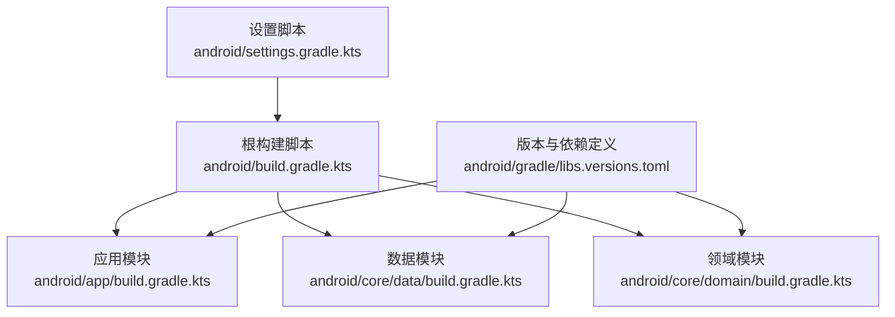
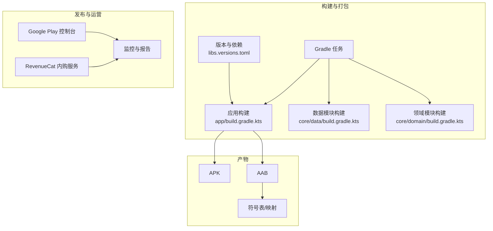
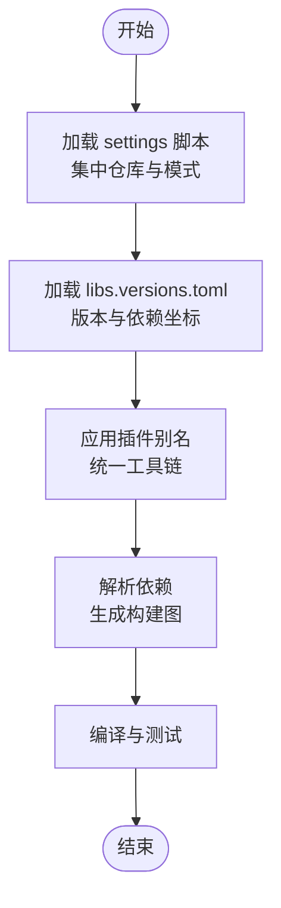
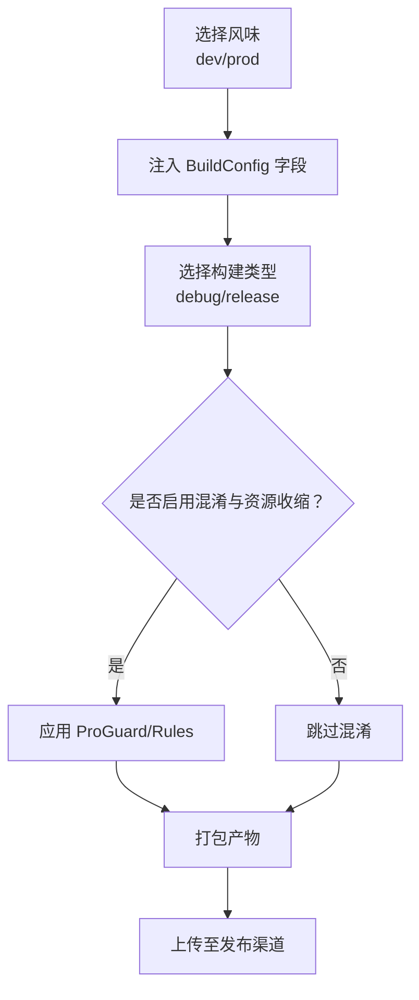
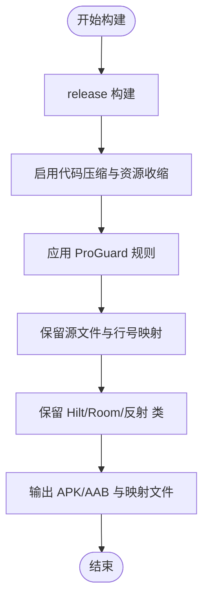
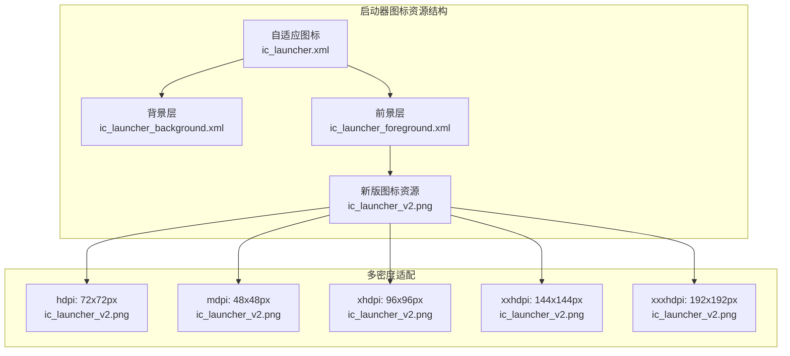
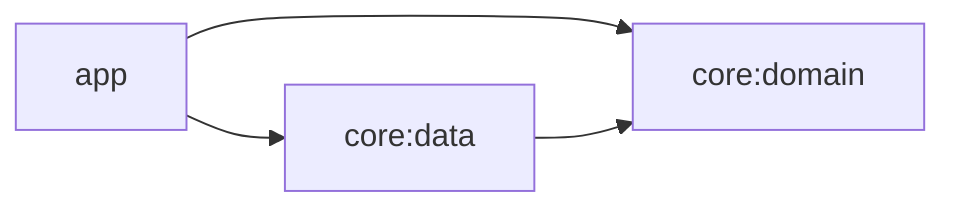

# 部署发布

<cite>
**本文引用的文件**
- [android/build.gradle.kts](file://android/build.gradle.kts)
- [android/settings.gradle.kts](file://android/settings.gradle.kts)
- [android/gradle.properties](file://android/gradle.properties)
- [android/gradle/libs.versions.toml](file://android/gradle/libs.versions.toml)
- [android/app/build.gradle.kts](file://android/app/build.gradle.kts)
- [android/app/proguard-rules.pro](file://android/app/proguard-rules.pro)
- [android/core/data/build.gradle.kts](file://android/core/data/build.gradle.kts)
- [android/core/domain/build.gradle.kts](file://android/core/domain/build.gradle.kts)
- [doc/android/11-Firebase监控.md](file://doc/android/11-Firebase监控.md)
- [doc/android/10-内购付费.md](file://doc/android/10-内购付费.md)
- [android/.gitignore](file://android/.gitignore)
- [android/app/src/main/res/mipmap-anydpi-v26/ic_launcher.xml](file://android/app/src/main/res/mipmap-anydpi-v26/ic_launcher.xml)
- [android/app/src/main/res/mipmap-anydpi-v26/ic_launcher_round.xml](file://android/app/src/main/res/mipmap-anydpi-v26/ic_launcher_round.xml)
- [android/app/src/main/res/drawable/ic_launcher_background.xml](file://android/app/src/main/res/drawable/ic_launcher_background.xml)
- [android/app/src/main/res/drawable/ic_launcher_foreground.xml](file://android/app/src/main/res/drawable/ic_launcher_foreground.xml)
- [android/app/src/main/res/mipmap-hdpi/ic_launcher_v2.png](file://android/app/src/main/res/mipmap-hdpi/ic_launcher_v2.png)
- [android/app/src/main/res/mipmap-mdpi/ic_launcher_v2.png](file://android/app/src/main/res/mipmap-mdpi/ic_launcher_v2.png)
- [android/app/src/main/res/mipmap-xhdpi/ic_launcher_v2.png](file://android/app/src/main/res/mipmap-xhdpi/ic_launcher_v2.png)
- [android/app/src/main/res/mipmap-xxhdpi/ic_launcher_v2.png](file://android/app/src/main/res/mipmap-xxhdpi/ic_launcher_v2.png)
- [android/app/src/main/res/mipmap-xxxhdpi/ic_launcher_v2.png](file://android/app/src/main/res/mipmap-xxxhdpi/ic_launcher_v2.png)
</cite>

## 更新摘要
**所做更改**
- 新增启动器图标资源配置章节，详细说明从旧版 app_icon_pixso_24_1 到新版 ic_launcher_v2 的视觉更新
- 更新图标资源文件结构分析，涵盖背景、前景和自适应图标配置
- 增加图标资源版本管理说明，包括多密度适配和文件命名规范
- 补充图标变更对构建流程的影响分析

## 目录
1. [引言](#引言)
2. [项目结构](#项目结构)
3. [核心组件](#核心组件)
4. [架构总览](#架构总览)
5. [详细组件分析](#详细组件分析)
6. [启动器图标资源配置](#启动器图标资源配置)
7. [依赖分析](#依赖分析)
8. [性能考虑](#性能考虑)
9. [故障排除指南](#故障排除指南)
10. [结论](#结论)
11. [附录](#附录)

## 引言
本指南面向 DevOps 工程师与项目经理，围绕 AI 照片保险库项目的 Android 端，提供从构建配置、版本控制到发布与运维的完整发布管理实践。重点覆盖：
- 构建配置与版本管理策略
- 代码混淆与符号化配置
- 多环境（开发/测试/生产）配置管理
- 标准化发布流程与质量检查清单
- 自动化部署流水线建议
- 发布前测试验证与风险评估
- 发布后监控与回滚策略

**更新** 本次更新特别关注启动器图标资源的视觉更新，从旧版 app_icon_pixso_24_1 迁移到新版 ic_launcher_v2 资源，这属于界面设计的改进而非功能变更。

## 项目结构
Android 子工程采用多模块结构，根级 Gradle 管理插件与仓库源，app 模块负责应用打包，core 子模块承载领域与数据层。

**图表来源**
- [android/build.gradle.kts:1-10](file://android/build.gradle.kts#L1-L10)
- [android/settings.gradle.kts:1-21](file://android/settings.gradle.kts#L1-L21)
- [android/app/build.gradle.kts:1-91](file://android/app/build.gradle.kts#L1-L91)
- [android/core/data/build.gradle.kts:1-48](file://android/core/data/build.gradle.kts#L1-L48)
- [android/core/domain/build.gradle.kts:1-13](file://android/core/domain/build.gradle.kts#L1-L13)
- [android/gradle/libs.versions.toml:1-64](file://android/gradle/libs.versions.toml#L1-L64)

**章节来源**
- [android/settings.gradle.kts:1-21](file://android/settings.gradle.kts#L1-L21)
- [android/build.gradle.kts:1-10](file://android/build.gradle.kts#L1-L10)
- [android/gradle/libs.versions.toml:1-64](file://android/gradle/libs.versions.toml#L1-L64)

## 核心组件
- 构建与插件管理：根脚本统一声明插件别名，确保子模块复用一致的构建工具链。
- 版本与依赖集中管理：libs.versions.toml 定义版本与依赖坐标，提升一致性与可维护性。
- 多环境风味：app 模块通过 productFlavors 定义 dev/prod 环境差异，配合 BuildConfig 字段注入。
- 混淆与资源压缩：release 构建启用代码压缩与资源收缩，并通过 ProGuard 规则保留必要类。
- 测试与覆盖率：数据模块开启单元测试资源支持，便于本地与 CI 执行测试。

**章节来源**
- [android/build.gradle.kts:1-10](file://android/build.gradle.kts#L1-L10)
- [android/gradle/libs.versions.toml:1-64](file://android/gradle/libs.versions.toml#L1-L64)
- [android/app/build.gradle.kts:22-34](file://android/app/build.gradle.kts#L22-L34)
- [android/app/build.gradle.kts:36-48](file://android/app/build.gradle.kts#L36-L48)
- [android/app/proguard-rules.pro:1-10](file://android/app/proguard-rules.pro#L1-L10)
- [android/core/data/build.gradle.kts:26-28](file://android/core/data/build.gradle.kts#L26-L28)

## 架构总览
下图展示发布相关的关键构件与交互：Gradle 任务驱动构建与打包，产物包括 APK/AAB；发布渠道（如 Google Play）负责分发与符号化；监控与内购服务在运行时参与用户体验与权益判定。

**图表来源**
- [android/app/build.gradle.kts:1-91](file://android/app/build.gradle.kts#L1-L91)
- [android/app/proguard-rules.pro:1-10](file://android/app/proguard-rules.pro#L1-L10)
- [android/gradle/libs.versions.toml:1-64](file://android/gradle/libs.versions.toml#L1-L64)
- [doc/android/10-内购付费.md:1-46](file://doc/android/10-内购付费.md#L1-L46)
- [doc/android/11-Firebase监控.md:1-28](file://doc/android/11-Firebase监控.md#L1-L28)

## 详细组件分析

### 构建配置与版本管理
- 插件与仓库：根脚本统一声明插件别名；settings 脚本集中管理仓库源与仓库模式，确保依赖解析一致性。
- 版本与依赖：libs.versions.toml 统一定义版本与坐标，app/data/domain 模块通过 alias 引用，降低耦合与重复。
- JVM 目标与编译选项：统一使用 Java 21 与 Kotlin JVM 目标，保证跨模块兼容性。
- 依赖分辨率：settings 脚本设置仓库模式为失败即停，避免隐藏依赖漂移。

**图表来源**
- [android/settings.gradle.kts:1-21](file://android/settings.gradle.kts#L1-L21)
- [android/gradle/libs.versions.toml:1-64](file://android/gradle/libs.versions.toml#L1-L64)
- [android/build.gradle.kts:1-10](file://android/build.gradle.kts#L1-L10)

**章节来源**
- [android/settings.gradle.kts:1-21](file://android/settings.gradle.kts#L1-L21)
- [android/gradle/libs.versions.toml:1-64](file://android/gradle/libs.versions.toml#L1-L64)
- [android/build.gradle.kts:1-10](file://android/build.gradle.kts#L1-L10)
- [android/gradle.properties:1-5](file://android/gradle.properties#L1-L5)

### 多环境配置与 BuildConfig 注入
- 环境风味：通过 flavorDimensions 与 productFlavors 定义 dev/prod 两套风味，分别注入不同的 BuildConfig 字段（如开关与 API Key）。
- 运行时差异化：在 app 源码中可通过 BuildConfig 访问这些字段，实现开发与生产的差异化行为。
- 渠道与发布：建议在 CI 中按风味选择构建目标，确保密钥与功能开关与环境匹配。

**图表来源**
- [android/app/build.gradle.kts:22-34](file://android/app/build.gradle.kts#L22-L34)
- [android/app/build.gradle.kts:36-48](file://android/app/build.gradle.kts#L36-L48)

**章节来源**
- [android/app/build.gradle.kts:22-34](file://android/app/build.gradle.kts#L22-L34)
- [android/app/build.gradle.kts:36-48](file://android/app/build.gradle.kts#L36-L48)

### 代码混淆与符号化
- 混淆策略：release 构建启用代码压缩与资源收缩，并引入自定义 ProGuard 规则文件。
- 规则要点：保留 R8 源文件与行号映射，以及 Hilt/Room/反射相关类的保留，确保运行时依赖正常工作。
- 符号化：保留映射文件以便 Google Play 控制台进行符号化与崩溃定位。

**图表来源**
- [android/app/build.gradle.kts:36-48](file://android/app/build.gradle.kts#L36-L48)
- [android/app/proguard-rules.pro:1-10](file://android/app/proguard-rules.pro#L1-L10)

**章节来源**
- [android/app/build.gradle.kts:36-48](file://android/app/build.gradle.kts#L36-L48)
- [android/app/proguard-rules.pro:1-10](file://android/app/proguard-rules.pro#L1-L10)

### 测试与质量门禁
- 单测与资源：数据模块开启单元测试资源，便于在本地与 CI 执行测试。
- 建议的质量门禁：在 CI 中执行单元测试、Lint、覆盖率统计与静态扫描，仅在通过后允许进入发布流程。

**章节来源**
- [android/core/data/build.gradle.kts:26-28](file://android/core/data/build.gradle.kts#L26-L28)

### 监控与内购集成
- 监控现状：一期暂不接入 Firebase，建议使用 Logcat、Profiler 与 Play 控制台报告；必要时自建轻量日志（不落敏感数据）。
- 内购集成：统一通过 RevenueCat SDK 管理订阅与买断，应用在启动时完成配置，UI 层依据权益标识进行功能开关。

**章节来源**
- [doc/android/11-Firebase监控.md:1-28](file://doc/android/11-Firebase监控.md#L1-L28)
- [doc/android/10-内购付费.md:1-46](file://doc/android/10-内购付费.md#L1-L46)

## 启动器图标资源配置

### 图标资源架构分析
应用启动器图标采用 Android Adaptive Icon 系统，包含背景层、前景层和自适应形状处理。本次更新从旧版 app_icon_pixso_24_1 迁移到新版 ic_launcher_v2 资源，主要涉及以下结构：

**图表来源**
- [android/app/src/main/res/mipmap-anydpi-v26/ic_launcher.xml:1-6](file://android/app/src/main/res/mipmap-anydpi-v26/ic_launcher.xml#L1-L6)
- [android/app/src/main/res/drawable/ic_launcher_background.xml:1-5](file://android/app/src/main/res/drawable/ic_launcher_background.xml#L1-L5)
- [android/app/src/main/res/drawable/ic_launcher_foreground.xml:1-8](file://android/app/src/main/res/drawable/ic_launcher_foreground.xml#L1-L8)
- [android/app/src/main/res/mipmap-hdpi/ic_launcher_v2.png](file://android/app/src/main/res/mipmap-hdpi/ic_launcher_v2.png)

### 资源文件详细配置

#### 自适应图标配置
自适应图标由 XML 文件定义，包含背景和前景两个图层：

**背景层配置**：矩形背景，白色填充，确保在各种主题下都有良好的对比度
**前景层配置**：使用新版 ic_launcher_v2 位图资源，居中显示，支持抗锯齿和过滤效果

#### 多密度图标资源
系统支持多种屏幕密度的图标资源，每种密度对应不同的像素尺寸：

| 密度级别 | 像素尺寸 | 文件命名 |
|---------|---------|----------|
| hdpi | 72x72px | ic_launcher_v2.png |
| mdpi | 48x48px | ic_launcher_v2.png |
| xhdpi | 96x96px | ic_launcher_v2.png |
| xxhdpi | 144x144px | ic_launcher_v2.png |
| xxxhdpi | 192x192px | ic_launcher_v2.png |

### 图标变更影响分析
- **构建影响**：图标资源变更会影响资源打包过程，但不会影响核心功能逻辑
- **版本兼容性**：自适应图标格式在 Android 8.0+ 设备上提供最佳显示效果
- **设计一致性**：新图标保持品牌色彩和视觉风格的一致性
- **性能影响**：多密度资源确保在不同设备上都有清晰的显示效果

**章节来源**
- [android/app/src/main/res/mipmap-anydpi-v26/ic_launcher.xml:1-6](file://android/app/src/main/res/mipmap-anydpi-v26/ic_launcher.xml#L1-L6)
- [android/app/src/main/res/mipmap-anydpi-v26/ic_launcher_round.xml:1-6](file://android/app/src/main/res/mipmap-anydpi-v26/ic_launcher_round.xml#L1-L6)
- [android/app/src/main/res/drawable/ic_launcher_background.xml:1-5](file://android/app/src/main/res/drawable/ic_launcher_background.xml#L1-L5)
- [android/app/src/main/res/drawable/ic_launcher_foreground.xml:1-8](file://android/app/src/main/res/drawable/ic_launcher_foreground.xml#L1-L8)
- [android/app/src/main/res/mipmap-hdpi/ic_launcher_v2.png](file://android/app/src/main/res/mipmap-hdpi/ic_launcher_v2.png)
- [android/app/src/main/res/mipmap-mdpi/ic_launcher_v2.png](file://android/app/src/main/res/mipmap-mdpi/ic_launcher_v2.png)
- [android/app/src/main/res/mipmap-xhdpi/ic_launcher_v2.png](file://android/app/src/main/res/mipmap-xhdpi/ic_launcher_v2.png)
- [android/app/src/main/res/mipmap-xxhdpi/ic_launcher_v2.png](file://android/app/src/main/res/mipmap-xxhdpi/ic_launcher_v2.png)
- [android/app/src/main/res/mipmap-xxxhdpi/ic_launcher_v2.png](file://android/app/src/main/res/mipmap-xxxhdpi/ic_launcher_v2.png)

## 依赖分析
- 模块依赖：app 依赖 core:domain 与 core:data；data 依赖 domain 与 Room/Hilt/协程等；domain 为纯 JVM 模块，仅含测试依赖。
- 依赖解析：settings 脚本集中管理仓库源，libs.versions.toml 统一版本与坐标，避免版本漂移与冲突。

**图表来源**
- [android/app/build.gradle.kts:63-66](file://android/app/build.gradle.kts#L63-L66)
- [android/core/data/build.gradle.kts:31-32](file://android/core/data/build.gradle.kts#L31-L32)

**章节来源**
- [android/app/build.gradle.kts:63-66](file://android/app/build.gradle.kts#L63-L66)
- [android/core/data/build.gradle.kts:31-32](file://android/core/data/build.gradle.kts#L31-L32)
- [android/core/domain/build.gradle.kts:9-12](file://android/core/domain/build.gradle.kts#L9-L12)

## 性能考虑
- 构建性能：合理设置 JVM 参数与并行度，避免频繁全量构建；利用 Gradle 缓存与增量编译。
- 产物体积：在 release 构建中启用资源收缩与代码压缩，结合 ProGuard 规则精细化保留必要类。
- 运行时性能：关注 UI 与数据库操作的异步化，避免主线程阻塞；在测试阶段使用 Profiler 识别热点。

## 故障排除指南
- 构建失败
  - 仓库解析失败：检查 settings 脚本中的仓库源与模式，确保网络可达。
  - 版本冲突：核对 libs.versions.toml 中的版本与坐标，避免模块间不一致。
- 混淆导致异常
  - 运行时找不到类或反射异常：检查 ProGuard 规则是否遗漏 Hilt/Room/反射相关类。
  - 崩溃无法符号化：确认映射文件是否随产物上传至发布渠道。
- 环境配置错误
  - BuildConfig 字段缺失：确认风味与 BuildConfig 字段是否正确注入。
- 测试失败
  - 单测资源未加载：检查 testOptions 中是否启用 Android 资源支持。
- 图标资源问题
  - 图标显示异常：检查自适应图标 XML 配置和位图资源路径
  - 多密度资源缺失：确认各密度级别的图标文件是否存在且命名正确

**章节来源**
- [android/settings.gradle.kts:9-15](file://android/settings.gradle.kts#L9-L15)
- [android/gradle/libs.versions.toml:1-64](file://android/gradle/libs.versions.toml#L1-L64)
- [android/app/proguard-rules.pro:1-10](file://android/app/proguard-rules.pro#L1-L10)
- [android/app/build.gradle.kts:22-34](file://android/app/build.gradle.kts#L22-L34)
- [android/core/data/build.gradle.kts:26-28](file://android/core/data/build.gradle.kts#L26-L28)

## 结论
本指南基于现有构建配置与文档，给出了面向 DevOps 与项目经理的发布管理实践建议。本次更新特别关注启动器图标资源的视觉更新，从旧版 app_icon_pixso_24_1 到新版 ic_launcher_v2 的迁移，体现了界面设计的持续改进。建议在现有基础上完善 CI/CD 流水线、强化发布前质量门禁与风险评估，并持续优化监控与回滚策略，以保障交付质量与稳定性。

## 附录

### 标准化发布流程与质量检查清单
- 版本与分支管理
  - 使用语义化版本命名，主干受保护，变更通过 Pull Request 合并。
  - 发布分支命名规范：release/vX.Y.Z；hotfix 分支命名：hotfix/issue-id。
- 构建与打包
  - 在 CI 中按风味选择构建目标（dev/prod），确保密钥与功能开关正确注入。
  - 启用 release 构建的代码压缩与资源收缩，保留映射文件。
  - 验证图标资源完整性，确保自适应图标和多密度资源正确配置。
- 质量门禁
  - 单元测试全部通过；Lint 无严重问题；覆盖率不低于阈值；静态扫描无高危风险。
  - 图标资源测试：验证各密度设备上的显示效果和加载性能。
- 发布与分发
  - 将 AAB 与映射文件上传至发布渠道；记录发布版本号与构建参数。
  - 确认图标资源在应用商店和设备上的正确显示。
- 回归验证
  - 关键路径回归测试（安装、启动、核心功能）；收集崩溃与 ANR 报告。
  - 图标相关回归测试：检查启动器图标、应用列表图标和通知图标显示。
- 监控与回滚
  - 上线后观察崩溃率与性能指标；异常升高时触发回滚至上一个稳定版本。

### 自动化部署流水线建议
- 触发条件
  - 主干合并或标签推送触发构建；发布分支合并触发发布流水线。
- 步骤建议
  - 依赖解析与缓存；单元测试；构建与打包；图标资源验证；产物上传；发布渠道提交；通知与归档。
- 安全与密钥
  - 密钥与 API Key 通过 CI 凭据管理；禁止明文写入日志与工件。
- 图标资源检查
  - 自动验证自适应图标 XML 配置正确性
  - 检查多密度图标资源文件完整性
  - 验证图标文件大小和格式符合要求

### 发布前测试验证与风险评估
- 功能测试
  - 核心功能在 dev 与 prod 风味下分别验证；内购与订阅流程在受控环境下验证。
- 兼容性测试
  - 覆盖主流机型与系统版本；关注数据库迁移与权限变化。
  - 图标兼容性测试：验证 Android 7.0-13.0 设备上的显示效果。
- 风险评估
  - 识别高风险变更（加密、支付、权限）、制定回滚预案与应急联系人。
  - 图标变更风险：评估视觉更新对用户认知的影响，准备回滚方案。

### 发布后监控与回滚策略
- 监控
  - 关注崩溃率、启动时长、内存占用与网络异常；结合 Play 控制台报告与日志分析。
  - 图标相关监控：跟踪应用商店截图和用户反馈中的图标显示问题。
- 回滚
  - 快速定位问题版本；回滚至上一个稳定 AAB；保留映射文件以便符号化。
  - 图标回滚：如遇图标显示异常，回滚至包含正确图标资源的版本。