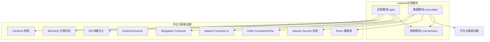
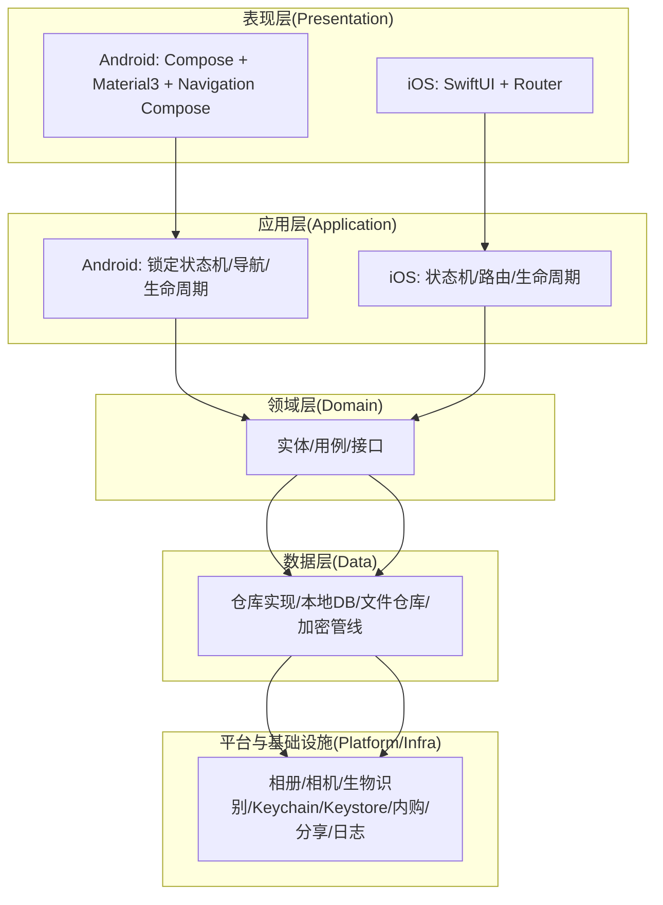
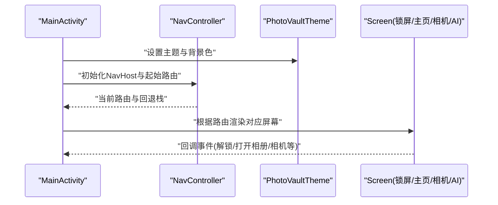
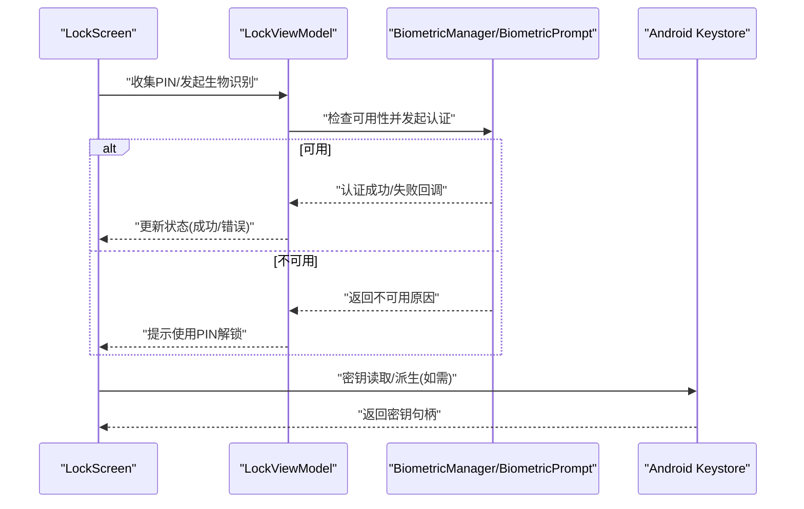
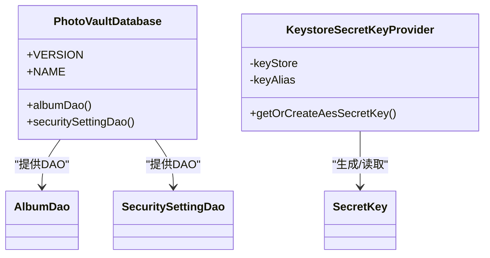
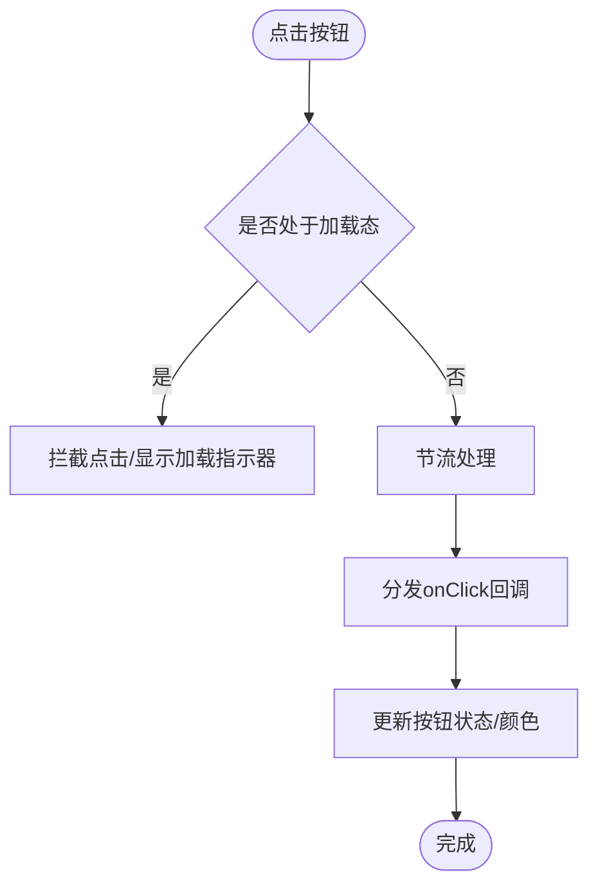
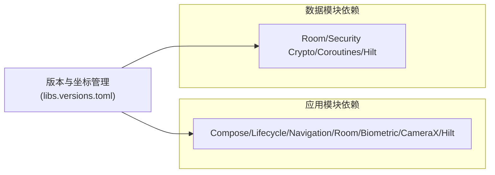

# 技术栈

<cite>
**本文引用的文件**
- [android/app/build.gradle.kts](file://android/app/build.gradle.kts)
- [android/core/data/build.gradle.kts](file://android/core/data/build.gradle.kts)
- [android/gradle/libs.versions.toml](file://android/gradle/libs.versions.toml)
- [android/app/src/main/kotlin/com/photovault/app/PhotoVaultApp.kt](file://android/app/src/main/kotlin/com/photovault/app/PhotoVaultApp.kt)
- [android/app/src/main/kotlin/com/photovault/app/MainActivity.kt](file://android/app/src/main/kotlin/com/photovault/app/MainActivity.kt)
- [android/app/src/main/kotlin/com/photovault/app/ui/theme/Theme.kt](file://android/app/src/main/kotlin/com/photovault/app/ui/theme/Theme.kt)
- [android/app/src/main/kotlin/com/photovault/app/ui/components/AppButton.kt](file://android/app/src/main/kotlin/com/photovault/app/ui/components/AppButton.kt)
- [android/app/src/main/kotlin/com/photovault/app/ui/lock/LockScreen.kt](file://android/app/src/main/kotlin/com/photovault/app/ui/lock/LockScreen.kt)
- [android/app/src/main/kotlin/com/photovault/app/ui/AiHomeScreen.kt](file://android/app/src/main/kotlin/com/photovault/app/ui/AiHomeScreen.kt)
- [android/app/src/main/kotlin/com/photovault/app/ui/CameraHomeScreen.kt](file://android/app/src/main/kotlin/com/photovault/app/ui/CameraHomeScreen.kt)
- [android/app/src/main/kotlin/com/photovault/app/ui/MainScreen.kt](file://android/app/src/main/kotlin/com/photovault/app/ui/MainScreen.kt)
- [android/core/data/src/main/kotlin/com/photovault/data/crypto/KeystoreSecretKeyProvider.kt](file://android/core/data/src/main/kotlin/com/photovault/data/crypto/KeystoreSecretKeyProvider.kt)
- [android/core/data/src/main/kotlin/com/photovault/data/db/PhotoVaultDatabase.kt](file://android/core/data/src/main/kotlin/com/photovault/data/db/PhotoVaultDatabase.kt)
- [spec/私密相册 App（一期）原生双端架构设计方案.md](file://spec/私密相册 App（一期）原生双端架构设计方案.md)
- [doc/成熟三方库推荐（Android-iOS）.md](file://doc/成熟三方库推荐（Android-iOS）.md)
</cite>

## 目录
1. [简介](#简介)
2. [项目结构](#项目结构)
3. [核心组件](#核心组件)
4. [架构总览](#架构总览)
5. [详细组件分析](#详细组件分析)
6. [依赖分析](#依赖分析)
7. [性能考虑](#性能考虑)
8. [故障排查指南](#故障排查指南)
9. [结论](#结论)
10. [附录](#附录)

## 简介
本文件面向AI照片保险库项目，系统化介绍Android端与iOS端的技术栈选型与实现要点，重点覆盖：
- Android端：Kotlin语言、Jetpack Compose UI、Room数据库、Hilt依赖注入、Android Keystore安全存储等
- iOS端：Swift语言、SwiftUI UI、双端一致性设计与核心第三方库映射
- 核心第三方库：TensorFlow Lite用于本地AI推理、CameraX用于相机集成、Biometric用于生物识别等
- 隐私保护与性能优化目标如何由技术栈支撑
- 开发者学习路径与必备技能要求

## 项目结构
Android端采用多模块结构，遵循“表现层/Presentation → 应用层/Application → 领域层/Domain → 数据层/Data → 平台与基础设施/Platform”的分层组织，确保职责清晰、边界明确、可测试性强。

图表来源
- [android/app/build.gradle.kts:63-90](file://android/app/build.gradle.kts#L63-L90)
- [android/core/data/build.gradle.kts:31-47](file://android/core/data/build.gradle.kts#L31-L47)
- [android/gradle/libs.versions.toml:23-54](file://android/gradle/libs.versions.toml#L23-L54)

章节来源
- [android/app/build.gradle.kts:1-91](file://android/app/build.gradle.kts#L1-L91)
- [android/core/data/build.gradle.kts:1-48](file://android/core/data/build.gradle.kts#L1-L48)
- [android/gradle/libs.versions.toml:1-64](file://android/gradle/libs.versions.toml#L1-L64)

## 核心组件
- Kotlin语言：统一的后端与UI开发语言，结合协程与Compose生态，提升开发效率与性能。
- Jetpack Compose UI：声明式UI框架，Material 3主题体系，支持暗黑模式自适应。
- Room数据库：官方ORM，提供类型安全的SQL查询与Schema版本管理。
- Hilt依赖注入：应用级与UI级依赖注入，简化组件生命周期与作用域管理。
- Android Keystore安全存储：密钥生成与存储在硬件安全环境中，保障主密钥不出域。
- CameraX相机集成：官方相机库，覆盖预览、拍照与用例绑定。
- Biometric生物识别：官方BiometricPrompt，支持指纹/面部/设备凭证等认证方式。
- TensorFlow Lite本地AI推理：模型离线推理，支持NNAPI/GPU等加速路径。
- Jetpack Security加密：与Keystore结合，提供文件与共享偏好加密能力。

章节来源
- [android/app/src/main/kotlin/com/photovault/app/ui/theme/Theme.kt:1-19](file://android/app/src/main/kotlin/com/photovault/app/ui/theme/Theme.kt#L1-L19)
- [android/core/data/src/main/kotlin/com/photovault/data/crypto/KeystoreSecretKeyProvider.kt:1-42](file://android/core/data/src/main/kotlin/com/photovault/data/crypto/KeystoreSecretKeyProvider.kt#L1-L42)
- [android/core/data/src/main/kotlin/com/photovault/data/db/PhotoVaultDatabase.kt:1-36](file://android/core/data/src/main/kotlin/com/photovault/data/db/PhotoVaultDatabase.kt#L1-L36)
- [doc/成熟三方库推荐（Android-iOS）.md:118-134](file://doc/成熟三方库推荐（Android-iOS）.md#L118-L134)

## 架构总览
双端采用同构分层，职责一致：UI层使用Compose（Android）与SwiftUI（iOS），应用层协调解锁状态机与导航，领域层定义实体与用例，数据层实现仓库与本地存储，平台层封装系统能力（相册、相机、生物识别、Keychain/Keystore、内购、分享等）。

图表来源
- [spec/私密相册 App（一期）原生双端架构设计方案.md:20-52](file://spec/私密相册 App（一期）原生双端架构设计方案.md#L20-L52)

章节来源
- [spec/私密相册 App（一期）原生双端架构设计方案.md:1-194](file://spec/私密相册 App（一期）原生双端架构设计方案.md#L1-L194)

## 详细组件分析

### Android UI与导航
- MainActivity集中配置导航与主题，基于Navigation Compose实现多路由跳转。
- Compose主题根据系统深色模式自动切换，Material 3色彩体系统一视觉风格。
- 主界面MainScreen通过多个Home Tab叠加与透明度控制，实现底部导航下的多场景切换。

图表来源
- [android/app/src/main/kotlin/com/photovault/app/MainActivity.kt:46-243](file://android/app/src/main/kotlin/com/photovault/app/MainActivity.kt#L46-L243)
- [android/app/src/main/kotlin/com/photovault/app/ui/theme/Theme.kt:9-18](file://android/app/src/main/kotlin/com/photovault/app/ui/theme/Theme.kt#L9-L18)
- [android/app/src/main/kotlin/com/photovault/app/ui/MainScreen.kt:14-82](file://android/app/src/main/kotlin/com/photovault/app/ui/MainScreen.kt#L14-L82)

章节来源
- [android/app/src/main/kotlin/com/photovault/app/MainActivity.kt:1-262](file://android/app/src/main/kotlin/com/photovault/app/MainActivity.kt#L1-L262)
- [android/app/src/main/kotlin/com/photovault/app/ui/theme/Theme.kt:1-19](file://android/app/src/main/kotlin/com/photovault/app/ui/theme/Theme.kt#L1-L19)
- [android/app/src/main/kotlin/com/photovault/app/ui/MainScreen.kt:1-82](file://android/app/src/main/kotlin/com/photovault/app/ui/MainScreen.kt#L1-L82)

### 锁定与安全模块（Biometric + PIN）
- LockScreen集成BiometricPrompt进行指纹/面部/设备凭证认证，自动提示与失败处理。
- 支持PIN输入与数字键盘，错误状态与提示信息清晰，具备“连续错误临时锁定”等安全策略。
- 应用启动时安装全局异常边界，记录未捕获异常，保障稳定性。

图表来源
- [android/app/src/main/kotlin/com/photovault/app/ui/lock/LockScreen.kt:52-228](file://android/app/src/main/kotlin/com/photovault/app/ui/lock/LockScreen.kt#L52-L228)
- [android/app/src/main/kotlin/com/photovault/app/PhotoVaultApp.kt:12-29](file://android/app/src/main/kotlin/com/photovault/app/PhotoVaultApp.kt#L12-L29)

章节来源
- [android/app/src/main/kotlin/com/photovault/app/ui/lock/LockScreen.kt:1-414](file://android/app/src/main/kotlin/com/photovault/app/ui/lock/LockScreen.kt#L1-L414)
- [android/app/src/main/kotlin/com/photovault/app/PhotoVaultApp.kt:1-31](file://android/app/src/main/kotlin/com/photovault/app/PhotoVaultApp.kt#L1-L31)

### 数据与安全存储（Room + Keystore）
- PhotoVaultDatabase定义实体集合与版本号，提供DAO访问入口，支持Schema导出关闭以减少构建开销。
- KeystoreSecretKeyProvider封装Android Keystore中的AES主密钥生成与读取，确保密钥材料不可导出，满足隐私保护要求。

图表来源
- [android/core/data/src/main/kotlin/com/photovault/data/db/PhotoVaultDatabase.kt:14-35](file://android/core/data/src/main/kotlin/com/photovault/data/db/PhotoVaultDatabase.kt#L14-L35)
- [android/core/data/src/main/kotlin/com/photovault/data/crypto/KeystoreSecretKeyProvider.kt:12-35](file://android/core/data/src/main/kotlin/com/photovault/data/crypto/KeystoreSecretKeyProvider.kt#L12-L35)

章节来源
- [android/core/data/src/main/kotlin/com/photovault/data/db/PhotoVaultDatabase.kt:1-36](file://android/core/data/src/main/kotlin/com/photovault/data/db/PhotoVaultDatabase.kt#L1-L36)
- [android/core/data/src/main/kotlin/com/photovault/data/crypto/KeystoreSecretKeyProvider.kt:1-42](file://android/core/data/src/main/kotlin/com/photovault/data/crypto/KeystoreSecretKeyProvider.kt#L1-L42)

### 组件与交互反馈
- AppButton提供统一按钮样式与加载态，内置点击节流与反馈交互源，保证UI一致性与可用性。
- UI主题与尺寸、颜色在UiTokens/Theme/Type中集中管理，确保跨屏幕风格一致。

图表来源
- [android/app/src/main/kotlin/com/photovault/app/ui/components/AppButton.kt:26-66](file://android/app/src/main/kotlin/com/photovault/app/ui/components/AppButton.kt#L26-L66)

章节来源
- [android/app/src/main/kotlin/com/photovault/app/ui/components/AppButton.kt:1-67](file://android/app/src/main/kotlin/com/photovault/app/ui/components/AppButton.kt#L1-L67)

### AI与相机页面占位
- AiHomeScreen与CameraHomeScreen作为占位页面，体现双端一致的导航与卡片布局风格，便于后续接入AI推理与相机功能。

章节来源
- [android/app/src/main/kotlin/com/photovault/app/ui/AiHomeScreen.kt:1-56](file://android/app/src/main/kotlin/com/photovault/app/ui/AiHomeScreen.kt#L1-L56)
- [android/app/src/main/kotlin/com/photovault/app/ui/CameraHomeScreen.kt:1-58](file://android/app/src/main/kotlin/com/photovault/app/ui/CameraHomeScreen.kt#L1-L58)

## 依赖分析
- Gradle版本目录libs.versions.toml集中管理版本与依赖坐标，确保Android/iOS双端选型一致与版本对齐。
- 应用模块依赖Compose、Lifecycle、Navigation、Room、Biometric、CameraX、Hilt等；数据模块依赖Room、Security Crypto、Coroutines与Hilt。

图表来源
- [android/app/build.gradle.kts:63-90](file://android/app/build.gradle.kts#L63-L90)
- [android/core/data/build.gradle.kts:31-47](file://android/core/data/build.gradle.kts#L31-L47)
- [android/gradle/libs.versions.toml:23-54](file://android/gradle/libs.versions.toml#L23-L54)

章节来源
- [android/app/build.gradle.kts:1-91](file://android/app/build.gradle.kts#L1-L91)
- [android/core/data/build.gradle.kts:1-48](file://android/core/data/build.gradle.kts#L1-L48)
- [android/gradle/libs.versions.toml:1-64](file://android/gradle/libs.versions.toml#L1-L64)

## 性能考虑
- 线程与调度：主线程仅负责UI渲染与轻逻辑；加密、AI推理、图像编解码与大批量IO在后台执行器中进行，避免阻塞UI。
- 数据与事务：批量导入分批提交或单事务，避免每张照片触发全表扫描；Room支持KSP编译期校验，降低运行时开销。
- 内存与解码：大图按目标尺寸解码；AI输入tensor尽量复用缓冲区，减少GC压力。
- 缩略图与分页：结合系统相册与分页库，降低首帧时间与内存峰值。
- 构建优化：Release启用代码压缩与资源收缩，Debug保留工具链以便调试。

章节来源
- [spec/私密相册 App（一期）原生双端架构设计方案.md:151-157](file://spec/私密相册 App（一期）原生双端架构设计方案.md#L151-L157)
- [android/app/build.gradle.kts:36-48](file://android/app/build.gradle.kts#L36-L48)

## 故障排查指南
- 全局异常边界：应用启动时安装默认未捕获异常处理器，记录异常标签与堆栈，便于定位问题。
- 锁定与生物识别：当生物识别不可用时，应提示用户使用PIN解锁；认证失败时区分取消与错误，避免误导。
- 日志与可观测性：一期不接入Firebase，依赖系统日志与真机测试；必要时保留非敏感诊断接口，便于后续接入。

章节来源
- [android/app/src/main/kotlin/com/photovault/app/PhotoVaultApp.kt:19-29](file://android/app/src/main/kotlin/com/photovault/app/PhotoVaultApp.kt#L19-L29)
- [android/app/src/main/kotlin/com/photovault/app/ui/lock/LockScreen.kt:360-382](file://android/app/src/main/kotlin/com/photovault/app/ui/lock/LockScreen.kt#L360-L382)
- [spec/私密相册 App（一期）原生双端架构设计方案.md:137-147](file://spec/私密相册 App（一期）原生双端架构设计方案.md#L137-L147)

## 结论
本技术栈围绕“本地离线处理、隐私优先、性能稳健”展开：Android端以Kotlin/Compose/Room/Hilt为核心，结合Keystore与Biometric保障安全；iOS端以SwiftUI/平台能力对齐；TensorFlow Lite与CameraX分别支撑AI推理与相机集成。通过分层架构与统一的双端设计，既满足功能落地，又兼顾可维护性与扩展性。

## 附录

### iOS端技术栈与双端一致性
- iOS端采用SwiftUI与Swift并发模型，与Android端在分层职责、数据契约、加密格式与备份规范上保持一致，仅系统API与工程细节不同。
- 核心第三方库映射：iOS端以Swift生态为主，相机采用AVFoundation，生物识别采用LocalAuthentication，加密采用CryptoKit，AI推理可选Core ML或与Android统一的TensorFlow Lite。

章节来源
- [spec/私密相册 App（一期）原生双端架构设计方案.md:79-96](file://spec/私密相册 App（一期）原生双端架构设计方案.md#L79-L96)
- [doc/成熟三方库推荐（Android-iOS）.md:118-134](file://doc/成熟三方库推荐（Android-iOS）.md#L118-L134)

### 开发者学习路径与必备技能
- Android端
  - Kotlin语言基础与协程/Flow
  - Jetpack Compose与Material 3
  - Room数据库与DAO模式
  - Hilt依赖注入与作用域管理
  - Android Keystore与Jetpack Security
  - CameraX相机集成与Biometric生物识别
  - TensorFlow Lite模型部署与推理
- iOS端
  - Swift语言与SwiftUI
  - Swift并发与任务调度
  - Core Data/GRDB或SQLite
  - Keychain与CryptoKit
  - AVFoundation相机与LocalAuthentication
  - Core ML或TensorFlow Lite
- 双端一致性
  - 加密格式与密钥策略统一
  - 数据库Schema与备份格式文档化
  - 错误码与日志规范统一

章节来源
- [doc/成熟三方库推荐（Android-iOS）.md:118-134](file://doc/成熟三方库推荐（Android-iOS）.md#L118-L134)
- [spec/私密相册 App（一期）原生双端架构设计方案.md:161-184](file://spec/私密相册 App（一期）原生双端架构设计方案.md#L161-L184)