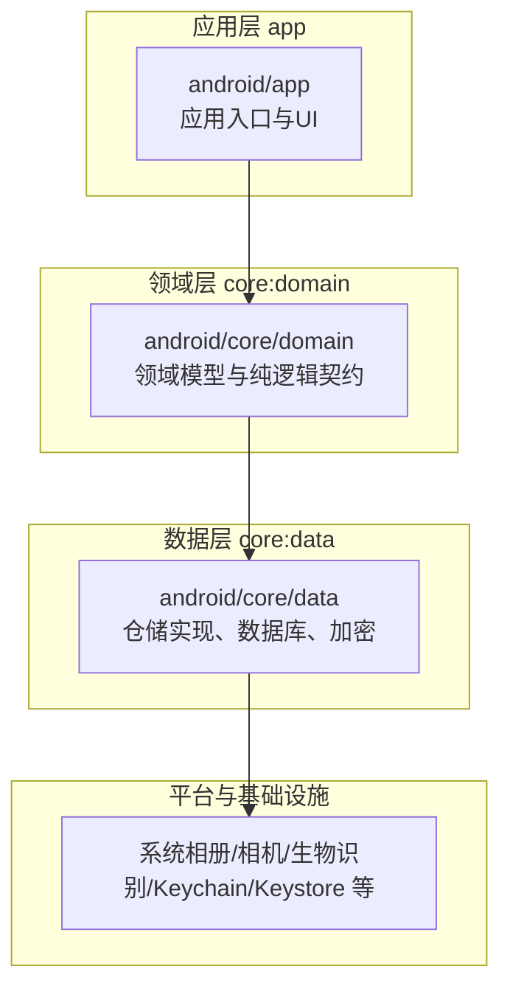
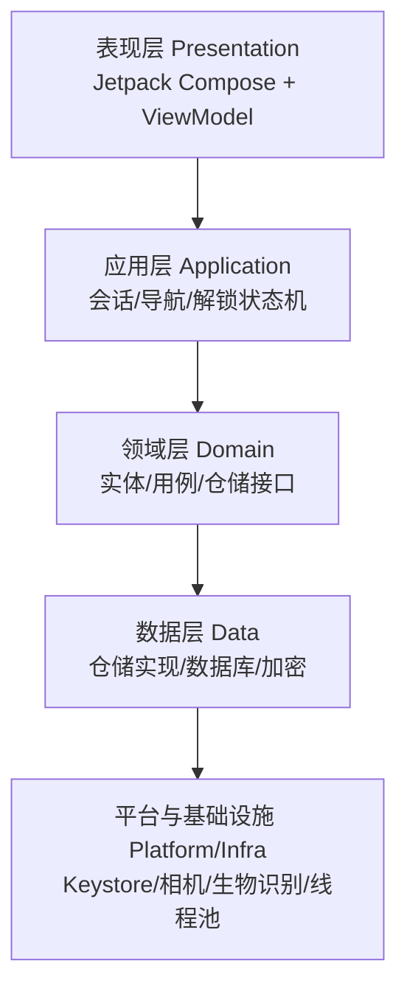
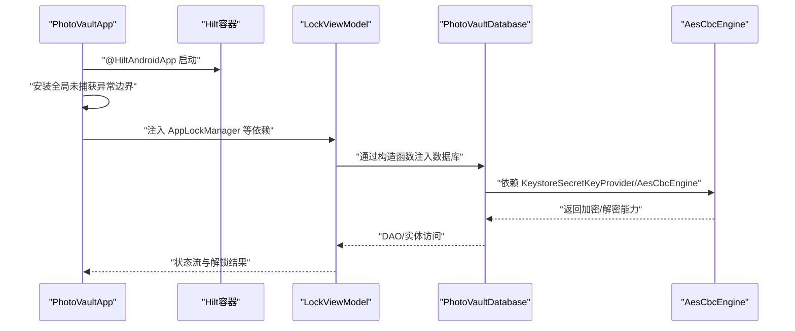
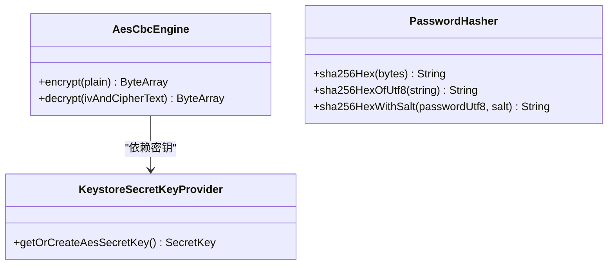
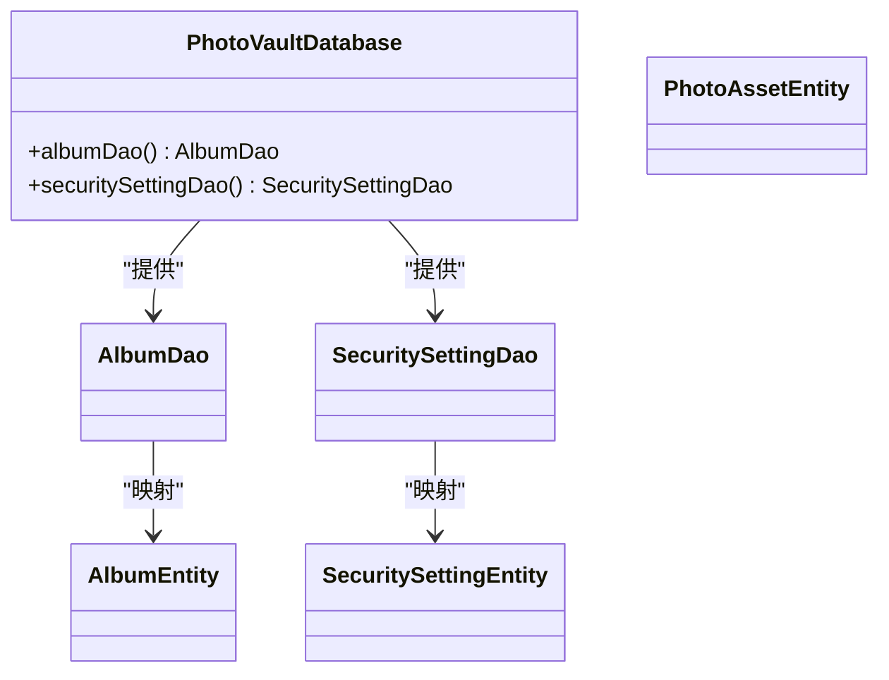
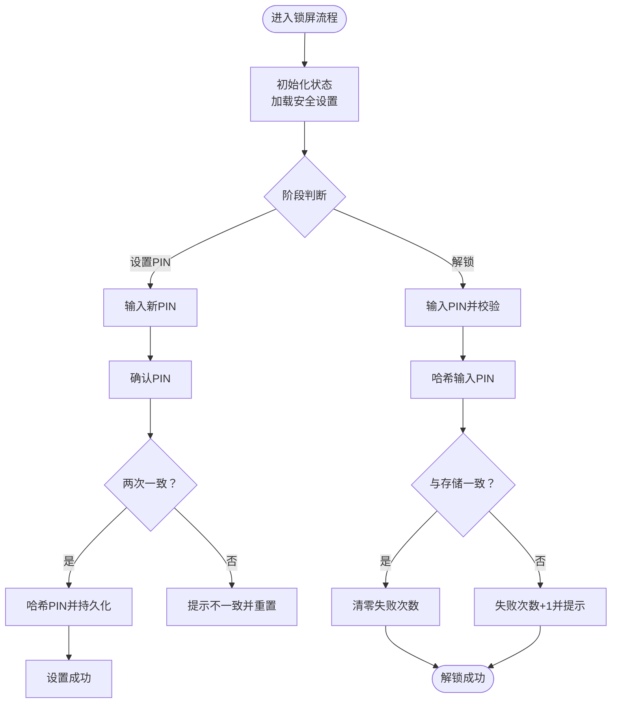
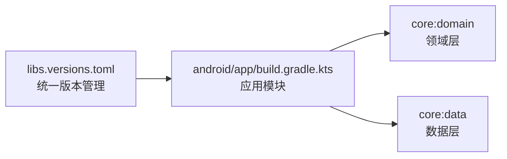

# 架构设计理念

<cite>
**本文引用的文件**   
- [PhotoVaultApp.kt](file://android/app/src/main/kotlin/com/photovault/app/PhotoVaultApp.kt)
- [MainScreen.kt](file://android/app/src/main/kotlin/com/photovault/app/ui/MainScreen.kt)
- [DataModule.kt](file://android/core/data/src/main/kotlin/com/photovault/data/di/DataModule.kt)
- [AesCbcEngine.kt](file://android/core/data/src/main/kotlin/com/photovault/data/crypto/AesCbcEngine.kt)
- [KeystoreSecretKeyProvider.kt](file://android/core/data/src/main/kotlin/com/photovault/data/crypto/KeystoreSecretKeyProvider.kt)
- [PasswordHasher.kt](file://android/core/data/src/main/kotlin/com/photovault/data/crypto/PasswordHasher.kt)
- [PhotoVaultDatabase.kt](file://android/core/data/src/main/kotlin/com/photovault/data/db/PhotoVaultDatabase.kt)
- [PhotoAsset.kt](file://android/core/domain/src/main/kotlin/com/photovault/domain/model/PhotoAsset.kt)
- [LockViewModel.kt](file://android/app/src/main/kotlin/com/photovault/app/ui/lock/LockViewModel.kt)
- [AppLockManager.kt](file://android/app/src/main/kotlin/com/photovault/app/AppLockManager.kt)
- [android/app/build.gradle.kts](file://android/app/build.gradle.kts)
- [settings.gradle.kts](file://android/settings.gradle.kts)
- [libs.versions.toml](file://android/gradle/libs.versions.toml)
- [私密相册 App（一期）原生双端架构设计方案.md](file://spec/私密相册 App（一期）原生双端架构设计方案.md)
</cite>

## 目录
1. [引言](#引言)
2. [项目结构](#项目结构)
3. [核心组件](#核心组件)
4. [架构总览](#架构总览)
5. [详细组件分析](#详细组件分析)
6. [依赖分析](#依赖分析)
7. [性能考虑](#性能考虑)
8. [故障排查指南](#故障排查指南)
9. [结论](#结论)
10. [附录](#附录)

## 引言
本项目遵循 Clean Architecture 分层理念，围绕“表现层（Presentation）—应用层（Application）—领域层（Domain）—数据层（Data）—平台与基础设施（Platform/Infra）”进行职责划分与依赖约束。该架构旨在：
- 支撑性能：主线程专注 UI 渲染与轻逻辑，重计算与 IO 放在后台执行器
- 强化安全：密钥与敏感数据不离开设备，加密管线与口令哈希在数据层实现
- 提升可维护性：清晰的分层边界与依赖注入，降低耦合、增强可测试性与可扩展性

## 项目结构
项目采用 Gradle 多模块组织，核心模块包括应用层 app、领域层 core:domain、数据层 core:data。模块间通过依赖声明建立单向依赖，确保“上层依赖下层，下层不依赖上层”的原则。

图表来源
- [settings.gradle.kts:17-21](file://android/settings.gradle.kts#L17-L21)
- [android/app/build.gradle.kts:63-66](file://android/app/build.gradle.kts#L63-L66)

章节来源
- [settings.gradle.kts:17-21](file://android/settings.gradle.kts#L17-L21)
- [android/app/build.gradle.kts:63-66](file://android/app/build.gradle.kts#L63-L66)

## 核心组件
- 表现层（Presentation）
  - 负责 UI 呈现、导航与交互反馈，使用 Jetpack Compose 与 ViewModel，通过状态驱动界面更新。
  - 示例：主屏幕 MainScreen 负责底部导航与页面切换；锁屏相关 UI 与状态由 LockViewModel 驱动。
- 应用层（Application）
  - 负责会话、导航、解锁状态机、生命周期锁定与权限引导流程。
  - 示例：AppLockManager 管理应用进入后台时的锁定策略与解锁状态流；PhotoVaultApp 安装全局未捕获异常边界。
- 领域层（Domain）
  - 保存纯业务实体与契约，不包含 UI 与具体存储实现。
  - 示例：PhotoAsset 等领域模型定义业务元数据。
- 数据层（Data）
  - 提供仓储实现、本地数据库、文件仓库、加密管线与 DTO 映射。
  - 示例：Room 数据库 PhotoVaultDatabase、AesCbcEngine 与 KeystoreSecretKeyProvider、PasswordHasher。
- 平台与基础设施（Platform/Infra）
  - 提供系统能力封装，如相册、相机、生物识别、Keychain/Keystore、内购、系统分享、线程池与日志等。
  - 示例：Android Keystore、BiometricPrompt、CameraX、WorkManager 等（技术映射见架构方案文档）。

章节来源
- [MainScreen.kt:14-82](file://android/app/src/main/kotlin/com/photovault/app/ui/MainScreen.kt#L14-L82)
- [AppLockManager.kt:17-49](file://android/app/src/main/kotlin/com/photovault/app/AppLockManager.kt#L17-L49)
- [PhotoVaultApp.kt:7-31](file://android/app/src/main/kotlin/com/photovault/app/PhotoVaultApp.kt#L7-L31)
- [PhotoAsset.kt:1-15](file://android/core/domain/src/main/kotlin/com/photovault/domain/model/PhotoAsset.kt#L1-L15)
- [PhotoVaultDatabase.kt:14-36](file://android/core/data/src/main/kotlin/com/photovault/data/db/PhotoVaultDatabase.kt#L14-L36)
- [AesCbcEngine.kt:12-40](file://android/core/data/src/main/kotlin/com/photovault/data/crypto/AesCbcEngine.kt#L12-L40)
- [KeystoreSecretKeyProvider.kt:12-42](file://android/core/data/src/main/kotlin/com/photovault/data/crypto/KeystoreSecretKeyProvider.kt#L12-L42)
- [PasswordHasher.kt:1-26](file://android/core/data/src/main/kotlin/com/photovault/data/crypto/PasswordHasher.kt#L1-L26)

## 架构总览
Clean Architecture 的依赖方向为“上层依赖下层”，且领域层不依赖数据层的具体实现。数据层依赖平台与基础设施，应用层协调表现层与领域层之间的交互。

图表来源
- [私密相册 App（一期）原生双端架构设计方案.md:20-55](file://spec/私密相册 App（一期）原生双端架构设计方案.md#L20-L55)

章节来源
- [私密相册 App（一期）原生双端架构设计方案.md:20-55](file://spec/私密相册 App（一期）原生双端架构设计方案.md#L20-L55)

## 详细组件分析

### 依赖注入与 Hilt 应用
- 应用入口注解与全局异常处理
  - PhotoVaultApp 使用 @HiltAndroidApp 标记，启用 Hilt 依赖注入；在 Application.onCreate 中安装全局未捕获异常边界，记录异常并交由系统默认处理器处理。
- ViewModel 注入与作用域
  - LockViewModel 使用 @HiltViewModel，通过构造函数注入 PhotoVaultDatabase，体现“上层依赖下层”的注入原则。
- 数据层模块化提供者
  - DataModule 在 SingletonComponent 中提供数据库、密钥提供者与加密引擎，形成稳定的依赖供应面，避免上层直接依赖平台细节。

图表来源
- [PhotoVaultApp.kt:7-31](file://android/app/src/main/kotlin/com/photovault/app/PhotoVaultApp.kt#L7-L31)
- [LockViewModel.kt:18-21](file://android/app/src/main/kotlin/com/photovault/app/ui/lock/LockViewModel.kt#L18-L21)
- [DataModule.kt:15-39](file://android/core/data/src/main/kotlin/com/photovault/data/di/DataModule.kt#L15-L39)

章节来源
- [PhotoVaultApp.kt:7-31](file://android/app/src/main/kotlin/com/photovault/app/PhotoVaultApp.kt#L7-L31)
- [LockViewModel.kt:18-21](file://android/app/src/main/kotlin/com/photovault/app/ui/lock/LockViewModel.kt#L18-L21)
- [DataModule.kt:15-39](file://android/core/data/src/main/kotlin/com/photovault/data/di/DataModule.kt#L15-L39)

### 加密与安全模块
- 密钥托管与生成
  - KeystoreSecretKeyProvider 在 Android Keystore 中生成/读取 AES-256-CBC 密钥，密钥材料不可导出，满足安全要求。
- 加密与解密管线
  - AesCbcEngine 使用 AES/CBC/PKCS5Padding，IV 前置 16 字节，与产品约定一致；提供 encrypt/decrypt 方法。
- 口令哈希
  - PasswordHasher 提供 SHA-256 哈希与带盐组合，用于 PIN 码等口令的安全存储。

图表来源
- [KeystoreSecretKeyProvider.kt:12-42](file://android/core/data/src/main/kotlin/com/photovault/data/crypto/KeystoreSecretKeyProvider.kt#L12-L42)
- [AesCbcEngine.kt:12-40](file://android/core/data/src/main/kotlin/com/photovault/data/crypto/AesCbcEngine.kt#L12-L40)
- [PasswordHasher.kt:1-26](file://android/core/data/src/main/kotlin/com/photovault/data/crypto/PasswordHasher.kt#L1-L26)

章节来源
- [KeystoreSecretKeyProvider.kt:12-42](file://android/core/data/src/main/kotlin/com/photovault/data/crypto/KeystoreSecretKeyProvider.kt#L12-L42)
- [AesCbcEngine.kt:12-40](file://android/core/data/src/main/kotlin/com/photovault/data/crypto/AesCbcEngine.kt#L12-L40)
- [PasswordHasher.kt:1-26](file://android/core/data/src/main/kotlin/com/photovault/data/crypto/PasswordHasher.kt#L1-L26)

### 数据库与仓储
- Room 数据库
  - PhotoVaultDatabase 定义实体集合与版本号，暴露 DAO 访问；迁移策略在升级时集中管理。
- 仓储与 DAO
  - 数据层通过 DAO 与实体完成持久化，领域层仅依赖仓储接口，避免直接依赖具体实现。

图表来源
- [PhotoVaultDatabase.kt:14-36](file://android/core/data/src/main/kotlin/com/photovault/data/db/PhotoVaultDatabase.kt#L14-L36)

章节来源
- [PhotoVaultDatabase.kt:14-36](file://android/core/data/src/main/kotlin/com/photovault/data/db/PhotoVaultDatabase.kt#L14-L36)

### 锁定与安全流程
- 锁定状态机
  - AppLockManager 通过生命周期回调决定是否触发锁定；对外暴露 requireUnlock 状态流，供 UI 层响应。
- 锁屏 UI 与解锁校验
  - LockViewModel 负责 PIN 设置/确认、解锁校验、错误计数与生物识别联动；通过 DAO 读写安全设置，使用 PasswordHasher 进行口令哈希。

图表来源
- [AppLockManager.kt:17-49](file://android/app/src/main/kotlin/com/photovault/app/AppLockManager.kt#L17-L49)
- [LockViewModel.kt:18-197](file://android/app/src/main/kotlin/com/photovault/app/ui/lock/LockViewModel.kt#L18-L197)

章节来源
- [AppLockManager.kt:17-49](file://android/app/src/main/kotlin/com/photovault/app/AppLockManager.kt#L17-L49)
- [LockViewModel.kt:18-197](file://android/app/src/main/kotlin/com/photovault/app/ui/lock/LockViewModel.kt#L18-L197)

### 双端一致性与平台适配
- 双端同构分层
  - Android/iOS 采用相同分层与职责划分，差异收敛在 Platform 适配层；业务语义、数据契约与错误码表需文档化并保持一致。
- 平台能力映射
  - Android：Jetpack Compose、Room、CameraX、BiometricPrompt、Android Keystore、RevenueCat 等；iOS：SwiftUI、Core Data/GRDB、AVFoundation、LocalAuthentication、Keychain/CryptoKit、RevenueCat 等。
- 本地 AI 推理
  - 默认推荐 TensorFlow Lite，统一 .tflite 模型与量化策略，降低双端维护成本；若 iOS 单独优化，可采用 iOS Core ML + Android TFLite，并统一验证集与阈值。

章节来源
- [私密相册 App（一期）原生双端架构设计方案.md:20-55](file://spec/私密相册 App（一期）原生双端架构设计方案.md#L20-L55)
- [私密相册 App（一期）原生双端架构设计方案.md:58-96](file://spec/私密相册 App（一期）原生双端架构设计方案.md#L58-L96)
- [私密相册 App（一期）原生双端架构设计方案.md:115-134](file://spec/私密相册 App（一期）原生双端架构设计方案.md#L115-L134)

## 依赖分析
- 模块依赖
  - app 依赖 core:domain 与 core:data，确保表现层与应用层仅消费领域契约与数据仓储，不直接依赖平台细节。
- 第三方库与版本
  - 通过 libs.versions.toml 统一管理版本，包括 Compose、Room、Hilt、CameraX、Security Crypto、Coroutines 等，保证依赖一致性与可维护性。
- 构建配置
  - app 模块启用 Hilt 插件与 KSP，开启 Compose 构建特性与调试工具；设置 minSdk/targetSdk/compileSdk 与 JVM 目标版本，满足现代 Android 开发需求。

图表来源
- [libs.versions.toml:1-64](file://android/gradle/libs.versions.toml#L1-L64)
- [android/app/build.gradle.kts:63-90](file://android/app/build.gradle.kts#L63-L90)

章节来源
- [libs.versions.toml:1-64](file://android/gradle/libs.versions.toml#L1-L64)
- [android/app/build.gradle.kts:63-90](file://android/app/build.gradle.kts#L63-L90)

## 性能考虑
- 线程与调度
  - 主线程仅负责 UI 渲染与轻逻辑；加密、解码、AI、大批量 IO 放在后台执行器，避免阻塞主线程。
- 数据与事务
  - 批量导入分批提交或单事务，避免每张照片触发全表扫描；Room 事务与分页加载提升性能。
- 内存与解码
  - 大图按目标尺寸解码；AI 输入 tensor 尽量复用缓冲区，降低内存峰值。
- 测试与回归
  - 领域层纯逻辑单元测试；数据层使用内存 Fake；平台层使用假相册/相机，保障回归质量。

章节来源
- [私密相册 App（一期）原生双端架构设计方案.md:151-158](file://spec/私密相册 App（一期）原生双端架构设计方案.md#L151-L158)

## 故障排查指南
- 全局异常边界
  - PhotoVaultApp 安装默认未捕获异常处理器，记录异常标签与堆栈后交由系统处理，便于问题定位与上报。
- 锁定与解锁失败
  - LockViewModel 维护失败次数并在错误时提示；确认 PIN 是否一致、生物识别是否可用、数据库读写是否正常。
- 加密与解密问题
  - 确认 Keystore 中密钥存在且未被系统清理；检查 AesCbcEngine 的变换与 IV 长度；核对输入数据长度与格式。

章节来源
- [PhotoVaultApp.kt:19-29](file://android/app/src/main/kotlin/com/photovault/app/PhotoVaultApp.kt#L19-L29)
- [LockViewModel.kt:168-184](file://android/app/src/main/kotlin/com/photovault/app/ui/lock/LockViewModel.kt#L168-L184)
- [AesCbcEngine.kt:17-32](file://android/core/data/src/main/kotlin/com/photovault/data/crypto/AesCbcEngine.kt#L17-L32)

## 结论
本项目通过 Clean Architecture 的分层设计与 Hilt 的依赖注入，实现了表现层、应用层、领域层、数据层与平台层的清晰边界与单向依赖。结合 Room、Android Keystore、BiometricPrompt、CameraX 等平台能力，以及统一的加密与安全策略，支撑了性能、安全与可维护性的目标。双端一致性设计进一步降低了维护成本，为后续扩展与演进提供了坚实基础。

## 附录
- 架构设计最佳实践
  - 严格遵循依赖向内的原则，上层仅依赖下层接口；领域层不依赖数据层实现。
  - 使用依赖注入集中管理对象生命周期与作用域，避免在上层直接 new 平台类。
  - 将平台差异收敛在 Data/Platform 层，保持 Domain/Feature 的纯净与可移植性。
  - 通过文档化数据契约与错误码表，确保双端一致性与可恢复性。
- 扩展指导
  - 新功能优先在 Domain 定义用例与实体，再在 Data 层提供仓储实现，最后在 Presentation 层接入 UI。
  - 平台能力新增时，先在 Platform 层抽象接口，再在 Data 层实现，避免上层感知平台差异。
  - 对性能敏感的模块（加密、AI、IO）统一调度策略与限流机制，确保主线程流畅。