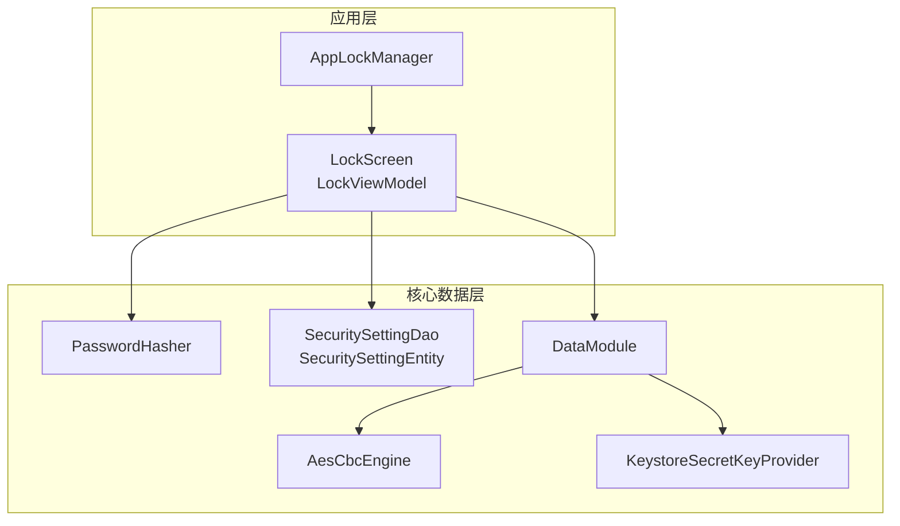
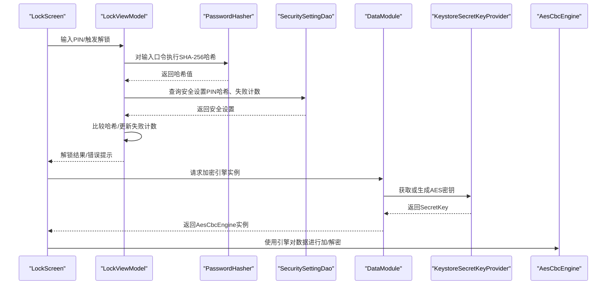
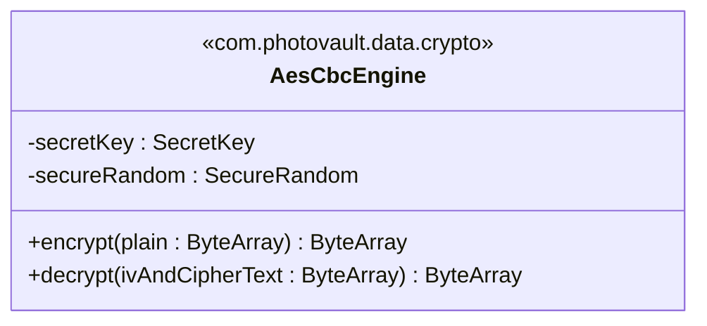
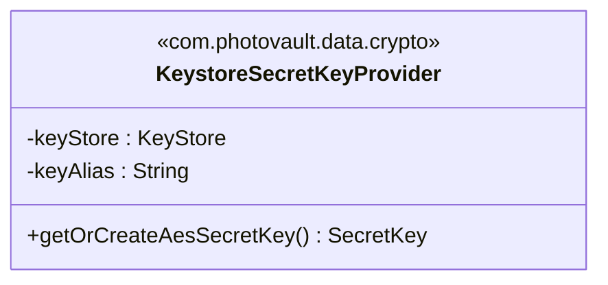
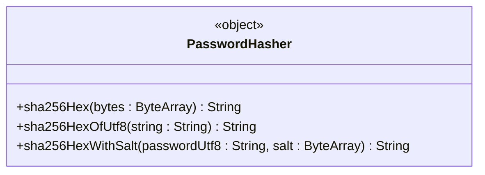
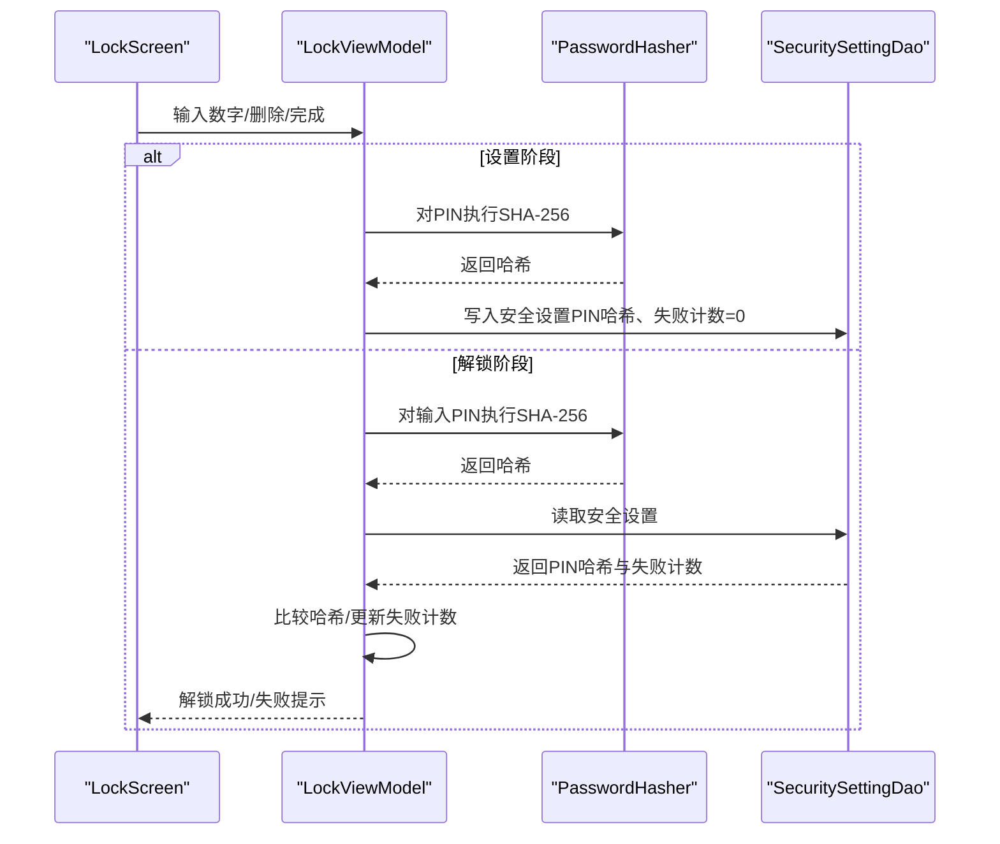
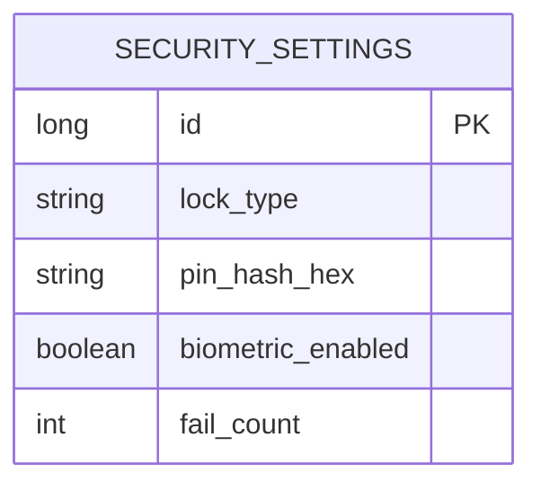
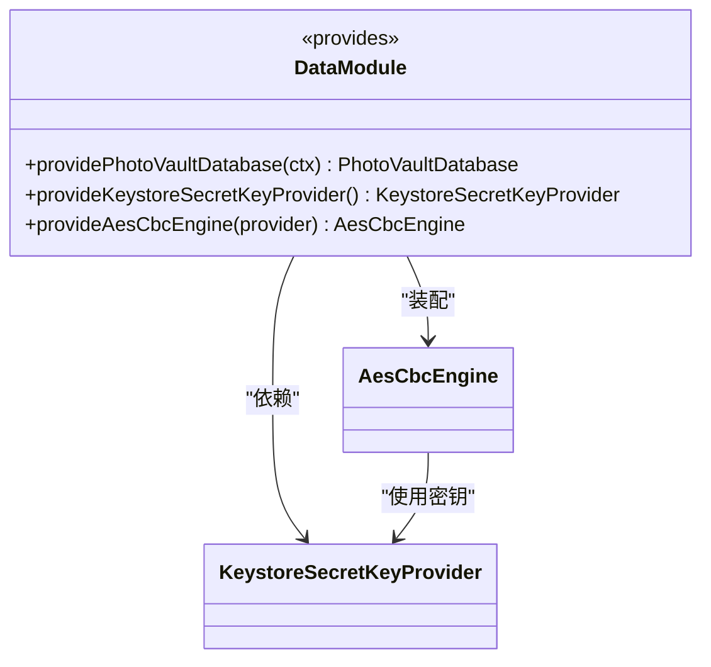
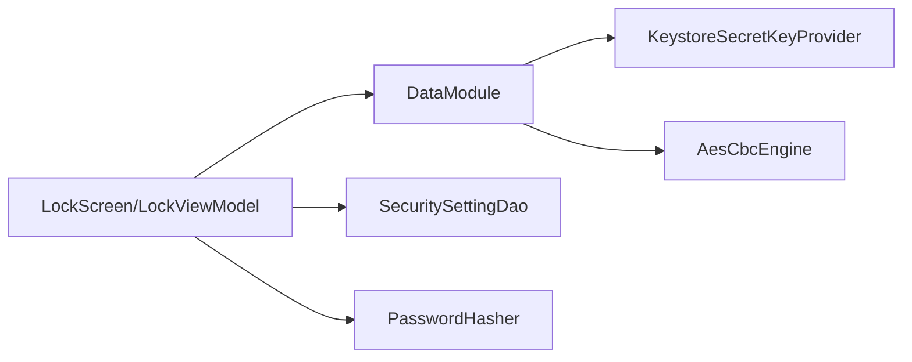

# AES-256-CBC加密存储

<cite>
**本文档引用的文件**
- [AesCbcEngine.kt](file://android/core/data/src/main/kotlin/com/photovault/data/crypto/AesCbcEngine.kt)
- [KeystoreSecretKeyProvider.kt](file://android/core/data/src/main/kotlin/com/photovault/data/crypto/KeystoreSecretKeyProvider.kt)
- [PasswordHasher.kt](file://android/core/data/src/main/kotlin/com/photovault/data/crypto/PasswordHasher.kt)
- [AesCbcEngineTest.kt](file://android/core/data/src/test/kotlin/com/photovault/data/crypto/AesCbcEngineTest.kt)
- [PasswordHasherTest.kt](file://android/core/data/src/test/kotlin/com/photovault/data/crypto/PasswordHasherTest.kt)
- [DataModule.kt](file://android/core/data/src/main/kotlin/com/photovault/data/di/DataModule.kt)
- [SecuritySettingDao.kt](file://android/core/data/src/main/kotlin/com/photovault/data/db/dao/SecuritySettingDao.kt)
- [SecuritySettingEntity.kt](file://android/core/data/src/main/kotlin/com/photovault/data/db/entity/SecuritySettingEntity.kt)
- [LockScreen.kt](file://android/app/src/main/kotlin/com/photovault/app/ui/lock/LockScreen.kt)
- [LockViewModel.kt](file://android/app/src/main/kotlin/com/photovault/app/ui/lock/LockViewModel.kt)
- [AppLockManager.kt](file://android/app/src/main/kotlin/com/photovault/app/AppLockManager.kt)
</cite>

## 目录
1. [简介](#简介)
2. [项目结构](#项目结构)
3. [核心组件](#核心组件)
4. [架构总览](#架构总览)
5. [详细组件分析](#详细组件分析)
6. [依赖关系分析](#依赖关系分析)
7. [性能考虑](#性能考虑)
8. [故障排查指南](#故障排查指南)
9. [结论](#结论)
10. [附录](#附录)

## 简介
本技术文档围绕AI照片保险库的加密存储系统，系统性阐述AES-256-CBC加密算法的实现原理、密钥管理机制与安全存储策略。重点覆盖以下方面：
- AES-256-CBC加密引擎的实现细节与数据格式约定（IV前置16字节，PKCS7填充）
- Android Keystore集成：密钥生成、存储与访问流程
- 密码哈希与验证：PasswordHasher的SHA-256实现、盐值组合与PIN验证机制
- 加密引擎使用示例、文件加解密流程与密钥轮换策略
- 性能优化、内存安全与错误处理
- 数据完整性校验、防篡改保护与安全审计建议

## 项目结构
本项目采用分层与按功能域组织的结构：
- 应用层（app）：包含UI、解锁界面与业务交互逻辑
- 核心数据层（core/data）：包含加密引擎、密钥提供者、密码哈希、数据库实体与DAO、依赖注入模块
- 测试层（core/data/test）：对加密与哈希进行单元测试

图表来源
- [LockScreen.kt:1-414](file://android/app/src/main/kotlin/com/photovault/app/ui/lock/LockScreen.kt#L1-L414)
- [LockViewModel.kt:1-222](file://android/app/src/main/kotlin/com/photovault/app/ui/lock/LockViewModel.kt#L1-L222)
- [AppLockManager.kt:1-49](file://android/app/src/main/kotlin/com/photovault/app/AppLockManager.kt#L1-L49)
- [AesCbcEngine.kt:1-40](file://android/core/data/src/main/kotlin/com/photovault/data/crypto/AesCbcEngine.kt#L1-L40)
- [KeystoreSecretKeyProvider.kt:1-42](file://android/core/data/src/main/kotlin/com/photovault/data/crypto/KeystoreSecretKeyProvider.kt#L1-L42)
- [PasswordHasher.kt:1-26](file://android/core/data/src/main/kotlin/com/photovault/data/crypto/PasswordHasher.kt#L1-L26)
- [SecuritySettingDao.kt:1-17](file://android/core/data/src/main/kotlin/com/photovault/data/db/dao/SecuritySettingDao.kt#L1-L17)
- [SecuritySettingEntity.kt:1-19](file://android/core/data/src/main/kotlin/com/photovault/data/db/entity/SecuritySettingEntity.kt#L1-L19)
- [DataModule.kt:1-40](file://android/core/data/src/main/kotlin/com/photovault/data/di/DataModule.kt#L1-L40)

章节来源
- [LockScreen.kt:1-414](file://android/app/src/main/kotlin/com/photovault/app/ui/lock/LockScreen.kt#L1-L414)
- [LockViewModel.kt:1-222](file://android/app/src/main/kotlin/com/photovault/app/ui/lock/LockViewModel.kt#L1-L222)
- [AppLockManager.kt:1-49](file://android/app/src/main/kotlin/com/photovault/app/AppLockManager.kt#L1-L49)
- [AesCbcEngine.kt:1-40](file://android/core/data/src/main/kotlin/com/photovault/data/crypto/AesCbcEngine.kt#L1-L40)
- [KeystoreSecretKeyProvider.kt:1-42](file://android/core/data/src/main/kotlin/com/photovault/data/crypto/KeystoreSecretKeyProvider.kt#L1-L42)
- [PasswordHasher.kt:1-26](file://android/core/data/src/main/kotlin/com/photovault/data/crypto/PasswordHasher.kt#L1-L26)
- [SecuritySettingDao.kt:1-17](file://android/core/data/src/main/kotlin/com/photovault/data/db/dao/SecuritySettingDao.kt#L1-L17)
- [SecuritySettingEntity.kt:1-19](file://android/core/data/src/main/kotlin/com/photovault/data/db/entity/SecuritySettingEntity.kt#L1-L19)
- [DataModule.kt:1-40](file://android/core/data/src/main/kotlin/com/photovault/data/di/DataModule.kt#L1-L40)

## 核心组件
- AES-256-CBC加密引擎：负责对明文字节数组进行加密（IV前置16字节+密文）与解密（从输入中解析IV并解密）
- Android Keystore密钥提供者：在系统安全硬件中生成/读取AES-256密钥，密钥材料不可导出
- 密码哈希器：基于SHA-256对口令进行哈希，支持“盐值+口令”组合，用于PIN等口令的安全存储与验证
- 数据持久化：通过Room DAO与实体保存安全设置（锁类型、PIN哈希、生物识别开关、失败计数）

章节来源
- [AesCbcEngine.kt:1-40](file://android/core/data/src/main/kotlin/com/photovault/data/crypto/AesCbcEngine.kt#L1-L40)
- [KeystoreSecretKeyProvider.kt:1-42](file://android/core/data/src/main/kotlin/com/photovault/data/crypto/KeystoreSecretKeyProvider.kt#L1-L42)
- [PasswordHasher.kt:1-26](file://android/core/data/src/main/kotlin/com/photovault/data/crypto/PasswordHasher.kt#L1-L26)
- [SecuritySettingDao.kt:1-17](file://android/core/data/src/main/kotlin/com/photovault/data/db/dao/SecuritySettingDao.kt#L1-L17)
- [SecuritySettingEntity.kt:1-19](file://android/core/data/src/main/kotlin/com/photovault/data/db/entity/SecuritySettingEntity.kt#L1-L19)

## 架构总览
下图展示了从UI到加密与存储的整体调用链路。

图表来源
- [LockScreen.kt:1-414](file://android/app/src/main/kotlin/com/photovault/app/ui/lock/LockScreen.kt#L1-L414)
- [LockViewModel.kt:1-222](file://android/app/src/main/kotlin/com/photovault/app/ui/lock/LockViewModel.kt#L1-L222)
- [PasswordHasher.kt:1-26](file://android/core/data/src/main/kotlin/com/photovault/data/crypto/PasswordHasher.kt#L1-L26)
- [SecuritySettingDao.kt:1-17](file://android/core/data/src/main/kotlin/com/photovault/data/db/dao/SecuritySettingDao.kt#L1-L17)
- [DataModule.kt:1-40](file://android/core/data/src/main/kotlin/com/photovault/data/di/DataModule.kt#L1-L40)
- [KeystoreSecretKeyProvider.kt:1-42](file://android/core/data/src/main/kotlin/com/photovault/data/crypto/KeystoreSecretKeyProvider.kt#L1-L42)
- [AesCbcEngine.kt:1-40](file://android/core/data/src/main/kotlin/com/photovault/data/crypto/AesCbcEngine.kt#L1-L40)

## 详细组件分析

### AES-256-CBC加密引擎（AesCbcEngine）
- 算法与填充：AES/CBC/PKCS5Padding（与PKCS7等价）
- IV策略：每次加密随机生成16字节IV，前置拼接在密文前；解密时从输入前16字节提取IV
- 错误处理：对非法载荷长度进行断言检查，避免越界与空输入
- 复杂度：单次加解密时间复杂度O(n)，空间复杂度O(n)，n为明文/密文字节数

图表来源
- [AesCbcEngine.kt:1-40](file://android/core/data/src/main/kotlin/com/photovault/data/crypto/AesCbcEngine.kt#L1-L40)

章节来源
- [AesCbcEngine.kt:1-40](file://android/core/data/src/main/kotlin/com/photovault/data/crypto/AesCbcEngine.kt#L1-L40)
- [AesCbcEngineTest.kt:1-19](file://android/core/data/src/test/kotlin/com/photovault/data/crypto/AesCbcEngineTest.kt#L1-L19)

### Android Keystore密钥提供者（KeystoreSecretKeyProvider）
- 密钥生成：在Android Keystore中生成AES-256密钥，启用CBC模式与PKCS7填充，密钥不可导出
- 密钥复用：若存在别名则直接读取，否则生成新密钥
- 安全属性：密钥位于系统安全硬件中，应用进程无法直接读取密钥材料

图表来源
- [KeystoreSecretKeyProvider.kt:1-42](file://android/core/data/src/main/kotlin/com/photovault/data/crypto/KeystoreSecretKeyProvider.kt#L1-L42)

章节来源
- [KeystoreSecretKeyProvider.kt:1-42](file://android/core/data/src/main/kotlin/com/photovault/data/crypto/KeystoreSecretKeyProvider.kt#L1-L42)
- [DataModule.kt:1-40](file://android/core/data/src/main/kotlin/com/photovault/data/di/DataModule.kt#L1-L40)

### 密码哈希器（PasswordHasher）
- 哈希算法：SHA-256
- 接口能力：对字节数组与UTF-8字符串进行哈希；支持“盐值+口令”的组合哈希
- 应用场景：PIN码哈希存储与验证，避免明文口令落盘

图表来源
- [PasswordHasher.kt:1-26](file://android/core/data/src/main/kotlin/com/photovault/data/crypto/PasswordHasher.kt#L1-L26)

章节来源
- [PasswordHasher.kt:1-26](file://android/core/data/src/main/kotlin/com/photovault/data/crypto/PasswordHasher.kt#L1-L26)
- [PasswordHasherTest.kt:1-24](file://android/core/data/src/test/kotlin/com/photovault/data/crypto/PasswordHasherTest.kt#L1-L24)

### 解锁与PIN验证流程（UI与业务）
- 设置PIN：输入两次PIN，一致后通过PasswordHasher计算哈希并持久化
- 解锁：输入PIN后计算哈希并与持久化哈希比较，失败计数递增，成功清零
- 生物识别：支持指纹/面容等生物识别解锁，失败不影响PIN验证逻辑

图表来源
- [LockScreen.kt:1-414](file://android/app/src/main/kotlin/com/photovault/app/ui/lock/LockScreen.kt#L1-L414)
- [LockViewModel.kt:1-222](file://android/app/src/main/kotlin/com/photovault/app/ui/lock/LockViewModel.kt#L1-L222)
- [PasswordHasher.kt:1-26](file://android/core/data/src/main/kotlin/com/photovault/data/crypto/PasswordHasher.kt#L1-L26)
- [SecuritySettingDao.kt:1-17](file://android/core/data/src/main/kotlin/com/photovault/data/db/dao/SecuritySettingDao.kt#L1-L17)

章节来源
- [LockScreen.kt:1-414](file://android/app/src/main/kotlin/com/photovault/app/ui/lock/LockScreen.kt#L1-L414)
- [LockViewModel.kt:1-222](file://android/app/src/main/kotlin/com/photovault/app/ui/lock/LockViewModel.kt#L1-L222)
- [SecuritySettingEntity.kt:1-19](file://android/core/data/src/main/kotlin/com/photovault/data/db/entity/SecuritySettingEntity.kt#L1-L19)

### 数据模型与持久化
- 实体字段：包含锁类型、PIN哈希、生物识别开关、失败计数等
- DAO接口：提供按ID查询与插入/替换操作

图表来源
- [SecuritySettingEntity.kt:1-19](file://android/core/data/src/main/kotlin/com/photovault/data/db/entity/SecuritySettingEntity.kt#L1-L19)
- [SecuritySettingDao.kt:1-17](file://android/core/data/src/main/kotlin/com/photovault/data/db/dao/SecuritySettingDao.kt#L1-L17)

章节来源
- [SecuritySettingEntity.kt:1-19](file://android/core/data/src/main/kotlin/com/photovault/data/db/entity/SecuritySettingEntity.kt#L1-L19)
- [SecuritySettingDao.kt:1-17](file://android/core/data/src/main/kotlin/com/photovault/data/db/dao/SecuritySettingDao.kt#L1-L17)

### 依赖注入与密钥装配
- DataModule提供数据库、Keystore密钥提供者与AesCbcEngine实例
- AesCbcEngine依赖KeystoreSecretKeyProvider提供的SecretKey

图表来源
- [DataModule.kt:1-40](file://android/core/data/src/main/kotlin/com/photovault/data/di/DataModule.kt#L1-L40)
- [KeystoreSecretKeyProvider.kt:1-42](file://android/core/data/src/main/kotlin/com/photovault/data/crypto/KeystoreSecretKeyProvider.kt#L1-L42)
- [AesCbcEngine.kt:1-40](file://android/core/data/src/main/kotlin/com/photovault/data/crypto/AesCbcEngine.kt#L1-L40)

章节来源
- [DataModule.kt:1-40](file://android/core/data/src/main/kotlin/com/photovault/data/di/DataModule.kt#L1-L40)

## 依赖关系分析
- 组件耦合：AesCbcEngine与KeystoreSecretKeyProvider通过依赖注入解耦；UI层通过ViewModel与数据层解耦
- 外部依赖：Android Keystore、Javax Crypto、Room数据库
- 循环依赖：未发现循环依赖迹象

图表来源
- [LockScreen.kt:1-414](file://android/app/src/main/kotlin/com/photovault/app/ui/lock/LockScreen.kt#L1-L414)
- [LockViewModel.kt:1-222](file://android/app/src/main/kotlin/com/photovault/app/ui/lock/LockViewModel.kt#L1-L222)
- [DataModule.kt:1-40](file://android/core/data/src/main/kotlin/com/photovault/data/di/DataModule.kt#L1-L40)
- [KeystoreSecretKeyProvider.kt:1-42](file://android/core/data/src/main/kotlin/com/photovault/data/crypto/KeystoreSecretKeyProvider.kt#L1-L42)
- [AesCbcEngine.kt:1-40](file://android/core/data/src/main/kotlin/com/photovault/data/crypto/AesCbcEngine.kt#L1-L40)
- [SecuritySettingDao.kt:1-17](file://android/core/data/src/main/kotlin/com/photovault/data/db/dao/SecuritySettingDao.kt#L1-L17)
- [PasswordHasher.kt:1-26](file://android/core/data/src/main/kotlin/com/photovault/data/crypto/PasswordHasher.kt#L1-L26)

章节来源
- [LockScreen.kt:1-414](file://android/app/src/main/kotlin/com/photovault/app/ui/lock/LockScreen.kt#L1-L414)
- [LockViewModel.kt:1-222](file://android/app/src/main/kotlin/com/photovault/app/ui/lock/LockViewModel.kt#L1-L222)
- [DataModule.kt:1-40](file://android/core/data/src/main/kotlin/com/photovault/data/di/DataModule.kt#L1-L40)

## 性能考虑
- 随机IV生成：使用SecureRandom生成IV，确保每次加密输出不同，但成本极低
- 填充与块大小：PKCS5Padding与AES块大小兼容，加解密为线性复杂度
- 内存安全：避免在内存中长期保留明文口令；哈希后立即丢弃原始口令
- I/O优化：Room写入采用事务式插入/替换，减少磁盘写放大
- 错误处理：对非法输入进行早期断言，避免无效计算与资源浪费

## 故障排查指南
- 解锁失败过多：检查失败计数是否达到阈值；确认PIN输入正确性
- 生物识别异常：检查设备生物识别硬件状态与系统录入情况
- 加密异常：确认IV长度与输入合法性；检查密钥是否被系统清理或失效
- 数据库异常：确认Room迁移与表结构一致性

章节来源
- [LockViewModel.kt:1-222](file://android/app/src/main/kotlin/com/photovault/app/ui/lock/LockViewModel.kt#L1-L222)
- [SecuritySettingEntity.kt:1-19](file://android/core/data/src/main/kotlin/com/photovault/data/db/entity/SecuritySettingEntity.kt#L1-L19)

## 结论
该加密存储系统通过AES-256-CBC与Android Keystore实现了强安全的本地密钥托管，结合SHA-256口令哈希与失败计数机制，提供了可靠的PIN解锁方案。整体架构清晰、组件职责明确，具备良好的扩展性与安全性。

## 附录

### 加密引擎使用与文件加解密流程（步骤说明）
- 初始化：通过DataModule获取AesCbcEngine实例（内部依赖Keystore密钥提供者）
- 加密：准备明文字节数组，调用encrypt得到“IV+密文”
- 解密：传入“IV+密文”，引擎自动解析IV并解密
- 文件处理：将文件内容作为字节数组进行上述流程；注意大文件分块处理与内存占用控制

章节来源
- [DataModule.kt:1-40](file://android/core/data/src/main/kotlin/com/photovault/data/di/DataModule.kt#L1-L40)
- [AesCbcEngine.kt:1-40](file://android/core/data/src/main/kotlin/com/photovault/data/crypto/AesCbcEngine.kt#L1-L40)

### 密钥轮换策略（建议）
- 新版本发布时生成新密钥并迁移旧数据：使用新密钥重新加密旧数据，再替换存储
- 过渡期：同时支持新旧密钥解密，逐步淘汰旧密钥
- 安全审计：记录密钥轮换事件与受影响范围，便于回溯与审计

### 数据完整性与防篡改
- 建议在密文后附加HMAC-SHA256签名，结合IV与密文共同计算，解密后验证签名一致性
- 对关键配置（如PIN哈希）采用只增不减的失败计数与临时锁定策略，防止暴力破解

### 安全审计要点
- 记录密钥生成/使用事件、PIN验证成功/失败次数、生物识别使用情况
- 定期审查失败计数与异常行为，及时阻断潜在攻击