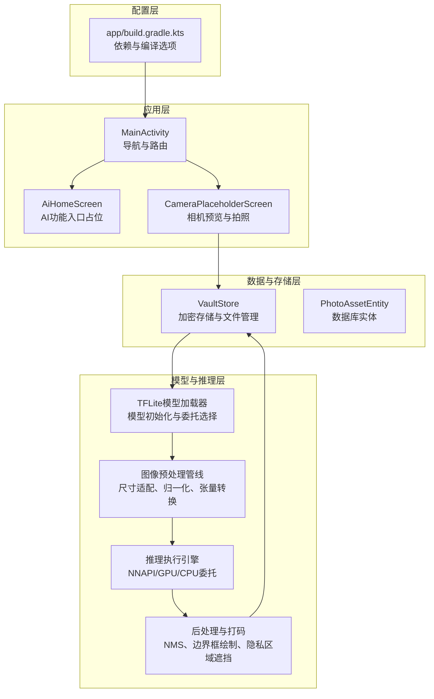
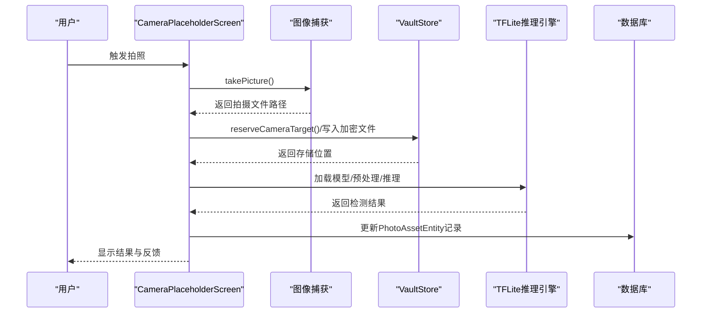
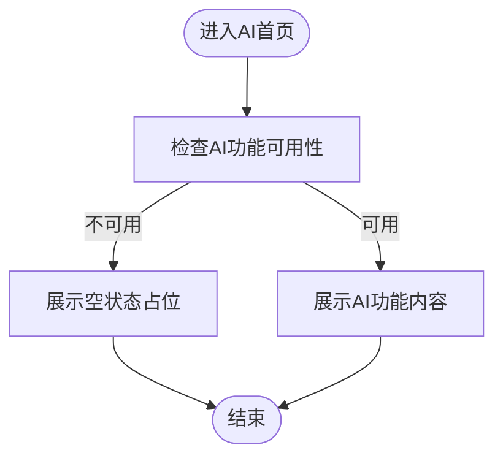
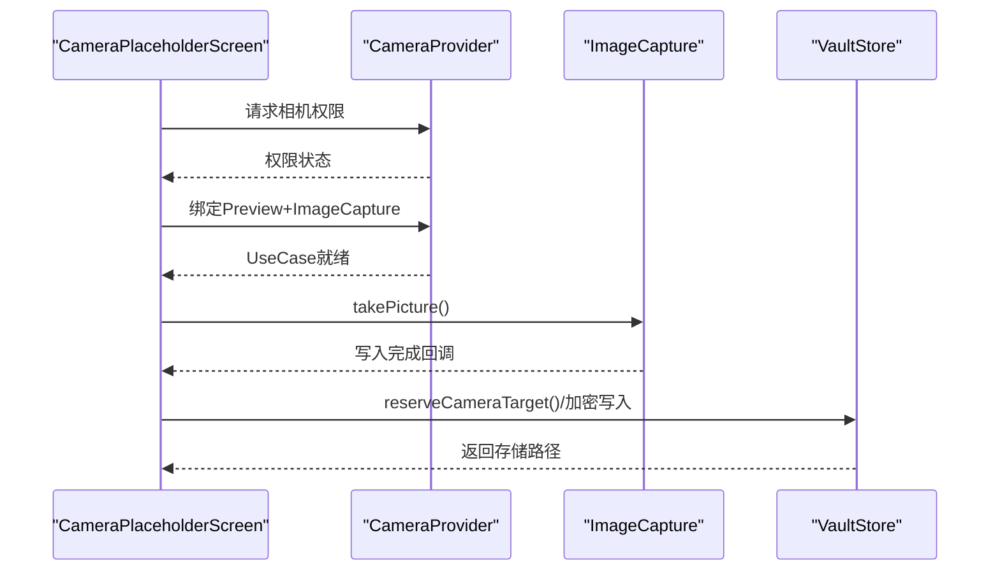
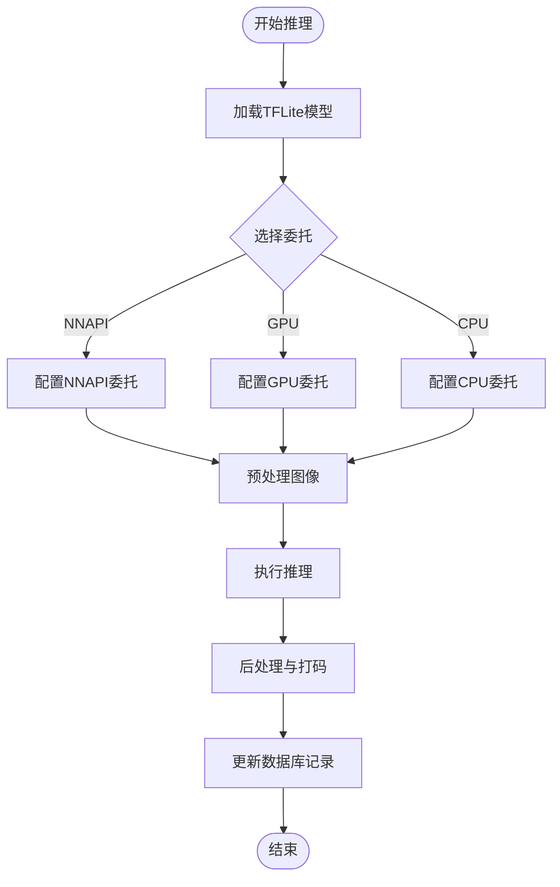
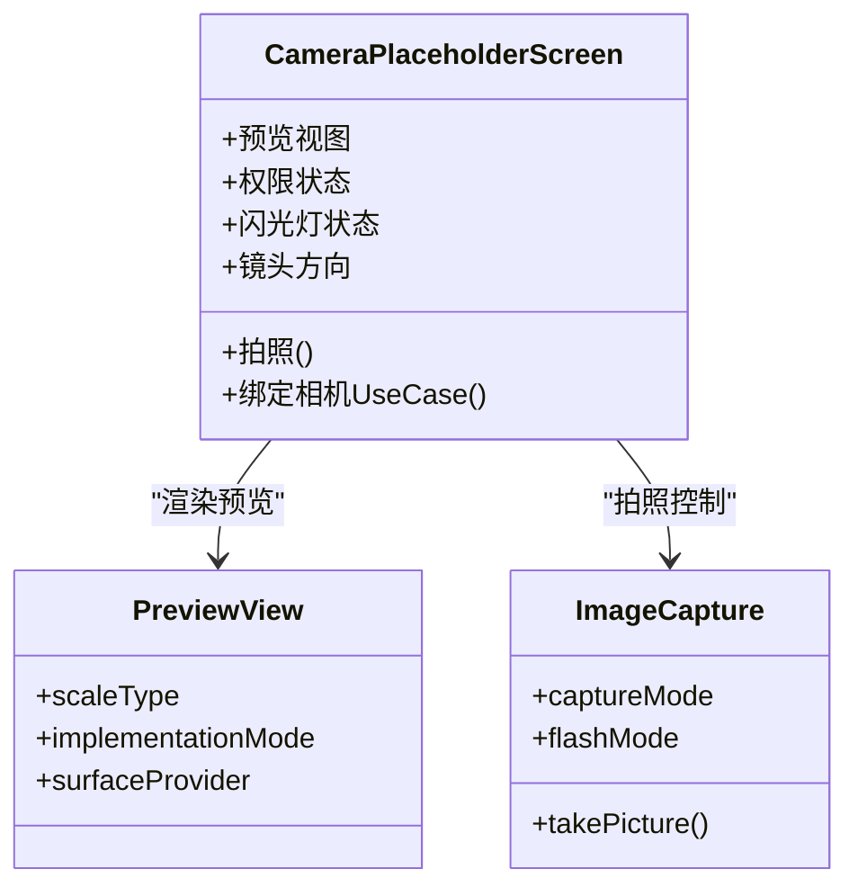
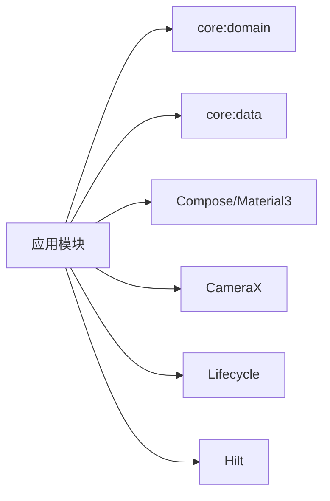

# TensorFlow Lite本地AI推理

<cite>
**本文档引用的文件**
- [AiHomeScreen.kt](file://android/app/src/main/kotlin/com/photovault/app/ui/AiHomeScreen.kt)
- [CameraPlaceholderScreen.kt](file://android/app/src/main/kotlin/com/photovault/app/ui/CameraPlaceholderScreen.kt)
- [MainActivity.kt](file://android/app/src/main/kotlin/com/photovault/app/MainActivity.kt)
- [app/build.gradle.kts](file://android/app/build.gradle.kts)
- [PhotoVaultApp.kt](file://android/app/src/main/kotlin/com/photovault/app/PhotoVaultApp.kt)
- [VaultStore.kt](file://android/app/src/main/kotlin/com/photovault/app/ui/vault/VaultStore.kt)
</cite>

## 目录
1. [简介](#简介)
2. [项目结构](#项目结构)
3. [核心组件](#核心组件)
4. [架构总览](#架构总览)
5. [详细组件分析](#详细组件分析)
6. [依赖关系分析](#依赖关系分析)
7. [性能考量](#性能考量)
8. [故障排除指南](#故障排除指南)
9. [结论](#结论)
10. [附录](#附录)

## 简介
本文件面向AI照片保险库的TensorFlow Lite本地AI推理能力，提供从框架选型、模型加载与推理执行、目标检测与智能打码算法、图像处理管线到UI集成与性能监控的完整技术说明。文档以仓库现有代码为基础，结合可落地的实现建议，帮助开发者在Android平台上构建高性能、低延迟、跨平台一致的本地AI推理体验。

## 项目结构
AI推理功能在当前仓库中主要通过以下层次组织：
- 应用层：负责导航、相机预览与拍照、以及AI功能入口的UI呈现
- 模型与推理层：负责模型加载、输入预处理、推理执行与后处理
- 数据与存储层：负责加密存储、文件IO与资源管理
- 配置层：Gradle依赖与编译选项

图表来源
- [MainActivity.kt:76-242](file://android/app/src/main/kotlin/com/photovault/app/MainActivity.kt#L76-L242)
- [AiHomeScreen.kt:24-54](file://android/app/src/main/kotlin/com/photovault/app/ui/AiHomeScreen.kt#L24-L54)
- [CameraPlaceholderScreen.kt:56-216](file://android/app/src/main/kotlin/com/photovault/app/ui/CameraPlaceholderScreen.kt#L56-L216)
- [app/build.gradle.kts:63-90](file://android/app/build.gradle.kts#L63-L90)

章节来源
- [MainActivity.kt:76-242](file://android/app/src/main/kotlin/com/photovault/app/MainActivity.kt#L76-L242)
- [AiHomeScreen.kt:24-54](file://android/app/src/main/kotlin/com/photovault/app/ui/AiHomeScreen.kt#L24-L54)
- [CameraPlaceholderScreen.kt:56-216](file://android/app/src/main/kotlin/com/photovault/app/ui/CameraPlaceholderScreen.kt#L56-L216)
- [app/build.gradle.kts:63-90](file://android/app/build.gradle.kts#L63-L90)

## 核心组件
- AI功能入口与占位UI：提供AI模块的导航入口与空状态展示，便于后续接入推理能力
- 相机预览与拍照：基于CameraX提供实时预览、闪光灯控制、前后摄像头切换与拍照落盘
- 存储与加密：通过VaultStore进行文件预留与加密写入，确保隐私数据安全
- 构建与依赖：Gradle配置声明了Compose、CameraX等关键依赖，为AI推理提供运行时环境

章节来源
- [AiHomeScreen.kt:24-54](file://android/app/src/main/kotlin/com/photovault/app/ui/AiHomeScreen.kt#L24-L54)
- [CameraPlaceholderScreen.kt:56-216](file://android/app/src/main/kotlin/com/photovault/app/ui/CameraPlaceholderScreen.kt#L56-L216)
- [app/build.gradle.kts:63-90](file://android/app/build.gradle.kts#L63-L90)

## 架构总览
下图展示了从UI到推理再到存储的整体调用链路，强调了相机预览、模型推理与存储写入的关键节点。

图表来源
- [CameraPlaceholderScreen.kt:250-277](file://android/app/src/main/kotlin/com/photovault/app/ui/CameraPlaceholderScreen.kt#L250-L277)
- [VaultStore.kt](file://android/app/src/main/kotlin/com/photovault/app/ui/vault/VaultStore.kt)

## 详细组件分析

### 组件A：AI功能入口与UI占位
- 职责：提供AI模块的导航入口与空状态展示，便于后续接入推理能力
- 关键点：通过HomeBottomNav与AiHomeScreen组合，形成统一的导航与布局风格
- 扩展建议：预留AI功能开关、性能监控面板与结果可视化区域

图表来源
- [AiHomeScreen.kt:24-54](file://android/app/src/main/kotlin/com/photovault/app/ui/AiHomeScreen.kt#L24-L54)

章节来源
- [AiHomeScreen.kt:24-54](file://android/app/src/main/kotlin/com/photovault/app/ui/AiHomeScreen.kt#L24-L54)

### 组件B：相机预览与拍照管线
- 职责：提供实时预览、权限申请、闪光灯控制、前后摄像头切换与拍照落盘
- 关键点：
  - 使用CameraX绑定Preview与ImageCapture UseCase
  - 采用最小化延迟捕获模式，降低拍摄时延
  - 通过VaultStore预留文件并写入加密存储
- 扩展建议：在拍照成功后触发AI推理与结果回显

图表来源
- [CameraPlaceholderScreen.kt:83-98](file://android/app/src/main/kotlin/com/photovault/app/ui/CameraPlaceholderScreen.kt#L83-L98)
- [CameraPlaceholderScreen.kt:250-277](file://android/app/src/main/kotlin/com/photovault/app/ui/CameraPlaceholderScreen.kt#L250-L277)

章节来源
- [CameraPlaceholderScreen.kt:83-98](file://android/app/src/main/kotlin/com/photovault/app/ui/CameraPlaceholderScreen.kt#L83-L98)
- [CameraPlaceholderScreen.kt:250-277](file://android/app/src/main/kotlin/com/photovault/app/ui/CameraPlaceholderScreen.kt#L250-L277)

### 组件C：模型加载与推理执行（设计蓝图）
- 模型加载
  - 选择TFLite模型文件，支持从assets或内部缓存目录加载
  - 基于设备能力选择委托：优先NNAPI，其次GPU，最后CPU
  - 支持异步加载与热身（warm-up）以减少首帧延迟
- 输入预处理
  - 图像尺寸适配：按模型输入分辨率缩放
  - 归一化与数据类型转换：如浮点化、NHWC格式
  - 张量分配与内存复用：避免频繁分配导致GC抖动
- 推理执行
  - 批处理与并发：对连续帧进行队列化处理
  - 委托参数调优：如NNAPI的加速级别、GPU的内存阈值
- 后处理与打码
  - NMS（非极大值抑制）：过滤重复边界框
  - 边界框映射：从模型输出坐标映射到原始图像坐标
  - 智能打码：对检测到的敏感区域进行遮挡或模糊处理

图表来源
- [CameraPlaceholderScreen.kt:250-277](file://android/app/src/main/kotlin/com/photovault/app/ui/CameraPlaceholderScreen.kt#L250-L277)

章节来源
- [CameraPlaceholderScreen.kt:250-277](file://android/app/src/main/kotlin/com/photovault/app/ui/CameraPlaceholderScreen.kt#L250-L277)

### 组件D：UI集成与实时预览
- 实时预览：通过CameraX的PreviewView在Compose中渲染
- 用户交互：闪光灯开关、镜头切换、拍照按钮与状态提示
- 性能监控：在UI中显示推理耗时、帧率与内存占用（建议）

图表来源
- [CameraPlaceholderScreen.kt:56-216](file://android/app/src/main/kotlin/com/photovault/app/ui/CameraPlaceholderScreen.kt#L56-L216)

章节来源
- [CameraPlaceholderScreen.kt:56-216](file://android/app/src/main/kotlin/com/photovault/app/ui/CameraPlaceholderScreen.kt#L56-L216)

## 依赖关系分析
- 应用层依赖：Compose UI、Navigation、CameraX、Hilt等
- 运行时要求：Android API Level 26+，Kotlin JVM Target 21
- 构建优化：Release构建启用混淆与资源收缩，Debug构建便于调试

图表来源
- [app/build.gradle.kts:63-90](file://android/app/build.gradle.kts#L63-L90)

章节来源
- [app/build.gradle.kts:63-90](file://android/app/build.gradle.kts#L63-L90)

## 性能考量
- 委托选择与加速
  - NNAPI：优先选择，适合ARM NNAPI加速；可设置加速级别与内存偏好
  - GPU：适合大规模矩阵运算，需注意内存阈值与同步开销
  - CPU：保证兼容性与可移植性，适合轻量模型
- 内存管理
  - 复用输入/输出张量缓冲区，避免频繁分配
  - 控制批大小与并发度，防止内存峰值过高
  - 及时释放不再使用的中间结果
- 精度与量化
  - INT8/FP16量化：在精度与速度间权衡，建议通过校准集评估损失
  - 动态/整数量化：根据部署场景选择，注意校准数据代表性
- 跨平台兼容性
  - 通过TFLite Runtime保证Android/iOS一致性
  - 对不同SoC的NNAPI版本进行降级兼容
- 实时性优化
  - 预热模型与Warm-up
  - 预处理与推理流水线化
  - UI线程与IO线程分离，避免阻塞

## 故障排除指南
- 相机权限问题
  - 确认已在清单中声明相机权限并在运行时请求
  - 在无权限时禁用拍照按钮并提示用户
- 拍照失败
  - 检查存储空间与文件写入权限
  - 捕获异常并回退到错误提示
- 推理异常
  - 捕获TFLite异常并记录日志
  - 回退到CPU委托或简化模型
- 性能问题
  - 降低分辨率或批大小
  - 关闭GPU委托或调整NNAPI参数
  - 启用内存池与缓冲复用

章节来源
- [CameraPlaceholderScreen.kt:76-81](file://android/app/src/main/kotlin/com/photovault/app/ui/CameraPlaceholderScreen.kt#L76-L81)
- [CameraPlaceholderScreen.kt:263-277](file://android/app/src/main/kotlin/com/photovault/app/ui/CameraPlaceholderScreen.kt#L263-L277)

## 结论
本方案以CameraX提供稳定的相机预览与拍照能力，结合TFLite本地推理实现目标检测与智能打码。通过合理的委托选择、内存管理与精度权衡，可在保证用户体验的同时实现跨平台一致的性能表现。建议在现有UI基础上扩展推理流程与性能监控，逐步完善端到端的AI功能闭环。

## 附录
- 代码片段路径参考
  - [相机预览与拍照:83-98](file://android/app/src/main/kotlin/com/photovault/app/ui/CameraPlaceholderScreen.kt#L83-L98)
  - [拍照落盘与写入:250-277](file://android/app/src/main/kotlin/com/photovault/app/ui/CameraPlaceholderScreen.kt#L250-L277)
  - [AI功能入口占位:24-54](file://android/app/src/main/kotlin/com/photovault/app/ui/AiHomeScreen.kt#L24-L54)
  - [应用导航与路由:76-242](file://android/app/src/main/kotlin/com/photovault/app/MainActivity.kt#L76-L242)
  - [构建依赖与编译选项:63-90](file://android/app/build.gradle.kts#L63-L90)