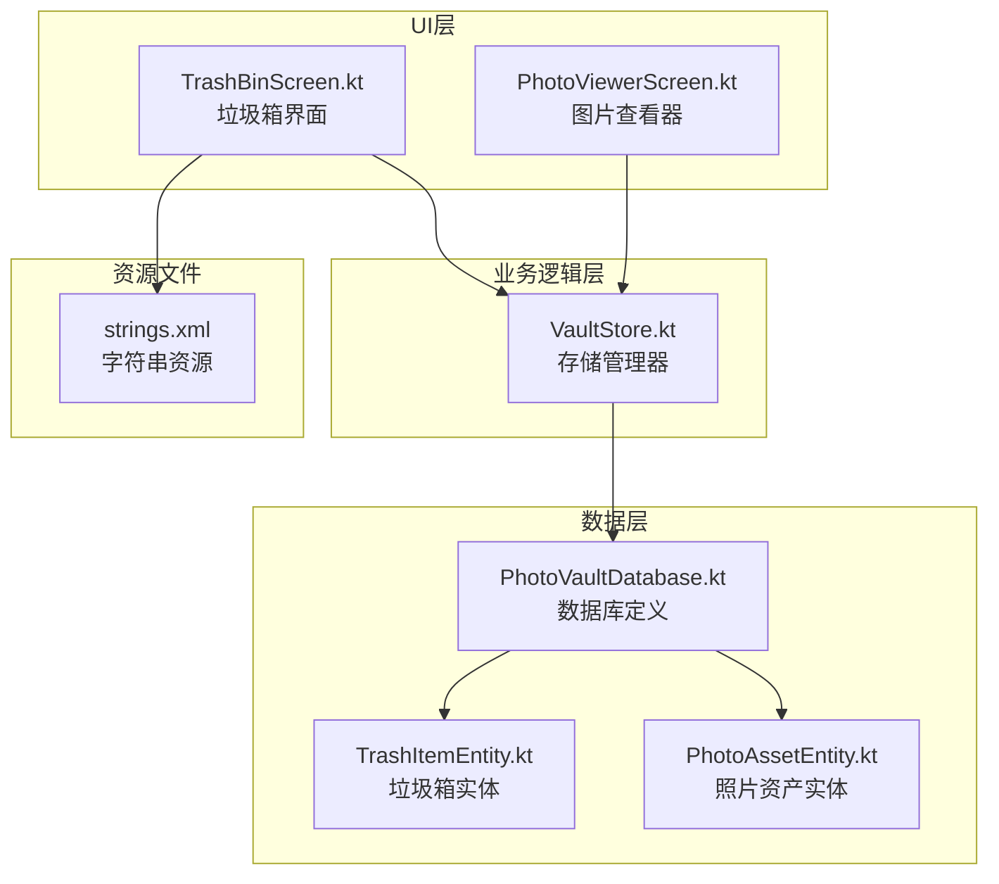
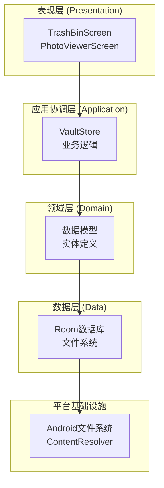
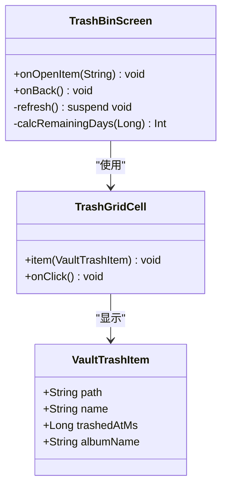
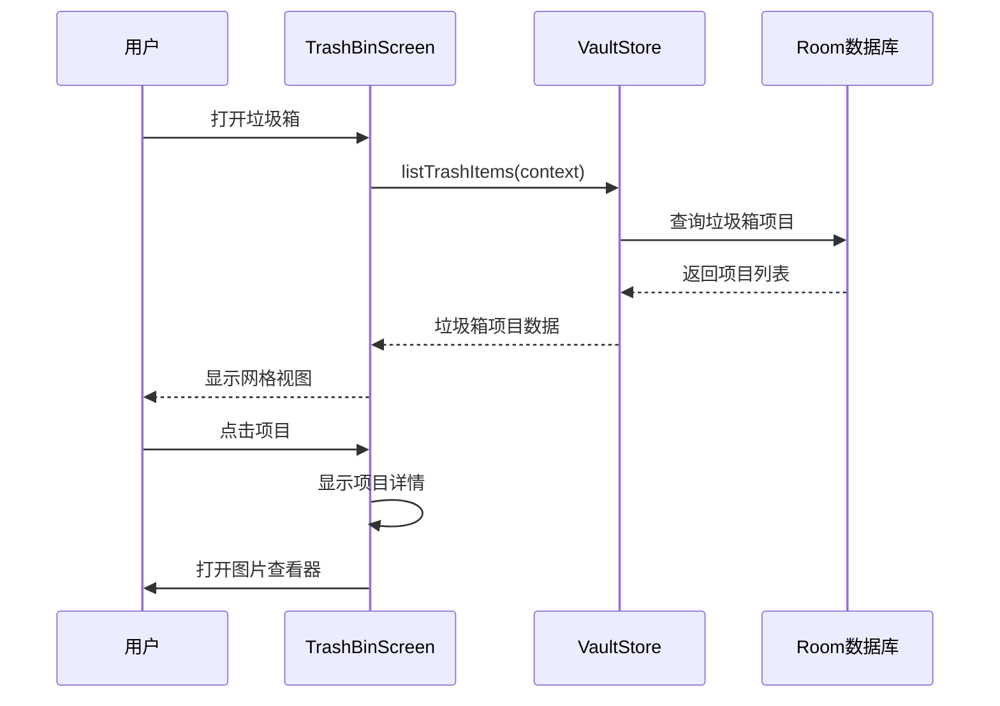
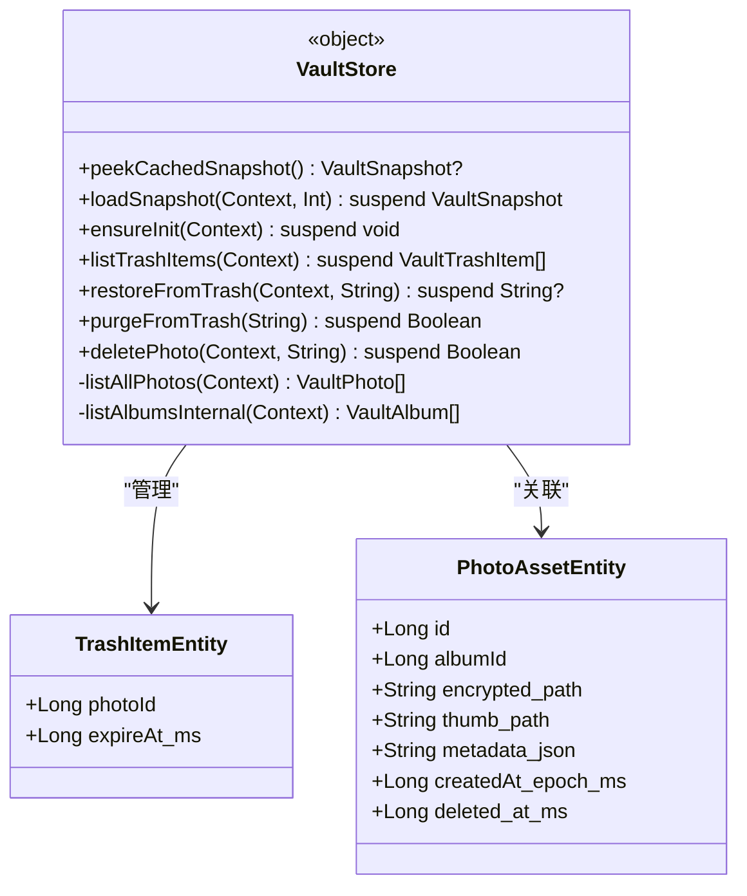
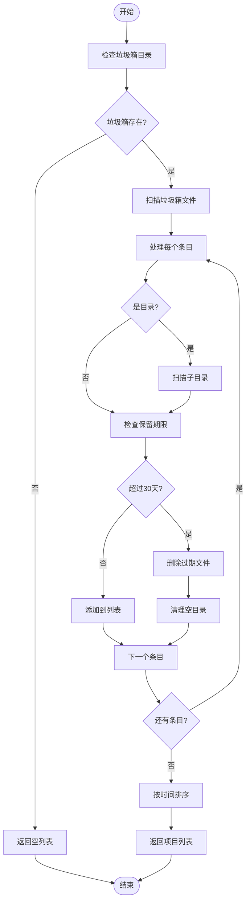
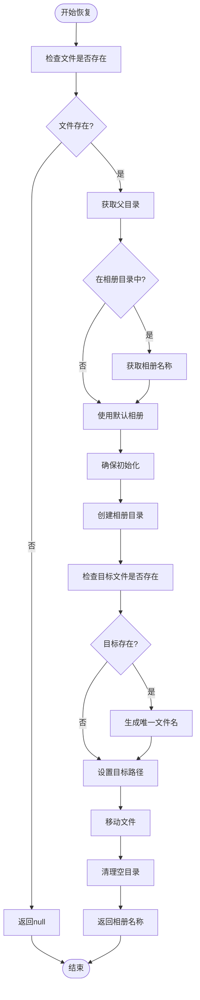
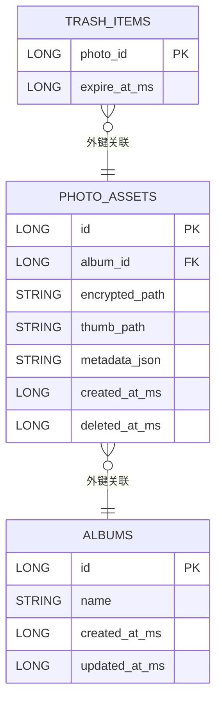
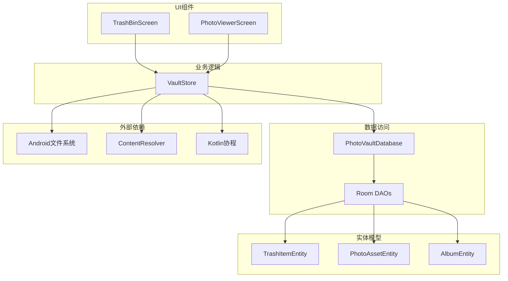

# 保险库垃圾箱回收系统

<cite>
**本文档引用的文件**
- [TrashBinScreen.kt](file://android/app/src/main/kotlin/com/xpx/vault/ui/TrashBinScreen.kt)
- [VaultStore.kt](file://android/app/src/main/kotlin/com/xpx/vault/ui/vault/VaultStore.kt)
- [PhotoViewerScreen.kt](file://android/app/src/main/kotlin/com/xpx/vault/ui/PhotoViewerScreen.kt)
- [TrashItemEntity.kt](file://android/core/data/src/main/kotlin/com/xpx/vault/data/db/entity/TrashItemEntity.kt)
- [PhotoAssetEntity.kt](file://android/core/data/src/main/kotlin/com/xpx/vault/data/db/entity/PhotoAssetEntity.kt)
- [PhotoVaultDatabase.kt](file://android/core/data/src/main/kotlin/com/xpx/vault/data/db/PhotoVaultDatabase.kt)
- [strings.xml](file://android/app/src/main/res/values/strings.xml)
- [02-照片导入与AES本地加密.md](file://doc/android/02-照片导入与AES本地加密.md)
- [私密相册 App（一期）原生双端架构设计方案.md](file://spec/私密相册 App（一期）原生双端架构设计方案.md)
</cite>

## 更新摘要
**变更内容**
- 增强了垃圾箱恢复功能，改进了VaultStore.restoreFromTrash方法
- 新增了专辑名称返回机制，支持导航到原始位置
- 更新了PhotoViewerScreen中的恢复按钮交互逻辑
- 完善了垃圾箱项目恢复后的导航功能

## 目录
1. [简介](#简介)
2. [项目结构](#项目结构)
3. [核心组件](#核心组件)
4. [架构概览](#架构概览)
5. [详细组件分析](#详细组件分析)
6. [依赖关系分析](#依赖关系分析)
7. [性能考虑](#性能考虑)
8. [故障排除指南](#故障排除指南)
9. [结论](#结论)

## 简介

保险库垃圾箱回收系统是AI照片保险库应用中的重要功能模块，负责管理用户删除的照片和视频。该系统实现了30天的自动保留期机制，提供完整的垃圾箱浏览、恢复和彻底删除功能，确保用户能够安全地管理他们的私密内容。

系统采用本地存储架构，所有数据都保存在应用的私有目录中，确保用户隐私和数据安全。通过Room数据库和文件系统双重机制，系统实现了高效的数据管理和持久化存储。

**更新** 系统现已增强垃圾箱恢复功能，恢复操作不仅能够将项目恢复到原始相册，还能返回恢复后的相册名称，为用户提供更智能的导航体验。

## 项目结构

保险库垃圾箱回收系统主要分布在以下模块中：

**图表来源**
- [TrashBinScreen.kt:1-177](file://android/app/src/main/kotlin/com/xpx/vault/ui/TrashBinScreen.kt#L1-L177)
- [VaultStore.kt:1-377](file://android/app/src/main/kotlin/com/xpx/vault/ui/vault/VaultStore.kt#L1-L377)
- [PhotoVaultDatabase.kt:1-38](file://android/core/data/src/main/kotlin/com/xpx/vault/data/db/PhotoVaultDatabase.kt#L1-L38)

**章节来源**
- [TrashBinScreen.kt:1-177](file://android/app/src/main/kotlin/com/xpx/vault/ui/TrashBinScreen.kt#L1-L177)
- [VaultStore.kt:1-377](file://android/app/src/main/kotlin/com/xpx/vault/ui/vault/VaultStore.kt#L1-L377)
- [PhotoVaultDatabase.kt:1-38](file://android/core/data/src/main/kotlin/com/xpx/vault/data/db/PhotoVaultDatabase.kt#L1-L38)

## 核心组件

### 垃圾箱界面组件

TrashBinScreen是垃圾箱功能的主要用户界面，提供了直观的网格视图来展示所有已删除的项目。

**主要功能特性：**
- 3列网格布局展示垃圾箱项目
- 实时显示剩余保留天数
- 支持项目点击查看详情
- 自动刷新机制确保数据最新
- 生命周期感知的自动更新

### 存储管理器

VaultStore是整个垃圾箱系统的核心业务逻辑组件，负责管理所有存储相关的操作。

**核心职责：**
- 垃圾箱项目的列表管理
- 项目恢复和彻底删除操作
- 自动清理过期项目
- 文件系统操作封装

**更新** 增强的恢复功能：`restoreFromTrash`方法现在返回恢复后的相册名称，支持智能导航到原始位置。

### 数据模型

系统使用Room数据库来持久化垃圾箱相关信息，同时结合文件系统来实际存储被删除的文件。

**数据模型设计：**
- TrashItemEntity：垃圾箱项目实体
- PhotoAssetEntity：照片资产实体
- 通过外键关系建立数据关联

**章节来源**
- [TrashBinScreen.kt:50-177](file://android/app/src/main/kotlin/com/xpx/vault/ui/TrashBinScreen.kt#L50-L177)
- [VaultStore.kt:64-302](file://android/app/src/main/kotlin/com/xpx/vault/ui/vault/VaultStore.kt#L64-L302)
- [TrashItemEntity.kt:1-25](file://android/core/data/src/main/kotlin/com/xpx/vault/data/db/entity/TrashItemEntity.kt#L1-L25)

## 架构概览

保险库垃圾箱回收系统采用了清晰的分层架构设计，遵循Android开发的最佳实践：

**图表来源**
- [私密相册 App（一期）原生双端架构设计方案.md:20-52](file://spec/私密相册 App（一期）原生双端架构设计方案.md#L20-L52)
- [VaultStore.kt:1-377](file://android/app/src/main/kotlin/com/xpx/vault/ui/vault/VaultStore.kt#L1-L377)

系统架构特点：
- **分层清晰**：UI层、应用层、领域层、数据层职责明确
- **依赖倒置**：上层依赖于抽象而非具体实现
- **数据持久化**：Room数据库 + 文件系统双重保障
- **异步处理**：使用Kotlin协程处理耗时操作

## 详细组件分析

### 垃圾箱界面组件分析

TrashBinScreen组件实现了完整的垃圾箱浏览功能：

**图表来源**
- [TrashBinScreen.kt:50-177](file://android/app/src/main/kotlin/com/xpx/vault/ui/TrashBinScreen.kt#L50-L177)

**核心交互流程：**

**图表来源**
- [TrashBinScreen.kt:61-75](file://android/app/src/main/kotlin/com/xpx/vault/ui/TrashBinScreen.kt#L61-L75)
- [VaultStore.kt:217-258](file://android/app/src/main/kotlin/com/xpx/vault/ui/vault/VaultStore.kt#L217-L258)

### 存储管理器详细分析

VaultStore组件是垃圾箱系统的核心，提供了完整的存储管理功能：

**图表来源**
- [VaultStore.kt:64-302](file://android/app/src/main/kotlin/com/xpx/vault/ui/vault/VaultStore.kt#L64-L302)
- [TrashItemEntity.kt:21-24](file://android/core/data/src/main/kotlin/com/xpx/vault/data/db/entity/TrashItemEntity.kt#L21-L24)
- [PhotoAssetEntity.kt:24-32](file://android/core/data/src/main/kotlin/com/xpx/vault/data/db/entity/PhotoAssetEntity.kt#L24-L32)

**垃圾箱项目管理流程：**

**图表来源**
- [VaultStore.kt:217-258](file://android/app/src/main/kotlin/com/xpx/vault/ui/vault/VaultStore.kt#L217-L258)

**更新** 增强的恢复功能实现：

**图表来源**
- [VaultStore.kt:260-289](file://android/app/src/main/kotlin/com/xpx/vault/ui/vault/VaultStore.kt#L260-L289)

### 数据模型设计

系统使用Room数据库来持久化垃圾箱相关信息：

**图表来源**
- [TrashItemEntity.kt:9-24](file://android/core/data/src/main/kotlin/com/xpx/vault/data/db/entity/TrashItemEntity.kt#L9-L24)
- [PhotoAssetEntity.kt:9-32](file://android/core/data/src/main/kotlin/com/xpx/vault/data/db/entity/PhotoAssetEntity.kt#L9-L32)

**章节来源**
- [VaultStore.kt:217-302](file://android/app/src/main/kotlin/com/xpx/vault/ui/vault/VaultStore.kt#L217-L302)
- [PhotoVaultDatabase.kt:15-36](file://android/core/data/src/main/kotlin/com/xpx/vault/data/db/PhotoVaultDatabase.kt#L15-L36)

## 依赖关系分析

系统各组件之间的依赖关系如下：

**图表来源**
- [VaultStore.kt:1-377](file://android/app/src/main/kotlin/com/xpx/vault/ui/vault/VaultStore.kt#L1-L377)
- [PhotoVaultDatabase.kt:1-38](file://android/core/data/src/main/kotlin/com/xpx/vault/data/db/PhotoVaultDatabase.kt#L1-L38)

**依赖特点：**
- **单向依赖**：UI → 业务逻辑 → 数据访问 → 实体模型
- **抽象隔离**：业务逻辑层不直接依赖具体实现
- **异步处理**：所有耗时操作都在后台协程中执行
- **文件系统集成**：直接操作Android文件系统

**章节来源**
- [VaultStore.kt:1-10](file://android/app/src/main/kotlin/com/xpx/vault/ui/vault/VaultStore.kt#L1-L10)
- [PhotoVaultDatabase.kt:15-36](file://android/core/data/src/main/kotlin/com/xpx/vault/data/db/PhotoVaultDatabase.kt#L15-L36)

## 性能考虑

### 异步处理策略

系统采用Kotlin协程来处理所有可能阻塞的操作：

- **IO密集型操作**：文件系统读写、数据库查询
- **CPU密集型操作**：加密解密、图像处理
- **后台执行器**：使用Dispatchers.IO和Dispatchers.Default

### 内存管理

- **懒加载**：图片采用渐进式加载
- **缓存机制**：Snapshots和相册照片缓存
- **及时释放**：使用DisposableEffect管理生命周期

### 存储优化

- **30天保留期**：自动清理过期项目
- **文件系统操作**：直接文件重命名而非复制
- **索引优化**：数据库字段建立适当索引

## 故障排除指南

### 常见问题及解决方案

**垃圾箱项目显示为空**
- 检查垃圾箱目录是否存在
- 验证文件权限是否正确
- 确认应用是否有足够的存储空间

**项目无法恢复**
- 检查目标相册是否存在
- 验证文件系统权限
- 确认磁盘空间充足

**过期项目未自动清理**
- 检查系统时间设置
- 验证保留期限配置
- 查看应用日志

**恢复后无法导航到相册**
- 检查返回的相册名称是否为空
- 验证相册目录是否正确创建
- 确认文件移动操作是否成功

### 调试建议

1. **启用详细日志**：在开发模式下启用更多调试信息
2. **监控存储空间**：定期检查垃圾箱占用情况
3. **测试边界条件**：验证极端情况下的系统行为

**章节来源**
- [VaultStore.kt:217-302](file://android/app/src/main/kotlin/com/xpx/vault/ui/vault/VaultStore.kt#L217-L302)
- [strings.xml:232-240](file://android/app/src/main/res/values/strings.xml#L232-L240)

## 结论

保险库垃圾箱回收系统是一个设计精良、功能完整的数据管理模块。系统通过清晰的分层架构、合理的数据模型设计和高效的实现策略，为用户提供了可靠的垃圾箱管理功能。

**系统优势：**
- **安全性**：所有数据本地存储，符合隐私保护要求
- **可靠性**：30天自动清理机制确保存储空间管理
- **用户体验**：直观的界面设计和流畅的交互体验
- **智能化**：增强的恢复功能支持智能导航到原始位置
- **可维护性**：清晰的代码结构和完善的注释

**更新亮点：**
- **智能恢复**：恢复操作现在返回相册名称，支持自动导航
- **用户体验提升**：用户无需手动查找恢复的项目位置
- **功能完整性**：完整的恢复流程包括导航到原始位置

**未来改进方向：**
- 增加垃圾箱项目搜索功能
- 优化大量项目时的性能表现
- 提供垃圾箱使用统计和分析功能
- 增强数据恢复的安全验证机制
- 扩展批量恢复功能

该系统为AI照片保险库应用提供了坚实的数据管理基础，确保用户能够安全、可靠地管理他们的私密内容。增强的垃圾箱恢复功能进一步提升了用户体验，使数据管理更加智能和便捷。