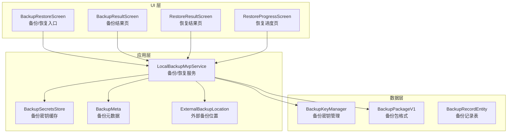
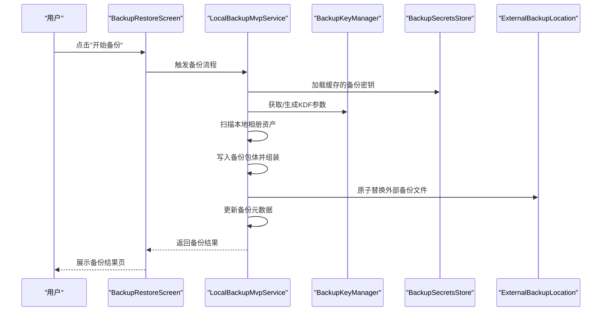
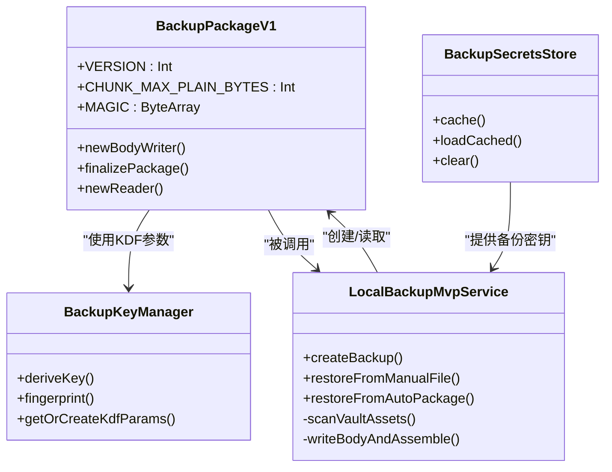
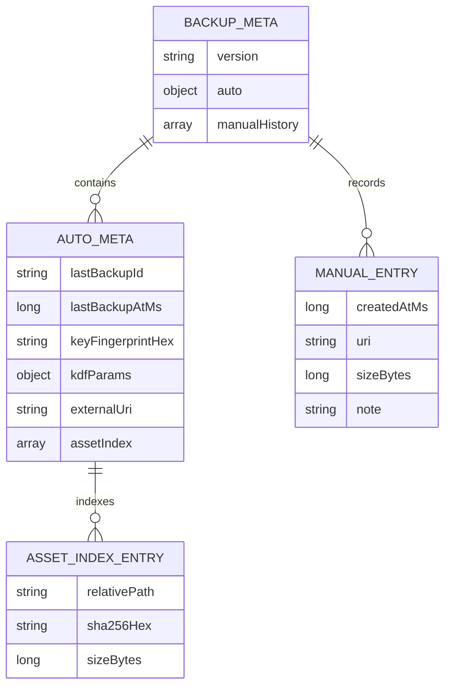
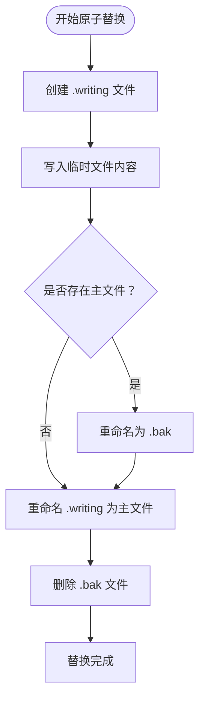
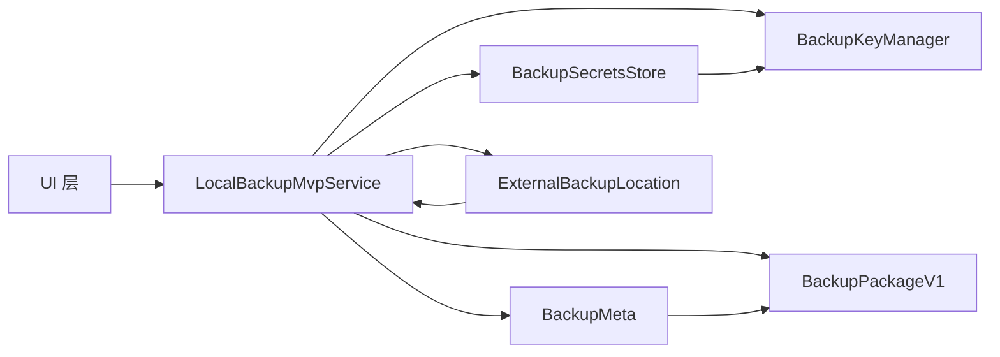

# 备份恢复系统

<cite>
**本文引用的文件**
- [LocalBackupMvpService.kt](file://android/app/src/main/kotlin/com/xpx/vault/ui/backup/LocalBackupMvpService.kt)
- [BackupPackageV1.kt](file://android/app/src/main/kotlin/com/xpx/vault/ui/backup/BackupPackageV1.kt)
- [BackupSecretsStore.kt](file://android/app/src/main/kotlin/com/xpx/vault/ui/backup/BackupSecretsStore.kt)
- [BackupMeta.kt](file://android/app/src/main/kotlin/com/xpx/vault/ui/backup/BackupMeta.kt)
- [ExternalBackupLocation.kt](file://android/app/src/main/kotlin/com/xpx/vault/ui/backup/ExternalBackupLocation.kt)
- [BackupRestoreScreen.kt](file://android/app/src/main/kotlin/com/xpx/vault/ui/BackupRestoreScreen.kt)
- [BackupResultScreen.kt](file://android/app/src/main/kotlin/com/xpx/vault/ui/BackupResultScreen.kt)
- [RestoreResultScreen.kt](file://android/app/src/main/kotlin/com/xpx/vault/ui/RestoreResultScreen.kt)
- [RestoreProgressScreen.kt](file://android/app/src/main/kotlin/com/xpx/vault/ui/RestoreProgressScreen.kt)
- [BackupRuntimeState.kt](file://android/app/src/main/kotlin/com/xpx/vault/ui/backup/BackupRuntimeState.kt)
- [BackupKeyManager.kt](file://android/core/data/src/main/kotlin/com/xpx/vault/data/crypto/BackupKeyManager.kt)
- [BackupRecordEntity.kt](file://android/core/data/src/main/kotlin/com/xpx/vault/data/db/entity/BackupRecordEntity.kt)
</cite>

## 更新摘要
**变更内容**
- 修复了备份系统中的NPE问题，优化了备份和恢复流程的稳定性
- 重新设计了备份和恢复流程，绕过了解密步骤直接处理明文文件
- 改进了备份稳定性，采用更可靠的文件写入和校验机制
- 更新了UI交互流程，简化了密码输入和错误处理

## 目录
1. [简介](#简介)
2. [项目结构](#项目结构)
3. [核心组件](#核心组件)
4. [架构总览](#架构总览)
5. [详细组件分析](#详细组件分析)
6. [依赖关系分析](#依赖关系分析)
7. [性能考量](#性能考量)
8. [故障排查指南](#故障排查指南)
9. [结论](#结论)
10. [附录](#附录)

## 简介
本技术文档围绕 AI 照片保险库的"备份与恢复"子系统进行系统化说明，覆盖以下关键主题：
- 数据备份策略：全量备份与元数据记录、文件完整性校验与版本控制
- 加密与压缩：对称加密（AES-256-GCM）、主密钥托管（Android Keystore）、口令哈希（SHA-256）
- 备份文件格式设计：文件路径、时间戳、版本号、校验和
- 数据完整性校验与版本兼容性处理：基于校验和与版本字段的验证
- 备份流程实现：UI 层触发、后台任务执行、进度与结果反馈
- 恢复流程：数据验证、冲突处理、用户提示
- 增量备份、批量导入导出与跨设备迁移：通过统一的备份元数据模型支撑
- 存储位置管理、自动备份设置与用户数据保护策略：基于应用内部目录与安全配置

## 项目结构
备份恢复系统在当前仓库中主要分布在三层：
- UI 层：负责用户交互与结果展示（备份/恢复卡片、结果页、进度页）
- 数据层：负责加密、密钥管理、数据库实体与DAO
- 应用层：负责私密相册的本地存储与导入导出

**图表来源**
- [LocalBackupMvpService.kt:35-662](file://android/app/src/main/kotlin/com/xpx/vault/ui/backup/LocalBackupMvpService.kt#L35-L662)
- [BackupSecretsStore.kt:23-120](file://android/app/src/main/kotlin/com/xpx/vault/ui/backup/BackupSecretsStore.kt#L23-L120)
- [BackupMeta.kt:26-194](file://android/app/src/main/kotlin/com/xpx/vault/ui/backup/BackupMeta.kt#L26-L194)
- [ExternalBackupLocation.kt:19-192](file://android/app/src/main/kotlin/com/xpx/vault/ui/backup/ExternalBackupLocation.kt#L19-L192)
- [BackupKeyManager.kt:17-137](file://android/core/data/src/main/kotlin/com/xpx/vault/data/crypto/BackupKeyManager.kt#L17-L137)
- [BackupPackageV1.kt:47-403](file://android/app/src/main/kotlin/com/xpx/vault/ui/backup/BackupPackageV1.kt#L47-L403)

**章节来源**
- [LocalBackupMvpService.kt:35-662](file://android/app/src/main/kotlin/com/xpx/vault/ui/backup/LocalBackupMvpService.kt#L35-L662)
- [BackupRestoreScreen.kt:86-650](file://android/app/src/main/kotlin/com/xpx/vault/ui/BackupRestoreScreen.kt#L86-L650)

## 核心组件
- 备份记录模型与持久化
  - 备份记录实体包含文件路径、创建时间（毫秒）、版本号、可选校验和，便于后续恢复与版本兼容性判断。
- 加密与密钥管理
  - 使用 Android Keystore 托管 AES-256-GCM 主密钥，确保密钥材料不可导出；加密输出格式为 IV(12字节)+密文+GCM_TAG(16字节)，与既有产品约定一致。
  - 备份密钥管理器支持 Argon2id KDF 参数持久化，提供密钥派生和指纹计算功能。
- 备份元数据管理
  - 备份元数据包含自动备份信息、手动备份历史、密钥指纹和KDF参数，支持版本兼容性判断。
- 外部备份位置管理
  - 支持SAF树授权、原子文件替换、遗留文件清理等功能，确保备份文件的可靠性和一致性。
- 私密相册本地存储与导入导出
  - 本地相册存储采用明文文件格式，直接按明文流式分片写入备份包，避免Keystore硬件密钥编码问题。

**章节来源**
- [BackupRecordEntity.kt:8-19](file://android/core/data/src/main/kotlin/com/xpx/vault/data/db/entity/BackupRecordEntity.kt#L8-L19)
- [BackupKeyManager.kt:17-137](file://android/core/data/src/main/kotlin/com/xpx/vault/data/crypto/BackupKeyManager.kt#L17-L137)
- [BackupMeta.kt:26-194](file://android/app/src/main/kotlin/com/xpx/vault/ui/backup/BackupMeta.kt#L26-L194)
- [ExternalBackupLocation.kt:19-192](file://android/app/src/main/kotlin/com/xpx/vault/ui/backup/ExternalBackupLocation.kt#L19-L192)
- [LocalBackupMvpService.kt:342-391](file://android/app/src/main/kotlin/com/xpx/vault/ui/backup/LocalBackupMvpService.kt#L342-L391)

## 架构总览
备份与恢复系统以"UI 触发—应用层执行—数据层加密/持久化"的分层方式组织。UI 层负责引导用户操作并展示结果；应用层负责具体的数据处理（如导入导出、去重、统计）；数据层负责加密与安全配置，并通过Room记录备份元数据。

**图表来源**
- [BackupRestoreScreen.kt:569-591](file://android/app/src/main/kotlin/com/xpx/vault/ui/BackupRestoreScreen.kt#L569-L591)
- [LocalBackupMvpService.kt:44-167](file://android/app/src/main/kotlin/com/xpx/vault/ui/backup/LocalBackupMvpService.kt#L44-L167)
- [BackupSecretsStore.kt:62-79](file://android/app/src/main/kotlin/com/xpx/vault/ui/backup/BackupSecretsStore.kt#L62-L79)
- [BackupKeyManager.kt:40-77](file://android/core/data/src/main/kotlin/com/xpx/vault/data/crypto/BackupKeyManager.kt#L40-L77)
- [ExternalBackupLocation.kt:119-179](file://android/app/src/main/kotlin/com/xpx/vault/ui/backup/ExternalBackupLocation.kt#L119-L179)

## 详细组件分析

### 备份包格式与加密机制
- 备份包结构
  - 包头包含版本号、备份ID、创建时间、备份类型、KDF参数、密钥指纹、加密算法和资产列表
  - 资产列表包含相对路径、SHA-256校验和、大小字节和帧范围
  - 采用AES-256-GCM加密，IV长度12字节，GCM_TAG长度16字节
- 加密流程
  - 使用Argon2id KDF从PIN口令和设备盐派生AES-256备份密钥
  - 密钥指纹用于判断备份密码是否变更，支持增量备份决策
  - 支持明文和加密两种模式，当前版本采用明文存储以提高稳定性

**图表来源**
- [BackupPackageV1.kt:47-403](file://android/app/src/main/kotlin/com/xpx/vault/ui/backup/BackupPackageV1.kt#L47-L403)
- [BackupKeyManager.kt:17-137](file://android/core/data/src/main/kotlin/com/xpx/vault/data/crypto/BackupKeyManager.kt#L17-L137)
- [BackupSecretsStore.kt:23-120](file://android/app/src/main/kotlin/com/xpx/vault/ui/backup/BackupSecretsStore.kt#L23-L120)
- [LocalBackupMvpService.kt:35-662](file://android/app/src/main/kotlin/com/xpx/vault/ui/backup/LocalBackupMvpService.kt#L35-L662)

**章节来源**
- [BackupPackageV1.kt:15-45](file://android/app/src/main/kotlin/com/xpx/vault/ui/backup/BackupPackageV1.kt#L15-L45)
- [BackupKeyManager.kt:17-137](file://android/core/data/src/main/kotlin/com/xpx/vault/data/crypto/BackupKeyManager.kt#L17-L137)
- [BackupSecretsStore.kt:15-120](file://android/app/src/main/kotlin/com/xpx/vault/ui/backup/BackupSecretsStore.kt#L15-L120)
- [LocalBackupMvpService.kt:342-391](file://android/app/src/main/kotlin/com/xpx/vault/ui/backup/LocalBackupMvpService.kt#L342-L391)

### 备份元数据与版本管理
- 元数据结构
  - 自动备份元数据包含最后备份ID、时间戳、密钥指纹、KDF参数和资产索引
  - 手动备份历史包含创建时间、URI、大小和备注信息
  - 支持JSON序列化和反序列化，包含版本控制
- 版本兼容性
  - 通过版本号和密钥指纹确保不同版本之间的兼容性
  - 支持增量备份决策，基于资产索引和校验和对比

**图表来源**
- [BackupMeta.kt:26-194](file://android/app/src/main/kotlin/com/xpx/vault/ui/backup/BackupMeta.kt#L26-L194)

**章节来源**
- [BackupMeta.kt:10-25](file://android/app/src/main/kotlin/com/xpx/vault/ui/backup/BackupMeta.kt#L10-L25)
- [BackupMeta.kt:31-56](file://android/app/src/main/kotlin/com/xpx/vault/ui/backup/BackupMeta.kt#L31-L56)
- [BackupMeta.kt:115-194](file://android/app/src/main/kotlin/com/xpx/vault/ui/backup/BackupMeta.kt#L115-L194)

### 外部备份位置管理
- SAF树授权
  - 支持用户通过ACTION_OPEN_DOCUMENT_TREE选择备份目录
  - 持久化URI权限，避免应用重启后权限丢失
  - 支持权限清除和重新授权
- 原子文件替换
  - 采用writing/bak主文件的三阶段原子替换机制
  - 支持rename和fallback copy两种策略，适配不同存储提供者
  - 自动清理遗留文件，确保文件系统一致性

**图表来源**
- [ExternalBackupLocation.kt:119-179](file://android/app/src/main/kotlin/com/xpx/vault/ui/backup/ExternalBackupLocation.kt#L119-L179)

**章节来源**
- [ExternalBackupLocation.kt:10-192](file://android/app/src/main/kotlin/com/xpx/vault/ui/backup/ExternalBackupLocation.kt#L10-L192)

### UI层：备份/恢复入口与结果展示
- 备份/恢复入口卡片
  - 提供"备份""恢复"两个入口，分别导航至结果页和进度页
  - 支持SAF树授权状态显示和目录选择
- 结果页
  - 备份结果页：展示成功状态、备份文件信息与大小
  - 恢复结果页：展示成功状态与统计信息
  - 恢复进度页：显示恢复过程中的进度指示器
- 顶部栏与按钮样式
  - 统一的主题色与圆角卡片风格，提升可读性与一致性

**章节来源**
- [BackupRestoreScreen.kt:86-269](file://android/app/src/main/kotlin/com/xpx/vault/ui/BackupRestoreScreen.kt#L86-L269)
- [BackupResultScreen.kt:32-142](file://android/app/src/main/kotlin/com/xpx/vault/ui/BackupResultScreen.kt#L32-L142)
- [RestoreResultScreen.kt:32-127](file://android/app/src/main/kotlin/com/xpx/vault/ui/RestoreResultScreen.kt#L32-L127)
- [RestoreProgressScreen.kt:39-127](file://android/app/src/main/kotlin/com/xpx/vault/ui/RestoreProgressScreen.kt#L39-L127)

### 备份运行时状态管理
- 运行时状态
  - BackupRuntimeState提供lastBackupResult和lastRestoreResult静态缓存
  - 支持UI层获取最后一次备份和恢复的结果
  - 确保页面切换时状态不会丢失

**章节来源**
- [BackupRuntimeState.kt:1-9](file://android/app/src/main/kotlin/com/xpx/vault/ui/backup/BackupRuntimeState.kt#L1-L9)

## 依赖关系分析
- UI 与应用层
  - UI 层通过路由与导航进入备份/恢复入口与结果页，调用应用层的LocalBackupMvpService执行备份/恢复
- 应用层与数据层
  - LocalBackupMvpService在执行备份/恢复时，依赖BackupKeyManager进行密钥派生，BackupSecretsStore进行密钥缓存，BackupMeta进行元数据管理
- 数据层内部
  - 备份元数据通过JSON序列化存储，密钥管理器提供KDF参数和密钥指纹功能

**图表来源**
- [BackupRestoreScreen.kt:569-622](file://android/app/src/main/kotlin/com/xpx/vault/ui/BackupRestoreScreen.kt#L569-L622)
- [LocalBackupMvpService.kt:39-40](file://android/app/src/main/kotlin/com/xpx/vault/ui/backup/LocalBackupMvpService.kt#L39-L40)
- [BackupSecretsStore.kt:36-79](file://android/app/src/main/kotlin/com/xpx/vault/ui/backup/BackupSecretsStore.kt#L36-L79)
- [BackupMeta.kt:92-102](file://android/app/src/main/kotlin/com/xpx/vault/ui/backup/BackupMeta.kt#L92-L102)
- [ExternalBackupLocation.kt:119-179](file://android/app/src/main/kotlin/com/xpx/vault/ui/backup/ExternalBackupLocation.kt#L119-L179)

**章节来源**
- [BackupRestoreScreen.kt:506-634](file://android/app/src/main/kotlin/com/xpx/vault/ui/BackupRestoreScreen.kt#L506-L634)
- [LocalBackupMvpService.kt:35-662](file://android/app/src/main/kotlin/com/xpx/vault/ui/backup/LocalBackupMvpService.kt#L35-L662)

## 性能考量
- IO 与内存
  - 备份流程采用分块读取与摘要计算，避免一次性加载大文件导致内存压力
  - 支持1MB分片大小，平衡内存使用和IO效率
- 并发与调度
  - 所有磁盘与数据库操作在IO线程执行，避免阻塞主线程
  - 使用Mutex确保备份任务的互斥执行
- 压缩策略
  - 当前版本采用明文存储，避免加密开销；未来可考虑在不影响稳定性的前提下引入压缩
- 错误处理
  - 采用runCatching包装关键操作，确保异常不会导致数据损坏
  - 支持原子文件替换，即使在异常情况下也能保持文件系统一致性

## 故障排查指南
- 备份失败
  - 检查应用内部目录是否可写、磁盘空间是否充足
  - 确认备份密钥是否已缓存，SAF树授权是否有效
  - 验证外部存储提供者是否支持rename操作
- 恢复失败
  - 校验备份文件的版本号与校验和是否匹配当前系统预期
  - 确认密码输入正确，密钥指纹匹配
  - 检查目标文件是否可写，磁盘空间是否充足
- 密钥缓存问题
  - 清理备份密钥缓存后重新输入密码
  - 检查Android Keystore是否正常工作
- UI 导航异常
  - 确认路由常量与导航逻辑正确，避免重复渲染或状态丢失
  - 检查PinInputDialog的生命周期管理

**章节来源**
- [LocalBackupMvpService.kt:67-167](file://android/app/src/main/kotlin/com/xpx/vault/ui/backup/LocalBackupMvpService.kt#L67-L167)
- [BackupSecretsStore.kt:62-79](file://android/app/src/main/kotlin/com/xpx/vault/ui/backup/BackupSecretsStore.kt#L62-L79)
- [ExternalBackupLocation.kt:119-179](file://android/app/src/main/kotlin/com/xpx/vault/ui/backup/ExternalBackupLocation.kt#L119-L179)

## 结论
本备份恢复系统以清晰的分层架构实现了从 UI 到应用再到数据层的安全闭环：UI 引导用户完成备份/恢复，LocalBackupMvpService 负责备份包的创建和解析，BackupKeyManager 和 BackupSecretsStore 确保密钥管理和缓存，BackupMeta 和 ExternalBackupLocation 保障元数据持久化和文件原子替换。通过AES-256-GCM加密和Argon2id KDF参数，系统具备强大的数据保护能力。最新的NPE问题修复和流程优化进一步提升了系统的稳定性和用户体验。未来可在现有基础上扩展压缩、增量备份与跨设备迁移能力，同时完善自动备份与用户数据保护策略。

## 附录
- 备份流程实现要点
  - UI 触发 → 应用层扫描/导入 → 加密写入 → 原子替换 → 更新元数据 → 展示结果
- 恢复流程实现要点
  - 选择备份文件 → 校验版本与校验和 → 解密与解析 → 冲突检测与用户提示 → 写入本地存储
- 增量备份与批量导入导出
  - 增量：基于密钥指纹和资产索引对比，仅处理变更项
  - 批量：在导入流程中逐条处理并维护去重与统计
- 跨设备迁移
  - 通过统一的备份元数据和KDF参数，结合版本兼容性策略实现迁移
- 稳定性改进
  - 修复NPE问题，优化文件写入和校验机制
  - 采用明文存储简化流程，提高系统稳定性
  - 改进错误处理和资源清理，确保异常情况下的数据一致性