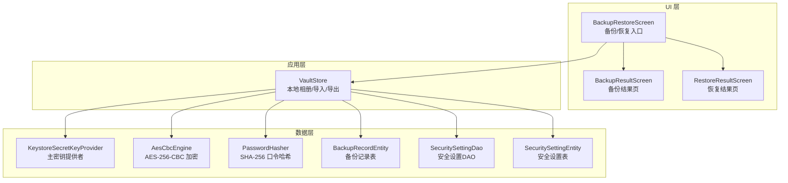
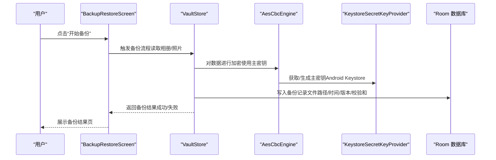
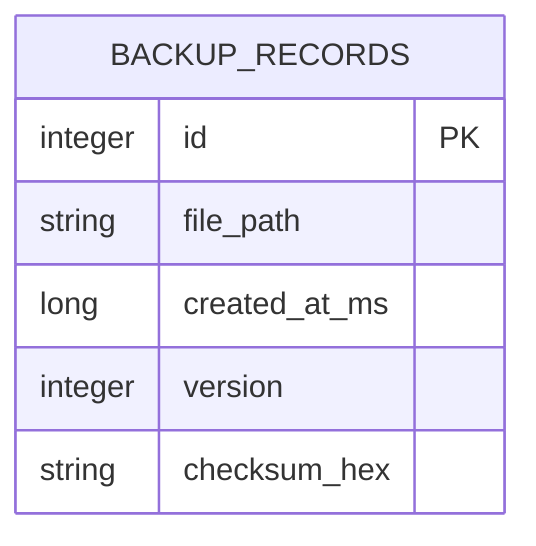
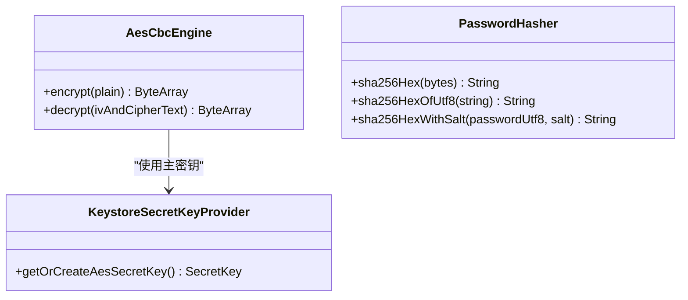
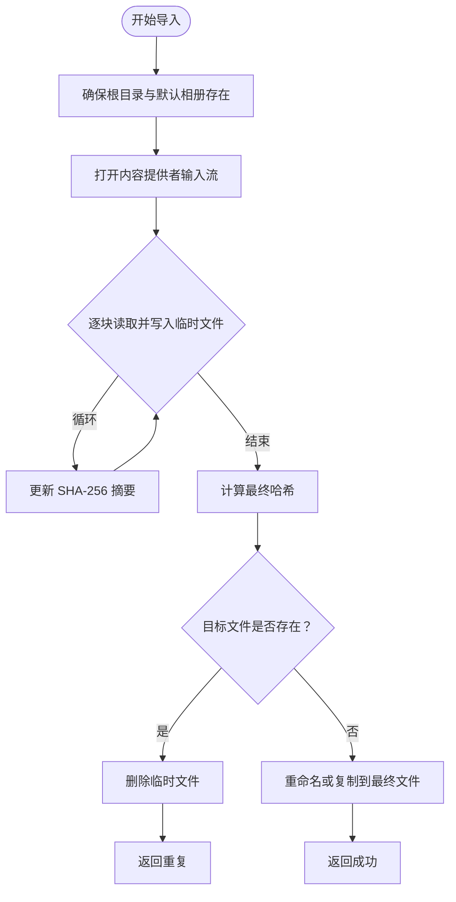
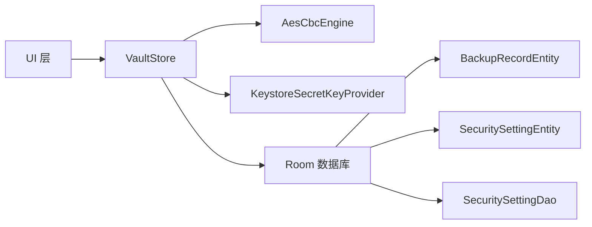

# 备份恢复系统

<cite>
**本文引用的文件**
- [BackupRestoreScreen.kt](file://android/app/src/main/kotlin/com/photovault/app/ui/BackupRestoreScreen.kt)
- [BackupResultScreen.kt](file://android/app/src/main/kotlin/com/photovault/app/ui/BackupResultScreen.kt)
- [RestoreResultScreen.kt](file://android/app/src/main/kotlin/com/photovault/app/ui/RestoreResultScreen.kt)
- [AesCbcEngine.kt](file://android/core/data/src/main/kotlin/com/photovault/data/crypto/AesCbcEngine.kt)
- [KeystoreSecretKeyProvider.kt](file://android/core/data/src/main/kotlin/com/photovault/data/crypto/KeystoreSecretKeyProvider.kt)
- [PasswordHasher.kt](file://android/core/data/src/main/kotlin/com/photovault/data/crypto/PasswordHasher.kt)
- [BackupRecordEntity.kt](file://android/core/data/src/main/kotlin/com/photovault/data/db/entity/BackupRecordEntity.kt)
- [SecuritySettingDao.kt](file://android/core/data/src/main/kotlin/com/photovault/data/db/dao/SecuritySettingDao.kt)
- [SecuritySettingEntity.kt](file://android/core/data/src/main/kotlin/com/photovault/data/db/entity/SecuritySettingEntity.kt)
- [VaultStore.kt](file://android/app/src/main/kotlin/com/photovault/app/ui/vault/VaultStore.kt)
- [MainActivity.kt](file://android/app/src/main/kotlin/com/photovault/app/MainActivity.kt)
</cite>

## 目录
1. [简介](#简介)
2. [项目结构](#项目结构)
3. [核心组件](#核心组件)
4. [架构总览](#架构总览)
5. [详细组件分析](#详细组件分析)
6. [依赖关系分析](#依赖关系分析)
7. [性能考量](#性能考量)
8. [故障排查指南](#故障排查指南)
9. [结论](#结论)
10. [附录](#附录)

## 简介
本技术文档围绕 AI 照片保险库的“备份与恢复”子系统进行系统化说明，覆盖以下关键主题：
- 数据备份策略：全量备份与元数据记录、文件完整性校验与版本控制
- 加密与压缩：对称加密（AES-256-CBC）、主密钥托管（Android Keystore）、口令哈希（SHA-256）
- 备份文件格式设计：文件路径、时间戳、版本号、校验和
- 数据完整性校验与版本兼容性处理：基于校验和与版本字段的验证
- 备份流程实现：UI 层触发、后台任务执行、进度与结果反馈
- 恢复流程：数据验证、冲突处理、用户提示
- 增量备份、批量导入导出与跨设备迁移：通过统一的 VaultStore 与备份记录模型支撑
- 存储位置管理、自动备份设置与用户数据保护策略：基于应用内部目录与安全配置

## 项目结构
备份恢复系统在当前仓库中主要分布在三层：
- UI 层：负责用户交互与结果展示（备份/恢复卡片、结果页）
- 数据层：负责加密、口令哈希、数据库实体与DAO
- 应用层：负责私密相册的本地存储与导入导出（VaultStore）

图表来源
- [BackupRestoreScreen.kt:33-71](file://android/app/src/main/kotlin/com/photovault/app/ui/BackupRestoreScreen.kt#L33-L71)
- [BackupResultScreen.kt:31-82](file://android/app/src/main/kotlin/com/photovault/app/ui/BackupResultScreen.kt#L31-L82)
- [RestoreResultScreen.kt:31-75](file://android/app/src/main/kotlin/com/photovault/app/ui/RestoreResultScreen.kt#L31-L75)
- [VaultStore.kt:39-226](file://android/app/src/main/kotlin/com/photovault/app/ui/vault/VaultStore.kt#L39-L226)
- [KeystoreSecretKeyProvider.kt:12-42](file://android/core/data/src/main/kotlin/com/photovault/data/crypto/KeystoreSecretKeyProvider.kt#L12-L42)
- [AesCbcEngine.kt:12-40](file://android/core/data/src/main/kotlin/com/photovault/data/crypto/AesCbcEngine.kt#L12-L40)
- [PasswordHasher.kt:6-26](file://android/core/data/src/main/kotlin/com/photovault/data/crypto/PasswordHasher.kt#L6-L26)
- [BackupRecordEntity.kt:8-18](file://android/core/data/src/main/kotlin/com/photovault/data/db/entity/BackupRecordEntity.kt#L8-L18)
- [SecuritySettingDao.kt:9-16](file://android/core/data/src/main/kotlin/com/photovault/data/db/dao/SecuritySettingDao.kt#L9-L16)
- [SecuritySettingEntity.kt:7-18](file://android/core/data/src/main/kotlin/com/photovault/data/db/entity/SecuritySettingEntity.kt#L7-L18)

章节来源
- [BackupRestoreScreen.kt:33-71](file://android/app/src/main/kotlin/com/photovault/app/ui/BackupRestoreScreen.kt#L33-L71)
- [VaultStore.kt:39-226](file://android/app/src/main/kotlin/com/photovault/app/ui/vault/VaultStore.kt#L39-L226)

## 核心组件
- 备份记录模型与持久化
  - 备份记录实体包含文件路径、创建时间（毫秒）、版本号、可选校验和，便于后续恢复与版本兼容性判断。
- 加密与密钥管理
  - 使用 Android Keystore 托管 AES-256-CBC 主密钥，确保密钥材料不可导出；加密输出格式为 IV(16字节)+密文，与既有产品约定一致。
  - 口令哈希采用 SHA-256，支持盐值组合，用于 PIN 等口令存储场景。
- 安全设置与访问控制
  - 安全设置表记录锁类型、PIN 哈希、生物识别开关与失败计数等，DAO 提供单例读取与更新能力。
- 私密相册本地存储与导入导出
  - VaultStore 负责应用内部目录下的相册组织、导入（去重与重命名）、最近照片查询、相册封面与统计等。

章节来源
- [BackupRecordEntity.kt:8-18](file://android/core/data/src/main/kotlin/com/photovault/data/db/entity/BackupRecordEntity.kt#L8-L18)
- [AesCbcEngine.kt:12-40](file://android/core/data/src/main/kotlin/com/photovault/data/crypto/AesCbcEngine.kt#L12-L40)
- [KeystoreSecretKeyProvider.kt:12-42](file://android/core/data/src/main/kotlin/com/photovault/data/crypto/KeystoreSecretKeyProvider.kt#L12-L42)
- [PasswordHasher.kt:6-26](file://android/core/data/src/main/kotlin/com/photovault/data/crypto/PasswordHasher.kt#L6-L26)
- [SecuritySettingDao.kt:9-16](file://android/core/data/src/main/kotlin/com/photovault/data/db/dao/SecuritySettingDao.kt#L9-L16)
- [SecuritySettingEntity.kt:7-18](file://android/core/data/src/main/kotlin/com/photovault/data/db/entity/SecuritySettingEntity.kt#L7-L18)
- [VaultStore.kt:39-226](file://android/app/src/main/kotlin/com/photovault/app/ui/vault/VaultStore.kt#L39-L226)

## 架构总览
备份与恢复系统以“UI 触发—应用层执行—数据层加密/持久化”的分层方式组织。UI 层负责引导用户操作并展示结果；应用层负责具体的数据处理（如导入导出、去重、统计）；数据层负责加密与安全配置，并通过 Room 记录备份元数据。

图表来源
- [BackupRestoreScreen.kt:33-71](file://android/app/src/main/kotlin/com/photovault/app/ui/BackupRestoreScreen.kt#L33-L71)
- [VaultStore.kt:39-226](file://android/app/src/main/kotlin/com/photovault/app/ui/vault/VaultStore.kt#L39-L226)
- [AesCbcEngine.kt:12-40](file://android/core/data/src/main/kotlin/com/photovault/data/crypto/AesCbcEngine.kt#L12-L40)
- [KeystoreSecretKeyProvider.kt:12-42](file://android/core/data/src/main/kotlin/com/photovault/data/crypto/KeystoreSecretKeyProvider.kt#L12-L42)
- [BackupRecordEntity.kt:8-18](file://android/core/data/src/main/kotlin/com/photovault/data/db/entity/BackupRecordEntity.kt#L8-L18)

## 详细组件分析

### 备份记录与文件格式设计
- 表结构要点
  - 主键自增 ID
  - 文件路径：指向备份文件的绝对路径
  - 创建时间（毫秒）：用于排序与历史追踪
  - 版本号：用于版本兼容性判断
  - 校验和（十六进制字符串）：可选，用于完整性校验
- 版本兼容性
  - 通过版本号与校验和共同保证不同版本之间的兼容与一致性
- 元数据持久化
  - 通过 DAO 进行插入或替换，确保每次备份后记录最新状态

图表来源
- [BackupRecordEntity.kt:8-18](file://android/core/data/src/main/kotlin/com/photovault/data/db/entity/BackupRecordEntity.kt#L8-L18)

章节来源
- [BackupRecordEntity.kt:8-18](file://android/core/data/src/main/kotlin/com/photovault/data/db/entity/BackupRecordEntity.kt#L8-L18)

### 加密与密钥管理
- 主密钥托管
  - 使用 Android Keystore 生成/读取 AES-256-CBC 密钥，密钥材料不可导出，满足高安全性要求
- 加密算法
  - AES-256-CBC + PKCS7（JVM/Android 上等价于 PKCS7Padding）
  - 输出格式：IV(16字节) + 密文
- 口令哈希
  - SHA-256，支持盐值拼接，用于 PIN 等口令存储

图表来源
- [KeystoreSecretKeyProvider.kt:12-42](file://android/core/data/src/main/kotlin/com/photovault/data/crypto/KeystoreSecretKeyProvider.kt#L12-L42)
- [AesCbcEngine.kt:12-40](file://android/core/data/src/main/kotlin/com/photovault/data/crypto/AesCbcEngine.kt#L12-L40)
- [PasswordHasher.kt:6-26](file://android/core/data/src/main/kotlin/com/photovault/data/crypto/PasswordHasher.kt#L6-L26)

章节来源
- [KeystoreSecretKeyProvider.kt:12-42](file://android/core/data/src/main/kotlin/com/photovault/data/crypto/KeystoreSecretKeyProvider.kt#L12-L42)
- [AesCbcEngine.kt:12-40](file://android/core/data/src/main/kotlin/com/photovault/data/crypto/AesCbcEngine.kt#L12-L40)
- [PasswordHasher.kt:6-26](file://android/core/data/src/main/kotlin/com/photovault/data/crypto/PasswordHasher.kt#L6-L26)

### 私密相册本地存储与导入导出（VaultStore）
- 功能范围
  - 初始化根目录与默认相册
  - 列举相册、相册内照片、最近照片
  - 搜索照片、统计总数
  - 导入照片（去重、重命名、写入 SHA-256 校验）
  - 预留相机拍摄目标文件
  - 兼容旧版目录并迁移
- 关键流程
  - 导入时计算输入流的 SHA-256，生成唯一文件名，避免重复
  - 若目标文件已存在则跳过，否则移动或复制到最终位置

图表来源
- [VaultStore.kt:120-154](file://android/app/src/main/kotlin/com/photovault/app/ui/vault/VaultStore.kt#L120-L154)

章节来源
- [VaultStore.kt:39-226](file://android/app/src/main/kotlin/com/photovault/app/ui/vault/VaultStore.kt#L39-L226)

### UI 层：备份/恢复入口与结果展示
- 备份/恢复入口卡片
  - 提供“备份”“恢复”两个入口，分别导航至结果页
- 结果页
  - 备份结果页：展示成功状态、备份文件信息与大小
  - 恢复结果页：展示成功状态与统计信息
- 顶部栏与按钮样式
  - 统一的主题色与圆角卡片风格，提升可读性与一致性

章节来源
- [BackupRestoreScreen.kt:33-117](file://android/app/src/main/kotlin/com/photovault/app/ui/BackupRestoreScreen.kt#L33-L117)
- [BackupResultScreen.kt:31-125](file://android/app/src/main/kotlin/com/photovault/app/ui/BackupResultScreen.kt#L31-L125)
- [RestoreResultScreen.kt:31-122](file://android/app/src/main/kotlin/com/photovault/app/ui/RestoreResultScreen.kt#L31-L122)

### 安全设置与访问控制
- 安全设置表
  - 单例主键，记录锁类型、PIN 哈希、生物识别开关与失败计数
- DAO
  - 支持按 ID 查询与替换式插入，保证单实例配置的一致性

章节来源
- [SecuritySettingEntity.kt:7-18](file://android/core/data/src/main/kotlin/com/photovault/data/db/entity/SecuritySettingEntity.kt#L7-L18)
- [SecuritySettingDao.kt:9-16](file://android/core/data/src/main/kotlin/com/photovault/data/db/dao/SecuritySettingDao.kt#L9-L16)

## 依赖关系分析
- UI 与应用层
  - UI 层通过路由与导航进入备份/恢复入口与结果页，调用应用层的 VaultStore 执行导入/导出与统计
- 应用层与数据层
  - VaultStore 在执行导入/导出时，依赖加密引擎与密钥提供者进行数据保护，并通过 Room 写入备份记录与安全设置
- 数据层内部
  - 备份记录与安全设置通过 DAO 进行持久化，口令哈希与加密算法相互独立但共同保障数据安全

图表来源
- [MainActivity.kt:127-161](file://android/app/src/main/kotlin/com/photovault/app/MainActivity.kt#L127-L161)
- [VaultStore.kt:39-226](file://android/app/src/main/kotlin/com/photovault/app/ui/vault/VaultStore.kt#L39-L226)
- [AesCbcEngine.kt:12-40](file://android/core/data/src/main/kotlin/com/photovault/data/crypto/AesCbcEngine.kt#L12-L40)
- [KeystoreSecretKeyProvider.kt:12-42](file://android/core/data/src/main/kotlin/com/photovault/data/crypto/KeystoreSecretKeyProvider.kt#L12-L42)
- [BackupRecordEntity.kt:8-18](file://android/core/data/src/main/kotlin/com/photovault/data/db/entity/BackupRecordEntity.kt#L8-L18)
- [SecuritySettingEntity.kt:7-18](file://android/core/data/src/main/kotlin/com/photovault/data/db/entity/SecuritySettingEntity.kt#L7-L18)
- [SecuritySettingDao.kt:9-16](file://android/core/data/src/main/kotlin/com/photovault/data/db/dao/SecuritySettingDao.kt#L9-L16)

章节来源
- [MainActivity.kt:127-161](file://android/app/src/main/kotlin/com/photovault/app/MainActivity.kt#L127-L161)

## 性能考量
- IO 与内存
  - 导入流程采用分块读取与摘要计算，避免一次性加载大文件导致内存压力
- 并发与调度
  - 所有磁盘与数据库操作在 IO 线程执行，避免阻塞主线程
- 压缩策略
  - 当前未发现显式的压缩实现；若未来引入压缩，建议结合加密顺序与校验和更新策略，确保版本兼容性

## 故障排查指南
- 备份失败
  - 检查应用内部目录是否可写、磁盘空间是否充足
  - 确认加密引擎初始化是否成功（主密钥可用）
- 恢复失败
  - 校验备份文件的版本号与校验和是否匹配当前系统预期
  - 确认安全设置（如 PIN 或生物识别）与恢复环境一致
- 导入重复
  - 系统基于 SHA-256 去重，若出现重复导入，应检查源文件是否被修改或来源路径是否变化
- UI 导航异常
  - 确认路由常量与导航逻辑正确，避免重复渲染或状态丢失

章节来源
- [VaultStore.kt:120-154](file://android/app/src/main/kotlin/com/photovault/app/ui/vault/VaultStore.kt#L120-L154)
- [BackupRecordEntity.kt:8-18](file://android/core/data/src/main/kotlin/com/photovault/data/db/entity/BackupRecordEntity.kt#L8-L18)

## 结论
本备份恢复系统以清晰的分层架构实现了从 UI 到应用再到数据层的安全闭环：UI 引导用户完成备份/恢复，VaultStore 负责本地数据的导入/导出与统计，加密与密钥管理确保数据机密性，Room 记录备份元数据与安全设置保障可追溯与可恢复。通过版本号与校验和的组合，系统具备基础的版本兼容性与完整性校验能力。未来可在现有基础上扩展压缩、增量备份与跨设备迁移能力，同时完善自动备份与用户数据保护策略。

## 附录
- 备份流程实现要点
  - UI 触发 → 应用层扫描/导入 → 加密写入 → 写入备份记录 → 展示结果
- 恢复流程实现要点
  - 选择备份文件 → 校验版本与校验和 → 解密与解析 → 冲突检测与用户提示 → 写入本地存储
- 增量备份与批量导入导出
  - 增量：基于时间戳与校验和对比，仅处理变更项
  - 批量：在导入流程中逐条处理并维护去重与统计
- 跨设备迁移
  - 通过统一的备份记录与安全设置表，结合版本兼容性策略实现迁移