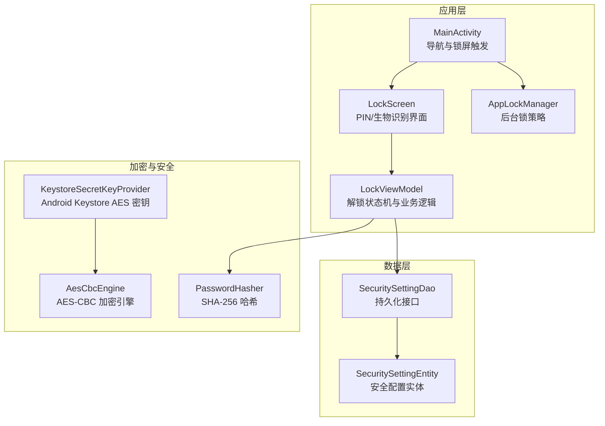
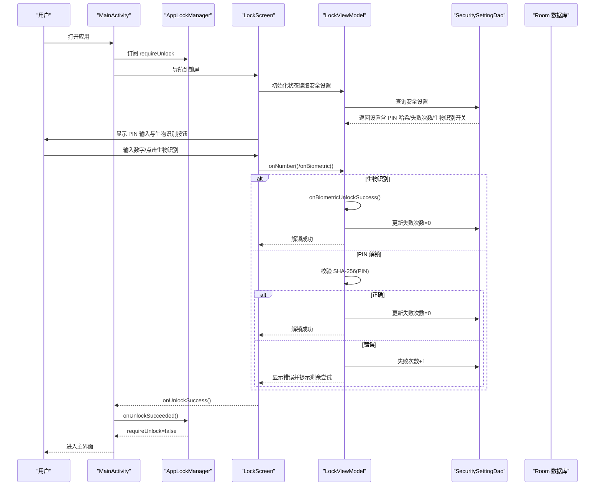
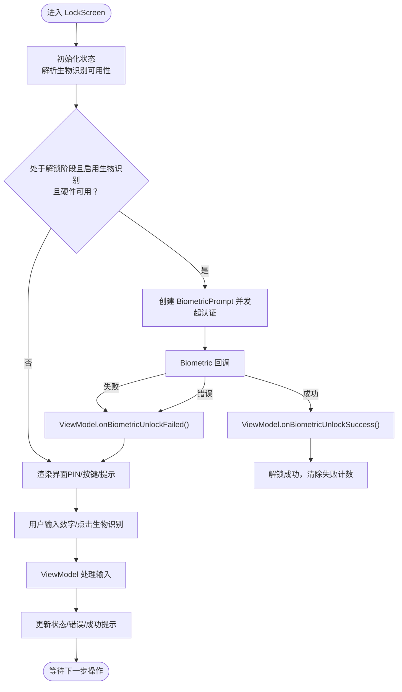
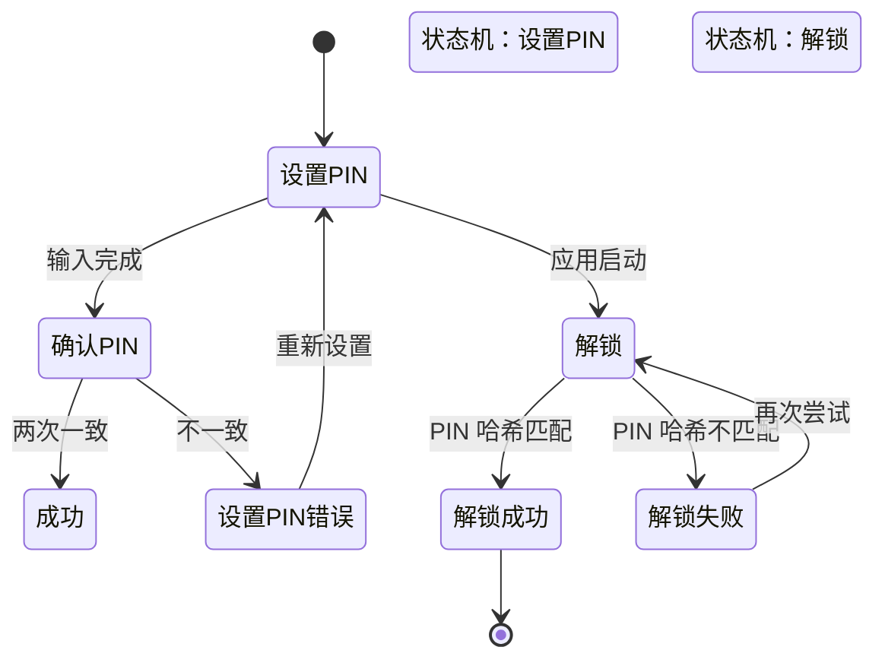
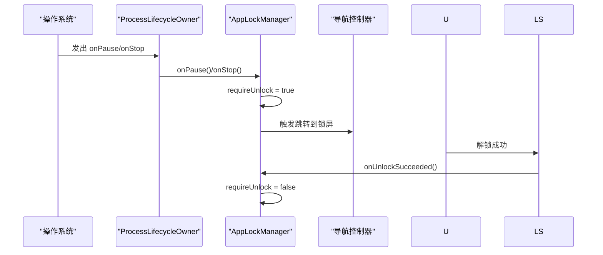
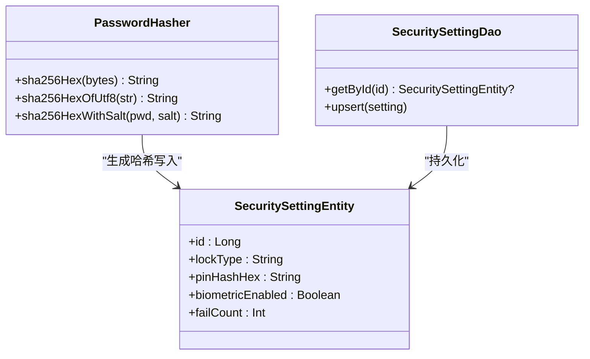
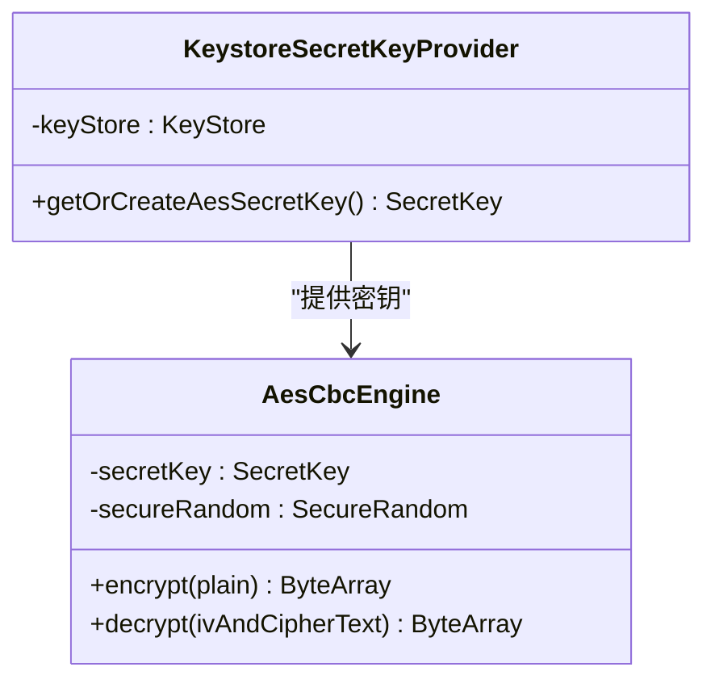
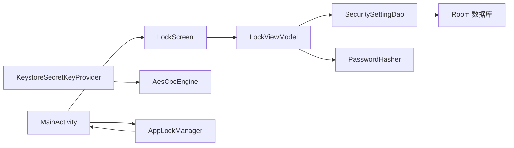

# 安全解锁系统

<cite>
**本文引用的文件**
- [android/app/src/main/kotlin/com/photovault/app/ui/lock/LockScreen.kt](file://android/app/src/main/kotlin/com/photovault/app/ui/lock/LockScreen.kt)
- [android/app/src/main/kotlin/com/photovault/app/ui/lock/LockViewModel.kt](file://android/app/src/main/kotlin/com/photovault/app/ui/lock/LockViewModel.kt)
- [android/app/src/main/kotlin/com/photovault/app/AppLockManager.kt](file://android/app/src/main/kotlin/com/photovault/app/AppLockManager.kt)
- [android/app/src/main/kotlin/com/photovault/app/MainActivity.kt](file://android/app/src/main/kotlin/com/photovault/app/MainActivity.kt)
- [android/core/data/src/main/kotlin/com/photovault/data/crypto/PasswordHasher.kt](file://android/core/data/src/main/kotlin/com/photovault/data/crypto/PasswordHasher.kt)
- [android/core/data/src/main/kotlin/com/photovault/data/crypto/KeystoreSecretKeyProvider.kt](file://android/core/data/src/main/kotlin/com/photovault/data/crypto/KeystoreSecretKeyProvider.kt)
- [android/core/data/src/main/kotlin/com/photovault/data/crypto/AesCbcEngine.kt](file://android/core/data/src/main/kotlin/com/photovault/data/crypto/AesCbcEngine.kt)
- [android/core/data/src/main/kotlin/com/photovault/data/db/entity/SecuritySettingEntity.kt](file://android/core/data/src/main/kotlin/com/photovault/data/db/entity/SecuritySettingEntity.kt)
- [android/core/data/src/main/kotlin/com/photovault/data/db/dao/SecuritySettingDao.kt](file://android/core/data/src/main/kotlin/com/photovault/data/db/dao/SecuritySettingDao.kt)
- [doc/android/03-解锁与安全模块.md](file://doc/android/03-解锁与安全模块.md)
- [android/core/data/src/test/kotlin/com/photovault/data/crypto/PasswordHasherTest.kt](file://android/core/data/src/test/kotlin/com/photovault/data/crypto/PasswordHasherTest.kt)
- [android/core/data/src/test/kotlin/com/photovault/data/crypto/AesCbcEngineTest.kt](file://android/core/data/src/test/kotlin/com/photovault/data/crypto/AesCbcEngineTest.kt)
</cite>

## 目录
1. [简介](#简介)
2. [项目结构](#项目结构)
3. [核心组件](#核心组件)
4. [架构总览](#架构总览)
5. [详细组件分析](#详细组件分析)
6. [依赖关系分析](#依赖关系分析)
7. [性能考量](#性能考量)
8. [故障排查指南](#故障排查指南)
9. [结论](#结论)
10. [附录](#附录)

## 简介
本技术文档围绕 AI 照片保险库的安全解锁系统，系统性阐述 PIN 码解锁与生物识别认证的实现机制，涵盖密码哈希、密钥派生与安全存储策略；同时解释解锁状态管理、会话控制与生命周期锁定机制，并深入分析 Android Keystore 的使用、BiometricPrompt 集成与安全状态机设计。文档提供完整流程图与类图，帮助开发者快速理解并扩展安全模块。

## 项目结构
安全解锁系统主要分布在以下层次：
- 应用层（UI 层）：LockScreen、LockViewModel、AppLockManager、MainActivity
- 数据层（领域模型与数据访问）：SecuritySettingEntity、SecuritySettingDao
- 加密与安全工具：PasswordHasher、KeystoreSecretKeyProvider、AesCbcEngine
- 文档与测试：03-解锁与安全模块.md、相关单元测试

图表来源
- [android/app/src/main/kotlin/com/photovault/app/MainActivity.kt:42-265](file://android/app/src/main/kotlin/com/photovault/app/MainActivity.kt#L42-L265)
- [android/app/src/main/kotlin/com/photovault/app/AppLockManager.kt:18-49](file://android/app/src/main/kotlin/com/photovault/app/AppLockManager.kt#L18-L49)
- [android/app/src/main/kotlin/com/photovault/app/ui/lock/LockScreen.kt:52-228](file://android/app/src/main/kotlin/com/photovault/app/ui/lock/LockScreen.kt#L52-L228)
- [android/app/src/main/kotlin/com/photovault/app/ui/lock/LockViewModel.kt:18-197](file://android/app/src/main/kotlin/com/photovault/app/ui/lock/LockViewModel.kt#L18-L197)
- [android/core/data/src/main/kotlin/com/photovault/data/db/entity/SecuritySettingEntity.kt:7-18](file://android/core/data/src/main/kotlin/com/photovault/data/db/entity/SecuritySettingEntity.kt#L7-L18)
- [android/core/data/src/main/kotlin/com/photovault/data/db/dao/SecuritySettingDao.kt:9-16](file://android/core/data/src/main/kotlin/com/photovault/data/db/dao/SecuritySettingDao.kt#L9-L16)
- [android/core/data/src/main/kotlin/com/photovault/data/crypto/PasswordHasher.kt:6-25](file://android/core/data/src/main/kotlin/com/photovault/data/crypto/PasswordHasher.kt#L6-L25)
- [android/core/data/src/main/kotlin/com/photovault/data/crypto/KeystoreSecretKeyProvider.kt:12-41](file://android/core/data/src/main/kotlin/com/photovault/data/crypto/KeystoreSecretKeyProvider.kt#L12-L41)
- [android/core/data/src/main/kotlin/com/photovault/data/crypto/AesCbcEngine.kt:12-39](file://android/core/data/src/main/kotlin/com/photovault/data/crypto/AesCbcEngine.kt#L12-L39)

章节来源
- [android/app/src/main/kotlin/com/photovault/app/MainActivity.kt:42-265](file://android/app/src/main/kotlin/com/photovault/app/MainActivity.kt#L42-L265)
- [android/app/src/main/kotlin/com/photovault/app/AppLockManager.kt:18-49](file://android/app/src/main/kotlin/com/photovault/app/AppLockManager.kt#L18-L49)
- [android/app/src/main/kotlin/com/photovault/app/ui/lock/LockScreen.kt:52-228](file://android/app/src/main/kotlin/com/photovault/app/ui/lock/LockScreen.kt#L52-L228)
- [android/app/src/main/kotlin/com/photovault/app/ui/lock/LockViewModel.kt:18-197](file://android/app/src/main/kotlin/com/photovault/app/ui/lock/LockViewModel.kt#L18-L197)
- [android/core/data/src/main/kotlin/com/photovault/data/db/entity/SecuritySettingEntity.kt:7-18](file://android/core/data/src/main/kotlin/com/photovault/data/db/entity/SecuritySettingEntity.kt#L7-L18)
- [android/core/data/src/main/kotlin/com/photovault/data/db/dao/SecuritySettingDao.kt:9-16](file://android/core/data/src/main/kotlin/com/photovault/data/db/dao/SecuritySettingDao.kt#L9-L16)
- [android/core/data/src/main/kotlin/com/photovault/data/crypto/PasswordHasher.kt:6-25](file://android/core/data/src/main/kotlin/com/photovault/data/crypto/PasswordHasher.kt#L6-L25)
- [android/core/data/src/main/kotlin/com/photovault/data/crypto/KeystoreSecretKeyProvider.kt:12-41](file://android/core/data/src/main/kotlin/com/photovault/data/crypto/KeystoreSecretKeyProvider.kt#L12-L41)
- [android/core/data/src/main/kotlin/com/photovault/data/crypto/AesCbcEngine.kt:12-39](file://android/core/data/src/main/kotlin/com/photovault/data/crypto/AesCbcEngine.kt#L12-L39)

## 核心组件
- LockScreen：负责 PIN 输入与生物识别提示 UI，集成 BiometricPrompt 并根据状态自动弹出生物识别。
- LockViewModel：实现解锁状态机（设置 PIN、确认 PIN、解锁）、PIN 哈希校验、失败计数与生物识别开关。
- AppLockManager：基于进程生命周期的后台锁策略，控制是否需要显示锁屏。
- SecuritySettingEntity/Dao：持久化安全配置（锁类型、PIN 哈希、生物识别开关、失败次数）。
- PasswordHasher：提供 SHA-256 哈希与带盐哈希能力，用于 PIN 存储。
- KeystoreSecretKeyProvider/AesCbcEngine：在 Android Keystore 中生成/读取 AES 密钥，提供 AES-CBC 加密能力（用于后续资产加密）。

章节来源
- [android/app/src/main/kotlin/com/photovault/app/ui/lock/LockScreen.kt:52-228](file://android/app/src/main/kotlin/com/photovault/app/ui/lock/LockScreen.kt#L52-L228)
- [android/app/src/main/kotlin/com/photovault/app/ui/lock/LockViewModel.kt:18-197](file://android/app/src/main/kotlin/com/photovault/app/ui/lock/LockViewModel.kt#L18-L197)
- [android/app/src/main/kotlin/com/photovault/app/AppLockManager.kt:18-49](file://android/app/src/main/kotlin/com/photovault/app/AppLockManager.kt#L18-L49)
- [android/core/data/src/main/kotlin/com/photovault/data/db/entity/SecuritySettingEntity.kt:7-18](file://android/core/data/src/main/kotlin/com/photovault/data/db/entity/SecuritySettingEntity.kt#L7-L18)
- [android/core/data/src/main/kotlin/com/photovault/data/db/dao/SecuritySettingDao.kt:9-16](file://android/core/data/src/main/kotlin/com/photovault/data/db/dao/SecuritySettingDao.kt#L9-L16)
- [android/core/data/src/main/kotlin/com/photovault/data/crypto/PasswordHasher.kt:6-25](file://android/core/data/src/main/kotlin/com/photovault/data/crypto/PasswordHasher.kt#L6-L25)
- [android/core/data/src/main/kotlin/com/photovault/data/crypto/KeystoreSecretKeyProvider.kt:12-41](file://android/core/data/src/main/kotlin/com/photovault/data/crypto/KeystoreSecretKeyProvider.kt#L12-L41)
- [android/core/data/src/main/kotlin/com/photovault/data/crypto/AesCbcEngine.kt:12-39](file://android/core/data/src/main/kotlin/com/photovault/data/crypto/AesCbcEngine.kt#L12-L39)

## 架构总览
安全解锁系统采用“UI 状态机 + 数据持久化 + 加密工具”的分层设计。UI 层通过 ViewModel 维护状态，数据层通过 Room 持久化安全配置；PIN 采用 SHA-256 哈希存储，生物识别作为辅助解锁手段；后台锁策略通过生命周期观察器触发。

图表来源
- [android/app/src/main/kotlin/com/photovault/app/MainActivity.kt:42-265](file://android/app/src/main/kotlin/com/photovault/app/MainActivity.kt#L42-L265)
- [android/app/src/main/kotlin/com/photovault/app/AppLockManager.kt:18-49](file://android/app/src/main/kotlin/com/photovault/app/AppLockManager.kt#L18-L49)
- [android/app/src/main/kotlin/com/photovault/app/ui/lock/LockScreen.kt:52-228](file://android/app/src/main/kotlin/com/photovault/app/ui/lock/LockScreen.kt#L52-L228)
- [android/app/src/main/kotlin/com/photovault/app/ui/lock/LockViewModel.kt:18-197](file://android/app/src/main/kotlin/com/photovault/app/ui/lock/LockViewModel.kt#L18-L197)
- [android/core/data/src/main/kotlin/com/photovault/data/db/dao/SecuritySettingDao.kt:9-16](file://android/core/data/src/main/kotlin/com/photovault/data/db/dao/SecuritySettingDao.kt#L9-L16)

## 详细组件分析

### LockScreen：解锁界面与生物识别集成
- 负责渲染标题、副标题、步骤标签、PIN 点位指示与错误/成功提示。
- 自动检测生物识别可用性（BiometricManager），在满足条件时自动弹出 BiometricPrompt。
- 支持数字键盘输入、删除键、快速拍照入口与生物识别按钮。
- 生物识别回调处理：成功则通知 ViewModel 解锁成功；错误/失败分别记录错误消息。

图表来源
- [android/app/src/main/kotlin/com/photovault/app/ui/lock/LockScreen.kt:52-228](file://android/app/src/main/kotlin/com/photovault/app/ui/lock/LockScreen.kt#L52-L228)
- [android/app/src/main/kotlin/com/photovault/app/ui/lock/LockViewModel.kt:117-132](file://android/app/src/main/kotlin/com/photovault/app/ui/lock/LockViewModel.kt#L117-L132)

章节来源
- [android/app/src/main/kotlin/com/photovault/app/ui/lock/LockScreen.kt:52-228](file://android/app/src/main/kotlin/com/photovault/app/ui/lock/LockScreen.kt#L52-L228)

### LockViewModel：解锁状态机与业务逻辑
- 状态机包含四个阶段：SETUP_ENTER、SETUP_CONFIRM、SETUP_CONFIRM_ERROR、UNLOCK。
- 设置 PIN 流程：输入 6 位 PIN，二次确认；确认一致则使用 PasswordHasher.sha256Hex 存储哈希；否则提示不一致并允许重新设置。
- 解锁流程：收集 6 位 PIN，计算哈希并与数据库中的 pinHashHex 比较；正确则清零失败计数，错误则失败计数+1，并提示剩余尝试次数。
- 生物识别成功回调：清零失败计数并标记解锁成功。
- 提供生物识别开关设置与对话框状态管理。

图表来源
- [android/app/src/main/kotlin/com/photovault/app/ui/lock/LockViewModel.kt:199-222](file://android/app/src/main/kotlin/com/photovault/app/ui/lock/LockViewModel.kt#L199-L222)

章节来源
- [android/app/src/main/kotlin/com/photovault/app/ui/lock/LockViewModel.kt:18-197](file://android/app/src/main/kotlin/com/photovault/app/ui/lock/LockViewModel.kt#L18-L197)

### AppLockManager：后台锁策略与会话控制
- 使用 ProcessLifecycleObserver，在应用停止（onStop）时触发 requireUnlock=true，从而在非可见状态下强制锁屏。
- 解锁成功后调用 onUnlockSucceeded() 将 requireUnlock 设为 false，允许进入受保护内容。
- 该策略避免了页面切换导致的频繁锁屏，仅在应用真正后台时才锁。

图表来源
- [android/app/src/main/kotlin/com/photovault/app/AppLockManager.kt:18-49](file://android/app/src/main/kotlin/com/photovault/app/AppLockManager.kt#L18-L49)
- [android/app/src/main/kotlin/com/photovault/app/MainActivity.kt:42-265](file://android/app/src/main/kotlin/com/photovault/app/MainActivity.kt#L42-L265)

章节来源
- [android/app/src/main/kotlin/com/photovault/app/AppLockManager.kt:18-49](file://android/app/src/main/kotlin/com/photovault/app/AppLockManager.kt#L18-L49)
- [android/app/src/main/kotlin/com/photovault/app/MainActivity.kt:42-265](file://android/app/src/main/kotlin/com/photovault/app/MainActivity.kt#L42-L265)

### 密码哈希与安全存储
- PIN 存储采用 SHA-256 哈希，避免明文保存；提供 sha256Hex 与 sha256HexWithSalt 接口，便于未来引入安装级盐。
- 安全配置实体包含 lockType、pinHashHex、biometricEnabled、failCount；通过 SecuritySettingDao 进行查询与更新。

图表来源
- [android/core/data/src/main/kotlin/com/photovault/data/crypto/PasswordHasher.kt:6-25](file://android/core/data/src/main/kotlin/com/photovault/data/crypto/PasswordHasher.kt#L6-L25)
- [android/core/data/src/main/kotlin/com/photovault/data/db/entity/SecuritySettingEntity.kt:7-18](file://android/core/data/src/main/kotlin/com/photovault/data/db/entity/SecuritySettingEntity.kt#L7-L18)
- [android/core/data/src/main/kotlin/com/photovault/data/db/dao/SecuritySettingDao.kt:9-16](file://android/core/data/src/main/kotlin/com/photovault/data/db/dao/SecuritySettingDao.kt#L9-L16)

章节来源
- [android/core/data/src/main/kotlin/com/photovault/data/crypto/PasswordHasher.kt:6-25](file://android/core/data/src/main/kotlin/com/photovault/data/crypto/PasswordHasher.kt#L6-L25)
- [android/core/data/src/main/kotlin/com/photovault/data/db/entity/SecuritySettingEntity.kt:7-18](file://android/core/data/src/main/kotlin/com/photovault/data/db/entity/SecuritySettingEntity.kt#L7-L18)
- [android/core/data/src/main/kotlin/com/photovault/data/db/dao/SecuritySettingDao.kt:9-16](file://android/core/data/src/main/kotlin/com/photovault/data/db/dao/SecuritySettingDao.kt#L9-L16)

### Android Keystore 与 AES 加密
- KeystoreSecretKeyProvider：在 Android Keystore 中生成/读取 AES 密钥，密钥材料不可导出，适合长期托管主密钥。
- AesCbcEngine：提供 AES-256-CBC + PKCS7 加密，IV 前置 16 字节，与现有资产加密管线保持一致。

图表来源
- [android/core/data/src/main/kotlin/com/photovault/data/crypto/KeystoreSecretKeyProvider.kt:12-41](file://android/core/data/src/main/kotlin/com/photovault/data/crypto/KeystoreSecretKeyProvider.kt#L12-L41)
- [android/core/data/src/main/kotlin/com/photovault/data/crypto/AesCbcEngine.kt:12-39](file://android/core/data/src/main/kotlin/com/photovault/data/crypto/AesCbcEngine.kt#L12-L39)

章节来源
- [android/core/data/src/main/kotlin/com/photovault/data/crypto/KeystoreSecretKeyProvider.kt:12-41](file://android/core/data/src/main/kotlin/com/photovault/data/crypto/KeystoreSecretKeyProvider.kt#L12-L41)
- [android/core/data/src/main/kotlin/com/photovault/data/crypto/AesCbcEngine.kt:12-39](file://android/core/data/src/main/kotlin/com/photovault/data/crypto/AesCbcEngine.kt#L12-L39)

### 生物识别认证与回退策略
- LockScreen 使用 BiometricManager 检查可用性，BiometricPrompt 弹窗进行认证。
- 成功回调：清零失败计数并标记解锁成功。
- 失败/错误回调：记录错误消息，引导用户重试或使用 PIN 解锁。
- 回退策略：当生物识别不可用或失败时，PIN 解锁作为唯一保障。

章节来源
- [android/app/src/main/kotlin/com/photovault/app/ui/lock/LockScreen.kt:71-106](file://android/app/src/main/kotlin/com/photovault/app/ui/lock/LockScreen.kt#L71-L106)
- [android/app/src/main/kotlin/com/photovault/app/ui/lock/LockViewModel.kt:117-132](file://android/app/src/main/kotlin/com/photovault/app/ui/lock/LockViewModel.kt#L117-L132)
- [doc/android/03-解锁与安全模块.md:15-17](file://doc/android/03-解锁与安全模块.md#L15-L17)

## 依赖关系分析
- UI 依赖 ViewModel；ViewModel 依赖数据库访问层（SecuritySettingDao）与密码哈希工具。
- 锁屏触发依赖 AppLockManager；AppLockManager 依赖生命周期观察者。
- 加密路径：KeystoreSecretKeyProvider 提供密钥，AesCbcEngine 执行加密/解密，用于后续资产加密。

图表来源
- [android/app/src/main/kotlin/com/photovault/app/ui/lock/LockScreen.kt:52-228](file://android/app/src/main/kotlin/com/photovault/app/ui/lock/LockScreen.kt#L52-L228)
- [android/app/src/main/kotlin/com/photovault/app/ui/lock/LockViewModel.kt:18-197](file://android/app/src/main/kotlin/com/photovault/app/ui/lock/LockViewModel.kt#L18-L197)
- [android/app/src/main/kotlin/com/photovault/app/MainActivity.kt:42-265](file://android/app/src/main/kotlin/com/photovault/app/MainActivity.kt#L42-L265)
- [android/app/src/main/kotlin/com/photovault/app/AppLockManager.kt:18-49](file://android/app/src/main/kotlin/com/photovault/app/AppLockManager.kt#L18-L49)
- [android/core/data/src/main/kotlin/com/photovault/data/crypto/KeystoreSecretKeyProvider.kt:12-41](file://android/core/data/src/main/kotlin/com/photovault/data/crypto/KeystoreSecretKeyProvider.kt#L12-L41)
- [android/core/data/src/main/kotlin/com/photovault/data/crypto/AesCbcEngine.kt:12-39](file://android/core/data/src/main/kotlin/com/photovault/data/crypto/AesCbcEngine.kt#L12-L39)

章节来源
- [android/app/src/main/kotlin/com/photovault/app/ui/lock/LockScreen.kt:52-228](file://android/app/src/main/kotlin/com/photovault/app/ui/lock/LockScreen.kt#L52-L228)
- [android/app/src/main/kotlin/com/photovault/app/ui/lock/LockViewModel.kt:18-197](file://android/app/src/main/kotlin/com/photovault/app/ui/lock/LockViewModel.kt#L18-L197)
- [android/app/src/main/kotlin/com/photovault/app/MainActivity.kt:42-265](file://android/app/src/main/kotlin/com/photovault/app/MainActivity.kt#L42-L265)
- [android/app/src/main/kotlin/com/photovault/app/AppLockManager.kt:18-49](file://android/app/src/main/kotlin/com/photovault/app/AppLockManager.kt#L18-L49)
- [android/core/data/src/main/kotlin/com/photovault/data/crypto/KeystoreSecretKeyProvider.kt:12-41](file://android/core/data/src/main/kotlin/com/photovault/data/crypto/KeystoreSecretKeyProvider.kt#L12-L41)
- [android/core/data/src/main/kotlin/com/photovault/data/crypto/AesCbcEngine.kt:12-39](file://android/core/data/src/main/kotlin/com/photovault/data/crypto/AesCbcEngine.kt#L12-L39)

## 性能考量
- UI 渲染与状态流：使用 Compose StateFlow 驱动界面，避免不必要的重组；数字输入与错误提示即时反馈。
- 数据库访问：Room 查询与插入在 ViewModelScope 协程中执行，避免阻塞主线程。
- 加密性能：AES-CBC 在 Android 上性能稳定，IV 随机生成，不影响整体性能。
- 生命周期锁策略：仅在应用停止时触发锁屏，减少前台频繁锁屏带来的体验损耗。

## 故障排查指南
- 生物识别不可用
  - 现象：无法弹出生物识别或提示硬件不可用。
  - 排查：检查 BiometricManager 返回值与设备生物识别注册状态；确认系统设置中已录入指纹/面部。
  - 参考：[android/app/src/main/kotlin/com/photovault/app/ui/lock/LockScreen.kt:365-382](file://android/app/src/main/kotlin/com/photovault/app/ui/lock/LockScreen.kt#L365-L382)
- PIN 解锁失败
  - 现象：多次错误后提示剩余尝试次数或账户临时锁定。
  - 排查：确认输入长度与一致性；检查数据库 failCount 是否递增；确保哈希算法一致。
  - 参考：[android/app/src/main/kotlin/com/photovault/app/ui/lock/LockViewModel.kt:168-184](file://android/app/src/main/kotlin/com/photovault/app/ui/lock/LockViewModel.kt#L168-L184)
- 锁屏未触发
  - 现象：应用切换到后台未锁屏。
  - 排查：确认 AppLockManager 的生命周期监听是否生效；检查 requireUnlock 状态变化。
  - 参考：[android/app/src/main/kotlin/com/photovault/app/AppLockManager.kt:18-49](file://android/app/src/main/kotlin/com/photovault/app/AppLockManager.kt#L18-L49)
- 加密异常
  - 现象：解密失败或长度异常。
  - 排查：确认 IV 前置长度与密钥来源；验证 Keystore 密钥是否存在。
  - 参考：[android/core/data/src/main/kotlin/com/photovault/data/crypto/AesCbcEngine.kt:25-32](file://android/core/data/src/main/kotlin/com/photovault/data/crypto/AesCbcEngine.kt#L25-L32)

章节来源
- [android/app/src/main/kotlin/com/photovault/app/ui/lock/LockScreen.kt:365-382](file://android/app/src/main/kotlin/com/photovault/app/ui/lock/LockScreen.kt#L365-L382)
- [android/app/src/main/kotlin/com/photovault/app/ui/lock/LockViewModel.kt:168-184](file://android/app/src/main/kotlin/com/photovault/app/ui/lock/LockViewModel.kt#L168-L184)
- [android/app/src/main/kotlin/com/photovault/app/AppLockManager.kt:18-49](file://android/app/src/main/kotlin/com/photovault/app/AppLockManager.kt#L18-L49)
- [android/core/data/src/main/kotlin/com/photovault/data/crypto/AesCbcEngine.kt:25-32](file://android/core/data/src/main/kotlin/com/photovault/data/crypto/AesCbcEngine.kt#L25-L32)

## 结论
本安全解锁系统以清晰的状态机与分层架构实现了 PIN 码与生物识别的双重保护，结合 Android Keystore 与 AES 加密为后续资产加密奠定基础。通过生命周期锁策略与错误回退机制，系统在安全性与用户体验之间取得平衡。建议后续增强功能包括：引入安装级盐、会话超时与暴力破解防护策略（如指数退避与临时锁定）、以及更细粒度的权限控制与审计日志。

## 附录
- 安全威胁防护与防暴力破解建议
  - 失败次数阈值与临时锁定：达到阈值后禁止继续解锁，需等待冷却时间。
  - 指数退避：每次失败增加等待时间，降低自动化尝试成功率。
  - 会话超时：在后台锁策略基础上增加前台会话超时，提升敏感操作安全性。
  - 入侵抓拍（付费）：连续失败触发前置摄像头抓拍，作为威慑与取证手段。
- 代码示例路径
  - PIN 设置与确认流程：[android/app/src/main/kotlin/com/photovault/app/ui/lock/LockViewModel.kt:44-86](file://android/app/src/main/kotlin/com/photovault/app/ui/lock/LockViewModel.kt#L44-L86)
  - 解锁校验与失败计数：[android/app/src/main/kotlin/com/photovault/app/ui/lock/LockViewModel.kt:168-184](file://android/app/src/main/kotlin/com/photovault/app/ui/lock/LockViewModel.kt#L168-L184)
  - 生物识别认证回调：[android/app/src/main/kotlin/com/photovault/app/ui/lock/LockScreen.kt:81-106](file://android/app/src/main/kotlin/com/photovault/app/ui/lock/LockScreen.kt#L81-L106)
  - 锁屏触发与导航：[android/app/src/main/kotlin/com/photovault/app/MainActivity.kt:60-74](file://android/app/src/main/kotlin/com/photovault/app/MainActivity.kt#L60-L74)
  - 密码哈希与盐：[android/core/data/src/main/kotlin/com/photovault/data/crypto/PasswordHasher.kt:14-24](file://android/core/data/src/main/kotlin/com/photovault/data/crypto/PasswordHasher.kt#L14-L24)
  - AES 加密引擎与 IV 处理：[android/core/data/src/main/kotlin/com/photovault/data/crypto/AesCbcEngine.kt:17-32](file://android/core/data/src/main/kotlin/com/photovault/data/crypto/AesCbcEngine.kt#L17-L32)
  - 单元测试参考
    - 哈希确定性与向量校验：[android/core/data/src/test/kotlin/com/photovault/data/crypto/PasswordHasherTest.kt:8-22](file://android/core/data/src/test/kotlin/com/photovault/data/crypto/PasswordHasherTest.kt#L8-L22)
    - 加密解密往返测试：[android/core/data/src/test/kotlin/com/photovault/data/crypto/AesCbcEngineTest.kt:9-17](file://android/core/data/src/test/kotlin/com/photovault/data/crypto/AesCbcEngineTest.kt#L9-L17)