# 安全解锁系统

<cite>
**本文引用的文件**
- [android/app/src/main/kotlin/com/xpx/vault/ui/lock/LockScreen.kt](file://android/app/src/main/kotlin/com/xpx/vault/ui/lock/LockScreen.kt)
- [android/app/src/main/kotlin/com/xpx/vault/ui/lock/LockViewModel.kt](file://android/app/src/main/kotlin/com/xpx/vault/ui/lock/LockViewModel.kt)
- [android/app/src/main/kotlin/com/xpx/vault/ui/ChangePinScreen.kt](file://android/app/src/main/kotlin/com/xpx/vault/ui/ChangePinScreen.kt)
- [android/app/src/main/kotlin/com/xpx/vault/AppLockManager.kt](file://android/app/src/main/kotlin/com/xpx/vault/AppLockManager.kt)
- [android/app/src/main/kotlin/com/xpx/vault/MainActivity.kt](file://android/app/src/main/kotlin/com/xpx/vault/MainActivity.kt)
- [android/core/data/src/main/kotlin/com/xpx/vault/data/crypto/PasswordHasher.kt](file://android/core/data/src/main/kotlin/com/xpx/vault/data/crypto/PasswordHasher.kt)
- [android/core/data/src/main/kotlin/com/xpx/vault/data/crypto/KeystoreSecretKeyProvider.kt](file://android/core/data/src/main/kotlin/com/xpx/vault/data/crypto/KeystoreSecretKeyProvider.kt)
- [android/core/data/src/main/kotlin/com/xpx/vault/data/crypto/AesCbcEngine.kt](file://android/core/data/src/main/kotlin/com/xpx/vault/data/crypto/AesCbcEngine.kt)
- [android/core/data/src/main/kotlin/com/xpx/vault/data/crypto/Argon2idKdf.kt](file://android/core/data/src/main/kotlin/com/xpx/vault/data/crypto/Argon2idKdf.kt)
- [android/core/data/src/main/kotlin/com/xpx/vault/data/crypto/BackupKeyManager.kt](file://android/core/data/src/main/kotlin/com/xpx/vault/data/crypto/BackupKeyManager.kt)
- [android/app/src/main/kotlin/com/xpx/vault/ui/backup/BackupSecretsStore.kt](file://android/app/src/main/kotlin/com/xpx/vault/ui/backup/BackupSecretsStore.kt)
- [android/core/data/src/main/kotlin/com/xpx/vault/data/db/entity/SecuritySettingEntity.kt](file://android/core/data/src/main/kotlin/com/xpx/vault/data/db/entity/SecuritySettingEntity.kt)
- [android/core/data/src/main/kotlin/com/xpx/vault/data/db/dao/SecuritySettingDao.kt](file://android/core/data/src/main/kotlin/com/xpx/vault/data/db/dao/SecuritySettingDao.kt)
- [doc/android/03-解锁与安全模块.md](file://doc/android/03-解锁与安全模块.md)
- [android/core/data/src/test/kotlin/com/xpx/vault/data/crypto/PasswordHasherTest.kt](file://android/core/data/src/test/kotlin/com/xpx/vault/data/crypto/PasswordHasherTest.kt)
- [android/core/data/src/test/kotlin/com/xpx/vault/data/crypto/AesCbcEngineTest.kt](file://android/core/data/src/test/kotlin/com/xpx/vault/data/crypto/AesCbcEngineTest.kt)
- [android/core/data/src/test/kotlin/com/xpx/vault/data/crypto/Argon2idKdfTest.kt](file://android/core/data/src/test/kotlin/com/xpx/vault/data/crypto/Argon2idKdfTest.kt)
</cite>

## 更新摘要
**变更内容**
- 优化PIN解锁机制：LockViewModel.verifyUnlockPin函数现在可以立即设置unlockSuccess=true
- 引入Argon2id密钥派生优化：将密钥派生过程从UI线程移至后台协程执行
- 增加force参数控制：通过force参数精确控制备份密钥派生行为
- 实现智能缓存机制：BackupSecretsStore提供密钥缓存，避免重复计算
- 增强异步处理：所有密钥派生操作都在IO调度器中异步执行

## 目录
1. [简介](#简介)
2. [项目结构](#项目结构)
3. [核心组件](#核心组件)
4. [架构总览](#架构总览)
5. [详细组件分析](#详细组件分析)
6. [依赖关系分析](#依赖关系分析)
7. [性能考量](#性能考量)
8. [故障排查指南](#故障排查指南)
9. [结论](#结论)
10. [附录](#附录)

## 简介
本技术文档围绕 AI 照片保险库的安全解锁系统，系统性阐述 PIN 码解锁与生物识别认证的实现机制，涵盖密码哈希、密钥派生与安全存储策略；同时解释解锁状态管理、会话控制与生命周期锁定机制，并深入分析 Android Keystore 的使用、BiometricPrompt 集成与安全状态机设计。文档提供完整流程图与类图，帮助开发者快速理解并扩展安全模块。

**更新** 新增优化的PIN解锁机制，LockViewModel.verifyUnlockPin函数现在可以立即设置unlockSuccess=true，将Argon2id密钥派生过程移到后台协程执行，通过force参数精确控制备份密钥派生行为。引入智能缓存机制，BackupSecretsStore提供密钥缓存功能，避免重复计算Argon2id密钥派生，显著提升用户体验。

## 项目结构
安全解锁系统主要分布在以下层次：
- 应用层（UI 层）：LockScreen、LockViewModel、ChangePinScreen、AppLockManager、MainActivity
- 数据层（领域模型与数据访问）：SecuritySettingEntity、SecuritySettingDao
- 加密与安全工具：PasswordHasher、KeystoreSecretKeyProvider、AesCbcEngine、Argon2idKdf、BackupKeyManager、BackupSecretsStore
- 文档与测试：03-解锁与安全模块.md、相关单元测试

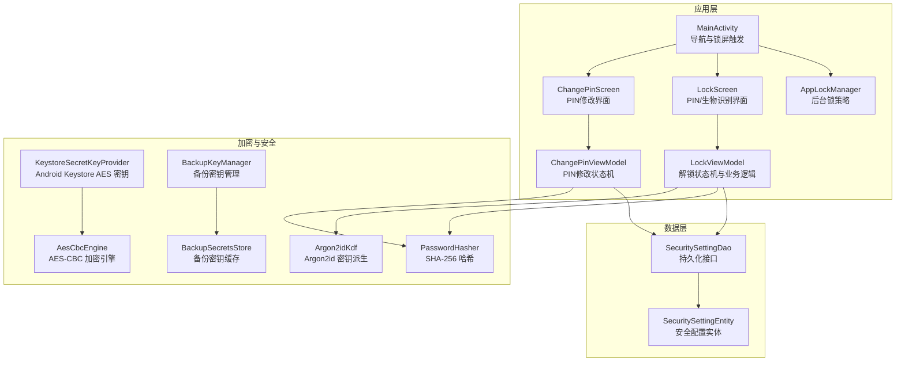

**图表来源**
- [android/app/src/main/kotlin/com/xpx/vault/MainActivity.kt:42-265](file://android/app/src/main/kotlin/com/xpx/vault/MainActivity.kt#L42-L265)
- [android/app/src/main/kotlin/com/xpx/vault/AppLockManager.kt:18-49](file://android/app/src/main/kotlin/com/xpx/vault/AppLockManager.kt#L18-L49)
- [android/app/src/main/kotlin/com/xpx/vault/ui/lock/LockScreen.kt:52-228](file://android/app/src/main/kotlin/com/xpx/vault/ui/lock/LockScreen.kt#L52-L228)
- [android/app/src/main/kotlin/com/xpx/vault/ui/lock/LockViewModel.kt:18-342](file://android/app/src/main/kotlin/com/xpx/vault/ui/lock/LockViewModel.kt#L18-L342)
- [android/app/src/main/kotlin/com/xpx/vault/ui/ChangePinScreen.kt:55-189](file://android/app/src/main/kotlin/com/xpx/vault/ui/ChangePinScreen.kt#L55-L189)
- [android/core/data/src/main/kotlin/com/xpx/vault/data/db/entity/SecuritySettingEntity.kt:7-18](file://android/core/data/src/main/kotlin/com/xpx/vault/data/db/entity/SecuritySettingEntity.kt#L7-L18)
- [android/core/data/src/main/kotlin/com/xpx/vault/data/db/dao/SecuritySettingDao.kt:9-16](file://android/core/data/src/main/kotlin/com/xpx/vault/data/db/dao/SecuritySettingDao.kt#L9-L16)
- [android/core/data/src/main/kotlin/com/xpx/vault/data/crypto/PasswordHasher.kt:6-25](file://android/core/data/src/main/kotlin/com/xpx/vault/data/crypto/PasswordHasher.kt#L6-L25)
- [android/core/data/src/main/kotlin/com/xpx/vault/data/crypto/KeystoreSecretKeyProvider.kt:12-41](file://android/core/data/src/main/kotlin/com/xpx/vault/data/crypto/KeystoreSecretKeyProvider.kt#L12-L41)
- [android/core/data/src/main/kotlin/com/xpx/vault/data/crypto/AesCbcEngine.kt:12-39](file://android/core/data/src/main/kotlin/com/xpx/vault/data/crypto/AesCbcEngine.kt#L12-L39)
- [android/core/data/src/main/kotlin/com/xpx/vault/data/crypto/Argon2idKdf.kt:1-100](file://android/core/data/src/main/kotlin/com/xpx/vault/data/crypto/Argon2idKdf.kt#L1-L100)
- [android/core/data/src/main/kotlin/com/xpx/vault/data/crypto/BackupKeyManager.kt:1-137](file://android/core/data/src/main/kotlin/com/xpx/vault/data/crypto/BackupKeyManager.kt#L1-L137)
- [android/app/src/main/kotlin/com/xpx/vault/ui/backup/BackupSecretsStore.kt:1-120](file://android/app/src/main/kotlin/com/xpx/vault/ui/backup/BackupSecretsStore.kt#L1-L120)

**章节来源**
- [android/app/src/main/kotlin/com/xpx/vault/MainActivity.kt:42-265](file://android/app/src/main/kotlin/com/xpx/vault/MainActivity.kt#L42-L265)
- [android/app/src/main/kotlin/com/xpx/vault/AppLockManager.kt:18-49](file://android/app/src/main/kotlin/com/xpx/vault/AppLockManager.kt#L18-L49)
- [android/app/src/main/kotlin/com/xpx/vault/ui/lock/LockScreen.kt:52-228](file://android/app/src/main/kotlin/com/xpx/vault/ui/lock/LockScreen.kt#L52-L228)
- [android/app/src/main/kotlin/com/xpx/vault/ui/lock/LockViewModel.kt:18-342](file://android/app/src/main/kotlin/com/xpx/vault/ui/lock/LockViewModel.kt#L18-L342)
- [android/app/src/main/kotlin/com/xpx/vault/ui/ChangePinScreen.kt:55-189](file://android/app/src/main/kotlin/com/xpx/vault/ui/ChangePinScreen.kt#L55-L189)
- [android/core/data/src/main/kotlin/com/xpx/vault/data/db/entity/SecuritySettingEntity.kt:7-18](file://android/core/data/src/main/kotlin/com/xpx/vault/data/db/entity/SecuritySettingEntity.kt#L7-L18)
- [android/core/data/src/main/kotlin/com/xpx/vault/data/db/dao/SecuritySettingDao.kt:9-16](file://android/core/data/src/main/kotlin/com/xpx/vault/data/db/dao/SecuritySettingDao.kt#L9-L16)
- [android/core/data/src/main/kotlin/com/xpx/vault/data/crypto/PasswordHasher.kt:6-25](file://android/core/data/src/main/kotlin/com/xpx/vault/data/crypto/PasswordHasher.kt#L6-L25)
- [android/core/data/src/main/kotlin/com/xpx/vault/data/crypto/KeystoreSecretKeyProvider.kt:12-41](file://android/core/data/src/main/kotlin/com/xpx/vault/data/crypto/KeystoreSecretKeyProvider.kt#L12-L41)
- [android/core/data/src/main/kotlin/com/xpx/vault/data/crypto/AesCbcEngine.kt:12-39](file://android/core/data/src/main/kotlin/com/xpx/vault/data/crypto/AesCbcEngine.kt#L12-L39)
- [android/core/data/src/main/kotlin/com/xpx/vault/data/crypto/Argon2idKdf.kt:1-100](file://android/core/data/src/main/kotlin/com/xpx/vault/data/crypto/Argon2idKdf.kt#L1-L100)
- [android/core/data/src/main/kotlin/com/xpx/vault/data/crypto/BackupKeyManager.kt:1-137](file://android/core/data/src/main/kotlin/com/xpx/vault/data/crypto/BackupKeyManager.kt#L1-L137)
- [android/app/src/main/kotlin/com/xpx/vault/ui/backup/BackupSecretsStore.kt:1-120](file://android/app/src/main/kotlin/com/xpx/vault/ui/backup/BackupSecretsStore.kt#L1-L120)

## 核心组件
- LockScreen：负责 PIN 输入与生物识别提示 UI，集成 BiometricPrompt 并根据状态自动弹出生物识别。**更新** 新增4秒生物识别自动重试冷却期，改进用户取消后的重试机制，增强自动后台提示功能。
- LockViewModel：实现解锁状态机（设置 PIN、确认 PIN、解锁）、PIN 哈希校验、失败计数与生物识别开关。**更新** 优化PIN解锁机制，verifyUnlockPin函数现在可以立即设置unlockSuccess=true，将Argon2id密钥派生过程移到后台协程执行。
- **ChangePinScreen**：**新增** 提供完整的六位PIN修改功能，包含验证旧PIN、设置新PIN、确认新PIN的三步流程。
- **ChangePinViewModel**：**新增** 实现PIN修改状态机，处理PIN验证、新旧PIN比较、错误处理和数据库更新。
- AppLockManager：基于进程生命周期的后台锁策略，控制是否需要显示锁屏。
- SecuritySettingEntity/Dao：持久化安全配置（锁类型、PIN 哈希、生物识别开关、失败次数）。
- PasswordHasher：提供 SHA-256 哈希与带盐哈希能力，用于 PIN 存储。
- KeystoreSecretKeyProvider/AesCbcEngine：在 Android Keystore 中生成/读取 AES 密钥，提供 AES-CBC 加密能力（用于后续资产加密）。
- **Argon2idKdf**：**新增** 提供Argon2id密钥派生算法，支持设备自适应参数选择和内存优化。
- **BackupKeyManager**：**新增** 管理备份密钥的生成、缓存和指纹计算，支持多种KDF算法。
- **BackupSecretsStore**：**新增** 提供备份密钥的缓存和安全存储，使用Android Keystore进行包装加密。

**章节来源**
- [android/app/src/main/kotlin/com/xpx/vault/ui/lock/LockScreen.kt:52-228](file://android/app/src/main/kotlin/com/xpx/vault/ui/lock/LockScreen.kt#L52-L228)
- [android/app/src/main/kotlin/com/xpx/vault/ui/lock/LockViewModel.kt:18-342](file://android/app/src/main/kotlin/com/xpx/vault/ui/lock/LockViewModel.kt#L18-L342)
- [android/app/src/main/kotlin/com/xpx/vault/ui/ChangePinScreen.kt:55-189](file://android/app/src/main/kotlin/com/xpx/vault/ui/ChangePinScreen.kt#L55-L189)
- [android/app/src/main/kotlin/com/xpx/vault/ui/ChangePinScreen.kt:191-306](file://android/app/src/main/kotlin/com/xpx/vault/ui/ChangePinScreen.kt#L191-L306)
- [android/app/src/main/kotlin/com/xpx/vault/AppLockManager.kt:18-49](file://android/app/src/main/kotlin/com/xpx/vault/AppLockManager.kt#L18-L49)
- [android/core/data/src/main/kotlin/com/xpx/vault/data/db/entity/SecuritySettingEntity.kt:7-18](file://android/core/data/src/main/kotlin/com/xpx/vault/data/db/entity/SecuritySettingEntity.kt#L7-L18)
- [android/core/data/src/main/kotlin/com/xpx/vault/data/db/dao/SecuritySettingDao.kt:9-16](file://android/core/data/src/main/kotlin/com/xpx/vault/data/db/dao/SecuritySettingDao.kt#L9-L16)
- [android/core/data/src/main/kotlin/com/xpx/vault/data/crypto/PasswordHasher.kt:6-25](file://android/core/data/src/main/kotlin/com/xpx/vault/data/crypto/PasswordHasher.kt#L6-L25)
- [android/core/data/src/main/kotlin/com/xpx/vault/data/crypto/KeystoreSecretKeyProvider.kt:12-41](file://android/core/data/src/main/kotlin/com/xpx/vault/data/crypto/KeystoreSecretKeyProvider.kt#L12-L41)
- [android/core/data/src/main/kotlin/com/xpx/vault/data/crypto/AesCbcEngine.kt:12-39](file://android/core/data/src/main/kotlin/com/xpx/vault/data/crypto/AesCbcEngine.kt#L12-L39)
- [android/core/data/src/main/kotlin/com/xpx/vault/data/crypto/Argon2idKdf.kt:1-100](file://android/core/data/src/main/kotlin/com/xpx/vault/data/crypto/Argon2idKdf.kt#L1-L100)
- [android/core/data/src/main/kotlin/com/xpx/vault/data/crypto/BackupKeyManager.kt:1-137](file://android/core/data/src/main/kotlin/com/xpx/vault/data/crypto/BackupKeyManager.kt#L1-L137)
- [android/app/src/main/kotlin/com/xpx/vault/ui/backup/BackupSecretsStore.kt:1-120](file://android/app/src/main/kotlin/com/xpx/vault/ui/backup/BackupSecretsStore.kt#L1-L120)

## 架构总览
安全解锁系统采用"UI 状态机 + 数据持久化 + 加密工具"的分层设计。UI 层通过 ViewModel 维护状态，数据层通过 Room 持久化安全配置；PIN 采用 SHA-256 哈希存储，生物识别作为辅助解锁手段；后台锁策略通过生命周期观察器触发。**更新** 新增智能密钥派生和缓存机制，通过Argon2idKdf、BackupKeyManager和BackupSecretsStore实现高效的密钥管理。

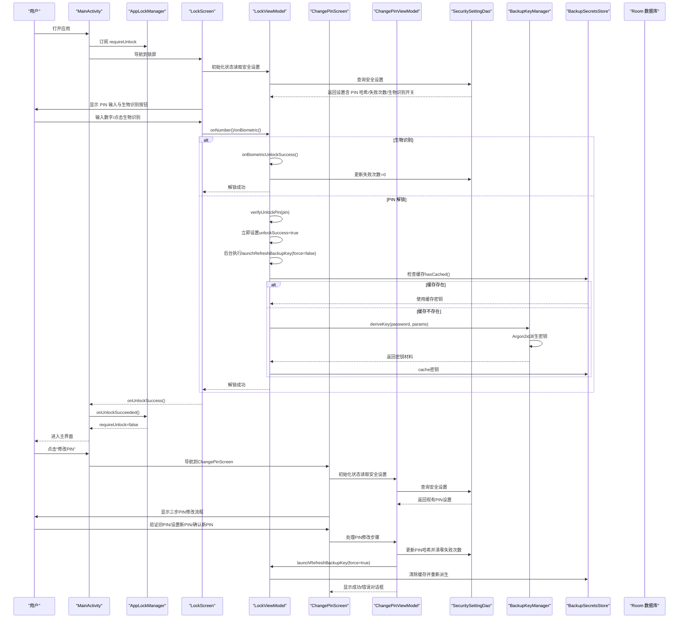

**图表来源**
- [android/app/src/main/kotlin/com/xpx/vault/MainActivity.kt:42-265](file://android/app/src/main/kotlin/com/xpx/vault/MainActivity.kt#L42-L265)
- [android/app/src/main/kotlin/com/xpx/vault/AppLockManager.kt:18-49](file://android/app/src/main/kotlin/com/xpx/vault/AppLockManager.kt#L18-L49)
- [android/app/src/main/kotlin/com/xpx/vault/ui/lock/LockScreen.kt:52-228](file://android/app/src/main/kotlin/com/xpx/vault/ui/lock/LockScreen.kt#L52-L228)
- [android/app/src/main/kotlin/com/xpx/vault/ui/lock/LockViewModel.kt:18-342](file://android/app/src/main/kotlin/com/xpx/vault/ui/lock/LockViewModel.kt#L18-L342)
- [android/app/src/main/kotlin/com/xpx/vault/ui/ChangePinScreen.kt:55-189](file://android/app/src/main/kotlin/com/xpx/vault/ui/ChangePinScreen.kt#L55-L189)
- [android/app/src/main/kotlin/com/xpx/vault/ui/ChangePinScreen.kt:191-306](file://android/app/src/main/kotlin/com/xpx/vault/ui/ChangePinScreen.kt#L191-L306)
- [android/core/data/src/main/kotlin/com/xpx/vault/data/db/dao/SecuritySettingDao.kt:9-16](file://android/core/data/src/main/kotlin/com/xpx/vault/data/db/dao/SecuritySettingDao.kt#L9-L16)
- [android/core/data/src/main/kotlin/com/xpx/vault/data/crypto/BackupKeyManager.kt:1-137](file://android/core/data/src/main/kotlin/com/xpx/vault/data/crypto/BackupKeyManager.kt#L1-L137)
- [android/app/src/main/kotlin/com/xpx/vault/ui/backup/BackupSecretsStore.kt:1-120](file://android/app/src/main/kotlin/com/xpx/vault/ui/backup/BackupSecretsStore.kt#L1-L120)

## 详细组件分析

### LockScreen：解锁界面与生物识别集成
- 负责渲染标题、副标题、步骤标签、PIN 点位指示与错误/成功提示。
- **更新** 新增 BIOMETRIC_AUTO_RETRY_COOLDOWN_MS 常量（4秒），用于控制用户取消后的自动重试冷却期。
- 自动检测生物识别可用性（BiometricManager），在满足条件时自动弹出 BiometricPrompt。
- **改进** 用户取消生物识别认证时，记录取消时间戳，避免在4秒内重复弹窗。
- **增强** 通过生命周期事件监听器，在应用从后台回到前台时自动弹出生物识别提示。
- 支持数字键盘输入、删除键、快速拍照入口与生物识别按钮。
- 生物识别回调处理：成功则通知 ViewModel 解锁成功；错误/失败分别记录错误消息。

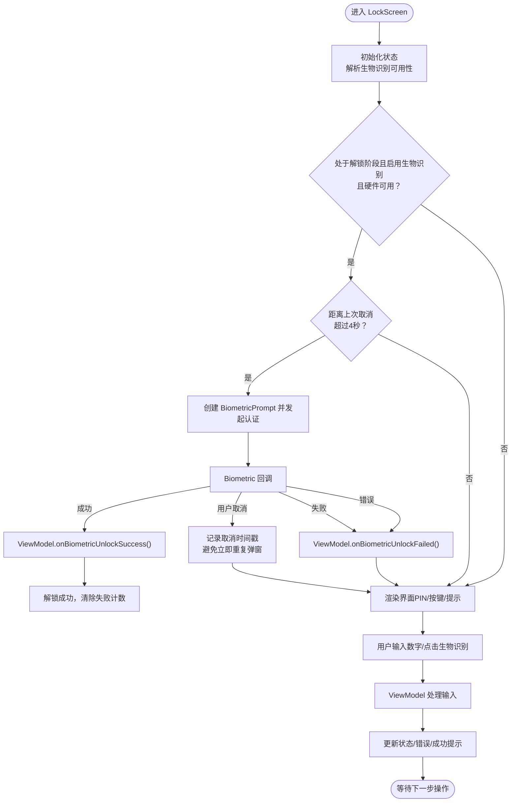

**图表来源**
- [android/app/src/main/kotlin/com/xpx/vault/ui/lock/LockScreen.kt:57-158](file://android/app/src/main/kotlin/com/xpx/vault/ui/lock/LockScreen.kt#L57-L158)
- [android/app/src/main/kotlin/com/xpx/vault/ui/lock/LockViewModel.kt:148-163](file://android/app/src/main/kotlin/com/xpx/vault/ui/lock/LockViewModel.kt#L148-L163)

**章节来源**
- [android/app/src/main/kotlin/com/xpx/vault/ui/lock/LockScreen.kt:52-228](file://android/app/src/main/kotlin/com/xpx/vault/ui/lock/LockScreen.kt#L52-L228)

### LockViewModel：解锁状态机与业务逻辑
- 状态机包含四个阶段：SETUP_ENTER、SETUP_CONFIRM、SETUP_CONFIRM_ERROR、UNLOCK。
- 设置 PIN 流程：输入 6 位 PIN，二次确认；确认一致则使用 PasswordHasher.sha256Hex 存储哈希；否则提示不一致并允许重新设置。
- **更新** 优化PIN解锁机制：verifyUnlockPin函数现在可以立即设置unlockSuccess=true，实现即时UI响应。
- **更新** 引入智能密钥派生：launchRefreshBackupKey函数将Argon2id密钥派生过程移到后台协程执行。
- **更新** 增加force参数控制：通过force参数精确控制备份密钥派生行为，force=true时忽略缓存强制重新派生。
- **更新** 实现缓存机制：BackupSecretsStore.hasCached()检查缓存有效性，避免重复计算。
- 解锁流程：收集 6 位 PIN，计算哈希并与数据库中的 pinHashHex 比较；正确则清零失败计数，错误则失败计数+1，并提示剩余尝试次数。
- 生物识别成功回调：清零失败计数并标记解锁成功。
- 提供生物识别开关设置与对话框状态管理。

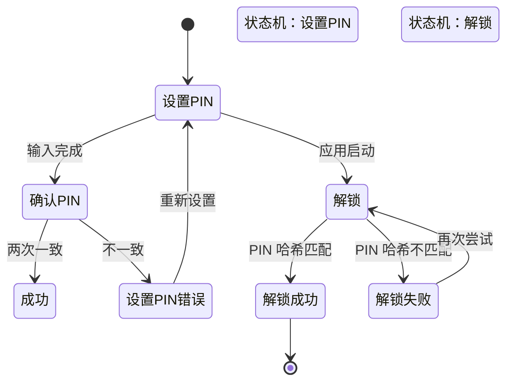

**图表来源**
- [android/app/src/main/kotlin/com/xpx/vault/ui/lock/LockViewModel.kt:316-322](file://android/app/src/main/kotlin/com/xpx/vault/ui/lock/LockViewModel.kt#L316-L322)

**章节来源**
- [android/app/src/main/kotlin/com/xpx/vault/ui/lock/LockViewModel.kt:18-342](file://android/app/src/main/kotlin/com/xpx/vault/ui/lock/LockViewModel.kt#L18-L342)

### ChangePinScreen：功能完整的PIN修改界面
**新增** ChangePinScreen 提供完整的六位PIN修改功能，包含三个步骤的直观界面：

- **验证旧PIN步骤**：要求用户输入当前使用的6位PIN进行身份验证
- **设置新PIN步骤**：要求用户输入新的6位PIN作为解锁密码
- **确认新PIN步骤**：要求用户再次输入新PIN以确保输入正确
- **输入显示控制**：支持显示/隐藏输入内容，提高安全性
- **错误处理**：提供详细的错误提示和重试机制
- **成功反馈**：修改成功后显示确认对话框并自动返回

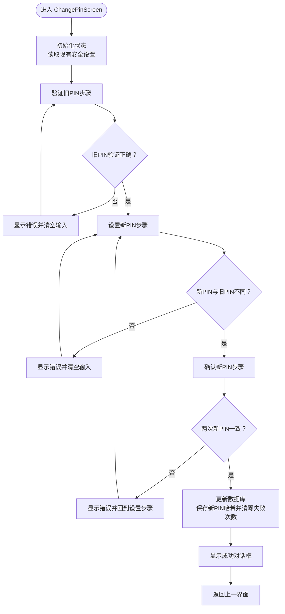

**图表来源**
- [android/app/src/main/kotlin/com/xpx/vault/ui/ChangePinScreen.kt:55-189](file://android/app/src/main/kotlin/com/xpx/vault/ui/ChangePinScreen.kt#L55-L189)
- [android/app/src/main/kotlin/com/xpx/vault/ui/ChangePinScreen.kt:191-306](file://android/app/src/main/kotlin/com/xpx/vault/ui/ChangePinScreen.kt#L191-L306)

**章节来源**
- [android/app/src/main/kotlin/com/xpx/vault/ui/ChangePinScreen.kt:55-189](file://android/app/src/main/kotlin/com/xpx/vault/ui/ChangePinScreen.kt#L55-L189)
- [android/app/src/main/kotlin/com/xpx/vault/ui/ChangePinScreen.kt:191-306](file://android/app/src/main/kotlin/com/xpx/vault/ui/ChangePinScreen.kt#L191-L306)

### ChangePinViewModel：PIN修改状态机与业务逻辑
**新增** ChangePinViewModel 实现完整的PIN修改状态机：

- **状态管理**：使用 ChangePinUiState 管理加载状态、当前步骤、输入值和错误信息
- **步骤控制**：通过 ChangePinStep 枚举管理三个步骤（验证旧PIN、设置新PIN、确认新PIN）
- **PIN验证**：验证旧PIN与数据库中的哈希值匹配
- **新旧PIN比较**：防止新PIN与旧PIN相同，确保安全性
- **错误处理**：提供详细的错误消息和状态重置
- **数据库更新**：成功修改后更新PIN哈希并清零失败次数

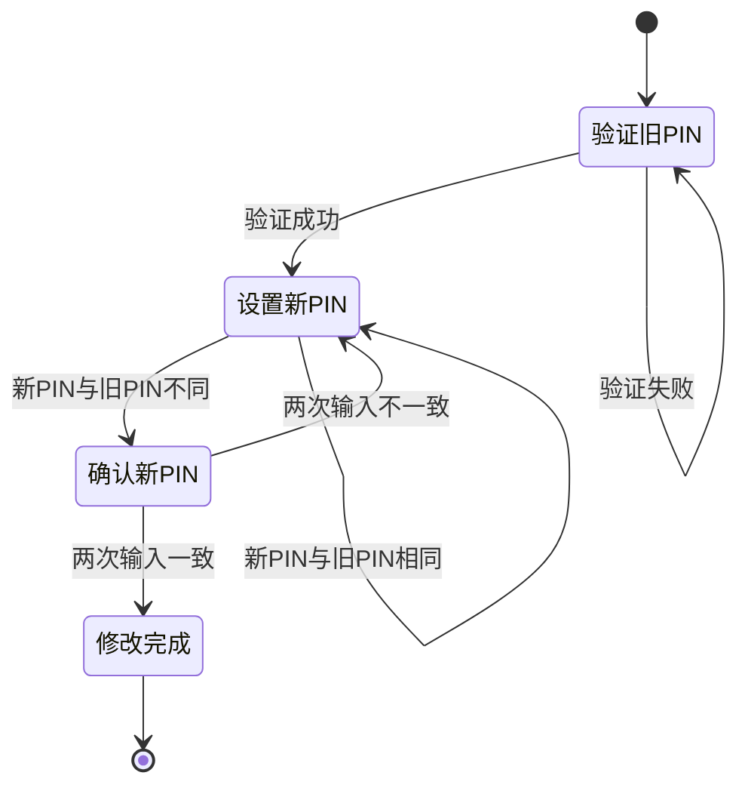

**图表来源**
- [android/app/src/main/kotlin/com/xpx/vault/ui/ChangePinScreen.kt:308-344](file://android/app/src/main/kotlin/com/xpx/vault/ui/ChangePinScreen.kt#L308-L344)
- [android/app/src/main/kotlin/com/xpx/vault/ui/ChangePinScreen.kt:191-306](file://android/app/src/main/kotlin/com/xpx/vault/ui/ChangePinScreen.kt#L191-L306)

**章节来源**
- [android/app/src/main/kotlin/com/xpx/vault/ui/ChangePinScreen.kt:191-306](file://android/app/src/main/kotlin/com/xpx/vault/ui/ChangePinScreen.kt#L191-L306)

### AppLockManager：后台锁策略与会话控制
- 使用 ProcessLifecycleObserver，在应用停止（onStop）时触发 requireUnlock=true，从而在非可见状态下强制锁屏。
- 解锁成功后调用 onUnlockSucceeded() 将 requireUnlock 设为 false，允许进入受保护内容。
- 该策略避免了页面切换导致的频繁锁屏，仅在应用真正后台时才锁。

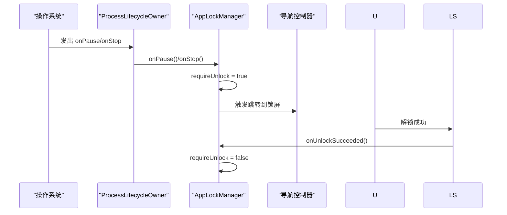

**图表来源**
- [android/app/src/main/kotlin/com/xpx/vault/AppLockManager.kt:18-49](file://android/app/src/main/kotlin/com/xpx/vault/AppLockManager.kt#L18-L49)
- [android/app/src/main/kotlin/com/xpx/vault/MainActivity.kt:42-265](file://android/app/src/main/kotlin/com/xpx/vault/MainActivity.kt#L42-L265)

**章节来源**
- [android/app/src/main/kotlin/com/xpx/vault/AppLockManager.kt:18-49](file://android/app/src/main/kotlin/com/xpx/vault/AppLockManager.kt#L18-L49)
- [android/app/src/main/kotlin/com/xpx/vault/MainActivity.kt:42-265](file://android/app/src/main/kotlin/com/xpx/vault/MainActivity.kt#L42-L265)

### 密码哈希与安全存储
- PIN 存储采用 SHA-256 哈希，避免明文保存；提供 sha256Hex 与 sha256HexWithSalt 接口，便于未来引入安装级盐。
- 安全配置实体包含 lockType、pinHashHex、biometricEnabled、failCount；通过 SecuritySettingDao 进行查询与更新。

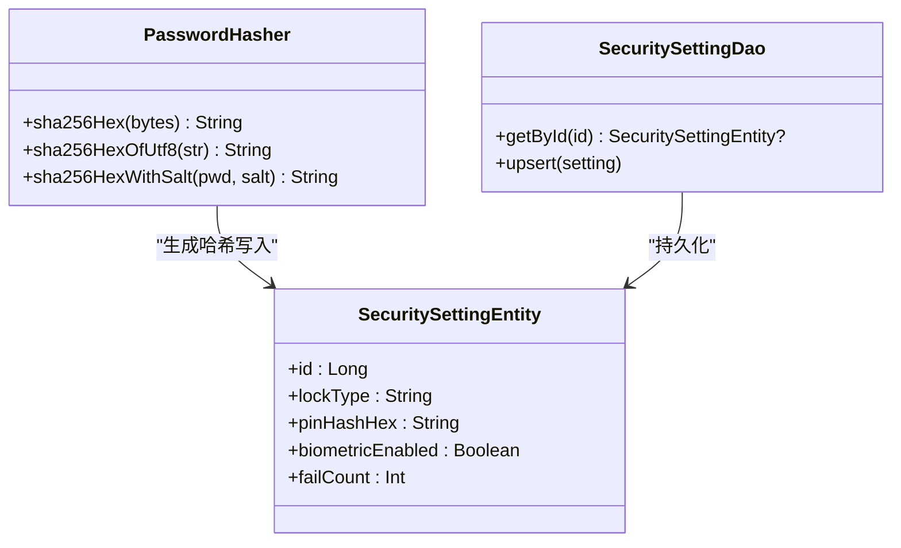

**图表来源**
- [android/core/data/src/main/kotlin/com/xpx/vault/data/crypto/PasswordHasher.kt:6-25](file://android/core/data/src/main/kotlin/com/xpx/vault/data/crypto/PasswordHasher.kt#L6-L25)
- [android/core/data/src/main/kotlin/com/xpx/vault/data/db/entity/SecuritySettingEntity.kt:7-18](file://android/core/data/src/main/kotlin/com/xpx/vault/data/db/entity/SecuritySettingEntity.kt#L7-L18)
- [android/core/data/src/main/kotlin/com/xpx/vault/data/db/dao/SecuritySettingDao.kt:9-16](file://android/core/data/src/main/kotlin/com/xpx/vault/data/db/dao/SecuritySettingDao.kt#L9-L16)

**章节来源**
- [android/core/data/src/main/kotlin/com/xpx/vault/data/crypto/PasswordHasher.kt:6-25](file://android/core/data/src/main/kotlin/com/xpx/vault/data/crypto/PasswordHasher.kt#L6-L25)
- [android/core/data/src/main/kotlin/com/xpx/vault/data/db/entity/SecuritySettingEntity.kt:7-18](file://android/core/data/src/main/kotlin/com/xpx/vault/data/db/entity/SecuritySettingEntity.kt#L7-L18)
- [android/core/data/src/main/kotlin/com/xpx/vault/data/db/dao/SecuritySettingDao.kt:9-16](file://android/core/data/src/main/kotlin/com/xpx/vault/data/db/dao/SecuritySettingDao.kt#L9-L16)

### Android Keystore 与 AES 加密
- KeystoreSecretKeyProvider：在 Android Keystore 中生成/读取 AES 密钥，密钥材料不可导出，适合长期托管主密钥。
- AesCbcEngine：提供 AES-256-CBC + PKCS7 加密，IV 前置 16 字节，与现有资产加密管线保持一致。

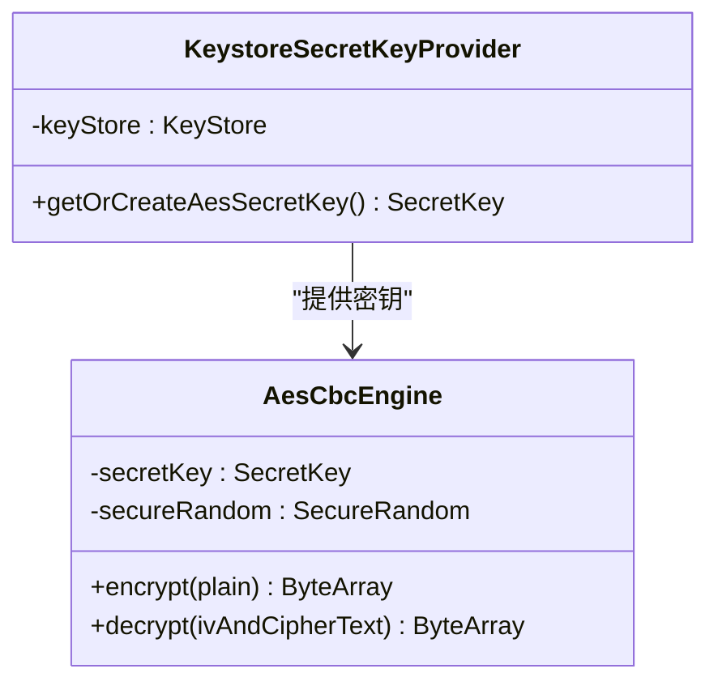

**图表来源**
- [android/core/data/src/main/kotlin/com/xpx/vault/data/crypto/KeystoreSecretKeyProvider.kt:12-41](file://android/core/data/src/main/kotlin/com/xpx/vault/data/crypto/KeystoreSecretKeyProvider.kt#L12-L41)
- [android/core/data/src/main/kotlin/com/xpx/vault/data/crypto/AesCbcEngine.kt:12-39](file://android/core/data/src/main/kotlin/com/xpx/vault/data/crypto/AesCbcEngine.kt#L12-L39)

**章节来源**
- [android/core/data/src/main/kotlin/com/xpx/vault/data/crypto/KeystoreSecretKeyProvider.kt:12-41](file://android/core/data/src/main/kotlin/com/xpx/vault/data/crypto/KeystoreSecretKeyProvider.kt#L12-L41)
- [android/core/data/src/main/kotlin/com/xpx/vault/data/crypto/AesCbcEngine.kt:12-39](file://android/core/data/src/main/kotlin/com/xpx/vault/data/crypto/AesCbcEngine.kt#L12-L39)

### Argon2id 密钥派生与备份密钥管理
**新增** Argon2idKdf提供高性能的Argon2id密钥派生算法，支持设备自适应参数选择和内存优化：

- **设备自适应**：根据设备内存自动选择参数，低端设备使用降级参数
- **内存优化**：默认64MB内存使用，低端设备32MB，支持动态调整
- **安全参数**：支持可配置的迭代次数、并行度和盐值长度
- **安全清理**：自动清理中间缓冲区，防止内存泄露

**新增** BackupKeyManager管理备份密钥的完整生命周期：

- **密钥派生**：通过Argon2id从PIN口令和设备盐派生AES-256密钥
- **参数管理**：持久化KDF参数，支持跨设备迁移
- **指纹计算**：生成16字节密钥指纹，用于密码变更检测
- **安全存储**：支持多种KDF算法，可扩展替换

**新增** BackupSecretsStore提供智能缓存机制：

- **缓存策略**：使用Android Keystore包装密钥，安全存储到私有目录
- **自动清理**：解密失败自动清空缓存，防止损坏数据
- **性能优化**：避免重复计算Argon2id密钥派生
- **安全包装**：使用AES-GCM加密包装密钥，防止直接暴露

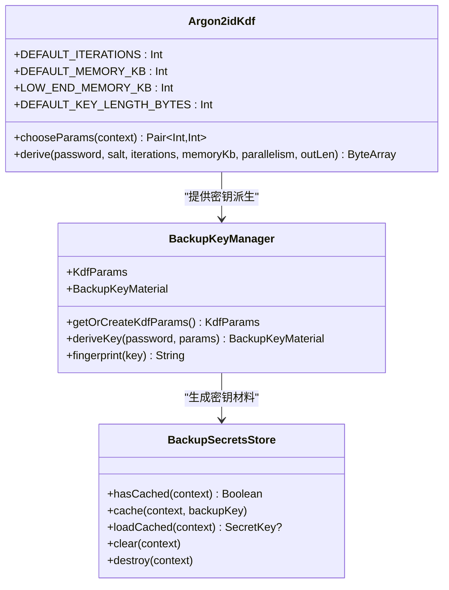

**图表来源**
- [android/core/data/src/main/kotlin/com/xpx/vault/data/crypto/Argon2idKdf.kt:1-100](file://android/core/data/src/main/kotlin/com/xpx/vault/data/crypto/Argon2idKdf.kt#L1-L100)
- [android/core/data/src/main/kotlin/com/xpx/vault/data/crypto/BackupKeyManager.kt:1-137](file://android/core/data/src/main/kotlin/com/xpx/vault/data/crypto/BackupKeyManager.kt#L1-L137)
- [android/app/src/main/kotlin/com/xpx/vault/ui/backup/BackupSecretsStore.kt:1-120](file://android/app/src/main/kotlin/com/xpx/vault/ui/backup/BackupSecretsStore.kt#L1-L120)

**章节来源**
- [android/core/data/src/main/kotlin/com/xpx/vault/data/crypto/Argon2idKdf.kt:1-100](file://android/core/data/src/main/kotlin/com/xpx/vault/data/crypto/Argon2idKdf.kt#L1-L100)
- [android/core/data/src/main/kotlin/com/xpx/vault/data/crypto/BackupKeyManager.kt:1-137](file://android/core/data/src/main/kotlin/com/xpx/vault/data/crypto/BackupKeyManager.kt#L1-L137)
- [android/app/src/main/kotlin/com/xpx/vault/ui/backup/BackupSecretsStore.kt:1-120](file://android/app/src/main/kotlin/com/xpx/vault/ui/backup/BackupSecretsStore.kt#L1-L120)

### 生物识别认证与回退策略
- LockScreen 使用 BiometricManager 检查可用性，BiometricPrompt 弹窗进行认证。
- **更新** 新增4秒自动重试冷却期，避免用户取消后立即重复弹窗。
- **改进** 区分用户取消（ERROR_NEGATIVE_BUTTON、ERROR_USER_CANCELED、ERROR_CANCELED）和实际失败情况。
- 成功回调：清零失败计数并标记解锁成功。
- 失败/错误回调：记录错误消息，引导用户重试或使用 PIN 解锁。
- 回退策略：当生物识别不可用或失败时，PIN 解锁作为唯一保障。

**章节来源**
- [android/app/src/main/kotlin/com/xpx/vault/ui/lock/LockScreen.kt:71-106](file://android/app/src/main/kotlin/com/xpx/vault/ui/lock/LockScreen.kt#L71-L106)
- [android/app/src/main/kotlin/com/xpx/vault/ui/lock/LockViewModel.kt:148-163](file://android/app/src/main/kotlin/com/xpx/vault/ui/lock/LockViewModel.kt#L148-L163)
- [doc/android/03-解锁与安全模块.md:15-17](file://doc/android/03-解锁与安全模块.md#L15-L17)

## 依赖关系分析
- UI 依赖 ViewModel；ViewModel 依赖数据库访问层（SecuritySettingDao）与密码哈希工具。
- 锁屏触发依赖 AppLockManager；AppLockManager 依赖生命周期观察者。
- 加密路径：KeystoreSecretKeyProvider 提供密钥，AesCbcEngine 执行加密/解密，用于后续资产加密。
- **新增** ChangePinScreen 依赖 ChangePinViewModel 和 SecuritySettingDao，实现独立的PIN管理功能。
- **新增** LockViewModel 依赖 BackupKeyManager 和 BackupSecretsStore，实现智能密钥管理。
- **新增** BackupKeyManager 依赖 Argon2idKdf，实现高性能密钥派生。

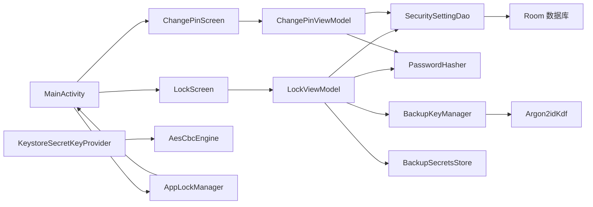

**图表来源**
- [android/app/src/main/kotlin/com/xpx/vault/ui/lock/LockScreen.kt:52-228](file://android/app/src/main/kotlin/com/xpx/vault/ui/lock/LockScreen.kt#L52-L228)
- [android/app/src/main/kotlin/com/xpx/vault/ui/lock/LockViewModel.kt:18-342](file://android/app/src/main/kotlin/com/xpx/vault/ui/lock/LockViewModel.kt#L18-L342)
- [android/app/src/main/kotlin/com/xpx/vault/ui/ChangePinScreen.kt:55-189](file://android/app/src/main/kotlin/com/xpx/vault/ui/ChangePinScreen.kt#L55-L189)
- [android/app/src/main/kotlin/com/xpx/vault/ui/ChangePinScreen.kt:191-306](file://android/app/src/main/kotlin/com/xpx/vault/ui/ChangePinScreen.kt#L191-L306)
- [android/app/src/main/kotlin/com/xpx/vault/MainActivity.kt:42-265](file://android/app/src/main/kotlin/com/xpx/vault/MainActivity.kt#L42-L265)
- [android/app/src/main/kotlin/com/xpx/vault/AppLockManager.kt:18-49](file://android/app/src/main/kotlin/com/xpx/vault/AppLockManager.kt#L18-L49)
- [android/core/data/src/main/kotlin/com/xpx/vault/data/crypto/KeystoreSecretKeyProvider.kt:12-41](file://android/core/data/src/main/kotlin/com/xpx/vault/data/crypto/KeystoreSecretKeyProvider.kt#L12-L41)
- [android/core/data/src/main/kotlin/com/xpx/vault/data/crypto/AesCbcEngine.kt:12-39](file://android/core/data/src/main/kotlin/com/xpx/vault/data/crypto/AesCbcEngine.kt#L12-L39)
- [android/core/data/src/main/kotlin/com/xpx/vault/data/crypto/BackupKeyManager.kt:1-137](file://android/core/data/src/main/kotlin/com/xpx/vault/data/crypto/BackupKeyManager.kt#L1-L137)
- [android/core/data/src/main/kotlin/com/xpx/vault/data/crypto/Argon2idKdf.kt:1-100](file://android/core/data/src/main/kotlin/com/xpx/vault/data/crypto/Argon2idKdf.kt#L1-L100)
- [android/app/src/main/kotlin/com/xpx/vault/ui/backup/BackupSecretsStore.kt:1-120](file://android/app/src/main/kotlin/com/xpx/vault/ui/backup/BackupSecretsStore.kt#L1-L120)

**章节来源**
- [android/app/src/main/kotlin/com/xpx/vault/ui/lock/LockScreen.kt:52-228](file://android/app/src/main/kotlin/com/xpx/vault/ui/lock/LockScreen.kt#L52-L228)
- [android/app/src/main/kotlin/com/xpx/vault/ui/lock/LockViewModel.kt:18-342](file://android/app/src/main/kotlin/com/xpx/vault/ui/lock/LockViewModel.kt#L18-L342)
- [android/app/src/main/kotlin/com/xpx/vault/ui/ChangePinScreen.kt:55-189](file://android/app/src/main/kotlin/com/xpx/vault/ui/ChangePinScreen.kt#L55-L189)
- [android/app/src/main/kotlin/com/xpx/vault/ui/ChangePinScreen.kt:191-306](file://android/app/src/main/kotlin/com/xpx/vault/ui/ChangePinScreen.kt#L191-L306)
- [android/app/src/main/kotlin/com/xpx/vault/MainActivity.kt:42-265](file://android/app/src/main/kotlin/com/xpx/vault/MainActivity.kt#L42-L265)
- [android/app/src/main/kotlin/com/xpx/vault/AppLockManager.kt:18-49](file://android/app/src/main/kotlin/com/xpx/vault/AppLockManager.kt#L18-L49)
- [android/core/data/src/main/kotlin/com/xpx/vault/data/crypto/KeystoreSecretKeyProvider.kt:12-41](file://android/core/data/src/main/kotlin/com/xpx/vault/data/crypto/KeystoreSecretKeyProvider.kt#L12-L41)
- [android/core/data/src/main/kotlin/com/xpx/vault/data/crypto/AesCbcEngine.kt:12-39](file://android/core/data/src/main/kotlin/com/xpx/vault/data/crypto/AesCbcEngine.kt#L12-L39)
- [android/core/data/src/main/kotlin/com/xpx/vault/data/crypto/BackupKeyManager.kt:1-137](file://android/core/data/src/main/kotlin/com/xpx/vault/data/crypto/BackupKeyManager.kt#L1-L137)
- [android/core/data/src/main/kotlin/com/xpx/vault/data/crypto/Argon2idKdf.kt:1-100](file://android/core/data/src/main/kotlin/com/xpx/vault/data/crypto/Argon2idKdf.kt#L1-L100)
- [android/app/src/main/kotlin/com/xpx/vault/ui/backup/BackupSecretsStore.kt:1-120](file://android/app/src/main/kotlin/com/xpx/vault/ui/backup/BackupSecretsStore.kt#L1-L120)

## 性能考量
- UI 渲染与状态流：使用 Compose StateFlow 驱动界面，避免不必要的重组；数字输入与错误提示即时反馈。
- 数据库访问：Room 查询与插入在 ViewModelScope 协程中执行，避免阻塞主线程。
- 加密性能：AES-CBC 在 Android 上性能稳定，IV 随机生成，不影响整体性能。
- 生命周期锁策略：仅在应用停止时触发锁屏，减少前台频繁锁屏带来的体验损耗。
- **新增** 异步密钥派生：所有密钥派生操作都在IO调度器中异步执行，避免阻塞UI线程。
- **新增** 智能缓存机制：BackupSecretsStore提供密钥缓存，避免重复计算Argon2id密钥派生。
- **新增** force参数优化：通过force参数精确控制密钥派生行为，Setup和改密码时强制重新派生，正常解锁时使用缓存。
- **更新** 生物识别冷却期优化：4秒冷却期避免频繁弹窗，提升用户体验。

## 故障排查指南
- 生物识别不可用
  - 现象：无法弹出生物识别或提示硬件不可用。
  - 排查：检查 BiometricManager 返回值与设备生物识别注册状态；确认系统设置中已录入指纹/面部。
  - **更新** 检查冷却期设置：确认 BIOMETRIC_AUTO_RETRY_COOLDOWN_MS 常量为4秒。
  - 参考：[android/app/src/main/kotlin/com/xpx/vault/ui/lock/LockScreen.kt:365-382](file://android/app/src/main/kotlin/com/xpx/vault/ui/lock/LockScreen.kt#L365-L382)
- **更新** 生物识别自动重试问题
  - 现象：用户取消生物识别后立即重复弹窗。
  - 排查：检查 lastBiometricDismissedAt 时间戳记录；确认 canAutoPromptBiometric() 函数中的冷却期判断。
  - 参考：[android/app/src/main/kotlin/com/xpx/vault/ui/lock/LockScreen.kt:85-92](file://android/app/src/main/kotlin/com/xpx/vault/ui/lock/LockScreen.kt#L85-L92)
- PIN 解锁失败
  - 现象：多次错误后提示剩余尝试次数或账户临时锁定。
  - 排查：确认输入长度与一致性；检查数据库 failCount 是否递增；确保哈希算法一致。
  - **更新** 检查密钥缓存：确认BackupSecretsStore.hasCached()返回正确的缓存状态。
  - 参考：[android/app/src/main/kotlin/com/xpx/vault/ui/lock/LockViewModel.kt:201-219](file://android/app/src/main/kotlin/com/xpx/vault/ui/lock/LockViewModel.kt#L201-L219)
- **新增** ChangePinScreen 修改失败
  - 现象：PIN修改过程中出现错误或无法完成修改。
  - 排查：检查网络连接和数据库访问权限；确认新PIN符合6位数字要求；验证新旧PIN不相同。
  - 参考：[android/app/src/main/kotlin/com/xpx/vault/ui/ChangePinScreen.kt:282-304](file://android/app/src/main/kotlin/com/xpx/vault/ui/ChangePinScreen.kt#L282-L304)
- **新增** 密钥派生异常
  - 现象：Argon2id密钥派生失败或性能问题。
  - 排查：检查设备内存和CPU性能；确认Argon2idKdf.chooseParams()返回正确的参数；验证BackupKeyManager.getOrCreateKdfParams()的参数持久化。
  - 参考：[android/core/data/src/main/kotlin/com/xpx/vault/data/crypto/Argon2idKdf.kt:36-45](file://android/core/data/src/main/kotlin/com/xpx/vault/data/crypto/Argon2idKdf.kt#L36-L45)
- **新增** 密钥缓存问题
  - 现象：BackupSecretsStore缓存失效或解密失败。
  - 排查：检查Android Keystore中的wrap密钥是否存在；确认AES-GCM加密参数正确；验证缓存文件格式。
  - 参考：[android/app/src/main/kotlin/com/xpx/vault/ui/backup/BackupSecretsStore.kt:61-79](file://android/app/src/main/kotlin/com/xpx/vault/ui/backup/BackupSecretsStore.kt#L61-L79)
- 锁屏未触发
  - 现象：应用切换到后台未锁屏。
  - 排查：确认 AppLockManager 的生命周期监听是否生效；检查 requireUnlock 状态变化。
  - 参考：[android/app/src/main/kotlin/com/xpx/vault/AppLockManager.kt:18-49](file://android/app/src/main/kotlin/com/xpx/vault/AppLockManager.kt#L18-L49)
- 加密异常
  - 现象：解密失败或长度异常。
  - 排查：确认 IV 前置长度与密钥来源；验证 Keystore 密钥是否存在。
  - 参考：[android/core/data/src/main/kotlin/com/xpx/vault/data/crypto/AesCbcEngine.kt:25-32](file://android/core/data/src/main/kotlin/com/xpx/vault/data/crypto/AesCbcEngine.kt#L25-L32)

**章节来源**
- [android/app/src/main/kotlin/com/xpx/vault/ui/lock/LockScreen.kt:365-382](file://android/app/src/main/kotlin/com/xpx/vault/ui/lock/LockScreen.kt#L365-L382)
- [android/app/src/main/kotlin/com/xpx/vault/ui/lock/LockScreen.kt:85-92](file://android/app/src/main/kotlin/com/xpx/vault/ui/lock/LockScreen.kt#L85-L92)
- [android/app/src/main/kotlin/com/xpx/vault/ui/lock/LockViewModel.kt:201-219](file://android/app/src/main/kotlin/com/xpx/vault/ui/lock/LockViewModel.kt#L201-L219)
- [android/app/src/main/kotlin/com/xpx/vault/ui/ChangePinScreen.kt:282-304](file://android/app/src/main/kotlin/com/xpx/vault/ui/ChangePinScreen.kt#L282-L304)
- [android/core/data/src/main/kotlin/com/xpx/vault/data/crypto/Argon2idKdf.kt:36-45](file://android/core/data/src/main/kotlin/com/xpx/vault/data/crypto/Argon2idKdf.kt#L36-L45)
- [android/app/src/main/kotlin/com/xpx/vault/ui/backup/BackupSecretsStore.kt:61-79](file://android/app/src/main/kotlin/com/xpx/vault/ui/backup/BackupSecretsStore.kt#L61-L79)
- [android/app/src/main/kotlin/com/xpx/vault/AppLockManager.kt:18-49](file://android/app/src/main/kotlin/com/xpx/vault/AppLockManager.kt#L18-L49)
- [android/core/data/src/main/kotlin/com/xpx/vault/data/crypto/AesCbcEngine.kt:25-32](file://android/core/data/src/main/kotlin/com/xpx/vault/data/crypto/AesCbcEngine.kt#L25-L32)

## 结论
本安全解锁系统以清晰的状态机与分层架构实现了 PIN 码与生物识别的双重保护，结合 Android Keystore 与 AES 加密为后续资产加密奠定基础。通过生命周期锁策略与错误回退机制，系统在安全性与用户体验之间取得平衡。

**更新** 新增优化的PIN解锁机制，LockViewModel.verifyUnlockPin函数现在可以立即设置unlockSuccess=true，将Argon2id密钥派生过程移到后台协程执行，通过force参数精确控制备份密钥派生行为。引入智能缓存机制，BackupSecretsStore提供密钥缓存功能，避免重复计算Argon2id密钥派生，显著提升用户体验。新增的Argon2idKdf、BackupKeyManager和BackupSecretsStore组件实现了高性能、安全的密钥管理系统。建议后续增强功能包括：引入安装级盐、会话超时与暴力破解防护策略（如指数退避与临时锁定）、以及更细粒度的权限控制与审计日志。

## 附录
- 安全威胁防护与防暴力破解建议
  - 失败次数阈值与临时锁定：达到阈值后禁止继续解锁，需等待冷却时间。
  - 指数退避：每次失败增加等待时间，降低自动化尝试成功率。
  - 会话超时：在后台锁策略基础上增加前台会话超时，提升敏感操作安全性。
  - 入侵抓拍（付费）：连续失败触发前置摄像头抓拍，作为威慑与取证手段。
- **新增** 密钥管理代码示例路径
  - PIN 解锁与密钥派生：[android/app/src/main/kotlin/com/xpx/vault/ui/lock/LockViewModel.kt:201-219](file://android/app/src/main/kotlin/com/xpx/vault/ui/lock/LockViewModel.kt#L201-L219)
  - 密钥缓存检查与使用：[android/app/src/main/kotlin/com/xpx/vault/ui/lock/LockViewModel.kt:226-250](file://android/app/src/main/kotlin/com/xpx/vault/ui/lock/LockViewModel.kt#L226-L250)
  - Argon2id密钥派生实现：[android/core/data/src/main/kotlin/com/xpx/vault/data/crypto/Argon2idKdf.kt:57-84](file://android/core/data/src/main/kotlin/com/xpx/vault/data/crypto/Argon2idKdf.kt#L57-L84)
  - 备份密钥管理：[android/core/data/src/main/kotlin/com/xpx/vault/data/crypto/BackupKeyManager.kt:82-100](file://android/core/data/src/main/kotlin/com/xpx/vault/data/crypto/BackupKeyManager.kt#L82-L100)
  - 备份密钥缓存：[android/app/src/main/kotlin/com/xpx/vault/ui/backup/BackupSecretsStore.kt:32-79](file://android/app/src/main/kotlin/com/xpx/vault/ui/backup/BackupSecretsStore.kt#L32-L79)
  - PIN 设置与确认流程：[android/app/src/main/kotlin/com/xpx/vault/ui/lock/LockViewModel.kt:65-117](file://android/app/src/main/kotlin/com/xpx/vault/ui/lock/LockViewModel.kt#L65-L117)
  - 解锁校验与失败计数：[android/app/src/main/kotlin/com/xpx/vault/ui/lock/LockViewModel.kt:201-219](file://android/app/src/main/kotlin/com/xpx/vault/ui/lock/LockViewModel.kt#L201-L219)
  - 生物识别认证回调：[android/app/src/main/kotlin/com/xpx/vault/ui/lock/LockScreen.kt:81-106](file://android/app/src/main/kotlin/com/xpx/vault/ui/lock/LockScreen.kt#L81-L106)
  - 锁屏触发与导航：[android/app/src/main/kotlin/com/xpx/vault/MainActivity.kt:60-74](file://android/app/src/main/kotlin/com/xpx/vault/MainActivity.kt#L60-L74)
  - 密码哈希与盐：[android/core/data/src/main/kotlin/com/xpx/vault/data/crypto/PasswordHasher.kt:14-24](file://android/core/data/src/main/kotlin/com/xpx/vault/data/crypto/PasswordHasher.kt#L14-L24)
  - AES 加密引擎与 IV 处理：[android/core/data/src/main/kotlin/com/xpx/vault/data/crypto/AesCbcEngine.kt:17-32](file://android/core/data/src/main/kotlin/com/xpx/vault/data/crypto/AesCbcEngine.kt#L17-L32)
  - 单元测试参考
    - 哈希确定性与向量校验：[android/core/data/src/test/kotlin/com/xpx/vault/data/crypto/PasswordHasherTest.kt:8-22](file://android/core/data/src/test/kotlin/com/xpx/vault/data/crypto/PasswordHasherTest.kt#L8-L22)
    - 加密解密往返测试：[android/core/data/src/test/kotlin/com/xpx/vault/data/crypto/AesCbcEngineTest.kt:9-17](file://android/core/data/src/test/kotlin/com/xpx/vault/data/crypto/AesCbcEngineTest.kt#L9-L17)
    - Argon2id密钥派生测试：[android/core/data/src/test/kotlin/com/xpx/vault/data/crypto/Argon2idKdfTest.kt:19-54](file://android/core/data/src/test/kotlin/com/xpx/vault/data/crypto/Argon2idKdfTest.kt#L19-L54)

**章节来源**
- [android/app/src/main/kotlin/com/xpx/vault/ui/lock/LockViewModel.kt:201-219](file://android/app/src/main/kotlin/com/xpx/vault/ui/lock/LockViewModel.kt#L201-L219)
- [android/app/src/main/kotlin/com/xpx/vault/ui/lock/LockViewModel.kt:226-250](file://android/app/src/main/kotlin/com/xpx/vault/ui/lock/LockViewModel.kt#L226-L250)
- [android/core/data/src/main/kotlin/com/xpx/vault/data/crypto/Argon2idKdf.kt:57-84](file://android/core/data/src/main/kotlin/com/xpx/vault/data/crypto/Argon2idKdf.kt#L57-L84)
- [android/core/data/src/main/kotlin/com/xpx/vault/data/crypto/BackupKeyManager.kt:82-100](file://android/core/data/src/main/kotlin/com/xpx/vault/data/crypto/BackupKeyManager.kt#L82-L100)
- [android/app/src/main/kotlin/com/xpx/vault/ui/backup/BackupSecretsStore.kt:32-79](file://android/app/src/main/kotlin/com/xpx/vault/ui/backup/BackupSecretsStore.kt#L32-L79)
- [android/app/src/main/kotlin/com/xpx/vault/ui/lock/LockViewModel.kt:65-117](file://android/app/src/main/kotlin/com/xpx/vault/ui/lock/LockViewModel.kt#L65-L117)
- [android/app/src/main/kotlin/com/xpx/vault/ui/lock/LockViewModel.kt:201-219](file://android/app/src/main/kotlin/com/xpx/vault/ui/lock/LockViewModel.kt#L201-L219)
- [android/app/src/main/kotlin/com/xpx/vault/ui/lock/LockScreen.kt:81-106](file://android/app/src/main/kotlin/com/xpx/vault/ui/lock/LockScreen.kt#L81-L106)
- [android/app/src/main/kotlin/com/xpx/vault/MainActivity.kt:60-74](file://android/app/src/main/kotlin/com/xpx/vault/MainActivity.kt#L60-L74)
- [android/core/data/src/main/kotlin/com/xpx/vault/data/crypto/PasswordHasher.kt:14-24](file://android/core/data/src/main/kotlin/com/xpx/vault/data/crypto/PasswordHasher.kt#L14-L24)
- [android/core/data/src/main/kotlin/com/xpx/vault/data/crypto/AesCbcEngine.kt:17-32](file://android/core/data/src/main/kotlin/com/xpx/vault/data/crypto/AesCbcEngine.kt#L17-L32)
- [android/core/data/src/test/kotlin/com/xpx/vault/data/crypto/PasswordHasherTest.kt:8-22](file://android/core/data/src/test/kotlin/com/xpx/vault/data/crypto/PasswordHasherTest.kt#L8-L22)
- [android/core/data/src/test/kotlin/com/xpx/vault/data/crypto/AesCbcEngineTest.kt:9-17](file://android/core/data/src/test/kotlin/com/xpx/vault/data/crypto/AesCbcEngineTest.kt#L9-L17)
- [android/core/data/src/test/kotlin/com/xpx/vault/data/crypto/Argon2idKdfTest.kt:19-54](file://android/core/data/src/test/kotlin/com/xpx/vault/data/crypto/Argon2idKdfTest.kt#L19-L54)