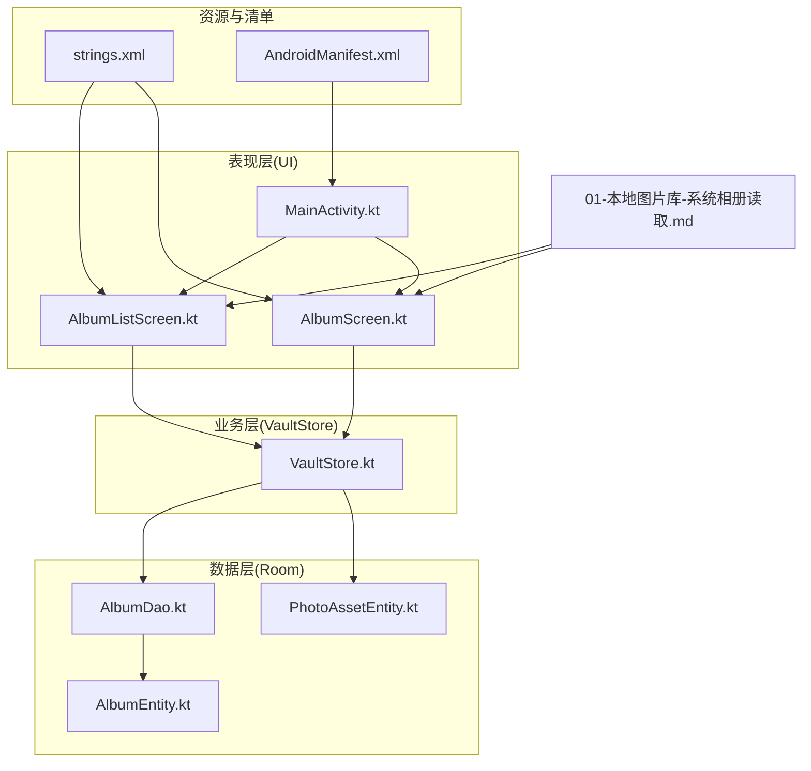
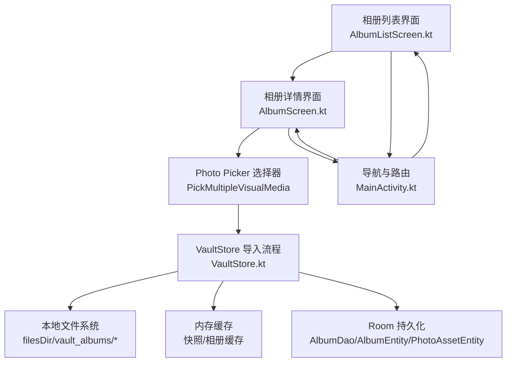
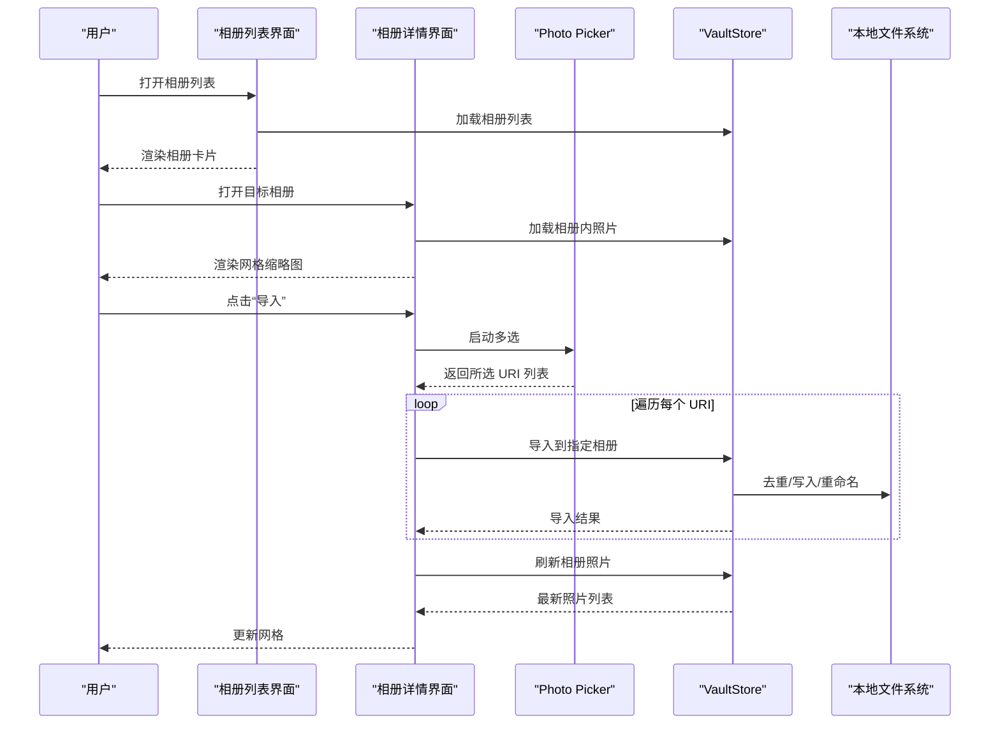
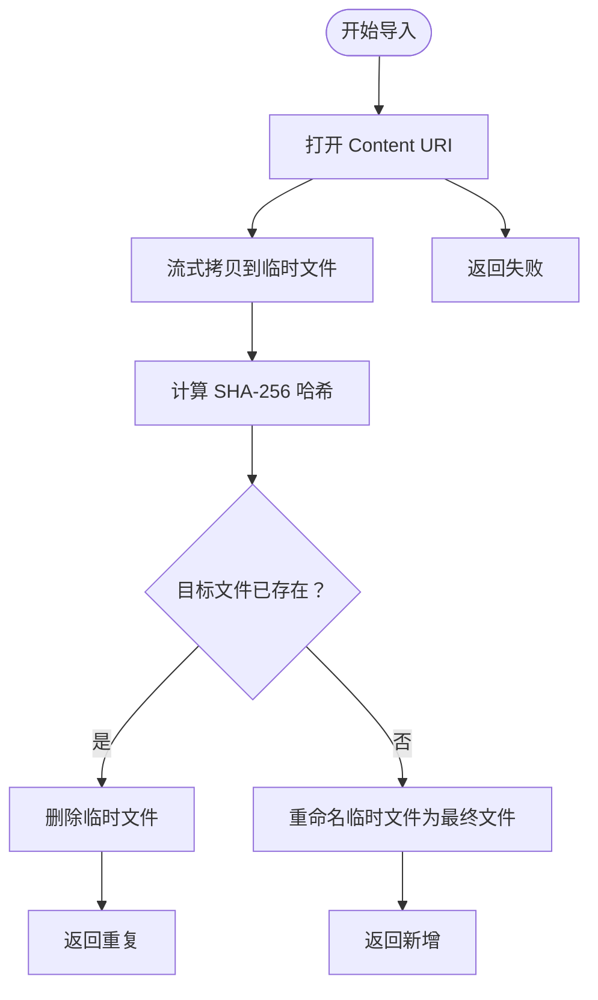
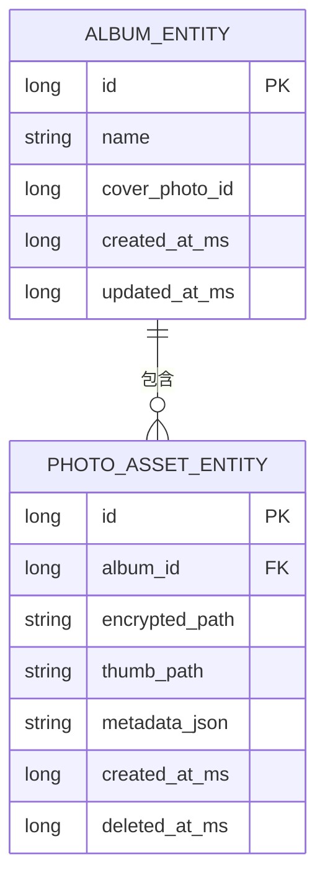
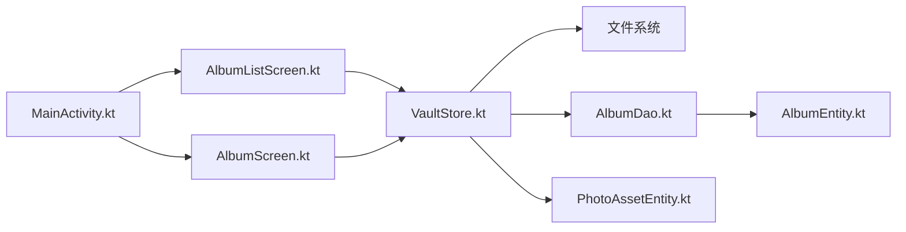

# 本地图片库集成

<cite>
**本文引用的文件**
- [AlbumListScreen.kt](file://android/app/src/main/kotlin/com/photovault/app/ui/AlbumListScreen.kt)
- [AlbumScreen.kt](file://android/app/src/main/kotlin/com/photovault/app/ui/AlbumScreen.kt)
- [MainActivity.kt](file://android/app/src/main/kotlin/com/photovault/app/MainActivity.kt)
- [VaultStore.kt](file://android/app/src/main/kotlin/com/photovault/app/ui/vault/VaultStore.kt)
- [AlbumDao.kt](file://android/core/data/src/main/kotlin/com/photovault/data/db/dao/AlbumDao.kt)
- [AlbumEntity.kt](file://android/core/data/src/main/kotlin/com/photovault/data/db/entity/AlbumEntity.kt)
- [PhotoAssetEntity.kt](file://android/core/data/src/main/kotlin/com/photovault/data/db/entity/PhotoAssetEntity.kt)
- [strings.xml](file://android/app/src/main/res/values/strings.xml)
- [AndroidManifest.xml](file://android/app/src/main/AndroidManifest.xml)
- [01-本地图片库-系统相册读取.md](file://doc/android/01-本地图片库-系统相册读取.md)
</cite>

## 目录
1. [简介](#简介)
2. [项目结构](#项目结构)
3. [核心组件](#核心组件)
4. [架构总览](#架构总览)
5. [详细组件分析](#详细组件分析)
6. [依赖关系分析](#依赖关系分析)
7. [性能考虑](#性能考虑)
8. [故障排查指南](#故障排查指南)
9. [结论](#结论)
10. [附录](#附录)

## 简介
本文件面向“AI照片保险库”的本地图片库集成功能，系统性阐述如何通过系统相册（MediaStore）读取照片、实现相册浏览、照片选择与批量导入、以及与应用内部保险库的数据同步。文档覆盖权限申请流程、照片元数据获取、缩略图生成与缓存机制、UI交互流程与性能优化策略，并提供可定位到具体源码位置的实现路径，帮助开发者快速落地与扩展。

## 项目结构
围绕本地图片库集成，Android 端主要涉及以下层次：
- 表现层（UI）：相册列表、相册详情、照片预览占位等界面
- 导航与路由：基于 Jetpack Navigation 的页面跳转与参数传递
- 业务层（VaultStore）：负责本地保险库的相册/照片管理、导入与缓存
- 数据层（Room）：相册与照片资产实体及 DAO
- 资源与清单：权限声明、文案资源
- 文档规范：平台侧“本地图片库”技术方案要点

**图表来源**
- [AlbumListScreen.kt:1-173](file://android/app/src/main/kotlin/com/photovault/app/ui/AlbumListScreen.kt#L1-L173)
- [AlbumScreen.kt:1-205](file://android/app/src/main/kotlin/com/photovault/app/ui/AlbumScreen.kt#L1-L205)
- [MainActivity.kt:1-265](file://android/app/src/main/kotlin/com/photovault/app/MainActivity.kt#L1-L265)
- [VaultStore.kt:1-226](file://android/app/src/main/kotlin/com/photovault/app/ui/vault/VaultStore.kt#L1-L226)
- [AlbumDao.kt:1-18](file://android/core/data/src/main/kotlin/com/photovault/data/db/dao/AlbumDao.kt#L1-L18)
- [AlbumEntity.kt:1-19](file://android/core/data/src/main/kotlin/com/photovault/data/db/entity/AlbumEntity.kt#L1-L19)
- [PhotoAssetEntity.kt:1-33](file://android/core/data/src/main/kotlin/com/photovault/data/db/entity/PhotoAssetEntity.kt#L1-L33)
- [strings.xml:1-155](file://android/app/src/main/res/values/strings.xml#L1-L155)
- [AndroidManifest.xml:1-27](file://android/app/src/main/AndroidManifest.xml#L1-L27)
- [01-本地图片库-系统相册读取.md:1-36](file://doc/android/01-本地图片库-系统相册读取.md#L1-L36)

**章节来源**
- [AlbumListScreen.kt:1-173](file://android/app/src/main/kotlin/com/photovault/app/ui/AlbumListScreen.kt#L1-L173)
- [AlbumScreen.kt:1-205](file://android/app/src/main/kotlin/com/photovault/app/ui/AlbumScreen.kt#L1-L205)
- [MainActivity.kt:1-265](file://android/app/src/main/kotlin/com/photovault/app/MainActivity.kt#L1-L265)
- [VaultStore.kt:1-226](file://android/app/src/main/kotlin/com/photovault/app/ui/vault/VaultStore.kt#L1-L226)
- [AlbumDao.kt:1-18](file://android/core/data/src/main/kotlin/com/photovault/data/db/dao/AlbumDao.kt#L1-L18)
- [AlbumEntity.kt:1-19](file://android/core/data/src/main/kotlin/com/photovault/data/db/entity/AlbumEntity.kt#L1-L19)
- [PhotoAssetEntity.kt:1-33](file://android/core/data/src/main/kotlin/com/photovault/data/db/entity/PhotoAssetEntity.kt#L1-L33)
- [strings.xml:1-155](file://android/app/src/main/res/values/strings.xml#L1-L155)
- [AndroidManifest.xml:1-27](file://android/app/src/main/AndroidManifest.xml#L1-L27)
- [01-本地图片库-系统相册读取.md:1-36](file://doc/android/01-本地图片库-系统相册读取.md#L1-L36)

## 核心组件
- 相册列表与相册详情 UI：负责展示相册封面、照片网格、空态引导与导入入口
- MainActivity 导航：承载路由与页面跳转，处理相册名与图片路径的编码/解码
- VaultStore：本地保险库核心，负责相册/照片列举、导入、缓存、默认相册与命名规则
- Room 实体与 DAO：定义相册与照片资产的数据结构与查询接口
- 权限与文案：声明媒体读取权限、提供权限引导与导入反馈文案
- 平台文档：给出 MediaStore 读取、Photo Picker 选图、缩略图与安全约束的技术要点

**章节来源**
- [AlbumListScreen.kt:46-150](file://android/app/src/main/kotlin/com/photovault/app/ui/AlbumListScreen.kt#L46-L150)
- [AlbumScreen.kt:53-203](file://android/app/src/main/kotlin/com/photovault/app/ui/AlbumScreen.kt#L53-L203)
- [MainActivity.kt:76-242](file://android/app/src/main/kotlin/com/photovault/app/MainActivity.kt#L76-L242)
- [VaultStore.kt:39-224](file://android/app/src/main/kotlin/com/photovault/app/ui/vault/VaultStore.kt#L39-L224)
- [AlbumDao.kt:10-17](file://android/core/data/src/main/kotlin/com/photovault/data/db/dao/AlbumDao.kt#L10-L17)
- [AlbumEntity.kt:8-18](file://android/core/data/src/main/kotlin/com/photovault/data/db/entity/AlbumEntity.kt#L8-L18)
- [PhotoAssetEntity.kt:9-32](file://android/core/data/src/main/kotlin/com/photovault/data/db/entity/PhotoAssetEntity.kt#L9-L32)
- [strings.xml:29-47](file://android/app/src/main/res/values/strings.xml#L29-L47)
- [AndroidManifest.xml:3-6](file://android/app/src/main/AndroidManifest.xml#L3-L6)
- [01-本地图片库-系统相册读取.md:9-29](file://doc/android/01-本地图片库-系统相册读取.md#L9-L29)

## 架构总览
本地图片库集成采用“UI-业务-数据”分层：
- UI 层通过 Compose 组件渲染相册列表与相册网格，使用 Photo Picker 进行照片选择
- 业务层 VaultStore 负责导入逻辑（去重、重命名、写入）、缓存与快照维护
- 数据层通过 Room 实体与 DAO 提供相册与照片资产的持久化能力
- 平台文档指导 MediaStore 查询、缩略图生成与安全约束

**图表来源**
- [AlbumListScreen.kt:46-150](file://android/app/src/main/kotlin/com/photovault/app/ui/AlbumListScreen.kt#L46-L150)
- [AlbumScreen.kt:53-203](file://android/app/src/main/kotlin/com/photovault/app/ui/AlbumScreen.kt#L53-L203)
- [MainActivity.kt:76-242](file://android/app/src/main/kotlin/com/photovault/app/MainActivity.kt#L76-L242)
- [VaultStore.kt:39-224](file://android/app/src/main/kotlin/com/photovault/app/ui/vault/VaultStore.kt#L39-L224)
- [AlbumDao.kt:10-17](file://android/core/data/src/main/kotlin/com/photovault/data/db/dao/AlbumDao.kt#L10-L17)
- [AlbumEntity.kt:8-18](file://android/core/data/src/main/kotlin/com/photovault/data/db/entity/AlbumEntity.kt#L8-L18)
- [PhotoAssetEntity.kt:9-32](file://android/core/data/src/main/kotlin/com/photovault/data/db/entity/PhotoAssetEntity.kt#L9-L32)

## 详细组件分析

### 相册列表与相册详情界面
- 相册列表：展示相册封面、名称与照片数量；支持筛选标签；空态提示与加载状态
- 相册详情：网格展示照片缩略图；空态时提供“从系统相册导入”入口；支持批量选择并导入至指定相册
- 生命周期与刷新：在 ON_RESUME 事件时重新拉取最新数据，保证 UI 与系统相册同步
- 导入入口：通过 Photo Picker 启动器选择图片，逐个导入并刷新相册

**图表来源**
- [AlbumListScreen.kt:58-73](file://android/app/src/main/kotlin/com/photovault/app/ui/AlbumListScreen.kt#L58-L73)
- [AlbumScreen.kt:66-93](file://android/app/src/main/kotlin/com/photovault/app/ui/AlbumScreen.kt#L66-L93)
- [VaultStore.kt:120-154](file://android/app/src/main/kotlin/com/photovault/app/ui/vault/VaultStore.kt#L120-L154)

**章节来源**
- [AlbumListScreen.kt:46-150](file://android/app/src/main/kotlin/com/photovault/app/ui/AlbumListScreen.kt#L46-L150)
- [AlbumScreen.kt:53-203](file://android/app/src/main/kotlin/com/photovault/app/ui/AlbumScreen.kt#L53-L203)

### 导入流程与去重策略
- 导入入口：相册详情页空态与网格中的“添加”按钮均触发 Photo Picker
- 导入实现：VaultStore.importFromPicker 以 SHA-256 计算内容哈希，避免重复导入；写入临时文件后重命名为 asset_<hash>.jpg
- 结果反馈：根据导入结果返回“新增/重复/失败”，用于 UI 提示

**图表来源**
- [VaultStore.kt:120-154](file://android/app/src/main/kotlin/com/photovault/app/ui/vault/VaultStore.kt#L120-L154)

**章节来源**
- [VaultStore.kt:120-154](file://android/app/src/main/kotlin/com/photovault/app/ui/vault/VaultStore.kt#L120-L154)

### 相册与照片数据模型
- VaultAlbum/VaultPhoto：应用内相册与照片的轻量表示，包含名称、封面、数量与修改时间等
- Room 实体：AlbumEntity/PhotoAssetEntity 描述数据库结构，支持外键与索引
- DAO：AlbumDao 提供相册观察与插入接口

**图表来源**
- [AlbumEntity.kt:8-18](file://android/core/data/src/main/kotlin/com/photovault/data/db/entity/AlbumEntity.kt#L8-L18)
- [PhotoAssetEntity.kt:9-32](file://android/core/data/src/main/kotlin/com/photovault/data/db/entity/PhotoAssetEntity.kt#L9-L32)
- [AlbumDao.kt:10-17](file://android/core/data/src/main/kotlin/com/photovault/data/db/dao/AlbumDao.kt#L10-L17)

**章节来源**
- [VaultStore.kt:14-31](file://android/app/src/main/kotlin/com/photovault/app/ui/vault/VaultStore.kt#L14-L31)
- [AlbumEntity.kt:8-18](file://android/core/data/src/main/kotlin/com/photovault/data/db/entity/AlbumEntity.kt#L8-L18)
- [PhotoAssetEntity.kt:9-32](file://android/core/data/src/main/kotlin/com/photovault/data/db/entity/PhotoAssetEntity.kt#L9-L32)
- [AlbumDao.kt:10-17](file://android/core/data/src/main/kotlin/com/photovault/data/db/dao/AlbumDao.kt#L10-L17)

### 权限与安全
- 权限声明：目标 API 33+ 使用细分媒体权限（读取图片/视频）
- 平台建议：优先 Photo Picker 以减少对外部存储的持续读取依赖；若需浏览系统相册，应在首次请求前说明用途
- 安全约束：只读系统相册，不写入或删除用户原图

**章节来源**
- [AndroidManifest.xml:3-6](file://android/app/src/main/AndroidManifest.xml#L3-L6)
- [01-本地图片库-系统相册读取.md:11-29](file://doc/android/01-本地图片库-系统相册读取.md#L11-L29)

### UI 交互与文案
- 权限引导：标题、描述、授权按钮、去设置、稍后等文案
- 导入反馈：导入中、成功、重复、失败等提示
- 空态与操作：相册为空时的“导入”入口与说明

**章节来源**
- [strings.xml:29-47](file://android/app/src/main/res/values/strings.xml#L29-L47)
- [AlbumScreen.kt:108-151](file://android/app/src/main/kotlin/com/photovault/app/ui/AlbumScreen.kt#L108-L151)

## 依赖关系分析
- UI 依赖 VaultStore 进行数据加载与导入
- VaultStore 依赖文件系统进行导入与缓存
- 数据层通过 Room 实体与 DAO 提供持久化能力
- MainActivity 负责路由与页面间参数传递（相册名、图片路径的编码/解码）

**图表来源**
- [AlbumListScreen.kt:46-150](file://android/app/src/main/kotlin/com/photovault/app/ui/AlbumListScreen.kt#L46-L150)
- [AlbumScreen.kt:53-203](file://android/app/src/main/kotlin/com/photovault/app/ui/AlbumScreen.kt#L53-L203)
- [MainActivity.kt:76-242](file://android/app/src/main/kotlin/com/photovault/app/MainActivity.kt#L76-L242)
- [VaultStore.kt:39-224](file://android/app/src/main/kotlin/com/photovault/app/ui/vault/VaultStore.kt#L39-L224)
- [AlbumDao.kt:10-17](file://android/core/data/src/main/kotlin/com/photovault/data/db/dao/AlbumDao.kt#L10-L17)
- [AlbumEntity.kt:8-18](file://android/core/data/src/main/kotlin/com/photovault/data/db/entity/AlbumEntity.kt#L8-L18)
- [PhotoAssetEntity.kt:9-32](file://android/core/data/src/main/kotlin/com/photovault/data/db/entity/PhotoAssetEntity.kt#L9-L32)

**章节来源**
- [MainActivity.kt:76-242](file://android/app/src/main/kotlin/com/photovault/app/MainActivity.kt#L76-L242)
- [VaultStore.kt:39-224](file://android/app/src/main/kotlin/com/photovault/app/ui/vault/VaultStore.kt#L39-L224)

## 性能考虑
- 列表渲染：使用 Compose LazyColumn/Grid，按需渲染，降低内存占用
- 缩略图加载：建议使用 Coil 或 ContentResolver.loadThumbnail 加载 content:// URI，避免一次性解码全分辨率
- 导入性能：流式拷贝与 SHA-256 计算，避免大对象驻留内存；批量导入时串行或节流处理
- 缓存策略：VaultStore.peekCachedSnapshot/peekCachedAlbumPhotos 提供内存缓存，减少重复 IO
- 分页与懒加载：结合 Paging 3 与 Compose Lazy，实现系统相册的大列表滚动性能

**章节来源**
- [AlbumListScreen.kt:107-147](file://android/app/src/main/kotlin/com/photovault/app/ui/AlbumListScreen.kt#L107-L147)
- [AlbumScreen.kt:161-199](file://android/app/src/main/kotlin/com/photovault/app/ui/AlbumScreen.kt#L161-L199)
- [VaultStore.kt:40-58](file://android/app/src/main/kotlin/com/photovault/app/ui/vault/VaultStore.kt#L40-L58)
- [01-本地图片库-系统相册读取.md:21-24](file://doc/android/01-本地图片库-系统相册读取.md#L21-L24)

## 故障排查指南
- 权限被拒：检查 AndroidManifest 中媒体读取权限声明；在 UI 中展示“去设置开启权限”引导
- 导入失败：确认 URI 可读、磁盘空间充足、目标相册目录存在；查看导入返回值（FAILED/DUPLICATE/ADDED）
- 照片未显示：确认缓存是否命中、相册是否为空、生命周期回调是否触发刷新
- 路由异常：检查 MainActivity 中相册名与路径的编码/解码逻辑

**章节来源**
- [AndroidManifest.xml:3-6](file://android/app/src/main/AndroidManifest.xml#L3-L6)
- [strings.xml:29-47](file://android/app/src/main/res/values/strings.xml#L29-L47)
- [VaultStore.kt:120-154](file://android/app/src/main/kotlin/com/photovault/app/ui/vault/VaultStore.kt#L120-L154)
- [MainActivity.kt:220-241](file://android/app/src/main/kotlin/com/photovault/app/MainActivity.kt#L220-L241)

## 结论
本地图片库集成功能以 VaultStore 为核心，结合 Photo Picker 与 Compose UI，实现了从系统相册选择、去重导入到本地保险库的完整链路。通过内存缓存与合理的缩略图加载策略，兼顾了性能与用户体验。配合平台文档的权限与安全建议，可在满足合规的前提下提供流畅的相册浏览与导入体验。

## 附录
- 具体实现路径参考：
  - 相册列表加载与刷新：[AlbumListScreen.kt:58-73](file://android/app/src/main/kotlin/com/photovault/app/ui/AlbumListScreen.kt#L58-L73)
  - 相册详情与导入入口：[AlbumScreen.kt:82-93](file://android/app/src/main/kotlin/com/photovault/app/ui/AlbumScreen.kt#L82-L93)
  - 导入流程与去重：[VaultStore.kt:120-154](file://android/app/src/main/kotlin/com/photovault/app/ui/vault/VaultStore.kt#L120-L154)
  - 路由与参数编码：[MainActivity.kt:220-241](file://android/app/src/main/kotlin/com/photovault/app/MainActivity.kt#L220-L241)
  - 权限与平台建议：[AndroidManifest.xml:3-6](file://android/app/src/main/AndroidManifest.xml#L3-L6)、[01-本地图片库-系统相册读取.md:9-29](file://doc/android/01-本地图片库-系统相册读取.md#L9-L29)