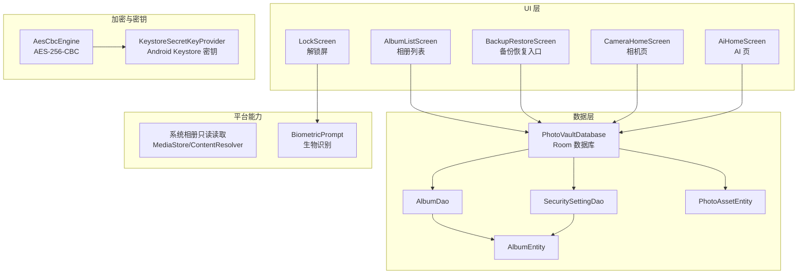
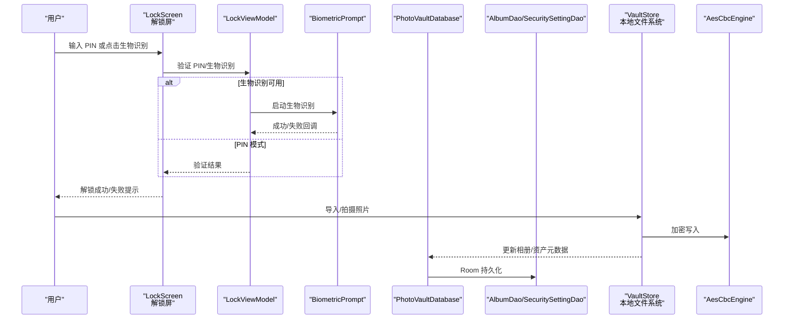
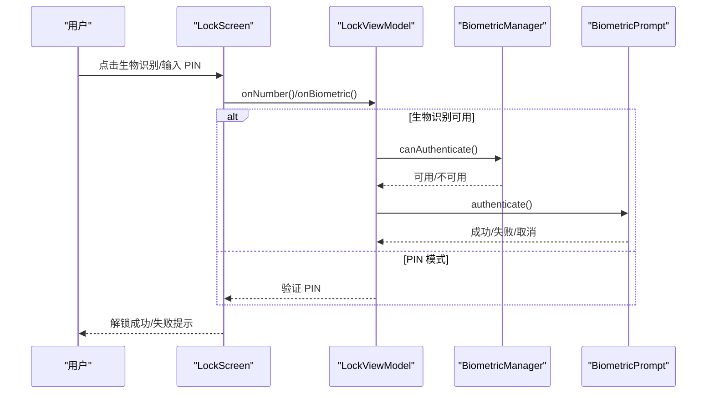
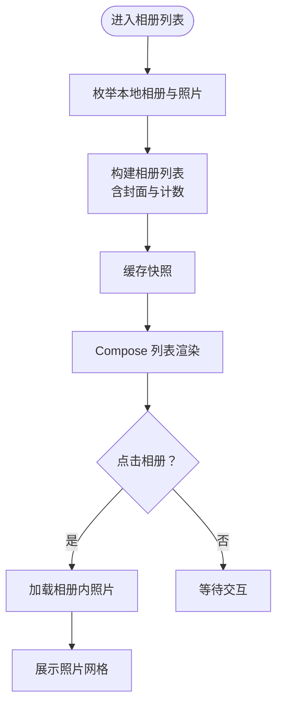
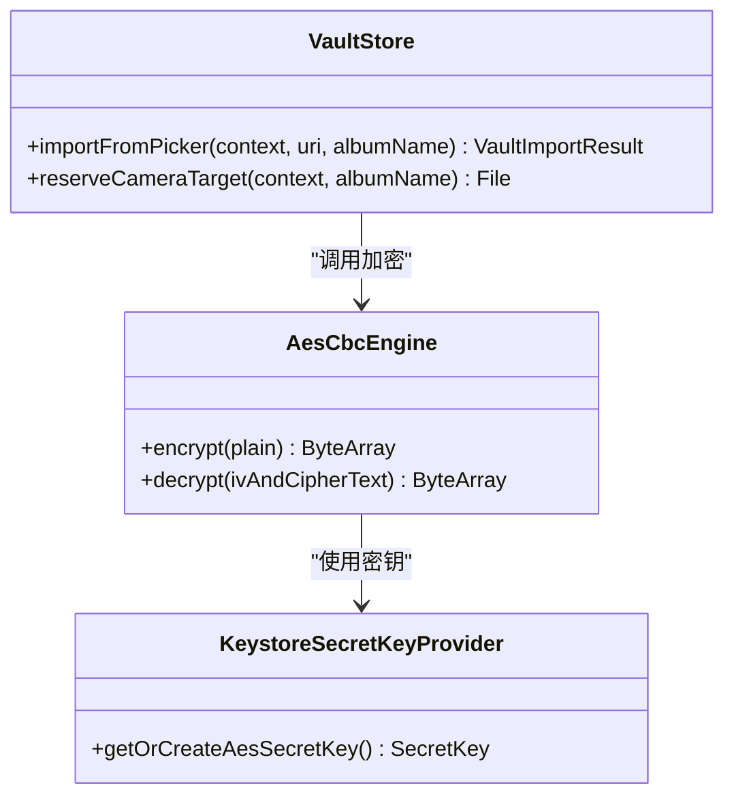
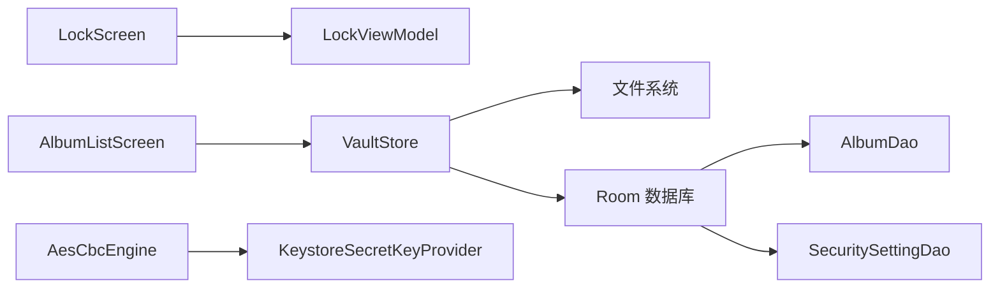

# 核心功能特性

<cite>
**本文引用的文件**
- [android/app/src/main/kotlin/com/photovault/app/ui/vault/VaultStore.kt](file://android/app/src/main/kotlin/com/photovault/app/ui/vault/VaultStore.kt)
- [android/core/data/src/main/kotlin/com/photovault/data/crypto/AesCbcEngine.kt](file://android/core/data/src/main/kotlin/com/photovault/data/crypto/AesCbcEngine.kt)
- [android/core/data/src/main/kotlin/com/photovault/data/crypto/KeystoreSecretKeyProvider.kt](file://android/core/data/src/main/kotlin/com/photovault/data/crypto/KeystoreSecretKeyProvider.kt)
- [android/core/data/src/main/kotlin/com/photovault/data/db/PhotoVaultDatabase.kt](file://android/core/data/src/main/kotlin/com/photovault/data/db/PhotoVaultDatabase.kt)
- [android/core/data/src/main/kotlin/com/photovault/data/db/dao/AlbumDao.kt](file://android/core/data/src/main/kotlin/com/photovault/data/db/dao/AlbumDao.kt)
- [android/core/data/src/main/kotlin/com/photovault/data/db/dao/SecuritySettingDao.kt](file://android/core/data/src/main/kotlin/com/photovault/data/db/dao/SecuritySettingDao.kt)
- [android/core/data/src/main/kotlin/com/photovault/data/db/entity/AlbumEntity.kt](file://android/core/data/src/main/kotlin/com/photovault/data/db/entity/AlbumEntity.kt)
- [android/core/data/src/main/kotlin/com/photovault/data/db/entity/PhotoAssetEntity.kt](file://android/core/data/src/main/kotlin/com/photovault/data/db/entity/PhotoAssetEntity.kt)
- [android/app/src/main/kotlin/com/photovault/app/ui/lock/LockScreen.kt](file://android/app/src/main/kotlin/com/photovault/app/ui/lock/LockScreen.kt)
- [android/app/src/main/kotlin/com/photovault/app/ui/lock/LockViewModel.kt](file://android/app/src/main/kotlin/com/photovault/app/ui/lock/LockViewModel.kt)
- [android/app/src/main/kotlin/com/photovault/app/ui/BackupRestoreScreen.kt](file://android/app/src/main/kotlin/com/photovault/app/ui/BackupRestoreScreen.kt)
- [android/app/src/main/kotlin/com/photovault/app/ui/AlbumListScreen.kt](file://android/app/src/main/kotlin/com/photovault/app/ui/AlbumListScreen.kt)
- [android/app/src/main/kotlin/com/photovault/app/ui/CameraHomeScreen.kt](file://android/app/src/main/kotlin/com/photovault/app/ui/CameraHomeScreen.kt)
- [android/app/src/main/kotlin/com/photovault/app/ui/AiHomeScreen.kt](file://android/app/src/main/kotlin/com/photovault/app/ui/AiHomeScreen.kt)
- [doc/android/01-本地图片库-系统相册读取.md](file://doc/android/01-本地图片库-系统相册读取.md)
</cite>

## 目录
1. [引言](#引言)
2. [项目结构](#项目结构)
3. [核心组件](#核心组件)
4. [架构总览](#架构总览)
5. [详细组件分析](#详细组件分析)
6. [依赖分析](#依赖分析)
7. [性能考虑](#性能考虑)
8. [故障排查指南](#故障排查指南)
9. [结论](#结论)
10. [附录](#附录)

## 引言
本文件面向使用者与开发者，系统性介绍 AI 照片保险库（VaultSafe）的核心功能特性与实现要点，包括：
- 本地图片库集成（系统相册只读读取）
- 安全解锁系统（PIN/生物识别/设备凭证）
- 私密拍照功能（快速拍摄与本地落盘）
- 相册管理（创建/浏览/封面/计数）
- AES-256-CBC 加密存储（基于 Android Keystore 的主密钥）
- TensorFlow Lite 本地 AI 推理（预留与扩展空间）
- 备份与恢复机制（UI 入口与数据库结构）

文档同时解释各模块设计目标、技术实现方式、用户体验价值以及模块间的协作关系与数据流转过程，并提供使用指南与最佳实践建议。

## 项目结构
项目采用 Android/Kotlin 多模块组织，核心分为三层：
- Presentation（UI 层）：Compose UI、屏幕与交互逻辑（如解锁屏、相册列表、备份恢复入口等）
- Domain/Data（领域与数据层）：Room 数据库、DAO、实体、加密引擎与密钥提供器
- Platform（平台能力）：系统相册读取、生物识别、文件系统

图表来源
- [android/app/src/main/kotlin/com/photovault/app/ui/lock/LockScreen.kt:1-414](file://android/app/src/main/kotlin/com/photovault/app/ui/lock/LockScreen.kt#L1-L414)
- [android/app/src/main/kotlin/com/photovault/app/ui/AlbumListScreen.kt:1-185](file://android/app/src/main/kotlin/com/photovault/app/ui/AlbumListScreen.kt#L1-L185)
- [android/app/src/main/kotlin/com/photovault/app/ui/BackupRestoreScreen.kt:1-129](file://android/app/src/main/kotlin/com/photovault/app/ui/BackupRestoreScreen.kt#L1-L129)
- [android/app/src/main/kotlin/com/photovault/app/ui/CameraHomeScreen.kt:1-58](file://android/app/src/main/kotlin/com/photovault/app/ui/CameraHomeScreen.kt#L1-L58)
- [android/app/src/main/kotlin/com/photovault/app/ui/AiHomeScreen.kt:1-56](file://android/app/src/main/kotlin/com/photovault/app/ui/AiHomeScreen.kt#L1-L56)
- [android/core/data/src/main/kotlin/com/photovault/data/db/PhotoVaultDatabase.kt:1-36](file://android/core/data/src/main/kotlin/com/photovault/data/db/PhotoVaultDatabase.kt#L1-L36)
- [android/core/data/src/main/kotlin/com/photovault/data/db/dao/AlbumDao.kt:1-18](file://android/core/data/src/main/kotlin/com/photovault/data/db/dao/AlbumDao.kt#L1-L18)
- [android/core/data/src/main/kotlin/com/photovault/data/db/dao/SecuritySettingDao.kt:1-17](file://android/core/data/src/main/kotlin/com/photovault/data/db/dao/SecuritySettingDao.kt#L1-L17)
- [android/core/data/src/main/kotlin/com/photovault/data/db/entity/AlbumEntity.kt:1-19](file://android/core/data/src/main/kotlin/com/photovault/data/db/entity/AlbumEntity.kt#L1-L19)
- [android/core/data/src/main/kotlin/com/photovault/data/db/entity/PhotoAssetEntity.kt:1-33](file://android/core/data/src/main/kotlin/com/photovault/data/db/entity/PhotoAssetEntity.kt#L1-L33)
- [android/core/data/src/main/kotlin/com/photovault/data/crypto/KeystoreSecretKeyProvider.kt:1-42](file://android/core/data/src/main/kotlin/com/photovault/data/crypto/KeystoreSecretKeyProvider.kt#L1-L42)
- [android/core/data/src/main/kotlin/com/photovault/data/crypto/AesCbcEngine.kt:1-40](file://android/core/data/src/main/kotlin/com/photovault/data/crypto/AesCbcEngine.kt#L1-L40)

章节来源
- [android/app/src/main/kotlin/com/photovault/app/ui/lock/LockScreen.kt:1-414](file://android/app/src/main/kotlin/com/photovault/app/ui/lock/LockScreen.kt#L1-L414)
- [android/app/src/main/kotlin/com/photovault/app/ui/AlbumListScreen.kt:1-185](file://android/app/src/main/kotlin/com/photovault/app/ui/AlbumListScreen.kt#L1-L185)
- [android/app/src/main/kotlin/com/photovault/app/ui/BackupRestoreScreen.kt:1-129](file://android/app/src/main/kotlin/com/photovault/app/ui/BackupRestoreScreen.kt#L1-L129)
- [android/app/src/main/kotlin/com/photovault/app/ui/CameraHomeScreen.kt:1-58](file://android/app/src/main/kotlin/com/photovault/app/ui/CameraHomeScreen.kt#L1-L58)
- [android/app/src/main/kotlin/com/photovault/app/ui/AiHomeScreen.kt:1-56](file://android/app/src/main/kotlin/com/photovault/app/ui/AiHomeScreen.kt#L1-L56)
- [android/core/data/src/main/kotlin/com/photovault/data/db/PhotoVaultDatabase.kt:1-36](file://android/core/data/src/main/kotlin/com/photovault/data/db/PhotoVaultDatabase.kt#L1-L36)
- [android/core/data/src/main/kotlin/com/photovault/data/crypto/KeystoreSecretKeyProvider.kt:1-42](file://android/core/data/src/main/kotlin/com/photovault/data/crypto/KeystoreSecretKeyProvider.kt#L1-L42)
- [android/core/data/src/main/kotlin/com/photovault/data/crypto/AesCbcEngine.kt:1-40](file://android/core/data/src/main/kotlin/com/photovault/data/crypto/AesCbcEngine.kt#L1-L40)

## 核心组件
- 本地图片库集成：通过系统相册只读读取，遵循最小权限原则，避免写入用户原图，支持分页与缩略图加载。
- 安全解锁系统：支持 PIN 码、生物识别（指纹/面容）与设备凭证三通道，失败次数限制与提示。
- 私密拍照功能：提供快速拍摄入口，拍摄目标文件在 Vault 文件夹内预留，便于后续加密与入库。
- 相册管理：本地文件系统相册与 Room 数据库存储相册元信息并行，支持封面、计数与最近照片快照。
- AES-256-CBC 加密存储：主密钥托管于 Android Keystore，加密算法为 AES-256-CBC/PKCS7，IV 前置。
- 备份与恢复机制：提供 UI 入口与数据库结构准备，支持备份记录与订阅状态等实体。
- TensorFlow Lite 本地 AI 推理：页面占位，预留本地模型与推理扩展空间。

章节来源
- [doc/android/01-本地图片库-系统相册读取.md:1-36](file://doc/android/01-本地图片库-系统相册读取.md#L1-L36)
- [android/app/src/main/kotlin/com/photovault/app/ui/lock/LockScreen.kt:1-414](file://android/app/src/main/kotlin/com/photovault/app/ui/lock/LockScreen.kt#L1-L414)
- [android/app/src/main/kotlin/com/photovault/app/ui/CameraHomeScreen.kt:1-58](file://android/app/src/main/kotlin/com/photovault/app/ui/CameraHomeScreen.kt#L1-L58)
- [android/app/src/main/kotlin/com/photovault/app/ui/vault/VaultStore.kt:1-226](file://android/app/src/main/kotlin/com/photovault/app/ui/vault/VaultStore.kt#L1-L226)
- [android/core/data/src/main/kotlin/com/photovault/data/crypto/AesCbcEngine.kt:1-40](file://android/core/data/src/main/kotlin/com/photovault/data/crypto/AesCbcEngine.kt#L1-L40)
- [android/core/data/src/main/kotlin/com/photovault/data/crypto/KeystoreSecretKeyProvider.kt:1-42](file://android/core/data/src/main/kotlin/com/photovault/data/crypto/KeystoreSecretKeyProvider.kt#L1-L42)
- [android/core/data/src/main/kotlin/com/photovault/data/db/PhotoVaultDatabase.kt:1-36](file://android/core/data/src/main/kotlin/com/photovault/data/db/PhotoVaultDatabase.kt#L1-L36)
- [android/app/src/main/kotlin/com/photovault/app/ui/AiHomeScreen.kt:1-56](file://android/app/src/main/kotlin/com/photovault/app/ui/AiHomeScreen.kt#L1-L56)

## 架构总览
下图展示从 UI 到数据与加密的关键交互路径，体现“本地化、最小暴露、强加密”的设计原则。

图表来源
- [android/app/src/main/kotlin/com/photovault/app/ui/lock/LockScreen.kt:1-414](file://android/app/src/main/kotlin/com/photovault/app/ui/lock/LockScreen.kt#L1-L414)
- [android/app/src/main/kotlin/com/photovault/app/ui/lock/LockViewModel.kt](file://android/app/src/main/kotlin/com/photovault/app/ui/lock/LockViewModel.kt)
- [android/app/src/main/kotlin/com/photovault/app/ui/vault/VaultStore.kt:1-226](file://android/app/src/main/kotlin/com/photovault/app/ui/vault/VaultStore.kt#L1-L226)
- [android/core/data/src/main/kotlin/com/photovault/data/crypto/AesCbcEngine.kt:1-40](file://android/core/data/src/main/kotlin/com/photovault/data/crypto/AesCbcEngine.kt#L1-L40)
- [android/core/data/src/main/kotlin/com/photovault/data/db/PhotoVaultDatabase.kt:1-36](file://android/core/data/src/main/kotlin/com/photovault/data/db/PhotoVaultDatabase.kt#L1-L36)
- [android/core/data/src/main/kotlin/com/photovault/data/db/dao/AlbumDao.kt:1-18](file://android/core/data/src/main/kotlin/com/photovault/data/db/dao/AlbumDao.kt#L1-L18)
- [android/core/data/src/main/kotlin/com/photovault/data/db/dao/SecuritySettingDao.kt:1-17](file://android/core/data/src/main/kotlin/com/photovault/data/db/dao/SecuritySettingDao.kt#L1-L17)

## 详细组件分析

### 本地图片库集成（系统相册只读读取）
- 设计目标：在满足“导入/浏览”需求的同时，严格限制对系统相册的访问范围与操作类型，降低隐私风险。
- 技术实现：
  - 权限策略：针对不同 Android 版本采用细粒度媒体权限与分区存储兼容策略；优先使用 Photo Picker 减少持续读取。
  - 数据访问：通过 MediaStore 与 ContentResolver 查询，按时间排序，支持按相册桶分组。
  - 展示性能：结合 Paging 3 与 Compose Lazy 列表，缩略图使用 Coil 或系统接口加载，大图按需解码。
  - 安全边界：不调用 MediaStore 的写入/删除接口，避免改动用户原图。
- 用户体验价值：快速导入、流畅浏览、最小权限授权，符合海外审核与隐私合规要求。

章节来源
- [doc/android/01-本地图片库-系统相册读取.md:1-36](file://doc/android/01-本地图片库-系统相册读取.md#L1-L36)

### 安全解锁系统（PIN/生物识别/设备凭证）
- 设计目标：提供多通道解锁，兼顾易用性与安全性；失败次数限制与提示，保障账户安全。
- 技术实现：
  - UI 层：LockScreen 提供 PIN 数字键盘、生物识别按钮与快速捕获入口；自动弹出生物识别条件满足时。
  - 生物识别：BiometricPrompt 封装指纹/面容/设备凭证，统一错误处理与不可用提示。
  - 状态管理：LockViewModel 统一处理 PIN 输入、校验、错误计数与事件消费。
- 用户体验价值：一键快速解锁、失败引导明确、PIN 不上传云端、连续错误临时锁定。

图表来源
- [android/app/src/main/kotlin/com/photovault/app/ui/lock/LockScreen.kt:1-414](file://android/app/src/main/kotlin/com/photovault/app/ui/lock/LockScreen.kt#L1-L414)

章节来源
- [android/app/src/main/kotlin/com/photovault/app/ui/lock/LockScreen.kt:1-414](file://android/app/src/main/kotlin/com/photovault/app/ui/lock/LockScreen.kt#L1-L414)

### 私密拍照功能（快速拍摄与本地落盘）
- 设计目标：提供便捷的私密拍摄入口，拍摄目标文件直接写入 Vault 文件夹，便于后续加密与入库。
- 技术实现：
  - 快速入口：相机页提供“私密拍摄”快捷入口，拍摄目标文件在 Vault 文件夹内预留命名。
  - 本地落盘：拍摄完成后，文件以固定命名规则保存到私密目录，避免泄露。
- 用户体验价值：一键进入私密拍摄，拍摄即私密，后续流程无缝衔接加密与相册管理。

章节来源
- [android/app/src/main/kotlin/com/photovault/app/ui/CameraHomeScreen.kt:1-58](file://android/app/src/main/kotlin/com/photovault/app/ui/CameraHomeScreen.kt#L1-L58)
- [android/app/src/main/kotlin/com/photovault/app/ui/vault/VaultStore.kt:156-164](file://android/app/src/main/kotlin/com/photovault/app/ui/vault/VaultStore.kt#L156-L164)

### 相册管理（创建/浏览/封面/计数）
- 设计目标：在本地文件系统与数据库之间建立一致的相册视图，支持封面与计数，提升浏览效率。
- 技术实现：
  - 本地相册：VaultStore 负责根目录初始化、相册创建、相册内文件枚举、最近照片与搜索。
  - 数据库存储：AlbumEntity 与 PhotoAssetEntity 描述相册与资产元数据，AlbumDao/SecuritySettingDao 提供持久化接口。
  - UI 展示：AlbumListScreen 以懒加载列表展示相册封面与数量，支持筛选与刷新。
- 用户体验价值：直观相册列表、封面预览、快速定位与高效浏览。

图表来源
- [android/app/src/main/kotlin/com/photovault/app/ui/vault/VaultStore.kt:1-226](file://android/app/src/main/kotlin/com/photovault/app/ui/vault/VaultStore.kt#L1-L226)
- [android/app/src/main/kotlin/com/photovault/app/ui/AlbumListScreen.kt:1-185](file://android/app/src/main/kotlin/com/photovault/app/ui/AlbumListScreen.kt#L1-L185)
- [android/core/data/src/main/kotlin/com/photovault/data/db/entity/AlbumEntity.kt:1-19](file://android/core/data/src/main/kotlin/com/photovault/data/db/entity/AlbumEntity.kt#L1-L19)
- [android/core/data/src/main/kotlin/com/photovault/data/db/entity/PhotoAssetEntity.kt:1-33](file://android/core/data/src/main/kotlin/com/photovault/data/db/entity/PhotoAssetEntity.kt#L1-L33)

章节来源
- [android/app/src/main/kotlin/com/photovault/app/ui/vault/VaultStore.kt:1-226](file://android/app/src/main/kotlin/com/photovault/app/ui/vault/VaultStore.kt#L1-L226)
- [android/app/src/main/kotlin/com/photovault/app/ui/AlbumListScreen.kt:1-185](file://android/app/src/main/kotlin/com/photovault/app/ui/AlbumListScreen.kt#L1-L185)
- [android/core/data/src/main/kotlin/com/photovault/data/db/entity/AlbumEntity.kt:1-19](file://android/core/data/src/main/kotlin/com/photovault/data/db/entity/AlbumEntity.kt#L1-L19)
- [android/core/data/src/main/kotlin/com/photovault/data/db/entity/PhotoAssetEntity.kt:1-33](file://android/core/data/src/main/kotlin/com/photovault/data/db/entity/PhotoAssetEntity.kt#L1-L33)

### AES-256-CBC 加密存储
- 设计目标：确保私密照片在设备本地被强加密存储，主密钥不可导出，满足高隐私要求。
- 技术实现：
  - 主密钥：KeystoreSecretKeyProvider 在 Android Keystore 中生成/读取 AES-256 密钥，不可导出。
  - 加密算法：AesCbcEngine 使用 AES-256-CBC/PKCS7，IV 固定长度前置，保证随机性与可还原性。
  - 存储位置：VaultStore 将加密后的文件写入应用私有目录，文件名包含内容哈希，避免重复。
- 用户体验价值：本地加密、密钥受控、文件唯一标识、导入去重与一致性。

图表来源
- [android/core/data/src/main/kotlin/com/photovault/data/crypto/KeystoreSecretKeyProvider.kt:1-42](file://android/core/data/src/main/kotlin/com/photovault/data/crypto/KeystoreSecretKeyProvider.kt#L1-L42)
- [android/core/data/src/main/kotlin/com/photovault/data/crypto/AesCbcEngine.kt:1-40](file://android/core/data/src/main/kotlin/com/photovault/data/crypto/AesCbcEngine.kt#L1-L40)
- [android/app/src/main/kotlin/com/photovault/app/ui/vault/VaultStore.kt:120-154](file://android/app/src/main/kotlin/com/photovault/app/ui/vault/VaultStore.kt#L120-L154)

章节来源
- [android/core/data/src/main/kotlin/com/photovault/data/crypto/KeystoreSecretKeyProvider.kt:1-42](file://android/core/data/src/main/kotlin/com/photovault/data/crypto/KeystoreSecretKeyProvider.kt#L1-L42)
- [android/core/data/src/main/kotlin/com/photovault/data/crypto/AesCbcEngine.kt:1-40](file://android/core/data/src/main/kotlin/com/photovault/data/crypto/AesCbcEngine.kt#L1-L40)
- [android/app/src/main/kotlin/com/photovault/app/ui/vault/VaultStore.kt:120-154](file://android/app/src/main/kotlin/com/photovault/app/ui/vault/VaultStore.kt#L120-L154)

### 备份与恢复机制
- 设计目标：提供备份与恢复入口，配合数据库结构为未来完整备份策略奠定基础。
- 技术实现：
  - UI 入口：BackupRestoreScreen 提供“备份”“恢复”卡片入口，引导用户进行备份或恢复操作。
  - 数据库结构：PhotoVaultDatabase 已定义备份记录、订阅状态等实体，便于后续扩展。
- 用户体验价值：清晰入口、明确指引、为后续完整备份/恢复流程预留空间。

章节来源
- [android/app/src/main/kotlin/com/photovault/app/ui/BackupRestoreScreen.kt:1-129](file://android/app/src/main/kotlin/com/photovault/app/ui/BackupRestoreScreen.kt#L1-L129)
- [android/core/data/src/main/kotlin/com/photovault/data/db/PhotoVaultDatabase.kt:1-36](file://android/core/data/src/main/kotlin/com/photovault/data/db/PhotoVaultDatabase.kt#L1-L36)

### TensorFlow Lite 本地 AI 推理
- 设计目标：为未来引入本地 AI 能力（如隐私打码、智能分类）预留扩展空间。
- 技术实现：AI 页目前为空状态占位，后续可在本地加载模型与执行推理，避免上传敏感图像。
- 用户体验价值：本地化 AI，保护隐私，逐步增强智能能力。

章节来源
- [android/app/src/main/kotlin/com/photovault/app/ui/AiHomeScreen.kt:1-56](file://android/app/src/main/kotlin/com/photovault/app/ui/AiHomeScreen.kt#L1-L56)

## 依赖分析
- 组件耦合与内聚：
  - UI 层通过 ViewModel/仓库模式与数据层解耦，VaultStore 作为本地存储门面，集中处理文件系统与缓存。
  - 加密链路独立于 UI，通过 Keystore 与 AesCbcEngine 实现强隔离。
  - 数据库存储与 UI 通过 DAO 与 Flow 解耦，支持响应式更新。
- 外部依赖与集成点：
  - 系统相册只读访问与生物识别由 Android 平台提供。
  - Room 用于结构化数据持久化，索引与外键保证查询与一致性。
- 循环依赖：
  - 当前结构无明显循环依赖，UI 与数据层职责清晰分离。

图表来源
- [android/app/src/main/kotlin/com/photovault/app/ui/lock/LockScreen.kt:1-414](file://android/app/src/main/kotlin/com/photovault/app/ui/lock/LockScreen.kt#L1-L414)
- [android/app/src/main/kotlin/com/photovault/app/ui/AlbumListScreen.kt:1-185](file://android/app/src/main/kotlin/com/photovault/app/ui/AlbumListScreen.kt#L1-L185)
- [android/app/src/main/kotlin/com/photovault/app/ui/vault/VaultStore.kt:1-226](file://android/app/src/main/kotlin/com/photovault/app/ui/vault/VaultStore.kt#L1-L226)
- [android/core/data/src/main/kotlin/com/photovault/data/crypto/AesCbcEngine.kt:1-40](file://android/core/data/src/main/kotlin/com/photovault/data/crypto/AesCbcEngine.kt#L1-L40)
- [android/core/data/src/main/kotlin/com/photovault/data/crypto/KeystoreSecretKeyProvider.kt:1-42](file://android/core/data/src/main/kotlin/com/photovault/data/crypto/KeystoreSecretKeyProvider.kt#L1-L42)
- [android/core/data/src/main/kotlin/com/photovault/data/db/dao/AlbumDao.kt:1-18](file://android/core/data/src/main/kotlin/com/photovault/data/db/dao/AlbumDao.kt#L1-L18)
- [android/core/data/src/main/kotlin/com/photovault/data/db/dao/SecuritySettingDao.kt:1-17](file://android/core/data/src/main/kotlin/com/photovault/data/db/dao/SecuritySettingDao.kt#L1-L17)

章节来源
- [android/app/src/main/kotlin/com/photovault/app/ui/vault/VaultStore.kt:1-226](file://android/app/src/main/kotlin/com/photovault/app/ui/vault/VaultStore.kt#L1-L226)
- [android/core/data/src/main/kotlin/com/photovault/data/crypto/AesCbcEngine.kt:1-40](file://android/core/data/src/main/kotlin/com/photovault/data/crypto/AesCbcEngine.kt#L1-L40)
- [android/core/data/src/main/kotlin/com/photovault/data/crypto/KeystoreSecretKeyProvider.kt:1-42](file://android/core/data/src/main/kotlin/com/photovault/data/crypto/KeystoreSecretKeyProvider.kt#L1-L42)
- [android/core/data/src/main/kotlin/com/photovault/data/db/PhotoVaultDatabase.kt:1-36](file://android/core/data/src/main/kotlin/com/photovault/data/db/PhotoVaultDatabase.kt#L1-L36)

## 性能考虑
- 图片加载与内存：缩略图按需加载，避免一次性解码全分辨率；列表使用懒加载与分页。
- 数据库查询：为常用查询字段建立索引（如相册更新时间、资产删除标记），减少扫描成本。
- IO 优化：加密导入采用流式写入与内容哈希去重，避免重复 IO 与磁盘占用。
- 解锁体验：生物识别自动弹出与失败提示即时反馈，降低用户等待与误操作。

## 故障排查指南
- 解锁失败/被锁定：
  - 检查 PIN 是否正确，连续错误可能导致临时锁定；可尝试生物识别或设备凭证。
  - 若生物识别不可用，确认系统是否已录入指纹/面容或硬件支持情况。
- 导入照片无响应：
  - 确认系统相册权限已授予；若使用 Photo Picker，检查是否允许一次性选择而非全库读取。
  - 查看 VaultStore 日志与返回值，确认导入结果（新增/重复/失败）。
- 加密异常：
  - 确认 Keystore 密钥存在且未被系统清理；必要时重建密钥并重新导入数据。
- 相册列表空白：
  - 触发刷新或重启应用；检查 VaultStore 缓存与文件系统根目录是否存在。

章节来源
- [android/app/src/main/kotlin/com/photovault/app/ui/lock/LockScreen.kt:1-414](file://android/app/src/main/kotlin/com/photovault/app/ui/lock/LockScreen.kt#L1-L414)
- [android/app/src/main/kotlin/com/photovault/app/ui/vault/VaultStore.kt:120-154](file://android/app/src/main/kotlin/com/photovault/app/ui/vault/VaultStore.kt#L120-L154)
- [android/core/data/src/main/kotlin/com/photovault/data/crypto/KeystoreSecretKeyProvider.kt:1-42](file://android/core/data/src/main/kotlin/com/photovault/data/crypto/KeystoreSecretKeyProvider.kt#L1-L42)

## 结论
AI 照片保险库通过“本地化、最小暴露、强加密”的设计，在隐私保护方面具备显著优势：系统相册只读访问、Android Keystore 主密钥托管、AES-256-CBC 加密、多通道解锁与本地 AI 预留，共同构成一套安全、易用、可扩展的私密照片管理方案。建议在后续迭代中完善备份/恢复与 AI 推理能力，持续强化用户体验与隐私边界。

## 附录
- 功能使用指南与最佳实践：
  - 解锁：优先使用生物识别，失败时使用 PIN；记住仅本地存储，忘记 PIN 可通过主密码重置。
  - 导入：优先使用 Photo Picker 获取最小权限；批量导入时注意去重与命名规范。
  - 拍摄：使用私密拍摄入口，拍摄即落盘到 Vault 目录，随后进行加密与入库。
  - 相册：默认相册自动创建，自定义相册名称支持清理非法字符；封面与计数自动维护。
  - 备份：通过备份入口进入，结合数据库结构准备完整备份策略。
  - AI：AI 页面为预留占位，后续引入本地模型与推理，确保数据不出设备。