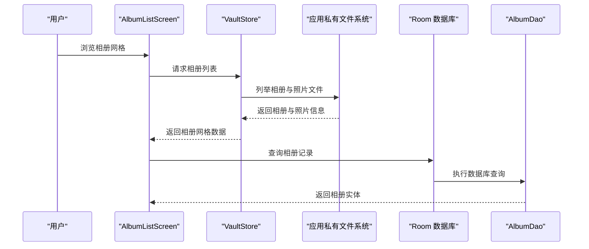
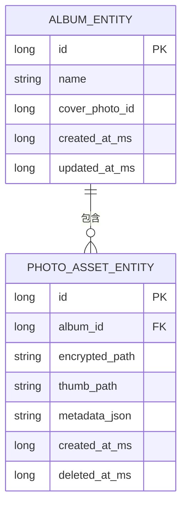
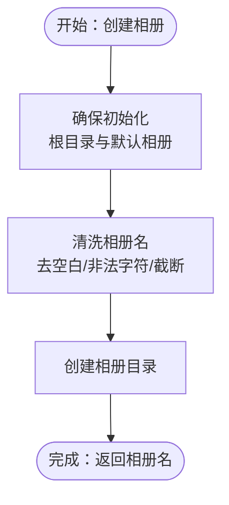
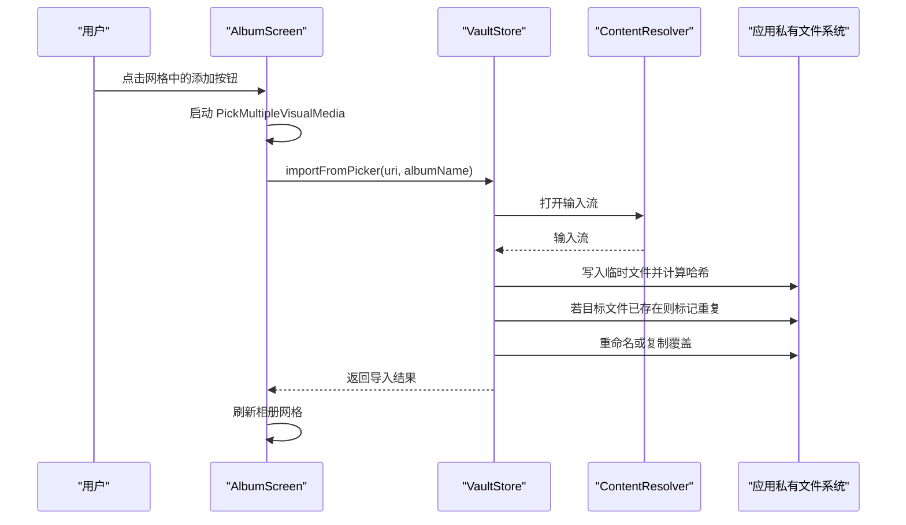
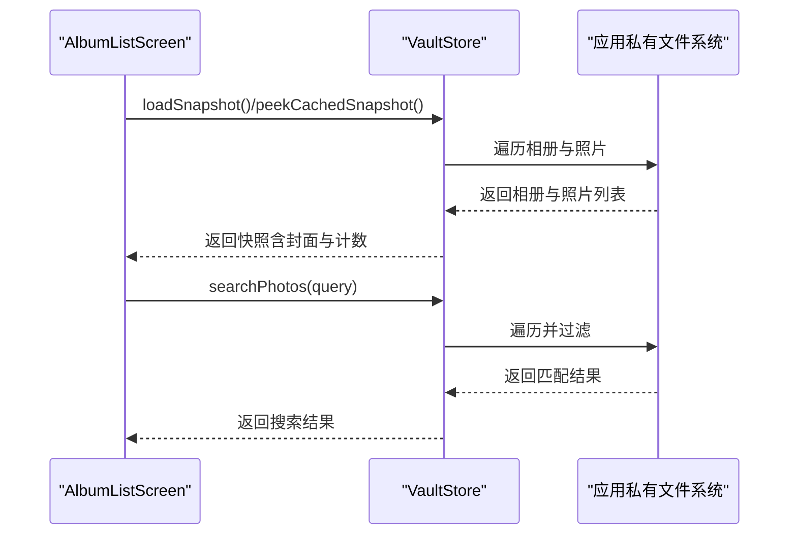
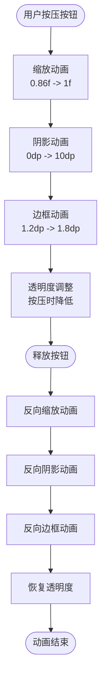
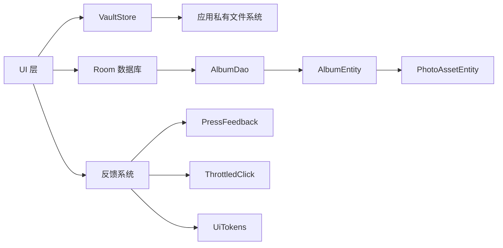

# 相册管理功能

<cite>
**本文引用的文件**
- [AlbumEntity.kt](file://android/core/data/src/main/kotlin/com/photovault/data/db/entity/AlbumEntity.kt)
- [PhotoAssetEntity.kt](file://android/core/data/src/main/kotlin/com/photovault/data/db/entity/PhotoAssetEntity.kt)
- [AlbumDao.kt](file://android/core/data/src/main/kotlin/com/photovault/data/db/dao/AlbumDao.kt)
- [PhotoVaultDatabase.kt](file://android/core/data/src/main/kotlin/com/photovault/data/db/PhotoVaultDatabase.kt)
- [Album.kt](file://android/core/domain/src/main/kotlin/com/photovault/domain/model/Album.kt)
- [PhotoAsset.kt](file://android/core/domain/src/main/kotlin/com/photovault/domain/model/PhotoAsset.kt)
- [VaultStore.kt](file://android/app/src/main/kotlin/com/photovault/app/ui/vault/VaultStore.kt)
- [AlbumListScreen.kt](file://android/app/src/main/kotlin/com/photovault/app/ui/AlbumListScreen.kt)
- [AlbumScreen.kt](file://android/app/src/main/kotlin/com/photovault/app/ui/AlbumScreen.kt)
- [HomeScreen.kt](file://android/app/src/main/kotlin/com/photovault/app/ui/HomeScreen.kt)
- [PressFeedback.kt](file://android/app/src/main/kotlin/com/photovault/app/ui/feedback/PressFeedback.kt)
- [ThrottledClick.kt](file://android/app/src/main/kotlin/com/photovault/app/ui/feedback/ThrottledClick.kt)
- [UiTokens.kt](file://android/app/src/main/kotlin/com/photovault/app/ui/theme/UiTokens.kt)
- [AppButton.kt](file://android/app/src/main/kotlin/com/photovault/app/ui/components/AppButton.kt)
- [AlbumDaoRobolectricTest.kt](file://android/core/data/src/test/kotlin/com/photovault/data/db/AlbumDaoRobolectricTest.kt)
</cite>

## 更新摘要
**变更内容**
- AlbumListScreen 从垂直列表布局重构为响应式两列网格系统，提升空间利用率和视觉体验
- 移除了名称排序快速过滤器，简化浏览体验，专注于相册网格展示
- 保持了原有的相册详情页面网格布局和导入功能
- 维持了完整的反馈系统和主题系统

## 目录
1. [简介](#简介)
2. [项目结构](#项目结构)
3. [核心组件](#核心组件)
4. [架构总览](#架构总览)
5. [详细组件分析](#详细组件分析)
6. [依赖分析](#依赖分析)
7. [性能考虑](#性能考虑)
8. [故障排查指南](#故障排查指南)
9. [结论](#结论)
10. [附录](#附录)

## 简介
本文件面向"AI照片保险库"的相册管理功能，系统性阐述相册的创建、编辑、删除与组织管理能力，深入解析相册数据模型、数据库操作与照片与相册的关联关系，并提供相册列表展示、相册详情页面以及照片添加到相册的实现要点与流程图示。同时，结合现有代码，说明相册封面生成、相册统计信息与相册搜索的实现细节，并给出权限控制、照片排序规则与批量操作的扩展建议。

**更新** 本次更新重点关注相册列表界面的重大重构，从垂直列表布局迁移到响应式两列网格系统，移除了复杂的排序过滤器，专注于简洁直观的相册浏览体验。

## 项目结构
相册管理功能横跨三层：
- 应用层 UI：负责用户交互与页面渲染，如相册列表页、相册详情页、主页入口等。
- 存储层 VaultStore：负责本地文件系统中的相册与照片组织、缓存与导入等业务逻辑。
- 数据层 Room：负责相册与照片资产的持久化存储与查询。

```mermaid
graph TB
subgraph "应用层 UI"
HS["HomeScreen.kt"]
ALS["AlbumListScreen.kt"]
AS["AlbumScreen.kt"]
end
subgraph "存储层 VaultStore"
VS["VaultStore.kt"]
end
subgraph "数据层 Room"
DB["PhotoVaultDatabase.kt"]
DAO["AlbumDao.kt"]
AE["AlbumEntity.kt"]
PAE["PhotoAssetEntity.kt"]
end
subgraph "反馈系统"
PF["PressFeedback.kt"]
TC["ThrottledClick.kt"]
AB["AppButton.kt"]
end
subgraph "主题系统"
UT["UiTokens.kt"]
end
HS --> AS
ALS --> VS
AS --> VS
VS --> DB
DB --> DAO
DAO --> AE
AE < --> PAE
AS --> PF
AS --> TC
AS --> UT
```

**图表来源**
- [HomeScreen.kt](file://android/app/src/main/kotlin/com/photovault/app/ui/HomeScreen.kt)
- [AlbumListScreen.kt](file://android/app/src/main/kotlin/com/photovault/app/ui/AlbumListScreen.kt)
- [AlbumScreen.kt](file://android/app/src/main/kotlin/com/photovault/app/ui/AlbumScreen.kt)
- [VaultStore.kt](file://android/app/src/main/kotlin/com/photovault/app/ui/vault/VaultStore.kt)
- [PhotoVaultDatabase.kt](file://android/core/data/src/main/kotlin/com/photovault/data/db/PhotoVaultDatabase.kt)
- [AlbumDao.kt](file://android/core/data/src/main/kotlin/com/photovault/data/db/dao/AlbumDao.kt)
- [AlbumEntity.kt](file://android/core/data/src/main/kotlin/com/photovault/data/db/entity/AlbumEntity.kt)
- [PhotoAssetEntity.kt](file://android/core/data/src/main/kotlin/com/photovault/data/db/entity/PhotoAssetEntity.kt)
- [PressFeedback.kt](file://android/app/src/main/kotlin/com/photovault/app/ui/feedback/PressFeedback.kt)
- [ThrottledClick.kt](file://android/app/src/main/kotlin/com/photovault/app/ui/feedback/ThrottledClick.kt)
- [UiTokens.kt](file://android/app/src/main/kotlin/com/photovault/app/ui/theme/UiTokens.kt)
- [AppButton.kt](file://android/app/src/main/kotlin/com/photovault/app/ui/components/AppButton.kt)

**章节来源**
- [HomeScreen.kt](file://android/app/src/main/kotlin/com/photovault/app/ui/HomeScreen.kt)
- [AlbumListScreen.kt](file://android/app/src/main/kotlin/com/photovault/app/ui/AlbumListScreen.kt)
- [AlbumScreen.kt](file://android/app/src/main/kotlin/com/photovault/app/ui/AlbumScreen.kt)
- [VaultStore.kt](file://android/app/src/main/kotlin/com/photovault/app/ui/vault/VaultStore.kt)
- [PhotoVaultDatabase.kt](file://android/core/data/src/main/kotlin/com/photovault/data/db/PhotoVaultDatabase.kt)
- [AlbumDao.kt](file://android/core/data/src/main/kotlin/com/photovault/data/db/dao/AlbumDao.kt)
- [AlbumEntity.kt](file://android/core/data/src/main/kotlin/com/photovault/data/db/entity/AlbumEntity.kt)
- [PhotoAssetEntity.kt](file://android/core/data/src/main/kotlin/com/photovault/data/db/entity/PhotoAssetEntity.kt)
- [PressFeedback.kt](file://android/app/src/main/kotlin/com/photovault/app/ui/feedback/PressFeedback.kt)
- [ThrottledClick.kt](file://android/app/src/main/kotlin/com/photovault/app/ui/feedback/ThrottledClick.kt)
- [UiTokens.kt](file://android/app/src/main/kotlin/com/photovault/app/ui/theme/UiTokens.kt)
- [AppButton.kt](file://android/app/src/main/kotlin/com/photovault/app/ui/components/AppButton.kt)

## 核心组件
- 相册实体与领域模型
  - Room 实体：AlbumEntity 定义了相册的表结构与索引。
  - 领域模型：Album 表示应用层使用的相册对象。
- 照片资产实体与领域模型
  - PhotoAssetEntity 通过外键关联到 AlbumEntity，支持按相册分组与级联删除。
  - 领域模型 PhotoAsset 表示加密照片资产的元数据。
- 数据访问层
  - AlbumDao 提供插入与观察相册列表的能力。
  - PhotoVaultDatabase 声明数据库版本、名称与实体集合。
- 存储层 VaultStore
  - 负责本地文件系统中的相册创建、照片列举、导入、搜索与统计。
  - 维护相册与照片的缓存，提供封面与计数等派生信息。
- UI 层
  - AlbumListScreen：采用响应式两列网格布局展示相册卡片，移除了复杂的排序过滤器。
  - AlbumScreen：展示相册内网格缩略图、重新设计的空态引导与批量选择导入。
  - HomeScreen：提供创建相册弹窗与相册卡片入口。
- 反馈系统
  - PressFeedback：提供基础的按压反馈动画。
  - ThrottledClick：防止重复点击的节流机制。
  - plusPressFeedback：专为相册导入按钮设计的复合反馈修饰符。

**更新** 相册列表界面重构为网格布局，移除了名称排序快速过滤器，简化了用户界面。

**章节来源**
- [AlbumEntity.kt](file://android/core/data/src/main/kotlin/com/photovault/data/db/entity/AlbumEntity.kt)
- [Album.kt](file://android/core/domain/src/main/kotlin/com/photovault/domain/model/Album.kt)
- [PhotoAssetEntity.kt](file://android/core/data/src/main/kotlin/com/photovault/data/db/entity/PhotoAssetEntity.kt)
- [PhotoAsset.kt](file://android/core/domain/src/main/kotlin/com/photovault/domain/model/PhotoAsset.kt)
- [AlbumDao.kt](file://android/core/data/src/main/kotlin/com/photovault/data/db/dao/AlbumDao.kt)
- [PhotoVaultDatabase.kt](file://android/core/data/src/main/kotlin/com/photovault/data/db/PhotoVaultDatabase.kt)
- [VaultStore.kt](file://android/app/src/main/kotlin/com/photovault/app/ui/vault/VaultStore.kt)
- [AlbumListScreen.kt](file://android/app/src/main/kotlin/com/photovault/app/ui/AlbumListScreen.kt)
- [AlbumScreen.kt](file://android/app/src/main/kotlin/com/photovault/app/ui/AlbumScreen.kt)
- [HomeScreen.kt](file://android/app/src/main/kotlin/com/photovault/app/ui/HomeScreen.kt)
- [PressFeedback.kt](file://android/app/src/main/kotlin/com/photovault/app/ui/feedback/PressFeedback.kt)
- [ThrottledClick.kt](file://android/app/src/main/kotlin/com/photovault/app/ui/feedback/ThrottledClick.kt)

## 架构总览
相册管理采用"UI-存储-数据"分层：
- UI 层通过 VaultStore 与 Room DAO 交互，实现相册与照片的读写。
- VaultStore 在应用私有目录维护相册文件夹与照片文件，提供导入、去重、封面与统计能力。
- Room 用于持久化相册与照片资产元数据，支持按更新时间排序与外键关联。
- 反馈系统为UI交互提供统一的动画和视觉反馈。



**图表来源**
- [AlbumListScreen.kt](file://android/app/src/main/kotlin/com/photovault/app/ui/AlbumListScreen.kt)
- [VaultStore.kt](file://android/app/src/main/kotlin/com/photovault/app/ui/vault/VaultStore.kt)
- [AlbumDao.kt](file://android/core/data/src/main/kotlin/com/photovault/data/db/dao/AlbumDao.kt)

## 详细组件分析

### 相册数据模型与数据库设计
- 相册实体（AlbumEntity）
  - 字段包含自增主键、名称、封面照片 ID、创建与更新时间戳。
  - 为更新时间字段建立索引以优化排序查询。
- 照片资产实体（PhotoAssetEntity）
  - 通过外键关联到相册，支持按相册 ID 查询与按删除时间索引。
  - 支持级联删除，确保相册删除时照片资产同步清理。
- 领域模型（Album、PhotoAsset）
  - 与实体对应，用于应用层传递与计算封面、统计等信息。



**图表来源**
- [AlbumEntity.kt](file://android/core/data/src/main/kotlin/com/photovault/data/db/entity/AlbumEntity.kt)
- [PhotoAssetEntity.kt](file://android/core/data/src/main/kotlin/com/photovault/data/db/entity/PhotoAssetEntity.kt)

**章节来源**
- [AlbumEntity.kt](file://android/core/data/src/main/kotlin/com/photovault/data/db/entity/AlbumEntity.kt)
- [PhotoAssetEntity.kt](file://android/core/data/src/main/kotlin/com/photovault/data/db/entity/PhotoAssetEntity.kt)
- [Album.kt](file://android/core/domain/src/main/kotlin/com/photovault/domain/model/Album.kt)
- [PhotoAsset.kt](file://android/core/domain/src/main/kotlin/com/photovault/domain/model/PhotoAsset.kt)

### 相册创建与组织管理
- 创建相册
  - UI 通过 HomeScreen 的创建弹窗触发 VaultStore.createAlbum，确保根目录与默认相册存在后创建新相册文件夹。
- 相册排序与筛选
  - VaultStore.listAlbums 对相册进行排序（默认相册优先，其余按名称排序）。
  - **更新** AlbumListScreen 移除了名称排序快速过滤器，仅保留"最近"筛选标签，简化了浏览体验。
- 相册封面生成
  - VaultStore.listAlbums 从相册最新修改的照片中选取首张作为封面路径，用于 UI 渲染。
- 相册统计信息
  - VaultStore.loadSnapshot 计算每个相册的照片数量与总数量，用于首页与相册卡片展示。



**图表来源**
- [HomeScreen.kt](file://android/app/src/main/kotlin/com/photovault/app/ui/HomeScreen.kt)
- [VaultStore.kt](file://android/app/src/main/kotlin/com/photovault/app/ui/vault/VaultStore.kt)

**章节来源**
- [HomeScreen.kt](file://android/app/src/main/kotlin/com/photovault/app/ui/HomeScreen.kt)
- [VaultStore.kt](file://android/app/src/main/kotlin/com/photovault/app/ui/vault/VaultStore.kt)
- [AlbumListScreen.kt](file://android/app/src/main/kotlin/com/photovault/app/ui/AlbumListScreen.kt)

### 相册详情页面与照片添加
- 相册详情页面
  - AlbumScreen 加载相册内网格缩略图，空态时提供重新设计的引导按钮。
  - 使用 PickMultipleVisualMedia 启动系统媒体选择器，限制最多 30 张。
  - 采用三列网格布局，提供更丰富的照片展示体验。
- 添加照片到相册
  - 通过 VaultStore.importFromPicker 将选定照片导入指定相册，内部执行去重（基于 SHA-256 哈希）与重命名。
  - 导入完成后刷新相册详情。

**更新** 相册详情页面的网格布局从两列扩展为三列，提升了照片展示密度和视觉效果。



**图表来源**
- [AlbumScreen.kt](file://android/app/src/main/kotlin/com/photovault/app/ui/AlbumScreen.kt)
- [VaultStore.kt](file://android/app/src/main/kotlin/com/photovault/app/ui/vault/VaultStore.kt)

**章节来源**
- [AlbumScreen.kt](file://android/app/src/main/kotlin/com/photovault/app/ui/AlbumScreen.kt)
- [VaultStore.kt](file://android/app/src/main/kotlin/com/photovault/app/ui/vault/VaultStore.kt)

### 相册列表展示与搜索
- 相册列表
  - AlbumListScreen 从 VaultStore.peekCachedSnapshot 获取相册快照，展示采用响应式两列网格布局。
  - 移除了复杂的名称排序快速过滤器，仅保留"最近"筛选标签，简化了浏览体验。
  - 相册卡片包含封面、名称与照片数量，支持点击进入相册详情。
- 搜索功能
  - VaultStore.searchPhotos 基于文件名模糊匹配并按修改时间倒序返回结果。
  - 可在 UI 中接入搜索框以调用该方法。

**更新** 相册列表界面重构为两列网格系统，移除了名称排序过滤器，专注于简洁直观的相册浏览。



**图表来源**
- [AlbumListScreen.kt](file://android/app/src/main/kotlin/com/photovault/app/ui/AlbumListScreen.kt)
- [VaultStore.kt](file://android/app/src/main/kotlin/com/photovault/app/ui/vault/VaultStore.kt)

**章节来源**
- [AlbumListScreen.kt](file://android/app/src/main/kotlin/com/photovault/app/ui/AlbumListScreen.kt)
- [VaultStore.kt](file://android/app/src/main/kotlin/com/photovault/app/ui/vault/VaultStore.kt)

### 权限控制与照片排序规则
- 权限控制
  - 当前代码未体现相册级别的访问权限控制逻辑。建议在 VaultStore 或数据库层引入权限字段与校验机制，例如：
    - 为 AlbumEntity 增加 owner_id 或 permission_mask 字段。
    - 在 VaultStore.listPhotosInAlbum 与导入操作前增加权限检查。
- 照片排序规则
  - 文件系统层面：VaultStore.listPhotosInAlbum 与 VaultStore.listAlbums 均按文件最后修改时间降序排列。
  - 数据库层面：AlbumDao.observeAll 按更新时间降序查询，适合 UI 排序展示。

**章节来源**
- [VaultStore.kt](file://android/app/src/main/kotlin/com/photovault/app/ui/vault/VaultStore.kt)
- [AlbumDao.kt](file://android/core/data/src/main/kotlin/com/photovault/data/db/dao/AlbumDao.kt)

### 批量操作功能
- 已实现
  - AlbumScreen 支持一次选择多张图片（PickMultipleVisualMedia 最大 30 张），逐个导入到相册。
- 建议扩展
  - 删除/移动/导出等批量操作可在 UI 中增加多选模式与批量菜单，再调用 VaultStore 或数据库层的批量接口。

**章节来源**
- [AlbumScreen.kt](file://android/app/src/main/kotlin/com/photovault/app/ui/AlbumScreen.kt)

### 编辑与删除（当前状态与扩展建议）
- 编辑
  - 当前未发现相册重命名或封面更换的实现。建议：
    - 在 UI 提供重命名入口，调用 VaultStore.renameAlbum（需新增）。
    - 更新 AlbumEntity.name 与封面缓存。
- 删除
  - 当前未发现相册删除逻辑。建议：
    - 在 UI 提供删除确认，调用 VaultStore.deleteAlbum（需新增）。
    - 删除相册文件夹与数据库记录，PhotoAssetEntity 通过外键级联删除。

**章节来源**
- [VaultStore.kt](file://android/app/src/main/kotlin/com/photovault/app/ui/vault/VaultStore.kt)
- [PhotoAssetEntity.kt](file://android/core/data/src/main/kotlin/com/photovault/data/db/entity/PhotoAssetEntity.kt)

### 增强的UI交互反馈系统
- **按压反馈动画**
  - PressFeedback 提供基础的缩放和透明度动画，响应用户的触摸按压事件。
  - plusPressFeedback 是专为相册导入按钮设计的复合修饰符，结合缩放、阴影和按压反馈。
- **动态边框处理**
  - 根据按压状态动态调整边框宽度（1.2dp到1.8dp）和颜色透明度。
  - 使用动画状态机确保边框变化的流畅性和一致性。
- **阴影效果管理**
  - 按压时移除阴影效果，释放时恢复阴影，提供深度层次感。
  - 使用动画状态机控制阴影的淡入淡出效果。
- **主题系统集成**
  - 所有颜色和尺寸参数来自 UiTokens，确保设计系统的一致性。
  - 支持不同形状的圆角处理（圆形和圆角矩形）。

**更新** 新增了完整的UI反馈系统，为相册管理功能提供了现代化的交互体验。



**图表来源**
- [AlbumScreen.kt](file://android/app/src/main/kotlin/com/photovault/app/ui/AlbumScreen.kt)
- [PressFeedback.kt](file://android/app/src/main/kotlin/com/photovault/app/ui/feedback/PressFeedback.kt)
- [UiTokens.kt](file://android/app/src/main/kotlin/com/photovault/app/ui/theme/UiTokens.kt)

**章节来源**
- [AlbumScreen.kt](file://android/app/src/main/kotlin/com/photovault/app/ui/AlbumScreen.kt)
- [PressFeedback.kt](file://android/app/src/main/kotlin/com/photovault/app/ui/feedback/PressFeedback.kt)
- [UiTokens.kt](file://android/app/src/main/kotlin/com/photovault/app/ui/theme/UiTokens.kt)

## 依赖分析
- 组件耦合
  - UI 依赖 VaultStore；VaultStore 依赖应用私有文件系统；Room 依赖 DAO 与实体。
  - **更新** UI 现在依赖专门的反馈系统组件，提供统一的交互体验。
- 外部依赖
  - Room 提供数据库 ORM 能力；Activity Result API 用于系统媒体选择器集成。
- 循环依赖
  - 无明显循环依赖，分层清晰。



**图表来源**
- [VaultStore.kt](file://android/app/src/main/kotlin/com/photovault/app/ui/vault/VaultStore.kt)
- [PhotoVaultDatabase.kt](file://android/core/data/src/main/kotlin/com/photovault/data/db/PhotoVaultDatabase.kt)
- [AlbumDao.kt](file://android/core/data/src/main/kotlin/com/photovault/data/db/dao/AlbumDao.kt)
- [AlbumEntity.kt](file://android/core/data/src/main/kotlin/com/photovault/data/db/entity/AlbumEntity.kt)
- [PhotoAssetEntity.kt](file://android/core/data/src/main/kotlin/com/photovault/data/db/entity/PhotoAssetEntity.kt)
- [PressFeedback.kt](file://android/app/src/main/kotlin/com/photovault/app/ui/feedback/PressFeedback.kt)
- [ThrottledClick.kt](file://android/app/src/main/kotlin/com/photovault/app/ui/feedback/ThrottledClick.kt)
- [UiTokens.kt](file://android/app/src/main/kotlin/com/photovault/app/ui/theme/UiTokens.kt)

**章节来源**
- [PhotoVaultDatabase.kt](file://android/core/data/src/main/kotlin/com/photovault/data/db/PhotoVaultDatabase.kt)
- [AlbumDao.kt](file://android/core/data/src/main/kotlin/com/photovault/data/db/dao/AlbumDao.kt)
- [AlbumEntity.kt](file://android/core/data/src/main/kotlin/com/photovault/data/db/entity/AlbumEntity.kt)
- [PhotoAssetEntity.kt](file://android/core/data/src/main/kotlin/com/photovault/data/db/entity/PhotoAssetEntity.kt)
- [PressFeedback.kt](file://android/app/src/main/kotlin/com/photovault/app/ui/feedback/PressFeedback.kt)
- [ThrottledClick.kt](file://android/app/src/main/kotlin/com/photovault/app/ui/feedback/ThrottledClick.kt)
- [UiTokens.kt](file://android/app/src/main/kotlin/com/photovault/app/ui/theme/UiTokens.kt)

## 性能考虑
- IO 与去重
  - 导入时使用流式读取与 SHA-256 哈希，避免一次性加载大文件至内存。
- 缓存
  - VaultStore.peekCachedSnapshot 与 peekCachedAlbumPhotos 提供内存缓存，减少频繁 IO。
- 排序与索引
  - AlbumEntity 为 updated_at_ms 建立索引，Room 查询按更新时间排序，提升列表加载性能。
- UI 渲染
  - 使用 LazyVerticalGrid 两列布局与缩略图尺寸裁剪，降低绘制成本。
  - **更新** 网格布局相比垂直列表提升了空间利用率，减少了滚动距离。
- **更新** 反馈动画优化
  - 使用动画状态机确保按压反馈的流畅性，避免不必要的重绘。
  - 动画参数经过优化，确保在低端设备上的性能表现。

**章节来源**
- [AlbumListScreen.kt](file://android/app/src/main/kotlin/com/photovault/app/ui/AlbumListScreen.kt)
- [AlbumScreen.kt](file://android/app/src/main/kotlin/com/photovault/app/ui/AlbumScreen.kt)
- [PressFeedback.kt](file://android/app/src/main/kotlin/com/photovault/app/ui/feedback/PressFeedback.kt)

## 故障排查指南
- 相册创建失败
  - 检查相册名是否为空或包含非法字符，确认 VaultStore.ensureInit 是否成功创建根目录。
- 导入重复照片
  - 导入返回 DUPLICATE，确认目标文件是否存在；检查 SHA-256 哈希生成与重命名逻辑。
- 相册封面为空
  - 确认相册内存在文件且 VaultStore.listAlbums 能正确读取最新修改时间的文件。
- 数据库插入异常
  - AlbumDao.insert 使用 ABORT 冲突策略，若插入失败请检查实体字段与数据库版本。
- **更新** UI网格显示问题
  - 如果相册列表网格显示异常，检查 LazyVerticalGrid 的 columns 参数是否正确设置为 2。
  - 确认 FilterTag 组件的样式和颜色配置是否正确。
  - 检查相册卡片的布局约束和间距设置。
- **更新** UI反馈问题
  - 如果按压反馈不生效，检查 PressFeedback 和 plusPressFeedback 修饰符的正确使用。
  - 确认 UiTokens 中的颜色和尺寸参数配置正确。
  - 检查动画状态机的参数设置，确保缩放和阴影动画的时长合理。

**章节来源**
- [VaultStore.kt](file://android/app/src/main/kotlin/com/photovault/app/ui/vault/VaultStore.kt)
- [AlbumDaoRobolectricTest.kt](file://android/core/data/src/test/kotlin/com/photovault/data/db/AlbumDaoRobolectricTest.kt)
- [AlbumListScreen.kt](file://android/app/src/main/kotlin/com/photovault/app/ui/AlbumListScreen.kt)
- [AlbumScreen.kt](file://android/app/src/main/kotlin/com/photovault/app/ui/AlbumScreen.kt)
- [PressFeedback.kt](file://android/app/src/main/kotlin/com/photovault/app/ui/feedback/PressFeedback.kt)

## 结论
相册管理功能以 VaultStore 为核心，结合应用私有文件系统与 Room 数据库，实现了相册创建、封面生成、统计信息与照片导入等关键能力。UI 层通过 Compose 提供直观的网格展示，并支持批量导入。

**更新** 本次更新显著提升了用户体验，通过将相册列表从垂直列表重构为响应式两列网格系统，移除了复杂的排序过滤器，专注于简洁直观的相册浏览体验。新的网格布局提升了空间利用率，简化了用户操作流程。同时，保持了完整的反馈系统和主题系统，确保了UI交互的一致性和流畅性，为后续的功能扩展奠定了良好的基础。

后续可在权限控制、相册编辑与删除、相册搜索增强等方面进一步完善，以满足更复杂的组织与管理需求。

## 附录
- 代码片段路径参考
  - 相册创建：[HomeScreen.kt](file://android/app/src/main/kotlin/com/photovault/app/ui/HomeScreen.kt)
  - 相册列表展示：[AlbumListScreen.kt](file://android/app/src/main/kotlin/com/photovault/app/ui/AlbumListScreen.kt)
  - 相册详情与导入：[AlbumScreen.kt](file://android/app/src/main/kotlin/com/photovault/app/ui/AlbumScreen.kt)
  - 存储与导入逻辑：[VaultStore.kt](file://android/app/src/main/kotlin/com/photovault/app/ui/vault/VaultStore.kt)
  - 反馈系统：[PressFeedback.kt](file://android/app/src/main/kotlin/com/photovault/app/ui/feedback/PressFeedback.kt), [ThrottledClick.kt](file://android/app/src/main/kotlin/com/photovault/app/ui/feedback/ThrottledClick.kt)
  - 主题系统：[UiTokens.kt](file://android/app/src/main/kotlin/com/photovault/app/ui/theme/UiTokens.kt)
  - 数据模型与 DAO：[AlbumEntity.kt](file://android/core/data/src/main/kotlin/com/photovault/data/db/entity/AlbumEntity.kt), [PhotoAssetEntity.kt](file://android/core/data/src/main/kotlin/com/photovault/data/db/entity/PhotoAssetEntity.kt), [AlbumDao.kt](file://android/core/data/src/main/kotlin/com/photovault/data/db/dao/AlbumDao.kt), [PhotoVaultDatabase.kt](file://android/core/data/src/main/kotlin/com/photovault/data/db/PhotoVaultDatabase.kt)