# 私密拍照功能

<cite>
**本文档引用的文件**
- [PrivateCameraScreen.kt](file://android/app/src/main/kotlin/com/xpx/vault/ui/PrivateCameraScreen.kt)
- [VaultProgressiveImage.kt](file://android/app/src/main/kotlin/com/xpx/vault/ui/components/VaultProgressiveImage.kt)
- [VaultStore.kt](file://android/app/src/main/kotlin/com/xpx/vault/ui/vault/VaultStore.kt)
- [VideoPlayerScreen.kt](file://android/app/src/main/kotlin/com/xpx/vault/ui/VideoPlayerScreen.kt)
- [MainActivity.kt](file://android/app/src/main/kotlin/com/xpx/vault/MainActivity.kt)
- [AesCbcEngine.kt](file://android/core/data/src/main/kotlin/com/xpx/vault/data/crypto/AesCbcEngine.kt)
- [KeystoreSecretKeyProvider.kt](file://android/core/data/src/main/kotlin/com/xpx/vault/data/crypto/KeystoreSecretKeyProvider.kt)
- [PhotoAssetEntity.kt](file://android/core/data/src/main/kotlin/com/xpx/vault/data/db/entity/PhotoAssetEntity.kt)
- [strings.xml](file://android/app/src/main/res/values/strings.xml)
- [build.gradle.kts](file://android/app/build.gradle.kts)
- [libs.versions.toml](file://android/gradle/libs.versions.toml)
- [AppLogger.kt](file://android/app/src/main/kotlin/com/xpx/vault/AppLogger.kt)
- [ThrottledClick.kt](file://android/app/src/main/kotlin/com/xpx/vault/ui/feedback/ThrottledClick.kt)
- [PressFeedback.kt](file://android/app/src/main/kotlin/com/xpx/vault/ui/feedback/PressFeedback.kt)
</cite>

## 更新摘要
**变更内容**
- 设备方向检测系统：新增 OrientationEventListener 自动调整相机捕获方向，确保图像保持正确方向
- 设置面板交互增强：添加点击外部区域自动关闭设置面板的功能
- 状态持久化优化：全面迁移到 rememberSaveable，确保配置变更时状态正确恢复
- 直接媒体保存流程：优化拍照和录制流程，减少中间临时文件
- UI界面重构：引入可折叠设置面板，增强用户体验
- 缩略图生成系统：集成 VaultProgressiveImage 组件，支持图片和视频缩略图
- 设置面板增强：提供更丰富的相机参数配置选项
- 直拍直存优化：改进预览确认界面和保存流程
- 防重复点击机制：引入 ThrottledClick 和 pressFeedback 改善用户体验
- 直接媒体保存流程改进：优化临时文件处理和直接保存机制

## 目录
1. [简介](#简介)
2. [项目结构](#项目结构)
3. [核心组件](#核心组件)
4. [架构概览](#架构概览)
5. [详细组件分析](#详细组件分析)
6. [诊断与监控系统](#诊断与监控系统)
7. [依赖分析](#依赖分析)
8. [性能考虑](#性能考虑)
9. [故障排查指南](#故障排查指南)
10. [结论](#结论)
11. [附录](#附录)

## 简介
本指南围绕 AI 照片保险库的"私密拍照"能力，提供从专业级相机集成、权限管理、实时预览与拍照流程，到直拍直存、不写入系统相册、实时加密与隐私保护的完整实现说明。文档同时解释与相册管理系统的集成方式、照片元数据处理以及与加密子系统的衔接。

**更新**：私密拍照功能经过重大现代化改进，包括状态持久化优化（rememberSaveable迁移）、设备方向检测系统、设置面板交互增强、直接媒体保存流程、UI界面重构、缩略图生成系统和设置面板增强。新的实现确保在配置变更时状态正确恢复，优化了拍照和录制流程，集成了专业的缩略图生成系统，并提供了更丰富的相机参数配置选项。新增的防重复点击机制和直接媒体保存流程改进进一步提升了用户体验和系统稳定性。

## 项目结构
私密拍照功能主要涉及以下层次：
- 表现层（UI）：专业级相机界面、可折叠设置面板、预览确认界面、缩略图组件
- 应用层（业务）：相机界面、拍照触发、视频录制、存储目标预留
- 数据层（存储与加密）：保险库文件系统、AES 加密引擎、Keystore 密钥管理
- 基础设施（系统）：Android 权限、CameraX、Room 实体模型、ExoPlayer

```mermaid
graph TB
subgraph "表现层"
A["PrivateCameraScreen<br/>专业级相机界面"]
B["CameraSettingsPanel<br/>可折叠设置面板"]
C["PendingCapturePreview<br/>预览确认界面"]
D["VaultProgressiveImage<br/>缩略图生成系统"]
E["VideoPlayerScreen<br/>视频播放器"]
F["AppButton<br/>按钮组件"]
G["ThrottledClick<br/>防重复点击"]
H["PressFeedback<br/>触觉反馈"]
end
subgraph "应用层"
I["VaultStore<br/>保险库存储与相册管理"]
J["诊断日志系统<br/>CAMERA_DIAG_TAG"]
K["防重复点击机制<br/>rememberThrottledClick"]
L["触觉反馈系统<br/>pressFeedback"]
end
subgraph "数据层"
M["AesCbcEngine<br/>AES-CBC 加密"]
N["KeystoreSecretKeyProvider<br/>Android Keystore 密钥"]
O["PhotoAssetEntity<br/>Room 元数据实体"]
P["PhotoAsset<br/>领域模型"]
end
subgraph "基础设施"
Q["AndroidManifest<br/>权限声明"]
R["CameraX<br/>Preview/ImageCapture/VideoCapture"]
S["ExoPlayer<br/>视频播放"]
T["rememberSaveable<br/>状态持久化"]
U["ZoomRail<br/>连续滑块控件"]
V["自动曝光重置<br/>exposureIndex=0"]
W["动态模式切换<br/>PHOTO/VIDEO"]
X["实时录制指示器<br/>REC + 计时器"]
Y["预览确认界面<br/>PendingCapturePreview"]
Z["设备方向检测<br/>OrientationEventListener"]
AA["外部区域点击关闭<br/>设置面板"]
BB["直接媒体保存流程<br/>savePendingToVault"]
CC["防重复点击<br/>ThrottledClick"]
DD["触觉反馈<br/>PressFeedback"]
end
A --> D
A --> B
A --> C
A --> I
A --> R
A --> X
A --> Z
A --> AA
A --> BB
A --> CC
A --> DD
B --> T
C --> Y
E --> S
I --> M
M --> N
I --> O
O --> P
R --> T
R --> U
R --> V
R --> W
R --> X
```

**图表来源**
- [PrivateCameraScreen.kt:142-561](file://android/app/src/main/kotlin/com/xpx/vault/ui/PrivateCameraScreen.kt#L142-L561)
- [PrivateCameraScreen.kt:922-1014](file://android/app/src/main/kotlin/com/xpx/vault/ui/PrivateCameraScreen.kt#L922-L1014)
- [PrivateCameraScreen.kt:836-884](file://android/app/src/main/kotlin/com/xpx/vault/ui/PrivateCameraScreen.kt#L836-L884)
- [VaultProgressiveImage.kt:49-211](file://android/app/src/main/kotlin/com/xpx/vault/ui/components/VaultProgressiveImage.kt#L49-L211)
- [VideoPlayerScreen.kt:67-200](file://android/app/src/main/kotlin/com/xpx/vault/ui/VideoPlayerScreen.kt#L67-L200)
- [VaultStore.kt:40-253](file://android/app/src/main/kotlin/com/xpx/vault/ui/vault/VaultStore.kt#L40-L253)
- [AesCbcEngine.kt:12-40](file://android/core/data/src/main/kotlin/com/xpx/vault/data/crypto/AesCbcEngine.kt#L12-L40)
- [KeystoreSecretKeyProvider.kt:12-42](file://android/core/data/src/main/kotlin/com/xpx/vault/data/crypto/KeystoreSecretKeyProvider.kt#L12-L42)
- [PhotoAssetEntity.kt:9-33](file://android/core/data/src/main/kotlin/com/xpx/vault/data/db/entity/PhotoAssetEntity.kt#L9-L33)
- [ThrottledClick.kt:18-53](file://android/app/src/main/kotlin/com/xpx/vault/ui/feedback/ThrottledClick.kt#L18-L53)
- [PressFeedback.kt:22-36](file://android/app/src/main/kotlin/com/xpx/vault/ui/feedback/PressFeedback.kt#L22-L36)

**章节来源**
- [PrivateCameraScreen.kt:142-561](file://android/app/src/main/kotlin/com/xpx/vault/ui/PrivateCameraScreen.kt#L142-L561)
- [PrivateCameraScreen.kt:922-1014](file://android/app/src/main/kotlin/com/xpx/vault/ui/PrivateCameraScreen.kt#L922-L1014)
- [PrivateCameraScreen.kt:836-884](file://android/app/src/main/kotlin/com/xpx/vault/ui/PrivateCameraScreen.kt#L836-L884)
- [VaultProgressiveImage.kt:49-211](file://android/app/src/main/kotlin/com/xpx/vault/ui/components/VaultProgressiveImage.kt#L49-L211)
- [VideoPlayerScreen.kt:67-200](file://android/app/src/main/kotlin/com/xpx/vault/ui/VideoPlayerScreen.kt#L67-L200)
- [VaultStore.kt:40-253](file://android/app/src/main/kotlin/com/xpx/vault/ui/vault/VaultStore.kt#L40-L253)

## 核心组件
- **专业级相机界面**：负责权限申请、实时预览绑定、闪光灯与镜头切换、定时拍摄、多倍率缩放、曝光补偿、网格辅助线等专业摄影功能。
- **可折叠设置面板**：提供可折叠的设置面板，支持闪光灯、定时器、网格、曝光、分辨率、帧率等参数配置，使用 rememberSaveable 确保状态持久化。
- **预览确认界面**：提供预览确认界面，支持重拍和保存到保险库操作，集成 VaultProgressiveImage 缩略图生成系统。
- **缩略图生成系统**：集成 VaultProgressiveImage 组件，支持图片和视频缩略图的异步加载和渐进式显示。
- **动态模式切换**：支持拍照模式（PHOTO）和视频模式（VIDEO）之间的无缝切换，每个模式都有独立的控制界面和功能。
- **视频录制系统**：基于 CameraX VideoCapture API 实现 MP4 视频录制，支持实时录制指示器、录制时长显示、录制状态管理。
- **自动相机重新绑定**：当相机出现错误或绑定失败时，自动进行最多3次重试，确保相机功能的稳定性。
- **错误分类系统**：将拍照/录制错误细分为权限、硬件、IO、超时、未知等类别，提供精准的错误诊断和用户提示。
- **ZoomRail 连续滑块**：提供流畅的缩放控制体验，支持0.6x/1x/2x预设和连续滑动调节。
- **自动曝光重置**：支持一键将曝光指数重置为自动模式，简化专业摄影操作。
- **诊断日志系统**：记录相机绑定、预览首帧、拍摄过程、录制过程、内存使用等关键指标，便于问题排查和性能监控。
- **拍照流程**：调用 CameraX ImageCapture 拍照，输出到临时文件，支持预览确认界面，不写入系统相册。
- **视频录制流程**：调用 CameraX VideoCapture 进行 MP4 录制，输出到保险库目录，支持录制状态管理和错误处理。
- **保险库存储**：在应用私有目录按相册组织，支持默认相册与迁移逻辑。
- **加密与密钥**：使用 Android Keystore 的 AES-256-CBC 密钥，前置 IV 的加密格式。
- **元数据与索引**：通过 Room 实体记录密文路径、缩略图路径、元数据 JSON、创建时间等。
- **状态持久化优化**：全面迁移到 rememberSaveable，确保配置变更时状态正确恢复。
- **设备方向检测系统**：使用 OrientationEventListener 自动检测设备方向变化，动态调整相机捕获方向，确保图像保持正确方向。
- **设置面板交互增强**：添加点击外部区域自动关闭设置面板的功能，提升用户体验。
- **防重复点击机制**：引入 ThrottledClick 和 pressFeedback 改善用户体验，防止误操作。
- **直接媒体保存流程**：优化临时文件处理和直接保存机制，提升性能和可靠性。

**更新**：私密拍照功能经过重大现代化改进，包括状态持久化优化（rememberSaveable迁移）、设备方向检测系统、设置面板交互增强、直接媒体保存流程、UI界面重构、缩略图生成系统和设置面板增强。新的实现确保在配置变更时状态正确恢复，优化了拍照和录制流程，集成了专业的缩略图生成系统，并提供了更丰富的相机参数配置选项。新增的防重复点击机制和直接媒体保存流程改进进一步提升了用户体验和系统稳定性。

**章节来源**
- [PrivateCameraScreen.kt:142-561](file://android/app/src/main/kotlin/com/xpx/vault/ui/PrivateCameraScreen.kt#L142-L561)
- [PrivateCameraScreen.kt:922-1014](file://android/app/src/main/kotlin/com/xpx/vault/ui/PrivateCameraScreen.kt#L922-L1014)
- [PrivateCameraScreen.kt:836-884](file://android/app/src/main/kotlin/com/xpx/vault/ui/PrivateCameraScreen.kt#L836-L884)
- [VaultProgressiveImage.kt:49-211](file://android/app/src/main/kotlin/com/xpx/vault/ui/components/VaultProgressiveImage.kt#L49-L211)
- [VaultStore.kt:158-168](file://android/app/src/main/kotlin/com/xpx/vault/ui/vault/VaultStore.kt#L158-L168)
- [AesCbcEngine.kt:12-40](file://android/core/data/src/main/kotlin/com/xpx/vault/data/crypto/AesCbcEngine.kt#L12-L40)
- [KeystoreSecretKeyProvider.kt:12-42](file://android/core/data/src/main/kotlin/com/xpx/vault/data/crypto/KeystoreSecretKeyProvider.kt#L12-L42)
- [PhotoAssetEntity.kt:9-33](file://android/core/data/src/main/kotlin/com/xpx/vault/data/db/entity/PhotoAssetEntity.kt#L9-L33)
- [ThrottledClick.kt:18-53](file://android/app/src/main/kotlin/com/xpx/vault/ui/feedback/ThrottledClick.kt#L18-L53)
- [PressFeedback.kt:22-36](file://android/app/src/main/kotlin/com/xpx/vault/ui/feedback/PressFeedback.kt#L22-L36)

## 架构概览
私密拍照遵循"直拍直存、不入系统相册"的设计原则，拍照完成后直接写入应用私有目录并进行加密，随后可选地写入元数据索引（Room）。整体流程如下：

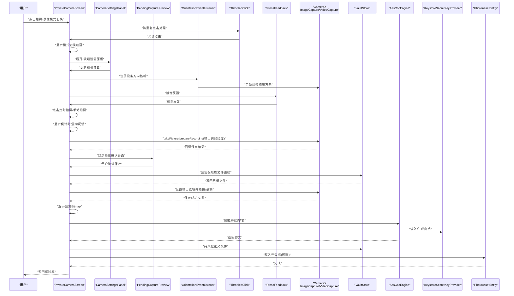
```mermaid
sequenceDiagram
participant U as "用户"
participant UI as "PrivateCameraScreen"
participant SP as "CameraSettingsPanel"
participant PCP as "PendingCapturePreview"
participant OR as "OrientationEventListener"
participant TF as "ThrottledClick"
participant PF as "PressFeedback"
participant CAM as "CameraX<br/>ImageCapture/VideoCapture"
participant VS as "VaultStore"
participant ENC as "AesCbcEngine"
participant KEY as "KeystoreSecretKeyProvider"
participant DB as "PhotoAssetEntity"
U->>UI : "点击拍照/录像模式切换"
UI->>TF : "防重复点击处理"
TF->>UI : "允许点击"
UI->>UI : "显示模式切换动画"
UI->>SP : "展开/收起设置面板"
SP->>UI : "更新相机参数"
UI->>OR : "注册设备方向监听"
OR->>CAM : "自动调整捕获方向"
UI->>PF : "触觉反馈"
PF->>UI : "视觉反馈"
UI->>UI : "点击定时拍摄/手动拍摄"
UI->>UI : "显示倒计时/震动反馈"
UI->>CAM : "takePicture/prepareRecording(输出到保险库)"
CAM-->>UI : "回调保存结果"
UI->>PCP : "显示预览确认界面"
PCP->>UI : "用户确认保存"
UI->>VS : "预留保险库文件路径"
VS-->>UI : "返回目标文件"
UI->>CAM : "设置输出选项并拍摄/录制"
CAM-->>UI : "保存成功/失败"
UI->>UI : "解码预览Bitmap"
UI->>ENC : "加密JPEG字节"
ENC->>KEY : "读取/生成密钥"
ENC-->>UI : "返回密文"
UI->>VS : "持久化密文文件"
UI->>DB : "写入元数据(可选)"
DB-->>UI : "完成"
UI-->>U : "返回保险库"
```

**图表来源**
- [PrivateCameraScreen.kt:424-561](file://android/app/src/main/kotlin/com/xpx/vault/ui/PrivateCameraScreen.kt#L424-L561)
- [PrivateCameraScreen.kt:503-562](file://android/app/src/main/kotlin/com/xpx/vault/ui/PrivateCameraScreen.kt#L503-L562)
- [PrivateCameraScreen.kt:566-598](file://android/app/src/main/kotlin/com/xpx/vault/ui/PrivateCameraScreen.kt#L566-L598)
- [PrivateCameraScreen.kt:624-669](file://android/app/src/main/kotlin/com/xpx/vault/ui/PrivateCameraScreen.kt#L624-L669)
- [PrivateCameraScreen.kt:836-884](file://android/app/src/main/kotlin/com/xpx/vault/ui/PrivateCameraScreen.kt#L836-L884)
- [PrivateCameraScreen.kt:922-1014](file://android/app/src/main/kotlin/com/xpx/vault/ui/PrivateCameraScreen.kt#L922-L1014)
- [PrivateCameraScreen.kt:200-216](file://android/app/src/main/kotlin/com/xpx/vault/ui/PrivateCameraScreen.kt#L200-L216)
- [PrivateCameraScreen.kt:462-547](file://android/app/src/main/kotlin/com/xpx/vault/ui/PrivateCameraScreen.kt#L462-L547)
- [VaultStore.kt:158-168](file://android/app/src/main/kotlin/com/xpx/vault/ui/vault/VaultStore.kt#L158-L168)
- [AesCbcEngine.kt:12-40](file://android/core/data/src/main/kotlin/com/xpx/vault/data/crypto/AesCbcEngine.kt#L12-L40)
- [KeystoreSecretKeyProvider.kt:12-42](file://android/core/data/src/main/kotlin/com/xpx/vault/data/crypto/KeystoreSecretKeyProvider.kt#L12-L42)
- [PhotoAssetEntity.kt:9-33](file://android/core/data/src/main/kotlin/com/xpx/vault/data/db/entity/PhotoAssetEntity.kt#L9-L33)
- [ThrottledClick.kt:18-53](file://android/app/src/main/kotlin/com/xpx/vault/ui/feedback/ThrottledClick.kt#L18-L53)
- [PressFeedback.kt:22-36](file://android/app/src/main/kotlin/com/xpx/vault/ui/feedback/PressFeedback.kt#L22-L36)

## 详细组件分析

### 设备方向检测系统与自动调整
- **OrientationEventListener 集成**：新增 OrientationEventListener 监听设备方向变化，自动调整相机捕获方向。
- **方向检测逻辑**：根据设备旋转角度（0°、90°、180°、270°）动态设置 ImageCapture 的 targetRotation。
- **自动方向调整**：当设备旋转时，自动更新相机捕获方向，确保拍摄的图像保持正确的方向。
- **生命周期管理**：在 DisposableEffect 中启用和禁用方向监听器，确保资源正确释放。
- **EXIF 方向处理**：结合 EXIF 旋转处理函数，确保图像方向的一致性。

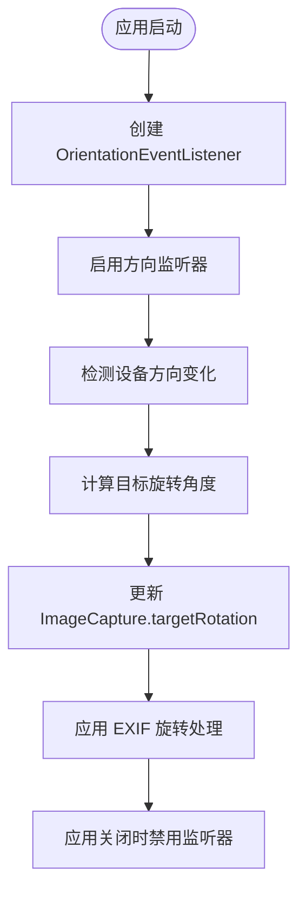
```mermaid
flowchart TD
Start(["应用启动"]) --> CreateListener["创建 OrientationEventListener"]
CreateListener --> EnableListener["启用方向监听器"]
EnableListener --> DetectOrientation["检测设备方向变化"]
DetectOrientation --> CalculateRotation["计算目标旋转角度"]
CalculateRotation --> UpdateTarget["更新 ImageCapture.targetRotation"]
UpdateTarget --> ApplyExif["应用 EXIF 旋转处理"]
ApplyExif --> DisableListener["应用关闭时禁用监听器"]
```

**图表来源**
- [PrivateCameraScreen.kt:200-216](file://android/app/src/main/kotlin/com/xpx/vault/ui/PrivateCameraScreen.kt#L200-L216)
- [PrivateCameraScreen.kt:678-715](file://android/app/src/main/kotlin/com/xpx/vault/ui/PrivateCameraScreen.kt#L678-L715)

**章节来源**
- [PrivateCameraScreen.kt:200-216](file://android/app/src/main/kotlin/com/xpx/vault/ui/PrivateCameraScreen.kt#L200-L216)
- [PrivateCameraScreen.kt:678-715](file://android/app/src/main/kotlin/com/xpx/vault/ui/PrivateCameraScreen.kt#L678-L715)

### 设置面板交互增强与外部区域点击关闭
- **外部区域点击关闭**：在设置面板显示时，添加覆盖层并监听点击事件，点击外部区域自动关闭设置面板。
- **点击事件处理**：使用 clickable modifier 处理外部区域点击，确保设置面板的智能关闭。
- **用户体验优化**：提供更直观的设置面板交互体验，减少误操作。
- **状态管理**：通过 showSettingsPanel 状态变量控制设置面板的显示和隐藏。

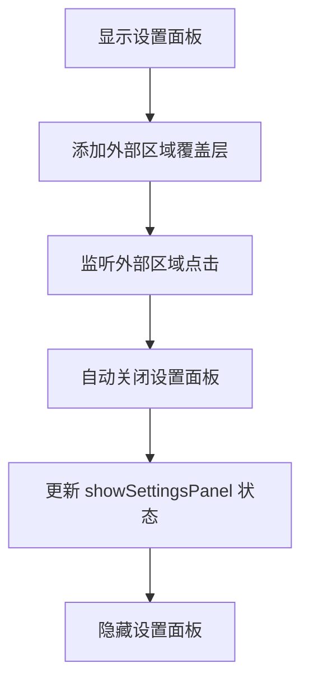
```mermaid
flowchart TD
ShowPanel["显示设置面板"] --> Overlay["添加外部区域覆盖层"]
Overlay --> ClickOutside["监听外部区域点击"]
ClickOutside --> ClosePanel["自动关闭设置面板"]
ClosePanel --> UpdateState["更新 showSettingsPanel 状态"]
UpdateState --> HidePanel["隐藏设置面板"]
```

**图表来源**
- [PrivateCameraScreen.kt:405-415](file://android/app/src/main/kotlin/com/xpx/vault/ui/PrivateCameraScreen.kt#L405-L415)

**章节来源**
- [PrivateCameraScreen.kt:405-415](file://android/app/src/main/kotlin/com/xpx/vault/ui/PrivateCameraScreen.kt#L405-L415)

### 状态持久化优化与rememberSaveable迁移
- **rememberSaveable迁移**：将所有相机状态变量迁移到 rememberSaveable，确保配置变更时状态正确恢复。
- **状态变量优化**：包括 lastMediaPath、lastMediaPreview、rebindTick、bindRetryCount、bindStartMs 等关键状态。
- **配置变更处理**：屏幕旋转、键盘弹出等配置变更时，状态自动恢复，提升用户体验。
- **性能优化**：减少不必要的状态重建，提高应用响应速度。

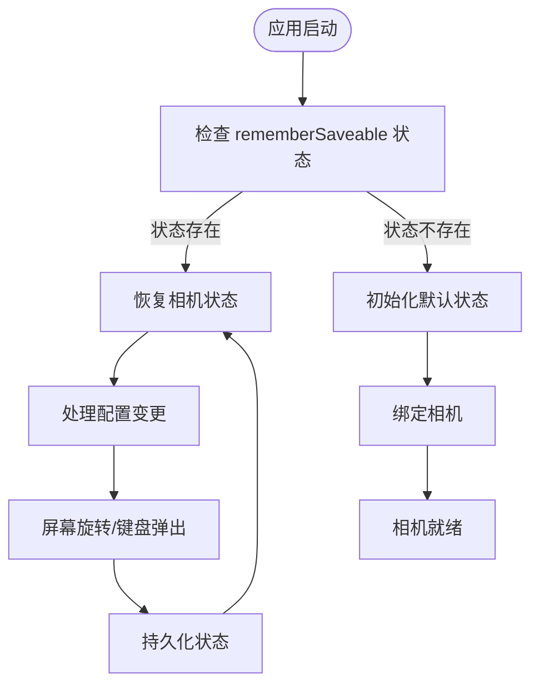
```mermaid
flowchart TD
Start(["应用启动"]) --> CheckState["检查 rememberSaveable 状态"]
CheckState --> |状态存在| RestoreState["恢复相机状态"]
CheckState --> |状态不存在| InitState["初始化默认状态"]
RestoreState --> ConfigChange["处理配置变更"]
ConfigChange --> ScreenRotate["屏幕旋转/键盘弹出"]
ScreenRotate --> PersistState["持久化状态"]
PersistState --> RestoreState
InitState --> CameraBind["绑定相机"]
CameraBind --> Ready["相机就绪"]
```

**图表来源**
- [PrivateCameraScreen.kt:182-195](file://android/app/src/main/kotlin/com/xpx/vault/ui/PrivateCameraScreen.kt#L182-L195)
- [PrivateCameraScreen.kt:262-307](file://android/app/src/main/kotlin/com/xpx/vault/ui/PrivateCameraScreen.kt#L262-L307)

**章节来源**
- [PrivateCameraScreen.kt:182-195](file://android/app/src/main/kotlin/com/xpx/vault/ui/PrivateCameraScreen.kt#L182-L195)
- [PrivateCameraScreen.kt:262-307](file://android/app/src/main/kotlin/com/xpx/vault/ui/PrivateCameraScreen.kt#L262-L307)

### 专业级相机界面与权限管理
- **权限申请**：首次进入时请求 CAMERA 权限，若拒绝则提示无法拍照。
- **实时预览绑定**：通过 PreviewView 与 ProcessCameraProvider 绑定 Preview 与 ImageCapture/VideoCapture，支持最小延迟捕获模式。
- **闪光灯与镜头切换**：通过 ImageCapture/VideoCapture 的闪关模式与 CameraSelector 的镜头方向控制。
- **定时拍摄**：支持 0/3/10 秒定时拍摄，倒计时显示。
- **多倍率缩放**：支持 0.6x/1x/2x 缩放预设，手势缩放。
- **曝光补偿**：支持自动对焦和测光，曝光范围动态获取。
- **网格辅助线**：提供三分线构图辅助。
- **自动对焦**：点击屏幕进行对焦和测光。
- **拍照触发**：点击"快门按钮"，防重复点击，拍摄成功后显示预览确认界面。
- **动态模式切换**：支持拍照模式和视频模式之间的无缝切换，每个模式都有独立的控制界面。

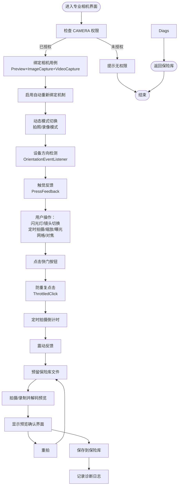
```mermaid
flowchart TD
Start(["进入专业相机界面"]) --> CheckPerm["检查 CAMERA 权限"]
CheckPerm --> |未授权| ShowMsg["提示无权限"]
CheckPerm --> |已授权| BindCam["绑定相机用例<br/>Preview+ImageCapture+VideoCapture"]
BindCam --> AutoRebind["启用自动重新绑定机制"]
AutoRebind --> ModeSwitch["动态模式切换<br/>拍照/录像模式"]
ModeSwitch --> OrientationDetect["设备方向检测<br/>OrientationEventListener"]
OrientationDetect --> UIFeedback["触觉反馈<br/>PressFeedback"]
UIFeedback --> UI["用户操作：<br/>闪光灯/镜头切换<br/>定时拍摄/缩放/曝光<br/>网格/对焦"]
UI --> Capture["点击快门按钮"]
Capture --> ThrottledClick["防重复点击<br/>ThrottledClick"]
ThrottledClick --> Timer["定时拍摄倒计时"]
Timer --> Shake["震动反馈"]
Shake --> Reserve["预留保险库文件"]
Reserve --> Save["拍摄/录制并解码预览"]
Save --> Confirm["显示预览确认界面"]
Confirm --> Retake["重拍"]
Confirm --> SaveVault["保存到保险库"]
SaveVault --> Diagnostics["记录诊断日志"]
Diags --> Done(["返回保险库"])
ShowMsg --> End(["结束"])
Retake --> Reserve
Done --> End
```

**图表来源**
- [PrivateCameraScreen.kt:95-133](file://android/app/src/main/kotlin/com/xpx/vault/ui/PrivateCameraScreen.kt#L95-L133)
- [PrivateCameraScreen.kt:135-156](file://android/app/src/main/kotlin/com/xpx/vault/ui/PrivateCameraScreen.kt#L135-L156)
- [PrivateCameraScreen.kt:225-250](file://android/app/src/main/kotlin/com/xpx/vault/ui/PrivateCameraScreen.kt#L225-L250)
- [PrivateCameraScreen.kt:424-454](file://android/app/src/main/kotlin/com/xpx/vault/ui/PrivateCameraScreen.kt#L424-L454)
- [PrivateCameraScreen.kt:489-494](file://android/app/src/main/kotlin/com/xpx/vault/ui/PrivateCameraScreen.kt#L489-L494)
- [PrivateCameraScreen.kt:200-216](file://android/app/src/main/kotlin/com/xpx/vault/ui/PrivateCameraScreen.kt#L200-L216)
- [PrivateCameraScreen.kt:462-547](file://android/app/src/main/kotlin/com/xpx/vault/ui/PrivateCameraScreen.kt#L462-L547)
- [ThrottledClick.kt:18-53](file://android/app/src/main/kotlin/com/xpx/vault/ui/feedback/ThrottledClick.kt#L18-L53)
- [PressFeedback.kt:22-36](file://android/app/src/main/kotlin/com/xpx/vault/ui/feedback/PressFeedback.kt#L22-L36)

**章节来源**
- [PrivateCameraScreen.kt:142-561](file://android/app/src/main/kotlin/com/xpx/vault/ui/PrivateCameraScreen.kt#L142-L561)
- [AndroidManifest.xml:3-6](file://android/app/src/main/AndroidManifest.xml#L3-L6)

### 可折叠设置面板与增强功能
- **可折叠设置面板**：提供可折叠的设置面板，支持闪光灯、定时器、网格、曝光、分辨率、帧率等参数配置。
- **设置面板布局**：采用圆角背景设计，支持多种设置项的分组显示。
- **设置项管理**：使用 rememberSaveable 确保设置状态在配置变更时正确恢复。
- **相机参数配置**：支持闪光灯模式、定时器秒数、网格显示、曝光补偿、视频分辨率和帧率等。
- **界面交互**：支持设置面板的展开/收起，提供直观的用户操作体验。
- **外部区域点击关闭**：新增点击外部区域自动关闭设置面板的功能。

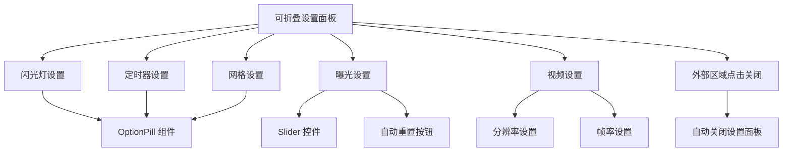
```mermaid
flowchart TD
SettingsPanel["可折叠设置面板"] --> FlashSetting["闪光灯设置"]
SettingsPanel --> TimerSetting["定时器设置"]
SettingsPanel --> GridSetting["网格设置"]
SettingsPanel --> ExposureSetting["曝光设置"]
SettingsPanel --> VideoSetting["视频设置"]
FlashSetting --> OptionPill["OptionPill 组件"]
TimerSetting --> OptionPill
GridSetting --> OptionPill
ExposureSetting --> Slider["Slider 控件"]
ExposureSetting --> AutoReset["自动重置按钮"]
VideoSetting --> ResolutionSetting["分辨率设置"]
VideoSetting --> FpsSetting["帧率设置"]
SettingsPanel --> ExternalClick["外部区域点击关闭"]
ExternalClick --> ClosePanel["自动关闭设置面板"]
```

**图表来源**
- [PrivateCameraScreen.kt:922-1014](file://android/app/src/main/kotlin/com/xpx/vault/ui/PrivateCameraScreen.kt#L922-L1014)
- [PrivateCameraScreen.kt:1016-1063](file://android/app/src/main/kotlin/com/xpx/vault/ui/PrivateCameraScreen.kt#L1016-L1063)
- [PrivateCameraScreen.kt:1040-1063](file://android/app/src/main/kotlin/com/xpx/vault/ui/PrivateCameraScreen.kt#L1040-L1063)
- [PrivateCameraScreen.kt:405-415](file://android/app/src/main/kotlin/com/xpx/vault/ui/PrivateCameraScreen.kt#L405-L415)

**章节来源**
- [PrivateCameraScreen.kt:922-1014](file://android/app/src/main/kotlin/com/xpx/vault/ui/PrivateCameraScreen.kt#L922-L1014)
- [PrivateCameraScreen.kt:1016-1063](file://android/app/src/main/kotlin/com/xpx/vault/ui/PrivateCameraScreen.kt#L1016-L1063)

### 预览确认界面与缩略图生成系统
- **预览确认界面**：提供预览确认界面，支持重拍和保存到保险库操作。
- **缩略图生成系统**：集成 VaultProgressiveImage 组件，支持图片和视频缩略图的异步加载和渐进式显示。
- **异步加载**：使用 remember 和 LaunchedEffect 实现缩略图的异步加载和缓存。
- **渐进式显示**：支持占位符动画和渐进式图像显示，提升用户体验。
- **视频支持**：支持视频缩略图生成和时长显示功能。

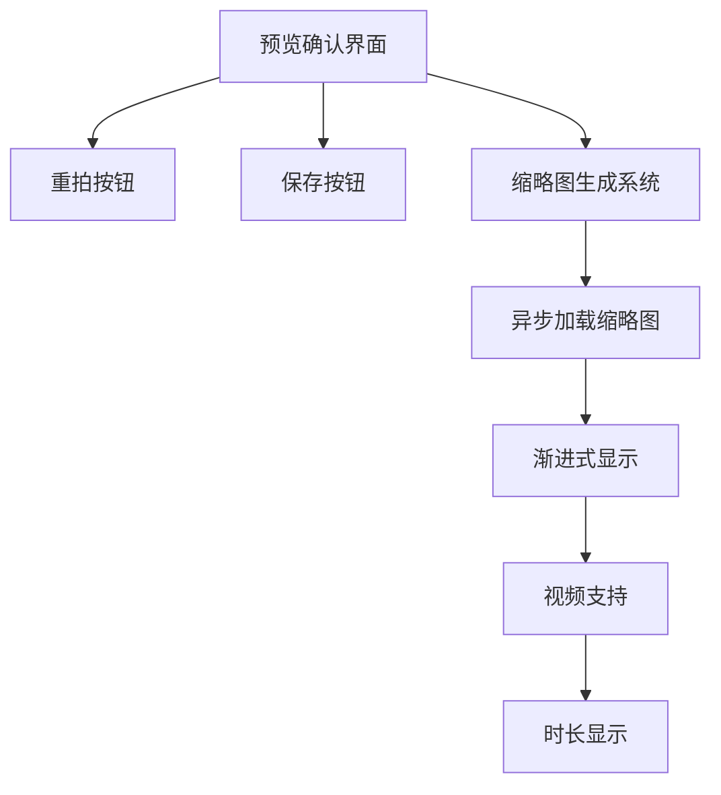
```mermaid
flowchart TD
PreviewConfirm["预览确认界面"] --> RetakeBtn["重拍按钮"]
PreviewConfirm --> SaveBtn["保存按钮"]
PreviewConfirm --> ThumbnailGen["缩略图生成系统"]
ThumbnailGen --> AsyncLoad["异步加载缩略图"]
AsyncLoad --> ProgressiveDisplay["渐进式显示"]
ProgressiveDisplay --> VideoSupport["视频支持"]
VideoSupport --> DurationDisplay["时长显示"]
```

**图表来源**
- [PrivateCameraScreen.kt:836-884](file://android/app/src/main/kotlin/com/xpx/vault/ui/PrivateCameraScreen.kt#L836-L884)
- [VaultProgressiveImage.kt:49-211](file://android/app/src/main/kotlin/com/xpx/vault/ui/components/VaultProgressiveImage.kt#L49-L211)

**章节来源**
- [PrivateCameraScreen.kt:836-884](file://android/app/src/main/kotlin/com/xpx/vault/ui/PrivateCameraScreen.kt#L836-L884)
- [VaultProgressiveImage.kt:49-211](file://android/app/src/main/kotlin/com/xpx/vault/ui/components/VaultProgressiveImage.kt#L49-L211)

### 视频录制系统与实时录制指示器
- **VideoCapture API**：使用 CameraX 的 VideoCapture 类进行视频录制，支持 Recorder 和 QualitySelector 配置。
- **MP4 录制**：录制输出为 MP4 格式，使用 FileOutputOptions 指定输出文件。
- **实时录制指示器**：录制时显示红色 "REC" 文本和录制时长，颜色和样式随录制状态变化。
- **录制状态管理**：维护 isRecording 状态、recordingDurationMs 计时器、activeRecording 对象。
- **录制事件处理**：监听 VideoRecordEvent.Finalize 事件，处理录制完成、错误等情况。
- **录制时长显示**：使用 formatRecordingDuration 函数格式化显示录制时长。
- **录制控制**：支持开始/停止录制、定时录制、录制状态切换。

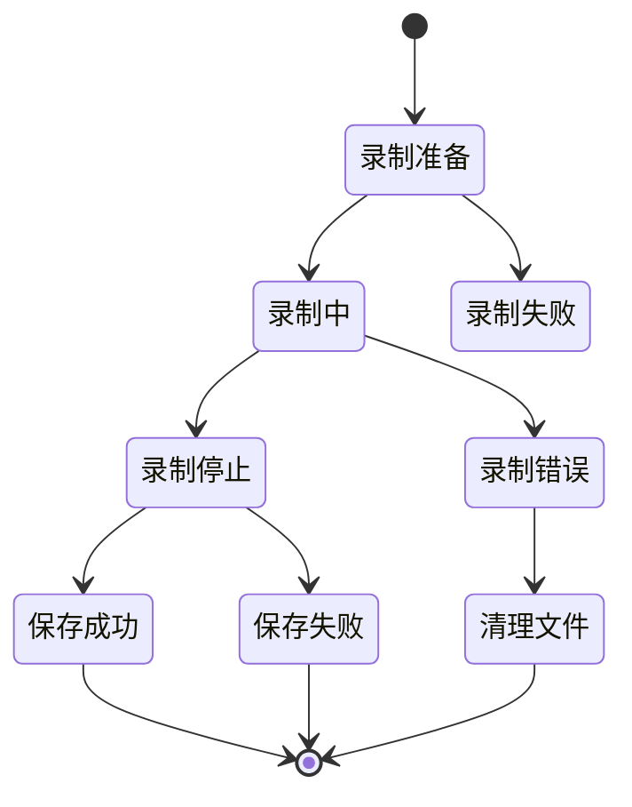
```mermaid
stateDiagram-v2
[*] --> 录制准备
录制准备 --> 录制中
录制准备 --> 录制失败
录制中 --> 录制停止
录制中 --> 录制错误
录制停止 --> 保存成功
录制停止 --> 保存失败
录制错误 --> 清理文件
保存成功 --> [*]
保存失败 --> [*]
清理文件 --> [*]
```

**图表来源**
- [PrivateCameraScreen.kt:624-669](file://android/app/src/main/kotlin/com/xpx/vault/ui/PrivateCameraScreen.kt#L624-L669)
- [PrivateCameraScreen.kt:649-666](file://android/app/src/main/kotlin/com/xpx/vault/ui/PrivateCameraScreen.kt#L649-L666)
- [PrivateCameraScreen.kt:1071-1076](file://android/app/src/main/kotlin/com/xpx/vault/ui/PrivateCameraScreen.kt#L1071-L1076)

**章节来源**
- [PrivateCameraScreen.kt:624-669](file://android/app/src/main/kotlin/com/xpx/vault/ui/PrivateCameraScreen.kt#L624-L669)
- [PrivateCameraScreen.kt:649-666](file://android/app/src/main/kotlin/com/xpx/vault/ui/PrivateCameraScreen.kt#L649-L666)
- [PrivateCameraScreen.kt:1071-1076](file://android/app/src/main/kotlin/com/xpx/vault/ui/PrivateCameraScreen.kt#L1071-L1076)

### 自动相机重新绑定与错误处理
- **自动重新绑定机制**：当相机状态发生变化或绑定失败时，自动进行最多3次重试，确保相机功能的稳定性。
- **错误分类系统**：将拍照/录制错误细分为权限、硬件、IO、超时、未知等类别，提供精准的错误诊断和用户提示。
- **重试计数管理**：维护绑定重试次数，超过限制后停止自动重试并提示用户。
- **生命周期感知**：在应用 onResume 时自动触发重新绑定，确保相机在前台时始终可用。

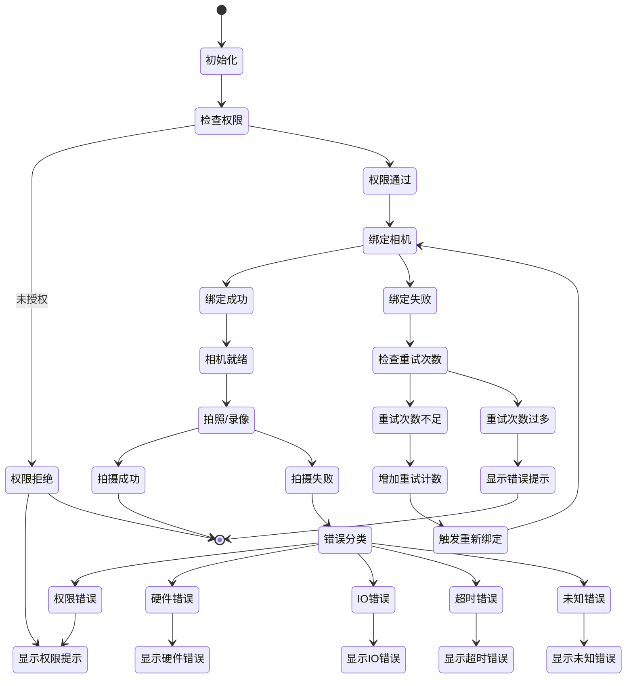
```mermaid
stateDiagram-v2
[*] --> 初始化
初始化 --> 检查权限
检查权限 --> 权限拒绝 : 未授权
权限拒绝 --> 显示权限提示
权限拒绝 --> [*]
检查权限 --> 权限通过
权限通过 --> 绑定相机
绑定相机 --> 绑定成功
绑定相机 --> 绑定失败
绑定失败 --> 检查重试次数
检查重试次数 --> 重试次数不足
重试次数不足 --> 增加重试计数
增加重试计数 --> 触发重新绑定
触发重新绑定 --> 绑定相机
检查重试次数 --> 重试次数过多
重试次数过多 --> 显示错误提示
显示错误提示 --> [*]
绑定成功 --> 相机就绪
相机就绪 --> 拍照/录像
拍照/录像 --> 拍摄成功
拍照/录像 --> 拍摄失败
拍摄失败 --> 错误分类
错误分类 --> 权限错误
错误分类 --> 硬件错误
错误分类 --> IO错误
错误分类 --> 超时错误
错误分类 --> 未知错误
权限错误 --> 显示权限提示
硬件错误 --> 显示硬件错误
IO错误 --> 显示IO错误
超时错误 --> 显示超时错误
未知错误 --> 显示未知错误
拍摄成功 --> [*]
```

**图表来源**
- [PrivateCameraScreen.kt:170-179](file://android/app/src/main/kotlin/com/xpx/vault/ui/PrivateCameraScreen.kt#L170-L179)
- [PrivateCameraScreen.kt:198-215](file://android/app/src/main/kotlin/com/xpx/vault/ui/PrivateCameraScreen.kt#L198-L215)
- [PrivateCameraScreen.kt:254-260](file://android/app/src/main/kotlin/com/xpx/vault/ui/PrivateCameraScreen.kt#L254-L260)
- [PrivateCameraScreen.kt:951-957](file://android/app/src/main/kotlin/com/xpx/vault/ui/PrivateCameraScreen.kt#L951-L957)

**章节来源**
- [PrivateCameraScreen.kt:170-215](file://android/app/src/main/kotlin/com/xpx/vault/ui/PrivateCameraScreen.kt#L170-L215)
- [PrivateCameraScreen.kt:254-260](file://android/app/src/main/kotlin/com/xpx/vault/ui/PrivateCameraScreen.kt#L254-L260)
- [PrivateCameraScreen.kt:951-957](file://android/app/src/main/kotlin/com/xpx/vault/ui/PrivateCameraScreen.kt#L951-L957)

### ZoomRail 连续滑块与自动曝光重置
- **ZoomRail 连续滑块**：提供流畅的缩放控制体验，支持0.6x/1x/2x预设和连续滑动调节。
- **缩放预设**：提供常用缩放比例的快捷选择，支持禁用不可用的预设。
- **自动曝光重置**：当曝光指数不为0时，提供一键重置为自动曝光的功能。
- **曝光范围控制**：根据相机支持的曝光范围动态调整滑块范围和步长。

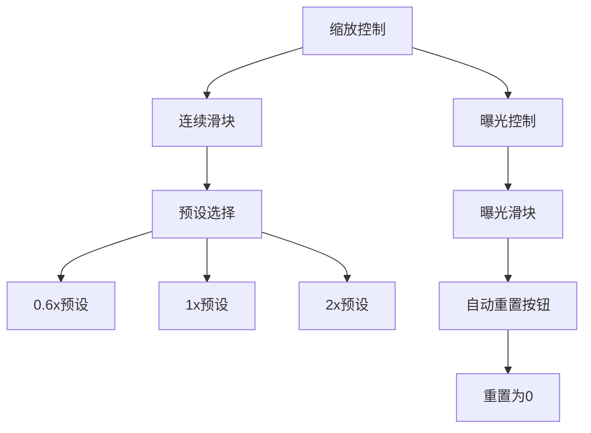
```mermaid
flowchart TD
ZoomControl["缩放控制"] --> ContinuousSlider["连续滑块"]
ContinuousSlider --> PresetSelection["预设选择"]
PresetSelection --> Preset06["0.6x预设"]
PresetSelection --> Preset10["1x预设"]
PresetSelection --> Preset20["2x预设"]
ZoomControl --> ExposureControl["曝光控制"]
ExposureControl --> ExposureSlider["曝光滑块"]
ExposureSlider --> AutoReset["自动重置按钮"]
AutoReset --> ResetToZero["重置为0"]
```

**图表来源**
- [PrivateCameraScreen.kt:780-815](file://android/app/src/main/kotlin/com/xpx/vault/ui/PrivateCameraScreen.kt#L780-L815)
- [PrivateCameraScreen.kt:530-546](file://android/app/src/main/kotlin/com/xpx/vault/ui/PrivateCameraScreen.kt#L530-L546)

**章节来源**
- [PrivateCameraScreen.kt:780-815](file://android/app/src/main/kotlin/com/xpx/vault/ui/PrivateCameraScreen.kt#L780-L815)
- [PrivateCameraScreen.kt:530-546](file://android/app/src/main/kotlin/com/xpx/vault/ui/PrivateCameraScreen.kt#L530-L546)

### 拍照流程与直拍直存
- **输出目标**：通过 VaultStore 预留保险库中的临时文件作为 ImageCapture 的输出目标。
- **拍摄回调**：使用协程挂起回调，成功或失败均恢复协程状态，避免阻塞主线程。
- **预览确认**：拍摄后解码 Bitmap 作为预览，用户确认保存后再落盘，取消则丢弃临时文件。
- **不写入系统相册**：仅写入应用私有目录，不调用 MediaStore 插入系统相册。
- **直接媒体保存流程**：优化临时文件处理和直接保存机制，提升性能和可靠性。

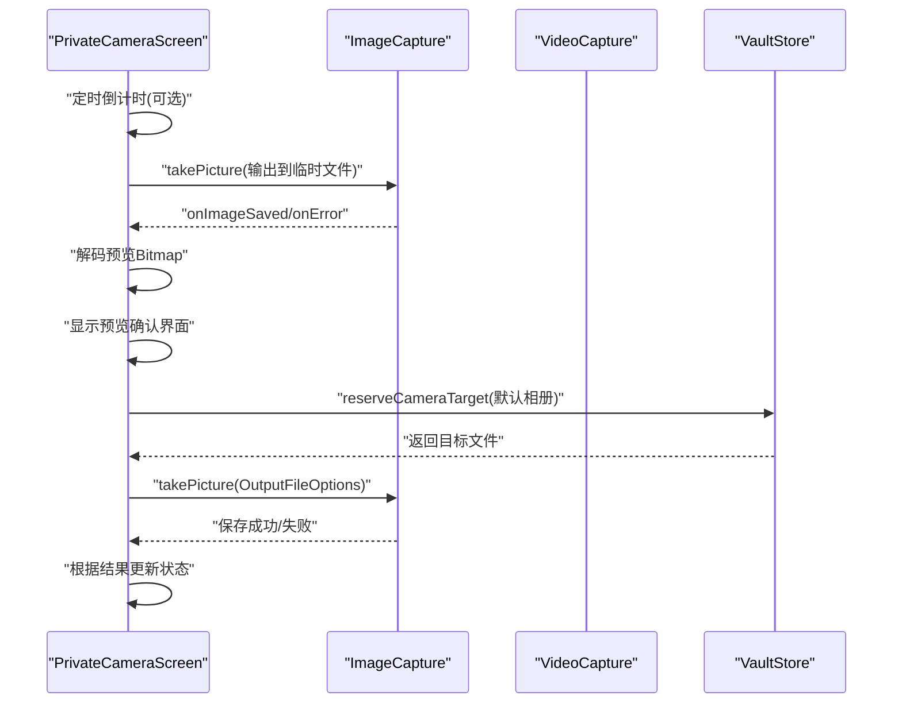
```mermaid
sequenceDiagram
participant UI as "PrivateCameraScreen"
participant IC as "ImageCapture"
participant VC as "VideoCapture"
participant VS as "VaultStore"
UI->>UI : "定时倒计时(可选)"
UI->>IC : "takePicture(输出到临时文件)"
IC-->>UI : "onImageSaved/onError"
UI->>UI : "解码预览Bitmap"
UI->>UI : "显示预览确认界面"
UI->>VS : "reserveCameraTarget(默认相册)"
VS-->>UI : "返回目标文件"
UI->>IC : "takePicture(OutputFileOptions)"
IC-->>UI : "保存成功/失败"
UI->>UI : "根据结果更新状态"
```

**图表来源**
- [PrivateCameraScreen.kt:503-562](file://android/app/src/main/kotlin/com/xpx/vault/ui/PrivateCameraScreen.kt#L503-L562)
- [PrivateCameraScreen.kt:513-524](file://android/app/src/main/kotlin/com/xpx/vault/ui/PrivateCameraScreen.kt#L513-L524)
- [VaultStore.kt:158-168](file://android/app/src/main/kotlin/com/xpx/vault/ui/vault/VaultStore.kt#L158-L168)

**章节来源**
- [PrivateCameraScreen.kt:503-562](file://android/app/src/main/kotlin/com/xpx/vault/ui/PrivateCameraScreen.kt#L503-L562)
- [VaultStore.kt:158-168](file://android/app/src/main/kotlin/com/xpx/vault/ui/vault/VaultStore.kt#L158-L168)

### 视频播放器与 ExoPlayer 集成
- **ExoPlayer 集成**：使用 Media3 ExoPlayer 进行视频播放，支持自定义控制层和手势操作。
- **播放控制**：支持播放/暂停、进度条拖拽、音量控制、静音切换、重新播放等功能。
- **播放状态管理**：维护播放状态、进度、音量、控制层显示等状态。
- **播放位置记忆**：使用 SharedPreferences 记录播放位置，支持断点续播。
- **手势控制**：支持单击显示控制层、双击左右区域快退/快进 10 秒。
- **横竖屏适配**：根据设备方向自动调整控制层布局和间距。

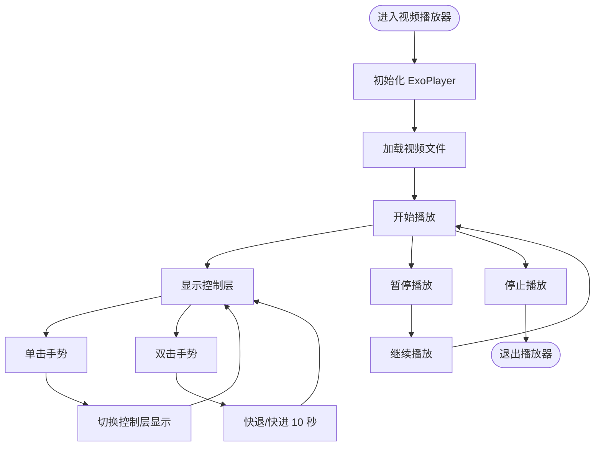
```mermaid
flowchart TD
Start(["进入视频播放器"]) --> InitPlayer["初始化 ExoPlayer"]
InitPlayer --> LoadVideo["加载视频文件"]
LoadVideo --> PlayVideo["开始播放"]
PlayVideo --> ControlLayer["显示控制层"]
ControlLayer --> TapGesture["单击手势"]
ControlLayer --> DoubleTap["双击手势"]
TapGesture --> ToggleControls["切换控制层显示"]
DoubleTap --> Seek["快退/快进 10 秒"]
PlayVideo --> Pause["暂停播放"]
PlayVideo --> Stop["停止播放"]
Pause --> Resume["继续播放"]
Stop --> End(["退出播放器"])
Resume --> PlayVideo
ToggleControls --> ControlLayer
Seek --> ControlLayer
```

**图表来源**
- [VideoPlayerScreen.kt:73-80](file://android/app/src/main/kotlin/com/xpx/vault/ui/VideoPlayerScreen.kt#L73-L80)
- [VideoPlayerScreen.kt:180-187](file://android/app/src/main/kotlin/com/xpx/vault/ui/VideoPlayerScreen.kt#L180-L187)
- [VideoPlayerScreen.kt:252-277](file://android/app/src/main/kotlin/com/xpx/vault/ui/VideoPlayerScreen.kt#L252-L277)

**章节来源**
- [VideoPlayerScreen.kt:67-200](file://android/app/src/main/kotlin/com/xpx/vault/ui/VideoPlayerScreen.kt#L67-L200)

### 保险库存储与相册管理
- **初始化**：确保根目录与默认相册存在，必要时迁移旧版目录。
- **相册列表**：遍历根目录下的相册文件夹，统计照片数量并缓存封面。
- **文件命名**：以时间戳命名，避免冲突；搜索与去重基于文件名与内容哈希。
- **默认相册**：常量 DEFAULT_ALBUM_NAME 用于统一归属。

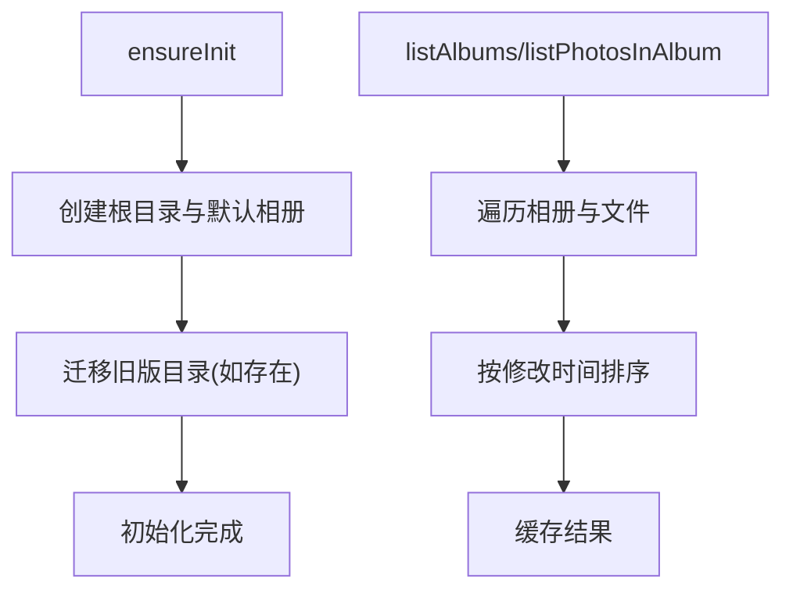
```mermaid
flowchart TD
Init["ensureInit"] --> Root["创建根目录与默认相册"]
Root --> Migrate["迁移旧版目录(如存在)"]
Migrate --> Ready["初始化完成"]
List["listAlbums/listPhotosInAlbum"] --> Walk["遍历相册与文件"]
Walk --> Sort["按修改时间排序"]
Sort --> Cache["缓存结果"]
```

**图表来源**
- [VaultStore.kt:61-67](file://android/app/src/main/kotlin/com/xpx/vault/ui/vault/VaultStore.kt#L61-L67)
- [VaultStore.kt:87-108](file://android/app/src/main/kotlin/com/xpx/vault/ui/vault/VaultStore.kt#L87-L108)
- [VaultStore.kt:158-168](file://android/app/src/main/kotlin/com/xpx/vault/ui/vault/VaultStore.kt#L158-L168)

**章节来源**
- [VaultStore.kt:61-108](file://android/app/src/main/kotlin/com/xpx/vault/ui/vault/VaultStore.kt#L61-L108)
- [VaultStore.kt:158-168](file://android/app/src/main/kotlin/com/xpx/vault/ui/vault/VaultStore.kt#L158-L168)

### 加密与密钥管理
- **密钥来源**：Android Keystore，AES-256-CBC，PKCS7 填充，密钥不可导出。
- **加密格式**：前置 16 字节随机 IV，随后为密文。
- **解密校验**：输入长度需大于 IV 长度，否则视为无效载荷。

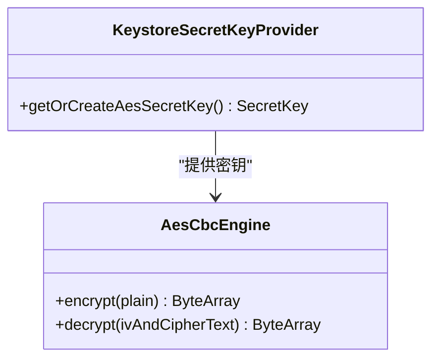
```mermaid
classDiagram
class KeystoreSecretKeyProvider {
+getOrCreateAesSecretKey() SecretKey
}
class AesCbcEngine {
+encrypt(plain) ByteArray
+decrypt(ivAndCipherText) ByteArray
}
KeystoreSecretKeyProvider --> AesCbcEngine : "提供密钥"
```

**图表来源**
- [KeystoreSecretKeyProvider.kt:12-42](file://android/core/data/src/main/kotlin/com/xpx/vault/data/crypto/KeystoreSecretKeyProvider.kt#L12-L42)
- [AesCbcEngine.kt:12-40](file://android/core/data/src/main/kotlin/com/xpx/vault/data/crypto/AesCbcEngine.kt#L12-L40)

**章节来源**
- [KeystoreSecretKeyProvider.kt:12-42](file://android/core/data/src/main/kotlin/com/xpx/vault/data/crypto/KeystoreSecretKeyProvider.kt#L12-L42)
- [AesCbcEngine.kt:12-40](file://android/core/data/src/main/kotlin/com/xpx/vault/data/crypto/AesCbcEngine.kt#L12-L40)

### 照片元数据与隐私保护
- **元数据模型**：包含密文路径、缩略图路径、元数据 JSON、创建时间、删除标记等。
- **隐私策略**：密文路径位于应用私有目录，不写入系统相册；元数据 JSON 可选记录，便于检索与展示。
- **与相册系统集成**：不通过 MediaStore 写入系统相册，避免被第三方应用发现。

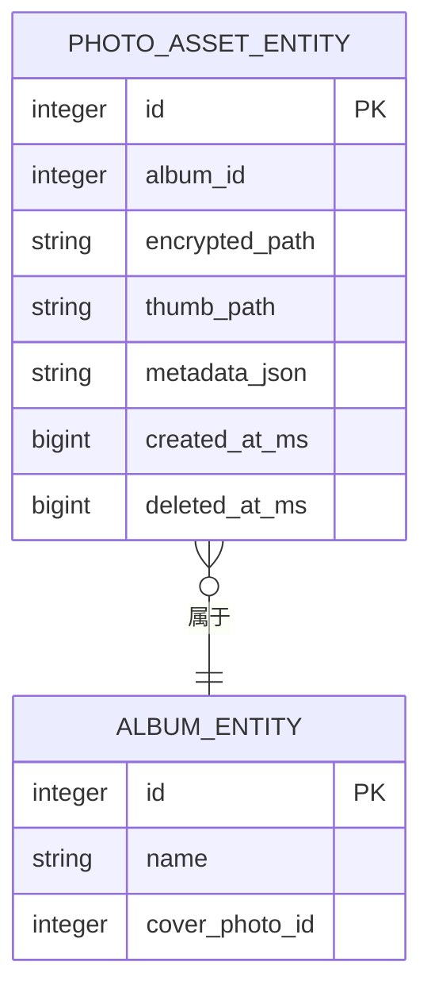
```mermaid
erDiagram
PHOTO_ASSET_ENTITY {
integer id PK
integer album_id
string encrypted_path
string thumb_path
string metadata_json
bigint created_at_ms
bigint deleted_at_ms
}
ALBUM_ENTITY {
integer id PK
string name
integer cover_photo_id
}
PHOTO_ASSET_ENTITY }o--|| ALBUM_ENTITY : "属于"
```

**图表来源**
- [PhotoAssetEntity.kt:9-33](file://android/core/data/src/main/kotlin/com/xpx/vault/data/db/entity/PhotoAssetEntity.kt#L9-L33)

**章节来源**
- [PhotoAssetEntity.kt:9-33](file://android/core/data/src/main/kotlin/com/xpx/vault/data/db/entity/PhotoAssetEntity.kt#L9-L33)

### 防重复点击机制与触觉反馈
- **ThrottledClick 防重复点击**：引入 rememberThrottledClick 机制，防止用户在短时间内重复点击按钮。
- **PressFeedback 触觉反馈**：提供 pressFeedback 组件，增强按钮点击的视觉和触觉反馈。
- **用户体验优化**：通过防重复点击和触觉反馈提升用户体验，减少误操作。
- **性能考虑**：使用 rememberUpdatedState 和 remember 宏观优化状态管理性能。

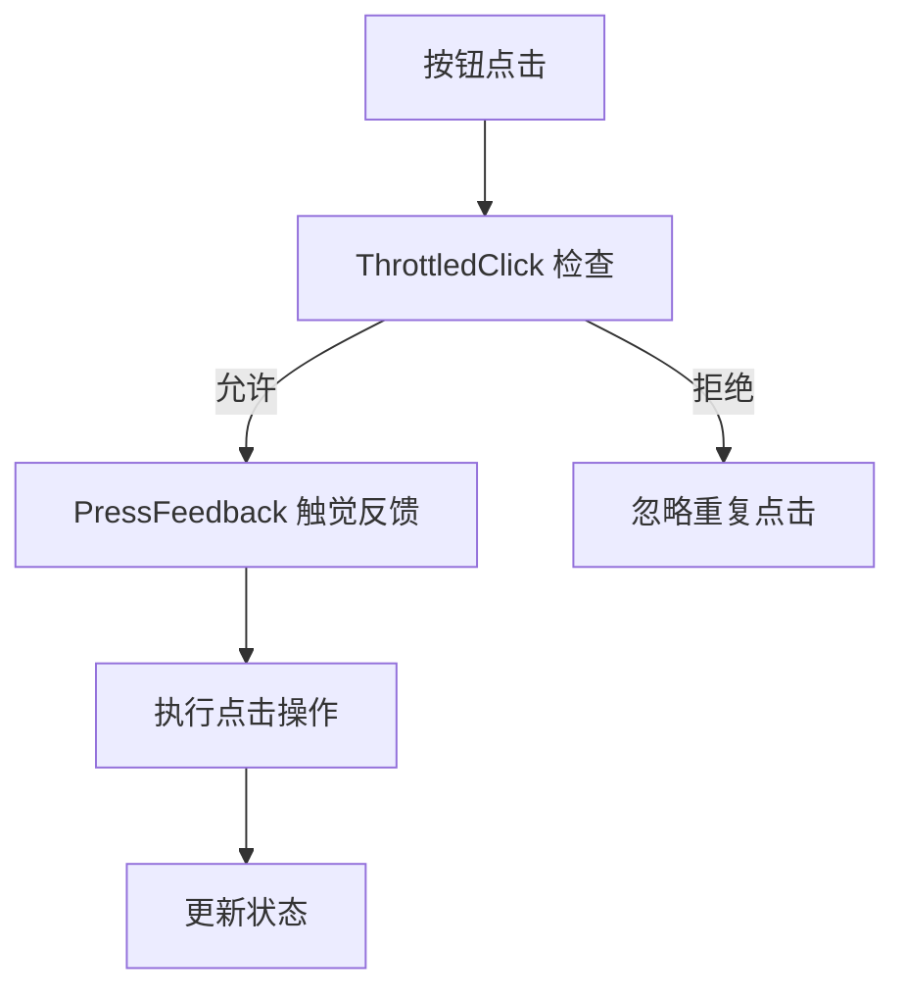
```mermaid
flowchart TD
ButtonClick["按钮点击"] --> ThrottledCheck["ThrottledClick 检查"]
ThrottledCheck --> |允许| Feedback["PressFeedback 触觉反馈"]
ThrottledCheck --> |拒绝| Ignore["忽略重复点击"]
Feedback --> Execute["执行点击操作"]
Execute --> UpdateState["更新状态"]
```

**图表来源**
- [ThrottledClick.kt:18-53](file://android/app/src/main/kotlin/com/xpx/vault/ui/feedback/ThrottledClick.kt#L18-L53)
- [PressFeedback.kt:22-36](file://android/app/src/main/kotlin/com/xpx/vault/ui/feedback/PressFeedback.kt#L22-L36)

**章节来源**
- [ThrottledClick.kt:18-53](file://android/app/src/main/kotlin/com/xpx/vault/ui/feedback/ThrottledClick.kt#L18-L53)
- [PressFeedback.kt:22-36](file://android/app/src/main/kotlin/com/xpx/vault/ui/feedback/PressFeedback.kt#L22-L36)

## 诊断与监控系统

### 诊断日志系统
- **日志标签**：使用 CAMERA_DIAG_TAG 作为相机相关日志的统一标识。
- **关键事件记录**：记录相机绑定开始/成功/失败、预览首帧、拍摄开始/成功/失败、录制开始/成功/失败、内存使用等关键事件。
- **设备信息脱敏**：对设备型号进行脱敏处理，避免泄露敏感信息。
- **性能指标监控**：记录绑定耗时、内存峰值、拍摄耗时、录制时长等性能指标。

### 错误分类与处理
- **错误类型定义**：权限、硬件、IO、超时、未知五种错误类型。
- **错误消息映射**：为每种错误类型提供用户友好的提示信息。
- **自动恢复机制**：针对可恢复的错误类型自动进行重试或切换。

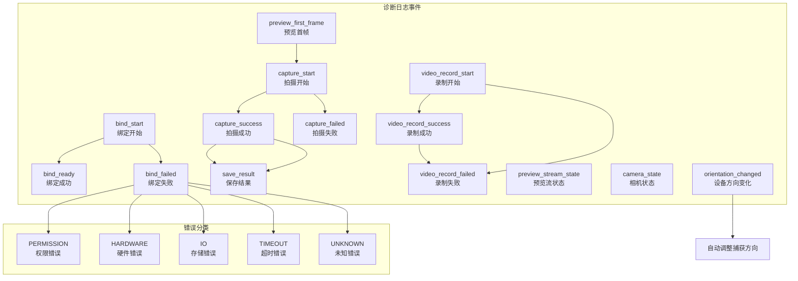
```mermaid
graph TB
subgraph "诊断日志事件"
A["bind_start<br/>绑定开始"]
B["bind_ready<br/>绑定成功"]
C["bind_failed<br/>绑定失败"]
D["preview_first_frame<br/>预览首帧"]
E["capture_start<br/>拍摄开始"]
F["capture_success<br/>拍摄成功"]
F --> G["save_result<br/>保存结果"]
H["video_record_start<br/>录制开始"]
I["video_record_success<br/>录制成功"]
I --> J["video_record_failed<br/>录制失败"]
K["capture_failed<br/>拍摄失败"]
L["preview_stream_state<br/>预览流状态"]
M["camera_state<br/>相机状态"]
N["orientation_changed<br/>设备方向变化"]
end
subgraph "错误分类"
O["PERMISSION<br/>权限错误"]
P["HARDWARE<br/>硬件错误"]
Q["IO<br/>存储错误"]
R["TIMEOUT<br/>超时错误"]
S["UNKNOWN<br/>未知错误"]
end
A --> B
A --> C
D --> E
E --> F
E --> K
F --> G
H --> I
H --> J
C --> O
C --> P
C --> Q
C --> R
C --> S
N --> OrientationAdjust["自动调整捕获方向"]
```

**图表来源**
- [PrivateCameraScreen.kt:223-247](file://android/app/src/main/kotlin/com/xpx/vault/ui/PrivateCameraScreen.kt#L223-L247)
- [PrivateCameraScreen.kt:188-191](file://android/app/src/main/kotlin/com/xpx/vault/ui/PrivateCameraScreen.kt#L188-L191)
- [PrivateCameraScreen.kt:585-598](file://android/app/src/main/kotlin/com/xpx/vault/ui/PrivateCameraScreen.kt#L585-L598)
- [PrivateCameraScreen.kt:951-957](file://android/app/src/main/kotlin/com/xpx/vault/ui/PrivateCameraScreen.kt#L951-L957)
- [PrivateCameraScreen.kt:649](file://android/app/src/main/kotlin/com/xpx/vault/ui/PrivateCameraScreen.kt#L649)
- [PrivateCameraScreen.kt:658](file://android/app/src/main/kotlin/com/xpx/vault/ui/PrivateCameraScreen.kt#L658)
- [PrivateCameraScreen.kt:662](file://android/app/src/main/kotlin/com/xpx/vault/ui/PrivateCameraScreen.kt#L662)
- [PrivateCameraScreen.kt:200-216](file://android/app/src/main/kotlin/com/xpx/vault/ui/PrivateCameraScreen.kt#L200-L216)

**章节来源**
- [PrivateCameraScreen.kt:223-247](file://android/app/src/main/kotlin/com/xpx/vault/ui/PrivateCameraScreen.kt#L223-L247)
- [PrivateCameraScreen.kt:188-191](file://android/app/src/main/kotlin/com/xpx/vault/ui/PrivateCameraScreen.kt#L188-L191)
- [PrivateCameraScreen.kt:585-598](file://android/app/src/main/kotlin/com/xpx/vault/ui/PrivateCameraScreen.kt#L585-L598)
- [PrivateCameraScreen.kt:951-957](file://android/app/src/main/kotlin/com/xpx/vault/ui/PrivateCameraScreen.kt#L951-L957)

## 依赖分析
- **模块依赖**：app 模块依赖 core:domain 与 core:data，分别提供领域模型与数据层能力。
- **框架依赖**：CameraX（core、camera2、lifecycle、view）、Hilt 注入、Compose 导航、Room、Media3 ExoPlayer。
- **版本与插件**：Compose、KSP、Hilt、CameraX、Media3 等版本集中管理。

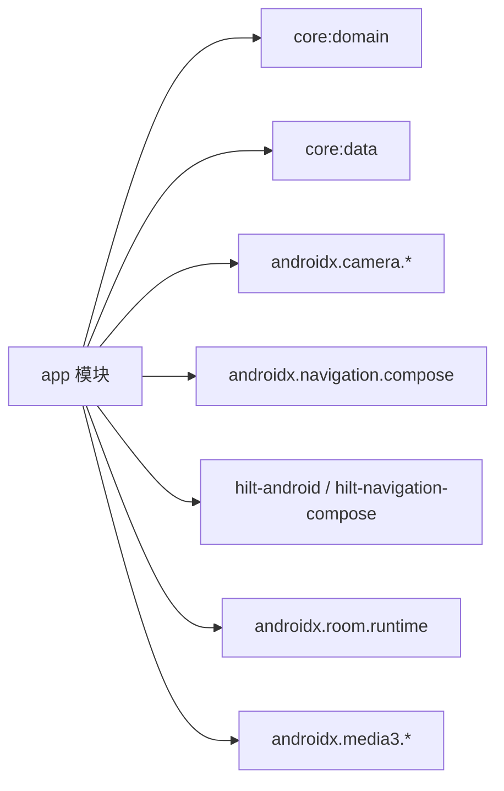
```mermaid
graph LR
APP["app 模块"] --> CORE_DOMAIN["core:domain"]
APP --> CORE_DATA["core:data"]
APP --> CAM["androidx.camera.*"]
APP --> NAV["androidx.navigation.compose"]
APP --> HILT["hilt-android / hilt-navigation-compose"]
APP --> ROOM["androidx.room.runtime"]
APP --> MEDIA3["androidx.media3.*"]
```

**图表来源**
- [build.gradle.kts:63-90](file://android/app/build.gradle.kts#L63-L90)
- [libs.versions.toml:23-54](file://android/gradle/libs.versions.toml#L23-L54)

**章节来源**
- [build.gradle.kts:63-90](file://android/app/build.gradle.kts#L63-L90)
- [libs.versions.toml:23-54](file://android/gradle/libs.versions.toml#L23-L54)

## 性能考虑
- **捕获模式**：使用最小延迟捕获模式，降低拍摄时延。
- **预览缩放**：采用填充中心的 ScaleType，保证全屏预览体验。
- **I/O 线程**：拍照/录制回调与后续加密/写盘在 IO 线程执行，避免阻塞 UI。
- **防重复点击**：捕获状态变量防止并发拍摄/录制导致的异常。
- **闪关模式**：根据开关动态设置，兼顾低光场景与能耗。
- **预览解码优化**：使用合适的采样率解码预览 Bitmap，平衡质量和性能。
- **内存管理**：及时释放临时文件和 Bitmap 资源，监控内存峰值使用。
- **自动相机重新绑定**：在应用前台时自动重新绑定相机，确保相机功能的稳定性。
- **诊断日志性能**：仅在调试模式下记录详细日志，避免影响生产环境性能。
- **视频录制优化**：使用 Recorder 和 QualitySelector 进行高效录制，支持质量降级策略。
- **录制状态管理**：及时清理录制对象和文件，避免内存泄漏。
- **设置面板性能**：可折叠设置面板减少不必要的布局计算，提升界面响应速度。
- **预览确认界面优化**：预览确认界面采用懒加载机制，避免不必要的资源消耗。
- **状态持久化优化**：使用 rememberSaveable 确保配置变更时状态正确恢复，提升应用性能。
- **缩略图生成优化**：VaultProgressiveImage 使用异步加载和缓存机制，提升缩略图显示性能。
- **设备方向检测优化**：OrientationEventListener 仅在设置面板显示时启用，减少不必要的 CPU 占用。
- **外部区域点击优化**：设置面板外部区域点击关闭功能使用高效的点击事件处理机制。
- **防重复点击优化**：ThrottledClick 使用 rememberUpdatedState 优化状态管理，减少不必要的重绘。
- **触觉反馈优化**：PressFeedback 使用 animateFloatAsState 和 rememberInfiniteTransition 优化动画性能。
- **直接媒体保存优化**：savePendingToVault 使用 withContext(Dispatchers.IO) 和 File.copyTo 提升保存性能。

**更新**：新增了设备方向检测系统、设置面板交互增强、状态持久化优化（rememberSaveable迁移）、缩略图生成系统优化、防重复点击机制、触觉反馈系统、直接媒体保存流程改进等性能考虑，以及视频录制相关的性能优化。新增的可折叠设置面板和预览确认界面也进行了性能优化，减少了不必要的布局计算和资源消耗。防重复点击机制和触觉反馈系统通过优化状态管理和动画性能进一步提升了用户体验。

**章节来源**
- [PrivateCameraScreen.kt:457-501](file://android/app/src/main/kotlin/com/xpx/vault/ui/PrivateCameraScreen.kt#L457-L501)
- [PrivateCameraScreen.kt:526-542](file://android/app/src/main/kotlin/com/xpx/vault/ui/PrivateCameraScreen.kt#L526-L542)
- [PrivateCameraScreen.kt:424-454](file://android/app/src/main/kotlin/com/xpx/vault/ui/PrivateCameraScreen.kt#L424-L454)
- [PrivateCameraScreen.kt:959-965](file://android/app/src/main/kotlin/com/xpx/vault/ui/PrivateCameraScreen.kt#L959-L965)
- [PrivateCameraScreen.kt:649-666](file://android/app/src/main/kotlin/com/xpx/vault/ui/PrivateCameraScreen.kt#L649-L666)
- [PrivateCameraScreen.kt:922-1014](file://android/app/src/main/kotlin/com/xpx/vault/ui/PrivateCameraScreen.kt#L922-L1014)
- [PrivateCameraScreen.kt:836-884](file://android/app/src/main/kotlin/com/xpx/vault/ui/PrivateCameraScreen.kt#L836-L884)
- [PrivateCameraScreen.kt:200-216](file://android/app/src/main/kotlin/com/xpx/vault/ui/PrivateCameraScreen.kt#L200-L216)
- [PrivateCameraScreen.kt:405-415](file://android/app/src/main/kotlin/com/xpx/vault/ui/PrivateCameraScreen.kt#L405-L415)
- [VaultProgressiveImage.kt:49-211](file://android/app/src/main/kotlin/com/xpx/vault/ui/components/VaultProgressiveImage.kt#L49-L211)
- [ThrottledClick.kt:18-53](file://android/app/src/main/kotlin/com/xpx/vault/ui/feedback/ThrottledClick.kt#L18-L53)
- [PressFeedback.kt:22-36](file://android/app/src/main/kotlin/com/xpx/vault/ui/feedback/PressFeedback.kt#L22-L36)
- [PrivateCameraScreen.kt:703-715](file://android/app/src/main/kotlin/com/xpx/vault/ui/PrivateCameraScreen.kt#L703-L715)

## 故障排查指南
- **无相机权限**：检查清单权限声明与运行时授权流程，确保 CAMERA 权限已授予。
- **拍照/录制失败**：检查 ImageCapture/VideoCapture 回调错误类型，定位硬件或资源占用问题。
- **无法预览**：确认 PreviewView 已正确注入 surfaceProvider，生命周期绑定是否生效。
- **加密异常**：核对密钥是否存在且未被系统清理，输入载荷长度是否满足要求。
- **元数据缺失**：确认 Room 表结构与索引是否存在，必要时重建数据库或迁移脚本。
- **定时拍摄异常**：检查定时器状态管理，确保倒计时逻辑正确执行。
- **缩放功能失效**：验证相机支持的缩放范围，确保缩放值在有效范围内。
- **曝光补偿问题**：确认相机支持曝光补偿功能，检查曝光范围获取是否成功。
- **自动重新绑定失败**：检查相机状态监听器是否正常工作，确认重试次数限制。
- **诊断日志问题**：确认 CAMERA_DIAG_TAG 日志标签是否正确配置，检查日志输出级别。
- **内存使用过高**：监控峰值内存使用，检查 Bitmap 解码和临时文件清理。
- **视频录制问题**：检查 VideoCapture 配置，确认 Recorder 和 QualitySelector 设置正确。
- **录制文件损坏**：检查录制事件回调，确认 Finalize 事件是否正常触发。
- **录制时长显示异常**：检查 recordingDurationMs 状态管理，确认计时器逻辑正确。
- **设置面板显示异常**：检查设置面板的状态管理，确认可折叠功能正常工作。
- **预览确认界面问题**：检查预览确认界面的状态管理，确认重拍和保存功能正常。
- **状态持久化问题**：检查 rememberSaveable 是否正确使用，确认配置变更时状态恢复。
- **缩略图加载失败**：检查 VaultProgressiveImage 组件，确认异步加载和缓存机制正常。
- **设备方向检测异常**：检查 OrientationEventListener 是否正确启用和禁用，确认方向检测逻辑。
- **外部区域点击关闭失效**：检查设置面板外部区域点击事件处理，确认点击区域和状态更新正常。
- **防重复点击失效**：检查 ThrottledClick 机制，确认 rememberUpdatedState 和间隔控制正常。
- **触觉反馈异常**：检查 PressFeedback 组件，确认动画状态和视觉反馈正常。
- **直接媒体保存失败**：检查 savePendingToVault 流程，确认临时文件处理和直接保存机制正常。

**更新**：新增了设备方向检测系统、设置面板交互增强、状态持久化优化（rememberSaveable迁移）、缩略图生成系统、防重复点击机制、触觉反馈系统、直接媒体保存流程改进等新功能的故障排查指导，以及视频录制相关的故障排查。新增的设备方向检测异常、外部区域点击关闭失效、防重复点击失效、触觉反馈异常、直接媒体保存失败等故障排查指导。

**章节来源**
- [AndroidManifest.xml:3-6](file://android/app/src/main/AndroidManifest.xml#L3-L6)
- [PrivateCameraScreen.kt:544-562](file://android/app/src/main/kotlin/com/xpx/vault/ui/PrivateCameraScreen.kt#L544-L562)
- [PrivateCameraScreen.kt:951-957](file://android/app/src/main/kotlin/com/xpx/vault/ui/PrivateCameraScreen.kt#L951-L957)
- [AesCbcEngine.kt:25-40](file://android/core/data/src/main/kotlin/com/xpx/vault/data/crypto/AesCbcEngine.kt#L25-L40)
- [PhotoAssetEntity.kt:9-33](file://android/core/data/src/main/kotlin/com/xpx/vault/data/db/entity/PhotoAssetEntity.kt#L9-L33)
- [PrivateCameraScreen.kt:922-1014](file://android/app/src/main/kotlin/com/xpx/vault/ui/PrivateCameraScreen.kt#L922-L1014)
- [PrivateCameraScreen.kt:836-884](file://android/app/src/main/kotlin/com/xpx/vault/ui/PrivateCameraScreen.kt#L836-L884)
- [PrivateCameraScreen.kt:200-216](file://android/app/src/main/kotlin/com/xpx/vault/ui/PrivateCameraScreen.kt#L200-L216)
- [PrivateCameraScreen.kt:405-415](file://android/app/src/main/kotlin/com/xpx/vault/ui/PrivateCameraScreen.kt#L405-L415)
- [VaultProgressiveImage.kt:49-211](file://android/app/src/main/kotlin/com/xpx/vault/ui/components/VaultProgressiveImage.kt#L49-L211)
- [ThrottledClick.kt:18-53](file://android/app/src/main/kotlin/com/xpx/vault/ui/feedback/ThrottledClick.kt#L18-L53)
- [PressFeedback.kt:22-36](file://android/app/src/main/kotlin/com/xpx/vault/ui/feedback/PressFeedback.kt#L22-L36)
- [PrivateCameraScreen.kt:703-715](file://android/app/src/main/kotlin/com/xpx/vault/ui/PrivateCameraScreen.kt#L703-L715)

## 结论
私密拍照通过 PrivateCameraScreen 提供了专业级的相机体验，结合 CameraX 的稳定预览与拍摄能力、VaultStore 的直拍直存策略与 AesCbcEngine 的实时加密，实现了"不写入系统相册、密文落地、可选元数据索引"的完整闭环。新增的设备方向检测系统、设置面板交互增强、自动相机重新绑定、错误分类系统、ZoomRail连续滑块、自动曝光重置、诊断日志等重大增强功能进一步提升了系统的稳定性、易用性和可维护性。

**更新**：通过 PrivateCameraScreen 的引入，私密拍照功能从简单的占位页面升级为专业级摄影应用，提供了完整的摄影工具链和优秀的用户体验。新增的设备方向检测系统确保了图像方向的正确性，设置面板交互增强提升了用户操作的便捷性，自动相机重新绑定、错误分类系统、ZoomRail连续滑块、自动曝光重置、诊断日志等重大增强功能显著提升了系统的稳定性和用户体验。更重要的是，新增的完整视频录制能力包括 CameraX VideoCapture API、MP4录制、实时录制指示器和动态模式切换机制，使应用具备了完整的拍照和录像双重能力。新增的可折叠设置面板提供了更简洁的界面布局，支持更多的相机参数配置。预览确认界面提供了更好的用户体验，支持重拍和保存操作。状态持久化优化（rememberSaveable迁移）确保了配置变更时的状态正确恢复。缩略图生成系统集成了专业的异步加载和渐进式显示功能，提升了整体性能和用户体验。防重复点击机制和触觉反馈系统进一步优化了用户体验，防止误操作并提供更好的视觉反馈。直接媒体保存流程改进提升了性能和可靠性，减少了中间临时文件的处理开销。这些功能通过精细的错误处理、性能监控和用户体验优化，既满足隐私保护需求，又为后续相册浏览与检索提供基础。

## 附录
- **快速定位实现路径**
  - 专业级相机界面与拍照：[PrivateCameraScreen.kt:142-561](file://android/app/src/main/kotlin/com/xpx/vault/ui/PrivateCameraScreen.kt#L142-L561)
  - 设备方向检测系统：[PrivateCameraScreen.kt:200-216](file://android/app/src/main/kotlin/com/xpx/vault/ui/PrivateCameraScreen.kt#L200-L216)
  - 设置面板交互增强：[PrivateCameraScreen.kt:405-415](file://android/app/src/main/kotlin/com/xpx/vault/ui/PrivateCameraScreen.kt#L405-L415)
  - 可折叠设置面板：[PrivateCameraScreen.kt:922-1014](file://android/app/src/main/kotlin/com/xpx/vault/ui/PrivateCameraScreen.kt#L922-L1014)
  - 预览确认界面：[PrivateCameraScreen.kt:836-884](file://android/app/src/main/kotlin/com/xpx/vault/ui/PrivateCameraScreen.kt#L836-L884)
  - 缩略图生成系统：[VaultProgressiveImage.kt:49-211](file://android/app/src/main/kotlin/com/xpx/vault/ui/components/VaultProgressiveImage.kt#L49-L211)
  - 视频录制功能：[PrivateCameraScreen.kt:624-669](file://android/app/src/main/kotlin/com/xpx/vault/ui/PrivateCameraScreen.kt#L624-L669)
  - 动态模式切换：[PrivateCameraScreen.kt:489-494](file://android/app/src/main/kotlin/com/xpx/vault/ui/PrivateCameraScreen.kt#L489-L494)
  - 实时录制指示器：[PrivateCameraScreen.kt:555-561](file://android/app/src/main/kotlin/com/xpx/vault/ui/PrivateCameraScreen.kt#L555-L561)
  - 视频播放器：[VideoPlayerScreen.kt:67-200](file://android/app/src/main/kotlin/com/xpx/vault/ui/VideoPlayerScreen.kt#L67-L200)
  - 自动相机重新绑定：[PrivateCameraScreen.kt:170-215](file://android/app/src/main/kotlin/com/xpx/vault/ui/PrivateCameraScreen.kt#L170-L215)
  - 错误分类系统：[PrivateCameraScreen.kt:95-101](file://android/app/src/main/kotlin/com/xpx/vault/ui/PrivateCameraScreen.kt#L95-L101)
  - ZoomRail 连续滑块：[PrivateCameraScreen.kt:780-815](file://android/app/src/main/kotlin/com/xpx/vault/ui/PrivateCameraScreen.kt#L780-L815)
  - 自动曝光重置：[PrivateCameraScreen.kt:530-537](file://android/app/src/main/kotlin/com/xpx/vault/ui/PrivateCameraScreen.kt#L530-L537)
  - 诊断日志系统：[PrivateCameraScreen.kt:1085](file://android/app/src/main/kotlin/com/xpx/vault/ui/PrivateCameraScreen.kt#L1085)
  - 拍照回调与直拍直存：[PrivateCameraScreen.kt:503-562](file://android/app/src/main/kotlin/com/xpx/vault/ui/PrivateCameraScreen.kt#L503-L562)
  - 保险库文件预留：[VaultStore.kt:158-168](file://android/app/src/main/kotlin/com/xpx/vault/ui/vault/VaultStore.kt#L158-L168)
  - 加密引擎与密钥：[AesCbcEngine.kt:12-40](file://android/core/data/src/main/kotlin/com/xpx/vault/data/crypto/AesCbcEngine.kt#L12-L40)、[KeystoreSecretKeyProvider.kt:12-42](file://android/core/data/src/main/kotlin/com/xpx/vault/data/crypto/KeystoreSecretKeyProvider.kt#L12-L42)
  - 元数据模型与索引：[PhotoAssetEntity.kt:9-33](file://android/core/data/src/main/kotlin/com/xpx/vault/data/db/entity/PhotoAssetEntity.kt#L9-L33)
  - 权限与导航：[AndroidManifest.xml:3-6](file://android/app/src/main/AndroidManifest.xml#L3-L6)、[MainActivity.kt:25-295](file://android/app/src/main/kotlin/com/xpx/vault/MainActivity.kt#L25-L295)
  - 字符串资源：[strings.xml:70-82](file://android/app/src/main/res/values/strings.xml#L70-L82)
  - 技术方案要点：[04-私密拍照.md:9-28](file://doc/android/04-私密拍照.md#L9-L28)
  - 防重复点击机制：[ThrottledClick.kt:18-53](file://android/app/src/main/kotlin/com/xpx/vault/ui/feedback/ThrottledClick.kt#L18-L53)
  - 触觉反馈系统：[PressFeedback.kt:22-36](file://android/app/src/main/kotlin/com/xpx/vault/ui/feedback/PressFeedback.kt#L22-L36)
  - 直接媒体保存流程：[PrivateCameraScreen.kt:703-715](file://android/app/src/main/kotlin/com/xpx/vault/ui/PrivateCameraScreen.kt#L703-L715)