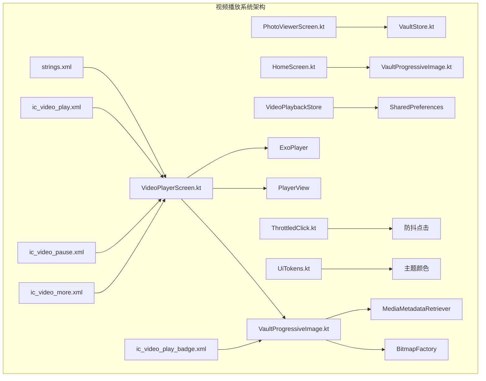
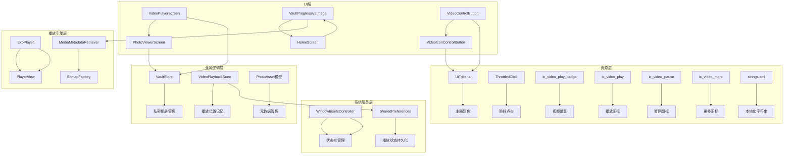
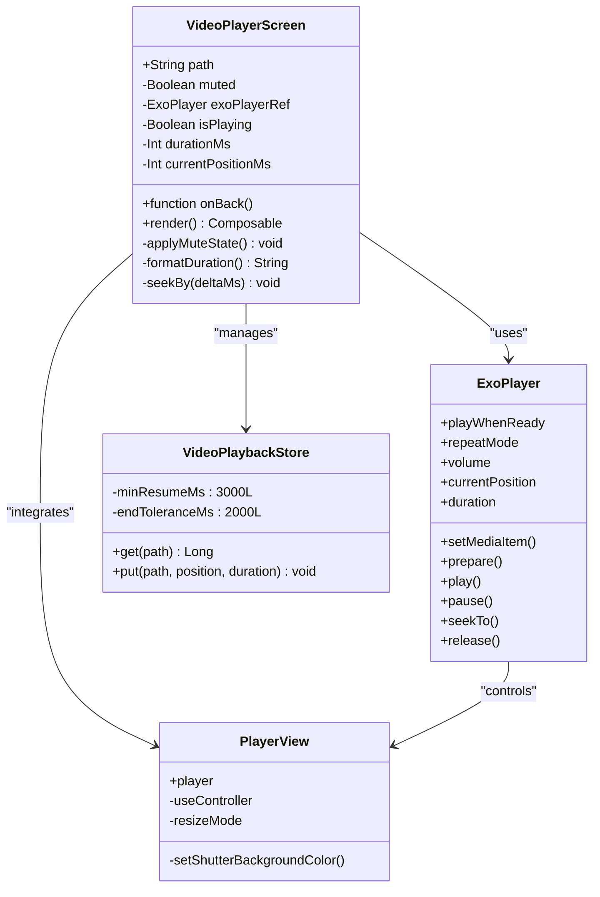
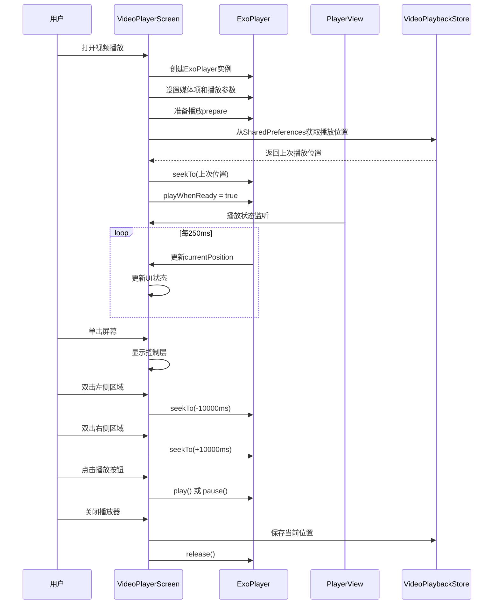
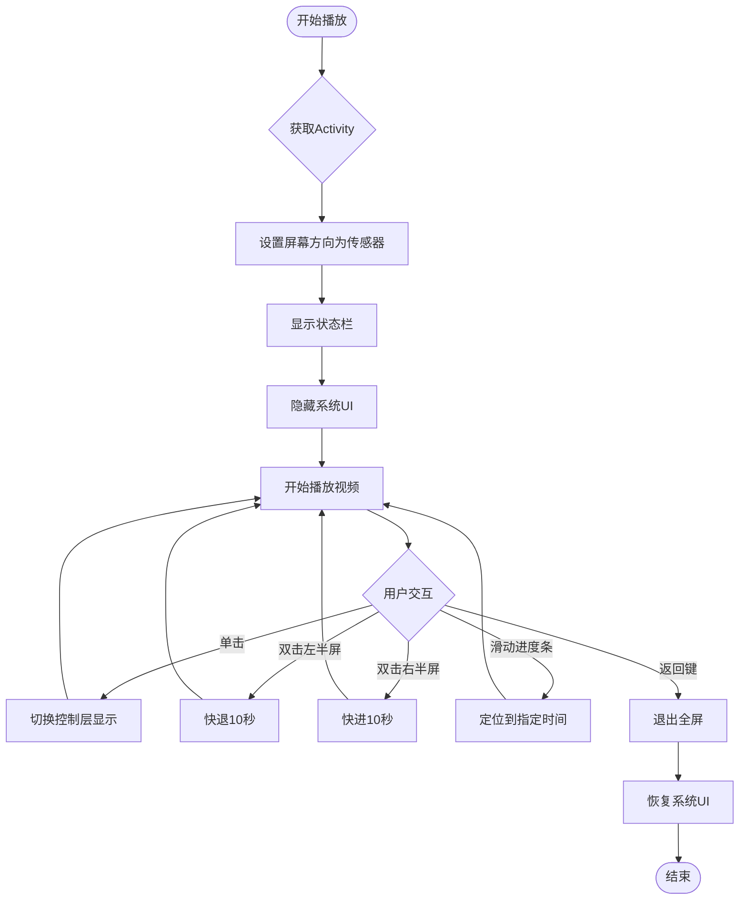
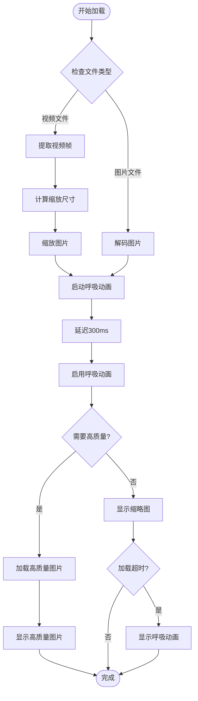
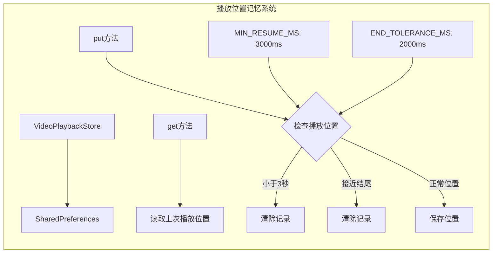
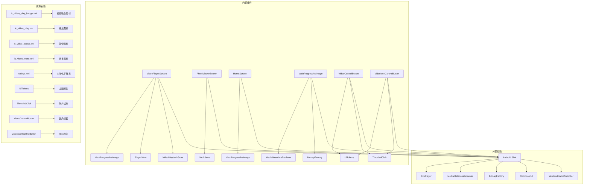

# 视频播放系统

<cite>
**本文档引用的文件**
- [VideoPlayerScreen.kt](file://android/app/src/main/kotlin/com/photovault/app/ui/VideoPlayerScreen.kt)
- [PhotoViewerScreen.kt](file://android/app/src/main/kotlin/com/photovault/app/ui/PhotoViewerScreen.kt)
- [VaultProgressiveImage.kt](file://android/app/src/main/kotlin/com/photovault/app/ui/components/VaultProgressiveImage.kt)
- [VaultStore.kt](file://android/app/src/main/kotlin/com/photovault/app/ui/vault/VaultStore.kt)
- [ic_video_play_badge.xml](file://android/app/src/main/res/drawable/ic_video_play_badge.xml)
- [ic_video_pause.xml](file://android/app/src/main/res/drawable/ic_video_pause.xml)
- [ic_video_play.xml](file://android/app/src/main/res/drawable/ic_video_play.xml)
- [ic_video_more.xml](file://android/app/src/main/res/drawable/ic_video_more.xml)
- [strings.xml](file://android/app/src/main/res/values/strings.xml)
- [HomeScreen.kt](file://android/app/src/main/kotlin/com/photovault/app/ui/HomeScreen.kt)
- [UiTokens.kt](file://android/app/src/main/kotlin/com/photovault/app/ui/theme/UiTokens.kt)
- [ThrottledClick.kt](file://android/app/src/main/kotlin/com/photovault/app/ui/feedback/ThrottledClick.kt)
</cite>

## 更新摘要
**变更内容**
- 视频播放系统从VideoView升级到ExoPlayer，提供更精简的控制层
- 新增手势支持：单击显示控制层、双击左右区域快退/快进10秒
- 实现沉浸式播放体验：全屏播放、自动显示状态栏
- 增强用户交互功能：滑动进度条、音量控制、重新播放
- 优化播放状态管理：自动续播、播放位置记忆
- 改进UI设计：圆角控制面板、渐变背景、呼吸动画
- 新增视频控制资源：播放、暂停、更多菜单图标
- 增强视频封面显示：视频徽章和时长标签

## 目录
1. [简介](#简介)
2. [项目结构](#项目结构)
3. [核心组件](#核心组件)
4. [架构概览](#架构概览)
5. [详细组件分析](#详细组件分析)
6. [依赖关系分析](#依赖关系分析)
7. [性能考虑](#性能考虑)
8. [故障排除指南](#故障排除指南)
9. [结论](#结论)

## 简介

视频播放系统是私密相册应用中的核心功能模块，经过重大升级后提供了更加现代化和用户友好的视频播放体验。系统基于Android平台构建，采用现代的Compose UI框架和ExoPlayer播放引擎，集成了沉浸式播放体验、手势控制和智能状态管理。

**主要改进特性：**
- 基于ExoPlayer的现代化播放引擎
- 支持多种视频格式（MP4、M4V、MOV、3GP、WebM、MKV）
- 沉浸式全屏播放体验
- 手势控制：单击显示控制层、双击快退/快进10秒
- 自动静音播放和手动音量控制
- 滑动进度条拖拽定位
- 播放位置记忆和自动续播
- 渐进式图片加载和视频封面提取
- 与私密相册系统的无缝集成
- 新增视频控制资源和UI优化

## 项目结构

视频播放系统位于Android应用的UI层，采用模块化设计和现代化架构：



**图表来源**
- [VideoPlayerScreen.kt:1-400](file://android/app/src/main/kotlin/com/photovault/app/ui/VideoPlayerScreen.kt#L1-L400)
- [VaultProgressiveImage.kt:1-281](file://android/app/src/main/kotlin/com/photovault/app/ui/components/VaultProgressiveImage.kt#L1-L281)

**章节来源**
- [VideoPlayerScreen.kt:1-400](file://android/app/src/main/kotlin/com/photovault/app/ui/VideoPlayerScreen.kt#L1-L400)
- [PhotoViewerScreen.kt:1-145](file://android/app/src/main/kotlin/com/photovault/app/ui/PhotoViewerScreen.kt#L1-L145)
- [VaultProgressiveImage.kt:1-281](file://android/app/src/main/kotlin/com/photovault/app/ui/components/VaultProgressiveImage.kt#L1-L281)

## 核心组件

### 视频播放屏幕 (VideoPlayerScreen)

**重大更新**：从VideoView升级到ExoPlayer，提供更精简的控制层和沉浸式体验

视频播放屏幕是视频播放系统的核心界面组件，经过全面重构后提供了现代化的视频播放控制功能：

**主要功能特性：**
- 基于ExoPlayer的现代化播放引擎
- 沉浸式全屏播放体验（自动显示状态栏）
- 手势控制：单击显示控制层、双击左右区域快退/快进10秒
- 自动静音播放（默认静音，支持手动取消静音）
- 循环播放模式（单曲循环）
- 实时进度跟踪和显示
- 滑动进度条拖拽定位
- 播放/暂停控制
- 重新播放功能
- 播放位置记忆和自动续播
- 新增视频控制按钮和更多选项

**技术实现要点：**
- 使用PlayerView集成ExoPlayer
- 协程定时更新播放状态（250ms间隔）
- DisposableEffect管理生命周期
- 状态管理确保UI一致性
- 主题颜色系统集成（UiColors）
- 新增VideoControlButton和VideoIconControlButton组件

**章节来源**
- [VideoPlayerScreen.kt:59-313](file://android/app/src/main/kotlin/com/photovault/app/ui/VideoPlayerScreen.kt#L59-L313)

### 图片查看器 (PhotoViewerScreen)

**更新**：增强了视频路径检测和手势支持

图片查看器组件支持图片和视频的统一浏览体验，特别针对视频播放进行了优化：

**核心功能：**
- 左右滑动手势切换（支持视频和图片）
- 最近5000个项目浏览
- 智能视频路径检测
- 高质量图片加载
- 与视频播放系统的无缝集成

**章节来源**
- [PhotoViewerScreen.kt:36-144](file://android/app/src/main/kotlin/com/photovault/app/ui/PhotoViewerScreen.kt#L36-L144)

### 渐进式图片组件 (VaultProgressiveImage)

**更新**：增强了视频支持和视觉效果

渐进式图片组件提供了智能的图片加载策略，特别增强了对视频的支持：

**主要特性：**
- 缓慢呼吸动画占位符（300ms延迟启用）
- 视频封面自动提取和缩放
- 可调节的缩放质量
- 视频时长显示（格式化显示）
- 占位符视觉反馈（渐变背景）
- 圆角设计和阴影效果
- 视频徽章显示和时长标签

**章节来源**
- [VaultProgressiveImage.kt:49-281](file://android/app/src/main/kotlin/com/photovault/app/ui/components/VaultProgressiveImage.kt#L49-L281)

## 架构概览

**更新**：采用ExoPlayer和现代化Compose架构设计

视频播放系统采用分层架构设计，经过现代化改造后确保了更好的模块分离和可维护性：



**图表来源**
- [VideoPlayerScreen.kt:1-400](file://android/app/src/main/kotlin/com/photovault/app/ui/VideoPlayerScreen.kt#L1-L400)
- [VaultStore.kt:1-243](file://android/app/src/main/kotlin/com/photovault/app/ui/vault/VaultStore.kt#L1-L243)
- [VaultProgressiveImage.kt:1-281](file://android/app/src/main/kotlin/com/photovault/app/ui/components/VaultProgressiveImage.kt#L1-L281)

## 详细组件分析

### ExoPlayer视频播放器

**重大更新**：从VideoView升级到ExoPlayer，提供更强大的播放功能

视频播放器组件实现了完整的视频播放功能，采用了现代化的Android开发实践和ExoPlayer播放引擎：



**图表来源**
- [VideoPlayerScreen.kt:59-313](file://android/app/src/main/kotlin/com/photovault/app/ui/VideoPlayerScreen.kt#L59-L313)

**组件工作流程：**



**图表来源**
- [VideoPlayerScreen.kt:104-161](file://android/app/src/main/kotlin/com/photovault/app/ui/VideoPlayerScreen.kt#L104-L161)

**章节来源**
- [VideoPlayerScreen.kt:59-313](file://android/app/src/main/kotlin/com/photovault/app/ui/VideoPlayerScreen.kt#L59-L313)

### 沉浸式播放体验

**新增功能**：全屏播放和状态栏管理

系统实现了真正的沉浸式播放体验，提供无干扰的观看环境：



**图表来源**
- [VideoPlayerScreen.kt:124-135](file://android/app/src/main/kotlin/com/photovault/app/ui/VideoPlayerScreen.kt#L124-L135)

**章节来源**
- [VideoPlayerScreen.kt:124-135](file://android/app/src/main/kotlin/com/photovault/app/ui/VideoPlayerScreen.kt#L124-L135)

### 渐进式图片加载机制

**更新**：增强了视频支持和视觉效果

渐进式图片组件实现了智能的图片加载策略，特别针对视频播放进行了优化：



**图表来源**
- [VaultProgressiveImage.kt:66-92](file://android/app/src/main/kotlin/com/photovault/app/ui/components/VaultProgressiveImage.kt#L66-L92)

**章节来源**
- [VaultProgressiveImage.kt:49-281](file://android/app/src/main/kotlin/com/photovault/app/ui/components/VaultProgressiveImage.kt#L49-L281)

### 播放位置记忆系统

**新增功能**：VideoPlaybackStore类提供智能播放位置管理

系统实现了智能的播放位置记忆功能，确保用户可以从中断的地方继续观看：



**图表来源**
- [VideoPlayerScreen.kt:315-335](file://android/app/src/main/kotlin/com/photovault/app/ui/VideoPlayerScreen.kt#L315-L335)

**章节来源**
- [VideoPlayerScreen.kt:315-335](file://android/app/src/main/kotlin/com/photovault/app/ui/VideoPlayerScreen.kt#L315-L335)

### 视频控制按钮组件

**新增功能**：VideoControlButton和VideoIconControlButton组件

系统新增了专门的视频控制按钮组件，提供统一的交互体验：

```mermaid
flowchart TD
A[VideoControlButton] --> B[文本按钮]
C[VideoIconControlButton] --> D[图标按钮]
E[主题颜色] --> F[UiColors.Button]
G[防抖机制] --> H[ThrottledClick]
I[圆角设计] --> J[RoundedCornerShape(999dp)]
K[透明度控制] --> L[alpha值]
M[尺寸规范] --> N[height: 36dp]
```

**图表来源**
- [VideoPlayerScreen.kt:350-399](file://android/app/src/main/kotlin/com/photovault/app/ui/VideoPlayerScreen.kt#L350-L399)

**章节来源**
- [VideoPlayerScreen.kt:350-399](file://android/app/src/main/kotlin/com/photovault/app/ui/VideoPlayerScreen.kt#L350-L399)

## 依赖关系分析

**更新**：引入ExoPlayer和现代化依赖管理

视频播放系统各组件之间的依赖关系经过现代化改造：



**图表来源**
- [VideoPlayerScreen.kt:1-56](file://android/app/src/main/kotlin/com/photovault/app/ui/VideoPlayerScreen.kt#L1-L56)
- [VaultProgressiveImage.kt:1-47](file://android/app/src/main/kotlin/com/photovault/app/ui/components/VaultProgressiveImage.kt#L1-L47)

**依赖关系特点：**
- 组件间耦合度低，职责单一
- 外部依赖集中在现代Android API层面
- 内部组件通过明确的接口交互
- 资源文件独立管理，便于维护
- 引入ExoPlayer提供更强大的播放功能
- 新增视频控制资源丰富UI元素

**章节来源**
- [VideoPlayerScreen.kt:1-56](file://android/app/src/main/kotlin/com/photovault/app/ui/VideoPlayerScreen.kt#L1-L56)
- [VaultProgressiveImage.kt:1-47](file://android/app/src/main/kotlin/com/photovault/app/ui/components/VaultProgressiveImage.kt#L1-L47)

## 性能考虑

**更新**：针对ExoPlayer和手势控制的性能优化

视频播放系统在性能优化方面采用了多项现代化策略：

### 内存管理
- 使用协程异步处理视频元数据提取
- 智能缩放避免内存溢出
- 及时释放MediaMetadataRetriever资源
- ExoPlayer生命周期管理确保资源正确释放

### UI响应性
- 250ms间隔更新播放状态，平衡流畅度和性能
- 使用LaunchedEffect避免不必要的重组
- DisposableEffect确保资源正确释放
- 手势控制使用防抖机制（500ms间隔）
- 新增视频控制按钮使用throttledClickable优化性能

### 缓存策略
- 缩略图和高质量图片分别缓存
- 视频封面提取结果缓存
- 播放位置记忆缓存
- 私密相册浏览历史缓存

### 沉浸式体验优化
- 状态栏显示管理减少UI闪烁
- 全屏模式下的资源优化
- 手势识别的性能优化
- 视频徽章和时长标签的渲染优化

## 故障排除指南

### 常见问题及解决方案

**视频无法播放**
1. 检查视频文件完整性
2. 确认文件格式受支持（MP4、M4V、MOV、3GP、WebM、MKV）
3. 验证文件路径有效性
4. 检查ExoPlayer初始化是否成功
5. 确认媒体权限和存储访问权限

**播放器无响应**
1. 检查ExoPlayer生命周期管理
2. 确认PlayerView引用有效
3. 验证音频权限状态
4. 检查播放位置记忆功能
5. 验证SharedPreferences访问权限

**手势控制失效**
1. 检查pointerInput配置
2. 确认手势识别区域设置
3. 验证防抖机制是否正常工作
4. 检查屏幕方向和布局约束

**内存问题**
1. 监控Bitmap内存使用
2. 及时回收大图片资源
3. 检查ExoPlayer资源释放
4. 监控播放位置存储
5. 验证视频帧提取的内存管理

**UI显示问题**
1. 检查主题颜色配置
2. 确认圆角形状和透明度设置
3. 验证渐变背景渲染
4. 检查视频徽章和时长标签显示

**章节来源**
- [VideoPlayerScreen.kt:104-122](file://android/app/src/main/kotlin/com/photovault/app/ui/VideoPlayerScreen.kt#L104-L122)
- [VaultProgressiveImage.kt:236-253](file://android/app/src/main/kotlin/com/photovault/app/ui/components/VaultProgressiveImage.kt#L236-L253)

## 结论

视频播放系统经过重大升级后，展现了现代Android应用开发的最佳实践，通过合理的架构设计和优化的实现策略，提供了更加稳定可靠和用户友好的视频播放体验。

**主要改进优势：**
1. **现代化播放引擎** - 从VideoView升级到ExoPlayer，提供更强大的播放功能
2. **沉浸式体验** - 全屏播放和状态栏管理，提供无干扰观看环境
3. **手势控制** - 单击显示控制层、双击快退/快进10秒等直观操作
4. **智能状态管理** - 播放位置记忆和自动续播功能
5. **性能优化** - ExoPlayer和现代化架构带来的性能提升
6. **用户体验** - 渐进式加载、呼吸动画和圆角设计
7. **模块化设计** - 清晰的组件分离和职责划分
8. **可维护性** - 现代化依赖管理和代码组织
9. **丰富的UI资源** - 新增视频控制图标和徽章设计
10. **统一的交互模式** - VideoControlButton和VideoIconControlButton组件

该系统为私密相册应用提供了坚实的技术基础，能够满足用户对高质量视频播放的需求，同时保持了应用的整体性能和稳定性。经过这次重大改进，视频播放系统不仅在功能上更加完善，在用户体验和技术架构上也达到了新的高度。

**新增的视频控制资源包括：**
- ic_video_play.xml：播放图标，用于播放/暂停按钮
- ic_video_pause.xml：暂停图标，用于暂停状态显示
- ic_video_more.xml：更多选项图标，用于展开额外控制
- ic_video_play_badge.xml：视频徽章，用于视频封面标识

这些资源与现有的UI组件和主题系统完美集成，为用户提供了更加直观和一致的操作体验。