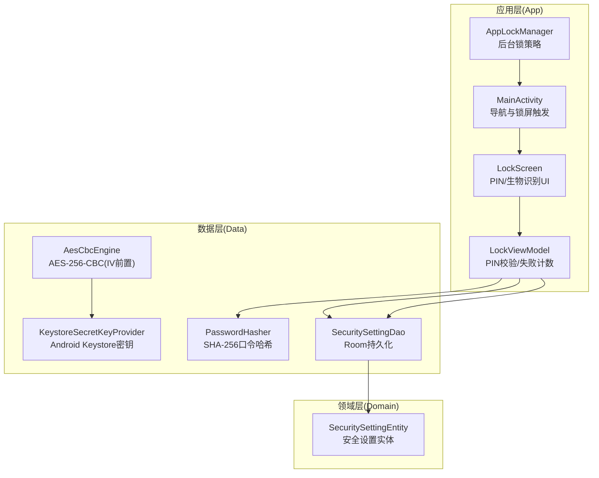
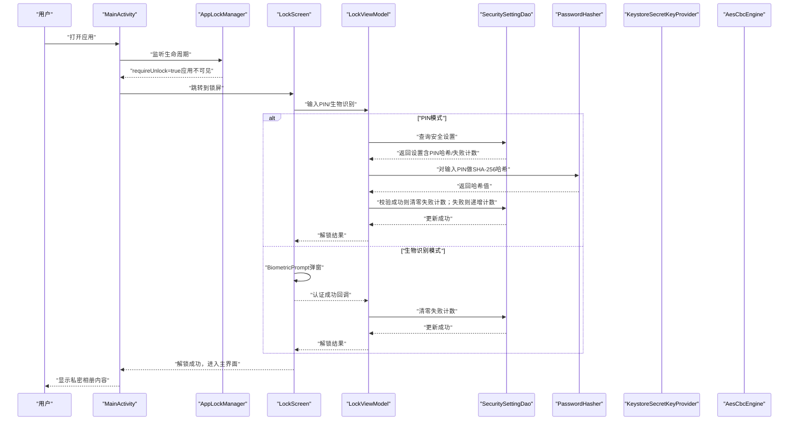
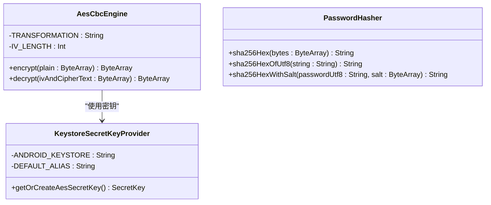
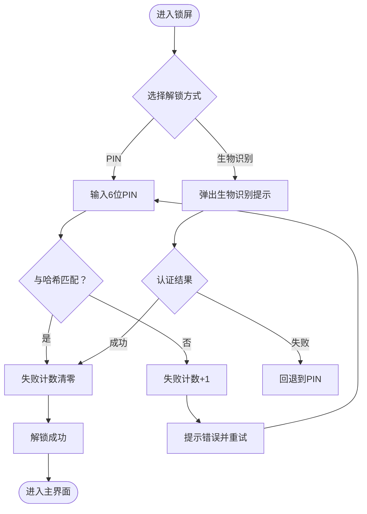
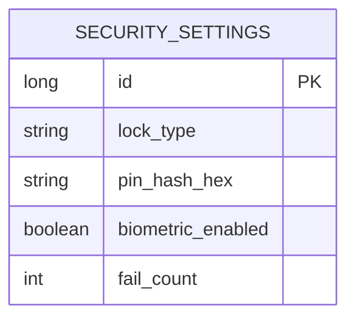
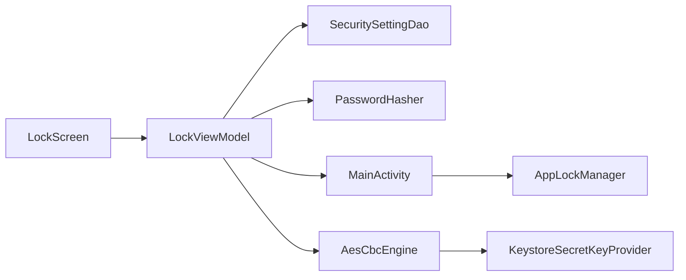

# 隐私与安全

<cite>
**本文引用的文件**
- [AesCbcEngine.kt](file://android/core/data/src/main/kotlin/com/photovault/data/crypto/AesCbcEngine.kt)
- [KeystoreSecretKeyProvider.kt](file://android/core/data/src/main/kotlin/com/photovault/data/crypto/KeystoreSecretKeyProvider.kt)
- [PasswordHasher.kt](file://android/core/data/src/main/kotlin/com/photovault/data/crypto/PasswordHasher.kt)
- [LockScreen.kt](file://android/app/src/main/kotlin/com/photovault/app/ui/lock/LockScreen.kt)
- [LockViewModel.kt](file://android/app/src/main/kotlin/com/photovault/app/ui/lock/LockViewModel.kt)
- [AppLockManager.kt](file://android/app/src/main/kotlin/com/photovault/app/AppLockManager.kt)
- [MainActivity.kt](file://android/app/src/main/kotlin/com/photovault/app/MainActivity.kt)
- [SecuritySettingEntity.kt](file://android/core/data/src/main/kotlin/com/photovault/data/db/entity/SecuritySettingEntity.kt)
- [SecuritySettingDao.kt](file://android/core/data/src/main/kotlin/com/photovault/data/db/dao/SecuritySettingDao.kt)
- [03-解锁与安全模块.md](file://doc/android/03-解锁与安全模块.md)
- [私密相册 App（一期）原生双端架构设计方案.md](file://spec/私密相册 App（一期）原生双端架构设计方案.md)
- [AesCbcEngineTest.kt](file://android/core/data/src/test/kotlin/com/photovault/data/crypto/AesCbcEngineTest.kt)
- [PasswordHasherTest.kt](file://android/core/data/src/test/kotlin/com/photovault/data/crypto/PasswordHasherTest.kt)
- [AndroidManifest.xml](file://android/app/src/main/AndroidManifest.xml)
</cite>

## 目录
1. [简介](#简介)
2. [项目结构](#项目结构)
3. [核心组件](#核心组件)
4. [架构总览](#架构总览)
5. [详细组件分析](#详细组件分析)
6. [依赖分析](#依赖分析)
7. [性能考虑](#性能考虑)
8. [故障排查指南](#故障排查指南)
9. [结论](#结论)
10. [附录](#附录)

## 简介
本文件面向“AI照片保险库”项目，系统化阐述其隐私与安全设计与实现，重点包括：
- 隐私原则：本地离线处理、不上传云端、数据加密存储、最小化采集与透明策略
- 加密实现：AES-256-CBC（含IV前置）与Android Keystore密钥托管
- 认证与访问控制：PIN码解锁、生物识别认证（指纹/面容）、后台自动上锁
- 数据完整性与文件安全：口令哈希、失败计数、安全存储位置
- 合规与最佳实践：不接入第三方监控SDK、权限最小化、用户知情同意
- 用户操作指南与安全使用建议：如何正确设置PIN、启用生物识别、应对异常场景

## 项目结构
围绕隐私与安全的关键代码分布在三层：
- 应用层（App）：锁屏界面、锁屏状态机、主界面导航与后台锁策略
- 领域层（Domain）：认证策略与安全设置实体
- 数据层（Data）：加密引擎、密钥提供器、口令哈希、安全设置持久化

图表来源
- [MainActivity.kt:1-265](file://android/app/src/main/kotlin/com/photovault/app/MainActivity.kt#L1-L265)
- [LockScreen.kt:1-414](file://android/app/src/main/kotlin/com/photovault/app/ui/lock/LockScreen.kt#L1-L414)
- [LockViewModel.kt:1-222](file://android/app/src/main/kotlin/com/photovault/app/ui/lock/LockViewModel.kt#L1-L222)
- [AppLockManager.kt:1-49](file://android/app/src/main/kotlin/com/photovault/app/AppLockManager.kt#L1-L49)
- [SecuritySettingEntity.kt:1-19](file://android/core/data/src/main/kotlin/com/photovault/data/db/entity/SecuritySettingEntity.kt#L1-L19)
- [SecuritySettingDao.kt:1-17](file://android/core/data/src/main/kotlin/com/photovault/data/db/dao/SecuritySettingDao.kt#L1-L17)
- [AesCbcEngine.kt:1-40](file://android/core/data/src/main/kotlin/com/photovault/data/crypto/AesCbcEngine.kt#L1-L40)
- [KeystoreSecretKeyProvider.kt:1-42](file://android/core/data/src/main/kotlin/com/photovault/data/crypto/KeystoreSecretKeyProvider.kt#L1-L42)
- [PasswordHasher.kt:1-26](file://android/core/data/src/main/kotlin/com/photovault/data/crypto/PasswordHasher.kt#L1-L26)

章节来源
- [私密相册 App（一期）原生双端架构设计方案.md:1-194](file://spec/私密相册 App（一期）原生双端架构设计方案.md#L1-L194)
- [03-解锁与安全模块.md:1-36](file://doc/android/03-解锁与安全模块.md#L1-L36)

## 核心组件
- 加密引擎与密钥管理
  - AES-256-CBC（PKCS5Padding等价于PKCS7），IV前置16字节，密钥由Android Keystore托管，私钥材料不可导出
  - 口令哈希：SHA-256，口令不落盘，仅存储哈希
- 认证与访问控制
  - PIN码：6位数字，输入完成后进行二次确认，失败次数计数，连续错误有临时锁定提示
  - 生物识别：指纹/面容/设备凭证，自动弹窗提示，失败回退到PIN
  - 后台锁：应用不可见时自动上锁，防止后台窥视
- 数据持久化与完整性
  - 安全设置实体包含锁类型、PIN哈希、是否启用生物识别、失败计数
  - Room DAO负责唯一记录的读取与更新，失败计数清零与累加由视图模型控制

章节来源
- [AesCbcEngine.kt:1-40](file://android/core/data/src/main/kotlin/com/photovault/data/crypto/AesCbcEngine.kt#L1-L40)
- [KeystoreSecretKeyProvider.kt:1-42](file://android/core/data/src/main/kotlin/com/photovault/data/crypto/KeystoreSecretKeyProvider.kt#L1-L42)
- [PasswordHasher.kt:1-26](file://android/core/data/src/main/kotlin/com/photovault/data/crypto/PasswordHasher.kt#L1-L26)
- [LockScreen.kt:1-414](file://android/app/src/main/kotlin/com/photovault/app/ui/lock/LockScreen.kt#L1-L414)
- [LockViewModel.kt:1-222](file://android/app/src/main/kotlin/com/photovault/app/ui/lock/LockViewModel.kt#L1-L222)
- [AppLockManager.kt:1-49](file://android/app/src/main/kotlin/com/photovault/app/AppLockManager.kt#L1-L49)
- [SecuritySettingEntity.kt:1-19](file://android/core/data/src/main/kotlin/com/photovault/data/db/entity/SecuritySettingEntity.kt#L1-L19)
- [SecuritySettingDao.kt:1-17](file://android/core/data/src/main/kotlin/com/photovault/data/db/dao/SecuritySettingDao.kt#L1-L17)

## 架构总览
下图展示从用户交互到安全策略与数据持久化的整体流程。

图表来源
- [MainActivity.kt:1-265](file://android/app/src/main/kotlin/com/photovault/app/MainActivity.kt#L1-L265)
- [AppLockManager.kt:1-49](file://android/app/src/main/kotlin/com/photovault/app/AppLockManager.kt#L1-L49)
- [LockScreen.kt:1-414](file://android/app/src/main/kotlin/com/photovault/app/ui/lock/LockScreen.kt#L1-L414)
- [LockViewModel.kt:1-222](file://android/app/src/main/kotlin/com/photovault/app/ui/lock/LockViewModel.kt#L1-L222)
- [SecuritySettingDao.kt:1-17](file://android/core/data/src/main/kotlin/com/photovault/data/db/dao/SecuritySettingDao.kt#L1-L17)
- [PasswordHasher.kt:1-26](file://android/core/data/src/main/kotlin/com/photovault/data/crypto/PasswordHasher.kt#L1-L26)
- [KeystoreSecretKeyProvider.kt:1-42](file://android/core/data/src/main/kotlin/com/photovault/data/crypto/KeystoreSecretKeyProvider.kt#L1-L42)
- [AesCbcEngine.kt:1-40](file://android/core/data/src/main/kotlin/com/photovault/data/crypto/AesCbcEngine.kt#L1-L40)

## 详细组件分析

### 加密与密钥管理
- AES-256-CBC（PKCS5Padding）与IV前置
  - IV长度16字节，每次加密随机生成并前置拼接，确保相同明文多次加密得到不同密文
  - 密钥来自Android Keystore，密钥材料不可导出，满足“密钥不出境”的安全要求
- 口令哈希与存储
  - PIN采用SHA-256哈希存储，不落盘明文；口令哈希函数提供UTF-8字符串与字节数组两种输入形式
- 测试保障
  - 单元测试覆盖加密解密往返一致性与哈希确定性

图表来源
- [AesCbcEngine.kt:1-40](file://android/core/data/src/main/kotlin/com/photovault/data/crypto/AesCbcEngine.kt#L1-L40)
- [KeystoreSecretKeyProvider.kt:1-42](file://android/core/data/src/main/kotlin/com/photovault/data/crypto/KeystoreSecretKeyProvider.kt#L1-L42)
- [PasswordHasher.kt:1-26](file://android/core/data/src/main/kotlin/com/photovault/data/crypto/PasswordHasher.kt#L1-L26)

章节来源
- [AesCbcEngine.kt:1-40](file://android/core/data/src/main/kotlin/com/photovault/data/crypto/AesCbcEngine.kt#L1-L40)
- [KeystoreSecretKeyProvider.kt:1-42](file://android/core/data/src/main/kotlin/com/photovault/data/crypto/KeystoreSecretKeyProvider.kt#L1-L42)
- [PasswordHasher.kt:1-26](file://android/core/data/src/main/kotlin/com/photovault/data/crypto/PasswordHasher.kt#L1-L26)
- [AesCbcEngineTest.kt:1-19](file://android/core/data/src/test/kotlin/com/photovault/data/crypto/AesCbcEngineTest.kt#L1-L19)
- [PasswordHasherTest.kt:1-24](file://android/core/data/src/test/kotlin/com/photovault/data/crypto/PasswordHasherTest.kt#L1-L24)

### 认证与访问控制
- PIN码流程
  - 设置阶段：输入PIN并二次确认，确认一致后以SHA-256哈希形式持久化
  - 解锁阶段：输入PIN后与存储哈希比较，成功则清零失败计数，失败则递增计数并提示
- 生物识别流程
  - 支持指纹/强生物识别/弱生物识别/设备凭证组合，自动弹窗提示；失败时回退到PIN
- 后台锁策略
  - 应用不可见（onStop）时触发上锁；支持暂停即锁策略配置

图表来源
- [LockScreen.kt:1-414](file://android/app/src/main/kotlin/com/photovault/app/ui/lock/LockScreen.kt#L1-L414)
- [LockViewModel.kt:1-222](file://android/app/src/main/kotlin/com/photovault/app/ui/lock/LockViewModel.kt#L1-L222)
- [AppLockManager.kt:1-49](file://android/app/src/main/kotlin/com/photovault/app/AppLockManager.kt#L1-L49)

章节来源
- [LockScreen.kt:1-414](file://android/app/src/main/kotlin/com/photovault/app/ui/lock/LockScreen.kt#L1-L414)
- [LockViewModel.kt:1-222](file://android/app/src/main/kotlin/com/photovault/app/ui/lock/LockViewModel.kt#L1-L222)
- [AppLockManager.kt:1-49](file://android/app/src/main/kotlin/com/photovault/app/AppLockManager.kt#L1-L49)

### 数据完整性与文件安全存储
- 安全设置实体字段
  - 锁类型（如PIN）、PIN哈希、是否启用生物识别、失败计数
- 持久化策略
  - 通过DAO读取唯一记录并替换插入，保证设置的一致性
- 文件与数据安全
  - 加密管线遵循AES-256-CBC（IV前置）规范，密钥托管于Android Keystore，确保密钥不出境
  - 口令仅以哈希形式存储，避免明文泄露风险

图表来源
- [SecuritySettingEntity.kt:1-19](file://android/core/data/src/main/kotlin/com/photovault/data/db/entity/SecuritySettingEntity.kt#L1-L19)
- [SecuritySettingDao.kt:1-17](file://android/core/data/src/main/kotlin/com/photovault/data/db/dao/SecuritySettingDao.kt#L1-L17)

章节来源
- [SecuritySettingEntity.kt:1-19](file://android/core/data/src/main/kotlin/com/photovault/data/db/entity/SecuritySettingEntity.kt#L1-L19)
- [SecuritySettingDao.kt:1-17](file://android/core/data/src/main/kotlin/com/photovault/data/db/dao/SecuritySettingDao.kt#L1-L17)

### 合规性设计与隐私最佳实践
- 隐私原则
  - 本地离线处理、不上传云端、不接入第三方监控SDK
- 权限最小化
  - 仅申请必要权限（相机、媒体读取），并明确用途
- 用户知情与可控
  - 提供生物识别开启提示与说明，失败回退到PIN
- 架构约束
  - 应用层负责状态机与导航，领域层定义认证策略，数据层负责加密与安全存储

章节来源
- [私密相册 App（一期）原生双端架构设计方案.md:1-194](file://spec/私密相册 App（一期）原生双端架构设计方案.md#L1-L194)
- [03-解锁与安全模块.md:1-36](file://doc/android/03-解锁与安全模块.md#L1-L36)
- [AndroidManifest.xml:1-27](file://android/app/src/main/AndroidManifest.xml#L1-L27)

## 依赖分析
- 组件耦合
  - 应用层依赖领域层的认证策略与数据层的加密与持久化
  - 数据层内部通过Room与加密组件协作，密钥由Keystore提供
- 外部依赖
  - Android Keystore、BiometricPrompt、Room、Jetpack Security（用于加密文件/偏好）

图表来源
- [LockScreen.kt:1-414](file://android/app/src/main/kotlin/com/photovault/app/ui/lock/LockScreen.kt#L1-L414)
- [LockViewModel.kt:1-222](file://android/app/src/main/kotlin/com/photovault/app/ui/lock/LockViewModel.kt#L1-L222)
- [MainActivity.kt:1-265](file://android/app/src/main/kotlin/com/photovault/app/MainActivity.kt#L1-L265)
- [AppLockManager.kt:1-49](file://android/app/src/main/kotlin/com/photovault/app/AppLockManager.kt#L1-L49)
- [AesCbcEngine.kt:1-40](file://android/core/data/src/main/kotlin/com/photovault/data/crypto/AesCbcEngine.kt#L1-L40)
- [KeystoreSecretKeyProvider.kt:1-42](file://android/core/data/src/main/kotlin/com/photovault/data/crypto/KeystoreSecretKeyProvider.kt#L1-L42)
- [SecuritySettingDao.kt:1-17](file://android/core/data/src/main/kotlin/com/photovault/data/db/dao/SecuritySettingDao.kt#L1-L17)

## 性能考虑
- 加密与解密
  - AES-256-CBC为CPU友好算法，IV前置便于分块处理；随机IV确保抗重放与统计学安全性
- 生物识别
  - BiometricPrompt异步回调，避免阻塞主线程；失败回退到PIN，保证可用性
- 后台锁
  - 基于生命周期事件触发，减少前台占用；支持策略切换（暂停即锁/停止即锁）
- 数据持久化
  - Room单条记录更新，失败计数清零/递增原子操作，降低IO开销

## 故障排查指南
- 生物识别不可用
  - 现象：无法弹出生物识别提示或提示硬件不可用
  - 排查：确认系统已录入生物特征、设备硬件支持、未处于受限环境
  - 处理：回退到PIN解锁；可在设置中关闭生物识别
- PIN错误过多
  - 现象：提示错误并显示累计失败次数
  - 排查：确认输入PIN是否正确；检查键盘输入是否被遮挡
  - 处理：重试；连续错误可能触发临时锁定提示
- 应用未自动上锁
  - 现象：切换应用或回到桌面后仍可直接访问
  - 排查：确认后台锁策略配置；检查多窗口/画中画场景
  - 处理：调整策略或手动锁屏

章节来源
- [LockScreen.kt:1-414](file://android/app/src/main/kotlin/com/photovault/app/ui/lock/LockScreen.kt#L1-L414)
- [LockViewModel.kt:1-222](file://android/app/src/main/kotlin/com/photovault/app/ui/lock/LockViewModel.kt#L1-L222)
- [AppLockManager.kt:1-49](file://android/app/src/main/kotlin/com/photovault/app/AppLockManager.kt#L1-L49)

## 结论
本项目在隐私与安全方面坚持“本地离线、密钥不出境、口令哈希、最小权限”的原则，结合AES-256-CBC与Android Keystore实现强健的数据加密，辅以PIN码与生物识别的多重认证，以及基于生命周期的后台锁策略，形成完整的移动端隐私保护闭环。同时，架构层面严格分离应用、领域与数据层，确保加密与安全策略的可维护性与可扩展性。

## 附录

### 用户隐私保护操作指南
- 设置PIN码
  - 首次进入锁屏，输入6位PIN并二次确认；确认后以SHA-256哈希形式存储
- 启用生物识别
  - 在锁屏界面可选择开启生物识别；首次开启会弹出系统提示；失败时自动回退到PIN
- 后台锁策略
  - 应用不可见时自动上锁；如需更强保护，可选择“暂停即锁”
- 忘记PIN
  - 当前版本不提供重置主密码功能；建议妥善保管PIN；连续错误会提示临时锁定
- 权限与隐私
  - 仅申请必要权限；应用不上传任何数据至云端，不接入第三方监控SDK

章节来源
- [LockScreen.kt:1-414](file://android/app/src/main/kotlin/com/photovault/app/ui/lock/LockScreen.kt#L1-L414)
- [LockViewModel.kt:1-222](file://android/app/src/main/kotlin/com/photovault/app/ui/lock/LockViewModel.kt#L1-L222)
- [03-解锁与安全模块.md:1-36](file://doc/android/03-解锁与安全模块.md#L1-L36)
- [私密相册 App（一期）原生双端架构设计方案.md:1-194](file://spec/私密相册 App（一期）原生双端架构设计方案.md#L1-L194)