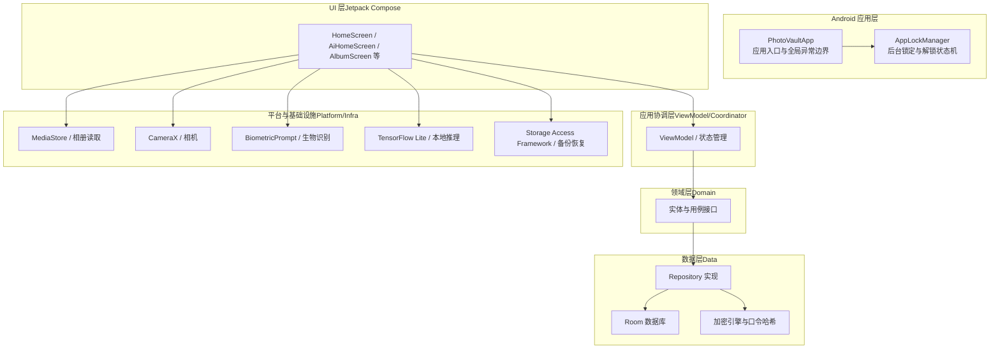
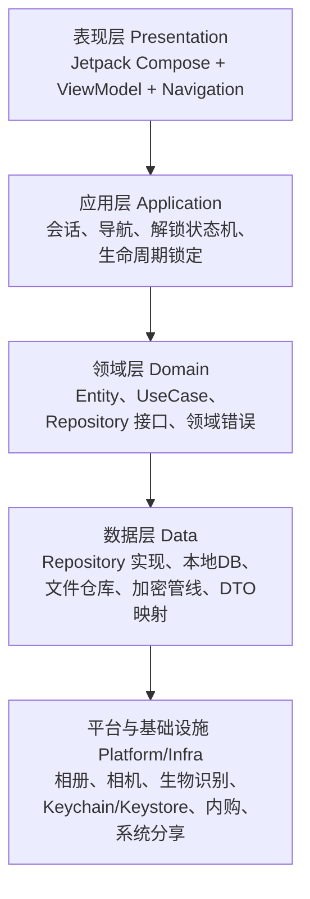
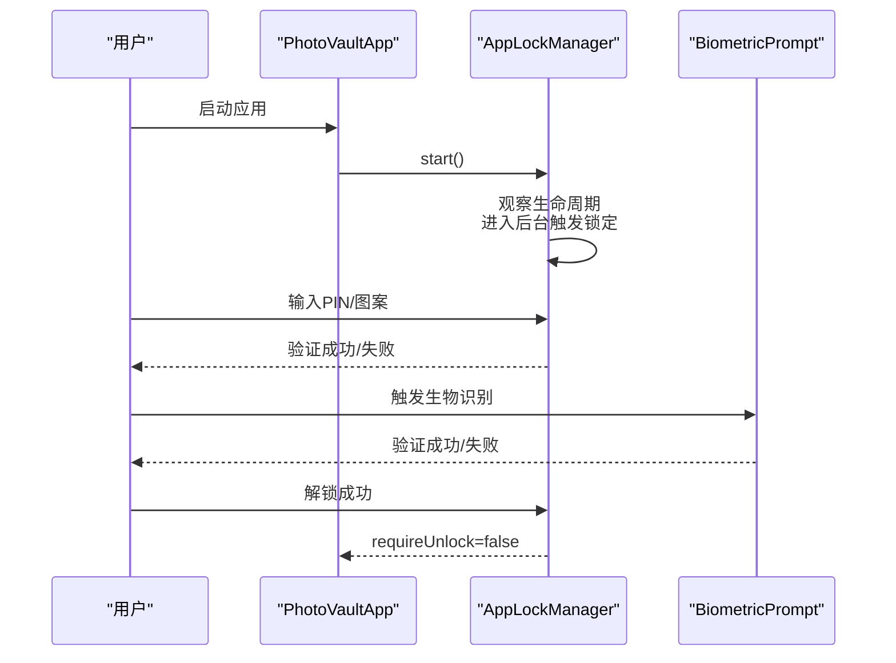
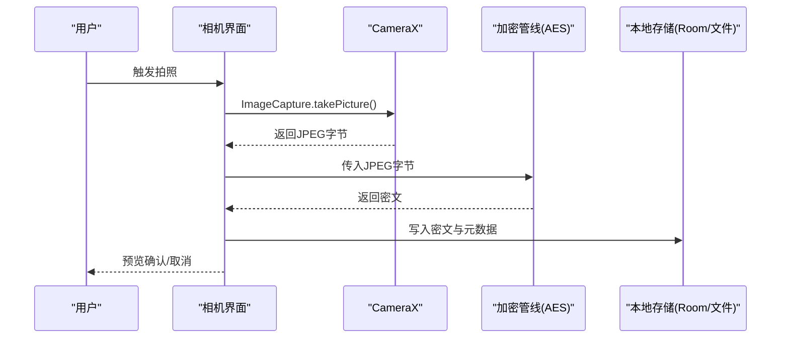
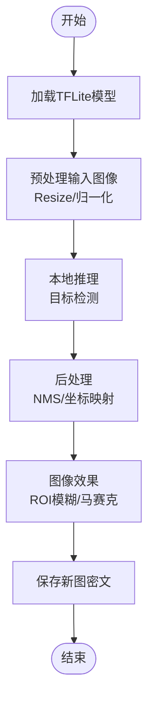
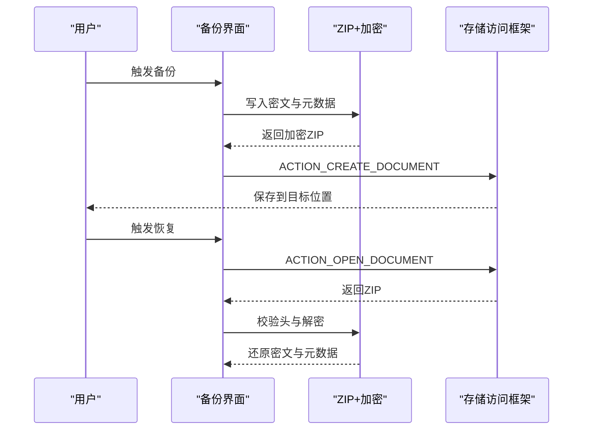
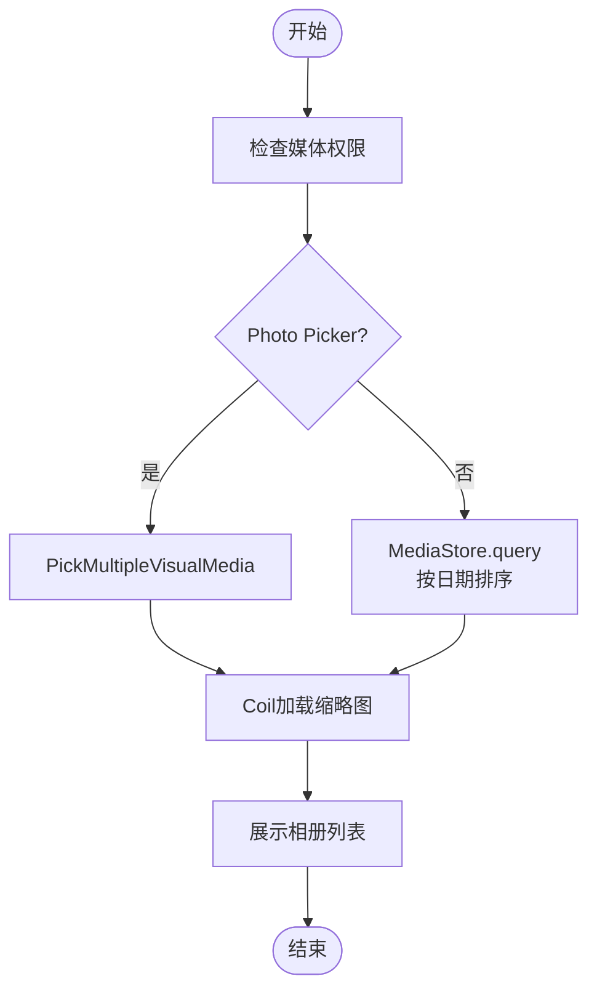
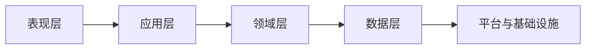

# 项目介绍

<cite>
**本文引用的文件**
- [私密相册 App（一期）原生双端架构设计方案.md](file://spec/私密相册 App（一期）原生双端架构设计方案.md)
- [私密相册 App（一期）Android 端开发计划.md](file://doc/私密相册 App（一期）Android 端开发计划.md)
- [Android 分项技术方案（一期）.md](file://doc/android/README.md)
- [本地图片库-系统相册读取.md](file://doc/android/01-本地图片库-系统相册读取.md)
- [解锁与安全模块.md](file://doc/android/03-解锁与安全模块.md)
- [私密拍照.md](file://doc/android/04-私密拍照.md)
- [AI打码.md](file://doc/android/06-AI打码.md)
- [备份与恢复.md](file://doc/android/09-备份与恢复.md)
- [PhotoVaultApp.kt](file://android/app/src/main/kotlin/com/photovault/app/PhotoVaultApp.kt)
- [AppLockManager.kt](file://android/app/src/main/kotlin/com/photovault/app/AppLockManager.kt)
- [AesCbcEngine.kt](file://android/core/data/src/main/kotlin/com/photovault/data/crypto/AesCbcEngine.kt)
- [PasswordHasher.kt](file://android/core/data/src/main/kotlin/com/photovault/data/crypto/PasswordHasher.kt)
</cite>

## 目录
1. [简介](#简介)
2. [项目结构](#项目结构)
3. [核心组件](#核心组件)
4. [架构总览](#架构总览)
5. [详细组件分析](#详细组件分析)
6. [依赖分析](#依赖分析)
7. [性能考虑](#性能考虑)
8. [故障排查指南](#故障排查指南)
9. [结论](#结论)
10. [附录](#附录)

## 简介
AI照片保险库是一个专注于隐私保护的照片管理应用，其核心使命是“打造一款完全本地离线处理的隐私保护照片管理应用”。项目坚持“不上传云端、全程本地处理、严格隐私保护”的设计理念，确保用户的照片与密钥在设备本地完成采集、存储、处理与分享，不涉及任何云端传输。

价值主张体现在：
- 安全性：所有照片与密钥均在本地处理与存储，密钥托管于系统安全模块（Android Keystore），口令仅以哈希形式持久化。
- 隐私性：不接入第三方监控 SDK（一期不集成 Firebase），不收集用户照片与密钥，严格遵循最小化数据原则。
- 功能性：提供本地加密存储、私密拍照（不入系统相册）、相册管理、AI打码（本地推理）、分享、备份与恢复、内购与多语言等完整能力。
- 合规性：遵循平台隐私政策与商店审核要求，提供清晰的数据安全与隐私披露，并在工程层面落实权限最小化与透明化。

目标用户群体与使用场景：
- 个人用户：希望在手机本地安全地管理私密照片，避免上传云端带来的隐私风险。
- 出差/旅行者：在公共网络环境下仍可进行照片管理与分享，无需担心网络传输风险。
- 高隐私需求用户：对照片内容高度敏感，需要严格的本地化处理与可验证的隐私保护策略。

与传统相册应用的区别与优势：
- 传统相册应用通常默认将照片写入系统相册并可能上传云端，存在隐私泄露风险；本项目强调“不入系统相册”“全程本地处理”，从源头规避隐私风险。
- 传统相册应用较少提供AI打码等隐私增强功能；本项目内置本地AI推理，实现目标检测与图像打码，进一步提升隐私保护能力。
- 传统相册应用在隐私披露与合规方面较为薄弱；本项目在架构设计与工程实现上明确“不上传云端”“不接入监控SDK”，并通过文档化与测试保障落地。

合规性设计原则与隐私保护策略：
- 不上传云端：所有照片与密钥均在本地处理与存储，不涉及云端传输。
- 不接入第三方监控SDK：一期不集成 Firebase 等监控 SDK，后续若接入也必须限定在“可观测性与稳定性”范围内，并提供用户可控开关。
- 密钥与口令安全：密钥托管于系统安全模块，口令仅以哈希形式存储，避免明文泄露。
- 权限最小化：仅在必要场景申请权限，并在权限申请前明确用途说明，符合平台审核要求。
- 数据安全与隐私披露：在应用商店提交材料中提供清晰的数据安全与隐私政策说明，确保用户知情权与选择权。

为初学者提供的背景知识：
- 移动应用隐私保护的重要性：随着数据泄露事件频发，用户对隐私保护的需求日益增长。本地化处理是保障隐私的关键手段之一。
- 技术实现方式：通过系统安全模块（如 Android Keystore）托管密钥、使用哈希算法存储口令、在本地完成加密与解密、在本地完成AI推理与图像处理，确保数据不出设备。
- 架构设计：采用分层架构（表现层、应用层、领域层、数据层、平台与基础设施层），确保职责分离、可维护性与可扩展性。

## 项目结构
项目采用原生双端架构（Android Kotlin 与 iOS Swift），围绕“本地离线处理、不上传云端、合规安全、精简可落地”的核心原则构建。Android 端采用 Jetpack Compose + Hilt + Room + CameraX + TensorFlow Lite 等技术栈，确保主线程不阻塞、加密与AI推理在后台执行器完成。

图表来源
- [PhotoVaultApp.kt:1-31](file://android/app/src/main/kotlin/com/photovault/app/PhotoVaultApp.kt#L1-L31)
- [AppLockManager.kt:1-49](file://android/app/src/main/kotlin/com/photovault/app/AppLockManager.kt#L1-L49)
- [私密相册 App（一期）原生双端架构设计方案.md:20-52](file://spec/私密相册 App（一期）原生双端架构设计方案.md#L20-L52)

章节来源
- [私密相册 App（一期）原生双端架构设计方案.md:1-194](file://spec/私密相册 App（一期）原生双端架构设计方案.md#L1-L194)
- [私密相册 App（一期）Android 端开发计划.md:1-270](file://doc/私密相册 App（一期）Android 端开发计划.md#L1-L270)
- [Android 分项技术方案（一期）.md:1-21](file://doc/android/README.md#L1-L21)

## 核心组件
- 应用入口与全局异常边界：应用启动时安装全局未捕获异常处理器，记录异常日志并交由系统默认处理器处理，避免崩溃导致的数据泄露与用户体验问题。
- 后台锁定与解锁状态机：通过生命周期观察者在应用进入后台时触发锁定，支持 PIN/图案与生物识别解锁，失败后可回退至 PIN。
- 加密与口令哈希：采用 AES-256-CBC（密文前缀IV）与 SHA-256 哈希存储口令，密钥托管于系统安全模块，确保密钥与口令的安全存储。
- 本地AI推理：集成 TensorFlow Lite 进行目标检测与图像打码，推理与重图像处理在后台队列执行，结果回传主线程更新UI。
- 备份与恢复：采用加密ZIP打包密文与元数据，支持通过存储访问框架导出与导入，保障数据可移植与可恢复。

章节来源
- [PhotoVaultApp.kt:12-30](file://android/app/src/main/kotlin/com/photovault/app/PhotoVaultApp.kt#L12-L30)
- [AppLockManager.kt:17-49](file://android/app/src/main/kotlin/com/photovault/app/AppLockManager.kt#L17-L49)
- [AesCbcEngine.kt:1-40](file://android/core/data/src/main/kotlin/com/photovault/data/crypto/AesCbcEngine.kt#L1-L40)
- [PasswordHasher.kt:1-26](file://android/core/data/src/main/kotlin/com/photovault/data/crypto/PasswordHasher.kt#L1-L26)
- [AI打码.md:1-36](file://doc/android/06-AI打码.md#L1-L36)
- [备份与恢复.md:1-36](file://doc/android/09-备份与恢复.md#L1-L36)

## 架构总览
项目采用同构分层架构，职责清晰、依赖单向向内，确保性能与可维护性。核心原则包括：主线程只做渲染与轻逻辑；加密、解码、AI、大批量IO在后台执行器；业务照片与密钥不上传云端；不接入第三方监控SDK（一期）。

图表来源
- [私密相册 App（一期）原生双端架构设计方案.md:20-52](file://spec/私密相册 App（一期）原生双端架构设计方案.md#L20-L52)

章节来源
- [私密相册 App（一期）原生双端架构设计方案.md:7-52](file://spec/私密相册 App（一期）原生双端架构设计方案.md#L7-L52)

## 详细组件分析

### 组件A：解锁与安全模块
该模块负责应用的解锁与安全控制，包括 PIN/图案输入、SHA-256 口令哈希存储、生物识别（BiometricPrompt）与后台锁定机制。失败后可回退至 PIN，确保解锁路径的鲁棒性。

图表来源
- [AppLockManager.kt:17-49](file://android/app/src/main/kotlin/com/photovault/app/AppLockManager.kt#L17-L49)
- [PhotoVaultApp.kt:12-17](file://android/app/src/main/kotlin/com/photovault/app/PhotoVaultApp.kt#L12-L17)
- [解锁与安全模块.md:1-36](file://doc/android/03-解锁与安全模块.md#L1-L36)

章节来源
- [AppLockManager.kt:1-49](file://android/app/src/main/kotlin/com/photovault/app/AppLockManager.kt#L1-L49)
- [PhotoVaultApp.kt:1-31](file://android/app/src/main/kotlin/com/photovault/app/PhotoVaultApp.kt#L1-L31)
- [解锁与安全模块.md:1-36](file://doc/android/03-解锁与安全模块.md#L1-L36)

### 组件B：私密拍照（直拍直存，不入系统相册）
该功能通过 CameraX 进行预览与拍照，拍摄后的 JPEG 字节直接进入加密管线，不写入系统相册，确保照片从采集阶段即处于本地加密状态。

图表来源
- [私密拍照.md:1-28](file://doc/android/04-私密拍照.md#L1-L28)
- [AesCbcEngine.kt:1-40](file://android/core/data/src/main/kotlin/com/photovault/data/crypto/AesCbcEngine.kt#L1-L40)

章节来源
- [私密拍照.md:1-28](file://doc/android/04-私密拍照.md#L1-L28)
- [AesCbcEngine.kt:1-40](file://android/core/data/src/main/kotlin/com/photovault/data/crypto/AesCbcEngine.kt#L1-L40)

### 组件C：AI 打码（本地推理 + 图像处理）
该模块集成 TensorFlow Lite 进行目标检测与图像打码，推理与重图像处理在后台队列执行，最终将处理结果回传主线程更新UI。

图表来源
- [AI打码.md:1-36](file://doc/android/06-AI打码.md#L1-L36)

章节来源
- [AI打码.md:1-36](file://doc/android/06-AI打码.md#L1-L36)

### 组件D：备份与恢复（加密压缩包）
该模块负责将密文文件与元数据打包为加密ZIP，支持通过存储访问框架导出与导入，确保数据可移植与可恢复。

图表来源
- [备份与恢复.md:1-36](file://doc/android/09-备份与恢复.md#L1-L36)

章节来源
- [备份与恢复.md:1-36](file://doc/android/09-备份与恢复.md#L1-L36)

### 组件E：本地图片库（系统相册读取）
该模块通过 MediaStore 与 Photo Picker 读取系统相册，支持按日期排序与分组展示，避免对原图进行写入操作，确保只读访问。

图表来源
- [本地图片库-系统相册读取.md:1-36](file://doc/android/01-本地图片库-系统相册读取.md#L1-L36)

章节来源
- [本地图片库-系统相册读取.md:1-36](file://doc/android/01-本地图片库-系统相册读取.md#L1-L36)

## 依赖分析
项目在分层架构下，依赖关系清晰且单向向内，确保各层职责明确：
- 表现层依赖应用层的状态与导航；
- 应用层依赖领域层的用例与策略；
- 领域层不依赖数据层的具体实现，仅依赖接口；
- 数据层依赖平台与基础设施层（相册、相机、生物识别、Keychain/Keystore、内购、系统分享）。

图表来源
- [私密相册 App（一期）原生双端架构设计方案.md:54-55](file://spec/私密相册 App（一期）原生双端架构设计方案.md#L54-L55)

章节来源
- [私密相册 App（一期）原生双端架构设计方案.md:54-55](file://spec/私密相册 App（一期）原生双端架构设计方案.md#L54-L55)

## 性能考虑
- 线程与任务调度：主线程仅负责UI渲染与轻逻辑；加密、解码、AI推理与大批量IO在后台执行器完成，避免阻塞主线程。
- 数据与事务：批量导入采用分批提交或单事务，避免每张照片触发全表扫描；相册列表采用分页与缩略图缓存，降低内存占用。
- 内存管理：大图按目标尺寸解码；AI输入tensor尽量复用缓冲区，减少GC压力。
- 测试与回归：领域层纯逻辑单测；数据层使用内存Fake；平台层使用假相册/相机，确保测试覆盖全面。

章节来源
- [私密相册 App（一期）原生双端架构设计方案.md:151-158](file://spec/私密相册 App（一期）原生双端架构设计方案.md#L151-L158)

## 故障排查指南
- 全局异常边界：应用启动时安装全局未捕获异常处理器，记录异常日志并交由系统默认处理器处理，便于定位崩溃原因。
- 日志与诊断：开发期使用系统日志（Logcat/OSLog）与性能分析工具（Profiler/Systrace）进行性能与稳定性排查。
- 权限与合规：确保权限申请与用途说明一致，避免因权限滥用导致的审核问题；在应用商店提交材料中提供清晰的数据安全与隐私政策说明。
- 备份与恢复：备份包结构与加密格式需与iOS文档化一致，确保跨端恢复；在卸载重装后可恢复同版本格式的备份包。

章节来源
- [PhotoVaultApp.kt:19-29](file://android/app/src/main/kotlin/com/photovault/app/PhotoVaultApp.kt#L19-L29)
- [私密相册 App（一期）Android 端开发计划.md:220-235](file://doc/私密相册 App（一期）Android 端开发计划.md#L220-L235)
- [备份与恢复.md:23-26](file://doc/android/09-备份与恢复.md#L23-L26)

## 结论
AI照片保险库以“本地离线处理、严格隐私保护”为核心，结合分层架构与原生技术栈，实现了从采集、存储、处理到分享的全链路本地化。通过系统安全模块托管密钥、SHA-256口令哈希、AES加密与本地AI推理，项目在保障隐私的同时提供了完整的照片管理能力。未来在合规与性能方面将持续优化，确保用户在使用过程中的隐私与体验。

## 附录
- 术语说明
  - 本地离线处理：所有照片与密钥在设备本地完成采集、存储、处理与分享，不涉及云端传输。
  - 加密存储：采用 AES-256-CBC（密文前缀IV）与系统安全模块托管密钥，确保密钥与口令的安全存储。
  - 本地AI推理：在设备本地完成目标检测与图像打码，不上传模型或图像至云端。
  - 双端对齐：Android与iOS在业务语义、数据契约（密文格式、DB字段、备份结构）上保持一致，确保跨端恢复与一致性。