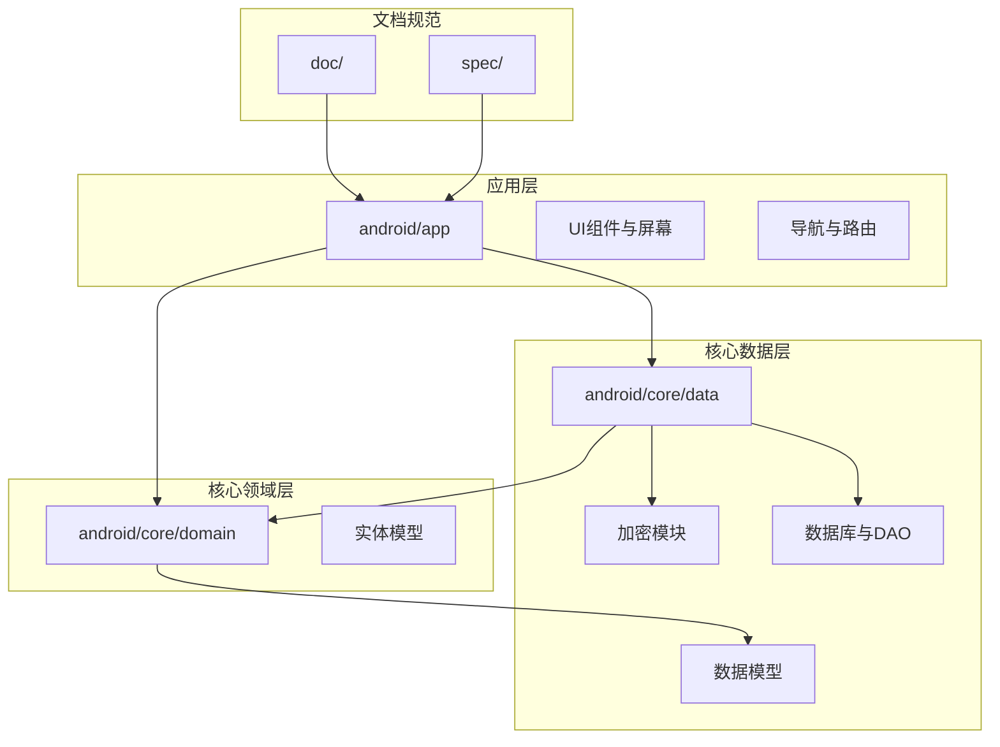
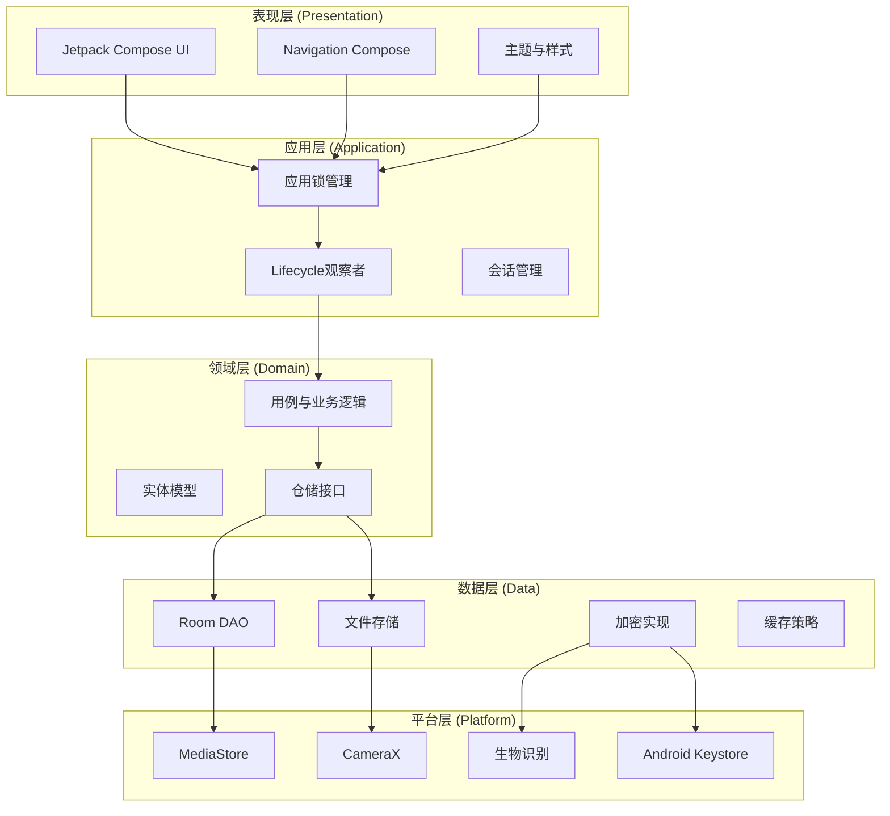
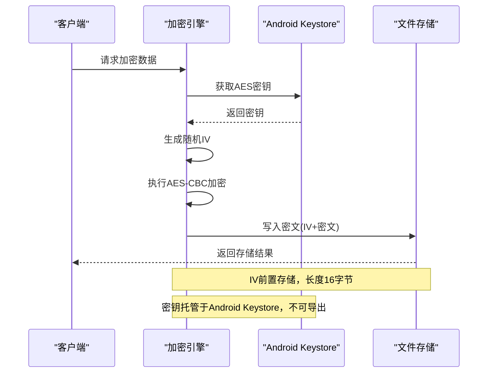
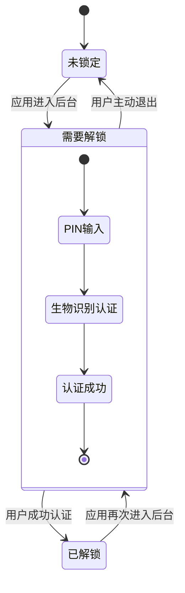
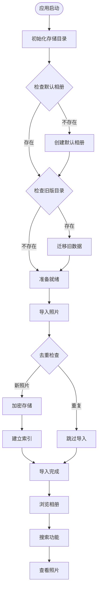
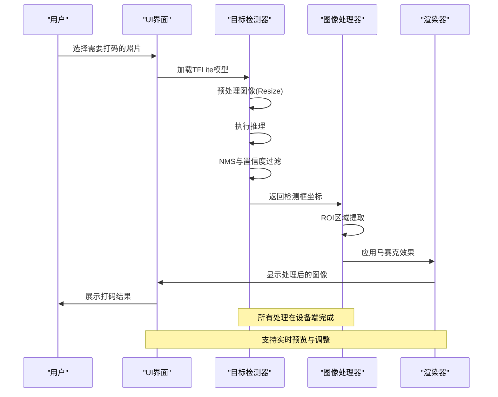
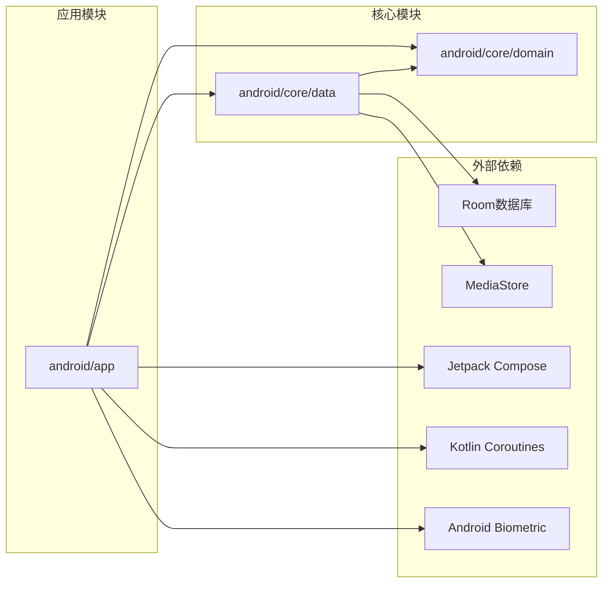
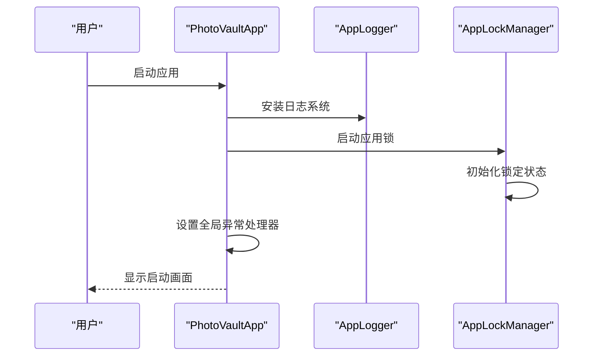
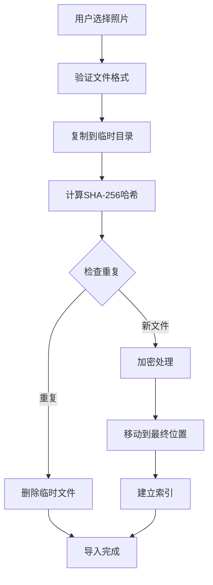
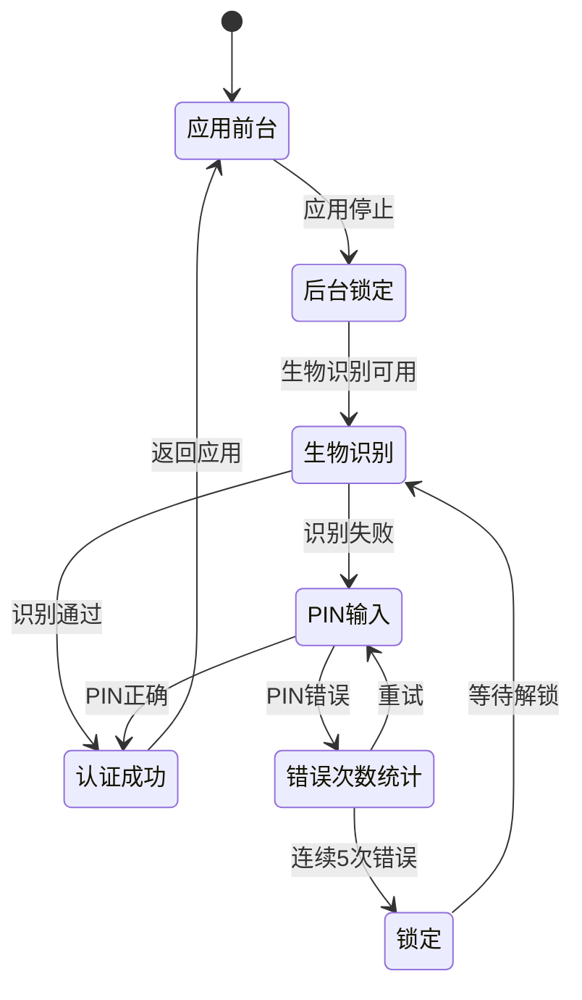

# 项目概述

<cite>
**本文引用的文件**
- [PhotoVaultApp.kt](file://android/app/src/main/kotlin/com/photovault/app/PhotoVaultApp.kt)
- [MainActivity.kt](file://android/app/src/main/kotlin/com/photovault/app/MainActivity.kt)
- [AppLockManager.kt](file://android/app/src/main/kotlin/com/photovault/app/AppLockManager.kt)
- [LockScreen.kt](file://android/app/src/main/kotlin/com/photovault/app/ui/lock/LockScreen.kt)
- [VaultStore.kt](file://android/app/src/main/kotlin/com/photovault/app/ui/vault/VaultStore.kt)
- [AesCbcEngine.kt](file://android/core/data/src/main/kotlin/com/photovault/data/crypto/AesCbcEngine.kt)
- [KeystoreSecretKeyProvider.kt](file://android/core/data/src/main/kotlin/com/photovault/data/crypto/KeystoreSecretKeyProvider.kt)
- [PasswordHasher.kt](file://android/core/data/src/main/kotlin/com/photovault/data/crypto/PasswordHasher.kt)
- [PhotoVaultDatabase.kt](file://android/core/data/src/main/kotlin/com/photovault/data/db/PhotoVaultDatabase.kt)
- [01-本地图片库-系统相册读取.md](file://doc/android/01-本地图片库-系统相册读取.md)
- [03-解锁与安全模块.md](file://doc/android/03-解锁与安全模块.md)
- [05-相册管理.md](file://doc/android/05-相册管理.md)
- [06-AI打码.md](file://doc/android/06-AI打码.md)
- [私密相册 App（一期）原生双端架构设计方案.md](file://spec/私密相册 App（一期）原生双端架构设计方案.md)
</cite>

## 目录
1. [简介](#简介)
2. [项目结构](#项目结构)
3. [核心组件](#核心组件)
4. [架构总览](#架构总览)
5. [详细组件分析](#详细组件分析)
6. [依赖关系分析](#依赖关系分析)
7. [性能考量](#性能考量)
8. [故障排查指南](#故障排查指南)
9. [结论](#结论)
10. [附录](#附录)

## 简介
AI照片保险库是一个专注于本地离线处理与隐私保护的照片管理应用。其核心价值主张是：
- 本地离线处理：所有照片处理与AI推理均在设备端完成，不上传云端
- 隐私保护：采用强加密与安全存储策略，确保用户数据与密钥仅驻留本地
- 智能功能：提供AI智能打码、相册管理、私密拍照、备份恢复等实用功能
- 合规设计：遵循隐私法规与平台审核要求，提供透明的隐私策略

该项目采用Android原生Kotlin + Jetpack Compose技术栈，基于清晰的分层架构设计，确保代码的可维护性与扩展性。

## 项目结构
项目采用模块化组织，主要包含以下核心模块：

**图表来源**
- [私密相册 App（一期）原生双端架构设计方案.md:20-52](file://spec/私密相册 App（一期）原生双端架构设计方案.md#L20-L52)
- [MainActivity.kt:1-262](file://android/app/src/main/kotlin/com/photovault/app/MainActivity.kt#L1-L262)

**章节来源**
- [私密相册 App（一期）原生双端架构设计方案.md:1-194](file://spec/私密相册 App（一期）原生双端架构设计方案.md#L1-L194)
- [MainActivity.kt:1-262](file://android/app/src/main/kotlin/com/photovault/app/MainActivity.kt#L1-L262)

## 核心组件
项目的核心组件围绕四大支柱构建：

### 1. 安全存储与加密体系
- **主密钥管理**：通过Android Keystore托管AES-256密钥，确保密钥材料不可导出
- **加密引擎**：实现AES-256-CBC + PKCS7加密，IV前置存储，与现有产品协议保持一致
- **口令哈希**：使用SHA-256进行口令摘要存储，配合盐值防止彩虹表攻击

### 2. 锁屏与安全模块
- **应用锁管理**：基于Lifecycle的后台锁定策略，支持PIN码与生物识别解锁
- **生物识别集成**：支持指纹、面部识别等现代生物特征认证
- **安全状态机**：统一的应用解锁状态管理，确保界面一致性

### 3. 照片保险库存储
- **本地文件存储**：基于应用files目录的私有文件夹，实现照片的本地化存储
- **相册管理**：支持多相册创建、照片分类与快速检索
- **导入机制**：提供系统相册导入与私密拍照两种照片获取方式

### 4. AI智能打码
- **本地推理**：基于TensorFlow Lite的本地AI推理，支持目标检测与图像处理
- **图像处理**：实现ROI区域的马赛克与模糊效果，保护敏感区域
- **性能优化**：后台线程执行推理，主线程更新UI，确保流畅体验

**章节来源**
- [AesCbcEngine.kt:1-40](file://android/core/data/src/main/kotlin/com/photovault/data/crypto/AesCbcEngine.kt#L1-L40)
- [KeystoreSecretKeyProvider.kt:1-42](file://android/core/data/src/main/kotlin/com/photovault/data/crypto/KeystoreSecretKeyProvider.kt#L1-L42)
- [PasswordHasher.kt:1-26](file://android/core/data/src/main/kotlin/com/photovault/data/crypto/PasswordHasher.kt#L1-L26)
- [AppLockManager.kt:1-49](file://android/app/src/main/kotlin/com/photovault/app/AppLockManager.kt#L1-L49)
- [LockScreen.kt:1-414](file://android/app/src/main/kotlin/com/photovault/app/ui/lock/LockScreen.kt#L1-L414)
- [VaultStore.kt:1-226](file://android/app/src/main/kotlin/com/photovault/app/ui/vault/VaultStore.kt#L1-L226)

## 架构总览
项目采用清晰的分层架构设计，确保关注点分离与依赖方向正确：

**图表来源**
- [私密相册 App（一期）原生双端架构设计方案.md:20-52](file://spec/私密相册 App（一期）原生双端架构设计方案.md#L20-L52)
- [MainActivity.kt:42-74](file://android/app/src/main/kotlin/com/photovault/app/MainActivity.kt#L42-L74)

该架构遵循以下设计原则：
- **依赖倒置**：上层不依赖下层的具体实现
- **单一职责**：每层专注于特定领域的职责
- **接口隔离**：通过接口定义抽象，降低耦合度
- **开闭原则**：对扩展开放，对修改封闭

**章节来源**
- [私密相册 App（一期）原生双端架构设计方案.md:7-55](file://spec/私密相册 App（一期）原生双端架构设计方案.md#L7-L55)

## 详细组件分析

### 安全存储与加密系统

#### 加密管道设计

**图表来源**
- [AesCbcEngine.kt:17-32](file://android/core/data/src/main/kotlin/com/photovault/data/crypto/AesCbcEngine.kt#L17-L32)
- [KeystoreSecretKeyProvider.kt:18-35](file://android/core/data/src/main/kotlin/com/photovault/data/crypto/KeystoreSecretKeyProvider.kt#L18-L35)

#### 口令安全策略
系统采用多层安全策略保护用户口令：
- **SHA-256哈希**：所有口令均转换为SHA-256摘要存储
- **盐值机制**：每个安装实例生成唯一盐值，防止彩虹表攻击
- **本地存储**：口令摘要仅存储在设备本地，不上传云端

**章节来源**
- [PasswordHasher.kt:1-26](file://android/core/data/src/main/kotlin/com/photovault/data/crypto/PasswordHasher.kt#L1-L26)
- [03-解锁与安全模块.md:11-17](file://doc/android/03-解锁与安全模块.md#L11-L17)

### 应用锁与安全模块

#### 锁屏状态机

**图表来源**
- [AppLockManager.kt:12-47](file://android/app/src/main/kotlin/com/photovault/app/AppLockManager.kt#L12-L47)
- [LockScreen.kt:52-127](file://android/app/src/main/kotlin/com/photovault/app/ui/lock/LockScreen.kt#L52-L127)

#### 生物识别集成
系统支持多种认证方式，提供灵活的安全体验：
- **指纹识别**：支持指纹传感器的快速认证
- **面部识别**：利用设备的面部识别功能
- **设备凭证**：支持设备密码或图案解锁
- **自动提示**：首次启用时智能提示用户开启生物识别

**章节来源**
- [LockScreen.kt:61-106](file://android/app/src/main/kotlin/com/photovault/app/ui/lock/LockScreen.kt#L61-L106)
- [03-解锁与安全模块.md:15-29](file://doc/android/03-解锁与安全模块.md#L15-L29)

### 照片保险库存储系统

#### 本地存储架构

**图表来源**
- [VaultStore.kt:60-66](file://android/app/src/main/kotlin/com/photovault/app/ui/vault/VaultStore.kt#L60-L66)
- [VaultStore.kt:120-154](file://android/app/src/main/kotlin/com/photovault/app/ui/vault/VaultStore.kt#L120-L154)

#### 相册管理功能
- **多相册支持**：用户可创建多个自定义相册进行分类管理
- **智能索引**：自动建立照片索引，支持快速检索
- **相册封面**：自动选择最新照片作为相册封面
- **相册排序**：默认相册优先显示，其余相册按字母顺序排列

**章节来源**
- [VaultStore.kt:14-31](file://android/app/src/main/kotlin/com/photovault/app/ui/vault/VaultStore.kt#L14-L31)
- [05-相册管理.md:11-21](file://doc/android/05-相册管理.md#L11-L21)

### AI智能打码系统

#### 本地推理流程

**图表来源**
- [06-AI打码.md:11-25](file://doc/android/06-AI打码.md#L11-L25)

#### 性能优化策略
- **后台线程执行**：AI推理与图像处理在后台线程进行
- **内存管理**：合理控制图像缓冲区大小，避免内存溢出
- **模型优化**：使用TensorFlow Lite进行模型量化，提升推理速度
- **渐进式处理**：支持实时预览，用户可随时调整打码强度

**章节来源**
- [06-AI打码.md:23-25](file://doc/android/06-AI打码.md#L23-L25)

## 依赖关系分析

### 技术栈选择与理由

#### Android原生技术栈
项目选择Android原生技术栈的原因：
- **性能优势**：原生开发避免了跨平台框架的性能损耗
- **生态完整**：充分利用Android生态系统的优势资源
- **隐私保护**：原生实现便于精确控制数据流向与存储位置
- **长期维护**：基于成熟的Android开发模式，便于团队维护

#### Jetpack Compose选择
- **声明式UI**：简化UI开发复杂度，提高开发效率
- **状态管理**：与Kotlin协程深度集成，便于异步状态管理
- **主题系统**：内置Material Design 3支持，提供一致的用户体验
- **导航集成**：与Navigation Compose无缝集成，简化路由管理

### 模块间依赖关系

**图表来源**
- [PhotoVaultDatabase.kt:14-25](file://android/core/data/src/main/kotlin/com/photovault/data/db/PhotoVaultDatabase.kt#L14-L25)
- [私密相册 App（一期）原生双端架构设计方案.md:58-75](file://spec/私密相册 App（一期）原生双端架构设计方案.md#L58-L75)

**章节来源**
- [私密相册 App（一期）原生双端架构设计方案.md:58-75](file://spec/私密相册 App（一期）原生双端架构设计方案.md#L58-L75)

## 性能考量
项目在性能方面采取了多项优化措施：

### 线程与并发
- **后台执行**：加密、解密、AI推理、图像处理均在后台线程执行
- **协程管理**：使用Kotlin协程进行异步操作，避免阻塞主线程
- **线程池配置**：根据设备性能动态调整线程池大小

### 内存管理
- **分页加载**：相册列表采用分页加载，避免一次性加载大量图片
- **缩略图缓存**：使用合适的缩略图缓存策略，平衡内存占用与加载速度
- **及时释放**：及时释放不再使用的图像资源，防止内存泄漏

### 存储优化
- **增量更新**：数据库操作采用事务批量提交，减少磁盘IO
- **文件系统优化**：合理组织文件目录结构，避免过多小文件
- **清理策略**：定期清理临时文件和缓存数据

## 故障排查指南

### 常见问题与解决方案

#### 加密相关问题
- **加密失败**：检查Android Keystore是否正常工作，确认密钥是否存在
- **解密异常**：验证密文格式是否正确，确认IV长度是否为16字节
- **口令错误**：确认用户输入的口令是否正确，检查盐值匹配情况

#### 锁屏相关问题
- **无法解锁**：检查生物识别硬件是否正常，确认系统设置中是否已录入生物特征
- **频繁锁屏**：调整后台锁定策略，检查应用生命周期事件处理
- **PIN码无效**：确认PIN码长度和格式，检查存储的哈希值是否正确

#### 相册管理问题
- **照片不显示**：检查存储目录权限，确认文件是否被正确导入
- **相册为空**：验证相册目录结构，检查是否有文件损坏
- **导入失败**：确认系统相册权限，检查文件格式是否受支持

**章节来源**
- [LockScreen.kt:365-382](file://android/app/src/main/kotlin/com/photovault/app/ui/lock/LockScreen.kt#L365-L382)
- [VaultStore.kt:120-154](file://android/app/src/main/kotlin/com/photovault/app/ui/vault/VaultStore.kt#L120-L154)

## 结论
AI照片保险库项目通过精心设计的架构和严格的安全策略，为用户提供了可靠的本地照片管理解决方案。项目的核心优势体现在：

### 技术优势
- **架构清晰**：分层设计确保了代码的可维护性和扩展性
- **性能优异**：合理的线程管理和内存优化策略
- **安全可靠**：端到端加密和本地存储策略

### 功能特色
- **AI智能打码**：本地推理实现，保护用户隐私
- **多相册管理**：灵活的照片分类和组织方式
- **生物识别**：现代化的解锁体验
- **备份恢复**：完整的数据保护机制

### 合规保障
- **隐私保护**：严格遵守隐私法规，不收集用户数据
- **透明策略**：清晰的隐私政策和数据处理说明
- **用户控制**：用户对个人数据拥有完全控制权

该项目为开发者提供了一个优秀的Android原生应用开发范例，展示了如何在保证性能的同时实现强大的功能和严格的安全要求。

## 附录

### 功能演示示例

#### 1. 应用启动流程

**图表来源**
- [PhotoVaultApp.kt:12-17](file://android/app/src/main/kotlin/com/photovault/app/PhotoVaultApp.kt#L12-L17)

#### 2. 照片导入流程

**图表来源**
- [VaultStore.kt:120-154](file://android/app/src/main/kotlin/com/photovault/app/ui/vault/VaultStore.kt#L120-L154)

#### 3. 锁屏认证流程

**图表来源**
- [AppLockManager.kt:37-47](file://android/app/src/main/kotlin/com/photovault/app/AppLockManager.kt#L37-L47)
- [LockScreen.kt:114-123](file://android/app/src/main/kotlin/com/photovault/app/ui/lock/LockScreen.kt#L114-L123)