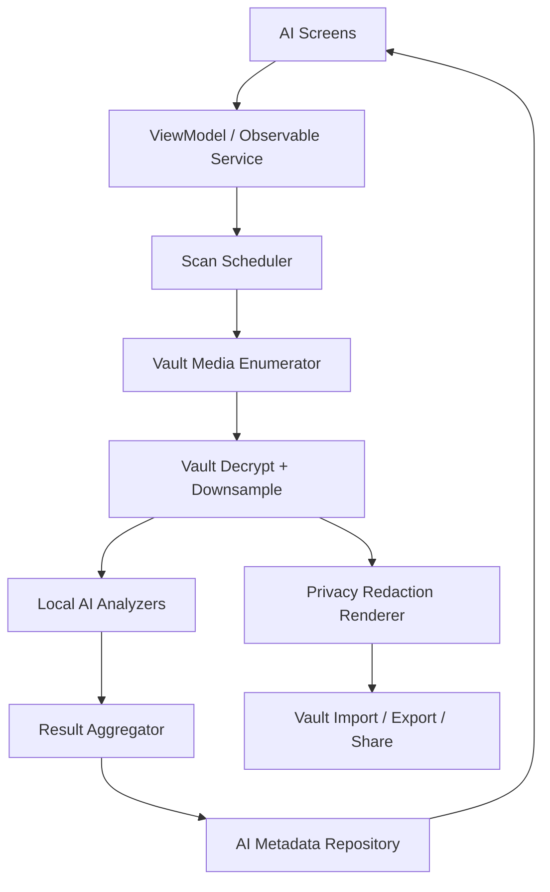

# LumaNox AI 助手整体技术方案与开发计划

本文沉淀 LumaNox 产品内“AI 助手”的跨端技术方案和开发计划。AI 助手必须服务于隐私保险箱的核心承诺：所有分析、分类、清理和脱敏都在本机完成，不上传媒体、不依赖云端账号、不产生不可控明文副本。

## 1. 范围与目标

### 1.1 产品范围

AI 助手包含 5 条主链路：

| 能力 | 用户价值 | 关键页面 |
|---|---|---|
| AI 首页 | 汇总当前最重要建议和扫描进度 | AI Home |
| 智能清理 | 找出模糊、过曝、重复候选，帮助释放空间 | AI Cleanup |
| 智能分类 | 将媒体归入截图、人物、文档、风景、美食、视频等互斥主分类 | AI Classify |
| 敏感审查 | 发现人脸、文字、证件、银行卡、二维码等隐私风险 | Sensitive Review |
| 隐私打码 | 对敏感区域进行马赛克、模糊、黑/白条、椭圆模糊、Emoji 覆盖，并保存或导出脱敏副本 | Privacy Redact |

### 1.2 非目标

- 不做云端 AI、云同步或服务端媒体索引。
- 不把原图、OCR 原文、密钥、PIN、备份密钥上传或写入日志。
- 不自动删除用户媒体；清理候选必须由用户确认，首选移入回收站。
- MVP 不做视频逐帧打码；视频先纳入分类/清理的基础索引，视频脱敏作为后续能力。
- MVP 不引入大模型对话式助手；“AI 助手”是本地智能整理与隐私处理入口。

## 2. 当前工程基线

### 2.1 Android 基线

Android 是成熟参考实现：

- 扫描入口：`android/app/src/main/kotlin/com/xpx/vault/ai/AiLocalScanUseCase.kt`。
- UI：`AiHomeScreen`、`AiCleanupScreen`、`AiClassifyScreen`、`AiSensitiveReviewScreen`、`PrivacyRedactScreen`。
- 算法层：`android/core/ai` + `android/core/ai-mlkit`，包含本地算法、ML Kit analyzer、敏感匹配、重复聚类和隐私渲染。
- 数据层：AI 结果写入 Room 表，包括质量、感知哈希、标签、敏感记录。
- 触发方式：解锁后、导入后、拍照/录像入库后可触发增量扫描；手动按钮可强制重扫。
- 线程模型：使用 `Mutex` 合并并发请求，照片级并发通过 `Semaphore` 限流，扫描进度通过 `StateFlow` 暴露给 UI。

### 2.2 iOS 基线

iOS 当前已有真实本地分析链路的骨架，仍需持续补齐交互与验收：

- 扫描服务：`ios/LumaNox/Core/AI/VaultAIAnalysisService.swift`。
- 隐私打码：`ios/LumaNox/Core/AI/PrivacyRedactionService.swift`。
- UI：`ios/LumaNox/Features/AI/AIViews.swift`。
- 视觉源：现有 `AIViews.pen` 为分组式设计，`PrivacyRedactView.pen` 已独立存在；后续仍需按一页一 Pen 拆分。
- 数据落点：扫描结果写入 `VaultAiMetadata`，由 `VaultMetadataStore` 存入 `vault_metadata_v1.json`。
- 能力现状：已使用 Vision 做人脸、文字、条码、分类；使用图像质量和 dHash 做模糊、过曝、重复候选；隐私打码可检测区域并保存脱敏副本到保险箱。
- 已知缺口：导出/分享脱敏副本仍有待完全闭环；Privacy Redact 的手动 ROI 编辑需要从 UI 表示补齐到真实编辑状态；AI 页面 Pen 仍需拆分。

## 3. 总体架构

### 3.1 分层模型

### 3.2 跨端原则

- 加密文件是事实源；AI metadata 是可重建索引。
- 扫描输入只使用解密后的下采样图或短生命周期明文临时文件。
- AI 结果只保存摘要：分数、标签、分类、扫描时间、必要的区域信息；不长期保存 OCR 原文。
- Android 与 iOS 页面行为对齐，平台实现可使用各自原生能力。
- 新增或变更 iOS 可路由页面时，先更新对应 `.pen`，再实现 SwiftUI，并用模拟器截图验证。

## 4. 数据契约

AI metadata 应保持平台无关，便于未来备份迁移、搜索和跨页面消费。

| 字段 | 类型 | 说明 |
|---|---|---|
| `scannedAtMs` | Int64? | 最近一次 AI 扫描完成时间 |
| `sensitiveScore` | Double? | 敏感风险分，0-1 |
| `cleanupScore` | Double? | 清理建议分，0-1 |
| `category` | String? | 互斥主分类，如 `people`、`documents`、`screenshots` |
| `tags` | [String] | 可叠加标签，如 `face`、`text`、`barcode`、`blurry` |
| `duplicateGroupId` | String? | 后续用于稳定展示重复组 |
| `redactionHints` | [Region]? | 后续用于可编辑 ROI，MVP 可先按需实时检测 |

分类枚举建议固定为：

- `people`
- `documents`
- `screenshots`
- `food`
- `nature`
- `videos`
- `other`

标签枚举建议固定为：

- 清理：`blurry`、`overexposed`、`duplicate`
- 敏感：`face`、`text`、`barcode`、`id_card`、`bank_card`、`contact`
- 来源/形态：`screenshot`、`video`

## 5. 扫描链路

### 5.1 触发策略

| 场景 | 策略 |
|---|---|
| 用户点击开始扫描/重新扫描 | 强制扫描当前所有活跃媒体 |
| 导入完成 | 增量扫描新增媒体 |
| 私密相机入库 | 增量扫描新增媒体 |
| App 解锁后进入主界面 | 如存在未扫描媒体，后台补扫 |
| 用户进入 AI 子页 | 刷新 summary；不应无提示启动重负载全量扫描 |

### 5.2 执行步骤

1. 从 Vault 读取 active media 列表，排除回收站和不可解密项。
2. 按平台能力解密并下采样图片；视频首期只写入视频分类和基础标签。
3. 执行本地 analyzer：
   - 图像质量：清晰度、亮度、过曝。
   - 感知哈希：pHash/dHash，后处理聚类重复候选。
   - 分类：ML Kit 或 Vision/CoreML。
   - 敏感：OCR + regex、人脸、条码/二维码。
4. 聚合为稳定数据契约，写入 AI metadata。
5. 更新 AI 首页 summary、子页列表和扫描进度。

### 5.3 并发与资源控制

- Android 继续使用 `Mutex` + `Semaphore`，合并重入扫描请求。
- iOS 扫描应保持单飞；后续可引入 `actor` 或 `AsyncSemaphore` 限制并发 2-3。
- 图片分析必须下采样，避免整张大图常驻内存。
- 长任务使用后台优先级：Android `Dispatchers.IO/Default`，iOS `Task.detached(priority: .utility)`。
- UI 进度只展示数量和阶段，不展示文件名、路径或 OCR 原文。

## 6. 隐私打码链路

### 6.1 ROI 发现

自动候选区域来源：

- 人脸框。
- 条码/二维码框。
- OCR 文本框。
- 命中证件、银行卡、手机号、邮箱等 regex 的文本框。
- 无命中时可给出中心区域兜底，但 UI 必须让用户确认。

### 6.2 编辑与渲染

MVP 必须支持：

- 样式选择：马赛克、模糊、黑条、白条、椭圆模糊、Emoji。
- 自动区域预览。
- 手动追加区域。
- 撤销最后一个手动区域。
- 清空手动区域。
- 保存脱敏副本到安全相册。

后续增强：

- 删除单个自动区域。
- 拖拽/缩放已存在区域。
- 导出到系统相册。
- 分享临时脱敏副本。
- 视频分段打码。

### 6.3 明文生命周期

- 渲染输入来自临时解密内容，任务结束后释放。
- 保存到安全相册时重新走 Vault import，加密落盘。
- 分享/导出只能写入 cache 或用户选择位置，并在完成后清理临时文件。
- 不覆盖原始密文媒体，除非未来单独提供明确的“替换原图”高风险确认。

## 7. UI 与交互规则

### 7.1 AI 首页

- 顶部只显示一个优先级最高建议：扫描中 > 敏感风险 > 清理候选 > 未扫描 > 一切正常。
- 入口聚焦 3 个：隐私打码、智能分类、重复/模糊清理。
- 扫描中可离开页面，进度不应阻塞主流程。
- 空保险箱时禁用扫描按钮，并提示先导入媒体。

### 7.2 智能清理

- 候选包括模糊、过曝、重复。
- 默认不选中全部删除；一键清理前必须确认。
- 清理动作优先移入回收站，不直接永久删除。
- 重复组后续应展示“保留代表张 + 候选张”的结构，而不是平铺全部。

### 7.3 智能分类

- 主分类互斥，同一媒体只进入一个主分类。
- 分类详情使用真实缩略图，不使用装饰占位。
- 分类结果应支持重新扫描后刷新。

### 7.4 敏感审查

- 按 `sensitiveScore` 降序展示。
- 命中类型可展示为标签，但不要展示大段敏感文本原文。
- 每项必须提供可执行动作：查看、打码、忽略；“忽略”可在后续持久化。

### 7.5 隐私打码

- 图片画布优先，工具栏和操作按钮次之。
- 视频进入时明确提示当前暂不支持视频打码。
- 保存成功后刷新 Vault 列表和 AI summary。
- 导出/分享失败必须说明原因并清理临时文件。

## 8. 付费与配额

- AI 入口统一通过 `PaywallGatekeeper` / `QuotaManager` 门控，不在 UI 内散落订阅判断。
- 建议的 ProFeature 映射：
  - `aiClassify`
  - `aiCleanup`
  - `aiSensitiveReview`
  - `aiPrivacy`
- 免费额度以“扫描次数”或“AI 操作次数”为主，避免按后台增量补扫误扣用户额度。
- 自动触发的增量扫描不建议消耗用户可见额度；手动全量扫描和隐私打码保存可计入额度。

## 9. 安全、合规与可观测性

### 9.1 安全要求

- 不上传媒体、不上传 AI 结果、不接第三方云端分析 SDK。
- 日志不得包含 PIN、密钥、OCR 原文、完整明文路径。
- OCR 原文只用于即时匹配，默认不持久化。
- AI metadata 可由密文文件重建，损坏时应允许 reconcile。
- 备份包若包含 AI metadata，仍必须处于加密 body 内。

### 9.2 可观测性

仅记录本地调试级别指标：

- 扫描开始/结束、总数、成功数、失败数。
- 单轮扫描耗时区间。
- analyzer 是否 ready。
- 失败类别：解密失败、解码失败、Vision/ML Kit 失败、写入失败。

不得记录媒体内容、OCR 原文、敏感区域截图。

## 10. 开发计划

### M0：方案固化与现状校准

- 本文档入库，作为 AI 助手跨端统一方案。
- 更新 `docs/ios-technical-plan.md` 中 AI 状态，避免与 `docs/ios-self-test.md` 的“已接入真实链路”表述冲突。
- 梳理 Android 与 iOS AI metadata 字段差异，确认是否需要独立 `ai_results_v1`。

### M1：iOS AI 页面与 Pen 对齐

- 将 `AIViews.pen` 拆分为：
  - `AIHomeView.pen`
  - `AICleanupView.pen`
  - `AISensitiveReviewView.pen`
  - `AIClassifyView.pen`
  - `AIClassifyDetailView.pen`
- 保留并校准 `PrivacyRedactView.pen`。
- SwiftUI 对齐拆分后的 Pen，并补齐 accessibilityIdentifier。
- 模拟器验证 AI 首页、清理、分类、敏感审查、隐私打码的首屏截图。

### M2：iOS 扫描服务稳定化

- 将 `VaultAIAnalysisService` 的扫描单飞逻辑显式化，避免并发重入。
- 为 iOS 增量扫描补齐“已扫过媒体跳过”策略。
- 补齐失败项处理：不可解密、不可解码、Vision 失败不应中断整轮扫描。
- 增加固定 fixture 测试，覆盖截图、文档、人脸、二维码、模糊、过曝、重复。

### M3：隐私打码完整闭环

- 将 Privacy Redact 的手动区域、撤销、清空接入真实渲染输入。
- 补齐导出到系统位置和分享临时脱敏副本。
- 明确保存成功后的导航、toast/message 和 Vault 刷新。
- Android 与 iOS 在样式命名、保存语义、错误文案上保持一致。

### M4：清理与分类体验增强

- 重复候选按组展示，支持选择保留项。
- 清理确认页区分模糊、过曝、重复数量。
- 分类详情支持进入查看器。
- 支持忽略敏感候选，并在重扫后保留忽略状态。

### M5：发布验收与跨端回归

- Android 执行 `./gradlew :app:compileDevDebugKotlin`。
- iOS 执行 `xcodegen generate`、`xcodebuild`、安装启动模拟器并截图。
- 完成 `docs/ios-self-test.md` 的 AI 用例。
- 使用固定媒体样本跑 Android/iOS 结果对比，允许阈值不同，但分类、敏感、清理结果应在产品可接受范围内。

## 11. 验收标准

| 类别 | 标准 |
|---|---|
| 隐私 | 断网状态下 AI 入口可用；抓包或日志不出现媒体上传行为 |
| 正确性 | 扫描完成数等于 active media 数；失败项不阻塞其他媒体 |
| UI | 空态、扫描中、结果态、错误态均可达；文本本地化 |
| 清理 | 一键清理前确认；清理后进入回收站，可恢复 |
| 分类 | 同一媒体只出现在一个主分类；详情展示真实缩略图 |
| 敏感 | 人脸、文字、证件/银行卡、二维码样本能进入候选 |
| 打码 | 保存脱敏副本后 Vault 新增加密媒体；原图不被覆盖 |
| 性能 | 100 张图片扫描期间 UI 可交互，无持续主线程卡顿 |
| 资源 | 扫描后无长期明文临时文件残留 |

## 12. 近期优先任务

1. 同步修正文档状态：`docs/ios-technical-plan.md` 的 AI 缺口需反映当前真实链路进展。
2. 拆分 iOS AI Pen 文件，并用拆分后的 Pen 校准 SwiftUI。
3. 为 iOS AI 扫描增加单飞、增量跳过和 fixture 回归。
4. 完成 Privacy Redact 手动 ROI、导出、分享闭环。
5. 建立 Android/iOS AI 样本对比清单，用同一批媒体验证分类、敏感、清理阈值。
