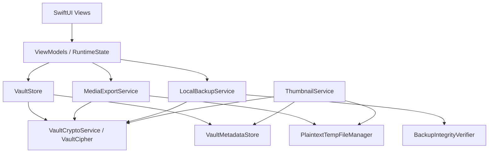
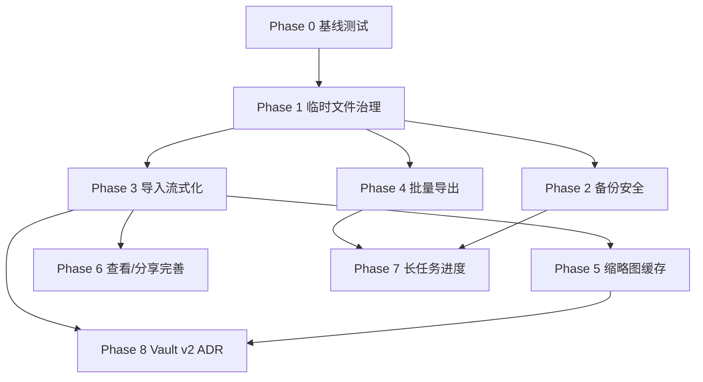

# LumaNox iOS 媒体加解密重构计划

本文基于 `docs/ios-media-crypto-technical-plan.md`，将媒体加解密整体方案拆成可执行的重构路线。目标是在不破坏现有 Vault 数据、Android 跨端备份兼容和当前页面可用性的前提下，逐步补齐真实导出、临时明文治理、备份完整性、缩略图缓存、metadata 能力和未来 AEAD 迁移基础。

## 1. 重构目标

### 1.1 业务目标

- 媒体导入、查看、缩略图、分享、导出、备份、恢复都通过统一的加解密服务边界。
- 批量导出从 mock 转为真实业务能力。
- 明文临时文件有统一生命周期，减少隐私泄露风险。
- 备份恢复路径具备完整性校验、路径安全校验和大文件稳定性。
- metadata 能支撑去重、导出、缩略图缓存、AI 扫描和未来 Vault 文件格式迁移。

### 1.2 技术目标

- 短期继续兼容当前 `AES-256-CBC + IV` 的 Vault v1 文件格式。
- 不在 P0 直接切换 Vault 文件加密协议，避免已导入媒体不可读。
- 把当前散落在 View、ViewModel、Store、Backup service 中的明文临时文件逻辑收拢。
- 所有大文件路径走 stream，避免整段明文进内存。
- 为 Vault v2 AEAD 做清晰扩展点，但单独阶段实施。

## 2. 总体策略

采用“先护栏、再出入口、再性能、最后协议升级”的节奏：

1. **护栏优先**：先做临时明文治理、路径校验、启动清理、备份完整性校验。
2. **出入口补齐**：补真实批量导出、分享清理、相机流式入库。
3. **索引增强**：metadata 补明文 hash、原始文件名、媒体属性、cipherVersion。
4. **性能优化**：缩略图磁盘缓存、大图下采样、进度与取消。
5. **协议演进**：设计并落地 Vault v2 AEAD 双读单写，再做后台迁移。

## 3. 目标架构



新增核心边界：

| 模块 | 所属目录 | 目标 |
|---|---|---|
| `VaultCryptoService` | `ios/LumaNox/Core/Crypto/` | 包装现有 `VaultCipher`，提供版本化文件协议入口 |
| `PlaintextTempFileManager` | `ios/LumaNox/Core/Vault/` 或 `Core/Security/` | 管理所有明文临时目录、TTL、启动清理 |
| `MediaMetadataExtractor` | `ios/LumaNox/Core/DataModel/` | 提取宽高、时长、MIME、UTType |
| `ThumbnailService` | `ios/LumaNox/Core/Vault/` | 统一图片/视频缩略图生成与缓存 |
| `MediaExportService` | `ios/LumaNox/Core/Vault/` 或 `Features/Export/` | 批量导出、分享、水印、进度、取消 |
| `BackupIntegrityVerifier` | `ios/LumaNox/Core/Backup/` | header/trailer/hash/path 校验 |
| `VaultMaintenanceService` | `ios/LumaNox/Core/Vault/` | 启动清理、临时文件回收、回收站过期清理 |

## 4. 阶段计划

### Phase 0：基线冻结与测试夹具

目标：先建立可回归的基线，避免重构过程中破坏现有 Vault 数据。

任务：

- 记录当前 Vault v1 文件格式样本：图片、视频、回收站、备份包。
- 增加基础单元测试夹具：
  - `VaultCipher` 小文件加密/解密。
  - `VaultCipher` stream 加密/解密。
  - `BackupPackageV1` header parse/build。
  - `VaultMetadataStore` reconcile。
- 新增测试用恶意备份路径样例：`../evil.jpg`、`/tmp/evil.jpg`、空路径、隐藏文件。
- 固化手动自测样本：1 张 JPEG、1 张 HEIC、1 个 MOV、1 个 Android 备份包。

产出：

- 测试夹具文件和最小单元测试。
- 不改业务行为。

验收：

- `xcodegen generate` 和 iOS build 通过。
- 现有导入、图片查看、视频播放、手动备份、恢复仍可用。

### Phase 1：明文临时文件治理

目标：先把隐私风险最大的临时明文生命周期收束。

任务：

- 新增 `PlaintextTempFileManager`：
  - 场景枚举：camera、videoPlayback、videoThumbnail、share、export、backup、restore。
  - 创建 session 目录。
  - 生成安全文件名。
  - 按场景 TTL 清理。
  - App 启动/解锁后清理过期文件。
- 替换现有临时明文路径：
  - `VaultStore+Camera.swift`：`Documents/camera_tmp` 迁移到 tmp/cache。
  - `VideoPlayerView.swift`：`Caches/video_cache` 由 manager 创建和清理。
  - `VaultThumbnailView.swift`：`tmp/vault_thumb_video` 由 manager 管理。
  - `MediaViews.swift`：`tmp/lumanox_share` 由 manager 管理。
  - `LocalBackupService.swift`：`tmp/backup_tmp` 由 manager 管理。
- 新增 `VaultMaintenanceService`：
  - 清理 `.enc_tmp_*`。
  - 清理 `tmp_` 导入残留。
  - 清理旧明文临时目录。
  - 调用回收站 30 天清理。

PR 切片：

1. 新增 manager 与 maintenance service，先不替换调用方。
2. 替换 video playback / thumbnail / share。
3. 替换 camera / backup / restore。
4. 接入 App 启动清理。

验收：

- 导入、分享、视频播放、缩略图功能不回退。
- App 冷启动后旧临时目录被清理。
- 取消分享/关闭视频页后对应明文文件删除。

### Phase 2：备份恢复完整性与安全加固

目标：保证恢复前能识别篡改包、恶意路径和错误 PIN，且不写入污染文件。

任务：

- 新增 `BackupIntegrityVerifier`：
  - 验证 magic/version/headerLen。
  - 验证 trailer：`SHA256(magic || version || headerLen || header || body)`。
  - 校验 asset relativePath：
    - 非空。
    - 非绝对路径。
    - 不包含 `..`。
    - 不以 `.` 开头。
    - 必须落在 `vault_albums` 目标根内。
  - 校验 asset frame range 单调、非负、总数一致。
- `BackupPackageV1.finalizePackage` 改为流式读取 body，避免 `Data(contentsOf: bodyFile)`。
- `BackupPackageV1.buildHeaderJson` 迁移为 `Codable` 编码，保持 JSON 字段与 Android 兼容。
- `LocalBackupService.restore`：
  - 在派生 key 和 trailer/path 校验通过后再进入写入阶段。
  - 失败时清理 `.enc_tmp_*`。
  - 错误 PIN 直接返回，不创建目标目录。
- 增加单元测试：
  - trailer 篡改失败。
  - body 篡改失败。
  - path traversal 失败。
  - 错误 PIN 不写入。

验收：

- iOS 自产 `.aivb` 可恢复。
- Android `.aivb` 可恢复。
- 被篡改的备份包恢复失败。
- 恢复失败后 Vault 目录无新增污染文件。

### Phase 3：导入与相机入库流式化

目标：所有大文件入库都避免整段明文进内存，并补齐 metadata 写入基础。

任务：

- `VaultStore.importPlainData`：
  - 设置大小阈值。
  - 大于阈值时先写受控临时文件，再调用 `importPlainFile`。
- `VaultStore.importPlainFile`：
  - 计算明文 SHA-256 与加密写入合并为单次读取或受控双 pass。
  - 写入后局部更新 metadata 或触发 reconcile。
- `VaultStore.finalizeCameraCapture`：
  - 改用 `encryptFileFromChunks`。
  - 相机临时文件进入 manager。
  - 写入 plain hash。
- 新增 `MediaMetadataExtractor`：
  - 图片宽高：ImageIO。
  - 视频时长/尺寸：AVFoundation。
  - MIME/UTType：UniformTypeIdentifiers。
- metadata 补齐字段：
  - `plainSha256Hex` 或复用并明确 `originalSha256Hex`。
  - `originalFileName`。
  - `mimeType` / `uti`。
  - `cipherVersion`。

兼容策略：

- metadata schema 继续向后兼容，旧字段缺失时默认值兜底。
- 已有文件通过 reconcile 保留旧记录，后台或进入详情时懒提取媒体属性。

验收：

- 多个大视频连续导入内存稳定。
- 相机录像入库后临时明文清理。
- metadata 损坏后仍可重建基础列表。
- 重复导入仍正确跳过。

### Phase 4：真实批量导出

目标：替换 `ExportViews.swift` mock，实现真实媒体选择、解密导出、进度、取消和清理。

任务：

- 新增 `ExportRuntimeState`：
  - 保存来源：album、recent、search、settings。
  - 保存 selected media ids / paths。
  - 保存导出结果。
- 新增 `MediaExportService`：
  - 输入 `[VaultMediaRecord]`。
  - 支持 share session 输出临时明文文件。
  - 支持保存到 Files 目录。
  - 支持取消 token。
  - 支持逐项结果：success、failed、skipped。
- `BulkExportView`：
  - 读取真实 metadata。
  - 三列真实缩略图。
  - 多选态不改变网格尺寸。
  - 底部操作栏显示已选数量。
- `ExportProgressView`：
  - 真实进度。
  - 返回或取消时弹确认。
  - 取消后清理当前 session。
- `ExportResultView`：
  - 展示成功、失败、保存位置或分享状态。
- 接入 paywall：
  - `exportNoWatermark` 只控制水印，不应阻塞普通导出。
  - 免费用户允许带水印图片导出，或按产品策略显示软/硬墙。

PR 切片：

1. RuntimeState + service 纯逻辑。
2. BulkExportView 接真实数据。
3. Progress/Result 接真实进度与取消。
4. 水印与会员门控。

验收：

- 从相册进入批量导出，只显示该相册媒体。
- 从设置进入批量导出，可选择全部 active media。
- 取消导出后无 session 明文残留。
- 大视频导出不 OOM。

### Phase 5：缩略图服务化与缓存

目标：减少重复解密和列表滚动开销，同时保持隐私控制。

任务：

- 新增 `ThumbnailService`：
  - 图片缩略图：按 target size 下采样。
  - 视频缩略图：临时解密抽帧。
  - 内存缓存：设置 `countLimit` / `totalCostLimit`。
  - 磁盘缓存：`Caches/LumaNox/thumbs/`。
- 缓存 key：
  - `storagePath + encryptedSha256Hex + targetPixelSize + mediaKind`。
- 缓存失效：
  - 删除、恢复、覆盖、purge 后失效。
  - metadata encrypted hash 变化后自然失效。
- `VaultMediaThumbnailView` 只负责 UI 状态，缩略图生成下沉到 service。

安全策略：

- 缩略图视为敏感派生数据。
- 磁盘缓存目录设置 Data Protection。
- App reset / purge 时清理缩略图缓存。

验收：

- 首页、相册、搜索、回收站缩略图正常。
- 连续滚动不明显重复解密。
- 删除后不显示旧缩略图。

### Phase 6：查看器与分享体验完善

目标：让图片查看、视频播放、单项分享真正共享同一套服务能力。

任务：

- `PhotoViewerView`：
  - 从来源列表构建翻页路径，而不是总回退到 recent。
  - 分享 dismiss 后删除 share file。
  - 信息弹窗改用 metadata、本地化 key。
- `VideoPlayerView`：
  - 使用 `PlaintextTempFileManager` session。
  - 文件名 UUID 化。
  - 退出、失败、重新加载都清理旧播放文件。
- `PhotoShareSheet`：
  - 添加 completion 回调，清理临时明文。
- 可选：抽象 `ShareService`，和 `MediaExportService` 复用核心解密输出。

验收：

- 从相册进入 viewer 后左右滑动仅在该相册内。
- 分享完成/取消后 share temp 被删除。
- 视频播放失败后也无残留明文。

### Phase 7：进度、取消与长任务运行时

目标：备份、恢复、导出等长任务有统一的进度模型和取消语义。

任务：

- 定义 `LongRunningTaskProgress`：
  - phase。
  - current / total。
  - currentFileName。
  - bytesWritten / totalBytes。
  - cancellable。
- `LocalBackupService`：
  - createManualBackup/createAutoBackup 支持 progress callback。
  - restore 支持 progress callback。
  - 取消时清理工作文件。
- `MediaExportService` 支持同一 progress model。
- UI 页面显示阶段文案，长任务返回需确认。

验收：

- 备份/恢复/导出进度非假进度。
- 取消导出不污染临时目录。
- 备份取消不产生不完整 `.aivb` 或 `backup.dat.writing`。

### Phase 8：Vault v2 AEAD 预研与 ADR

目标：在不急着迁移数据的情况下，把协议升级方案定清楚。

任务：

- 编写 ADR：Vault 文件 v2 加密协议。
- 评估选项：
  - AES-256-GCM。
  - ChaCha20-Poly1305 / XChaCha20-Poly1305。
  - v1 CBC + HMAC 过渡方案。
- 定义文件头：
  - magic。
  - version。
  - nonce。
  - chunk size。
  - optional metadata auth data。
- 定义双读单写：
  - v1 文件继续可读。
  - 新文件写 v2。
  - 备份包不受 Vault 文件格式影响，仍按明文 chunk 备份。
- 定义迁移策略：
  - 用户解锁后后台低优先级迁移。
  - 每个文件原子替换。
  - 迁移失败记录并重试。

验收：

- ADR 审批。
- v2 测试样本可读写。
- v1/v2 混合 Vault 列表、备份、恢复、缩略图均可工作。

## 5. 依赖关系



推荐先后顺序：

1. Phase 0。
2. Phase 1。
3. Phase 2 与 Phase 3 可并行，但写同一文件时要小心。
4. Phase 4。
5. Phase 5 与 Phase 6。
6. Phase 7。
7. Phase 8。

## 6. 文件级变更地图

### 高风险文件

| 文件 | 风险 | 重构方式 |
|---|---|---|
| `Core/Crypto/VaultCipher.swift` | 所有媒体读写依赖 | 先包一层 `VaultCryptoService`，避免大改原实现 |
| `Core/Crypto/VaultCipher+Stream.swift` | 备份/恢复/导入依赖 | 增加测试后小步改 |
| `Core/Backup/LocalBackupService.swift` | 长任务与跨端兼容 | 拆 verifier/progress，不一次性重写 |
| `Core/Backup/BackupPackageV1.swift` | 包格式兼容 | Codable 输出需严格比对 Android |
| `Core/Vault/VaultStore.swift` | 导入、列表、metadata | 新能力尽量下沉 service |
| `Components/VaultThumbnailView.swift` | 多页面使用 | UI 与 service 分离，保持接口兼容 |
| `Features/Export/ExportViews.swift` | 当前 mock | 可整体替换为真实 ViewModel |

### 新增文件建议

```text
ios/LumaNox/Core/Crypto/VaultCryptoService.swift
ios/LumaNox/Core/Vault/PlaintextTempFileManager.swift
ios/LumaNox/Core/Vault/VaultMaintenanceService.swift
ios/LumaNox/Core/Vault/ThumbnailService.swift
ios/LumaNox/Core/Vault/MediaExportService.swift
ios/LumaNox/Core/DataModel/MediaMetadataExtractor.swift
ios/LumaNox/Core/Backup/BackupIntegrityVerifier.swift
ios/LumaNox/Features/Export/ExportViewModels.swift
```

## 7. PR 拆分建议

### PR 1：基线测试与 fixtures

- 加密/解密测试。
- 备份 header 测试。
- metadata reconcile 测试。
- 不改运行时代码。

### PR 2：PlaintextTempFileManager

- 新增 manager。
- 替换 video thumbnail/video playback/share。
- 接入启动清理。

### PR 3：BackupIntegrityVerifier

- trailer 校验。
- path 校验。
- body finalize 流式化。
- 恶意包测试。

### PR 4：导入和相机流式化

- `importPlainData` 阈值。
- 相机录像流式加密。
- metadata hash/属性补齐。

### PR 5：真实批量导出

- `MediaExportService`。
- Export runtime state。
- Bulk/Progress/Result 真实数据。

### PR 6：缩略图服务与磁盘缓存

- `ThumbnailService`。
- `VaultMediaThumbnailView` 简化。
- 缓存失效。

### PR 7：查看器与分享收尾

- 来源列表翻页。
- 分享完成清理。
- 本地化信息弹窗。

### PR 8：长任务进度统一

- 备份/恢复/导出统一进度模型。
- 取消语义。

### PR 9：Vault v2 ADR 与 PoC

- ADR。
- v2 文件样本。
- 双读单写 PoC。

## 8. 验证计划

### 每个 PR 必跑

```bash
cd ios
xcodegen generate
xcodebuild -scheme LumaNox -project LumaNox.xcodeproj -sdk iphonesimulator -destination 'platform=iOS Simulator,name=iPhone 16' build
```

涉及 UI 或行为的 PR 还需：

```bash
xcrun simctl install booted build/Build/Products/Debug-iphonesimulator/LumaNox.app
xcrun simctl launch booted com.xpx.vault
xcrun simctl io booted screenshot /tmp/lumanox-sim/media-crypto-refactor.png
```

### P0 手动回归

- 首次 PIN 设置和解锁。
- PhotosPicker 导入图片/视频。
- 图片查看。
- 视频播放。
- 删除、恢复、永久删除。
- 手动备份 `.aivb`。
- 手动恢复。
- 自动备份 `backup.dat`。
- 批量导出。

### 安全回归

- 错 PIN 恢复不写入。
- 篡改 header/body/trailer 恢复失败。
- path traversal 恢复失败。
- App 冷启动清理旧明文临时目录。
- 日志不含 PIN、key、完整明文路径。

### 跨端回归

- Android -> iOS `.aivb` 恢复。
- iOS -> Android `.aivb` 恢复。
- iOS 自动 `backup.dat` 首启恢复。
- Android 自动包如格式一致，iOS 可读。

## 9. 风险与缓解

| 风险 | 影响 | 缓解 |
|---|---|---|
| Vault 文件协议误改 | 已导入媒体不可读 | P0 不改协议，先加测试和包装层 |
| 备份 JSON 字段顺序/命名变化 | Android 跨端恢复失败 | Codable 输出后与 Android 样本二进制/语义比对 |
| 临时明文清理过早 | 分享/播放中断 | 使用 session 生命周期和 Sheet completion 回调 |
| 大视频导入/导出 OOM | 崩溃 | 所有大文件走 stream，设置阈值测试 |
| metadata schema 扩展破坏旧索引 | 列表空或字段丢失 | Codable 默认值和 reconcile fallback |
| BGTask 不稳定 | 自动备份误判失败 | 冷启补跑和 UX 文案不承诺精确时间 |
| Vault v2 迁移失败 | 数据损坏 | 独立 ADR/PoC，逐文件原子迁移，保留 v1 读能力 |

## 10. 发布门槛

P0 发布前必须满足：

- `Phase 1`、`Phase 2`、`Phase 4` 完成。
- 批量导出不再使用 mock。
- 备份恢复支持 trailer/path 校验。
- 明文临时文件冷启动清理可验证。
- iOS 自产备份可恢复。
- 至少通过一个 Android -> iOS 或 iOS -> Android 交叉恢复用例。

P1 发布前建议满足：

- `Phase 3`、`Phase 5`、`Phase 6` 完成。
- 大视频导入/备份/导出内存稳定。
- 缩略图磁盘缓存可用且失效正确。
- metadata 字段能支撑 AI 和导出。

P2 可作为后续版本：

- `Phase 7`、`Phase 8`。
- 长任务统一进度。
- Vault v2 AEAD 设计与迁移 PoC。

## 11. 立即可开的任务

1. 新建 `PlaintextTempFileManager` 并替换 `VaultThumbnailView` 的视频抽帧临时文件。
2. 给 `BackupPackageV1.finalizePackage` 做 body 流式 digest。
3. 给 `LocalBackupService.restore` 增加 relativePath 校验。
4. 新建 `MediaExportService` 的纯逻辑骨架，不动 UI。
5. 给 `ExportViews.swift` 加真实 ViewModel 前先拆 `ExportRuntimeState`。

