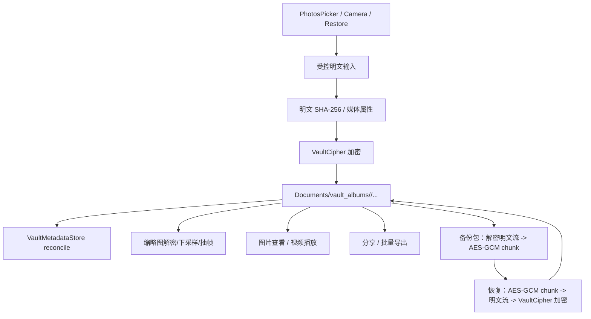

# LumaNox iOS 媒体加解密技术方案

本文梳理 iOS 工程下媒体导入、加密存储、解密预览、缩略图、导出、备份与恢复的完整技术方案。Android 是行为与跨端兼容参考，iOS 现有实现是落地基线。

## 1. 目标与范围

目标：

- 所有入库媒体在落盘到保险箱前完成本地加密。
- 图片、视频、缩略图、分享、导出、备份、恢复都通过统一的 Vault 加解密入口。
- 明文只允许存在于受控临时目录、内存缓冲或系统分享/导出事务中，并具备清理策略。
- 备份包保持 Android 与 iOS 双向兼容。
- metadata 仅作为可重建索引，不替代加密文件事实源。

范围：

- 媒体导入：PhotosPicker、私密相机、恢复导入、未来隐私打码产物。
- 加密存储：`Documents/vault_albums/`、`Documents/vault_trash/`。
- 解密消费：图片查看、视频播放、缩略图、AI 输入、分享、批量导出、备份。
- 备份恢复：手动 `.aivb`、自动 `backup.dat`。

## 2. 当前工程基线

| 能力 | 当前状态 | 关键文件 |
|---|---|---|
| Vault 文件加密 | 已实现 AES-256-CBC，16B IV 前置，数据密钥保存在 Keychain | `ios/LumaNox/Core/Crypto/VaultCipher.swift`、`AESCBC.swift`、`VaultCipher+Stream.swift` |
| PhotosPicker 导入 | 已实现文件优先、Data 兜底、SHA-256 明文去重、流式加密 | `VaultHomeViewModel.swift`、`VaultStore.swift` |
| 私密相机入库 | 已实现拍照/录像临时明文，再加密进入 vault | `VaultStore+Camera.swift`、`CameraSessionController.swift` |
| metadata 索引 | 已实现扫描 `vault_albums` / `vault_trash` 并原子写 JSON | `VaultMetadataStore.swift`、`VaultMetadataModels.swift` |
| 图片缩略图 | 已实现解密后 ImageIO 下采样 | `VaultThumbnailView.swift` |
| 视频缩略图 | 已实现解密到临时文件后 `AVAssetImageGenerator` 抽帧，并立即清理 | `VaultThumbnailView.swift` |
| 视频播放 | 已实现解密到 `Caches/video_cache`，退出页清理，启动前清理 1h 旧缓存 | `VideoPlayerView.swift` |
| 单图分享 | 已实现解密到 `tmp/lumanox_share` 并拉起系统分享 | `MediaViews.swift` |
| 批量导出 | 当前仍是 mock 网格与模拟进度 | `ExportViews.swift` |
| 手动/自动备份 | 已实现 Android 兼容 `AIVAULT\x01` v1 包格式，body 用 AES-256-GCM chunk | `LocalBackupService.swift`、`BackupPackageV1.swift` |
| 恢复 | 已实现 PIN 派生 backup key，逐 chunk 解密，再用 VaultCipher 重新入库 | `LocalBackupService.swift` |

## 3. 端到端数据流

核心原则：

- Vault 内只保存密文文件；metadata 不保存明文内容。
- 备份包不直接复制 Vault 密文，而是将 Vault 文件流式解密为明文 chunk，再用备份密钥 AES-GCM 加密。恢复时反向执行。
- UI 层不直接读写密钥，不拼装加密协议，只消费 `VaultStore`、`VaultCipher`、`LocalBackupService` 等服务。

## 4. 存储布局

| 数据 | 目标路径 | 说明 |
|---|---|---|
| 活跃媒体密文 | `Documents/vault_albums/<album>/asset_<sha256>.<ext>` 或 `camera_<timestamp>.<ext>` | 保险箱事实源 |
| 回收站密文 | `Documents/vault_trash/<album>/<file>` | 保留原相册归属，30 天清理 |
| metadata | `Application Support/LumaNox/vault_metadata_v1.json` | 可重建索引，原子写 |
| 视频播放明文 | `Caches/video_cache/play_*.mov` | 退出页面删除，启动播放前清理 1h 旧文件 |
| 视频缩略图明文 | `tmp/vault_thumb_video/<uuid>.<ext>` | 抽帧完成后立即删除 |
| 分享明文 | `tmp/lumanox_share/<name>` | 分享结束或下次清理时删除 |
| 备份工作文件 | `tmp/backup_tmp/*.bin|*.writing` | 备份完成后删除 |
| 自动备份文件 | 用户授权 Files 目录下 `backup.dat` | security-scoped bookmark |

调整建议：

- 私密相机当前明文临时目录在 `Documents/camera_tmp`，应迁移到 `Caches/LumaNox/camera_tmp` 或 `tmp/camera_tmp`，避免临时明文进入 iTunes/iCloud 文件备份语义。
- 分享与导出临时目录应增加统一 `PlaintextTempFileManager`，负责命名、TTL 清理、场景隔离和 App 冷启动清理。

## 5. 加密协议设计

### 5.1 Vault 文件加密

当前协议：

- 算法：AES-256-CBC + PKCS7 padding。
- 格式：`IV(16B) || ciphertext`。
- 数据密钥：32B 随机 key，iOS 存 Keychain，`kSecAttrAccessibleWhenUnlockedThisDeviceOnly`。
- 读写方式：
  - 小文件可走 `encryptFile` / `decryptFile`。
  - 大文件与备份恢复必须走 `encryptFileFromChunks` / `decryptStream`，避免整段明文驻留。

近期保持：

- 为保证与 Android 当前 `VaultCipher` 格式兼容，iOS 继续读写 CBC v1。
- 所有新媒体写入必须用流式接口，除非明确是小图或系统 picker Data fallback。

中期升级：

- 引入版本化 Vault 文件头，例如 `LNVLT\x02`。
- v2 使用 AES-256-GCM 或 XChaCha20-Poly1305，做到机密性与完整性一体化。
- `VaultCipher` 支持 v1/v2 双读，新写 v2；后台迁移逐文件执行，失败不阻塞 App。
- metadata 增加 `cipherVersion`、`plainSha256Hex`、`mediaFingerprint` 等字段，辅助迁移和一致性验证。

### 5.2 备份包加密

当前协议：

- Magic：`AIVAULT\x01`。
- Version：`1`。
- Header：明文 JSON，包含 backupId、createdAtMs、kind、KDF 参数、key fingerprint、asset index。
- KDF：用户 PIN + Argon2id 参数派生 32B backup key。
- Body：每个明文 chunk 使用 AES-256-GCM，12B nonce，16B tag，最大明文 chunk 为 1MB。
- Trailer：`SHA256(magic || version || headerLen || header || body)`。

恢复流程：

1. 读取 header。
2. 使用 header 中的 Argon2id 参数和用户 PIN 派生 backup key。
3. 校验 key fingerprint，不匹配则拒绝写入。
4. 按 header asset 顺序读取 frame，AES-GCM 解密为明文。
5. 计算明文 SHA-256，写入 Vault 时再用 VaultCipher 加密。
6. 明文 hash 与 header asset hash 一致才视为恢复成功。

改进项：

- `BackupPackageV1.Reader` 应校验 trailer，当前恢复路径主要依赖 AES-GCM tag 和每个 asset 明文 SHA-256，仍应补上整包 trailer 校验。
- `finalizePackage` 当前读取整个 body 文件到内存，应改为流式读取 body 并更新 digest，避免大备份 OOM。
- Header JSON 构造应迁移到 `Codable`，避免手写 JSON 拼接遗漏转义。

## 6. 媒体导入方案

### 6.1 PhotosPicker 导入

当前流程：

1. UI 使用 `PhotosPickerItem` 多选。
2. 优先 `FileRepresentation`，复制到系统临时目录；失败时使用 `Data` 兜底。
3. 计算明文 SHA-256。
4. 目标路径：`vault_albums/<album>/asset_<sha256>.<ext>`。
5. 已存在且可解密为媒体时判定重复。
6. 通过 `VaultCipher.encryptFileFromChunks` 或 `encryptFile` 加密写入。
7. 删除 picker 临时明文，刷新 metadata snapshot。

完善要求：

- 文件导入路径统一使用流式加密；Data fallback 只用于小文件，超过阈值应写入临时文件再流式加密。
- 导入任务串行或限制并发为 2，避免多视频导入时内存和 I/O 激增。
- 导入结束后补充媒体属性提取：宽、高、视频时长、原始文件名、UTType/MIME。
- `originalSha256Hex` 应在 metadata 中落地，避免未来只能通过文件名恢复去重关系。
- 导入失败必须区分权限、读取失败、加密失败、磁盘不足、重复跳过。

### 6.2 私密相机入库

当前流程：

1. AVFoundation 拍照/录像到临时明文文件。
2. `VaultStore.finalizeCameraCapture` 检查文件存在且非空。
3. 目标路径：`vault_albums/<album>/camera_<timestamp>.<ext>`。
4. `VaultCipher.encryptFile` 加密后删除临时文件。
5. 刷新 metadata。

完善要求：

- 相机临时明文改到 `Caches` 或 `tmp`，并在启动时清理残留。
- 录像文件应走流式加密，避免 `encryptFile` 一次性读入内存。
- 相机入库也计算明文 SHA-256，支持重复检测和备份校验。
- 失败时确保临时明文被删除，除非用户明确选择重试且文件仍需保留。

### 6.3 恢复入库

恢复不经过 PhotosPicker，而是：

1. 备份包 AES-GCM 解密得到明文 chunk。
2. `VaultCipher.encryptFileFromChunks` 直接写入目标 Vault 密文文件。
3. 校验明文 SHA-256。
4. 刷新 metadata。

要求：

- 恢复目标路径必须归一化，禁止 `../`、绝对路径、隐藏文件名穿越。
- 已存在同 hash 文件跳过；同路径不同内容要生成冲突后缀或进入冲突策略。
- 恢复完成后触发 metadata reconcile 与可选自动备份同步。

## 7. 解密消费方案

### 7.1 图片查看

当前 `PhotoViewerView` 使用 `VaultThumbnailView` 以较大 `targetPixelSize` 解密下采样展示。

建议：

- 小图可直接用当前路径；大图查看器应支持渐进式或按屏幕尺寸下采样，避免完整原图常驻内存。
- 查看器需要使用 metadata 中的当前相册/搜索列表顺序，而不仅是最近列表，保证从相册进入时翻页范围正确。
- 信息弹窗中的 Name/Size 等硬编码需迁移本地化并优先使用 metadata。

### 7.2 视频播放

当前流程：

1. 进入 `VideoPlayerView`。
2. 将 Vault 密文解密到 `Caches/video_cache/play_*.ext`。
3. `AVPlayer` 播放临时明文。
4. 页面消失时删除该临时文件；准备播放前清理 1h 旧缓存。

建议：

- 长视频先保持临时文件方案，稳定性优先。
- 中期可封装 `VaultAVAssetResourceLoader`，按需解密 range，减少明文落盘和等待时间。
- 播放缓存文件名不得暴露原始相册结构，可使用 UUID + 原扩展名。

### 7.3 缩略图

当前流程：

- 图片：`VaultCipher.decryptFile` 解密到 Data，ImageIO 下采样。
- 视频：解密到 `tmp/vault_thumb_video`，抽帧后删除。
- 缓存：内存 `NSCache<NSString, UIImage>`，key 为 path + 类型 + targetPixelSize。

完善要求：

- 图片缩略图也应支持流式临时文件或大小阈值，避免大图 `Data(contentsOf:)`。
- 增加磁盘缩略图缓存：`Caches/LumaNox/thumbs/<encryptedSha256>_<size>.jpg`，缓存文件可二次加密或视为派生敏感数据加系统 protected attributes。
- 缩略图缓存失效依据：`storagePath + encryptedSha256Hex + targetSize`，删除/恢复/覆盖后自动失效。
- 内存缓存限制 `countLimit` / `totalCostLimit`，避免长列表滚动时图片占用过高。

## 8. 导出与分享方案

### 8.1 单项分享

当前 `PhotoViewerView` 已能将当前图片解密到 `tmp/lumanox_share` 并打开系统分享。

完善要求：

- `PhotoShareSheet` dismiss 后删除 shareURL。
- 分享前清理 1h 以上残留。
- 根据付费状态决定是否加水印；图片加水印要走解密临时文件 -> CoreGraphics 绘制 -> JPEG/PNG 输出，视频暂不加水印或另开任务。
- 分享文件名使用 `LumaNox_<tail>.<ext>`，避免暴露 `asset_<hash>` 全量 hash。

### 8.2 批量导出

当前 `ExportViews.swift` 仍是 mock，应补齐真实实现。

目标架构：

- `MediaExportService`
  - 输入：`[VaultMediaRecord]`、导出模式、是否跳过水印、取消 token。
  - 输出：进度、成功项、失败项、临时文件列表或系统保存结果。
- `ExportRuntimeState`
  - 保存待导出 selection，避免路由参数携带大量路径。
- `BulkExportViewModel`
  - 从 `VaultMetadataStore` 读取真实媒体，支持全选/反选/按相册筛选。
- `ExportProgressViewModel`
  - 串行或小并发解密，实时上报进度，可取消。

iOS 导出模式：

| 模式 | 方案 | 适用 |
|---|---|---|
| 系统分享 | 解密到 `tmp/lumanox_export/session_<id>/` 后 `UIActivityViewController` | 用户把多项发给其他 App |
| 保存到文件 | `UIDocumentPickerViewController` 选择目录后写入 | 类似 Android 批量导出 |
| 保存到相册 | `PHPhotoLibrary.performChanges` 写入相册 | 后续可选，需相册写权限 |

安全要求：

- 导出临时目录按 session 隔离，完成/取消/失败都清理。
- 取消时停止后续解密，已写入临时明文立即删除。
- 对大视频只流式解密到目标，不在内存中聚合。

## 9. 备份与恢复方案

### 9.1 手动备份

流程：

1. 用户触发导出 `.aivb`。
2. 校验 paywall/quota、backup key cache、Vault 非空、磁盘空间。
3. 扫描 `vault_albums` 中有效密文文件。
4. 对每个文件 `decryptStream`，按 1MB 明文 chunk 写入 BackupPackage body。
5. body chunk 使用 backup key AES-GCM 加密。
6. 写 header + body + trailer 到 `.writing`。
7. 拷贝到用户选择的 `.aivb`。

改进：

- 支持真实进度：scan、decrypting、writing、finalizing 四阶段。
- 输出 URL 需要 security-scoped access 判断。
- 最终 `.aivb` 写入也应走临时文件 + 原子替换。

### 9.2 自动备份

流程：

1. 用户通过文件夹 picker 授权 Files 目录，保存 security-scoped bookmark。
2. 后台或冷启补跑时校验 `BackupSecretsStore.hasCached` 与目录可写。
3. 写本地临时包。
4. `ExternalBackupLocation.atomicReplaceAuto` 将临时包复制为 `backup.dat.writing`，再轮换 `backup.dat.bak`。

策略：

- BGTask 不保证精确 24h，UX 只表达“自动定期备份”。
- 冷启超过 8h 可延迟补跑一次。
- 修改 PIN 后强制刷新 backup key 并触发自动备份。
- 恢复成功后如目录已授权，触发一次自动同步。

### 9.3 恢复

流程：

1. 首启自动恢复：从已授权目录复制 `backup.dat` 到临时文件。
2. 手动恢复：从文件 picker 复制 `.aivb` 到临时文件。
3. 输入原备份 PIN。
4. 读取 header，Argon2id 派生 key，校验 fingerprint。
5. 逐 asset 解密、校验、重新加密入 Vault。
6. reconcile metadata，返回恢复结果。

安全要求：

- 错 PIN 不写入任何 Vault 文件。
- asset path 必须路径归一化和白名单校验。
- 恢复中断后的 `.enc_tmp_*` 下次 reconcile/启动时清理。
- trailer 校验失败时整体失败，不进入恢复写入阶段。

## 10. metadata 与索引方案

当前 `VaultMediaRecord` 已包含 storagePath、albumName、fileName、mediaKind、state、encryptedSizeBytes、hash、宽高、时长、source、AI metadata。

补齐字段建议：

- `cipherVersion: Int`：Vault 文件协议版本。
- `originalFileName: String?`：用户导入时的原始名称。
- `mimeType: String?` / `uti: String?`。
- `plainSha256Hex: String?`：明文 hash，去重和恢复校验可复用。
- `thumbnailCacheKey: String?` 或基于 encrypted hash 派生。
- `lastVerifiedAtMs: Int64?`：备份/恢复/健康检查时间。

写入策略：

- 导入/恢复/删除后只做局部更新；冷启动或用户进入媒体页时可 `reconcile`。
- metadata 原子写；损坏时丢弃并重建。
- AI 结果首期可继续写 `VaultAiMetadata`，后续数据量变大再拆 `ai_results_v1.json`。

## 11. 安全与隐私控制

必须执行：

- 不记录 PIN、backup key、Vault data key、Argon2 salt 之外的派生秘密。
- 日志中避免输出完整明文临时路径；必要时只输出文件名或 session id。
- 明文临时文件集中管理，App 启动、解锁、退出媒体页、导出完成、备份完成时清理。
- Keychain 项继续使用 `ThisDeviceOnly`，避免设备迁移带走 Vault data key。
- 备份密钥缓存由 Keychain wrap key AES-GCM 保护；退出登录/重置保险箱时清理。
- 支持 iOS Data Protection：Vault 目录和临时目录设置 `.completeFileProtection` 或等价属性。

应补齐：

- Vault v1 CBC 缺少认证，应增加文件级 HMAC 或迁移 v2 AEAD。
- 备份恢复 trailer 验证。
- 路径穿越防护。
- 大文件导入、缩略图、分享的内存阈值。
- 明文临时目录冷启动清理。

## 12. 推荐模块拆分

新增或调整：

| 模块 | 职责 |
|---|---|
| `VaultCryptoService` | 对外暴露 encrypt/decrypt stream，屏蔽 v1/v2 协议 |
| `PlaintextTempFileManager` | 管理 camera/playback/thumb/share/export/backup 临时明文 |
| `MediaMetadataExtractor` | 从明文文件或流提取宽高、时长、MIME、UTType |
| `ThumbnailService` | 内存+磁盘缩略图缓存、失效、视频抽帧 |
| `MediaExportService` | 单项/批量导出、分享、水印、取消、进度 |
| `BackupIntegrityVerifier` | header/trailer/hash/path 校验 |
| `VaultMaintenanceService` | 启动清理 `.enc_tmp_*`、旧临时明文、过期回收站 |

## 13. 实施里程碑

### P0：补齐真实出入口与安全底线

- 实现真实批量导出，替换 `ExportViews.swift` mock。
- 增加 `PlaintextTempFileManager`，统一清理分享、视频、缩略图、相机、导出临时明文。
- 相机录像入库改为流式加密。
- 恢复路径增加 asset relativePath 校验。
- 备份包恢复增加 trailer 校验。
- 导入/恢复后写入 `originalSha256Hex` 或 `plainSha256Hex`。

### P1：性能与完整体验

- 缩略图增加磁盘缓存和缓存失效。
- 备份/恢复/导出接入真实进度与取消。
- 图片查看支持屏幕尺寸下采样与相册内翻页。
- 补齐媒体宽高、视频时长、MIME、本地化信息弹窗。
- Android ↔ iOS `.aivb` 和 `backup.dat` 双向恢复测试。

### P2：加密协议演进

- 设计 Vault v2 AEAD 文件格式。
- `VaultCipher` 双读 v1/v2，新写 v2。
- 后台渐进迁移，失败可重试。
- metadata schema v2。

## 14. 验收清单

P0：

- PhotosPicker 导入多图和视频，Vault 目录只出现密文。
- 重复导入同一媒体不产生重复记录。
- 图片查看、视频播放、真实缩略图可用。
- 删除、恢复、永久删除后 metadata 与缩略图状态正确。
- 手动备份 `.aivb` 可恢复；错误 PIN 不写入。
- 自动备份 `backup.dat` 可创建、覆盖、恢复。
- 批量导出真实解密文件，完成/取消后无临时明文残留。

P1：

- 500MB 视频导入、播放、备份、恢复过程中无明显内存峰值。
- Android 备份可在 iOS 恢复，iOS 备份可在 Android 恢复。
- App 冷启动后旧 `video_cache`、`vault_thumb_video`、`lumanox_share`、`backup_tmp`、`camera_tmp` 被清理。
- metadata 损坏后能重建。

安全：

- 日志不含 PIN、密钥、完整明文路径。
- Keychain 删除或设备迁移后无法解密原 Vault 文件，符合 ThisDeviceOnly 预期。
- 恢复包 path traversal 用例被拒绝。
- 备份 body 或 trailer 被篡改后恢复失败。

