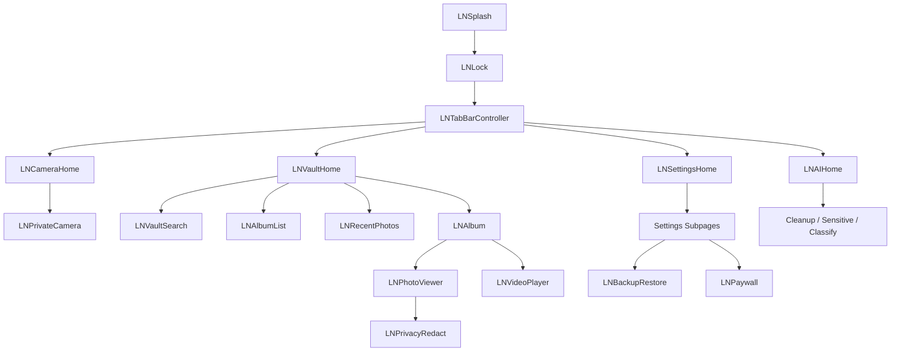

# LumaNox iOS 页面与 UX 对齐规范

本文基于 Android 工程的导航图、Compose 页面、弹窗组件与设计令牌整理，用于 iOS 端进行页面复刻、交互对齐与组件规范落地。

分析来源主要包括：

- `android/app/src/main/kotlin/com/xpx/vault/MainActivity.kt`
- `android/app/src/main/kotlin/com/xpx/vault/ui/`
- `android/app/src/main/kotlin/com/xpx/vault/ui/components/`
- `android/app/src/main/kotlin/com/xpx/vault/ui/theme/`
- `android/app/src/main/res/values/strings.xml`
- `android/app/src/main/res/values-en/strings.xml`

## 1. Android 页面全景

### 1.1 应用壳与启动流

| # | Android 文件 | 路由 | 功能说明 | iOS 建议 View |
|---|---|---|---|---|
| 1 | `SplashScreen.kt` | `splash` | 品牌闪屏、版本与加密标识 | `LNSplashViewController` |
| 2 | `lock/LockScreen.kt` | `lock` | PIN 解锁、首次设置 PIN、生物识别引导 | `LNLockViewController` |
| 3 | `MainScreen.kt` | `main` | 四 Tab 容器，非独立页面 UI | `LNTabBarController` |

### 1.2 主 Tab

`MainScreen` 内嵌四个主 Tab，Android 通过透明叠层保留各 Tab 状态；iOS 建议使用 `UITabBarController` 或自定义 floating tab bar 保持同等结构。

| # | Android 文件 | Tab | 功能说明 | iOS 建议 View |
|---|---|---|---|---|
| 4 | `HomeScreen.kt` | VAULT | 保险箱首页：相册网格、导入、空态、底栏 | `LNVaultHomeViewController` |
| 5 | `CameraHomeScreen.kt` | CAMERA | 相机 Tab 引导/空态，点击 Tab 进入全屏相机 | `LNCameraHomeViewController` |
| 6 | `AiHomeScreen.kt` | AI | AI 助手首页：建议卡与 6 项功能入口 | `LNAIHomeViewController` |
| 7 | `SettingsHomeScreen.kt` | SETTINGS | 设置一级 Hub，包含 6 个分组入口 | `LNSettingsHomeViewController` |

### 1.3 媒体与相册

| # | Android 文件 | 路由 | 功能说明 | iOS 建议 View |
|---|---|---|---|---|
| 8 | `PrivateCameraScreen.kt` | `private_camera` | 私密相机，全屏拍摄 | `LNPrivateCameraViewController` |
| 9 | `VaultSearchScreen.kt` | `vault_search` | 保险箱搜索 | `LNVaultSearchViewController` |
| 10 | `AlbumListScreen.kt` | `album_list` | 相册列表 | `LNAlbumListViewController` |
| 11 | `RecentPhotosScreen.kt` | `recent_list` | 最近照片，隐私打码入口池 | `LNRecentPhotosViewController` |
| 12 | `AlbumScreen.kt` | `album/{albumName}` | 单相册网格、多选导出 | `LNAlbumViewController` |
| 13 | `PhotoViewerScreen.kt` | `photo_viewer/{path}` | 图片查看、信息、删除、打码 | `LNPhotoViewerViewController` |
| 14 | `VideoPlayerScreen.kt` | `video_player/{path}` | 视频播放 | `LNVideoPlayerViewController` |
| 15 | `PhotoViewerScreen.kt` | `trash_photo_viewer/{path}` | 回收站图片查看 | `LNTrashPhotoViewerViewController` |
| 16 | `VideoPlayerScreen.kt` | `trash_video_player/{path}` | 回收站视频播放 | `LNTrashVideoPlayerViewController` |

### 1.4 备份、导出与回收站

| # | Android 文件 | 路由 | 功能说明 | iOS 建议 View |
|---|---|---|---|---|
| 17 | `BackupRestoreScreen.kt` | `backup_restore` | 手动备份/恢复、自动备份配置 | `LNBackupRestoreViewController` |
| 18 | `BackupProgressScreen.kt` | `backup_progress/{outputUri}` | 备份进度 | `LNBackupProgressViewController` |
| 19 | `BackupResultScreen.kt` | `backup_result` | 备份结果页 | `LNBackupResultViewController` |
| 20 | `RestoreProgressScreen.kt` | `restore_progress/{inputUri}` | 恢复进度 | `LNRestoreProgressViewController` |
| 21 | `RestoreResultScreen.kt` | `restore_result` | 恢复结果页 | `LNRestoreResultViewController` |
| 22 | `BulkExportScreen.kt` | `bulk_export` | 批量导出选择 | `LNBulkExportViewController` |
| 23 | `ExportProgressScreen.kt` | `export_progress` | 导出进度 | `LNExportProgressViewController` |
| 24 | `ExportResultScreen.kt` | `export_result` | 导出结果 | `LNExportResultViewController` |
| 25 | `TrashBinScreen.kt` | `trash_bin` | 回收站列表 | `LNTrashBinViewController` |

### 1.5 订阅与设置子页

| # | Android 文件 | 路由 | 功能说明 | iOS 建议 View |
|---|---|---|---|---|
| 26 | `PaywallScreen.kt` | `paywall?dismissable&source` | 会员付费墙 | `LNPaywallViewController` |
| 27 | `ChangePinScreen.kt` | `change_pin` | 修改/首次设置 PIN | `LNChangePinViewController` |
| 28 | `StorageUsagePlaceholderScreen.kt` | `storage_usage` | 存储占用，占位页 | `LNStorageUsageViewController` |
| 29 | `LanguageSettingsScreen.kt` | `language_settings` | 语言切换 | `LNLanguageSettingsViewController` |
| 30 | `settings/SettingsDetailScreens.kt` | `settings_subscription` | 订阅与配额 | `LNSettingsSubscriptionViewController` |
| 31 | `settings/SettingsDetailScreens.kt` | `settings_security` | 安全与隐私 | `LNSettingsSecurityViewController` |
| 32 | `settings/SettingsDetailScreens.kt` | `settings_backup_sync` | 备份与同步 | `LNSettingsBackupViewController` |
| 33 | `settings/SettingsDetailScreens.kt` | `settings_data_storage` | 数据与存储 Hub | `LNSettingsDataViewController` |
| 34 | `settings/SettingsDetailScreens.kt` | `settings_general` | 通用设置 | `LNSettingsGeneralViewController` |
| 35 | `settings/SettingsDetailScreens.kt` | `settings_about` | 关于与支持 | `LNSettingsAboutViewController` |
| 36 | `settings/LegalWebViewScreen.kt` | `privacy_policy` | 隐私政策 Web | `LNPrivacyPolicyViewController` |
| 37 | `settings/LegalWebViewScreen.kt` | `terms_of_service` | 服务条款 Web | `LNTermsViewController` |

### 1.6 AI 功能页

| # | Android 文件 | 路由 | 功能说明 | iOS 建议 View |
|---|---|---|---|---|
| 38 | `ai/AiCleanupScreen.kt` | `ai_cleanup` | 模糊/重复清理 | `LNAICleanupViewController` |
| 39 | `ai/AiSensitiveReviewScreen.kt` | `ai_sensitive` | 敏感内容审查 | `LNAISensitiveReviewViewController` |
| 40 | `ai/AiClassifyScreen.kt` | `ai_classify` | 智能分类，含分类详情子态 | `LNAIClassifyViewController` |
| 41 | `ai/AiFeaturePlaceholderScreen.kt` | `ai_privacy` | 隐私打码占位，主路径已改走最近列表 | 可省略或合并 |
| 42 | `ai/PrivacyRedactScreen.kt` | `ai_privacy_redact/{path}` | 隐私打码画布 | `LNPrivacyRedactViewController` |

### 1.7 内嵌子态

| 场景 | 所在文件 | 说明 |
|---|---|---|
| 相册权限引导卡 | `HomeScreen.kt` | 未授权时的引导卡片 |
| 导入 Loading | `HomeScreen.kt` | 导入进度提示 |
| AI 扫描态卡片 | `AiHomeScreen.kt` | scanning / sensitive / cleanup / allClear |
| 相机设置面板 | `PrivateCameraScreen.kt` | 闪光灯、定时器、网格等设置面板 |
| 分类详情 | `AiClassifyScreen.kt` | 二级 `AppTopBar` + 分类媒体网格 |
| 备份结果内嵌卡 | `BackupRestoreScreen.kt` | 页面内卡片样式，非窗口级 Dialog |

## 2. 弹窗清单

### 2.1 统一弹窗组件

| 组件 | 类型 | 用途 |
|---|---|---|
| `AppDialog` | 确认/提示 | 单按钮或双按钮确认框 |
| `AppInputDialog` | 文本输入 | 新建相册、命名类输入 |
| `PinInputDialog` | PIN 输入 | 6 位 PIN 圆点输入 |
| `MediaInfoDialog` | 信息展示 | 媒体元信息键值对 |

### 2.2 弹窗实例

| 弹窗 ID | 组件 | 触发页面 | 场景 | 危险操作 |
|---|---|---|---|---|
| `LNAlbumCreateDialog` | `AppInputDialog` | `HomeScreen`, `AlbumListScreen` | 新建相册 | 否 |
| `LNAICleanupConfirmDialog` | `AppDialog` | `AiCleanupScreen` | 一键清理确认 | 是 |
| `LNPhotoDeleteDialog` | `AppDialog` | `PhotoViewerScreen` | 移入回收站 | 是 |
| `LNPhotoPurgeDialog` | `AppDialog` | `PhotoViewerScreen` | 永久删除 | 是 |
| `LNPhotoInfoDialog` | `MediaInfoDialog` | `PhotoViewerScreen` | 文件元信息 | 否 |
| `LNVideoDeleteDialog` | `AppDialog` | `VideoPlayerScreen` | 删除视频 | 是 |
| `LNVideoPurgeDialog` | `AppDialog` | `VideoPlayerScreen` | 永久删除 | 是 |
| `LNVideoInfoDialog` | `MediaInfoDialog` | `VideoPlayerScreen` | 视频元信息 | 否 |
| `LNExportCancelDialog` | `AppDialog` | `ExportProgressScreen` | 取消导出 | 否 |
| `LNChangePinSuccessDialog` | `AppDialog` | `ChangePinScreen` | PIN 设置/修改成功 | 否 |
| `LNChangePinErrorDialog` | `AppDialog` | `ChangePinScreen` | PIN 致命错误 | 否 |
| `LNBackupErrorDialog` | `AppDialog` | `BackupRestoreScreen`, `BackupProgressScreen` | 备份/恢复错误 | 否 |
| `LNBackupSuccessDialog` | `AppDialog` | `BackupRestoreScreen`, `BackupProgressScreen` | 备份成功摘要 | 否 |
| `LNRestoreSuccessDialog` | `AppDialog` | `BackupRestoreScreen` | 恢复成功 | 否 |
| `LNRestorePinDialog` | `PinInputDialog` | `BackupRestoreScreen` | 恢复时输入备份 PIN | 否 |
| `LNRestoreProgressErrorDialog` | `AppDialog` | `RestoreProgressScreen` | 恢复过程错误 | 否 |
| `LNLockAbandonBackupDialog` | `AppDialog` | `LockScreen` | 放弃未完成的备份设置 | 是 |
| `LNLockBiometricSetupDialog` | `AppDialog` | `LockScreen` | 引导开启 Face ID / Touch ID | 否 |

### 2.3 系统级类弹窗

| 场景 | Android 实现 | iOS 对等 |
|---|---|---|
| 生物识别解锁 | `BiometricPrompt` | `LAContext` |
| 相册读取权限 | `ActivityResultContracts` | `PHPhotoLibrary.requestAuthorization` |
| 备份路径选择 | Storage Access Framework | `UIDocumentPickerViewController` |
| 多选导入 | 系统 Picker | `PHPickerViewController` |

### 2.4 无业务 Compose 弹窗的页面

以下页面主流程为全屏页或页面内卡片，不直接承载业务 Dialog：

- `PaywallScreen`
- `PrivacyRedactScreen`
- `AlbumScreen`
- `TrashBinScreen`
- `AiSensitiveReviewScreen`
- `SettingsDetailScreens` 中各设置子页

## 3. iOS 导航架构建议



### 3.1 路由映射

| iOS 类名 | Android 路由 | 推荐呈现方式 |
|---|---|---|
| `LNSplashViewController` | `splash` | root 替换 |
| `LNLockViewController` | `lock` | fullScreen modal |
| `LNTabBarController` | `main` | root |
| `LNPrivateCameraViewController` | `private_camera` | fullScreen modal |
| `LNVaultSearchViewController` | `vault_search` | push |
| `LNAlbumListViewController` | `album_list` | push |
| `LNRecentPhotosViewController` | `recent_list` | push |
| `LNAlbumViewController` | `album/{albumName}` | push，传 `albumName` |
| `LNPhotoViewerViewController` | `photo_viewer/{path}` | push，传 `mediaPath` |
| `LNVideoPlayerViewController` | `video_player/{path}` | push |
| `LNBackupRestoreViewController` | `backup_restore` | push |
| `LNBackupProgressViewController` | `backup_progress/{outputUri}` | push，建议禁用返回手势 |
| `LNRestoreProgressViewController` | `restore_progress/{inputUri}` | push，建议禁用返回手势 |
| `LNPaywallViewController` | `paywall?dismissable&source` | modal |
| `LNPrivacyRedactViewController` | `ai_privacy_redact/{path}` | push |

### 3.2 Tab Bar 配置

| Tab | SF Symbol 建议 | 选中色 | Android 对应文案 |
|---|---|---|---|
| 保险箱 | `lock.shield` | `#4A9EFF` | `home_nav_vault` |
| 相机 | `camera.fill` | `#4A9EFF` | `home_nav_camera` |
| AI | `sparkles` | `#4A9EFF` | `home_nav_ai` |
| 设置 | `gearshape` | `#4A9EFF` | `home_nav_settings` |

Tab 栏高度参考 Android：`88pt`，包含安全区。容器圆角 `24pt`，背景 `#0E1726`，不透明度约 80%。

## 4. iOS UX 样式清单

Android 使用深色主题，iOS 端默认也应固定深色体验。除非产品另行设计浅色版，不建议跟随系统浅色主题。

### 4.1 色板

| Token | Hex | 用途 |
|---|---|---|
| `brandBlue` | `#4A9EFF` | 主 CTA、进度、选中态 |
| `bgBottom` | `#05080D` | 全局背景底 |
| `bgTop` | `#0B1324` | 首页渐变顶色 |
| `sectionBg` | `#0C1523` | 卡片/分组底色 |
| `title` | `#EAF1FF` | 主文字 |
| `subtitle` | `#8EA2C0` | 次级文字 |
| `stroke` | `#223247` | 卡片描边 |
| `navBarBg` | `#0E1726` | 底栏/顶栏按钮底 |
| `dialogBg` | `#101722` | 弹窗底 |
| `dialogBody` | `#97A8C0` | 弹窗正文 |
| `error` | `#FF4372` | 错误/PIN 失败 |
| `success` | `#21C277` | 成功状态 |
| `amberWarning` | `#E8C547` | 敏感/隐私警示 |
| `cleanupOrange` | `#FFB547` | 可清理态 |
| `allClearTeal` | `#5BC0D4` | 一切良好态 |
| `paywallGold` | `#E8C547` | 皇冠、会员强调 |

### 4.2 按钮色

| Variant | 背景 | 文字 | 圆角 | 高度 |
|---|---|---|---|---|
| Primary | `#4A9EFF` | `#FFFFFF` | 16pt | 54pt |
| Secondary | `#1A202C` | `#EAF1FF` | 14pt | 48pt |
| Danger | `#2A1820` | `#FF6B8F` | 16pt | 54pt |
| Disabled | `#2A3240` | `#7788A1` | 同对应按钮 | 同对应按钮 |

### 4.3 圆角

| Token | pt | 用途 |
|---|---|---|
| `dialog` | 22 | 弹窗 |
| `homeCard` | 20 | 首页区块卡 |
| `homeThumb` | 12 | 缩略图 |
| `homeNavBar` | 24 | 底部导航容器 |
| `settingsRow` | 12 | 设置行 |
| `paywallCard` | 18 | 订阅档位卡 |

### 4.4 字体

| 角色 | pt | 字重 | 典型用途 |
|---|---|---|---|
| Display Large | 32 | Bold | 大标题 |
| Display Medium | 28 | Bold | 启动/营销标题 |
| Display Small | 24 | Bold | 首页标题、顶栏标题 |
| Headline Medium | 22 | Bold | 空态标题 |
| Headline Small | 20 | Semibold | 卡片重点标题 |
| Title Large | 18 | Semibold | 弹窗标题、区块标题 |
| Title Medium | 16 | Semibold | 列表主标题 |
| Body Large | 15 | Regular | 正文 |
| Body Medium | 14 | Regular | 列表描述、弹窗正文 |
| Body Small | 13 | Regular | 次要描述 |
| Label Medium | 12 | Medium | Tab 标签、元数据 |
| Label Small | 11 | Medium | 小徽章 |

iOS 字体使用 `-apple-system` / `SF Pro`，中文设备自然映射到 `PingFang SC`。CJK 排版建议 `letterSpacing = 0`，行高约为字号的 `1.35` 到 `1.45`。

### 4.5 间距与触控

| Token | pt |
|---|---|
| `minTouchTarget` | 44 |
| `screenHorizontal` | 16 |
| `cardPadding` | 16 |
| `gridGap` | 8 |
| `dialogMaxWidth` | 308 |
| `dialogPadding` | 22 |
| `dialogBodyTopGap` | 11 |
| `dialogButtonTopGap` | 22 |
| `dialogButtonHeight` | 54 |
| `dialogButtonGap` | 12 |

### 4.6 渐变

| 场景 | 起止色 |
|---|---|
| Splash | `#0D1A2E` -> `#0D0D0D` |
| Home | `#0B1324` -> `#05080D` |
| Paywall | `#070A10` -> `#000000` |
| AI 建议卡默认态 | `#1A3A6E` -> `#0D1B2E` |
| AI 敏感态 | `#6E4A1A` -> `#0D1B2E` |
| AI 清理态 | `#6E4A1A` -> `#0D1B2E` |
| AI 一切良好态 | `#1A5A6E` -> `#0D1B2E` |

## 5. iOS 组件规范

### 5.1 `LNNavigationBar`

对应 Android `AppTopBar`。

| 属性 | 规范 |
|---|---|
| 布局 | 左返回 `44x44` + 居中标题 + 右占位 `44x44` |
| 返回按钮 | 圆角 14pt，背景 `navBarBg` |
| 返回图标 | 22pt，颜色 `title` |
| 标题 | 24pt Bold，颜色 `#EAF1FF` |
| 无障碍 | `accessibilityLabel = "返回"`，`accessibilityTraits = .button` |
| 交互 | 点击节流，避免连续 push |

### 5.2 `LNButton`

对应 Android `AppButton`。

```swift
enum LNButtonVariant {
    case primary
    case secondary
    case danger
}

struct LNButton: View {
    let title: String
    let variant: LNButtonVariant
    var enabled: Bool = true
    var loading: Bool = false
    let action: () -> Void
}
```

| 状态 | 行为 |
|---|---|
| normal | 使用 variant 色 |
| pressed | opacity 约 0.85 或轻微缩放反馈 |
| disabled | 使用 disabled 色，不触发 action |
| loading | 显示 `ProgressView` 替换文字，不触发 action |

### 5.3 `LNDialog`

对应 Android `AppDialog`。

| 属性 | 规范 |
|---|---|
| 宽度 | 最大 308pt，水平居中 |
| 背景 | `#101722` |
| 圆角 | 22pt |
| 描边 | 1pt，`#223247` |
| 内边距 | 22pt |
| 标题 | 18pt Bold，`#EAF1FF` |
| 正文 | 14pt Regular，`#97A8C0` |
| 正文上间距 | 11pt |
| 按钮区上间距 | 22pt |
| 双按钮间距 | 12pt |
| 按钮高度 | 54pt |
| 遮罩 | `#000000`，opacity 约 0.8 |

SwiftUI 不建议使用系统 `.alert` 承载业务确认框，因为样式无法与 Android 统一。建议用 `ZStack`、半透明遮罩和自定义 `VStack` 实现。

### 5.4 `LNInputDialog`

对应 Android `AppInputDialog`。

- 基于 `LNDialog` 视觉。
- 标题居中。
- `TextField` 高度 52pt，圆角 14pt，描边 `#223247`。
- 弹出时自动聚焦。
- 输入内容为空时禁用确认按钮。

### 5.5 `LNPinDialog`

对应 Android `PinInputDialog`。

| 属性 | 规范 |
|---|---|
| PIN 长度 | 6 |
| 展示 | 6 个圆点，区分 filled / empty |
| 输入 | 隐藏文本框接收数字键盘 |
| 满 6 位 | 自动回调 `onConfirm(pin)` |
| busy | 显示 loading，禁止 dismiss |
| 错误 | 使用 `#FF4372`，必要时加浅红背景 |

### 5.6 `LNMediaInfoDialog`

对应 Android `MediaInfoDialog`。

- 基于 `LNDialog` 视觉。
- 正文为多行键值对。
- label 占 35%，value 占 65%。
- 行间距 8pt。
- 底部单按钮关闭。

### 5.7 设置组件

对应 `SettingsComponents.kt`。

| iOS 组件 | Android 组件 | 说明 |
|---|---|---|
| `LNSettingsGroupCard` | `SettingsGroupCard` | 圆角 20pt，padding 16pt，分组标题 Semibold |
| `LNSettingsRow` | `SettingsSimpleRow` | 最小触控 44pt，右侧 chevron |
| `LNSettingsSwitchRow` | `SettingsSwitchRow` | `UISwitch` 使用主色蓝 |
| `LNSettingsDangerRow` | `SettingsDangerRow` | 危险操作红色系 |

### 5.8 业务组件

| iOS 组件 | Android 组件 | 说明 |
|---|---|---|
| `LNVaultThumbnailView` | `VaultProgressiveImage` | 渐进式解密缩略图 |
| `LNBottomTabBar` | `HomeScreen` 内嵌底栏 | 4 Tab，选中项蓝底+描边 |
| `LNAISuggestCard` | `AiHomeScreen` 状态卡片 | 蓝/琥珀/橙/teal 四种语义状态 |
| `LNPaywallTierCard` | `PaywallScreen` | 选中描边 `#4A9EFF`，徽章使用蓝/金 |

## 6. iOS 实现约束

- 所有用户可见文案必须进入 `Localizable.strings`，并与 Android `strings.xml` / `values-en/strings.xml` 对齐。
- 业务弹窗不要直接使用系统默认 `UIAlertController` 外观，避免与 Android 统一视觉断裂。
- 删除、清理、永久删除等危险操作必须使用 danger 样式。
- 所有 icon-only 按钮最小点击热区不小于 44pt。
- 默认固定深色主题，除非后续有单独的浅色设计稿。
- 权限、文件选择、相册多选等系统流程应使用 iOS 原生系统控制器，但入口卡片和错误说明保持 LumaNox 视觉。

## 7. 实现优先级建议

| 阶段 | 页面/组件 | 说明 |
|---|---|---|
| P0 | Splash、Lock、Tab + Vault、Photo/Video Viewer、Paywall | 核心使用闭环 |
| P1 | Private Camera、Album、Backup/Restore、Change PIN | 核心功能 |
| P2 | AI 四页 + Redact、Settings 全套、Trash | 增值能力 |
| P3 | Export 流、Search、Storage 占位、Legal Web | 完整度补齐 |

