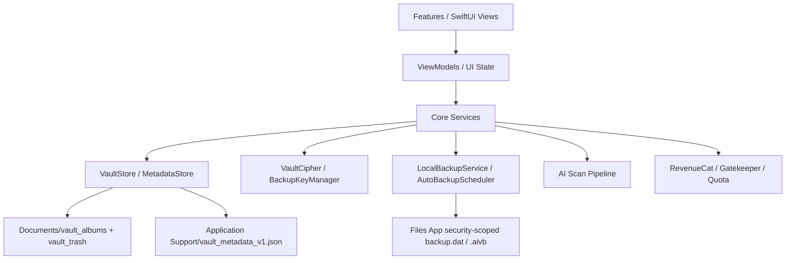

# LumaNox iOS 技术方案

本文基于 Android 成熟实现、现有 iOS 工程、iOS 交接文档与 UX/Pen 规范整理，用于指导 LumaNox iOS 端后续实现、补齐与验收。

## 1. 产品功能总览

LumaNox 是一个隐私优先、完全离线的照片与视频保险箱。核心承诺是：媒体只保存在本机，文件落盘前加密，所有搜索、AI 分析、备份与恢复都不依赖云端服务。

### 1.1 核心业务域

| 业务域 | 产品能力 | Android 参考 | iOS 当前状态 | iOS 目标 |
|---|---|---|---|---|
| 启动与锁 | Splash、首次 PIN 设置、PIN 解锁、生物识别、后台超时锁 | `SplashScreen` / `LockScreen` | 已有真实 PIN、Keychain、Face ID/Touch ID、60s 后台锁 | 补齐首启恢复分支自测与异常恢复文案 |
| 保险箱 | 相册、最近、导入、多选、搜索、真实缩略图 | `HomeScreen` / `AlbumScreen` / `VaultSearchScreen` | 已有真实导入、AES-CBC 密文、metadata、真实缩略图 | 完善相册操作、多选批量行为与权限状态 |
| 媒体查看 | 图片查看、视频播放、删除、信息、分享/导出、打码入口 | `PhotoViewerScreen` / `VideoPlayerScreen` | 已有图片/视频解密预览、删除/恢复、分享临时文件 | 强化临时明文生命周期、信息字段、打码入口传参 |
| 回收站 | 30 天保留、恢复、永久删除 | `TrashBinScreen` | 已有移动、列表、恢复、清除 | 增加过期自动清理策略与批量操作 |
| 私密相机 | 拍照、录像、前后摄、闪光灯、直接入库不进系统相册 | `PrivateCameraScreen` | 已有 AVFoundation 拍照与长按录像入库 | 真机验证权限、闪光灯、录像稳定性 |
| 备份恢复 | 手动 `.aivb`、自动 `backup.dat`、Argon2id、跨端包格式 | `LocalBackupMvpService` / `BackupPackageV1` | 已有手动/自动备份、恢复、Android 兼容包格式 | 交叉恢复测试、进度状态、失败可恢复路径 |
| AI 助手 | 清理、敏感审查、分类、隐私打码 | `AiLocalScanUseCase` / `PrivacyRenderer` | 已有 Vision/图像质量/dHash 本地分析骨架和 metadata 写入；Pen、增量扫描、手动 ROI、导出分享仍需补齐 | 按 `docs/ai-assistant-technical-plan.md` 稳定跨端 AI 助手闭环 |
| 导出 | 批量导出、导出进度、结果、无水印会员门控 | `BulkExportScreen` / `ExportProgressScreen` | 当前偏 mock | 接入 metadata 与真实解密导出 |
| 订阅与配额 | RevenueCat、Paywall、Vault/AI/Backup quota | `PaywallGatekeeper` / `QuotaManager` | 已有 RevenueCat 骨架、门控模型、Paywall UI | 完成产品 ID、错误态、恢复购买与埋点闭环 |
| 设置与法务 | 安全、备份、数据、语言、关于、隐私政策、服务条款 | `SettingsDetailScreens` / `LegalWebViewScreen` | 设置页大多可导航，部分占位 | 拆分一页一 Pen，接入真实设置和本地 HTML |

## 2. 当前 iOS 工程基线

### 2.1 已具备的基础

- SwiftUI 工程，入口：`ios/LumaNox/App/LumaNoxApp.swift`。
- 路由定义：`ios/LumaNox/Core/Navigation/AppRoute.swift`，路由渲染：`RouteDestinationView.swift`。
- 设计系统：`LNColor`、`LNTokens`、`LNButton`、`LNNavigationBar`、`LNDialog`、`VaultMediaGridCard`。
- 本地化：`ios/LumaNox/Resources/*.lproj/Localizable.strings` + `L10n`。
- Vault 真实数据层：`VaultStore` + `VaultMetadataStore`，索引位于 `Application Support/LumaNox/vault_metadata_v1.json`。
- 真实媒体缩略图：`VaultMediaThumbnailView` 会解密图片/视频并生成缩略图。
- 备份包：`BackupPackageV1` 已对齐 Android `AIVAULT\x01` v1 包格式。

### 2.2 主要缺口

| 优先级 | 缺口 | 影响 |
|---|---|---|
| P0 | AI 扫描链路已接入 metadata，但 iOS 仍缺少单飞/增量跳过、固定样本回归和完整 Privacy Redact 导出分享闭环 | AI 核心卖点尚未达到发布级稳定 |
| P0 | 批量导出未接入真实 media selection/decrypt/share | 数据出入口不完整 |
| P1 | 设置、AI、Backup、Export 多数页面仍是分组 Pen | 后续 UI 对齐成本高 |
| P1 | 法务 WebView 仍需本地 HTML 与语言选择策略 | 合规页面不足 |
| P1 | 跨端备份恢复需要 Android ↔ iOS 双向验证 | 备份兼容声明存在风险 |
| P2 | 自动备份依赖 BGTask，周期不可精确 | 需要 UX 文案降低确定性预期 |

## 3. iOS 总体架构

### 3.1 分层



### 3.2 约定

- UI：SwiftUI + MVVM，页面通过 `AppRouter` 进入各 Tab 独立导航栈。
- 数据源：加密文件是事实源；metadata 是可重建索引，不作为唯一事实源。
- 安全：Keychain 保存数据密钥和 PIN 哈希；备份密钥由 PIN + Argon2id 派生，只在解锁后缓存。
- 视觉：每个可路由页面一份 `.pen`，Pen 是视觉源，Android 是行为源。
- 本地化：所有用户可见文本必须通过 `L10n`。

## 4. 关键模块技术方案

### 4.1 启动、PIN 与生物识别

目标流程：

1. `SplashView` 检查 PIN、自动备份书签与首启恢复条件。
2. 未设置 PIN：进入 PIN 设置；若发现 `backup.dat`，进入 RestoreLogin。
3. 已设置 PIN：进入解锁页，支持 PIN 与 Face ID/Touch ID。
4. 解锁成功：刷新 `BackupSecretsStore` 中的备份密钥，进入主 Tab。
5. App 后台超过 60s：`AppLockManager` 重新要求解锁。

技术要点：

- `SecuritySettingsStore` 继续负责 Keychain PIN 哈希、失败次数和生物识别开关。
- 生物识别只作为解锁凭据，不替代备份 PIN；备份恢复仍用 PIN 派生 Argon2id 密钥。
- 错误次数、放弃备份、重置 setup 状态必须保持可恢复，避免用户卡死在首启恢复。

### 4.2 Vault 存储与元数据

目录规范：

| 数据 | 路径 | 说明 |
|---|---|---|
| 活跃媒体 | `Documents/vault_albums/<album>/asset_<sha256>.<ext>` | AES-CBC 密文 |
| 回收站 | `Documents/vault_trash/<album>/...` | 保留原 album 归属 |
| metadata | `Application Support/LumaNox/vault_metadata_v1.json` | 可重建索引 |
| 视频播放临时文件 | `Caches/LumaNox/...` | 用后清理，启动/退出页清理过期文件 |

实现要求：

- 导入统一经过 `VaultStore.importPlainData` / `importPlainFile`，按明文 SHA-256 去重。
- 媒体列表只读 `VaultMetadataStore.reconcile()` 后的 snapshot。
- 搜索基于文件名、相册名和未来 AI tags/category。
- 缩略图统一走 `VaultMediaThumbnailView`，禁止在内容态展示装饰假图。
- 明文临时文件必须在分享、播放、导出完成后清理；日志不得包含明文路径以外的密钥/PIN。

### 4.3 相册、查看器、回收站

页面：

- `VaultHomeView`
- `AlbumListView`
- `RecentPhotosView`
- `AlbumView`
- `VaultSearchView`
- `PhotoViewerView`
- `VideoPlayerView`
- `TrashBinView`

技术方案：

- 列表统一使用标准媒体 Grid：`VaultMediaGridCard` + `VaultMediaThumbnailView`，输入类型为 `LNMediaItem`。
- 查看器打开时按当前列表顺序建立 path 列表，支持删除后自动跳到下一项。
- 图片查看直接解密为 `UIImage`；视频先解密到 cache，再交给 `AVPlayer`。
- 删除进入回收站应保留 albumName、trashedAtMs；恢复应回到原相册。
- 永久删除后触发 metadata reconcile 与缩略图缓存失效。

### 4.4 私密相机

技术方案：

- AVFoundation 封装在 `CameraSessionController`，UI 只消费相机状态。
- 拍照保存 JPEG 临时文件，录像保存 MOV 临时文件，再通过 `VaultStore.finalizeCameraCapture` 入库。
- 相机产物命名使用 `camera_<timestamp>.<ext>`，source 标记为 `.camera`。
- 拍摄内容不写入系统相册。
- 真机优先验证：权限拒绝、切前后摄、闪光灯、长按录像、后台中断。

### 4.5 备份与恢复

备份包格式：

- Magic：`AIVAULT\x01`
- Header：明文 JSON，包含版本、backupId、createdAtMs、kind、KDF 参数、key fingerprint、asset index。
- Body：AES-256-GCM chunk frames。
- Trailer：`sha256(header_raw || body_raw)`。

实现目标：

- 手动备份：用户通过文件导出 `.aivb`，始终 FULL。
- 自动备份：用户授权 Files 目录，写入/覆盖 `backup.dat`。
- 恢复：读取 header，使用用户 PIN + header KDF 参数派生 backup key，逐 chunk 解密后重新写入 Vault 密文。
- 跨端：保持 Android 与 iOS 备份包字段、chunk、fingerprint、relativePath 兼容。

风险控制：

- 备份/恢复过程串行运行，防止同时写 vault。
- 写文件采用 `.writing` 临时文件 + 原子替换。
- 空保险箱、空间不足、无授权目录、PIN 错误都必须有明确恢复路径。
- 自动备份的 BGTask 不承诺精确时间，冷启时用 catch-up 补跑。

### 4.6 AI 本地分析

跨端整体方案、数据契约、交互规则与里程碑见 `docs/ai-assistant-technical-plan.md`。本节保留 iOS 侧实现要点。

Android 能力基准：

- 清理：模糊图、过曝图、重复图。
- 分类：截图、人物、风景、美食、文档等。
- 敏感审查：证件、银行卡、二维码、人脸、聊天内容等。
- 隐私打码：黑条、白条、马赛克、模糊、椭圆模糊、Emoji 覆盖。

iOS 实施方案：

| 能力 | iOS 技术 | 产出 |
|---|---|---|
| 图片解密输入 | `VaultCipher.decryptFile` + downsample | `UIImage` / `CGImage` |
| 图像质量 | CoreImage / vImage 计算 Laplacian sharpness、亮度直方图 | `cleanupScore`、blurry/overexposed tag |
| 重复检测 | pHash/dHash Swift 实现 + Hamming distance 聚类 | duplicate group |
| 分类 | Vision `VNClassifyImageRequest` 或轻量 CoreML model | `category`、`tags` |
| 敏感文本 | Vision OCR `VNRecognizeTextRequest` + regex | text/card/id 命中 |
| 人脸 | Vision `VNDetectFaceRectanglesRequest` | face regions |
| 条码/二维码 | Vision barcode request | barcode regions |
| 隐私渲染 | CoreImage / CGContext ROI 渲染 | 新密文媒体或导出临时文件 |

数据落点：

- 首期直接写 `VaultMediaRecord.ai` 字段：`scannedAtMs`、`sensitiveScore`、`cleanupScore`、`category`、`tags`。
- 若 AI 结果增多，再扩展 `VaultAiMetadata` 或拆分 `ai_results_v1.json`，避免 metadata 文件过大。

调度：

- 解锁后、导入后、拍照后可触发增量扫描。
- 扫描用 `Task.detached(priority: .utility)`，并发限制 2-3 张，避免 UI 卡顿和内存暴涨。
- UI 展示 `AiScanProgress`，支持手动重扫。

### 4.7 批量导出

目标：

- 从相册、最近、回收站或独立导出页选择多项。
- 导出时逐项解密到临时目录，保留合理文件名。
- 使用 `ShareLink` / `UIActivityViewController` 分享，或通过 Document Picker 保存。
- 进度页支持取消；取消后清理临时文件。
- 无水印导出接入 `ProFeature.exportNoWatermark` 门控。

### 4.8 订阅与配额

技术方案：

- `BillingBootstrap` 启动时配置 RevenueCat。
- `SubscriptionService` 负责 offerings、购买、恢复购买、customer info。
- `PaywallGatekeeper` 统一控制：
  - Vault import free quota
  - Backup monthly quota
  - AI monthly quota
  - Export no watermark pro-only
- 业务入口只调用 `router.guardProFeature(_:)`，不在 UI 里散落 RevenueCat 判断。

验收：

- API key 来自 `ios/Config/Local.xcconfig`，不得提交真实 key。
- Paywall 支持 loading、ready、error、已订阅、恢复购买成功/失败。
- iOS 产品 ID 与 RevenueCat entitlement 要与 Android 产品策略一致。

### 4.9 设置、法务与本地化

设置拆分：

- `SettingsSubscriptionView`
- `SettingsSecurityView`
- `SettingsBackupSyncView`
- `SettingsDataStorageView`
- `SettingsGeneralView`
- `SettingsAboutView`
- `ChangePinView`
- `StorageUsageView`
- `LanguageSettingsView`
- `LegalWebView`

要求：

- 所有设置页拆出独立 `.pen`。
- 法务页面加载本地 HTML，按当前语言选择 `zh-Hans` / `en`。
- 语言切换如需 App 内即时生效，应抽象 `LanguageManager` 等价层；首期可退化为系统语言说明。

## 5. 页面与 Pen 交付策略

每个可路由页面必须对应一份 `.pen`：

| 阶段 | 工作 |
|---|---|
| 现有整理 | 将 `AIViews.pen`、`SettingsViews.pen`、`CameraViews.pen` 拆成一页一 Pen |
| 新页面 | 先创建 Pen，再写 SwiftUI |
| UI 修改 | 先更新 Pen，再改 SwiftUI |
| 验证 | 模拟器截图与 Pen 对照，偏差需要同步修正 |

优先拆分顺序：

1. AI：`AIHomeView`、`AICleanupView`、`AISensitiveReviewView`、`AIClassifyView`、`PrivacyRedactView`
2. Backup/Export：进度和结果页要服务真实业务
3. Settings：六个设置子页、PIN、语言、法务
4. Camera：Home 与全屏相机

## 6. 开发里程碑

### M1：基础闭环稳定

- 完成现有 P0 自测：PIN、导入、查看、回收站、相机拍照、手动备份、自动备份。
- 补齐关键页面 accessibilityIdentifier。
- 修复发现的明文临时文件清理和 metadata reconcile 问题。

### M2：导出与设置真实化

- 批量导出接入真实 media selection。
- 导出进度、结果、取消清理完整可用。
- 存储占用、备份同步、订阅、安全设置接真实状态。
- 法务 HTML 和语言策略落地。

### M3：AI MVP

- 建立 `AiScanService` 与 `VaultAiMetadata` 写入路径。
- 实现质量评分、重复检测、基础分类。
- AI 首页、清理、分类详情从 metadata 读取真实结果。

### M4：敏感审查与隐私打码

- Vision OCR、人脸、条码检测。
- 敏感 review 列表按风险排序。
- `PrivacyRedactView` 支持 ROI 编辑、样式选择、预览和保存。

### M5：订阅与发布准备

- RevenueCat 产品、entitlement、恢复购买、Paywall 状态打通。
- Android ↔ iOS 备份交叉恢复通过。
- 真机完成相机、Face ID、Files 书签、后台自动备份验证。

## 7. 验证标准

每次 iOS 代码变更后执行：

```bash
cd ios
xcodegen generate
xcodebuild -scheme LumaNox -project LumaNox.xcodeproj -sdk iphonesimulator -destination 'platform=iOS Simulator,name=iPhone 16' build
xcrun simctl install booted build/Build/Products/Debug-iphonesimulator/LumaNox.app
xcrun simctl launch booted com.xpx.vault
xcrun simctl io booted screenshot /tmp/lumanox-sim/latest.png
```

文档-only 变更无需跑模拟器，但必须说明未运行原因。

发布前必须通过 `docs/ios-self-test.md` 中 P0 用例：

- 首启 PIN、PIN 解锁、错误 PIN、RestoreLogin。
- 导入、图片查看、视频播放。
- 删除到回收站、恢复。
- 私密相机拍照且不入系统相册。
- 手动备份与恢复。
- 自动备份目录授权与 `backup.dat` 写入。

## 8. 主要风险与决策

| 风险 | 建议决策 |
|---|---|
| AI 结果写入 metadata 导致 JSON 膨胀 | MVP 先写摘要，后续结果多时迁移到独立 AI index |
| iOS BGTask 不保证准点 | 产品文案用“自动同步/尽快同步”，冷启补跑 |
| 备份跨端兼容 | 建立固定样本包和 Android/iOS 双向回归脚本 |
| 视频解密临时文件暴露窗口 | cache 目录隔离、页面退出删除、启动清理过期 |
| RevenueCat 网络失败影响离线承诺 | 已购状态缓存；核心本地 vault 功能不依赖网络 |
| Pen 与 SwiftUI 漂移 | 代码评审强制检查目标 Pen 和模拟器截图 |

## 9. 近期推荐任务清单

1. 跑一次 iOS P0 自测，更新 `docs/ios-session-handoff.md` 的真实状态。
2. 拆分 `AIViews.pen`，并按 `docs/ai-assistant-technical-plan.md` 补齐 AI 扫描稳定化与 Privacy Redact 闭环。
3. 实现批量导出真实链路，优先覆盖最近/相册选择导出。
4. 增加 Android ↔ iOS `.aivb` 固定样本回归。
5. 补齐法务本地 HTML 与 `LegalWebView`。
