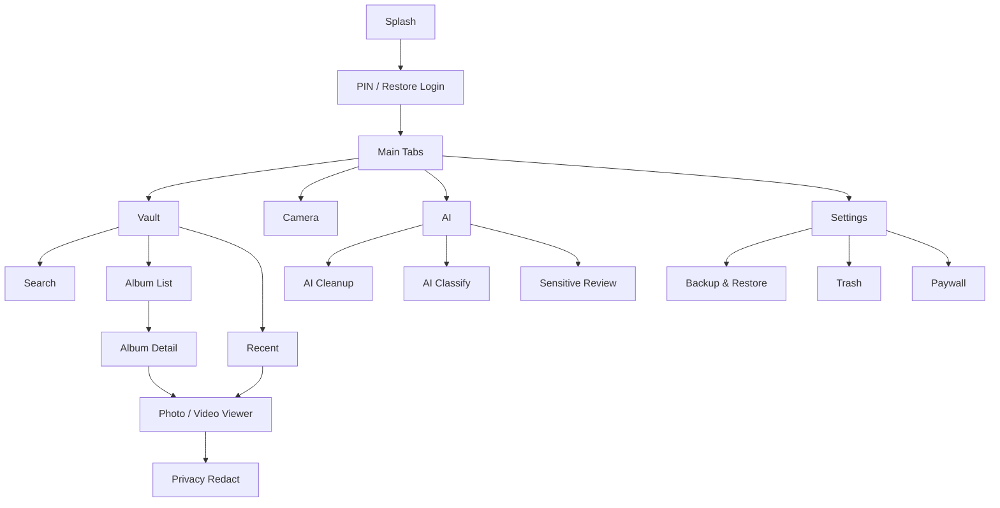

# LumaNox iOS UX 规范

本文定义 LumaNox iOS 端的产品体验、信息架构、页面状态、组件行为与验收标准。`docs/ios-ux-guidelines.md` 偏实现规则，本文偏产品 UX 规格；当两者冲突时，以最新 Pen 视觉稿、Android 行为参考和本文的业务状态定义共同裁决。

## 1. 产品体验定位

LumaNox 是一个隐私优先、完全离线、可信赖的照片与视频保险箱。UX 的核心目标不是炫技，而是让用户明确感到：内容已经被加密、只在本机处理、可以安全导入、查看、恢复、导出和备份。

### 1.1 体验关键词

| 关键词 | 设计含义 | 反例 |
|---|---|---|
| 私密 | 页面默认克制，避免泄露媒体内容以外的信息 | 过度展示文件路径、明文目录、调试信息 |
| 可靠 | 每个高风险操作都有确认、反馈和恢复路径 | 删除后无提示、备份失败只显示未知错误 |
| 本地 | 强调离线处理和本机加密，但不写成长篇说明 | 使用云同步、AI 上传、账号绑定暗示 |
| 高效 | 媒体浏览、导入、批量选择必须低摩擦 | 频繁弹窗、重复确认、列表跳动 |
| 原生 | 系统能力按 iOS 习惯呈现 | 强行复刻 Android 控件或交互 |

### 1.2 用户心智

- 用户把 LumaNox 当作安全空间，而不是普通相册。
- 用户愿意为导入、解锁、备份多做一步，但不能忍受不确定。
- 用户最害怕的三件事是：媒体丢失、隐私泄露、备份无法恢复。
- UX 必须优先消除这些恐惧，而不是优先展示功能数量。

## 2. 信息架构

### 2.1 主导航

主界面使用 4 个 Tab：

| Tab | 主要任务 | 首屏重点 | 空态主操作 |
|---|---|---|---|
| Vault | 导入、浏览、搜索、相册、最近 | 最近媒体 + 相册入口 | 导入照片/视频 |
| Camera | 拍摄私密照片/视频 | 私密相机入口和安全提示 | 打开相机 |
| AI | 清理、分类、敏感审查、打码 | 当前建议 + 3 个核心入口 | 扫描保险箱 |
| Settings | 安全、备份、订阅、存储、关于 | 安全状态 + 设置分组 | 完成必要设置 |

底部 Tab 必须稳定存在于主界面，二级页面隐藏底栏或保持不干扰内容。全屏相机、Paywall、系统 Picker 使用 modal 或 full screen。

### 2.2 页面层级



### 2.3 路由呈现原则

| 场景 | 呈现方式 | 原因 |
|---|---|---|
| 普通二级页面 | Push | 保持返回路径清晰 |
| 私密相机 | Full screen | 拍摄需要沉浸和权限控制 |
| Paywall | Modal | 可由多个入口触发，和原任务保持上下文 |
| PhotosPicker / DocumentPicker | System modal | 使用 iOS 原生授权与文件交互 |
| 备份/恢复进度 | Push，禁用误返回 | 长任务需要稳定进度上下文 |
| 删除/永久删除 | Dialog / confirmation | 高风险操作必须二次确认 |

## 3. 全局视觉规范

### 3.1 色彩

| Token | Hex | 用途 |
|---|---|---|
| `bgBottom` | `#05080D` | 全局深色背景 |
| `bgTop` | `#0B1324` | 顶部背景渐变 |
| `sectionBg` | `#0C1523` | 分组容器和卡片 |
| `navBarBg` | `#0E1726` | 底部 Tab、顶栏按钮 |
| `brandBlue` | `#4A9EFF` | 主操作、选中态、进度 |
| `title` | `#EAF1FF` | 一级文字 |
| `subtitle` | `#8EA2C0` | 次级文字 |
| `stroke` | `#223247` | 边框、分割线 |
| `error` | `#FF4372` | 删除、失败、危险 |
| `success` | `#21C277` | 成功、完成 |
| `amberWarning` | `#E8C547` | 敏感、会员、风险提醒 |

禁止把单个色相铺满所有界面。深色是基底，强调色只用于选择、行动和状态。

### 3.2 字体

使用 iOS system font，支持动态字号。字号不要随屏幕宽度缩放。

| 角色 | 字号 | 字重 | 用途 |
|---|---:|---|---|
| Display | 28-32 | Bold | Splash、锁屏主标题 |
| Page Title | 22-24 | Bold | 二级页面标题 |
| Section Title | 16-18 | Semibold | 分组标题 |
| Body | 14-15 | Regular | 正文、说明 |
| Label | 11-12 | Medium | 计数、标签、时间 |
| Button | 16 | Semibold | 主按钮 |

### 3.3 间距与圆角

| Token | 值 | 用途 |
|---|---:|---|
| 页面左右边距 | 16pt | 主内容边距 |
| 媒体网格间距 | 8pt | 3 列缩略图 |
| 卡片内边距 | 16-20pt | 首页和设置分组 |
| 主按钮高度 | 54pt | 核心 CTA |
| 次按钮高度 | 48pt | 次级 CTA |
| 触摸目标 | >=44pt | 所有可点元素 |
| 缩略图圆角 | 12pt | 媒体网格 |
| 卡片圆角 | 16-20pt | 主要容器 |
| 弹窗圆角 | 22pt | Dialog |

### 3.4 图标

- 使用 SF Symbols，保持线宽和填充风格一致。
- 危险操作用 `trash`、`xmark`、`exclamationmark.triangle` 等熟悉符号。
- 不用装饰性插图替代真实媒体缩略图。
- 图标按钮必须有 `accessibilityLabel`。

## 4. 全局交互规范

### 4.1 导航

- 二级页面顶部必须有返回按钮和标题。
- 返回按钮触摸区域不小于 44x44pt。
- 备份、恢复、导出等长任务进行中时，返回必须弹出取消确认或禁用。
- 任何页面不能出现两个同级返回路径，例如同时有系统导航返回和页面内巨大返回按钮。

### 4.2 按钮

| 类型 | 用途 | 视觉 |
|---|---|---|
| Primary | 当前页面最推荐操作 | `brandBlue` 背景，白字 |
| Secondary | 可选操作 | 暗色背景，浅色文字 |
| Danger | 删除、永久删除、放弃备份 | 暗红背景或红色文字 |
| Ghost | 低优先级文本操作 | 无背景，次级文字 |

一个页面最多一个主 CTA。危险按钮不能和主按钮使用相同颜色。

### 4.3 选择与批量操作

- 媒体多选态不改变网格尺寸。
- 选择标记固定在右上角。
- 底部操作栏显示已选数量和可用操作。
- 退出多选时清空选择，不能保留隐藏选择状态。
- 批量删除、批量导出必须有进度或完成反馈。

### 4.4 状态反馈

每个页面至少考虑以下状态：

| 状态 | 呈现要求 |
|---|---|
| Loading | 局部加载优先，长任务进入进度页 |
| Empty | 明确下一步，主操作可立即执行 |
| Content | 使用真实数据，不用 mock 占位 |
| Error | 说明可恢复动作，如重试、返回、选择文件夹 |
| Permission Denied | 解释用途，提供打开设置入口 |
| Locked / Paywall | 告知限制原因，保留返回原任务路径 |

### 4.5 动效

- 使用系统默认转场和轻量 opacity/scale 反馈。
- 媒体网格滚动必须稳定，不因缩略图加载产生跳动。
- 导入、备份、恢复进度使用可预测的线性进度或分阶段状态。
- 不做夸张、循环、抢焦点的装饰动效。

## 5. 页面 UX 规格

### 5.1 Splash

目标：短暂确认品牌和安全感，然后自动进入正确流程。

必须展示：

- 品牌名 LumaNox。
- 加密或本地隐私的短状态语义。
- 不展示广告、登录、云服务。

跳转规则：

- 已配置 PIN：进入 Lock。
- 未配置 PIN 且无可恢复备份：进入 PIN 设置。
- 未配置 PIN 且发现 `backup.dat`：进入 RestoreLogin。

### 5.2 Lock / PIN / RestoreLogin

目标：让用户快速、安全地进入保险箱。

必须支持：

- 6 位 PIN 设置、确认、解锁。
- PIN 不一致、PIN 错误、错误次数反馈。
- Face ID / Touch ID 引导和手动触发。
- RestoreLogin 输入原备份 PIN。
- 多次恢复失败后可选择放弃备份并创建新保险箱。

UX 约束：

- 键盘区域不能被底部安全区遮挡。
- 错误提示不能把键盘整体挤出可用区域。
- 不显示 PIN 明文。

### 5.3 Vault Home

目标：作为保险箱的工作台，优先帮助用户导入和重新找到内容。

首屏结构：

1. 标题与安全状态。
2. 导入主操作。
3. 最近媒体预览。
4. 相册入口。
5. 搜索与更多入口。

空态：

- 主 CTA：导入照片/视频。
- 次 CTA：打开私密相机。
- 说明要短，强调本机加密。

内容态：

- 最近媒体必须显示真实缩略图。
- 视频显示播放标记或时长。
- 导入中显示局部进度，不阻塞浏览。

### 5.4 Album List / Album Detail / Recent

目标：高效浏览和选择媒体。

Album List：

- 相册卡显示封面、名称、数量。
- 空相册可进入，但要显示导入入口。
- 新建相册使用输入弹窗。

Album Detail：

- 3 列真实媒体网格。
- 支持导入到当前相册。
- 支持进入多选、导出、删除。

Recent：

- 默认按修改时间倒序。
- 作为隐私打码入口池，打开打码时必须传入真实 path。

### 5.5 Search

目标：快速找到保险箱中的媒体。

规则：

- 搜索输入框首屏聚焦。
- 空 query 可展示最近或搜索建议。
- 结果来源包括文件名、相册名、未来 AI 标签。
- 无结果提供清空搜索或返回。

### 5.6 Photo / Video Viewer

目标：安全查看单个媒体，并提供必要操作。

必须支持：

- 图片缩放查看。
- 视频播放、暂停、退出清理临时文件。
- 信息弹窗。
- 分享/导出。
- 删除到回收站。
- 从回收站查看时显示恢复和永久删除。

UX 约束：

- 查看器 UI 可以自动弱化，但操作必须可再次唤起。
- 删除后自动跳到下一项或返回列表。
- 永久删除必须二次确认。

### 5.7 Trash

目标：提供可恢复的安全后悔路径。

规则：

- 显示已删除媒体、删除日期、原相册。
- 恢复为主操作，永久删除为危险操作。
- 空态说明回收站会保留近期删除内容。
- 后续实现 30 天自动清理时，需显示剩余时间或说明。

### 5.8 Private Camera

目标：拍摄后直接进入保险箱，不进入系统相册。

必须支持：

- 权限请求和拒绝态。
- 拍照。
- 长按录像或明确的视频模式。
- 前后摄切换。
- 闪光灯状态。
- 保存成功反馈。

UX 约束：

- 全屏沉浸，避免普通页面卡片化。
- 拍摄按钮、关闭、切摄像头必须适配安全区。
- 保存失败必须提供重试或返回。

### 5.9 Backup / Restore

目标：让用户相信自己可以恢复数据。

Backup Restore 首页：

- 显示自动备份状态：未关联、已关联、上次备份时间、失败。
- 主操作：立即备份或选择备份位置。
- 次操作：从备份恢复。

进度页：

- 显示阶段、进度、数量、当前结果。
- 备份/恢复期间避免误返回。
- 失败时保留错误原因和下一步。

结果页：

- 成功：显示备份 ID、数量、大小、时间。
- 失败：显示原因和可执行操作。

### 5.10 AI

目标：把“本地智能整理”变成可理解、可控的辅助功能。

AI Home：

- 顶部显示一个当前最重要建议。
- 功能入口聚焦 3 个：隐私打码、智能分类、清理重复/模糊。
- 扫描中显示进度，不阻塞用户离开。

AI Cleanup：

- 列出模糊、过曝、重复组。
- 默认不自动删除。
- 一键清理前必须确认，并优先移入回收站。

AI Classify：

- 分类互斥，避免同一张图在多个主分类重复出现。
- 分类详情使用真实媒体网格。

Sensitive Review：

- 按风险排序。
- 每个命中项展示类型和可操作按钮：查看、打码、忽略。
- 不展示过多敏感文本原文。

Privacy Redact：

- 图片画布为主，工具栏为辅。
- 支持样式选择：马赛克、模糊、黑条、白条、Emoji。
- 自动 ROI 可以编辑、删除、追加。
- 保存结果要明确：覆盖、另存为、导出。

### 5.11 Export

目标：可控地把保险箱内容导出为明文副本。

规则：

- 选择来源：最近、相册、搜索结果或手动选择。
- 导出前显示数量和预计大小。
- 进度页支持取消。
- 完成后打开系统分享或保存位置。
- 明确导出内容会离开加密保险箱。

### 5.12 Paywall

目标：解释限制并提供购买，不破坏当前任务。

规则：

- Paywall 必须说明触发来源，例如 AI 次数、备份次数、导出功能。
- 可关闭的 Paywall 显示关闭按钮，不可关闭的必须提供清晰返回路径。
- 购买、恢复购买、加载失败都要有状态。
- 已订阅用户看到的是权益确认或返回。

### 5.13 Settings

结构：

- 订阅与配额。
- 安全与隐私。
- 备份与同步。
- 数据与存储。
- 通用。
- 关于与支持。

规则：

- 设置首页是 hub，不承载复杂操作。
- 子页内设置项必须显示当前状态。
- 危险操作必须放在页面底部或危险区。
- 法务页面使用本地 HTML，跟随语言。

## 6. 内容与文案规范

### 6.1 语气

- 简洁、确定、可信。
- 少用营销词，多说明结果。
- 不制造恐惧，但必须诚实提示风险。

### 6.2 文案模式

| 场景 | 推荐结构 |
|---|---|
| 权限 | “需要 X 权限，用于 Y。内容仍保存在本机。” |
| 备份失败 | “备份未完成。原因：X。你可以 Y。” |
| 删除确认 | “将移入回收站，可在 30 天内恢复。” |
| 永久删除 | “永久删除后无法恢复。” |
| 导出提示 | “导出的副本不再受保险箱加密保护。” |
| AI 扫描 | “正在本机分析，不会上传媒体。” |

### 6.3 本地化

- 所有用户可见字符串必须进入 `Localizable.strings`。
- 中文默认使用简体中文。
- 英文避免过长按钮文案，按钮文本优先 1-3 个词。
- 日期、大小、数量使用系统格式化。

## 7. 权限与隐私规范

| 权限 | 触发时机 | 拒绝态 |
|---|---|---|
| Photos | 用户点击导入时 | 解释导入用途，提供系统设置入口 |
| Camera | 用户打开私密相机时 | 显示开启相机权限按钮 |
| Microphone | 用户开始录像时 | 提示无麦克风将无法录音 |
| Face ID / Touch ID | PIN 设置完成后引导 | 可跳过，之后在设置开启 |
| Files security-scoped bookmark | 用户选择自动备份目录时 | 说明无法自动备份，保留手动备份 |

隐私底线：

- 不上传媒体。
- 不记录 PIN、密钥、备份 key。
- 不长期保留明文导出或播放临时文件。
- 不在错误页暴露完整敏感路径。

## 8. 可访问性规范

- 所有可点元素触摸范围不小于 44x44pt。
- 图标按钮必须有 `accessibilityLabel`。
- 可自动化验证的关键元素必须有 `accessibilityIdentifier`。
- 支持系统动态字号，关键操作不得被截断。
- 错误不能只靠颜色表达，必须有文本或图标。
- 媒体选择状态需要 VoiceOver 可读，例如“已选择，照片 3”。

建议 ID 命名：

| 元素 | Identifier |
|---|---|
| Vault 首页 | `vault_home_view` |
| 导入按钮 | `vault_import_button` |
| 最近网格 | `vault_recent_grid` |
| PIN 键盘 | `lock_pin_keypad` |
| 私密相机快门 | `private_camera_shutter` |
| 备份按钮 | `backup_start_button` |
| AI 首页 | `ai_home_view` |
| Paywall 购买按钮 | `paywall_purchase_button` |

## 9. 响应式与设备适配

目标设备以 iPhone 16 / 393pt 宽为基准，同时适配小屏和 Max 机型。

- 内容区域使用安全区，底部浮动 Tab 不遮挡最后一行内容。
- 媒体网格在 iPhone 上固定 3 列；iPad 后续可扩展为 4-6 列。
- 锁屏键盘、小屏机型和动态字号下不得被遮挡。
- 横屏首期只保证不崩溃；相机和视频播放器优先适配横屏。

## 10. 验收清单

### 10.1 页面级

- 页面有对应 `.pen`。
- SwiftUI 与 Pen 的布局、间距、层级一致。
- 覆盖 loading、empty、content、error、permission denied。
- 所有文案来自 `L10n`。
- 关键控件有 accessibility identifier。

### 10.2 业务级

- 导入后首页和相册显示真实缩略图。
- 删除可恢复，永久删除不可恢复。
- 视频退出后临时明文文件被清理。
- 备份失败不破坏原保险箱数据。
- AI 扫描不上传媒体。
- 导出前明确提示明文副本风险。

### 10.3 验证命令

每次 iOS UI 或行为变更后执行：

```bash
cd ios
xcodegen generate
xcodebuild -scheme LumaNox -project LumaNox.xcodeproj -sdk iphonesimulator -destination 'platform=iOS Simulator,name=iPhone 16' build
xcrun simctl install booted build/Build/Products/Debug-iphonesimulator/LumaNox.app
xcrun simctl launch booted com.xpx.vault
xcrun simctl io booted screenshot /tmp/lumanox-sim/latest.png
```

文档-only 变更无需跑模拟器，但交付时必须说明。

## 11. 与其他文档的关系

| 文档 | 用途 |
|---|---|
| `docs/ios-technical-plan.md` | 技术实现与里程碑 |
| `docs/ios-ux-guidelines.md` | 视觉与实现硬约束 |
| `docs/ios-pen-code-workflow.md` | Pen 到 SwiftUI 的工作流 |
| `docs/ios-parity-spec.md` | Android 到 iOS 页面与行为映射 |
| `docs/ios-self-test.md` | 手动自测用例 |
