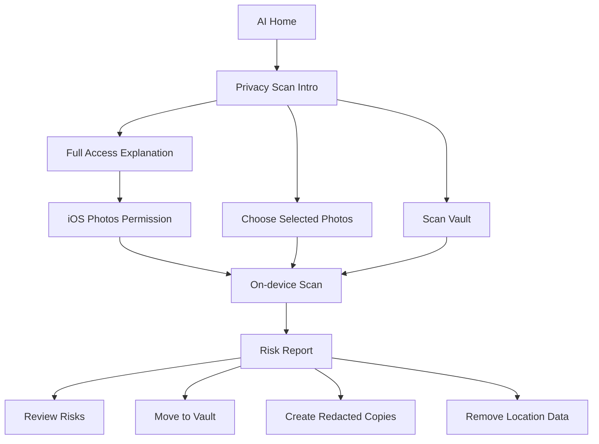

# 隐私风险扫描产品方案

## 1. 功能定位

**Privacy Risk Scan** 是 LumaNox AI 助手下的新核心能力：在不上传任何媒体的前提下，帮助用户发现系统相册或保险箱中可能泄露隐私的照片，并提供移入保险箱、删除原图、去除位置数据、生成脱敏副本等后续处理动作。

一句话定位：

> Find exposed photos before they expose you.

中文产品表达：

> 不只是隐藏照片，而是提前发现会暴露你的照片。

该功能适合成为海外市场的主卖点，因为系统相册已经具备基础隐藏能力，普通 photo vault 只解决“藏起来”，而 LumaNox 可以进一步解决“哪些内容最危险、应该怎么处理”。

## 2. 当前产品结合点

LumaNox 现有基础已经适合承接这个功能：

- 已有 AI 助手入口，包含清理、分类、敏感审查、隐私打码。
- 已有本地 Vision / 图像质量 / dHash 分析骨架，AI 结果可写入 `VaultAiMetadata`。
- 已有真实保险箱数据层，媒体以加密文件为事实源，metadata 是可重建索引。
- 已有隐私打码能力，可保存脱敏副本到保险箱。
- 产品主张是 offline、on-device、zero cloud，天然适合做权限前解释和信任转化。

因此本功能不建议作为完全独立模块，而应作为 AI Tab 的主入口升级：

- AI Home 首屏主卡：`Privacy Risk Scan`
- 原 `Sensitive Review` 作为扫描结果中的一个风险分类
- `Privacy Redact` 作为结果处理动作
- `AICleanup` 与 `AIClassify` 继续作为二级能力

## 3. 用户问题

目标用户在海外市场的核心焦虑：

- 我的相册里有没有证件、银行卡、护照、账单截图？
- 聊天截图、订单截图、旅行截图里有没有地址、电话、二维码？
- 分享照片前，有没有 GPS 位置、车牌、孩子、人脸等敏感信息？
- 我不想把整本相册上传给任何云服务。
- 我也不想一打开 App 就被要求授权所有照片。

产品必须回答两个问题：

- **风险在哪里？**
- **我现在可以怎么安全处理？**

## 4. MVP 范围

### 4.1 扫描对象

MVP 分三层权限与数据范围：

| 层级 | 触发方式 | 权限 | 产品目的 |
|---|---|---|---|
| Selected Photos Scan | 用户主动选择照片 | Limited Photos / Photos Picker | 低压力体验价值 |
| Vault Scan | 扫描已导入保险箱媒体 | 无需系统相册全量权限 | 服务现有保险箱用户 |
| Full Library Scan | 用户主动开启全库扫描 | Full Photos Access | Premium / 高价值能力 |

默认首推 **Selected Photos Scan**，不要冷启动直接请求 Full Access。

### 4.2 识别风险类型

MVP 风险类型：

| 风险 | 例子 | 检测方式 | 默认严重度 |
|---|---|---|---|
| ID / Card | 护照、驾照、身份证、银行卡 | OCR + regex + 图像分类 | High |
| Private Screenshot | 聊天、订单、酒店、航班、地址 | OCR + screenshot 分类 | Medium |
| QR / Barcode | 二维码、条码、票据码 | Vision barcode | Medium |
| Face / People | 人脸、儿童照片 | Vision face | Medium |
| GPS Metadata | EXIF 经纬度 | metadata 读取 | Medium |
| Document / Receipt | 合同、账单、收据 | OCR + 文档分类 | Low / Medium |

不建议 MVP 做裸露内容或成人内容识别作为主卖点，容易带来审核、误判和品牌风险。可以内部保留为 `sensitiveVisual` 标签，先不公开强调。

### 4.3 结果动作

每个风险结果给出 3 类动作：

- **Protect**：移入保险箱，并提示删除系统相册原图与 Recently Deleted。
- **Redact**：生成脱敏副本，支持马赛克、模糊、黑条、去 EXIF。
- **Ignore**：标记为安全，后续扫描降低优先级。

高风险项支持批量动作：

- Move High Risk to Vault
- Create Redacted Copies
- Remove Location Data
- Review One by One

## 5. 权限策略

权限文案不应表达为“访问你的所有照片”，而应表达为“在本机扫描以发现风险”。

### 5.1 推荐权限路径

1. 用户点击 AI Tab 主卡 `Start Privacy Scan`。
2. 进入前置页，默认 CTA 为 `Scan Selected Photos`。
3. 用户先体验选中照片扫描。
4. 完成后，如果发现风险或看到健康分，再引导 `Scan Full Library`。
5. 进入 Full Access 说明页，解释：
   - 分析只在本机进行。
   - 不上传照片。
   - 只保存风险摘要，不长期保存 OCR 原文。
   - 可随时改回 limited access。
6. 用户点击后才触发系统权限弹窗。

### 5.2 权限失败状态

| 状态 | 页面反馈 | 操作 |
|---|---|---|
| Limited Access | 展示已选择照片数量，保留 `Choose More Photos` | 继续扫描选中范围 |
| Denied | 解释需要用户主动选择照片或去设置开启 | `Choose Photos` / `Open Settings` |
| Full Access | 展示可扫描范围和预计时间 | `Start Scan` |

## 6. 高保真设计

视觉稿文件：

- `ios/LumaNox/Features/AI/PrivacyRiskScanView.pen`

导出预览：

- `docs/assets/privacy-risk-scan/YpxRD.png`
- `docs/assets/privacy-risk-scan/J4JIv.png`
- `docs/assets/privacy-risk-scan/Hpu4F.png`
- `docs/assets/privacy-risk-scan/rB9M5.png`

页面说明：

| 页面 | 目的 | 核心信息 |
|---|---|---|
| Permission Intro | 低压力介绍功能 | On-device AI、No upload、Limited access first |
| Full Access Prompt | 系统权限前解释 | 为什么需要 full access、保存什么、不保存什么 |
| Scanning | 扫描中状态 | 进度、当前模块、暂停/隐藏 |
| Results | 扫描结果 | Vault Health Score、风险数、批量处理动作 |

## 7. 核心流程

## 8. 商业化设计

免费层建议：

- 扫描用户主动选择的照片。
- 扫描已导入保险箱的照片。
- 展示风险数量和部分结果。
- 单张脱敏处理。

Premium 层建议：

- Full Library Scan。
- 批量风险处理。
- 自动周期扫描。
- Break-in Alerts / Decoy Vault 后续可与此功能组成隐私套装。
- 批量去 EXIF、批量生成脱敏副本。

付费墙触发点：

- 用户点击 Full Library Scan。
- 用户点击批量处理超过免费额度。
- 扫描完成后展示 `18 risks found`，点击 `Protect all` 时触发。

## 9. 指标

北极星指标：

- 完成一次扫描并处理至少一个风险的用户占比。

关键漏斗：

- AI Home 主卡点击率
- Intro 到 Selected Photos 授权率
- Selected Scan 完成率
- Full Access Prompt 到系统授权率
- 风险结果页处理动作点击率
- 批量处理付费转化率

质量指标：

- 扫描崩溃率
- 单张平均扫描耗时
- 用户标记误报率
- 扫描中退出率
- 权限拒绝率

## 10. 风险与约束

- 不保存完整 OCR 原文，避免把敏感内容从图片转移到 metadata。
- 不自动删除系统相册原图，只给出引导和确认。
- 不承诺 100% 识别风险，文案使用 `can detect` / `helps find`，避免绝对化。
- Full Library Scan 可能耗电，应支持暂停、后台降级和增量扫描。
- iOS Limited Photos 变化后要重新同步可访问资源。
- 用户拒绝权限后仍要能通过 Photos Picker 使用核心体验。

## 11. 实施拆分

### P0

- 新增 `PrivacyRiskScanView` Pen 和 SwiftUI 页面。
- AI Home 新增主入口。
- 支持 selected photos scan 与 vault scan。
- 结果页展示风险分组、数量、健康分。
- 单项进入 Sensitive Review / Privacy Redact。

### P1

- Full library scan 权限路径。
- 批量移入保险箱、批量去 EXIF、批量脱敏副本。
- Premium 门控与用量限制。
- 扫描增量跳过与暂停恢复。

### P2

- 自动周期扫描。
- 风险趋势和 Vault Health Score 历史。
- 场景化扫描模板：Travel、Work、Family、Screenshots。

## 12. 验收标准

- 没有 Full Photos 权限时，用户仍可扫描选中照片。
- 权限弹窗前必须有本地扫描和无上传解释。
- 扫描中可暂停或隐藏，不阻塞用户浏览保险箱。
- 结果页必须优先展示高风险内容。
- 所有风险处理动作必须可恢复或二次确认。
- iOS 用户可见字符串进入 `Localizable.strings`，SwiftUI 不硬编码。
- 新增可路由 UI 必须先有 `.pen`，再实现代码，并用模拟器截图校验。
