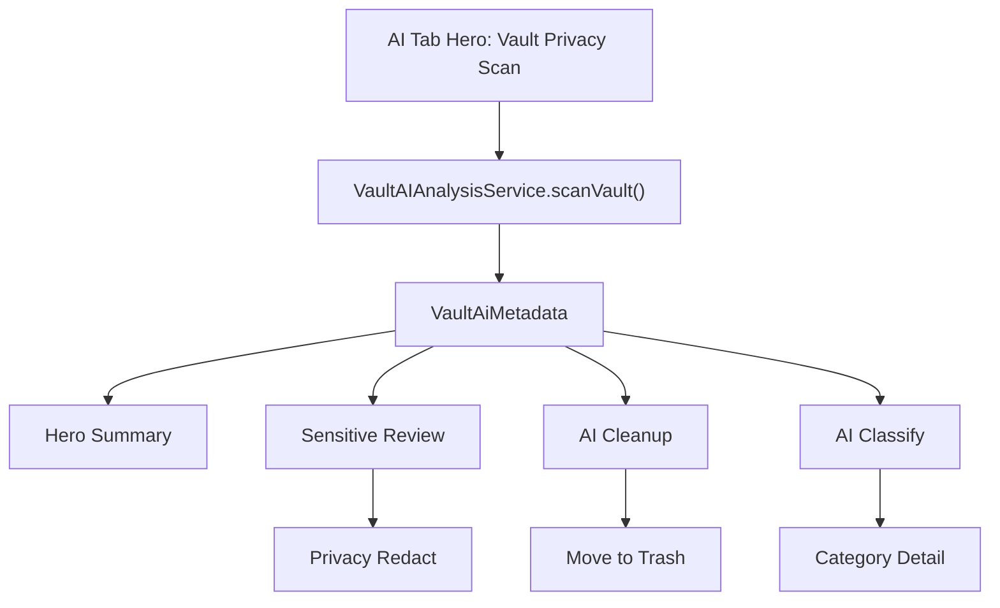

# Vault Privacy Scan 技术方案

## 1. 背景与目标

当前 AI Tab 的 Hero 区域已经承载 `scanVault()` 入口。该入口的产品语义应明确为 **Vault Privacy Scan / 保险箱隐私体检**：只扫描用户已经导入 LumaNox 保险箱的加密媒体，不扫描系统相册，不请求 Photos 全量权限。

目标：

- 将 AI Tab Hero 从普通“开始扫描”升级为保险箱健康入口。
- 一次 Vault scan 同时产出敏感风险、清理建议、智能分类和隐私打码线索。
- 让 Sensitive Review、AI Cleanup、AI Classify、Privacy Redact 消费同一套扫描结果。
- 保持 zero cloud、on-device、encrypted vault only 的信任表达。

非目标：

- 不在本功能内扫描系统相册。
- 不触发 iOS Photos full access 权限。
- 不做自动删除原图。
- 不保存 OCR 原文或明文媒体路径。

## 2. 产品边界

### 2.1 Hero Scan 的定义

Hero Scan 的扫描范围：

- `Documents/vault_albums/**` 下的活跃加密媒体。
- `VaultMetadataStore.activeMediaRecords()` 中可解密、未在回收站的记录。
- 私密相机直接入库的媒体。
- 后续导入后增量加入的媒体。

Hero Scan 不扫描：

- iOS 系统照片库中未导入的照片。
- 回收站媒体。
- 外部文件夹、备份包、临时导出文件。

建议 UI 文案：

- 英文：`Scan encrypted vault`
- 中文：`扫描保险箱`
- 辅助文案：`Checks imported photos only. No Photos permission needed.`

### 2.2 与系统相册扫描的关系

系统相册扫描作为后续扩展，不进入当前 Hero 主路径：

| 能力 | 入口 | 权限 | 商业化 |
|---|---|---|---|
| Vault Privacy Scan | AI Tab Hero | 无系统相册权限 | 免费基础能力 |
| Check Before Import | 导入流程 / AI 次入口 | Photos Picker / Limited Access | 免费体验 |
| Full Library Scan | 风险报告二级入口 | Full Photos Access | Premium |

当前实现优先级只覆盖 Vault Privacy Scan。

## 3. 信息架构

AI Tab 首屏结构建议：

1. 页面标题：AI Assistant。
2. Hero：Vault Privacy Scan。
3. Hero 下方状态条：Vault-only、On-device、No upload。
4. 结果摘要：Sensitive risks、Cleanup suggestions、Smart categories。
5. 功能入口列表：
   - Sensitive Review
   - Smart Cleanup
   - Smart Categories
   - Privacy Redact

Hero 是 AI Tab 的状态聚合器；子功能页是结果处理器。



## 4. 现有工程接入点

| 层 | 当前文件 | 使用方式 |
|---|---|---|
| AI 首页 | `ios/LumaNox/Features/AI/AIViews.swift` | `AIHomeView` 展示 Hero summary |
| 扫描服务 | `ios/LumaNox/Core/AI/VaultAIAnalysisService.swift` | `scanVault()` 作为唯一 Hero scan 入口 |
| 数据源 | `VaultMetadataStore.activeMediaRecords()` | 枚举已导入保险箱媒体 |
| 分析器 | `VaultAIAnalyzer` | 解密、下采样、Vision/OCR/质量/哈希分析 |
| 数据落点 | `VaultMediaRecord.ai` / `VaultAiMetadata` | 写入扫描摘要 |
| 扩展索引 | `VaultAIIndexStore` | 保存 dHash、feature print、subject cluster 等辅助索引 |
| 子页面 | `AISensitiveReviewView` / `AICleanupView` / `AIClassifyView` | 消费 `aiService.records` 与 `aiService.summary` |

## 5. 数据模型

Hero 所需 summary：

```swift
struct VaultAISummary {
    var totalCount: Int
    var scannedCount: Int
    var sensitiveCount: Int
    var cleanupCount: Int
    var categoryCounts: [String: Int]
}
```

建议增加派生字段，不一定持久化：

| 字段 | 计算方式 | 用途 |
|---|---|---|
| `vaultHealthScore` | 基于风险数量、清理数量、扫描覆盖率计算 | Hero 分数 |
| `highRiskCount` | `sensitiveScore >= highRiskThreshold` | Hero 主状态 |
| `needsReviewCount` | sensitive + cleanup 的去重媒体数 | CTA 文案 |
| `lastScannedAtMs` | max(`record.ai.scannedAtMs`) | “Last scan” 文案 |
| `scanCoverage` | `scannedCount / totalCount` | 进度与可信度 |

推荐计算规则：

```text
coveragePenalty = hasUnscanned ? 12 : 0
sensitivePenalty = min(45, highRiskCount * 8 + mediumRiskCount * 4)
cleanupPenalty = min(18, cleanupCount * 2)
vaultHealthScore = clamp(100 - coveragePenalty - sensitivePenalty - cleanupPenalty, 0, 100)
```

分数只作为 UX 摘要，不作为安全承诺。

## 6. 扫描流程

### 6.1 手动扫描

1. 用户点击 Hero CTA `Scan Vault`。
2. `AIHomeView.startScan()` 调用 `VaultAIAnalysisService.scanVault()`。
3. 服务刷新 metadata summary。
4. 读取 active media records。
5. 如果为空，Hero 进入 Empty Vault 状态，引导导入。
6. 如果存在记录，设置 `progress.running = true`。
7. 对每个 record：
   - 若 analyzer version 和 source fingerprint 可复用，则复用旧结果。
   - 否则解密并下采样。
   - 执行 Vision/OCR/条码/人脸/图像质量/dHash。
   - 聚合 `VaultAiMetadata`。
8. 写入 metadata 和 AI index。
9. 发布 summary 和 records。

### 6.2 增量扫描

导入、私密相机入库、解锁后补扫都应使用同一套服务能力，但不抢 Hero 主流程：

- 自动补扫只处理未扫描或 fingerprint 变化的媒体。
- 自动补扫不扣用户可见额度。
- Hero 如果检测到 `hasUnscanned == true`，显示 `New vault photos need scanning`。

### 6.3 单飞与取消

当前 `scanVault()` 已通过 `guard !progress.running else { return }` 避免重复启动。后续建议补齐：

- `scanTask: Task<Void, Never>?`
- `cancelScan()`：用户点 Pause 时取消剩余任务。
- 取消后保留已写入结果，Hero 显示 `Scan paused`。
- 下次点击继续只扫未扫描或 fingerprint 变化项。

## 7. Hero 状态机

| 状态 | 判断 | Hero 主标题 | 主 CTA | 次 CTA |
|---|---|---|---|---|
| Empty Vault | `totalCount == 0` | No vault photos to scan | Import Photos | Open Private Camera |
| Unscanned | `hasUnscanned == true` | Check your encrypted vault | Scan Vault | View tools |
| Scanning | `progress.running` | Scanning encrypted vault | Pause | Hide |
| Risk Found | `sensitiveCount > 0` | Privacy risks need review | Review Risks | Rescan |
| Cleanup Found | `cleanupCount > 0` | Cleanup suggestions ready | Review Cleanup | Rescan |
| All Clear | scanned all + no risk | Your vault looks clean | Scan Again | View categories |
| Error | `lastError != nil` | Scan could not finish | Try Again | View details |

状态优先级：

`Scanning > Error > Empty > Risk Found > Cleanup Found > Unscanned > All Clear`

## 8. 子功能融合

### 8.1 Sensitive Review

入口状态：

- Hero `Risk Found` 的主 CTA 进入 `AISensitiveReviewView`。
- 功能列表中 Sensitive Review 的状态 badge 显示风险数量。

数据规则：

- 按 `sensitiveScore` 降序。
- 标签展示 `id_card`、`bank_card`、`barcode`、`face`、`text`、`contact`。
- 不展示 OCR 原文。
- 操作：Review、Redact、Ignore。

### 8.2 AI Cleanup

入口状态：

- Hero 在无敏感风险但有清理建议时，主 CTA 进入 `AICleanupView`。
- 功能列表 badge 显示 cleanup count。

数据规则：

- `blurry`、`overexposed`、`duplicate` 进入清理候选。
- 删除必须先确认，默认移入回收站。

### 8.3 AI Classify

入口状态：

- 扫描完成后展示类别数和媒体数。
- 可作为 All Clear 状态的次 CTA。

数据规则：

- `categoryCounts` 为空时显示 `Scan`。
- 非空时显示 `Live` 或类别数。

### 8.4 Privacy Redact

入口状态：

- 从 Sensitive Review 的候选媒体进入。
- AI Tab 也可保留独立入口，但文案应是 `Redact a photo`，不是 `Scan`.

数据规则：

- ROI 来自当前媒体实时检测或已有 `redactionHints`。
- 保存为新的加密副本，不覆盖原文件。

## 9. 权限与隐私

Vault Privacy Scan 不需要系统相册权限。原因：

- 媒体已经导入保险箱。
- 解密由本地 Vault key 完成。
- 扫描输入来自 app 沙盒内密文文件。

UI 必须避免误导：

- 不使用 `library scan` 表述。
- 不使用 `all photos` 表述。
- 明确写 `imported vault photos only`。

日志约束：

- 不记录 OCR 原文。
- 不记录 PIN、密钥、明文临时文件完整路径。
- 不记录人脸、证件区域截图。

## 10. 付费与配额

建议商业化边界：

| 能力 | 免费 | Premium |
|---|---|---|
| Vault scan | 可用 | 更高频/自动增量 |
| 单张风险处理 | 可用 | 不限量 |
| 批量 Protect / Redact | 限额 | 不限量 |
| Full Library Scan | 不在本期 | Premium 后续 |
| 自动周期扫描 | 不在本期 | Premium 后续 |

配额建议：

- 手动 Vault full scan 可计入 AI monthly quota。
- 自动增量扫描不计入用户可见额度。
- 子功能批量处理按 action 次数或处理数量计费。

## 11. 实施拆分

### P0：AI Tab Hero 融合

- 独立 `AIHomeView.pen`，展示 Empty、Ready、Scanning、Risk Found 状态。
- 调整 Hero 文案为 Vault-only。
- Hero CTA 绑定现有 `scanVault()`。
- Hero 根据 `VaultAISummary` 选择主 CTA 目标。
- 子功能列表复用 summary badge。

### P1：扫描可恢复性

- 增加 cancel / pause。
- 增量扫描只处理未扫描或 fingerprint 变化项。
- 增加 `vaultHealthScore` 派生计算。
- 补齐 Error 状态。

### P2：高级增长能力

- Check Before Import。
- Full Library Scan。
- 自动周期扫描。
- 风险趋势报告。

## 12. 验收标准

- AI Tab Hero 文案明确为扫描保险箱，不暗示系统相册。
- 空保险箱时不允许启动 scan，主 CTA 是导入。
- 扫描中展示进度，不泄露文件名、路径、OCR 原文。
- 扫描完成后 Sensitive / Cleanup / Classify 三个入口状态同步更新。
- 无系统相册权限时，Vault scan 仍可工作。
- 所有 UI 文案进入 `Localizable.strings`。
- Pen 与 SwiftUI 一致；实现阶段需运行 iOS 模拟器截图验证。

## 13. 高保真稿

视觉源：

- `ios/LumaNox/Features/AI/AIHomeView.pen`

预览导出：

- `docs/assets/vault-privacy-scan/xaNFl.png`：空保险箱
- `docs/assets/vault-privacy-scan/mjpaV.png`：待扫描
- `docs/assets/vault-privacy-scan/xkTnU.png`：扫描中
- `docs/assets/vault-privacy-scan/uaKsu.png`：发现风险

评审重点：

- Hero 主语必须是 encrypted vault / imported photos，不出现 all photos 或 photo library。
- Hero chip 固定传达 `Encrypted vault only` 和 `No Photos permission`。
- 主 CTA 随状态变化，而不是新增独立扫描入口。
- 子功能入口的数字和状态来自同一份 Vault scan summary。
