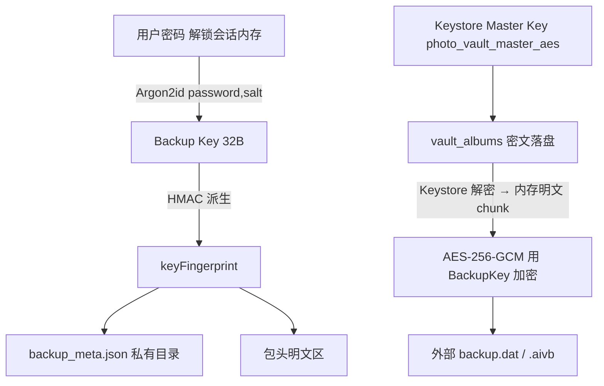
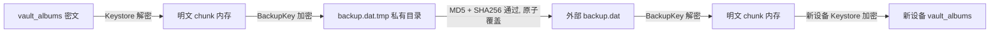
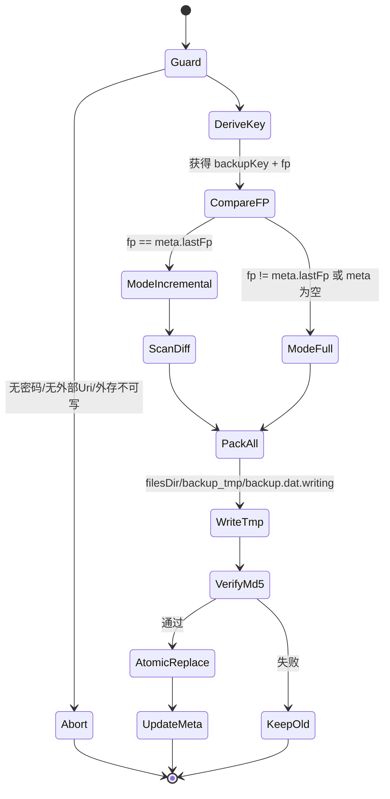
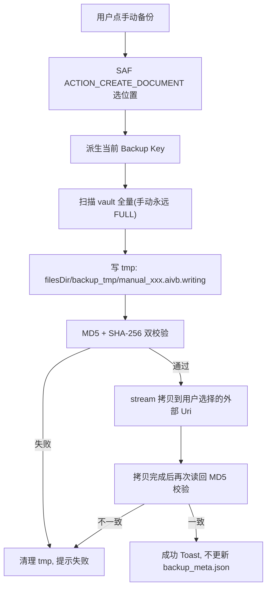
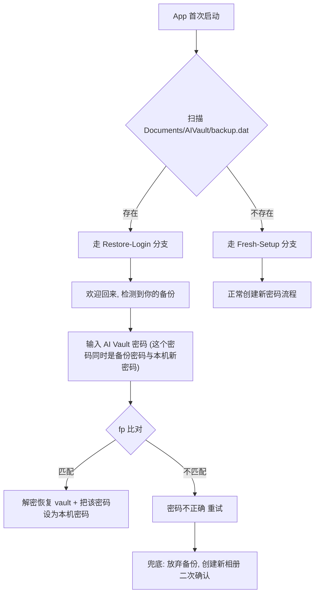
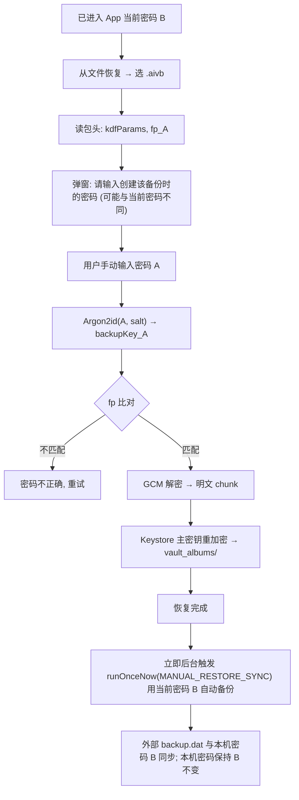
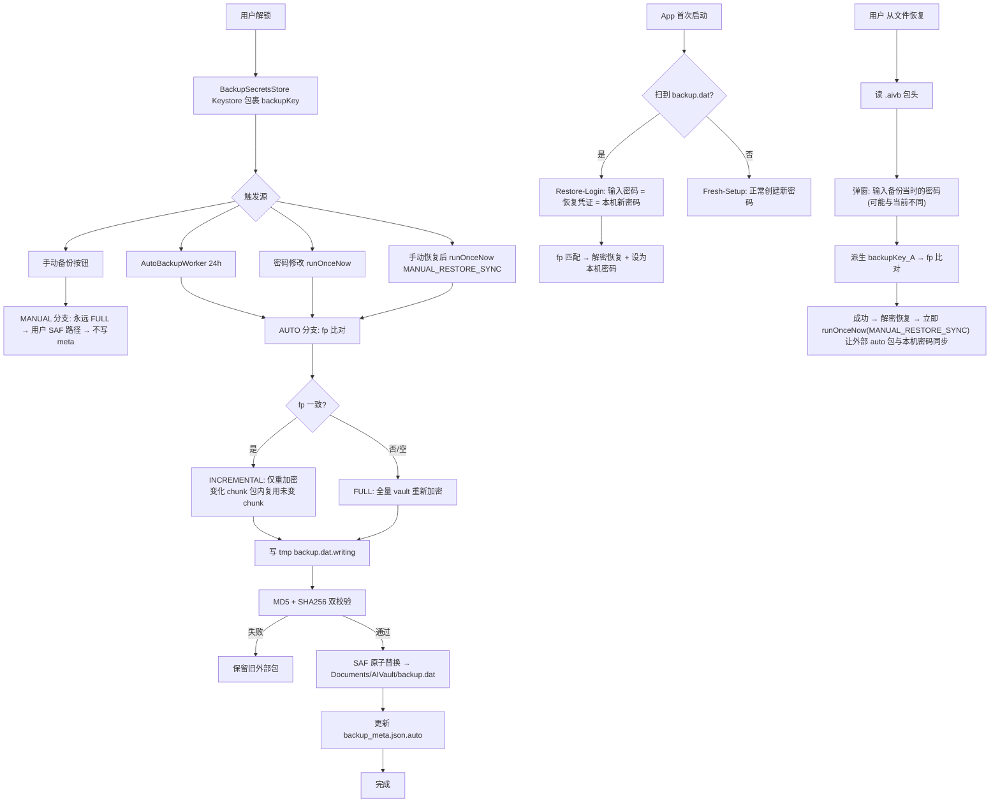

0. 本版核心结论（先看这一节）

1. **两套密钥并存、职责分明**：
   - **Vault Master Key**（Android Keystore，不出设备）→ 负责本地 `vault_albums/` 日常加解密。
   - **Backup Key**（由当前 App 密码经 Argon2id 派生）→ 仅负责备份包的加解密。
   - 备份时通过「Keystore 解密 → BackupKey 重加密」桥接；恢复反向。**明文永不落盘**。
2. **自动备份 = 覆盖式单文件**，手动备份 = 追加式多文件快照。
3. **密码变更检测** 通过 `keyFingerprint = HMAC-SHA256(backupKey, "aivault.fp.v1")[:16]` 实现；不同 → 全量重打包 + 新密码加密 + 原子覆盖。
4. **恢复必须用户输入密码**（架构硬约束）：
   - 自动包恢复：合并到"首启流程分叉"里，**用"输入密码"代替"新建密码"**，用户无感。
   - 手动包恢复：必须弹窗让用户手动输入**创建该备份时**的密码，恢复完毕立即触发一次当前密码自动备份同步外部。
5. **不采用"独立恢复密码"方案**（用户要记两套密码、反向优化）；Phase 2 可选 BIP39 恢复短语。

---

## 1. 背景与目标

### 1.1 现状速评（基于源码审读）


| 维度         | 现状                                                                             | 风险                                                       |
| ------------ | -------------------------------------------------------------------------------- | ---------------------------------------------------------- |
| 备份密钥来源 | 首次备份随机`UUID` 存 `SharedPreferences("backup_crypto_prefs")`，与用户密码无关 | App 数据被清 → 外部备份永远无法解密；密码变更不触发重加密 |
| 外部备份位置 | 默认写`filesDir/vault_backups_mvp/`，仅手动 `exportBackupsToUri` 才到外部        | 用户换机场景无法无感恢复T                                  |
| 版本策略     | `MAX_BACKUP_VERSIONS = 2` + `baseBackupId` 增量链                                | 当链长 ≥ 3 时`pruneOldBackups` 删除父备份 → 恢复残缺     |
| 导入流程     | `root.deleteRecursively()` 后再解压                                              | 中途中断 → 旧备份与新备份同时丢失                         |
| 主密钥       | `photo_vault_master_aes` 托管于 Keystore，硬件保护                               | 不可导出 → 换机后 vault 字节级文件仍不可解                |

### 1.2 新方案目标

1. 只保留一份外部自动备份，固定路径覆盖更新。
2. 密码变更即重加密，外部包始终以当前密码加密。
3. 恢复过程原子化，中断不丢数据。
4. 换机/重装/清数据可恢复（用户记得当前密码即可）。
5. 手动备份支持用户自管理多份快照。

---

## 2. 术语定义


| 术语                 | 含义                                                                                                  |
| -------------------- | ----------------------------------------------------------------------------------------------------- |
| **Vault Master Key** | Keystore 中 AES-256 主密钥（`photo_vault_master_aes`），用于 `vault_albums/` 日常加解密，**不出设备** |
| **Backup Key**       | `Argon2id(password, salt)` 派生的 AES-256 密钥，仅用于备份包加解密，运行时即用即算即销毁              |
| **Key Fingerprint**  | `HMAC-SHA256(backupKey, "aivault.fp.v1")[:16]` hex，用于判断"当前密码是否与上次备份密码一致"          |
| **backup.dat**       | 外部自动备份包（固定单文件，覆盖式更新）                                                              |
| **.aivb**            | 手动备份包扩展名（用户自选位置，多份快照）                                                            |
| **backup_meta.json** | App 私有目录元信息（最后一次自动备份的 fp、时间、KDF 参数等），不含任何密码/密钥                      |

---

## 3. 总体架构

### 3.1 双密钥体系



### 3.2 数据流（备份 vs 恢复）



---

## 4. 密钥管理

### 4.1 `BackupKeyManager`（新增）

```kotlin
package com.xpx.vault.data.crypto

data class KdfParams(
    val algorithm: String = "Argon2id",  // fallback: PBKDF2WithHmacSHA256
    val saltHex: String,                 // 32B random，per-install
    val iterations: Int = 3,             // Argon2 time cost
    val memoryKb: Int = 64 * 1024,       // 64 MB
    val parallelism: Int = 1,
)

data class BackupKeyMaterial(
    val key: SecretKey,                  // AES-256
    val fingerprintHex: String,          // 16B hex
    val kdfParams: KdfParams,
)

interface BackupKeyManager {
    fun getOrCreateKdfParams(): KdfParams
    fun deriveKey(password: CharArray, params: KdfParams): BackupKeyMaterial
    fun fingerprint(key: SecretKey): String
}
```

- Salt 首次安装随机生成 32B，落在 EncryptedSharedPreferences。
- **绝不存** 密码明文、派生 key 字节。
- 每次使用 `CharArray` 传入，用完立即 `fill(0)` 清零。

### 4.2 Fingerprint 规范

```
keyFingerprint = HMAC_SHA256(key = backupKey, msg = "aivault.fp.v1").toHex().take(32)
```

- 固定 domain-separator 防撞值。
- 16B 足以比对且不泄露 key。

### 4.3 算法选型


| 用途               | 算法                                                                     | 说明                                      |
| ------------------ | ------------------------------------------------------------------------ | ----------------------------------------- |
| 口令 → Backup Key | **Argon2id**（mem=64MB, t=3, p=1）/ 回退 PBKDF2-HMAC-SHA256 ≥ 200k iter | 抗 GPU 暴力破解；低端机内存降到 32MB, t=4 |
| 备份包对称加密     | **AES-256-GCM**（每 chunk 独立 12B IV + 16B Tag）                        | 有认证                                    |
| vault 内部加密     | 维持 AES-256-CBC + PKCS7（Keystore 强制）                                | 兼容存量数据                              |
| Fingerprint        | HMAC-SHA256 + domain separator                                           | -                                         |


## 5. 备份流程

### 5.1 两种备份模式的语义差异


| 类型                | 外部位置                           | 文件名                                | 覆盖策略               | 密码语义                 | 写 meta |
| ------------------- | ---------------------------------- | ------------------------------------- | ---------------------- | ------------------------ | ------- |
| **自动备份 Auto**   | 固定`Documents/AIVault/backup.dat` | 单文件                                | **覆盖式**             | 当前密码                 | ✅      |
| **手动备份 Manual** | 用户 SAF 选位置                    | `AIVault_Backup_yyyyMMdd_HHmmss.aivb` | **追加式**（多份快照） | 触发时刻密码（快照语义） | ❌      |

> **设计理念**：
>
> - 自动 = 无感知的"最新状态镜像" → 永远一份、永远能用当前密码解。
> - 手动 = 用户明确的"时间点快照" → 任意多份；日后密码变了，旧手动包仍需当时的密码恢复（这是快照语义的自然结果）。

### 5.2 自动备份触发来源


| 来源           | 触发点                                                                             | 前置条件                                    |
| -------------- | ---------------------------------------------------------------------------------- | ------------------------------------------- |
| 手动按钮       | 设置页"立即备份"                                                                   | App 已解锁；外部 Uri 已授权                 |
| 周期调度       | `AutoIncrementalBackupWorker`（24h）                                               | 同上 +`BackupSecretsStore` 有缓存 backupKey |
| 密码变更       | `ChangePasswordUseCase` 调用 `AutoBackupScheduler.runOnceNow(PASSWORD_CHANGED)`    | 解锁会话内                                  |
| 手动恢复后同步 | `ManualRestoreViewModel.onRestoreSuccess()` 调用 `runOnceNow(MANUAL_RESTORE_SYNC)` | 刚恢复完                                    |

### 5.3 自动备份执行状态机



### 5.4 密码变化判定

```kotlin
val current = backupKeyManager.deriveKey(password, meta?.kdfParams ?: newParams)
val mode = when {
    meta == null -> Mode.FULL
    current.fingerprintHex != meta.keyFingerprintHex -> Mode.FULL
    else -> Mode.INCREMENTAL
}
```

- **FULL**：忽略历史，全量 vault 重新加密写入新包。
- **INCREMENTAL**：依然产出一份完整 `backup.dat`（对外只存一份），内部打包时仅对变化资产重新读+重加密，未变化的 chunk 复用上次包内密文（需记录 `reuseFrom` 索引）。

### 5.5 原子覆盖（SAF 适配）

SAF/MediaStore 不支持 POSIX rename，实现为：

1. 写入外部 `backup.dat.writing`
2. `flush + fsync`，计算 MD5
3. 校验通过后：
   - 若存在 `backup.dat` → rename 为 `backup.dat.bak`
   - rename `backup.dat.writing` → `backup.dat`
   - 删除 `backup.dat.bak`
4. **App 启动时自检修复**：
   - 仅 `.writing` → 删除
   - 仅 `.bak` → rename 回 `backup.dat`
   - 同时存在 `backup.dat + .bak` → 保留前者，删除 `.bak`

### 5.6 手动备份流程



**硬性规则**：

- 手动包 **永远 FULL**。
- **不触碰** `backup_meta.json`。
- 文件名带时间戳 + 可选备注：`AIVault_Backup_20260429_153012_beforeTrip.aivb`。
- 与自动包**共用 v1 包格式**，恢复代码路径统一。

### 5.7 自动备份守卫（`AutoIncrementalBackupWorker`）

```kotlin
override suspend fun doWork(): Result {
    if (!AutoBackupScheduler.isEnabled(context)) return Result.success()
    if (!BackupSecretsStore.hasCachedKey()) return Result.success()
    if (!ExternalBackupLocation.isWritable(context)) return Result.retry()
    return if (LocalBackupMvpService.createBackup(context, BackupTrigger.AUTO).success)
        Result.success() else Result.retry()
}
```

---

## 6. 密码生命周期与缓存

### 6.1 Worker 如何拿到当前密码

自动备份不能弹解锁页，设计三种策略（落地首选 A）：


| 策略                             | 描述                                                                                 | 取舍                                         |
| -------------------------------- | ------------------------------------------------------------------------------------ | -------------------------------------------- |
| **A. Keystore 包裹缓存（首选）** | 解锁成功后派生`backupKey`，用 Keystore AES-GCM 包裹存私有目录；Worker 启动即解包可用 | key 不落明文；重启设备后首次仍需用户解锁一次 |
| B. 仅前台自动备份                | 只在已解锁会话内执行                                                                 | 错过窗口不备份                               |
| C. 手动确认触发                  | 非自动                                                                               | 备用                                         |

首选 **A**：`BackupSecretsStore` 负责 Keystore 包裹的 `backupKey` 缓存；密码修改时同步刷新缓存。

### 6.2 密码修改联动

`ChangePasswordUseCase` 成功后：

1. 用新密码派生 `newBackupKey` 和 `newFingerprint`
2. 刷新 `BackupSecretsStore` 缓存
3. `AutoBackupScheduler.runOnceNow(PASSWORD_CHANGED)` 立即触发一次全量备份

---

## 7. 恢复流程

### 7.1 总原则

**恢复必须用户输入密码**，这是架构上不可省略的硬约束：

- 备份包里**没有**密码明文、**没有** backupKey 字节（否则明文泄露）
- 新设备/清数据后**没有** Keystore 原主密钥
- 生物识别依赖本机 Keystore，新设备无效

> 能做的优化是：把"输入密码"**合并进用户原本就要做的动作**（首次解锁），而不是"新增一个步骤"。

### 7.2 首启流程分叉（P0）



**关键规则**：

1. 首启**不再强制**"创建新密码"：检测到外部备份时改为"输入密码恢复"。
2. 输入的密码**同时承担**"恢复凭证 + 本机新密码"双重身份。
3. **必须保留兜底**：`放弃备份，创建新相册` 入口，避免卡死登录页。
4. 放弃备份后暂不删外部 `backup.dat`（防反悔），在新密码的下次自动备份里自动 FULL 覆盖。

### 7.3 手动包恢复（必须手动输入原始密码）



**关键规则**：

1. 必须**弹窗手动输入** A。
2. 手动包密码验证失败的文案：`创建备份时使用的密码可能与当前密码不同`（避免用户反复试当前密码）。
3. 失败 ≥ 3 次：追加提示 `若实在回忆不起，可放弃此备份`，提供退出入口。
4. **不做**次数锁死（Argon2id 已承担暴力破解成本）。
5. 恢复成功后**必须**触发一次当前密码的自动备份，让外部自动包与本机密码对齐。
6. A 仅作一次性解密凭证，`CharArray` 用完立即清零。

### 7.4 UI 文案差异化


| 恢复来源   | 文案                                             |
| ---------- | ------------------------------------------------ |
| 首启自动包 | `请输入你的 AI Vault 密码`                       |
| 手动 .aivb | `请输入创建该备份时的密码（可能与当前密码不同）` |

两种场景**必须**使用不同的文案，避免用户把"当前密码"与"备份密码"概念混淆。

### 7.5 断点续传

- 每个 asset 恢复前检查 `vault_albums/<relativePath>` 是否已存在且 sha256 匹配 → 跳过。
- 记录 `restore_progress.json` 于私有目录，中断后续启。

## 8. 数据结构与文件格式

### 8.1 `backup_meta.json`（App 私有目录）

```json
{
  "version": 1,
  "auto": {
    "lastBackupId": "bkp_1714372800000_ab12cd34",
    "lastBackupAtMs": 1714372800000,
    "keyFingerprintHex": "8f3c...e2",
    "kdfParams": {
      "algorithm": "Argon2id",
      "saltHex": "a1b2...",
      "iterations": 3,
      "memoryKb": 65536,
      "parallelism": 1
    },
    "externalUri": "content://...",
    "assetIndex": [
      { "relativePath": "default/IMG_0001.jpg", "sha256": "...", "sizeBytes": 238471 }
    ]
  },
  "manualHistory": [
    {
      "createdAtMs": 1714200000000,
      "uri": "content://...manual_20260428_101500.aivb",
      "sizeBytes": 512000000,
      "note": "换机前备份"
    }
  ]
}
```

**规则**：

- `auto.*` 由自动备份写入，手动备份**绝不触碰**。
- `manualHistory` 仅存元信息位置，**不存 fingerprint / kdfParams**（用户可能线下删文件）。

### 8.2 包格式（v1，自动/手动通用）

```
+---------------------------------------------------+
| MAGIC        | 8 B   | "AIVAULT\x01"              |
| VERSION      | 4 B   | int32 = 1                  |
| HEADER_LEN   | 4 B   | int32                      |
| HEADER_JSON  | N B   | 见下                       |
| BODY         | M B   | 多个 ChunkFrame            |
| TRAILER      | 36 B  | sha256(Header+Body) hex    |
+---------------------------------------------------+
```

**HeaderJson**（明文，不含密钥）：

```json
{
  "version": 1,
  "backupId": "bkp_1714372800000_ab12cd34",
  "createdAtMs": 1714372800000,
  "kind": "AUTO | MANUAL",
  "kdfParams": { "...": "..." },
  "keyFingerprintHex": "8f3c...e2",
  "cipher": "AES-256-GCM",
  "assets": [
    {
      "relativePath": "default/IMG_0001.jpg",
      "sha256Hex": "...",
      "sizeBytes": 238471,
      "chunkRange": { "fromFrame": 0, "count": 1 }
    }
  ]
}
```

**ChunkFrame**（BODY 顺序写入）：

```
+--------------+--------+
| IV           | 12 B   |  随机
| CIPHER_LEN   | 4 B    |  int32
| CIPHER_TEXT  | N B    |
| GCM_TAG      | 16 B   |
+--------------+--------+
```

### 8.3 兼容与迁移

- 旧 `vault_backups_mvp/<bkp_xxx>/volume_xxx.bin.enc + manifest.json.enc` 结构视为 **v0**，只在恢复时只读兼容，且依赖**同设备旧 seed**（seed 丢失则无法恢复，明确提示）。
- 升级后首次自动备份即切换到 v1，`Documents/AIVault/backup.dat` 正式启用。
- v1 稳定 2 个发布周期后，启动引导里清理 `filesDir/vault_backups_mvp/`。

---

## 9. 异常与边界场景


| 场景                         | 处理                                                                                                        |
| ---------------------------- | ----------------------------------------------------------------------------------------------------------- |
| 备份途中杀进程/断电          | 外部旧`backup.dat` 未被覆盖；`.writing` / `.bak` 下次启动自检清理                                           |
| 用户手动删除外部`backup.dat` | 启动时若读取失败 → 下次 Worker 走 FULL 重建；设置页常驻提示`Do not delete AI Vault Backup in your gallery` |
| 外部 Uri 权限丢失            | Worker 返回`Result.retry()`；UI 引导重新授权                                                                |
| 密码被重置（旧密码遗忘）     | 旧外部包 fingerprint 对不上 → 恢复流程报`PasswordMismatch`；**Phase 2** 可用 BIP39 恢复短语替代            |
| 磁盘空间不足                 | 写 tmp 前`StatFs.availableBytes < 2 × estimatedSize` → 提前失败，不覆盖外部                               |
| 并发手动+自动                | `Mutex` 互斥 `createBackup`，后到者直接返回 `AlreadyRunning`                                                |
| Argon2 OOM                   | 低端机（`ActivityManager.memoryClass < 128`）降到 memory=32MB, iter=4                                       |
| 手动恢复输错 A 多次          | 仅提示不锁死；≥3 次追加"忘记密码提示"                                                                      |

---

## 10. 与现有代码的改造映射

### 10.1 新增


| 文件                                                           | 职责                         |
| -------------------------------------------------------------- | ---------------------------- |
| `data/crypto/BackupKeyManager.kt`                              | KDF + fingerprint            |
| `data/crypto/Argon2idKdf.kt`（引入 `de.mkammerer:argon2-jvm`） | Argon2id 实现                |
| `ui/backup/BackupSecretsStore.kt`                              | Keystore 包裹 backupKey 缓存 |
| `ui/backup/ExternalBackupLocation.kt`                          | SAF Uri 持久化 + 原子覆盖    |
| `ui/backup/BackupPackageV1.kt`                                 | v1 格式读写                  |
| `ui/backup/BackupMeta.kt`                                      | `backup_meta.json` 读写      |
| `ui/setup/RestoreLoginScreen.kt`                               | 首启恢复登录页               |
| `ui/setup/FirstLaunchRouter.kt`                                | 首启分叉路由                 |

### 10.2 修改


| 现有文件                                     | 改造点                                                                                              |
| -------------------------------------------- | --------------------------------------------------------------------------------------------------- |
| `LocalBackupMvpService.engine()`             | **删除** 明文 UUID seed 派生；改为接收外部传入 `SecretKey`                                          |
| `LocalBackupMvpService.createBackup`         | 新增`trigger: BackupTrigger` 分叉；AUTO 走 fp 比对 + 原子覆盖；MANUAL 永远 FULL + stream 到 SAF Uri |
| `LocalBackupMvpService.restoreLatest`        | 改为从外部`backup.dat` 读取；走 v1/v0 双格式分支                                                    |
| `LocalBackupMvpService.importBackupsFromUri` | 新命名`restoreFromFileUri`，要求输入密码；写 tmp → 校验 → 原子替换                                |
| `AutoIncrementalBackupWorker`                | 加前置守卫（密码缓存、外存可写）                                                                    |
| `AutoBackupScheduler`                        | 新增`runOnceNow(reason)`；密码变更/手动恢复后立即触发                                               |
| **删除**                                     | `MAX_BACKUP_VERSIONS` / `pruneOldBackups` / `baseBackupId` / `buildManifestChain`                   |
| **删除**                                     | `BACKUP_CRYPTO_PREFS` / `BACKUP_CRYPTO_SEED` 明文 seed                                              |

### 10.3 保留

- `KeystoreSecretKeyProvider` + `AesCbcEngine`（vault 内部热路径加密）
- `PasswordHasher`（仅做 PIN 校验哈希，不再承担 seed→key 派生职责）

### 10.4 `LocalBackupMvpService` 新签名示意

```kotlin
enum class BackupTrigger { AUTO, MANUAL }

suspend fun createBackup(
    context: Context,
    trigger: BackupTrigger,
    targetUri: Uri? = null,  // MANUAL 必填
): BackupExecutionResult

suspend fun restoreFromAutoPackage(
    context: Context,
    password: CharArray,     // 首启 Restore-Login 输入
): RestoreExecutionResult

suspend fun restoreFromManualFile(
    context: Context,
    fileUri: Uri,
    password: CharArray,     // 手动弹窗输入
): RestoreExecutionResult
```

---

## 11. 测试用例

### 11.1 单元测试


| 用例                                                         | 预期 |
| ------------------------------------------------------------ | ---- |
| `BackupKeyManager.deriveKey` 相同密码+salt → key 与 fp 稳定 | ✅   |
| 不同密码 → 不同 fingerprint                                 | ✅   |
| Argon2id 不可用 → 回退 PBKDF2 且 params 记录算法名          | ✅   |
| `BackupPackageV1` 读写回环（100 asset + 多 chunk）           | 无损 |
| GCM chunk 篡改 1 bit → 解密异常                             | ✅   |
| `CharArray` 密码用完 → `fill(0)` 清零                       | ✅   |

### 11.2 集成测试（Instrumentation）


| 用例                                                      | 预期                                        |
| --------------------------------------------------------- | ------------------------------------------- |
| 首次自动备份 → 外部生成`backup.dat` + `backup_meta.json` | ✅                                          |
| 再次自动（密码未变） → INCREMENTAL，backup.dat 被覆盖    | ✅                                          |
| 修改密码后 Worker 立即触发                                | FULL，新 fp 写入 meta                       |
| 备份途中 kill 进程                                        | 启动清理`.writing`；`backup.dat` 完好       |
| 用户删除外部`backup.dat`                                  | 下次 Worker FULL 重建                       |
| **换机恢复（首启自动包）**：输入正确密码                  | 成功恢复 + 该密码设为本机密码               |
| 换机恢复：输入错误密码                                    | GCM 认证失败，提示重试                      |
| **连续 3 次手动备份**                                     | 外部出现 3 个时间戳各异 .aivb               |
| 手动备份后立即自动备份                                    | 仅覆盖`backup.dat`，3 个手动包不受影响      |
| **改密码后用旧手动包恢复**：输入**旧密码**                | ✅ 成功；随后自动触发一次当前密码 auto 备份 |
| 改密码后用旧手动包恢复：输入**新密码**                    | ❌ 明确提示"密码可能与当前不同"             |
| 自动 + 手动并发触发                                       | Mutex 保证后到者`AlreadyRunning`            |

### 11.3 性能基线


| 场景                         | 目标            |
| ---------------------------- | --------------- |
| Argon2id 派生（64MB/3 iter） | 中端机 < 1s     |
| 1GB vault 全量备份           | < 90s（含 I/O） |
| 1GB vault 增量备份（0 变化） | < 10s           |

---

## 12. 开发任务拆分（建议执行顺序）

1. **T1** 新增 `BackupKeyManager` + 单元测试。
2. **T2** 新增 `BackupPackageV1` 读写 + 单元测试。
3. **T3** 新增 `ExternalBackupLocation`（SAF 持久化 + 原子覆盖）。
4. **T4** 新增 `BackupSecretsStore`（Keystore 包裹 backupKey）。
5. **T5** 改造 `LocalBackupMvpService`（`trigger` 分叉 + fp 比对 + FULL/INCREMENTAL + 原子覆盖）。
6. **T6** 改造 `AutoIncrementalBackupWorker` + `AutoBackupScheduler.runOnceNow`。
7. **T7** 密码修改链路接入 `runOnceNow(PASSWORD_CHANGED)`；手动恢复成功链路接入 `runOnceNow(MANUAL_RESTORE_SYNC)`。
8. **T8** 首启分叉路由：`RestoreLoginScreen` + `FreshSetupScreen`。
9. **T9** 设置页 UI：SAF 授权、自动备份开关、手动备份按钮、手动备份历史、常驻提示。
10. **T10** 手动恢复弹窗（差异化文案）+ 失败重试策略。
11. **T11** v0 兼容只读分支。
12. **T12** 集成测试 + 性能基线。

---

## 13. 风险与 Phase 2 增强

### 13.1 风险

- **Argon2 内存参数** 低端机 OOM → 机型自适应必须做。
- **SAF 目录被系统清理** → 固定 `Documents/AIVault/` 并避免进 MediaStore 相册索引（用 mimeType `application/octet-stream`）。
- **用户误删外部包** → 常驻提示 + 下次自动重建。

### 13.2 Phase 2 增强：BIP39 恢复短语（可选）

- 用户可在"高级设置"生成 12 个单词恢复短语（App **不存**，用户自行抄写）。
- 短语 → Argon2id → KEK
- `backup.dat` 包尾追加"用 KEK 加密的 backupKey 副本"
- 改密码时同步刷新副本（backupKey 每次重算）
- 忘记密码时可用短语恢复
- **Phase 1 暂不做**（用户基数小、数据量有限、增加 UI 复杂度）


## 14. 一图总览



---

**文档维护**：每次改动同步更新版本号与「10. 与现有代码的改造映射」「11. 测试用例」两节。